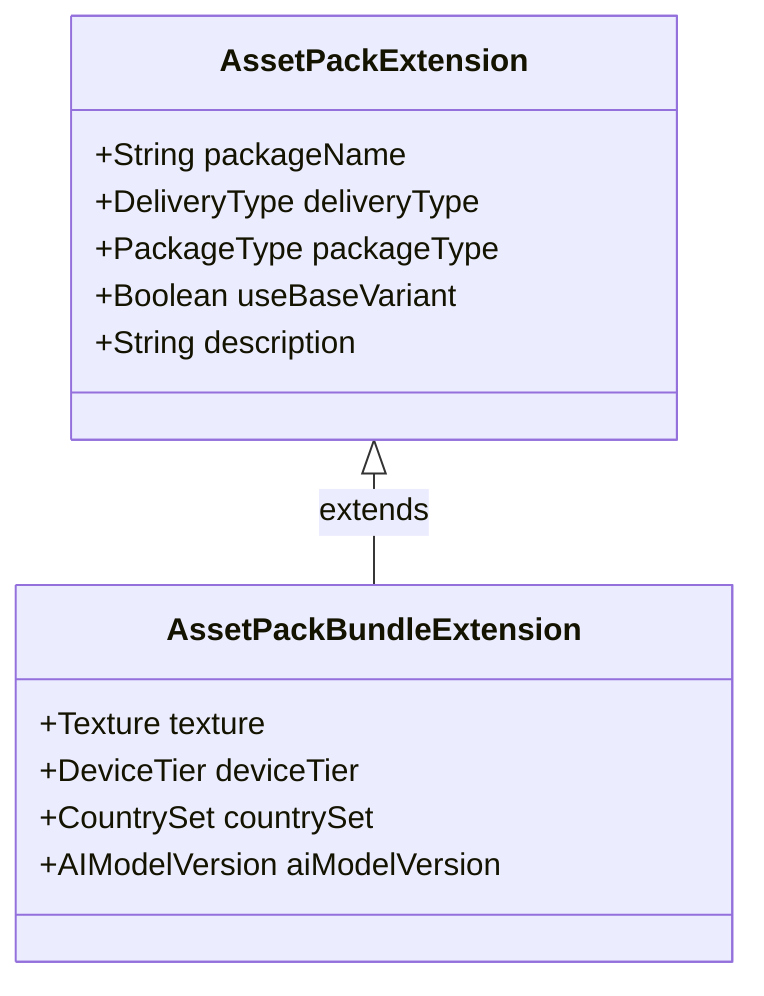
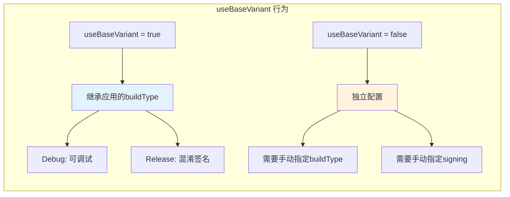

# 21.1.85 AssetPackExtension

太阳已经完全升起来了。

金色的阳光穿透薄雾，在湖面上洒下一片碎金。洛芙用手遮挡着刺眼的阳光，看着波光粼粼的湖面发呆。昨夜的露营仿佛还在眼前，但现在已经是全新的的一天。

“洛芙，发什么呆呢？”

希尔的声音从身后传来，洛芙回头一看，她正端着几杯热腾腾的咖啡走了过来。

“黛琳呢？”洛芙接过咖啡，感受到杯壁传来的温度。

“在那边整理白板呢。”伊莎指了指远处，“她说要把昨天没讲完的内容补完。”

洛芙顺着伊莎手指的方向看去，黛琳已经架好了白板，正低头写着什么。晨风吹过她的发梢，带来一丝凉意。

“昨天我们讲了AssetPackBundleExtension，”黛琳抬起头来笑着说，“今天我们来讲讲它的基础——AssetPackExtension。所有的资产包配置都离不开这个接口。”

---

## 资产包的基础：AssetPackExtension

希尔递过来一台笔记本电脑：“我昨天查了一下文档，AssetPackExtension是更基础的接口，AssetPackBundleExtension是继承它的。”

黛琳点点头：“没错。就像露营时，AssetPackExtension像是帐篷的骨架，而AssetPackBundleExtension是帐篷的防水布——两者缺一不可，但骨架决定了帐篷的基本形状。”

她拿起白板笔，在白板上画了一个简单的继承关系图：



“你看，”黛琳解释道，“AssetPackExtension定义了所有资产包都必须有的基础属性：包名、分发类型、包类型、是否使用基础变体等等。AssetPackBundleExtension在此基础上增加了纹理、设备层级、国家地区、AI模型等高级配置。”

洛芙好奇地问：“那我们怎么配置AssetPackExtension呢？”

“很简单，”希尔调出代码示例，“就在asset pack模块的build.gradle里配置。”

---

## 包名与分发类型

希尔敲出一段代码：“先来看最基本的配置——包名和分发类型。”

```kotlin
// asset_pack 模块的 build.gradle.kts
android {
    // AssetPackExtension 的基础配置
    
    // 1. 包名（必须）
    // 资产包的唯一标识符
    namespace = "com.example.campingapp.texture"
    
    // 2. 分发类型（必须）
    // 决定资产包何时下载
    bundle {
        // 分发类型：按需下载
        deliveryType = DeliveryType.ON_DEMAND
        
        // 或者：安装时下载
        // deliveryType = DeliveryType.INSTALL_TIME
        
        // 或者：快速跟进下载
        // deliveryType = DeliveryType.FAST_FOLLOW
    }
}
```

黛琳补充道：“分发类型是AssetPackExtension最核心的配置之一。”

她扳着手指头解释：

“**OnDemand**——按需下载，用户需要时才从Play商店下载。比如游戏关卡、AR模型这些功能模块，用户点进去才开始下载。**InstallTime**——安装时下载，和主应用一起下载，适合必须用到的核心资源。**FastFollow**——安装后快速跟进，应用安装完成后立即开始下载，但不影响应用的初始使用体验。”

洛芙举手提问：“那……如果我要做一个游戏，初始界面需要用到的纹理算哪种？”

“InstallTime。”黛琳说，“玩家打开游戏第一眼就要看到的东西，不能让他们等下载。但关卡地图、角色皮肤这些，就可以用OnDemand，玩到时才下载。”

---

## 包类型与基础变体

希尔继续展示代码：“接下来是包类型和基础变体的配置。”

```kotlin
android {
    bundle {
        // 包类型
        // APP: 作为应用的一部分安装
        // ASSET: 独立资产包，按需下载
        packageType = PackageType.ASSET
        
        // 是否使用基础变体
        // true: 资产包会使用应用的基础变体配置
        // false: 资产包独立配置
        useBaseVariant = true
    }
}
```

伊莎轻声说：“就像露营时~有的东西要随身带着~有的可以放在营地里~等需要时再取~”

“对！”黛琳笑着说，“PackageType.ASSET就是放在营地里的，按需获取；PackageType.APP就是随身带着的。”

她详细解释：

“**PackageType.APP**——这种资产包会作为应用的一部分安装到用户设备上，不能单独删除。通常用于应用核心功能必须用到的资源。**PackageType.ASSET**——独立资产包，可以单独下载、更新、删除。用户可以在Play商店里看到这些包，也可以选择删除它们来节省空间。”

洛芙问：“useBaseVariant呢？这个是做什么的？”

“这个问题问得好。”黛琳点点头，“useBaseVariant决定了资产包是否使用应用的基础变体（base variant）的配置。如果设为true，资产包会继承应用的buildType配置，比如debug还是release。如果设为false，资产包需要自己配置所有的build选项。”



---

## 资源压缩与分发大小

希尔调出下一段配置：“还有一个重要的配置是资源压缩。”

```kotlin
android {
    bundle {
        // 资源压缩配置
        // 控制资产包中资源的压缩方式
        
        // 是否压缩assets目录中的文件
        compressAssets = true
        
        // 是否压缩native库
        // no: 不压缩，Play商店会自行处理
        // lzma: 使用LZMA压缩
        // lz4: 使用LZ4压缩
        compressNativeLibs = CompressionOption.LZ4
        
        // 资源分发大小的粗略估计
        // 用于Play商店显示下载大小
        // 实际大小可能因设备而异
        estimatedSize {
            // 估计大小（字节）
            sizeInBytes = 50 * 1024 * 1024  // 50MB
            
            // 压缩后估计大小
            compressedSizeInBytes = 30 * 1024 * 1024  // 30MB
        }
    }
}
```

黛琳解说道：“压缩配置对下载体验影响很大。**LZMA**压缩率最高，但解压慢，适合不急于使用的资源。**LZ4**解压快，适合需要快速加载的资源。Play商店会根据网络情况和设备自动选择最优的分发方式。”

洛芙似懂非懂地点头：“那……我们配置estimatedSize是为什么呢？”

“为了让用户在下载前知道大概要花多少流量。”希尔说，“Play商店会显示一个估计的下载大小，帮助用户决定是否在WiFi下下载。”

---

## 完整配置示例

黛琳把所有的配置整合在一起：“现在我们来看一个完整的AssetPackExtension配置示例。”

```kotlin
// texture_pack/build.gradle.kts

plugins {
    id("com.android.asset-pack")
}

assetPack {
    // AssetPackExtension 完整配置
    
    // 包名（必须）
    // 唯一标识这个资产包
    packName.set("texture_pack")
    
    // 分发类型（必须）
    // ON_DEMAND: 按需下载
    deliveryType.set(DeliveryType.ON_DEMAND)
    
    // 包类型（必须）
    // ASSET: 独立资产包
    packageType.set(PackageType.ASSET)
    
    // 是否使用基础变体
    // true: 继承应用的build配置
    useBaseVariant.set(true)
    
    // 资产包描述
    // 显示在Play商店中
    description.set("High-quality game textures for camping environments")
    
    // 资源目录
    // 指定资产包包含哪些资源目录
    content {
        // assets目录
        addSource("/src/main/assets")
        
        // 或者只包含特定目录
        // addSource("/src/main/assets/textures")
    }
}

// 如果不使用base variant，需要单独配置
if (useBaseVariant.get() == false) {
    android {
        buildTypes {
            release {
                isMinifyEnabled = true
                proguardFiles(
                    getDefaultProguardFile("proguard-android-optimize.txt"),
                    "proguard-rules.pro"
                )
            }
            debug {
                isDebuggable = true
            }
        }
    }
}
```

洛芙看着代码：“原来AssetPackExtension的配置这么清晰！我还以为会很复杂呢。”

“基础配置确实不复杂，”黛琳笑着说，“难的是后面的高级配置——纹理压缩、设备层级、国家地区分发那些。不过有了AssetPackExtension这个基础，那些配置才能发挥作用。”

---

## 资产包的模块化设计

伊莎忽然开口：“露营时~我们会把东西分类装进不同的背包~资产包也是一样的~”

“没错！”希尔兴奋地说，“AssetPackExtension支持模块化设计，你可以把不同的资源放进不同的资产包。”

```kotlin
// 项目结构
// app/
//   src/main/
//     java/
//     res/
// texture_pack/      // 纹理资源包
//   src/main/
//     assets/
//       textures/
// language_pack/    // 语言资源包
//   src/main/
//     assets/
//       languages/
// model_pack/       // AI模型包
//   src/main/
//     assets/
//       models/
// sfx_pack/        // 音效资源包
//   src/main/
//     assets/
//       sound/
```

黛琳补充解释：“模块化的好处很明显。**更新灵活**——只更新语言包时不需要重新发布整个应用。**按需下载**——用户不需要的音效包可以不下载。**独立测试**——每个包可以单独测试，减少回归风险。”

洛芙点头：“就像我们的露营装备——帐篷、炊具、睡袋分开装，用哪个拿哪个！”

“完全正确！”希尔笑着说，“这就是资产包设计的核心理念。”

---

## 资产包的声明与引用

黛琳最后讲解资产包的声明和引用方式：“在app模块中引用资产包的方式也很简单。”

```kotlin
// app/build.gradle.kts

android {
    // 在应用模块中引用资产包
    androidResources {
        // 引用资产包列表
        assetPacks = listOf(
            ":texture_pack",
            ":language_pack",
            ":model_pack",
            ":sfx_pack"
        )
    }
}

// settings.gradle.kts

pluginManagement {
    repositories {
        google()
        mavenCentral()
        gradlePluginPortal()
    }
}

dependencyResolutionManagement {
    repositoriesMode.set(RepositoriesMode.FAIL_ON_PROJECT_REPOS)
    repositories {
        google()
        mavenCentral()
    }
}

rootProject.name = "CampingGame"
include(":app")
include(":texture_pack")
include(":language_pack")
include(":model_pack")
include(":sfx_pack")
```

“看到没？”希尔说，“只要在assetPacks列表里加入资产包模块的名称，Gradle就会自动把它们打包进App Bundle。”

洛芙好奇地问：“那运行时怎么访问这些资产包呢？”

“这就要用到Play Core库了，”黛琳说，“不过那是运行时的API，今天我们先讲构建配置。AssetPackExtension是基础，学会了基础，高级的API调用就不难了。”

---

## 资产包的构建与验证

希尔最后演示了资产包的构建命令：

```bash
# 构建包含所有资产包的App Bundle
./gradlew :app:bundleDebug

# 单独构建某个资产包
./gradlew :texture_pack:build

# 查看资产包内容
./gradlew :texture_pack:dependencies

# 构建输出位置
# app/build/outputs/bundle/debug/app-debug.aab

# 资产包会打包在AAB文件中
# Play商店会根据用户设备分发对应的资源
```

黛琳总结道：“AssetPackExtension就是资产包的基础配置接口。它定义了每个资产包都必须有的属性：包名、分发类型、包类型、是否使用基础变体等。掌握了这个基础，你才能更好地使用AssetPackBundleExtension的高级特性。”

洛芙伸了个懒腰，感受着夏日的阳光：“原来资产包是这样配置的！先有骨架（AssetPackExtension），再有血肉（AssetPackBundleExtension）！”

“对！”希尔笑着说，“你理解得很到位！”

远处传来一阵水花声，不知道是谁在湖边玩耍。新的一天刚刚开始，洛芙觉得自己的知识库又在慢慢膨胀了。

---

> AssetPackExtension是Android Gradle DSL中用于配置Asset Pack资产包的基础接口。它提供了资产包的核心属性配置，包括包名（packName）、分发类型（deliveryType）、包类型（packageType）、是否使用基础变体（useBaseVariant）等。通过AssetPackExtension，开发者可以定义资产包的基本行为，而AssetPackBundleExtension则在其基础上提供了纹理压缩、设备层级、国家地区分发、AI模型等高级配置选项。两者结合，实现了大型资源的模块化管理和按需分发。

---

> 学习建议：AssetPackExtension是理解Android App Bundle资产包的基础。建议先掌握本章节的基础配置（包名、分发类型、包类型），再学习AssetPackBundleExtension的高级特性。在实际项目中，可以根据资源类型（纹理、语言、模型、音效）创建多个独立的资产包，实现资源的模块化管理。

## 洛芙的小小日记本

今天学会了AssetPackExtension！原来资产包也有"骨架"和"血肉"之分——AssetPackExtension是基础骨架，AssetPackBundleExtension是高级配置。就像露营时要先搭帐篷骨架，再铺防水布一样！希尔说这就叫"分层设计"，好有道理呀~☀️

---

## 今日关键词

**AssetPackExtension**：Android Gradle DSL接口，用于配置Asset Pack资产包的基础属性和行为。

**DeliveryType**：资产包分发类型，包括ON_DEMAND（按需下载）、INSTALL_TIME（安装时下载）、FAST_FOLLOW（快速跟进下载）。

**PackageType**：资产包类型，包括APP（作为应用一部分）和ASSET（独立资产包）。

**useBaseVariant**：是否使用应用的基础变体配置，true表示继承应用的buildType。

**compressAssets**：是否压缩assets目录中的文件。

**CompressionOption**：资源压缩选项，包括LZMA、LZ4等压缩算法。

**estimatedSize**：资产包的估计大小，用于Play商店显示下载信息。

**assetPacks**：在应用模块中引用资产包的配置属性。

**Play Core库**：Google Play提供的运行时API，用于请求和管理资产包的下载。

**App Bundle**：Android应用打包格式，支持动态资源分发。
