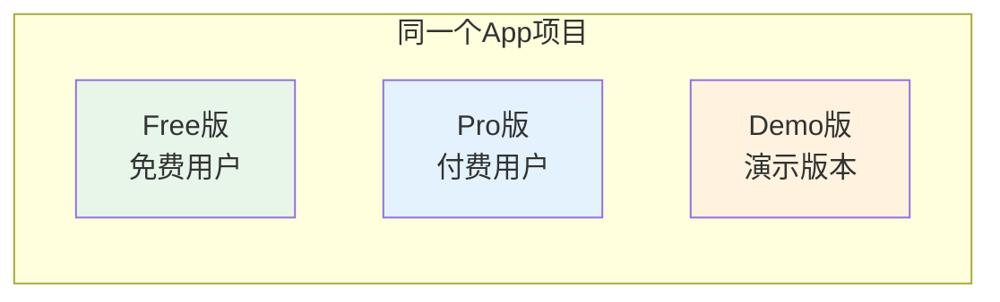
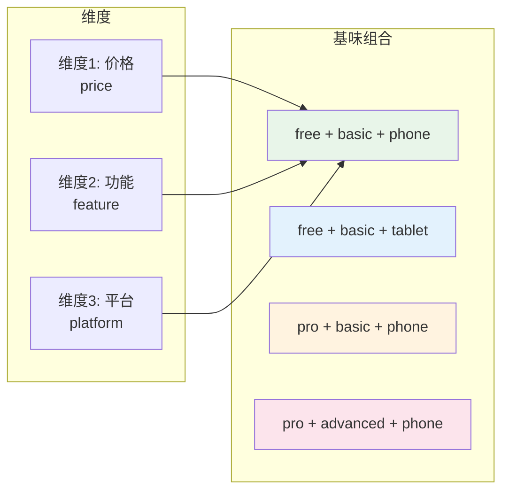
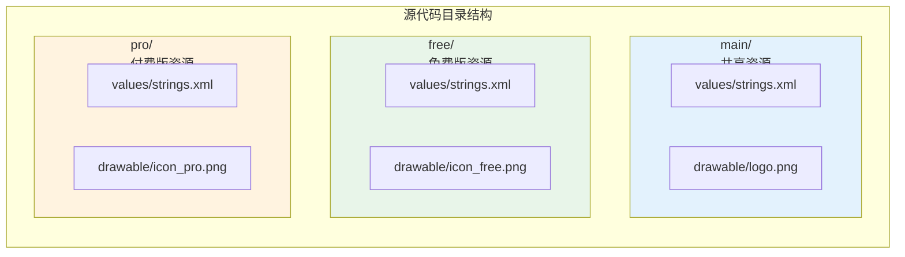
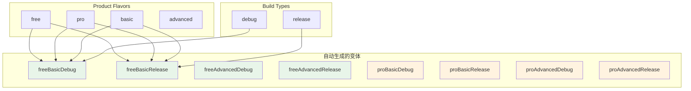

# 21.1.86 BaseFlavor

太阳已经完全升起来了。

金色的阳光穿透薄雾，在湖面上洒下一片碎金。洛芙用手遮挡着刺眼的阳光，看着波光粼粼的湖面发呆。昨夜的露营仿佛还在眼前，但现在已经是全新的的一天。

"洛芙，发什么呆呢？"

希尔的声音从身后传来，洛芙回头一看，她正端着几杯热腾腾的咖啡走了过来。

"黛琳呢？"洛芙接过咖啡，感受到杯壁传来的温度。

"在那边整理白板呢。"伊莎指了指远处，"她说要把昨天没讲完的内容补完。"

洛芙顺着伊莎手指的方向看去，黛琳已经架好了白板，正低头写着什么。晨风吹过她的发梢，带来一丝凉意。

"昨天我们讲了AssetPackExtension，"黛琳抬起头来笑着说，"今天我们来聊聊另一个重要的概念——BaseFlavor。"

"基味？"洛芙眨眨眼，"听起来像是甜品店里的说法。"

伊莎轻声笑了："不是甜品哦~不过确实和'味道'有点关系~露营时~我们会是同一个团队~但可以穿不同的衣服~用不同的装备~这就和基味差不多~"

---

## 什么是产品基味

黛琳笑着点点头："伊莎的比喻很贴切。在Android开发中，BaseFlavor就是用来定义App不同'味道'的配置。"

她拿起白板笔，在白板上画了一个简单的图：



"想象一下，"黛琳解释道，"你在开发一个露营App。你可以做一个免费版，包含基础的露营知识；做一个付费版，包含专业的导航和天气预报；还可以做一个演示版，给客户展示用。这三个版本都来自同一个代码库，但有不同的功能和资源——这就是产品基味的作用。"

洛芙好奇地问："那BaseFlavor就是这个'基味'的配置接口？"

"没错，"希尔递过来笔记本电脑，"BaseFlavor是Android Gradle DSL中的核心接口，专门用来配置产品基味的所有属性。"

---

## 基味的维度：Flavor Dimension

黛琳在白板上画了一个新的图示：



"在配置基味之前，"黛琳说，"首先要定义维度——flavor dimension。维度是对基味进行分组的方式。"

她详细解释：

"比如你的App可以有'价格维度'——免费版和付费版；还可以有'功能维度'——基础版和专业版；还可以有'设备维度'——手机版和平板版。把这些维度组合起来，就形成了不同的基味。"

洛芙举手提问："那一定要定义维度吗？"

"不一定，"希尔调出代码示例，"如果你只有一个维度的基味，可以不定义dimensionName，BaseFlavor会使用默认值。但如果有多个维度，就必须明确定义每个维度。"

---

## 创建第一个产品基味

希尔敲出一段代码："我们来看一个具体的例子。"

```kotlin
// app/build.gradle.kts

android {
    // ... 其他配置
    
    // 定义基味维度
    flavorDimensions += "price"
    flavorDimensions += "feature"
    
    productFlavors {
        // 创建免费版
        create("free") {
            // 维度赋值
            dimension = "price"
            // 应用ID后缀
            applicationIdSuffix = ".free"
            // 版本名后缀
            versionNameSuffix = "-free"
            // 启用功能
            buildConfigField("Boolean", "IS_PREMIUM", "false")
            buildConfigField("Int", "MAX_CAMPING_SPOTS", "5")
        }
        
        // 创建付费版
        create("pro") {
            dimension = "price"
            applicationIdSuffix = ".pro"
            versionNameSuffix = "-pro"
            buildConfigField("Boolean", "IS_PREMIUM", "true")
            buildConfigField("Int", "MAX_CAMPING_SPOTS", "Integer.MAX_VALUE")
        }
        
        // 创建基础功能版
        create("basic") {
            dimension = "feature"
            buildConfigField("String", "API_ENDPOINT", "\"https://api.basic.example.com\"")
            buildConfigField("Boolean", "HAS_OFFLINE_MAP", "false")
        }
        
        // 创建高级功能版
        create("advanced") {
            dimension = "feature"
            buildConfigField("String", "API_ENDPOINT", "\"https://api.advanced.example.com\"")
            buildConfigField("Boolean", "HAS_OFFLINE_MAP", "true")
        }
    }
}
```

黛琳补充道："看，每个create{}块就是一个产品基味。dimension属性指定它属于哪个维度。applicationIdSuffix会在应用ID后面加上后缀，这样你就可以同时安装免费版和付费版。versionNameSuffix同理。buildConfigField用来注入编译时的常量，这样代码里就能根据版本做不同的逻辑。"

洛芙问："那免费版加基础功能版，会自动组合成一个变体吗？"

"会的！"希尔兴奋地说，"这就是基味强大的地方。Gradle会自动组合所有维度，生成所有可能的变体。比如free+basic、free+advanced、pro+basic、pro+advanced，共4种。"

---

## 基味的资源管理

黛琳转向白板，画了一个资源目录图：



"不同基味可以有自己专属的资源目录，"黛琳解释道，"main目录是所有变体共享的，free目录只有免费版使用，pro目录只有付费版使用。如果某个资源在基味目录中有同名文件，就会覆盖main中的版本。"

她举例说明：

"比如字符串资源。main/values/strings.xml中有app_name="露营助手"，free/values/strings.xml中可以有app_name="露营助手免费版"。当构建免费版时，会使用free目录中的字符串；构建付费版时，会使用main中的字符串。"

洛枫眼睛亮了："这样就可以给不同版本不同的文案和图标！"

"对的，"希尔说，"这就是基味的另一个强大之处——资源覆盖。"

---

## 基味的源代码管理

希尔继续展示代码："除了资源，基味还可以有自己专属的Java或Kotlin源代码。"

```kotlin
// 目录结构示例
// app/src/
//   main/
//     java/com/example/camping/
//       MainActivity.kt
//       CampingSpot.kt
//   free/
//     java/com/example/camping/
//       AdManager.kt        // 免费版专有：广告管理
//       FreeFeature.kt     // 免费版专有：受限功能
//   pro/
//     java/com/example/camping/
//       PremiumManager.kt  // 付费版专有：会员管理
//       ProFeature.kt      // 付费版专有：高级功能
//   basic/
//     java/com/example/camping/
//       BasicApiClient.kt  // 基础版API客户端
//   advanced/
//     java/com/example/camping/
//       AdvancedApiClient.kt  // 高级版API客户端
```

"每个基味目录下的代码只会在构建对应版本时编译进去，"希尔解释道，"这样你就可以为不同版本编写不同的实现逻辑。"

黛琳补充："比如免费版需要展示广告，就可以创建一个AdManager类专门处理广告逻辑；付费版不需要广告，就可以创建一个PremiumManager类来处理会员功能。"

---

## 混淆与签名配置

黛琳打开新的代码块："基味还可以单独配置混淆和签名。"

```kotlin
android {
    buildTypes {
        release {
            isMinifyEnabled = true
            proguardFiles(
                getDefaultProguardFile("proguard-android-optimize.txt"),
                "proguard-rules.pro"
            )
        }
        debug {
            isDebuggable = true
        }
    }
    
    productFlavors {
        create("free") {
            dimension = "price"
            // 免费版单独的混淆配置
            proguardFiles("proguard-free.pro")
            // 免费版不使用签名（使用默认debug签名）
        }
        
        create("pro") {
            dimension = "price"
            // 付费版单独的混淆配置
            proguardFiles("proguard-pro.pro")
            // 付费版使用发布签名
            // 需要在 signingConfigs 中配置
            signingConfig = signingConfigs.getByName("release")
        }
    }
}
```

"混淆配置很重要，"黛琳强调，"特别是付费版，要保护代码不被轻易反编译。每个基味可以有自己独立的proguard规则文件。"

洛芙问："那签名呢？不同版本需要不同签名吗？"

"通常debug版本用debug签名，release版本用release签名，"希尔说，"但有时候付费版需要单独的签名来验证开发者身份，就可以在基味中指定signingConfig。"

---

## 构建变体的自动生成

希尔展示了一个表格，解释变体是如何自动生成的：



"变体名称的生成规则是：维度1 + 维度2 + ... + BuildType，"黛琳解释道，"比如free + basic + debug = freeBasicDebug。"

她扳着手指头：

"如果有两个维度（price和feature），每个维度有两个基味（free/pro和basic/advanced），再加上两个buildType（debug/release），就会自动生成 2 × 2 × 2 = 8 个变体！"

洛芙惊叹："这么多！那怎么构建某个特定的版本呢？"

"很简单，"希尔调出命令行示例：

```bash
# 构建免费基础版debug
./gradlew assembleFreeBasicDebug

# 构建付费高级版release
./gradlew assembleProAdvancedRelease

# 构建所有免费版
./gradlew assembleFree*

# 构建所有debug版
./gradlew assemble*Debug
```

---

## 反模式：把所有逻辑都写在代码里

黛琳忽然严肃起来："我见过很多初学者犯一个错误——把所有版本差异都写在if-else里。"

```kotlin
// ❌ 反模式：在代码中用if-else区分版本
class CampingSpotManager {
    
    fun loadCampingSpots(): List<CampingSpot> {
        // 错误：把所有逻辑混在一起
        if (appVersion.contains("free")) {
            // 免费版限制数量
            return dao.getSpots().take(5)
        } else if (appVersion.contains("pro")) {
            // 付费版无限制
            return dao.getSpots()
        } else if (appVersion.contains("basic")) {
            // 基础版用基础API
            return basicApi.getSpots()
        } else {
            // 高级版用高级API
            return advancedApi.getSpotsWithOffline()
        }
    }
    
    fun showAd() {
        // 错误：到处散布版本判断
        if (appVersion.contains("free")) {
            // 显示广告
            adManager.showBanner()
        }
        // 付费版不显示广告...
    }
}
```

"这种写法的问题很明显，"黛琳说，"代码变得难以维护，版本逻辑和业务逻辑混在一起，容易出错。"

洛芙点头："确实看起来很乱。"

---

## 重构后：使用BuildConfig和基味

希尔展示重构后的代码：

```kotlin
// ✅ 正确模式：利用BuildConfig和基味类

// 免费版专有的广告管理类
// app/src/free/java/.../FreeFeatureManager.kt
class FreeFeatureManager(
    private val adManager: AdManager
) {
    fun initialize() {
        // 免费版启动时加载广告
        adManager.loadInterstitialAd()
    }
    
    fun showSplashAd(): Boolean {
        return adManager.showInterstitialIfReady()
    }
}

// 付费版专有的会员管理类
// app/src/pro/java/.../ProFeatureManager.kt
class ProFeatureManager {
    fun initialize() {
        // 付费版加载会员特权
        PremiumCache.initialize()
    }
    
    fun getUnlimitedSpots(): Flow<List<CampingSpot>> {
        return dao.getAllSpotsFlow()
    }
}

// 通用管理器根据BuildConfig选择实现
// app/src/main/java/.../FeatureManager.kt
class FeatureManager(
    private val freeManager: FreeFeatureManager?,
    private val proManager: ProFeatureManager?
) {
    companion object {
        fun create(context: Context): FeatureManager {
            return if (BuildConfig.IS_PREMIUM) {
                FeatureManager(null, ProFeatureManager())
            } else {
                FeatureManager(FreeFeatureManager(AdManager(context)), null)
            }
        }
    }
    
    fun initialize() {
        if (BuildConfig.IS_PREMIUM) {
            proManager?.initialize()
        } else {
            freeManager?.initialize()
        }
    }
}
```

"看到了吗？"希尔说，"把版本差异封装到不同的类里，通过BuildConfig来选择使用哪个实现。这样代码清晰多了！"

黛琳补充："而且如果以后要添加新版本，只需要创建新的基味目录和对应的类，不需要修改已有的代码。"

---

## 完整配置示例

黛琳把所有的配置整合在一起："现在我们来看一个完整的BaseFlavor配置示例。"

```kotlin
// app/build.gradle.kts

plugins {
    id("com.android.application")
    id("org.jetbrains.kotlin.android")
}

android {
    namespace = "com.example.camping"
    compileSdk = 34

    defaultConfig {
        applicationId = "com.example.camping"
        minSdk = 24
        targetSdk = 34
        versionCode = 1
        versionName = "1.0"
        
        testInstrumentationRunner = "androidx.test.runner.AndroidJUnitRunner"
    }

    // 定义基味维度
    flavorDimensions += "price"
    flavorDimensions += "feature"
    
    // 构建类型配置
    buildTypes {
        debug {
            isDebuggable = true
            applicationIdSuffix = ".debug"
            versionNameSuffix = "-debug"
        }
        release {
            isMinifyEnabled = true
            proguardFiles(
                getDefaultProguardFile("proguard-android-optimize.txt"),
                "proguard-rules.pro"
            )
        }
    }

    // 产品基味配置
    productFlavors {
        // 价格维度
        create("free") {
            dimension = "price"
            applicationIdSuffix = ".free"
            versionNameSuffix = "-free"
            buildConfigField("Boolean", "IS_PREMIUM", "false")
            buildConfigField("Int", "MAX_SPOTS", "5")
            // 免费版资源配置
            resValue("string", "app_name", "露营助手 Free")
        }
        
        create("pro") {
            dimension = "price"
            applicationIdSuffix = ".pro"
            versionNameSuffix = "-pro"
            buildConfigField("Boolean", "IS_PREMIUM", "true")
            buildConfigField("Int", "MAX_SPOTS", "Integer.MAX_VALUE")
            // 付费版资源配置
            resValue("string", "app_name", "露营助手 Pro")
        }
        
        // 功能维度
        create("basic") {
            dimension = "feature"
            buildConfigField("String", "API_BASE_URL", "\"https://api.basic.example.com\"")
            buildConfigField("Boolean", "OFFLINE_MODE", "false")
        }
        
        create("advanced") {
            dimension = "feature"
            buildConfigField("String", "API_BASE_URL", "\"https://api.advanced.example.com\"")
            buildConfigField("Boolean", "OFFLINE_MODE", "true")
        }
    }
    
    // 编译选项
    compileOptions {
        sourceCompatibility = JavaVersion.VERSION_17
        targetCompatibility = JavaVersion.VERSION_17
    }
    
    kotlinOptions {
        jvmTarget = "17"
    }
}

dependencies {
    // 共享依赖
    implementation("androidx.core:core-ktx:1.12.0")
    implementation("androidx.appcompat:appcompat:1.6.1")
    
    // 仅免费版需要的依赖
    "freeImplementation"("com.google.android.gms:ads:22.5.0")
    
    // 仅付费版需要的依赖
    "proImplementation"("com.android.billingclient:library:6.1.0")
    
    // 测试依赖
    testImplementation("junit:junit:4.13.2")
    androidTestImplementation("androidx.test.ext:junit:1.1.5")
}
```

洛芙看着代码惊呼："原来基味配置这么强大！可以定义不同的应用ID、不同的API地址、不同的依赖，甚至不同的资源！"

"这就是BaseFlavor的魔力，"黛琳笑着说，"一个代码库，多个版本，满足不同用户群体的需求。"

---

## 构建与验证

希尔最后展示了构建命令和输出：

```bash
# 查看所有可用变体
./gradlew tasks --group=build

# 输出示例：
# Build tasks:
# - assembleFreeBasicDebug - Assembles free basic debug variant
# - assembleFreeBasicRelease - Assembles free basic release variant
# - assembleFreeAdvancedDebug - Assembles free advanced debug variant
# - assembleFreeAdvancedRelease - Assembles free advanced release variant
# - assembleProBasicDebug - Assembles pro basic debug variant
# - assembleProBasicRelease - Assembles pro basic release variant
# - assembleProAdvancedDebug - Assembles pro advanced debug variant
# assembleProAdvancedRelease - Assembles pro advanced release variant

# 构建免费高级版Debug
./gradlew assembleFreeAdvancedDebug

# 构建产物位置
# app/build/outputs/apk/free/basic/debug/app-free-basic-debug.apk
# app/build/outputs/apk/free/basic/release/app-free-basic-release.apk
# app/build/outputs/apk/free/advanced/debug/app-free-advanced-debug.apk
# app/build/outputs/apk/pro/advanced/release/app-pro-advanced-release.apk
```

"每个变体都会生成对应的APK，"希尔说，"APK文件名包含了所有的维度信息和buildType，方便识别。"

洛芙伸了个懒腰，感受着夏日的阳光："原来产品基味是这样配置的！就像露营时有基础装备和高级装备一样，App也可以有不同的版本！"

"对的！"希尔笑着说，"这就是模块化思维的体现——用同一套代码，满足不同需求。"

远处传来一阵水花声，不知道是谁在湖边玩耍。新的一天刚刚开始，洛芙觉得自己的知识库又在慢慢膨胀了。

---

> BaseFlavor是Android Gradle DSL中用于配置产品基味（Product Flavor）的核心接口。产品基味允许开发者在一个项目中创建多个不同版本的应用程序，每个版本可以有不同的应用ID、资源、源代码、依赖和配置。通过flavorDimensions定义维度，create()方法创建具体基味，applicationIdSuffix和versionNameSuffix区分不同版本，buildConfigField注入编译时常量，resource resValue()动态添加资源。基味的资源目录和源代码目录会自动与main目录合并，实现版本差异化管理。

---

> 学习建议：BaseFlavor是Android构建系统的核心概念，建议先理解维度（flavor dimension）和基味（flavor）的关系，再学习如何为不同基味配置资源、源代码和依赖。在实际项目中，合理使用基味可以实现免费版/付费版、调试版/正式版等多元化的产品策略。注意避免在代码中使用if-else判断版本，而是利用BuildConfig和继承机制来实现版本差异。

## 洛芙的小小日记本

今天学会了BaseFlavor产品基味！原来同一个App可以做出"不同味道"的版本——免费的、付费的、基础的、高级的一样都能有！黛琳说这就叫"模块化思维"，一个代码库满足不同用户。希尔说的对：就像露营时带不同的装备一样，带什么装备取决于要去哪里、待多久~🌿

---

## 今日关键词

**BaseFlavor**：Android Gradle DSL接口，用于配置产品基味（Product Flavor）的基础属性和行为。

**flavorDimensions**：定义基味的维度，用于对基味进行分组，可以有多个维度如"price"、"feature"等。

**productFlavors**：Gradle配置块，用于声明所有的产品基味。

**applicationIdSuffix**：应用ID后缀，用于区分不同基味的App（如".free"、".pro"）。

**versionNameSuffix**：版本名后缀，追加到版本名后面用于标识基味（如"-free"、"-pro"）。

**buildConfigField**：注入编译时常量，代码中可通过BuildConfig类访问这些常量。

**resValue**：在构建时动态添加资源，如字符串、整数等。

**dimension**：指定基味属于哪个维度。

**BuildConfig**：自动生成的类，包含buildConfigField定义的常量，用于运行时判断当前版本。

**变体（Variant）**：BuildType和ProductFlavor组合生成的构建目标，如freeBasicDebug、proAdvancedRelease。
