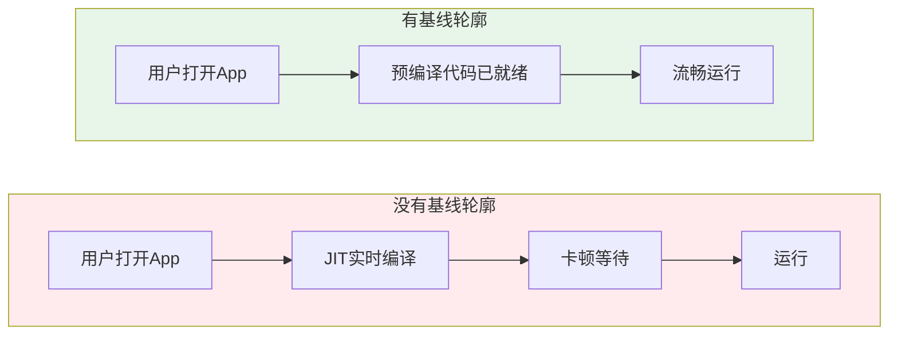
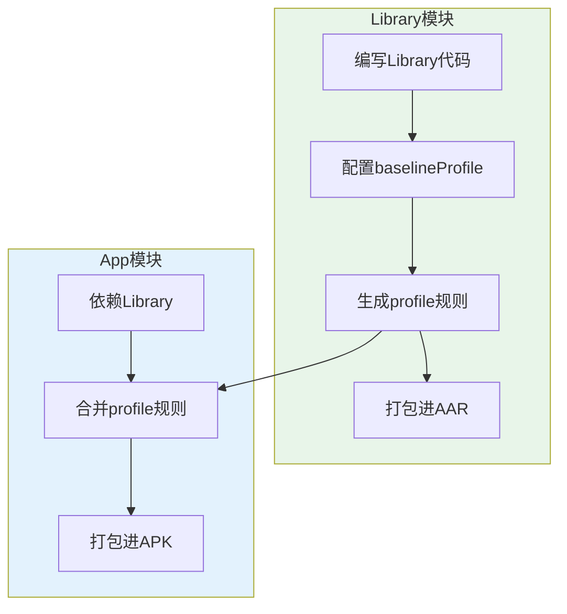
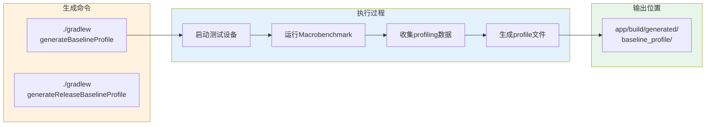

# 21.1.87 BaselineProfile

太阳渐渐升高了。

知了的叫声一浪高过一浪，从远处的树梢传来。洛芙靠在湖畔一棵大树的树干上，手里拿着平板电脑，犹豫着要不要打开昨天写的露营助手App。

"怎么不打开？"希尔端着一盘切好的水果走过来，递了一片西瓜给洛芙。

"我在想……"洛芙接过西瓜，"昨天写的那个App，启动好像有点慢。"

"那是因为你没有用基线轮廓！"希尔眼睛一亮，一屁股坐在草地上，"正好今天要讲这个——BaselineProfile！"

"基线……轮廓？"洛芙歪着头，"听起来像是画画的术语。"

伊莎正在树荫下整理帐篷，闻言轻声笑了："露营~就像给我们的人生画一条基准线一样~App也需要一条'性能基准线'来告诉系统~哪些代码需要提前编译~"

---

## 什么是基线轮廓

黛琳不知道什么时候已经架好了白板，笑着说："伊莎的比喻很形象。在Android开发中，BaselineProfile就是一条'性能基准线'——它告诉系统哪些代码路径是最常用的，需要提前编译好。"

她拿起白板笔，画了一个简单的对比图：



"想象一下，"黛琳解释道，"没有基线轮廓的时候，App的代码要在用户使用时才实时编译——就像你到了一个陌生的露营地现搭帐篷，当然慢。有基线轮廓的话，常用的代码已经提前编译好了——就像帐篷已经提前搭好，你直接住进去一样！"

洛芙眼睛亮了："所以基线轮廓能让App变快？"

"没错！"希尔兴奋地说，"Google官方说能提升约30%的执行速度！"

---

## 基线轮廓的工作原理

黛琳在白板上画了一个流程图，解释基线轮廓是如何工作的：


"基线轮廓的工作分为三个阶段，"黛琳说，"生成、构建和运行。"

她详细解释：

**生成阶段**：首先编写测试用例，模拟用户的使用场景（比如启动App、进入某个页面）。然后运行Macrobenchmark测试，系统会记录哪些方法被频繁调用。最后生成一个profile规则文件，里面记录了需要提前编译的代码路径。

**构建阶段**：在打包APK时，Gradle会把profile规则文件一起打包进去。D8和R8编译器会根据profile规则进行优化。

**运行阶段**：用户安装App后，Play服务会读取profile文件，触发AOT（Ahead-of-Time）提前编译，把常用代码预先编译好。

洛芙举手提问："那这个profile文件是什么格式的？"

"人类可读的文本文件，"希尔调出一个示例，"类似于这种规则："

```text
# Baseline Profile rules for app startup
# These rules are generated by Android Macrobenchmark

# 启动时需要预编译的类
android.app.Activity.onCreate
com.example.camping.MainActivity.onCreate
com.example.camping.data.CampingSpotRepository.getAllSpots

# 启动时需要预编译的方法
android.app.Activity.<init>
com.example.camping.ui.MainFragment.initializeViews

# 启动时需要预编译的包
com.example.camping.data.**
com.example.camping.domain.model.**
```

---

## 配置基线轮廓

希尔打开笔记本电脑："我们来看怎么在Gradle里配置BaselineProfile。"

```kotlin
// app/build.gradle.kts

plugins {
    id("com.android.application")
    id("androidx.baselineprofile") version "1.0.0-alpha04"
}

android {
    // ... 其他配置
    
    // 启用基线轮廓生成任务
    baselineProfile {
        // 是否为每个变体生成profile
        // 设为true时，会为每个buildVariant生成独立的profile
        useAlwaysGen = true
        
        // 指定要包含的profile类型
        // STARTUP 表示只生成启动时的profile
        // COMPLETE 表示生成完整的profile（包含启动+其他常用场景）
        profileType = ProfileType.COMPLETE
        
        // 自动生成选项
        // 自动在assembleRelease任务中包含profile生成
        automaticGenerationDuringBuild = true
        
        // 指定过滤条件，只对特定变体生成profile
        variantsFilter = { variant ->
            // 只对release变体生成
            variant.buildType == "release"
        }
    }
}
```

黛琳补充道："注意哦，基线轮廓配置需要在app级别的build.gradle中，不能在library里直接配置。"

洛芙问："那library需要基线轮廓怎么办？"

"library也可以提供基线轮廓！"希尔说，"通过baselineProfile插件的library变体来实现。"

---

## 为Library生成基线轮廓

黛琳画了一个图，解释library如何提供基线轮廓：



"library通过配置baselineProfile插件，可以生成自己的profile规则，"黛琳解释道，"当App依赖这个library时，两个profile会合并在一起。"

希尔展示了library的配置：

```kotlin
// library/build.gradle.kts

plugins {
    id("com.android.library")
    id("androidx.baselineprofile")
}

android {
    // ... 其他配置
    
    // 为library配置baselineProfile
    baselineProfile {
        // library模式：会生成可以在AAR中分发的profile
        library = true
        
        // 指定library的包名
        libraryPackageName = "com.example.camping.data"
    }
}
```

"当library配置了`library = true`后，"希尔补充道，"生成的profile会包含在AAR中，App使用这个library时会自动合并profile。"

---

## 生成基线轮廓

黛琳转向白板，画出了生成基线轮廓的命令流程：



"生成基线轮廓需要运行专门的测试任务，"黛琳说，"命令是`generateBaselineProfile`。"

希尔敲出命令示例：

```bash
# 为debug变体生成基线轮廓
./gradlew generateBaselineProfileDebug

# 为release变体生成基线轮廓
./gradlew generateBaselineProfileRelease

# 为所有变体生成基线轮廓
./gradlew generateBaselineProfile
```

"生成过程中会启动测试设备，运行Macrobenchmark测试，"希尔解释道，"所以需要真机或模拟器连接。生成的profile文件保存在`app/build/generated/baseline_profile/`目录下。"

洛芙好奇地问："那profile文件叫什么名字？"

"通常是`baseline-prof.txt`或`startup-prof.txt`，"希尔说，"具体名字可以在配置里指定。"

---

## 编写基线轮廓测试

黛琳强调："生成profile之前，需要先编写测试用例，告诉系统要测试哪些场景。"

她展示了一个示例测试类：

```kotlin
// app/src/androidTest/java/com/example/camping/BaselineProfileGenerator.kt

package com.example.camping

import androidx.benchmark.macro.MacrobenchmarkScope
import androidx.benchmark.macro.junit4.MacrobenchmarkRule
import org.junit.Rule
import org.junit.Test

/**
 * 基线轮廓生成测试
 * 
 * 这个测试类用于生成App的基线轮廓
 * 测试会模拟用户启动App、浏览列表、查看详情等常见操作
 */
class BaselineProfileGenerator {

    @get:Rule
    val benchmarkRule = MacrobenchmarkRule()

    @Test
    fun startupBaselineProfile() {
        // 启动测试：测量App的启动性能
        benchmarkRule.measureRepeated(
            packageName = "com.example.camping",
            metrics = listOf(
                // 测量启动时间
                androidx.benchmark.macro.StartupMetrics()
            ),
            iterations = 10,
            setupBlock = {
                // 测试前杀死App，确保从头启动
                pressHome()
                device.executeShellCommand("am kill $packageName")
            }
        ) {
            // 启动App
            startActivityAndWait()
            
            // 等待主界面加载完成
            waitForIdle()
        }
    }

    @Test
    fun scrollingBaselineProfile() {
        // 滚动测试：测量列表滚动性能
        benchmarkRule.measureRepeated(
            packageName = "com.example.camping",
            metrics = listOf(
                // 测量帧率
                androidx.benchmark.macro.FrameRateMetric()
            ),
            iterations = 5
        ) {
            // 启动App
            startActivityAndWait()
            
            // 滚动列表
            repeat(3) {
                device.swipe(
                    startX = 500,
                    startY = 1500,
                    endX = 500,
                    endY = 300,
                    steps = 100
                )
                waitForIdle()
            }
        }
    }

    @Test
    fun navigationBaselineProfile() {
        // 导航测试：测量页面切换性能
        benchmarkRule.measureRepeated(
            packageName = "com.example.camping",
            metrics = listOf(
                // 测量转换时间
                androidx.benchmark.macro.TransitionMetrics()
            ),
            iterations = 5
        ) {
            // 启动App
            startActivityAndWait()
            
            // 点击进入详情页
            device.findObject(By.text("露营地详情")).click()
            
            // 等待页面加载
            waitForIdle()
            
            // 返回列表
            pressBack()
            waitForIdle()
        }
    }
}
```

洛芙看着代码惊呼："原来要写这么多测试！"

"这些测试决定了profile的质量，"黛琳说，"测试覆盖的场景越多，生成的profile就越完善，用户的体验就越好。"

---

## 打包基线轮廓

希尔展示了profile文件是如何打包进APK的：

```kotlin
// app/build.gradle.kts

android {
    buildTypes {
        release {
            // 启用混淆
            isMinifyEnabled = true
            
            // 启用基线轮廓
            isUseBaselineProfile = true
        }
    }
    
    baselineProfile {
        // 打包配置
        packageOption = PackageOption.Included
        
        // 可选：排除某些不需要profile的变体
        variantsFilter = { variant ->
            variant.buildType != "debug"
        }
    }
}
```

"关键配置是`isUseBaselineProfile = true`，"希尔说，"启用后，profile文件会被打包进APK。"

黛琳补充："`packageOption`有三个选项：`Included`（打包）、`Excluded`（不打包）、`Merged`（合并后打包）。通常用`Included`。"

洛芙问："debug版本也能用profile吗？"

"debug版本通常不打包profile，"希尔解释道，"因为debug版本主要用于开发调试，性能不是首要考虑。只有release版本才会打包profile。"

---

## 基线轮廓的变体支持

黛琳在白板上画了一个图，解释如何为不同变体配置不同的profile：

```mermaid
flowchart TB
    subgraph Variants["变体与Profile"]
        direction LR
        V1[freeDebug] -->|无profile| P1[]
        V2[freeRelease] -->|free profile| P2[baseline-prof-free.txt]
        V3[proDebug] -->|无profile| P3[]
        V4[proRelease] -->|pro profile| P4[baseline-prof-pro.txt]
    end
    
    subgraph Merge["Profile合并"]
        P2 --> M1[合并Profile]
        P4 --> M1
        M1 --> APK[APK打包]
    end
    
    style P2 fill:#e8f5e9
    style P4 fill:#fff3e0
```

"可以为不同变体生成不同的profile，"黛琳说，"比如free版和pro版有不同的功能，可以分别生成对应的profile。"

希尔展示了配置示例：

```kotlin
android {
    baselineProfile {
        // 为不同变体生成不同的profile
        useAlwaysGen = false  // 不自动生成，使用手动配置
        
        // 通过任务依赖控制
        tasks.configureEach {
            // 为每个变体配置
            if (name.contains("Release")) {
                dependsOn("generate${name.replaceFirstChar { it.uppercase() }}BaselineProfile")
            }
        }
    }
}
```

---

## 反模式：所有代码都预编译

黛琳忽然严肃起来："我见过一些初学者的错误——想让所有代码都预编译。"

```kotlin
// ❌ 反模式：想把所有代码都加入profile

// 错误：把不需要预编译的代码也加进去
class BadProfileGenerator {
    @Test
    fun badExample() {
        // 错误：测试所有可能的代码路径
        benchmarkRule.measureRepeated(
            packageName = "com.example.camping",
            iterations = 1
        ) {
            // 遍历App的每一个角落
            // 这会导致profile文件过大
            // 反而增加安装时间和存储空间
            exploreEntireApp()
        }
    }
}
```

"这种做法的问题很明显，"黛琳说，"profile文件过大会增加APK体积，影响下载速度和安装时间。而且不是所有代码都需要预编译——只有那些频繁执行的热点代码才值得预编译。"

洛芙点头："就像露营时不用把所有东西都提前搭好，只搭常用的帐篷和火堆就行！"

"没错！"黛琳笑着说，"这就是'基线'的含义——只预编译最基础、最常用的代码路径。"

---

## 重构后：精准的Profile测试

希尔展示了正确的做法：

```kotlin
// ✅ 正确模式：聚焦核心场景

/**
 * 优秀的基线轮廓生成测试
 * 
 * 只测试用户最常用的核心场景：
 * 1. 启动 - 用户打开App的第一印象
 * 2. 浏览列表 - 最常用的功能
 * 3. 详情查看 - 转化关键路径
 * 
 * 不测试：
 * - 罕见的功能路径
 * - 错误处理代码
 * - 仅开发者使用的调试功能
 */
class GoodProfileGenerator {

    @Test
    fun startup() = benchmarkRule.measureRepeated(
        packageName = "com.example.camping",
        metrics = listOf(StartupMetrics()),
        iterations = 10,
        setupBlock = { pressHome(); killProcess() }
    ) {
        startActivityAndWait()
    }

    @Test
    fun browseCampingSpots() = benchmarkRule.measureRepeated(
        packageName = "com.example.camping",
        metrics = listOf(FrameRateMetric()),
        iterations = 5
    ) {
        startActivityAndWait()
        repeat(5) { device.swipeUp() }
    }
}
```

"好的profile测试要遵循二八法则，"希尔说，"用20%的测试覆盖80%的常用场景。"

黛琳补充："而且要定期更新profile——当App有重大功能更新时，需要重新生成profile。"

---

## 完整配置示例

黛琳把所有的配置整合在一起：

```kotlin
// app/build.gradle.kts

plugins {
    id("com.android.application")
    id("org.jetbrains.kotlin.android")
    id("androidx.baselineprofile") version "1.0.0-alpha04"
}

android {
    namespace = "com.example.camping"
    compileSdk = 34

    defaultConfig {
        applicationId = "com.example.camping"
        minSdk = 24
        targetSdk = 34
        versionCode = 1
        versionName = "1.0"
    }

    buildTypes {
        debug {
            isDebuggable = true
        }
        release {
            isMinifyEnabled = true
            isShrinkResources = true
            // 启用基线轮廓
            isUseBaselineProfile = true
            proguardFiles(
                getDefaultProguardFile("proguard-android-optimize.txt"),
                "proguard-rules.pro"
            )
        }
    }

    // 基线轮廓配置
    baselineProfile {
        // 为所有变体生成profile（测试时用）
        useAlwaysGen = true
        
        // 生成完整profile（包含启动和其他场景）
        profileType = ProfileType.COMPLETE
        
        // 过滤：只对release变体打包profile
        packageOption = PackageOption.Included
        variantsFilter = { variant ->
            variant.buildType == "release"
        }
        
        // 自定义profile输出名称
        // outputFileName = "my-custom-profile"
    }
    
    compileOptions {
        sourceCompatibility = JavaVersion.VERSION_17
        targetCompatibility = JavaVersion.VERSION_17
    }
    
    kotlinOptions {
        jvmTarget = "17"
    }
}

dependencies {
    // 基线轮廓生成依赖
    // 注意：这些依赖只在生成profile时需要，不需要打入最终APK
    "androidTestImplementation"("androidx.benchmark:benchmark-macro:1.2.0-alpha04")
    "androidTestImplementation"("androidx.test.ext:junit:1.1.5")
    "androidTestImplementation"("androidx.test.services:testing-support-lib:1.4.2")
}
```

洛芙看着配置惊叹："原来配置这么多！"

"其实理解了原理就不复杂，"黛琳笑着说，"核心就是：编写测试 → 生成profile → 打包进APK → 用户受益。"

---

## 构建与验证

希尔最后展示了构建和验证命令：

```bash
# 生成基线轮廓
./gradlew generateBaselineProfileRelease

# 查看生成的profile文件
cat app/build/generated/baseline_profile/release/baseline-prof.txt

# 示例输出：
# android.app.Activity.onCreate
# android.app.Activity.onStart
# com.example.camping.MainActivity.onCreate
# com.example.camping.data.CampingSpotDao.getAllSpots
# com.example.camping.ui.CampingSpotAdapter.onBindViewHolder

# 构建release APK（包含profile）
./gradlew assembleRelease

# 验证profile是否打包进APK
unzip -l app/build/outputs/apk/release/app-release.apk | grep -i prof

# 示例输出：
# assets/dex2oat/primary-profile.apxl
# assets/dex2oat/primary-profile.art
```

"profile打包进APK后会变成特殊的格式，"希尔说，"在assets目录下的dex2oat文件夹里。"

洛芙伸了个懒腰，感受着树荫下的凉风："原来App的性能优化是这样做的！就像提前搭好帐篷一样，用户一打开就能直接住进去！"

"对的！"希尔笑着说，"这就是基线轮廓的魔法——让用户的等待变成享受。"

远处传来伊莎的呼唤声："休息时间到啦~来尝尝我做的露营便当~"

知了的叫声还在继续，但洛芙已经迫不及待地跑向食物了。新知识总是让人心情愉快！

---

> BaselineProfile是Android Gradle DSL中用于配置基线轮廓（Baseline Profile）的核心接口。基线轮廓是一种性能优化机制，通过在APK中打包代码执行profile规则，让系统在用户设备上进行AOT提前编译，从而提升App的执行速度约30%。配置通过`baselineProfile`块完成，包括`useAlwaysGen`控制是否为所有变体生成profile，`profileType`指定profile类型（STARTUP或COMPLETE），`isUseBaselineProfile`在release构建中启用profile打包。生成profile需要编写Macrobenchmark测试，运行`generateBaselineProfile`任务，生成的profile文件保存在build目录中，最终打包进APK的assets/dex2oat目录。Library也可以通过配置生成并分发自己的profile。

---

> 学习建议：BaselineProfile是Android性能优化的重要工具，建议先理解AOT编译和JIT编译的区别，再学习如何编写有效的Macrobenchmark测试。生成的profile质量取决于测试用例的覆盖范围，要聚焦用户最常用的核心场景。注意profile只在release构建中生效，且需要Google Play服务支持才能在用户设备上发挥效果。定期更新profile以适配App的功能变化。

## 洛芙的小小日记本

今天学会了BaselineProfile基线轮廓！原来App也可以像提前搭帐篷一样，提前把常用代码编译好，这样用户打开App就能直接用，不用等待！黛琳说这就叫"用户体验前置"，希尔说的对：就像露营时先准备好常用的东西，把精力留给更重要的事~🌿

---

## 今日关键词

**BaselineProfile**：Android Gradle DSL接口，用于配置基线轮廓（Baseline Profile），一种性能优化机制。

**AOT编译**：（Ahead-of-Time）提前编译，在App安装时就将代码编译好，运行时无需等待。

**JIT编译**：（Just-in-Time）即时编译，在App运行时实时编译代码，会导致卡顿。

**Macrobenchmark**：Android提供的基准测试库，用于生成基线轮廓的测试框架。

**ProfileType**：枚举类型，指定生成profile的类型（STARTUP启动型、COMPLETE完整型）。

**useBaselineProfile**：构建类型配置，控制是否为release构建打包profile。

**baseline-prof.txt**：基线轮廓规则文件，人类可读的profile规则文本。

**PackageOption**：枚举类型，控制profile如何打包进APK（Included/Excluded/Merged）。

**dex2oat**：Android的AOT编译器，将DEX文件编译为本地机器码。

**APKXL**：Android Profile Exchange Language，profile文件的特殊格式。
