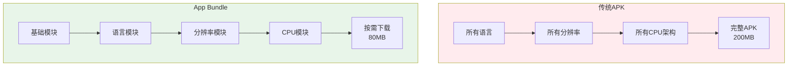
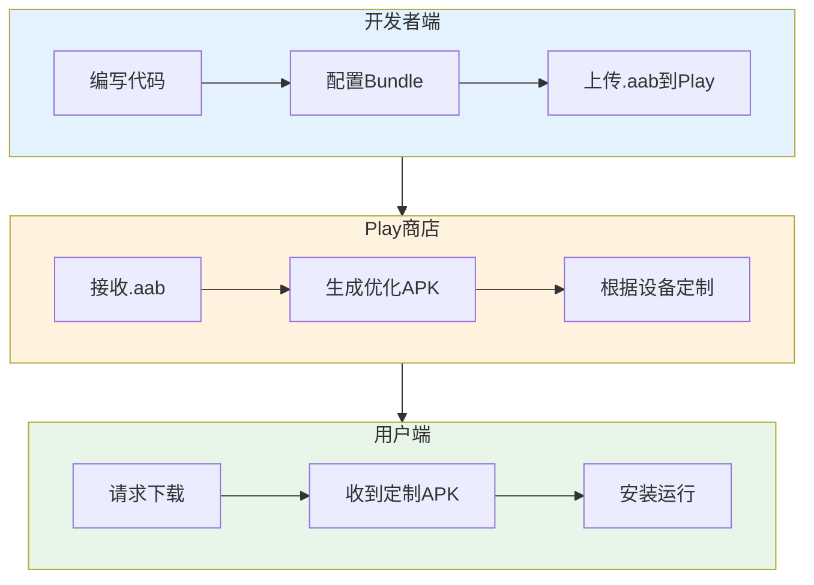
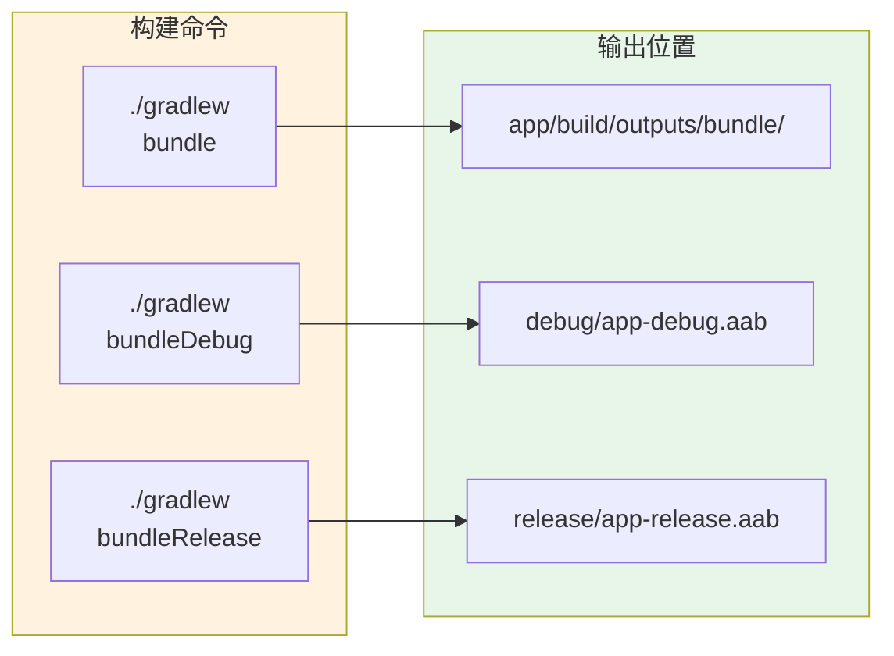
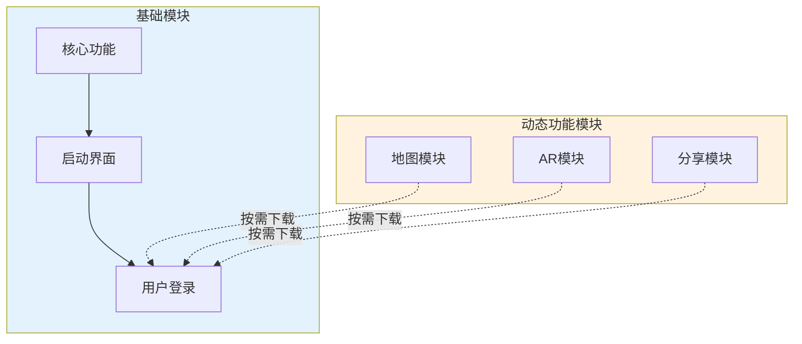

# 21.1.88 Bundle

伊莎把便当盒一个个收进背包里，动作轻柔得像在照顾一群小精灵。

“说起来，”她忽然想起什么，“上次发布的那个露营助手App，好多用户反馈说下载好慢啊…… apk 文件太大了。”

洛芙正躺着发呆，闻言立刻弹了起来：“对！我妈的手机内存很小，下载到一半就提示空间不足了。”

希尔正好在调试代码，头也不抬地说：“那是因为你们还在用古老的APK打包方式。现在都流行用App Bundle了！”

“App……Bundle？”洛芙歪着头，“听起来像是把东西捆起来的打包方式？”

黛琳正在整理白板，笑着接过话题：“没错！Bundle就是'捆'的意思——把App的不同部分分开打包，让用户只下载自己需要的那部分。”

---

## 为什么要用App Bundle

树荫下凉快了不少。黛琳重新架好白板，开始画图解释。

“我们先来看看传统的APK有什么问题，”她画了一个大大的APK包，里面塞满了各种资源，“传统的APK是把所有东西都打包在一起——所有语言的字符串、所有分辨率的图片、所有CPU架构的原生库……”

洛芙看着图：“这有什么问题吗？”

“问题大了！”希尔终于抬起头，“比如一个日本用户下载了你的App，却要同时下载中文、英文、德文、法文的翻译文件——这些对他来说完全没用，却占用了宝贵的存储空间！”

黛琳点点头，画出App Bundle的示意图：



“App Bundle的思想是‘按需下载’，”黛琳解释道，“用户用的是什么语言的手机，就只下载对应的翻译；手机是什么分辨率，就只下载对应的图片；是什么CPU架构，就只下载对应的原生库。”

洛芙眼睛亮了：“那用户下载的APK会变小很多？”

“没错！”希尔兴奋地说，“Google官方说平均可以减少40%的APK体积！”

---

## App Bundle的工作原理

黛琳在白板上画出了一个完整的App Bundle架构图：



“App Bundle的工作流程是这样的，”黛琳说，“开发者不再直接生成APK，而是生成一个`.aab`文件（Android App Bundle），上传到Google Play商店。Play商店会根据用户的设备信息，动态生成一个定制化的APK。”

伊莎好奇地问：“那如果用户从其他渠道下载呢？”

“这就是App Bundle的一个限制，”黛琳诚实地说，“App Bundle需要商店的支持。目前Google Play完全支持，国内的一些第三方应用商店也在逐步支持。但如果要做其他渠道分发，可能还是需要APK。”

洛芙举手提问：“那我们自己怎么测试Bundle？”

“可以用`bundle`任务来构建测试，”希尔说，“我来演示一下。”

---

## 配置App Bundle

希尔打开笔记本电脑：“我们来看怎么在Gradle里配置App Bundle。”

```kotlin
// app/build.gradle.kts

plugins {
    id("com.android.application")
    id("org.jetbrains.kotlin.android")
}

android {
    namespace = "com.example.camping"
    compileSdk = 34

    defaultConfig {
        applicationId = "com.example.camping"
        minSdk = 24
        targetSdk = 34
        versionCode = 1
        versionName = "1.0"
    }

    // App Bundle 配置
    bundle {
        // 语言配置：生成哪些语言的资源包
        // 默认会为所有语言生成资源包
        // 可以设置只支持特定语言来减小体积
        language {
            // 启用语言资源拆分
            enableSplit = true
            
            // 可选：只打包指定语言（不加这行则打包所有）
            // include("zh", "en", "ja")
        }
        
        // ABI配置：生成哪些CPU架构的原生库
        // 常见的CPU架构：armeabi-v7a, arm64-v8a, x86, x86_64
        abi {
            // 启用ABI资源拆分
            enableSplit = true
            
            // 可选：只打包指定架构
            // include("armeabi-v7a", "arm64-v8a")
        }
        
        // 屏幕密度配置：生成哪些分辨率的资源
        // 常见密度：mdpi, hdpi, xhdpi, xxhdpi, xxxhdpi
        density {
            // 启用密度资源拆分
            enableSplit = true
            
            // 可选：只打包指定密度
            // include("xxhdpi", "xxxhdpi")
        }
        
        // 工具栏配置：生成什么格式的独立资源
        // 这是一个较新的功能，允许将资源完全模块化
       toolbar {
            enableSplit = true
        }
    }
}
```

黛琳补充道：“最常用的配置就是这三个——语言、ABI和屏幕密度。开启`enableSplit = true`后，Gradle会为每种语言、每种架构、每种分辨率生成独立的资源包。”

洛芙问：“那这些资源包是怎么组合的呢？”

“在Play商店那边，”希尔解释道，“服务器会根据用户的设备信息，从这些资源包里挑选合适的，组合成一个完整的APK推送给用户。”

---

## 构建App Bundle

黛琳画出了构建命令的流程：



“构建App Bundle的命令和构建APK类似，”黛琳说，“只是把`assemble`换成`bundle`。”

希尔敲出命令示例：

```bash
# 构建debug版本的App Bundle
./gradlew bundleDebug

# 构建release版本的App Bundle
./gradlew bundleRelease

# 构建所有变体的Bundle
./gradlew bundle

# 查看生成的.aab文件
ls -la app/build/outputs/bundle/release/

# 示例输出：
# app-release.aab
# app-release-metadata.dep
```

“生成的.aab文件不能用普通方式安装，”希尔提醒道，“需要用`bundletool`来提取APK安装到设备上进行测试。”

---

## 使用Bundletool测试Bundle

洛芙好奇地问：“我们要怎么测试生成的Bundle呢？”

“用Google提供的bundletool，”希尔说，“它可以从.aab文件中提取出针对特定设备的APK。”

```bash
# 首先下载bundletool
# https://github.com/google/bundletool/releases

# 用bundletool从.aab提取设备APK
java -jar bundletool.jar build-apks \
    --bundle=app/build/outputs/bundle/release/app-release.aab \
    --output=app-release.apks \
    --device-spec=device-spec.json

# 查看提取的APK
unzip -l app-release.apks
```

黛琳补充道：“`device-spec.json`是设备规格文件，描述了目标设备的配置。”

```json
// device-spec.json 示例
{
    "supportedAbis": ["arm64-v8a"],
    "supportedLocales": ["zh-CN", "en-US"],
    "screenDensity": 480,
    "sdkVersion": 34
}
```

“如果不做device-spec，”希尔说，“bundletool会生成一个通用的多配置APK，包含所有资源。”

---

## 动态功能模块

“等等，”伊莎忽然问道，“我听说App Bundle还可以做动态功能模块？就像拼乐高一样按需加载？”

黛琳笑了：“没错！这正是App Bundle最强大的地方——Dynamic Features（动态功能模块）。”

她在白板上画出了动态功能的架构：



“动态功能模块允许你把App的某些功能拆分成独立的模块，”黛琳解释道，“这些模块不会在用户第一次安装时下载，而是在用户需要的时候才从Play商店下载。”

洛芙惊叹：“那岂不是可以大幅减少首次安装的体积？”

“对的！”希尔说，“比如一个相机App，核心功能是拍照，但AR特效、高级滤镜这些功能不是每个人都要用的，就可以拆成动态模块。”

---

## 配置动态功能模块

希尔展示了如何配置动态功能模块：

```kotlin
// app/build.gradle.kts（主模块）

plugins {
    id("com.android.application")
    id("org.jetbrains.kotlin.android")
    id("com.google.android.gms.dynamic-feature")
}

android {
    // ... 其他配置
}

// 依赖基础模块
dependencies {
    implementation(project(":common"))
    // 动态模块的依赖
    implementation("com.google.android.gms:play-services-basement:18.3.0")
}

// 配置动态功能模块
dynamicFeatures += ":map-feature"
dynamicFeatures += ":ar-feature"
```

现在创建一个动态功能模块：

```kotlin
// map-feature/build.gradle.kts

plugins {
    id("com.android.dynamic-feature")
    id("org.jetbrains.kotlin.android")
}

android {
    namespace = "com.example.camping.map"
    
    // 指定这个模块依赖的基础模块
    // 用户必须先安装基础App才会下载这个模块
    defaultConfig {
        minSdk = 24
    }
}

dependencies {
    // 依赖主模块
    implementation(project(":app"))
    
    // 共享代码
    implementation(project(":common"))
}
```

“在动态模块的代码里，”希尔补充道，“访问主模块的代码需要通过反射或者其他方式，因为模块之间的依赖关系在编译时是不确定的。”

---

## 反模式：把不该拆的也拆了

黛琳忽然严肃起来：“我见过一些初学者的错误——把所有东西都拆成动态模块。”

```kotlin
// ❌ 反模式：过度拆分

// build.gradle.kts
dynamicFeatures += ":splash-feature"      // 启动页
dynamicFeatures += ":login-feature"       // 登录
dynamicFeatures += ":home-feature"        // 首页
dynamicFeatures += ":settings-feature"    // 设置页
dynamicFeatures += ":profile-feature"     // 个人页
dynamicFeatures += ":about-feature"       // 关于页
```

“这种做法的问题很明显，”黛琳说，“拆分出来的模块太多，每个模块都需要单独下载，反而增加了网络请求的次数和用户的等待时间。”

洛芙不解：“可这不应该是按需下载吗？”

“问题在于，”希尔解释道，“模块拆分是有开销的——每个模块都有自己的DEX文件、资源、Native库。如果拆得太细，这些开销会累积，反而得不偿失。”

黛琳补充：“而且模块之间的共享代码会成为维护的噩梦。”

---

## 重构后：合理的模块拆分

希尔展示了正确的做法：

```kotlin
// ✅ 正确模式：合理的模块拆分

// 1. 核心功能（必须）：永远在基础APK中
// - 启动、导航框架、用户系统核心
// - 不能拆，拆了App无法运行

// 2. 常用功能（推荐动态）：用户大概率会用
// - 主页面、核心业务功能
// - 可以在首次安装时一起下载

// 3. 高级功能（强烈推荐动态）：用户可能不用
// - AR相机、高级滤镜、离线模式
// - 强烈建议拆成动态模块，按需下载

// 4. 调试/测试功能（必须动态）：只有开发者或特定用户需要
// - 性能分析工具、调试面板
// - 一定要拆成动态模块，不影响普通用户

dynamicFeatures += ":ar-feature"          // AR相机 - 高级功能
dynamicFeatures += ":offline-feature"     // 离线模式 - 高级功能  
dynamicFeatures += ":debug-feature"        // 调试面板 - 仅开发测试
```

“好的模块拆分要遵循以下原则，”黛琳总结道：

1. **核心功能不拆**：没有它App就无法运行的功能，必须留在基础APK
2. **常用功能看情况**：高频使用的功能可以保留在基础APK，保证首次体验流畅
3. **低频功能必拆**：只有少数用户会用到的功能，强烈建议拆成动态模块
4. **调试功能必须拆**：开发和测试用的功能，务必拆成动态模块，不影响普通用户

---

## 完整配置示例

黛琳把所有的配置整合在一起：

```kotlin
// app/build.gradle.kts

plugins {
    id("com.android.application")
    id("org.jetbrains.kotlin.android")
    id("com.google.android.gms.dynamic-feature")
}

android {
    namespace = "com.example.camping"
    compileSdk = 34

    defaultConfig {
        applicationId = "com.example.camping"
        minSdk = 24
        targetSdk = 34
        versionCode = 1
        versionName = "1.0"
        
        // 启用并行DEX
        multiDexEnabled = true
    }

    buildTypes {
        debug {
            isDebuggable = true
            isMinifyEnabled = false
        }
        release {
            isMinifyEnabled = true
            isShrinkResources = true
            proguardFiles(
                getDefaultProguardFile("proguard-android-optimize.txt"),
                "proguard-rules.pro"
            )
        }
    }

    // App Bundle 配置
    bundle {
        // 语言拆分
        language {
            enableSplit = true
            // 只打包主流语言（可选）
            // include("zh", "en", "ja", "ko", "es", "fr", "de")
        }
        
        // ABI拆分
        abi {
            enableSplit = true
            // 只打包主流架构（推荐）
            // arm64-v8a是主流，x86_64用于模拟器
            include("arm64-v8a", "x86_64")
        }
        
        // 屏幕密度拆分
        density {
            enableSplit = true
            // 只打包主流分辨率
            // xxhdpi和xxxhdpi覆盖了大部分现代设备
            include("xxhdpi", "xxxhdpi")
        }
    }
    
    // 动态功能模块
    dynamicFeatures += ":map-feature"
    dynamicFeatures += ":ar-feature"
    
    compileOptions {
        sourceCompatibility = JavaVersion.VERSION_17
        targetCompatibility = JavaVersion.VERSION_17
    }
    
    kotlinOptions {
        jvmTarget = "17"
    }
}

dependencies {
    implementation("androidx.core:core-ktx:1.12.0")
    implementation("androidx.appcompat:appcompat:1.6.1")
    implementation("com.google.android.material:material:1.11.0")
}
```

洛芙看着配置惊叹：“原来配置这么多！”

“其实理解了原理就不复杂，”黛琳笑着说，“核心就是：决定要拆什么、拆到什么程度，然后让Play商店去处理设备适配。”

---

## 构建与验证

希尔最后展示了构建和验证命令：

```bash
# 构建release版本的App Bundle
./gradlew bundleRelease

# 查看生成的.aab文件
ls -la app/build/outputs/bundle/release/

# 示例输出：
# app-release.aab              # App Bundle文件
# app-release-metadata.dep     # 元数据

# 用bundletool测试
# 1. 导出设备规格
java -jar bundletool.jar get-device-spec \
    --output=device-spec.json

# 2. 根据设备生成APK
java -jar bundletool.jar build-apks \
    --bundle=app/build/outputs/bundle/release/app-release.aab \
    --output=test.apks \
    --device-spec=device-spec.json

# 3. 安装到设备
java -jar bundletool.jar install-apks \
    --apks=test.apks

# 查看APK信息
unzip -l test.apks

# 示例输出（注意资源分包）：
# base.apk                    # 基础APK
# split_config.zh.apk         # 中文资源
# split_config.xxhdpi.apk    # xxhdpi资源
# split_config.arm64_v8a.apk # arm64架构原生库
```

“bundletool还有很多其他功能，”希尔说，“比如验证Bundle的配置、生成不同设备的测试APK等。”

洛芙伸了个懒腰，感受着树荫下的凉风：“原来App也可以像乐高一样拼起来！这样用户就不用下载那么多不需要的东西了！”

“对的！”希尔笑着说，“这就是App Bundle的魔法——让每一个用户都得到一个量身定制的App。”

远处传来伊莎的呼唤声：“休息时间结束啦~我们来玩飞盘吧~”

知了的叫声还在继续，但洛芙已经迫不及待地跑向草地了。新知识总是让人心情愉快！

---

> Bundle是Android Gradle DSL中用于配置Android App Bundle的核心接口。App Bundle是一种新的打包格式（.aab），允许开发者将App的不同资源（语言、屏幕密度、CPU架构）拆分成独立的模块，由Play商店根据用户的设备信息动态生成定制化的APK，从而减少约40%的APK体积。配置通过`bundle`块完成，包括`language`、`abi`、`density`三个子配置，每个都支持`enableSplit`开关控制是否启用资源拆分，以及`include`数组指定要包含的具体值。动态功能模块（Dynamic Features）允许将App的某些功能拆分成独立模块，通过`dynamicFeatures`配置实现按需下载，进一步优化首次安装体积。构建使用`./gradlew bundleRelease`命令，测试需要使用bundletool工具。

---

> 学习建议：App Bundle是现代Android应用分发的标准方式，建议先理解资源拆分的原理（语言、密度、ABI），再学习动态功能模块的配置。注意Bundle打包需要Play商店的支持，国内渠道可能需要额外处理。对于必须支持其他分发渠道的场景，可以考虑使用bundletool的build-apks命令生成多配置的通用APK。模块拆分要合理，避免过度拆分导致的开销问题。

## 洛芙的小小日记本

今天学会了App Bundle打包方式！原来把App拆成不同的小模块，用户只需要下载自己需要的那部分就行~这样手机内存小的用户也可以愉快地下载App了！黛琳说这就叫"按需分配"，就像露营时不需要把全部行李都带上，只需要带上当下需要的东西一样~🌿

---

## 今日关键词

**App Bundle**：Android新的应用打包格式（.aab），允许按设备配置动态生成定制化APK。

**AAR**：Android Archive，Android库项目的打包格式，Bundle项目的输出格式。

**资源拆分**：将App的资源（语言、屏幕密度、CPU架构）拆分成独立模块按需下载的机制。

**ABI**：Application Binary Interface，应用二进制接口，指定CPU架构（如arm64-v8a、x86_64）。

**屏幕密度**：屏幕像素密度（如mdpi、xxhdpi、xxxhdpi），决定图片资源的分辨率选择。

**Dynamic Features**：动态功能模块，允许将App的部分功能拆分成独立模块按需下载。

**bundletool**：Google提供的命令行工具，用于从.aab文件生成针对特定设备的APK。

**enableSplit**：Bundle配置中的开关，控制是否启用对应的资源拆分。

**multiDexEnabled**：启用多DEX支持，允许App有多个DEX文件，解决65536方法数限制。

**Play Feature Delivery**：Google Play的功能分发机制，动态功能模块的技术基础。
