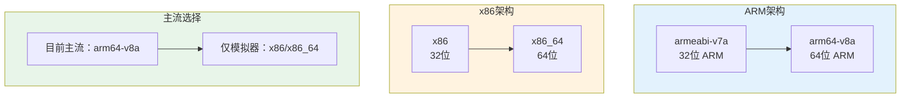
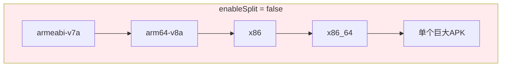
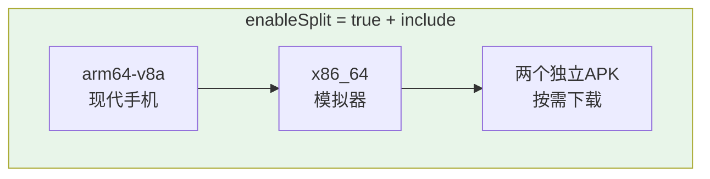
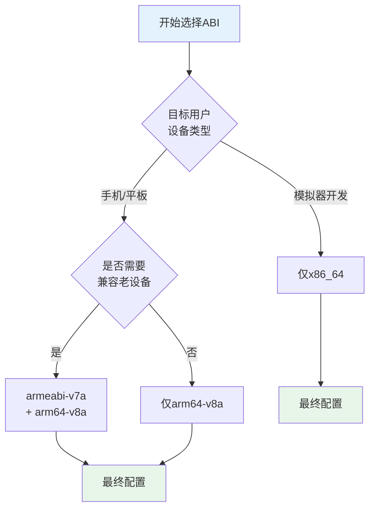
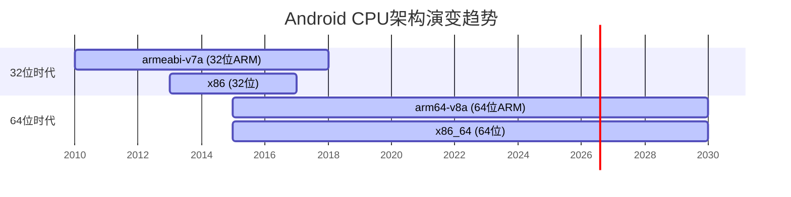
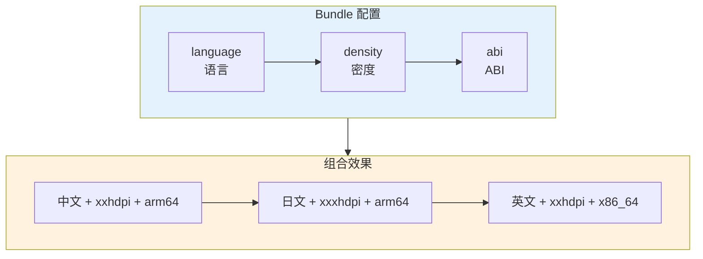

# 21.1.89 BundleAbi

午后的阳光逐渐变得毒辣起来，洛芙用手扇了扇风，看向黛琳。

“刚才说的ABI拆分，我还是有点不太明白，”洛芙问道，“CPU架构到底是什么呀？我们为什么要关心这个？”

黛琳还没有回答，希尔已经从背包里翻出了一个旧手机。

“看这个，”希尔把手机递给大家，“这是我的老安卓机，用的是联发科的处理器。洛芙，你的手机呢？”

洛芙翻出自己的手机：“我的是小米，用的高通骁龙。”

“那你们两个的CPU架构就不一样，”希尔解释道，“你的小米用的是ARM公司的arm64-v8a架构，我的旧机子可能是armeabi-v7a。不同的架构需要不同的原生库。”

伊莎好奇地问：“那如果不拆分会怎样？”

“不拆分的话，”黛琳接过大白板笔，在白板上画了一个大大的包，“APK里要包含所有架构的原生库——armeabi-v7a、arm64-v8a、x86、x86_64……每个架构都塞一套，结果就是APK体积暴涨。”

---

## 常见的CPU架构有哪些

黛琳在白板上列出了Android常见的CPU架构：



“Android设备主要使用两大类CPU架构，”黛琳讲解道：

- **ARM架构**：绝大多数手机和平板使用
  - `armeabi-v7a`：32位ARM，2015年以前的设备
  - `arm64-v8a`：64位ARM，2015年以后的主流设备
  
- **x86架构**：主要用于模拟器和部分平板
  - `x86`：32位，基本不用了
  - `x86_64`：64位，模拟器专用

洛芙举手提问：“那我们是不是应该把所有架构都打包进去？这样不就能兼容所有设备了吗？”

“理论上是这样，”希尔摇摇头，“但实际上这样做的话，原生库体积会非常大。你想象一下，一个libc++_shared.so文件，可能只有2MB，但如果每个架构都放一份，那就变成8MB了。”

---

## BundleAbi配置详解

黛琳把白板翻到新的一页，开始讲解BundleAbi的具体配置。

“BundleAbi是Bundle DSL中专门用来配置ABI拆分的部分，”她边写边说，“核心就是两个配置项：`enableSplit`和`include`。”

```kotlin
// app/build.gradle.kts

android {
    bundle {
        abi {
            // 是否启用ABI拆分
            // true = 为每个支持的ABI生成独立的资源包
            // false = 所有ABI打包在一起（不推荐，体积大）
            enableSplit = true
            
            // 可选：指定要包含的ABI列表
            // 如果不写，默认包含所有ABI
            // 建议只包含主流架构以减小体积
            include("arm64-v8a", "x86_64")
        }
    }
}
```

伊莎看着代码问：“`include`里面的顺序有什么讲究吗？”

“有的！”希尔抢着回答，“顺序是有意义的——Gradle会按顺序查找资源，第一个找到的就用它。所以通常把主流架构放在前面。”

---

## 实战：配置ABI拆分

希尔打开笔记本电脑，连接到露营地的移动热点：“我们实际操作一下，看看不同配置的效果。”

首先是不启用ABI拆分的情况：

```kotlin
// ❌ 不推荐：所有ABI打包在一起
android {
    bundle {
        abi {
            enableSplit = false
        }
    }
}
```

黛琳画出了对应的资源分布图：



“这种模式下，所有CPU架构的原生库都塞进一个APK，”黛琳解释道，“用户不管是高通骁龙还是联发科，都得下载完整的包。”

洛芙问：“那如果我只想要arm64-v8a呢？”

“那就启用拆分，并指定要包含的架构，”希尔切换到下一个配置：

```kotlin
// ✅ 推荐：只包含主流架构
android {
    bundle {
        abi {
            enableSplit = true
            // 只包含64位ARM和64位x86（模拟器）
            // 排除32位架构以减小体积
            include("arm64-v8a", "x86_64")
        }
    }
}
```

黛琳更新了图示：



“这样用户用的是什么架构，就下载对应的原生库，”希尔说，“比如用高通骁龙8 Gen 3的手机，只会下载包含arm64-v8a的APK，比完整包小很多。”

---

## 架构选择的策略

伊莎提出了一个问题：“那我们应该选择哪些架构呢？总不能只选一个吧？”

“这个问题问得好，”黛琳点点头，“不同公司有不同策略，我来说几种常见的。”

她在白板上画了一个决策流程：



“主流策略有三种，”黛琳讲解道：

**策略一：只支持64位（推荐）**
```kotlin
// 适用于绝大多数场景
abi {
    enableSplit = true
    include("arm64-v8a")
}
```

“2015年以后的设备基本都支持64位了，”黛琳说，“只打包arm64-v8a可以显著减小体积，而且性能更好。”

**策略二：64位 + 模拟器**
```kotlin
// 兼顾真机和模拟器开发
abi {
    enableSplit = true
    include("arm64-v8a", "x86_64")
}
```

“很多开发者需要用模拟器调试，”希尔补充道，“x86_64是模拟器最快的架构。”

**策略三：全部支持**
```kotlin
// 兼容所有设备（包括老设备）
abi {
    enableSplit = true
    include("armeabi-v7a", "arm64-v8a", "x86_64")
}
```

“这种适合需要兼容非常老的设备的App，”黛琳说，“但体积会比较大。”

---

## 反模式：过度精简

洛芙忽然想到一个问题：“如果我只保留一个最小的架构，会不会APK最小？”

希尔表情严肃起来：“确实有人这么做，但这是个陷阱。”

```kotlin
// ❌ 反模式：只保留x86

abi {
    enableSplit = true
    include("x86_64")
}
```

“问题在于x86架构的手机非常少，”希尔解释道，“绝大多数Android手机都是ARM架构。如果只保留x86，那这些用户的手机就完全无法安装你的App了！”

黛琳补充道：“即使不考虑兼容性问题，x86在真机上的性能也不如ARM原生架构。所以这种过度精简的策略是绝对不推荐的。”

洛芙吐了吐舌头：“还好我没有真的这么干……”

---

## 反模式：保留过时的32位架构

希尔又展示了另一个常见的错误：

```kotlin
// ❌ 反模式：保留所有32位架构

abi {
    enableSplit = true
    include("armeabi-v7a", "arm64-v8a", "x86", "x86_64")
}
```

“2024年了还在包含x86和armeabi-v7a是完全没必要的，”希尔说，“这些32位架构在现代设备上已经被淘汰了。”

黛琳画出了趋势图：



“Google Play已经从2021年开始强制要求64位了，”黛琳说，“新提交的App不允许包含32位原生库。”

---

## 重构后：最佳实践配置

希尔展示了最终的推荐配置：

```kotlin
// ✅ 推荐配置：平衡兼容性和体积

android {
    bundle {
        abi {
            // 必须启用拆分
            enableSplit = true
            
            // 策略：64位ARM + 64位x86（仅模拟器）
            // 这样可以覆盖：
            // - 2015年以后的所有现代手机（arm64-v8a）
            // - Android模拟器（x86_64）
            include("arm64-v8a", "x86_64")
        }
    }
}
```

“如果你的App不需要支持模拟器测试，”希尔补充道，“甚至可以只保留arm64-v8a，体积最小化。”

洛芙问：“那armeabi-v7a那些32位架构真的可以完全放弃吗？”

“对于新App来说完全可以，”黛琳确认道，“Google Play已经强制64位了。如果你的App需要支持非常老旧的设备，那可以保留32位，但一定要做好体积会变大的心理准备。”

---

## 验证ABI配置效果

希尔运行了Gradle构建命令，让大家看实际输出：

```bash
# 构建release版本的App Bundle
./gradlew bundleRelease

# 查看生成的APK列表
ls -la app/build/outputs/bundle/release/

# 示例输出：
# app-release.aab
# app-release-armeabi-v7a.apk        # 32位ARM（如果不包含则不会有）
# app-release-arm64-v8a.apk          # 64位ARM
# app-release-x86_64.apk             # 64位x86
```

“如果你的`include`只配置了`arm64-v8a`和`x86_64`，”希尔说，“那只会生成这两个APK，不会有32位的。”

黛琳补充道：“这就是BundleAbi的力量——按需下载，用户无感。”

---

## 与其他Bundle配置的配合

伊莎忽然问道：“ABI配置和之前学的语言配置、密度配置是什么关系？可以同时使用吗？”

“完全可以！”黛琳重新画了一张大图：



“Bundle的三个拆分配置——语言、密度、ABI——是相互独立的，”黛琳解释道，“Play商店会生成所有可能的组合，但每个用户只会下载自己设备需要的那个组合。”

洛芙惊叹：“那得生成多少个APK啊？”

“理论上是非常多，”希尔说，“但实际上Play商店会用机器学习来优化分发，确保用户下载的是最优的那个。”

---

## 构建变体与ABI

希尔还提到了一个重要点：“ABI配置和buildTypes、productFlavors之间也是有关系的。”

```kotlin
// 完整的配置示例

android {
    // 构建类型
    buildTypes {
        debug {
            isDebuggable = true
        }
        release {
            isMinifyEnabled = true
            isShrinkResources = true
        }
    }
    
    // 产品风味（如果有）
    productFlavors {
        create("free") {
            applicationIdSuffix = ".free"
        }
        create("pro") {
            applicationIdSuffix = ".pro"
        }
    }
    
    // Bundle配置
    bundle {
        abi {
            enableSplit = true
            include("arm64-v8a", "x86_64")
        }
        
        language {
            enableSplit = true
        }
        
        density {
            enableSplit = true
        }
    }
}
```

“每个构建变体都可以有自己的Bundle配置，”希尔解释道，“比如free版本可以只包含基础语言，pro版本包含所有语言。”

---

## 性能影响分析

黛琳最后做了一下性能影响的总结：

| 配置 | APK体积影响 | 性能影响 | 兼容性 |
|------|-------------|----------|--------|
| enableSplit=false | 最大（包含所有架构） | 无差异 | 最好 |
| 仅arm64-v8a | 最小 | 最优 | 仅现代设备 |
| arm64-v8a + x86_64 | 较小 | 最优 | 现代设备 + 模拟器 |
| 全部保留 | 较大 | 无差异 | 最好 |

“从这个表可以看出，”黛琳总结道，“推荐大多数App使用`arm64-v8a + x86_64`的配置，既能覆盖真机和模拟器，又能保持最小的APK体积。”

---

洛芙伸了个懒腰，看着树荫外明晃晃的阳光：“原来CPU架构有这么多讲究！我以前换手机的时候只看存储大小，根本不懂这些。”

“所以Google才要推App Bundle嘛，”希尔笑着说，“让开发者不用纠结这些细节，用户自动得到最适合的包。”

伊莎收拾着白板：“那今天的露营学习就到这里？太阳太大了，我们去找个更凉快的地方吧？”

“我记得前面有个山洞，”黛琳说，“我们去那儿继续？正好可以讲讲其他的Bundle配置……”

“好诶！”洛芙跳起来，“露营就是这样，走到哪儿学到哪儿！”

蝉鸣声还在继续，但四个女孩已经收拾好东西，向着山洞口的方向走去了。

---

> BundleAbi是Android Gradle DSL中用于配置App Bundle ABI（Application Binary Interface）拆分的接口。ABI定义了应用程序与操作系统之间、应用程序与硬件之间的底层接口，不同的CPU架构需要不同的原生库。BundleAbi通过`enableSplit`开关控制是否启用ABI拆分，通过`include`数组指定要包含的具体ABI列表。主流配置为仅包含`arm64-v8a`（覆盖2015年以后的所有现代Android设备）和`x86_64`（仅用于模拟器开发），这样可以在保证兼容性的同时最大化减少APK体积。Google Play自2021年起已强制要求新App支持64位，建议不再包含32位ABI（armeabi-v7a、x86）。ABI拆分与语言拆分、密度拆分相互独立，可以组合使用实现最优的按需下载效果。

---

> 学习建议：BundleAbi配置是App Bundle体积优化的关键一环。建议先确认目标用户的设备分布情况，再决定包含哪些ABI。对于面向国内市场的App，可以只保留arm64-v8a；如果需要支持模拟器调试，加上x86_64。32位ABI已经在2024年被彻底淘汰，新项目无需考虑。配置后务必用bundletool测试不同设备的APK大小，确保策略正确。

## 洛芙的小小日记本

今天学会了怎么配置CPU架构！原来不同的手机处理器需要不同的原生库，ABI就是管这个的～黛琳说现在主流是arm64-v8a，32位的老架构早就淘汰啦！我们只需要打包64位的就够了，这样APK体积小很多！又学到了一个让App更小的技巧！🏕️📱

---

## 今日关键词

**BundleAbi**：Android Gradle DSL中用于配置App Bundle的ABI（应用二进制接口）拆分的接口。

**ABI**：Application Binary Interface，应用二进制接口，定义了应用程序与系统/硬件之间的底层调用约定。

**arm64-v8a**：64位ARM架构，2015年以后的Android主流CPU架构。

**armeabi-v7a**：32位ARM架构，2015年以前的旧设备使用，已被淘汰。

**x86_64**：64位x86架构，主要用于Android模拟器，真机几乎不用。

**x86**：32位x86架构，已被淘汰，仅历史项目可能需要兼容。

**enableSplit**：BundleAbi配置中的开关，控制是否启用ABI资源拆分。

**include**：BundleAbi配置中的数组，指定要包含的具体ABI列表。

**原生库**：Native Library，用C/C++编写的编译后库文件（.so文件），需要针对特定CPU架构编译。

**64位架构**：指CPU一次能处理64位数据的架构，如arm64-v8a、x86_64，相比32位性能更强。

**32位架构**：指CPU一次能处理32位数据的架构，如armeabi-v7a、x86，已被现代设备淘汰。

**App Bundle拆分**：将App的不同资源（语言、密度、ABI）拆分成独立模块，按需下载的机制。

**bundletool**：Google提供的命令行工具，用于从.aab文件生成针对特定设备的APK进行测试。
