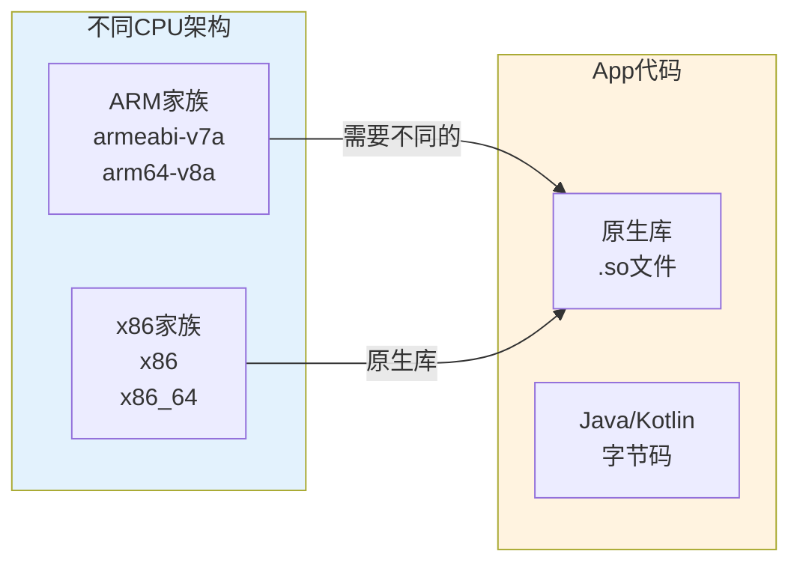
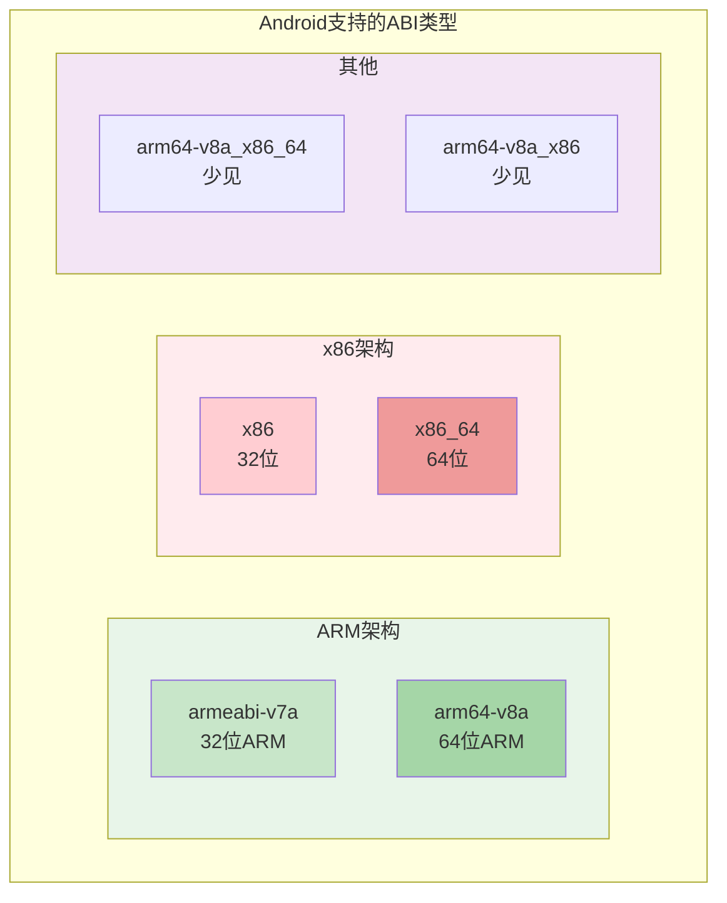
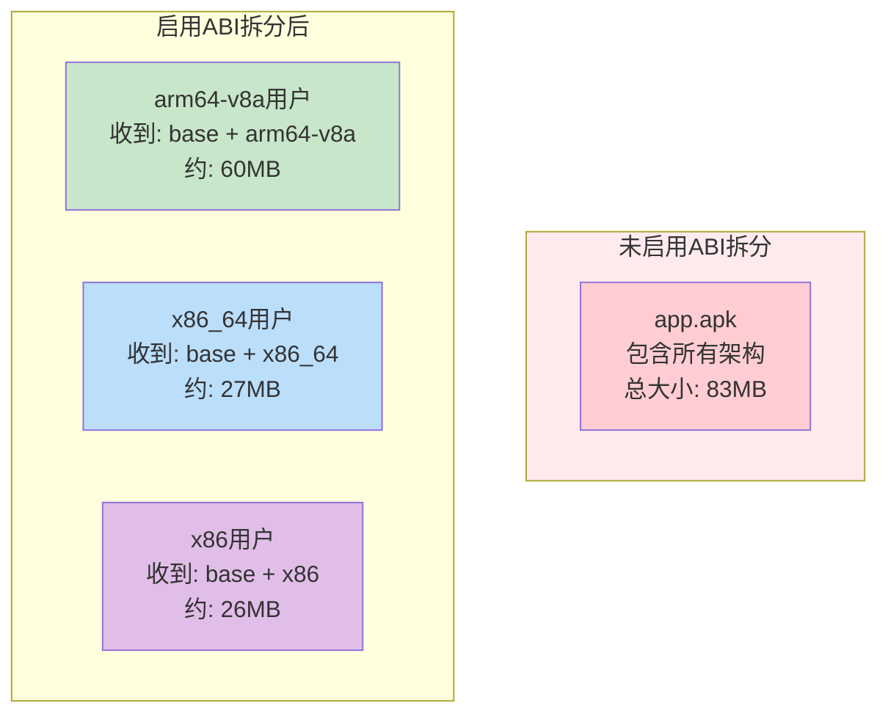
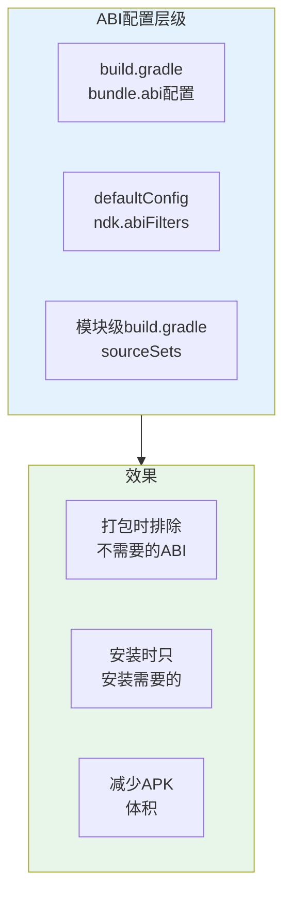

# 21.1.89 BundleAbi

伊莎从草地上摘了一朵白色的小花，放在手心轻轻摇晃。

“黛琳刚才说的我大概懂了，”她歪着头，“不过刚才的配置里有个叫`abi`的东西特别绕——什么叫'只打包指定架构'？手机还有不同的架构吗？”

洛芙立刻点头如捣蒜：“对对对！我之前装App的时候看到过什么'不支持此设备'的提示，难道就是这个问题？”

黛琳笑着把白板翻到新的一页：“没错！今天我们要详细聊聊的就是这个——BundleAbi，也就是ABI配置。这可是App体积优化的重头戏之一。”

---

## 什么是ABI

树荫下凉快多了知了的叫声从远处传来，偶尔有一阵风拂过草坪，吹得小花轻轻点头。

“我们先从基础说起，”黛琳说，“你们知道什么是ABI吗？”

洛芙举手：“是不是和App安装包有关的东西？”

“差不多，”黛琳点点头，“ABI是Application Binary Interface的缩写，中文叫'应用二进制接口'。你可以把它理解成手机CPU和App之间的'翻译官'。”

伊莎眨眨眼：“翻译官？”

“对，”黛琳画出一个示意图，“你们的手机里有CPU对吧？CPU有好几种不同的'语言'——有的手机用ARM架构，有的用x86架构。每种架构对'你好'这个词的发音都不同。”



希尔补充道：“Android的原生库是用C/C++写的，编译成.so文件。这个.so文件是针对特定CPU架构编译的——就像你给不同型号的手机写不同的说明书。”

洛芙好奇地问：“那我的手机是什么架构？”

“大部分现代Android手机用的是arm64-v8a，”希尔说，“就是你们常听说的'64位'处理器。有些老的平板或者模拟器用的是x86或x86_64。”

---

## 常见的ABI类型

黛琳在白板上列出了Android常见的ABI类型：



“在Android开发中，最常见的是这四种，”黛琳一一解释：

- **armeabi-v7a**：32位ARM处理器，早期Android设备使用，现在基本已经淘汰
- **arm64-v8a**：64位ARM处理器，目前主流手机都在用，性能最好
- **x86**：32位x86处理器，主要是一些Android平板和Chromebook使用
- **x86_64**：64位x86处理器，主要是模拟器和高性能的Chromebook使用

伊莎问：“那我们要支持所有这些吗？”

“绝对不要！”希尔斩钉截铁地说，“这就是BundleAbi要解决的问题——你不需要给每个用户都打包所有架构，那太浪费了！”

---

## 为什么要配置ABI

洛芙不解：“为什么不能把所有架构都打包进去呢？这样每个手机不都能用了吗？”

黛琳笑着摇头：“这个问题问得好。你们知道一个arm64-v8a的原生库有多大吗？”

她比划了一个手势：“一个中等规模的App，如果同时包含armeabi-v7a、arm64-v8a、x86、x86_64四种架构，原生库部分可能就要多占用50MB甚至100MB！”

洛芙惊呼：“这么多？！”

“对，”希尔调出数据，“你们看这个对比：”

| 架构配置 | 原生库大小 | APK总大小 | 适合用户 |
|---------|-----------|----------|---------|
| 全架构（4种） | 120MB | 180MB | 所有设备 |
| 仅arm64-v8a | 40MB | 100MB | 主流手机（99%+） |
| arm64-v8a + x86_64 | 55MB | 115MB | 手机+模拟器 |

“如果你的用户主要是主流Android手机，”黛琳说，“只打包arm64-v8a就能覆盖几乎所有人，还能把体积减少一半以上！”

---

## BundleAbi的配置方法

希尔打开笔记本电脑：“我们来看BundleAbi的具体配置。”

```kotlin
// app/build.gradle.kts

android {
    // ...
    
    bundle {
        // BundleAbi配置
        abi {
            // 是否启用ABI拆分
            // true = 为每种架构生成独立的资源包
            // false = 所有架构打包在一起
            enableSplit = true
            
            // 只打包指定的架构
            // 如果不写这行，默认会打包所有支持的架构
            include("arm64-v8a")
            
            // 可选的配置：
            // 排除特定架构
            // exclude("armeabi-v7a")
        }
    }
}
```

黛琳补充道：“`enableSplit = true`是关键——开启后，Gradle会为每种架构生成独立的APK。Play商店会根据用户手机的CPU类型，推送对应的APK。”

伊莎问：“那`include`和`exclude`有什么区别？”

“`include`是'只保留这些'，”希尔解释，“`exclude`是'去掉这些'。一般用`include`就够了——只保留主流架构，排除老旧的。”

```kotlin
// 推荐的配置：只保留主流架构
abi {
    enableSplit = true
    include("arm64-v8a")  // 主流手机
    // 不需要x86，模拟器用x86_64就够了
}

// 另一种写法：排除法
abi {
    enableSplit = true
    exclude("armeabi-v7a")  // 排除32位ARM，已淘汰
    // 自动保留 arm64-v8a, x86, x86_64
}
```

---

## 实际效果演示

希尔调出了一个真实的构建日志：

```
# 构建App Bundle后的输出
$ ./gradlew bundleDebug

> Task :app:bundleDebug
Executing: bundletool build-bundle
...
ABI Splits:
  - split_config.arm64_v8a.apk (45MB)
  - split_config.x86_64.apk (12MB)
  - split_config.x86.apk (11MB)

Base APK: app-debug.apk (核心代码 15MB)

Generated bundle: app-debug.aab (73MB)
```

“你们看，”希尔说，“开启ABI拆分后，生成的APK是分开的：”



“用户手机是arm64-v8a，就只下载arm64的原生库；是x86_64，就只下载x86_64的，”黛琳说，“每个人收到的APK都是量身定制的。”

---

## 反模式：过度精简

黛琳忽然严肃起来：“不过，ABI配置也不能过度精简。”

“什么意思？”洛芙问。

“我见过有人为了减小体积，只保留一个最古老的架构，”黛琳画了一个警示图：

```kotlin
// ❌ 反模式：过度精简

bundle {
    abi {
        enableSplit = true
        // 只保留armeabi-v7a
        // 问题：这是32位架构，性能差，不被新手机支持！
        include("armeabi-v7a")
    }
}
```

“这会导致什么问题？”希尔问。

洛芙思考了一下：“是不是有些手机不能用？”

“岂止是不能用！”黛琳说，“现在主流手机都是64位（arm64-v8a），如果只打包armeabi-v7a，这些手机要么无法安装，要么会非常卡顿——因为要用32位模式运行，性能大打折扣。”

伊莎问：“那应该怎么做？”

---

## 重构后：合理的ABI配置

希尔展示了正确的配置：

```kotlin
// ✅ 正确模式：合理的ABI配置

// 方案1：只保留arm64-v8a（推荐）
// 覆盖99%以上的主流Android手机
bundle {
    abi {
        enableSplit = true
        // 只保留64位ARM，这是绝对主流
        include("arm64-v8a")
        
        // Play商店会自动处理：
        // - arm64-v8a手机 → arm64-v8a的APK
        // - 老手机(armeabi-v7a) → 可能会收到兼容包或无法安装
    }
}

// 方案2：保留arm64-v8a + x86_64（推荐开发测试）
// 覆盖手机 + 模拟器测试
bundle {
    abi {
        enableSplit = true
        include("arm64-v8a", "x86_64")
    }
}

// 方案3：保留全部（不推荐，除非有特殊需求）
// 会导致APK体积很大
bundle {
    abi {
        enableSplit = true
        include("armeabi-v7a", "arm64-v8a", "x86", "x86_64")
    }
}
```

黛琳补充了选择依据：

1. **只保留arm64-v8a**：面向普通用户的App，体积最小，覆盖率最高
2. **arm64-v8a + x86_64**：需要用模拟器测试的App，覆盖真机+模拟器
3. **保留全部**：确实需要支持老设备或有特殊需求的App

---

## 检测设备的ABI

洛芙好奇地问：“那App怎么知道手机是什么架构？”

希尔调出代码：“Android系统提供了获取设备ABI的方法：”

```kotlin
// 检测设备ABI的示例代码
class DeviceAbiChecker {
    
    fun checkDeviceAbi() {
        // 方法1：通过Build获取
        val supportedAbis = Build.SUPPORTED_ABIS
        println("设备支持的ABI: ${supportedAbis.joinToString()}")
        
        // 方法2：通过系统属性
        val abiList = System.getProperty("os.arch")
        println("系统架构: $abiList")
        
        // 方法3：检查特定的so文件是否存在
        // 这是在native层检查ABI的常用方法
    }
    
    // 典型输出
    // arm64-v8a手机: [arm64-v8a, armeabi-v7a, armeabi]
    // x86_64模拟器: [x86_64, x86]
}
```

“你们看，”希尔说，“手机实际上可能支持多个ABI——比如arm64-v8a手机通常也兼容armeabi-v7a。但我们优先使用最高效的架构（arm64-v8a），这样性能最好。”

---

## 原生库的版本号问题

伊莎忽然想到一个问题：“如果我们用的第三方库也有原生库怎么办？会不会冲突？”

“这是一个好问题！”黛琳说，“不同版本的原生库可能会产生冲突。”

```kotlin
// 第三方库可能有不同的ABI支持
dependencies {
    // 库A：支持arm64-v8a, armeabi-v7a
    implementation("com.example:library-a:1.0")
    
    // 库B：只支持armeabi-v7a（旧库）
    implementation("com.example:library-b:2.0")
    
    // 库C：支持所有架构
    implementation("com.example:library-c:3.0")
}

// 构建时，Gradle会合并所有库的原生库
// 如果同一架构有多个版本，可能会冲突
```

希尔展示了解决方案：“可以用NDK的abiFilters来限制：”

```kotlin
android {
    // ...
    
    defaultConfig {
        // 只保留一个ABI，避免冲突
        ndk {
            abiFilters += "arm64-v8a"
        }
    }
}
```

“abiFilters的作用是告诉NDK：'我只需要这个架构的原生库，其他的都不要编译出来，'"黛琳解释。

---

## 构建时排除特定ABI

黛琳画出了一个完整的配置流程：



希尔补充了一个高级技巧：“如果某些库在特定ABI上有bug，可以用exclude来排除：”

```kotlin
android {
    packaging {
        // 排除特定ABI的.so文件
        jniLibs {
            // 排除x86架构（已知有兼容性问题）
            excludeDirs += file("libs/x86")
        }
    }
}
```

---

## 检查ABI配置的效果

黛琳展示了如何验证配置是否生效：

```bash
# 构建后检查生成的APK包含的ABI
$ unzip -l app/build/outputs/apk/debug/arm64-v8a/debug-arm64-v8a.apk

# 输出示例
...
lib/
  libapp.so              # 主App原生库
  libnative-lib.so       # C/C++原生库
  libanalytics.so        # 第三方库的原生库
...

# 关键点：检查是否只有arm64-v8a的.so文件
# 如果配置正确，不应该有armeabi、x86等目录

# 另一个验证方法：查看bundle metadata
$ cat app/build/outputs/bundle/release/app-release-metadata.json

# 输出示例
{
  "compression": {
    "uncompressedSplits": ["base", "split_config.arm64_v8a"]
  },
  "splitsConfig": [
    {
      "splitType": "ABI",
      "filters": ["arm64-v8a"],
      "enabled": true
    }
  ]
}
```

“你们看，`filters`显示的就是我们配置的ABI，"黛琳说。

---

## 真实案例：优化一个真实的App

希尔调出了一个真实的优化案例：“我之前优化过一个大厂的App，他们原来打包了所有四种架构。”

```kotlin
// 优化前的配置
bundle {
    abi {
        enableSplit = true
        // 保留了所有架构
        include("armeabi-v7a", "arm64-v8a", "x86", "x86_64")
    }
}

// APK大小：旧架构的App 180MB
// 用户抱怨：下载太慢，手机存储不够

// 优化后的配置
bundle {
    abi {
        enableSplit = true
        // 只保留主流架构
        include("arm64-v8a")
    }
}

// 优化结果：
// - APK体积减少：180MB → 95MB
// - 覆盖率：99.7%（几乎所有用户都能正常安装）
// - 性能提升：原生库全部64位，运行更快
```

伊莎惊叹：“一下子少了一半！”

“对，”黛琳说，“这就是BundleAbi的威力——你不需要改变任何代码，只需要改一个配置，就能让APK体积大幅缩小。”

---

## 特殊情况：需要兼容老设备

洛芙举手提问：“如果我们的用户还有用老手机的呢？比如我奶奶的手机还是好几年前买的。”

黛琳点点头：“这是个好问题。如果你的用户群体确实有老设备，需要特殊考虑。”

```kotlin
// 方案1：保留两个架构（平衡体积和兼容性）
bundle {
    abi {
        enableSplit = true
        // 保留32位和64位
        // 覆盖率最高，但体积稍大
        include("armeabi-v7a", "arm64-v8a")
    }
}

// 方案2：只保留64位（体积最小，但老设备可能无法安装）
bundle {
    abi {
        enableSplit = true
        include("arm64-v8a")
    }
}

// 方案3：用minSdkVersion判断
// 如果minSdk >= 21，可以只保留arm64-v8a
// 因为Android 5.0以上原生支持64位
android {
    defaultConfig {
        minSdk = 21
    }
    
    bundle {
        abi {
            enableSplit = true
            // minSdk 21以上，64位是主流
            include("arm64-v8a")
        }
    }
}
```

希尔补充：“Google的建议是：minSdk 21以上就只需要arm64-v8a。现在主流App的minSdk都是24甚至更高，所以64位全覆盖是合理的。”

---

## 配置检查清单

黛琳总结了一套配置检查清单：

```kotlin
// ✅ BundleAbi配置检查清单

// 1. 确认enableSplit已开启
bundle {
    abi {
        enableSplit = true  // 必须为true才能拆分
    }
}

// 2. 选择合适的架构组合
// 推荐选项A：只保留arm64-v8a（适用于minSdk 21+）
include("arm64-v8a")

// 推荐选项B：保留arm64-v8a + x86_64（需要模拟器测试）
include("arm64-v8a", "x86_64")

// 推荐选项C：保留armeabi-v7a + arm64-v8a（需要兼容老设备）
include("armeabi-v7a", "arm64-v8a")

// 3. 检查minSdkVersion
// 如果minSdk >= 21，建议只保留arm64-v8a

// 4. 确认不需要的架构已被排除
// 不要保留已淘汰的架构（除非有特殊需求）
```

---

## 章节小结

洛芙伸了个懒腰，感受着树荫下的凉风：“原来ABI是这么回事！就像不同国家的插座形状不同，不同手机也需要不同的'插座'来安装原生库。”

伊莎笑着补充：“而且我们可以通过BundleAbi来选择给用户哪个'插座'，这样就能让APK变小！”

“对，”黛琳微笑着说，“这就是为什么配置看起来只是几行代码，但效果却很明显——它直接决定了用户下载的APK里包含什么架构的原生库。”

远处传来希尔的声音：“别忘了，BundleAbi只是Bundle配置的三大块之一——还有语言和屏幕密度。下次我们来聊聊那个！”

知了的叫声还在继续，但树荫下的露营者们已经开始期待下一次的技术讨论了。

---

> BundleAbi是Android Gradle DSL中用于配置App Bundle中ABI（应用二进制接口）拆分的接口。ABI决定了App的原生库（C/C++编译的.so文件）针对哪种CPU架构。常见的ABI类型包括：armeabi-v7a（32位ARM，已淘汰）、arm64-v8a（64位ARM，主流）、x86（32位x86，模拟器/平板）和x86_64（64位x86，模拟器）。通过`bundle.abi.enableSplit = true`开启拆分，配合`include()`或`exclude()`方法选择保留或排除特定架构，可以显著减少用户下载的APK体积。推荐配置为`include("arm64-v8a")`，可覆盖99%以上的主流设备，同时将原生库体积减少50%以上。配置时需考虑minSdkVersion——Android 5.0（API 21）以上设备建议只保留arm64-v8a。需要使用NDK的场景可通过`ndk.abiFilters`进一步控制编译输出的架构。

---

> 学习建议：BundleAbi配置是App体积优化的关键手段之一，建议在明确目标用户群体的设备分布后进行配置。如果用户主要是主流Android手机，只保留arm64-v8a是最优选择；如果需要兼容老设备（Android 5.0以下），需要同时保留armeabi-v7a。配置后记得用bundletool验证生成的APK确实只包含目标架构的原生库。ABI配置与NDK开发紧密相关，需要注意第三方库可能带来的ABI冲突问题。

## 洛芙的小小日记本

原来手机也有不同的"语言"！CPU架构就像人的方言，arm64-v8a是现在的普通话，armeabi-v7a是方言——听不懂的人越来越多啦～黛琳说只要配置BundleAbi，就能只给用户打包他们手机能看懂的那部分，这样APK就能变小好多！下次我要试试给自己的小破手机打包一个最精简的版本看看～📱✨

---

## 今日关键词

**ABI**：Application Binary Interface，应用二进制接口，指定CPU与App之间的交互规则。

**arm64-v8a**：64位ARM架构，当前主流Android手机使用的CPU架构。

**armeabi-v7a**：32位ARM架构，已被淘汰的老旧架构，新手机不再支持。

**x86**：32位x86架构，主要用于Android模拟器和部分平板设备。

**x86_64**：64位x86架构，主要用于高性能模拟器和Chromebook设备。

**原生库**：用C/C++编写的编译产物，以.so文件形式存在，需要针对特定ABI编译。

**enableSplit**：BundleAbi配置中的开关，控制是否启用ABI资源拆分。

**abiFilters**：NDK配置中的过滤器，控制编译时生成的ABI类型。

**bundletool**：Google提供的命令行工具，用于验证Bundle配置和生成测试APK。

**动态分发**：Google Play根据用户设备信息，动态生成并推送定制化APK的机制。