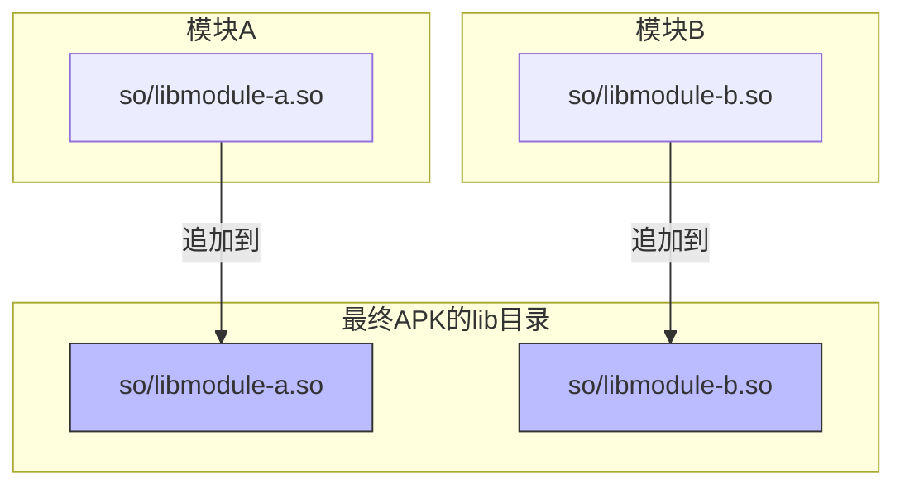
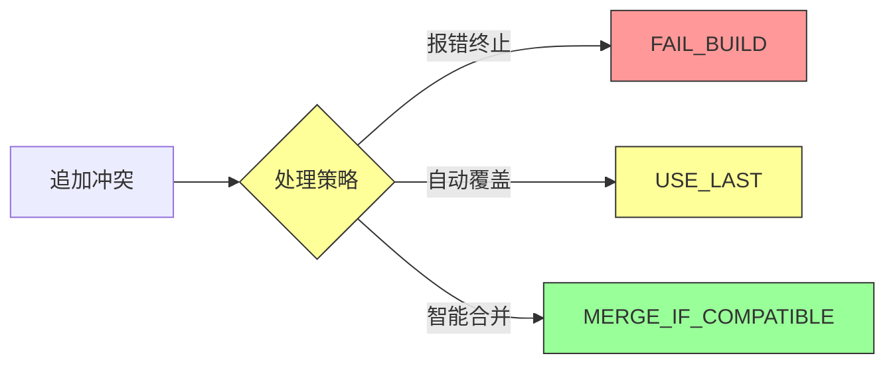
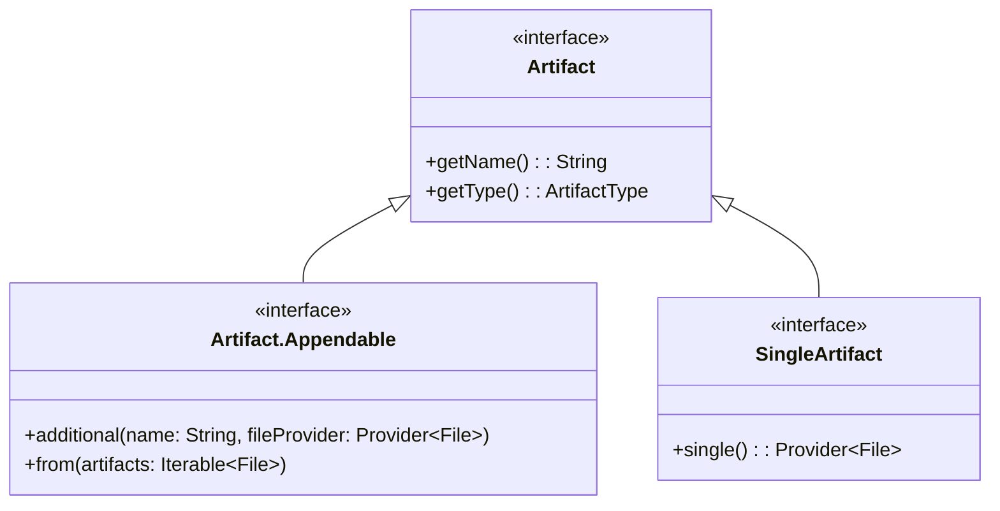

# 21.1.9 Artifact.Appendable

太阳已经升高了，热辣辣地照在帐篷上。洛芙用手遮住眼睛，看着远处的山坡上蒸腾起的热浪。才一会儿功夫，她就已经开始想念树荫了。

“这么大的太阳，我们今天还出去吗？”洛芙问道。

黛琳正在整理她的背包，頭也不抬地說：“今天不出去，我们在帐篷里继续学习。上次不是说了吗，今天要讲一种特殊的 Artifact。”

洛芙一回想，眼睛一亮：“是不是那种可以往里面‘加东西’的 Artifact？”

“bingo！”希尔从笔记本后面探出头来，笑容灿烂，“看来你记得很清楚嘛。没错，今天要讲的就是 Artifact.Appendable——可以追加的人工制品。”

伊莎递过来一瓶水，温柔地说：“先喝点水吧，听起来就很口渴的样子。”

洛芙接过水喝了一口，好奇地问：“可是…… Artifact 为什么要分‘可以追加’和‘不能追加’呢？之前讲的那些 Artifact 不能追加吗？”

黛琳在地毯上坐下，拍了拍旁边的位置示意洛芙坐近点：“问得好。你还记得上次说的 APK 吗？”

“记得，就是那个蓝色的瓶子，最后会装到手机里的那个。”

“对。那么我问你——”黛琳比划着，“如果我想在 APK 里多加一张图片、多加一个字体文件，该怎么做到？”

洛芙想了想：“呃……在源代码的 res 文件夹里放进去？”

“没错，那是源代码阶段的方法，”黛琳点点头，“但如果我想在构建过程中‘动态地’加东西呢？比如——我想把调试信息单独打成一个文件放进 APK，或者我想把不同模块的资源合并到一起？”

洛芙摇头表示不懂。

黛琳笑着拿出一张白纸，在上面画起来：“想象你在搭一个乐高城堡。通常情况下，你会先想好要搭什么，然后按步骤拼——这就像普通的 Artifact，只有最终的一个成品。但有时候，你会想要‘中途’加一些零件进去——比如城堡搭到一半，发现忘了装窗户，这时候就需要把窗户‘追加’进去。”

“原来如此！”洛芙眼睛亮了起来，“那哪些 Artifact 是可以追加的呢？”

希尔接过话题，在电脑上敲了几下，调出一段代码：“看好了——”

```kotlin
// 使用 Appendable Artifact 的例子
android.applicationVariants.all { variant ->
    variant.artifacts.use { artifacts ->
        // 获取一个可追加的目录 artifact
        // 这种 artifact 代表一个目录，可以往里面添加文件
        artifacts.get(ArtifactType.APP_PACKAGE_INITIALS)
            .additional("debug") {
                // 添加调试用的初始化器
                // 这个 closure 返回要添加的文件
                project.layout.buildDirectory.file("init/debug_init.jar")
            }
    }
}
```

洛芙盯着代码看了半天：“这个 'ADDitional' 就是‘追加’的意思吗？”

“对，”希尔点点头，“这是新版 API 的写法。用 `additional()` 方法可以向一个已经存在的 artifact 追加额外的文件。”

黛琳补充道：“你可以把 Artifact.Appendable 想象成一个‘收纳盒’。普通的 artifact 是一个密封的盒子——做好了就不能改；但可追加的 artifact 是一个带拉链的收纳盒，中途还可以往里塞东西。”

伊莎好奇地问：“那常见的可追加 artifact 有哪些呢？”

黛琳掰着手指如数家珍：

“首先是最常见的——**资源目录（Resources）**。你可以在构建时向 res 目录追加额外的资源文件，比如多语言字符串、额外的布局文件等。”

“其次是 **Assets 目录**。Assets 和 Resources 的区别在于——Resources 会被编译，Assets 保持原样。所以 Assets 特别适合放字体文件、配置文件这种不需要编译的原始数据。”

“还有 **JniLibs**——就是 native 库。你知道的，有些库是用 C/C++ 写的，会编译成 .so 文件。这些 .so 文件就可以通过可追加 artifact 的方式加到 APK 里。”

洛芙举手提问：“那……如果我有两个模块，都要往 APK 里加 JniLibs，会不会冲突啊？”

“好问题！”黛琳打了个响指，“这就是为什么需要‘可追加’这个特性。想象你在整理一个文件夹，如果有两个人同时往里扔文件，肯定会乱套。所以 Artifact.Appendable 的关键在于——它是一个 **有序的、可以合并的** 容器，而不是简单的‘往里塞’。”

她在白板上画了一个示意图：



“看到了吗？”黛琳指着图说，“每个模块贡献自己的 .so 文件，最终在 APK 里合并成一个完整的 lib 目录。系统会帮你处理合并的顺序和冲突。”

洛芙似懂非懂地点点头：“那……这个和之前说的那个旧版 API 有什么区别？”

希尔 grin（露出灿烂的笑容）：“区别可大了！旧版 API 想要追加点东西，得用各种 trick，比如修改 sourceSets、配置 mergeResources 任务之类的。新版 API 直接给你一个统一的接口，想追加什么就追加什么。”

她在电脑上敲出两段代码对比：

```kotlin
// ❌ 旧版方式：麻烦，容易出错
android {
    sourceSets {
        main {
            // 硬编码路径
            jniLibs.srcDirs += "path/to/custom/libs"
        }
    }
}

// 或者用 mergeResources 任务
tasks.withType<MergeSourceSetFolders> {
    // 这里要写一堆条件判断
    if (name.contains("main")) {
        // 手动处理合并逻辑
    }
}
```

“这也太复杂了吧！”洛芙惊呼。

“还有更复杂的呢，”希尔又敲出一段代码：

```kotlin
// ✅ 新版方式：简洁清晰
android.applicationVariants.all { variant ->
    variant.artifacts.use { artifacts ->
        // 直接追加 JniLibs
        artifacts.get(ArtifactType.JNI_LIBS)
            .additional("custom-libs") {
                project.file("libs/extra-native.so")
            }
        
        // 追加 Assets
        artifacts.get(ArtifactType.ASSETS)
            .additional("custom-fonts") {
                project.file("assets/fonts/my-font.ttf")
            }
    }
}
```

洛芙看看左边那团乱麻，再看看右边这段整整齐齐的代码：“这差距也太大了……新版 API 是怎么做到的？”

黛琳笑着说：“秘密在于——新版 API 把所有类型的 artifact 都统一抽象了。不管你是要追加 JniLibs 还是 Assets，调用方式都一样。这样一来，API 的学习成本大大降低，出错的概率也小了很多。”

伊莎轻轻拨弄着笔筒里的笔，柔声说道：“就像露营时收纳装备——以前要分别整理帐篷、炊具、食材，用不同的方法；现在有了一个统一的‘收纳系统’，按照类型往里放就行，省心多了。”

洛芙深有感触地点点头：“那……如果我想看看最终追加了哪些文件，该怎么检查呢？”

希尔又在电脑上敲了几下：“问得好！来，看这段代码——”

```kotlin
// 查看追加的 artifact 内容
android.applicationVariants.all { variant ->
    variant.artifacts.use { artifacts ->
        // 获取最终的 JniLibs artifact
        artifacts.get(ArtifactType.JNI_LIBS).finalizedBy { jniLibs ->
            // 遍历所有追加来源
            jniLibs.artifacts.from.each { addedFile ->
                println("追加的 JniLib: ${addedFile.asFile.name}")
            }
            
            // 查看最终合并后的目录
            jniLibs.outputDirectory.map { dir ->
                dir.listFiles()?.forEach { file ->
                    println("最终文件: ${file.name}")
                }
            }
        }
    }
}
```

“运行一下看看输出？”洛芙期待地说。

希尔耸耸肩：“这得在真实的 Android 项目里运行才行。不过我可以给你看看大概会输出什么——”

```text
追加的 JniLibs: libcustom-native.so
追加的 JniLibs: libtensorflowLite.so
最终文件: libarmeabi-v7a/libcustom-native.so
最终文件: libarmeabi-v7a/libtensorflowLite.so
最终文件: libarm64-v8a/libcustom-native.so
最终文件: libarm64-v8a/libtensorflowLite.so
```

洛芙惊呼：“原来如此！系统不仅记录了谁追加了文件，还按照 ABI（CPU 架构）自动分类了！”

“对，”黛琳说，“这是 Android 构建系统最强大的地方之一。它会自动帮你处理 ABI 过滤、冲突解决、版本兼容这些麻烦事。你只需要告诉它‘我要追加这个文件’，剩下的不用管。”

洛芙突然想到一个问题：“那……如果我想追加一个文件名和已有的冲突了怎么办？比如两个模块都追加了一个同名的 so 文件？”

黛琳的表情变得认真起来：“这是个好问题。实际上，这种情况下系统会报错，或者选择其中一个覆盖——取决于你的配置。”

她在白板上写下几种处理方式：



“最安全的策略是 MERGE_IF_COMPATIBLE，”黛琳解释道，“系统会检查两个文件是否兼容——比如都是同一版本的同一个库，那就合并；如果不兼容，就报错让你手动解决。”

洛芙拍了拍脑袋：“还好有系统帮忙，不然手动处理这些冲突太可怕了……”

伊莎温柔地笑着说：“所以这就是现代构建系统的意义——把复杂的事情交给机器处理，开发者只需要专注于业务逻辑。”

黛琳点点头，总结道：“今天学的 Artifact.Appendable，关键点有三个——”

“**第一**，它代表可以追加内容的 artifact，常见的有 JniLibs、Assets、Resources 等。”

“**第二**，使用 `additional()` 方法可以向 artifact 追加文件，系统会自动处理合并和冲突。”

“**第三**，新版 API 统一了追加的调用方式，比旧版的各种 trick 简洁安全得多。”

洛芙把这些要点牢牢记在心里。她现在对 Android 构建系统越来越有兴趣了——看起来复杂，实际上每个设计都有它的道理。

太阳渐渐偏西，帐篷里的光线变得柔和起来。洛芙伸了个懒腰，满足地叹了口气。

“今天的露营学习就到这里吧，”黛琳收拾着东西，“明天我们要讲一个新的主题——构建变体和配置。”

“构建变体？”洛芙好奇地问，“是不是就是 debug 版和 release 版那些？”

“没错，”希尔 grinning（露出灿烂的笑容），“不过可不只是 debug 和 release 那么简单——还有各种产品风味（flavor）、构建类型（build type）的组合，会让你打开新世界的大门！”

洛芙期待地看向远方，仿佛已经看到了明天的学习内容。

---

> 技术总结

**Artifact.Appendable** 是 Android Gradle Plugin 8.0+ 引入的接口，用于表示可以在构建过程中追加额外内容的构建产物。与普通的单值 Artifact 不同，Appendable 允许向同一个输出位置添加多个来源的文件，适用于资源合并、Native 库打包等场景。



**常见可追加 Artifact 类型：**

- `JNI_LIBS`：Native 库（.so 文件）
- `ASSETS`：原始资源文件（不编译）
- `RESOURCES`：可编译资源
- `PACKED_RESOURCES`：打包后的资源

**使用示例：**

```kotlin
// 向 JniLibs 追加自定义 native 库
artifacts.get(ArtifactType.JNI_LIBS)
    .additional("my-custom-lib") {
        project.file("libs/custom.so")
    }

// 向 Assets 追加字体文件
artifacts.get(ArtifactType.ASSETS)
    .additional("custom-fonts") {
        project.file("assets/fonts/MyFont.ttf")
    }
```

---

> 学习建议

1. **从简单场景开始**：先尝试向一个空项目追加简单的 Assets 文件，观察构建输出的变化
2. **理解合并规则**：熟悉 Android 构建系统对不同类型 artifact 的合并策略
3. **注意 ABI 过滤**：了解如何配置只保留特定架构的 .so 文件，减小 APK 体积

---

## 洛芙的小小日记本

今天学到了 Artifact.Appendable！原来构建产物不都是"做好就不能改"的，还可以像拉链收纳盒一样中途往里塞东西。黛琳说这就是为什么我们的 APK 能装下那么多模块贡献的资源——系统帮我们自动合并好了。明天要学构建变体，感觉会更有趣的样子>_<
