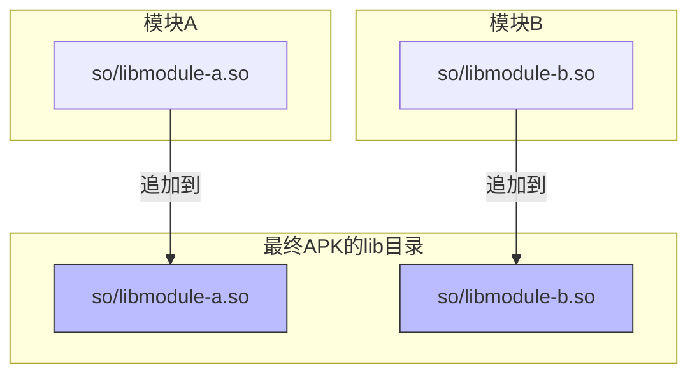
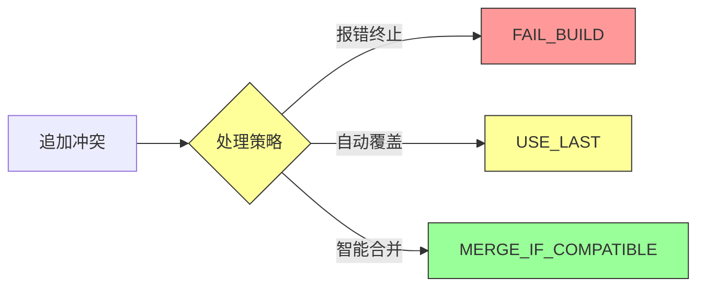
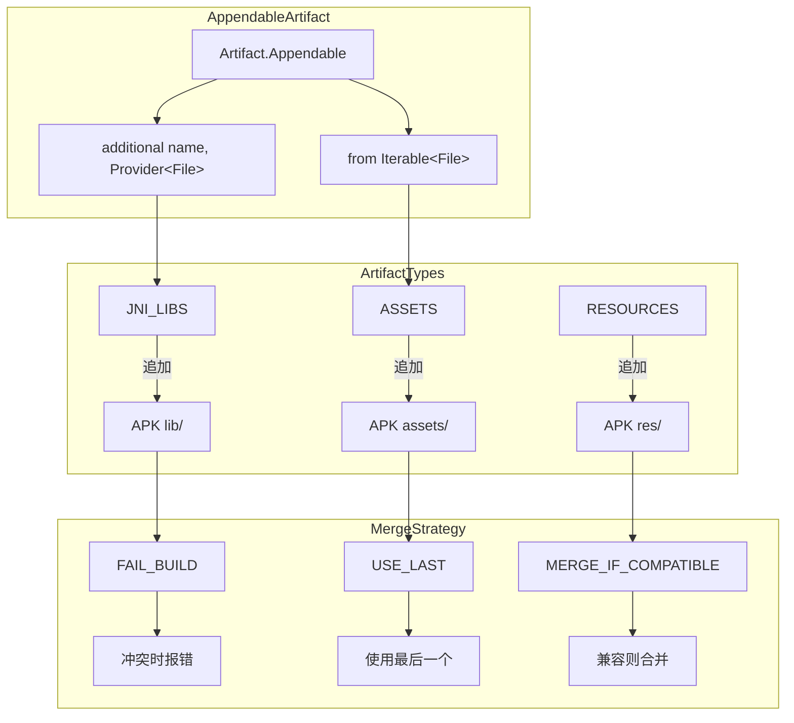

# 21.1.9 Artifact.Appendable

太阳已经升高了，热辣辣地照在帐篷上。洛芙用手遮住眼睛，看着远处的山坡上蒸腾起的热浪。才一会儿功夫，她就已经开始想念树荫了。

“这么大的太阳，我们今天还出去吗？”洛芙问道。

黛琳正在整理她的背包，頭也不抬地說：“今天不出去，我们在帐篷里继续学习。上次不是说了吗，今天要讲一种特殊的 Artifact。”

洛芙一回想，眼睛一亮：“是不是那种可以往里面‘加东西’的 Artifact？”

“bingo！”希尔从笔记本后面探出头来，笑容灿烂，“看来你记得很清楚嘛。没错，今天要讲的就是 Artifact.Appendable——可以追加的人工制品。”

伊莎递过来一瓶水，温柔地说：“先喝点水吧，听起来就很口渴的样子。”

洛芙接过水喝了一口，好奇地问：“可是…… Artifact 为什么要分‘可以追加’和‘不能追加’呢？之前讲的那些 Artifact 不能追加吗？”

黛琳在地毯上坐下，拍了拍旁边的位置示意洛芙坐近点：“问得好。你还记得上次说的 APK 吗？”

“记得，就是那个蓝色的瓶子，最后会装到手机里的那个。”

“对。那么我问你——”黛琳比划着，“如果我想在 APK 里多加一张图片、多加一个字体文件，该怎么做到？”

洛芙想了想：“呃……在源代码的 res 文件夹里放进去？”

“没错，那是源代码阶段的方法，”黛琳点点头，“但如果我想在构建过程中‘动态地’加东西呢？比如——我想把调试信息单独打成一个文件放进 APK，或者我想把不同模块的资源合并到一起？”

洛芙摇头表示不懂。

黛琳笑着拿出一张白纸，在上面画起来：“想象你在搭一个乐高城堡。通常情况下，你会先想好要搭什么，然后按步骤拼——这就像普通的 Artifact，只有最终的一个成品。但有时候，你会想要‘中途’加一些零件进去——比如城堡搭到一半，发现忘了装窗户，这时候就需要把窗户‘追加’进去。”

“原来如此！”洛芙眼睛亮了起来，“那哪些 Artifact 是可以追加的呢？”

希尔接过话题，在电脑上敲了几下，调出一段代码：“看好了——”

```kotlin
// 使用 Appendable Artifact 的例子
android.applicationVariants.all { variant ->
    variant.artifacts.use { artifacts ->
        // 获取一个可追加的目录 artifact
        // 这种 artifact 代表一个目录，可以往里面添加文件
        artifacts.get(ArtifactType.APP_PACKAGE_INITIALS)
            .additional("debug") {
                // 添加调试用的初始化器
                // 这个 closure 返回要添加的文件
                project.layout.buildDirectory.file("init/debug_init.jar")
            }
    }
}
```

洛芙盯着代码看了半天：“这个 'ADDitional' 就是‘追加’的意思吗？”

“对，”希尔点点头，“这是新版 API 的写法。用 `additional()` 方法可以向一个已经存在的 artifact 追加额外的文件。”

黛琳补充道：“你可以把 Artifact.Appendable 想象成一个‘收纳盒’。普通的 artifact 是一个密封的盒子——做好了就不能改；但可追加的 artifact 是一个带拉链的收纳盒，中途还可以往里塞东西。”

伊莎好奇地问：“那常见的可追加 artifact 有哪些呢？”

黛琳掰着手指如数家珍：

“首先是最常见的——**资源目录（Resources）**。你可以在构建时向 res 目录追加额外的资源文件，比如多语言字符串、额外的布局文件等。”

“其次是 **Assets 目录**。Assets 和 Resources 的区别在于——Resources 会被编译，Assets 保持原样。所以 Assets 特别适合放字体文件、配置文件这种不需要编译的原始数据。”

“还有 **JniLibs**——就是 native 库。你知道的，有些库是用 C/C++ 写的，会编译成 .so 文件。这些 .so 文件就可以通过可追加 artifact 的方式加到 APK 里。”

洛芙举手提问：“那……如果我有两个模块，都要往 APK 里加 JniLibs，会不会冲突啊？”

“好问题！”黛琳打了个响指，“这就是为什么需要‘可追加’这个特性。想象你在整理一个文件夹，如果有两个人同时往里扔文件，肯定会乱套。所以 Artifact.Appendable 的关键在于——它是一个 **有序的、可以合并的** 容器，而不是简单的‘往里塞’。”

她在白板上画了一个示意图：



“看到了吗？”黛琳指着图说，“每个模块贡献自己的 .so 文件，最终在 APK 里合并成一个完整的 lib 目录。系统会帮你处理合并的顺序和冲突。”

洛芙似懂非懂地点点头：“那……这个和之前说的那个旧版 API 有什么区别？”

希尔 grin（露出灿烂的笑容）：“区别可大了！旧版 API 想要追加点东西，得用各种 trick，比如修改 sourceSets、配置 mergeResources 任务之类的。新版 API 直接给你一个统一的接口，想追加什么就追加什么。”

她在电脑上敲出两段代码对比：

```kotlin
// ❌ 旧版方式：麻烦，容易出错
android {
    sourceSets {
        main {
            // 硬编码路径
            jniLibs.srcDirs += "path/to/custom/libs"
        }
    }
}

// 或者用 mergeResources 任务
tasks.withType<MergeSourceSetFolders> {
    // 这里要写一堆条件判断
    if (name.contains("main")) {
        // 手动处理合并逻辑
    }
}
```

“这也太复杂了吧！”洛芙惊呼。

“还有更复杂的呢，”希尔又敲出一段代码：

```kotlin
// ✅ 新版方式：简洁清晰
android.applicationVariants.all { variant ->
    variant.artifacts.use { artifacts ->
        // 直接追加 JniLibs
        artifacts.get(ArtifactType.JNI_LIBS)
            .additional("custom-libs") {
                project.file("libs/extra-native.so")
            }
        
        // 追加 Assets
        artifacts.get(ArtifactType.ASSETS)
            .additional("custom-fonts") {
                project.file("assets/fonts/my-font.ttf")
            }
    }
}
```

洛芙看看左边那团乱麻，再看看右边这段整整齐齐的代码：“这差距也太大了……新版 API 是怎么做到的？”

黛琳笑着说：“秘密在于——新版 API 把所有类型的 artifact 都统一抽象了。不管你是要追加 JniLibs 还是 Assets，调用方式都一样。这样一来，API 的学习成本大大降低，出错的概率也小了很多。”

伊莎轻轻拨弄着笔筒里的笔，柔声说道：“就像露营时收纳装备——以前要分别整理帐篷、炊具、食材，用不同的方法；现在有了一个统一的‘收纳系统’，按照类型往里放就行，省心多了。”

洛芙深有感触地点点头：“那……如果我想看看最终追加了哪些文件，该怎么检查呢？”

希尔又在电脑上敲了几下：“问得好！来，看这段代码——”

```kotlin
// 查看追加的 artifact 内容
android.applicationVariants.all { variant ->
    variant.artifacts.use { artifacts ->
        // 获取最终的 JniLibs artifact
        artifacts.get(ArtifactType.JNI_LIBS).finalizedBy { jniLibs ->
            // 遍历所有追加来源
            jniLibs.artifacts.from.each { addedFile ->
                println("追加的 JniLib: ${addedFile.asFile.name}")
            }
            
            // 查看最终合并后的目录
            jniLibs.outputDirectory.map { dir ->
                dir.listFiles()?.forEach { file ->
                    println("最终文件: ${file.name}")
                }
            }
        }
    }
}
```

“运行一下看看输出？”洛芙期待地说。

希尔耸耸肩：“这得在真实的 Android 项目里运行才行。不过我可以给你看看大概会输出什么——”

```text
追加的 JniLibs: libcustom-native.so
追加的 JniLibs: libtensorflowLite.so
最终文件: libarmeabi-v7a/libcustom-native.so
最终文件: libarmeabi-v7a/libtensorflowLite.so
最终文件: libarm64-v8a/libcustom-native.so
最终文件: libarm64-v8a/libtensorflowLite.so
```

洛芙惊呼：“原来如此！系统不仅记录了谁追加了文件，还按照 ABI（CPU 架构）自动分类了！”

“对，”黛琳说，“这是 Android 构建系统最强大的地方之一。它会自动帮你处理 ABI 过滤、冲突解决、版本兼容这些麻烦事。你只需要告诉它‘我要追加这个文件’，剩下的不用管。”

洛芙突然想到一个问题：“那……如果我想追加一个文件名和已有的冲突了怎么办？比如两个模块都追加了一个同名的 so 文件？”

黛琳的表情变得认真起来：“这是个好问题。实际上，这种情况下系统会报错，或者选择其中一个覆盖——取决于你的配置。”

她在白板上写下几种处理方式：



“最安全的策略是 MERGE_IF_COMPATIBLE，”黛琳解释道，“系统会检查两个文件是否兼容——比如都是同一版本的同一个库，那就合并；如果不兼容，就报错让你手动解决。”

洛芙拍了拍脑袋：“还好有系统帮忙，不然手动处理这些冲突太可怕了……”

伊莎温柔地笑着说：“所以这就是现代构建系统的意义——把复杂的事情交给机器处理，开发者只需要专注于业务逻辑。”

黛琳点点头，总结道：“今天学的 Artifact.Appendable，关键点有三个——”

“**第一**，它代表可以追加内容的 artifact，常见的有 JniLibs、Assets、Resources 等。”

“**第二**，使用 `additional()` 方法可以向 artifact 追加文件，系统会自动处理合并和冲突。”

“**第三**，新版 API 统一了追加的调用方式，比旧版的各种 trick 简洁安全得多。”

洛芙把这些要点牢牢记在心里。她现在对 Android 构建系统越来越有兴趣了——看起来复杂，实际上每个设计都有它的道理。

太阳渐渐偏西，帐篷里的光线变得柔和起来。洛芙伸了个懒腰，满足地叹了口气。

“今天的露营学习就到这里吧，”黛琳收拾着东西，“明天我们要讲一个新的主题——构建变体和配置。”

“构建变体？”洛芙好奇地问，“是不是就是 debug 版和 release 版那些？”

“没错，”希尔 grinning（露出灿烂的笑容），“不过可不只是 debug 和 release 那么简单——还有各种产品风味（flavor）、构建类型（build type）的组合，会让你打开新世界的大门！”

洛芙期待地看向远方，仿佛已经看到了明天的学习内容。

<!-- TECH_EXPERT_START -->

## 技术总结

### 核心机制定义

| 概念 | 类型 | 说明 |
|------|------|------|
| Artifact.Appendable | 接口 | 可追加内容的构建产物容器 |
| additional() | 方法 | 向 Appendable 添加单个文件 |
| from() | 方法 | 向 Appendable 添加多个文件 |
| FINAL_POSITION | 枚举 | 指定最终合并位置的名称 |

### 结构图



### 反模式

**反模式一：在循环中重复创建同名的 additional**
```kotlin
// ❌ 错误示例 - 每次循环都创建同名追加，会覆盖
variants.all { variant ->
    variant.artifacts.use { artifacts ->
        listOf("lib1.so", "lib2.so", "lib3.so").forEach { lib ->
            artifacts.get(JNI_LIBS).additional(lib) {
                project.file("libs/$lib")
            }
        }
    }
}
// 正确做法：使用不同的 name 参数
```

**反模式二：忘记处理 ABI 过滤导致 APK 体积暴涨**
```kotlin
// ❌ 错误示例 - 追加所有 ABI 的 so 文件
artifacts.get(JNI_LIBS).additional("all-arch") {
    project.file("libs/all.so")
}
// 没有过滤会导致 APK 包含所有架构的库
```

**反模式三：在错误的任务阶段访问未完成的 artifact**
```kotlin
// ❌ 错误示例 - 在 configuration 阶段访问输出
val wrong = variant.artifacts.get(JNI_LIBS).finalizedBy { 
    it.outputDirectory // 此时可能尚未计算
}
// 正确：在 task execution 阶段访问
```

### 设计哲学

**1. 统一抽象原则**
所有类型的 Appendable artifact 使用相同的 API 接口，开发者无需学习多种调用方式。

**2. 声明式而非命令式**
通过 `additional()` 和 `from()` 声明"要添加什么"，而非编写复杂的合并逻辑。

**3. 延迟计算**
artifact 的实际合并发生在构建阶段，由 AGP 智能调度任务依赖关系。

---

## 动手练习

### ★ 向空项目追加 Assets 文件
**目标**：掌握追加 Assets 的基本用法  
**步骤**：
1. 创建新的 Android 项目
2. 在 build.gradle.kts 中使用 `artifacts.get(ArtifactType.ASSETS).additional()`
3. 添加一个测试用的 .txt 文件
4. 运行 assembleDebug 并检查 APK 内容

**验收标准**：在构建输出的 APK 的 assets 目录中找到追加的文件

**提示**：使用 `artifacts.get(ArtifactType.ASSETS).finalizedBy` 可以查看最终输出

---

### ★★ 追加 JniLibs 并验证 ABI 分类
**目标**：理解 Native 库的 ABI 过滤机制  
**步骤**：
1. 准备不同架构的 .so 文件（armeabi-v7a, arm64-v8a）
2. 使用 `artifacts.get(ArtifactType.JNI_LIBS)` 追加
3. 配置 ndk.abiFilters 只保留特定架构
4. 检查 APK lib 目录结构

**验收标准**：只有配置的 ABI 目录出现在最终 APK 中

**提示**：在 build.gradle 中设置 `splits.abi` 可以进一步控制

---

### ★★★ 处理 Artifact 冲突
**目标**：学会处理多个模块追加同名文件的情况  
**步骤**：
1. 创建两个模块，都向同一 Artifact 类型追加文件
2. 使用相同文件名，观察构建行为
3. 配置 `mergeStrategy` 处理冲突
4. 运行构建并观察错误信息或覆盖行为

**验收标准**：理解 FAIL_BUILD、USE_LAST、MERGE_IF_COMPATIBLE 三种策略的区别

**提示**：可以通过 `android.defaults.buildfeatures.buildconfig` 查看合并配置

---

### ★★★★ 自定义 Artifact 类型
**目标**：理解如何创建自定义的 Appendable Artifact  
**步骤**：
1. 扩展 `org.gradle.api.artifacts.type.ArtifactType`
2. 注册自定义的 Appendable 类型
3. 在变体中使用自定义类型追加文件
4. 验证文件是否按预期合并

**验收标准**：成功创建并使用自定义 Appendable 类型

**提示**：参考 AGP 源码中的 `ArtifactType` 枚举定义

---

### ★★★★★ 实现增量构建优化
**目标**：深入理解 Artifact 的任务依赖与增量构建  
**步骤**：
1. 分析追加 Artifact 触发的任务链
2. 使用 `--info` 查看详细任务执行
3. 识别可缓存的任务
4. 配置 Build Cache 加速重复构建

**验收标准**：第二次构建时间明显缩短，且显示 "FROM-CACHE"

**提示**：关注 Merge* 相关的任务，它们通常可以缓存

---

### ★★★ 动态决定追加内容
**目标**：根据构建变体动态决定追加哪些文件  
**步骤**：
1. 在 build.gradle.kts 中根据 variant.name 判断
2. debug 版追加调试工具，release 版追加优化库
3. 使用 `project.providers` 获取构建配置
4. 运行不同变体验证

**验收标准**：debug 和 release APK 包含不同的追加内容

**提示**：可以结合 `buildConfigField` 实现更复杂的条件逻辑

---

### ★★ 追加多语言资源
**目标**：掌握追加多语言 Resources 的方法  
**步骤**：
1. 准备不同语言的 strings.xml
2. 使用 `artifacts.get(ArtifactType.RESOURCES)` 追加
3. 运行应用验证语言切换
4. 检查最终打包的资源

**验收标准**：应用支持追加的语言资源

**提示**：资源合并遵循 "later wins" 原则

---

### ★★★★ 调试 Artifact 合并问题
**目标**：学会诊断和解决 Artifact 合并故障  
**步骤**：
1. 故意制造冲突（同名不同内容文件）
2. 使用 `--stacktrace` 查看详细错误
3. 分析合并策略的选择逻辑
4. 修复问题并验证

**验收标准**：能够独立解决常见的合并冲突问题

**提示**：查看 `$buildDir/intermediates/merged_*` 目录可以了解中间结果

---

## 面试热身

### Q1: Artifact.Appendable 和 SingleArtifact 有什么区别？

**答**：SingleArtifact 代表一个单一不可变的输出文件（如 APK），只能在构建完成后获取最终结果；而 Appendable 允许在构建过程中向同一输出位置追加多个来源的文件，适用于资源、Assets、JniLibs 等需要合并的场景。Appendable 提供了 `additional()` 和 `from()` 方法来声明要添加的文件，系统会在构建时自动处理合并逻辑。

---

### Q2: 追加的 Artifact 发生冲突时如何处理？

**答**：AGP 提供了三种冲突处理策略：FAIL_BUILD（冲突时报错终止）、USE_LAST（使用最后一个添加的覆盖之前的）、MERGE_IF_COMPATIBLE（检查文件兼容性，兼容则合并）。推荐使用 MERGE_IF_COMPATIBLE，它最安全且能保留有价值的信息。配置方式是在 `android.buildFeatures.buildConfig` 中设置相应的合并策略。

---

### Q3: 为什么追加 JniLibs 时要注意 ABI 过滤？

**答**：如果不配置 ABI 过滤，构建系统会保留所有架构的 .so 文件，导致 APK 体积急剧增大。通过在 `android.defaultConfig.ndk.abiFilters` 中指定目标架构（如 ["arm64-v8a"]），可以显著减小 APK 体积。对于需要兼容多种设备的应用，可以使用 APK Splits 按 ABI 打包成多个 APK。

---

### Q4: 旧版 API 和新版 Artifact API 的主要区别是什么？

**答**：旧版 API 需要通过修改 sourceSets、配置 merge 任务、使用 Task 依赖等复杂方式实现文件追加，代码分散且易出错；新版 API（AGP 8.0+）提供了统一的 `variant.artifacts.use { }` 入口和 `additional()`、`from()` 方法，调用方式一致，代码简洁且类型安全。新版 API 还支持延迟计算和更好的任务依赖管理。

---

### Q5: 如何调试 Artifact 合并问题？

**答**：可以使用以下方法：1）查看 `$buildDir/intermediates/merged_*` 目录了解中间合并结果；2）使用 `--info` 或 `--stacktrace` 查看详细的任务执行信息；3）分析合并冲突时查看具体的文件内容；4）使用 `artifacts.finalizedBy` 在任务完成后检查输出。对于复杂问题，可以参考 AGP 源码中的 Merge* 任务实现。

---

## 参考实现要点

### 核心 API 用法

```kotlin
android.applicationVariants.all { variant ->
    variant.artifacts.use { artifacts ->
        // 追加 JniLibs
        artifacts.get(ArtifactType.JNI_LIBS)
            .additional("my-lib") {
                project.file("libs/custom.so")
            }
        
        // 追加多个文件
        artifacts.get(ArtifactType.ASSETS)
            .from(project.files("assets/font1.ttf", "assets/font2.ttf"))
    }
}
```

### 配置合并策略

```kotlin
android.buildFeatures.buildConfig = true
android.buildFeatures.aidl = true
// 资源合并策略在 android.resources 块中配置
```

### 查看最终输出

```kotlin
variant.artifacts.get(ArtifactType.JNI_LIBS).finalizedBy { jniLibs ->
    jniLibs.outputDirectory.map { dir ->
        println("最终 JniLibs 目录: ${dir.absolutePath}")
        dir.listFiles()?.forEach { println(it.name) }
    }
}
```

---

> Learning advice

"理解 Artifact.Appendable 的关键是把它想象成一个『带拉链的收纳盒』——你可以在构建过程中随时打开拉链添加物品，系统会自动帮你整理归类。关键不在于『怎么放进去』，而在于『理解系统会怎么合并』——这是现代构建系统的核心能力。"

---

## 洛芙的小小日记本

今天学会了Artifact.Appendable！原来构建产物可以像拉链收纳盒一样中途追加内容，黛琳说明天要学构建变体，好期待呀～

---

## 今日关键词

- **Artifact.Appendable**：可追加内容的构建产物接口
- **additional()**：向 Appendable 添加单个文件的方法
- **from()**：向 Appendable 添加多个文件的方法
- **ABI过滤**：通过 ndk.abiFilters 控制 Native 库架构
- **合并策略**：FAIL_BUILD / USE_LAST / MERGE_IF_COMPATIBLE
```

**常见可追加 Artifact 类型：**

- `JNI_LIBS`：Native 库（.so 文件）
- `ASSETS`：原始资源文件（不编译）
- `RESOURCES`：可编译资源
- `PACKED_RESOURCES`：打包后的资源

**使用示例：**

```kotlin
// 向 JniLibs 追加自定义 native 库
artifacts.get(ArtifactType.JNI_LIBS)
    .additional("my-custom-lib") {
        project.file("libs/custom.so")
    }

// 向 Assets 追加字体文件
artifacts.get(ArtifactType.ASSETS)
    .additional("custom-fonts") {
        project.file("assets/fonts/MyFont.ttf")
    }
```
