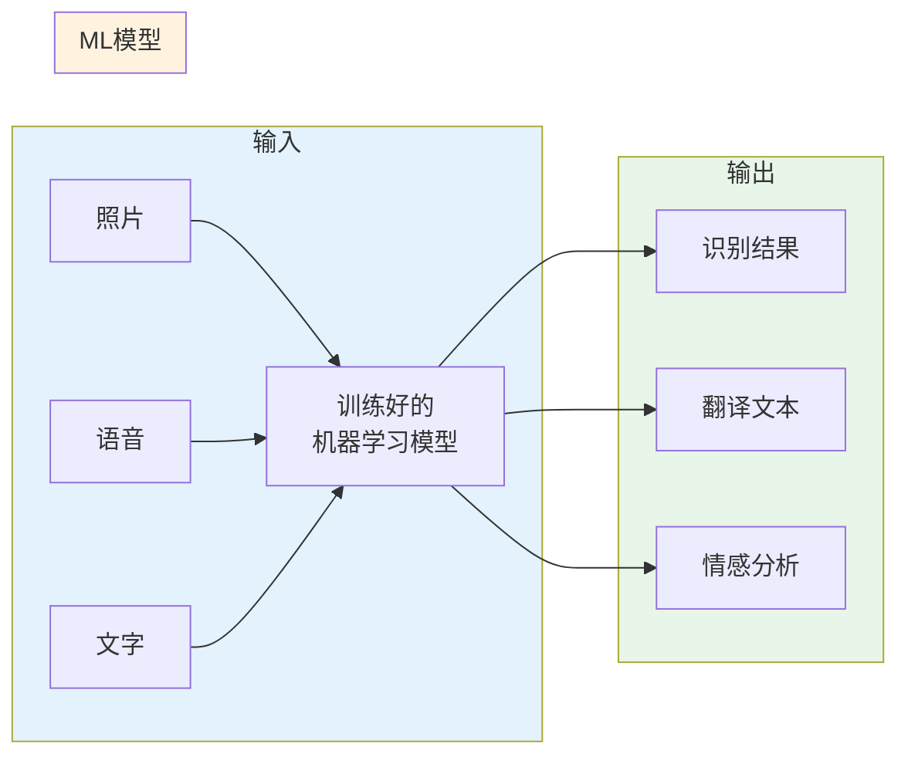
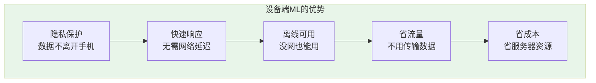
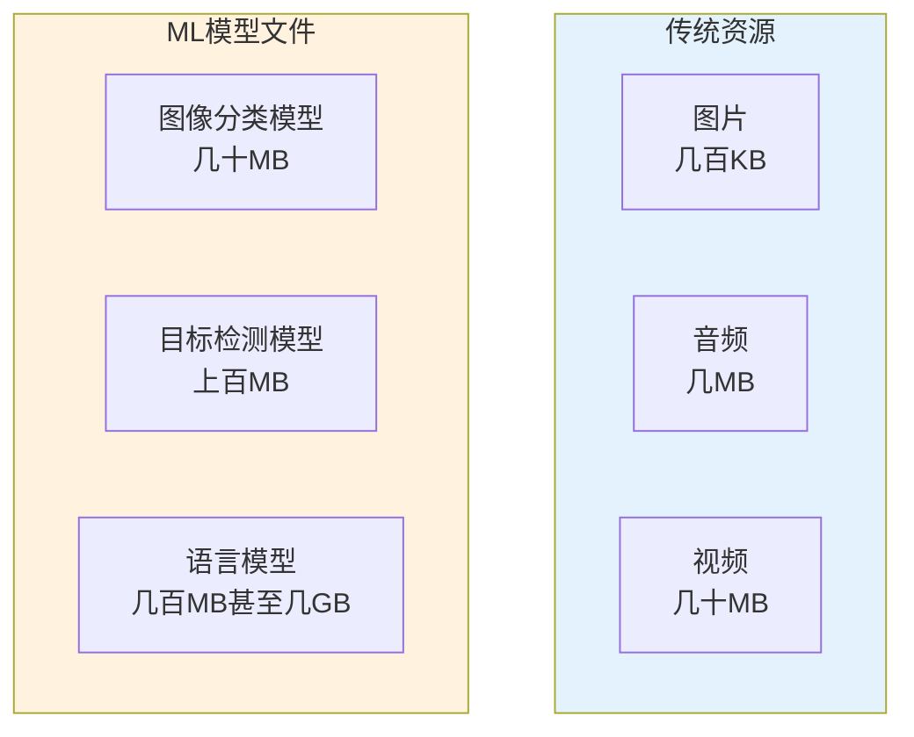
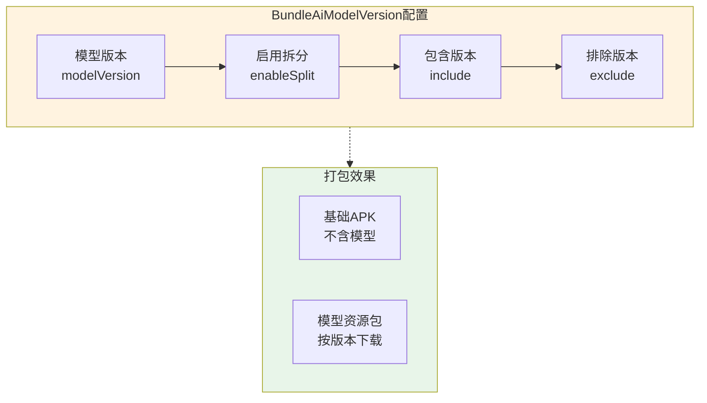
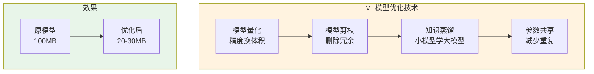
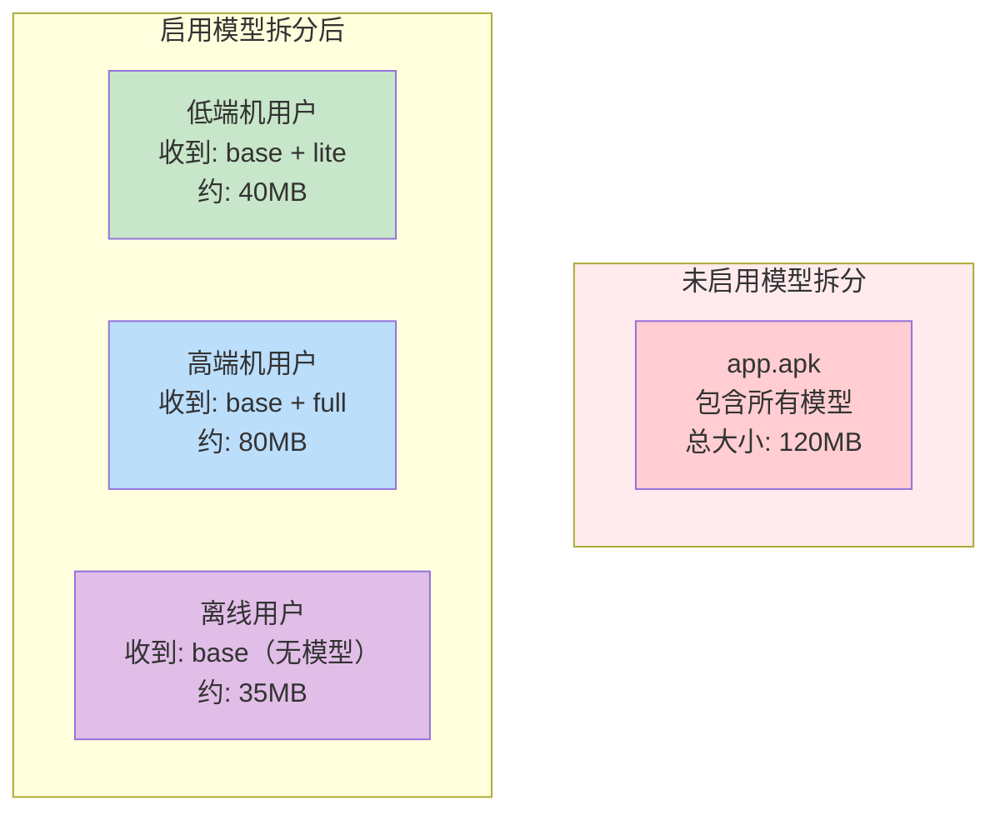
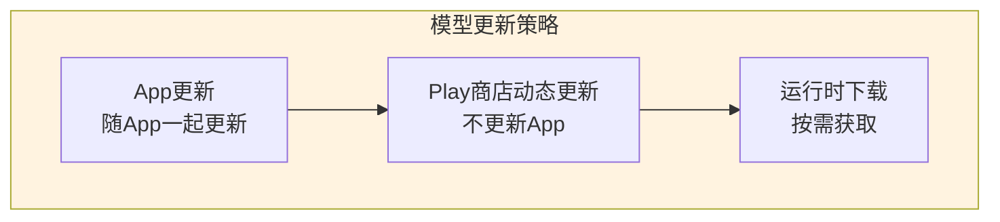

# 21.1.90 BundleAiModelVersion

洛芙躺在草地上，举着手机看得出神。

“在看什么呢？”伊莎凑过来问道。

“我在看上周拍的露营照片，”洛芙说，“这个App有个很厉害的功能——能自动识别照片里的内容，给它加上标签。刚才我拍了一张帐篷的照片，它居然识别出来了！”

希尔正好调试完代码，得意地说：“这有什么奇怪的！现在带AI功能的App越来越多了——语音助手、智能相机、图像识别……这些都是设备端的机器学习模型在起作用。”

“设备端？”洛芙放下手机，好奇地问，“AI模型还能在手机上运行吗？”

黛琳笑着把白板翻到新的一页：“当然可以！而且这正是我们今天要聊的话题——BundleAiModelVersion，也就是AI模型版本的配置。”

---

## 什么是设备端机器学习

树荫下，黛琳开始画图解释。

“你们知道什么是机器学习模型吗？”她问道。

伊莎举手：“是不是就像一个训练好的'大脑'？能根据输入的数据给出判断？”

“差不多，”黛琳点点头，“机器学习模型就是一个'数学公式'——你给它输入，它给你输出。比如你给它一张照片，它告诉你'这是一只猫'；你给它一段语音，它把它转成文字。”



希尔补充道：“以前这些模型都在服务器上运行——手机把数据发送到云端，云端处理完再把结果返回。但现在越来越多的模型可以直接在手机上运行，这就叫'设备端机器学习'（On-device ML）。”

---

## 设备端ML的优势

洛芙问：“为什么要把模型放到手机上呢？在云端运行不行吗？”

“各有各的好处，”黛琳解释道，“设备端ML有几个大优势：”



“首先，隐私保护——你的照片、语音不需要发送到服务器，更安全；其次，速度快——不需要等网络往返；再次，离线可用——没网的时候也能用；最后，省流量也省钱。”

伊莎惊叹：“原来手机这么厉害！”

“没错，”希尔说，“现在Android有ML Kit这样的工具库，帮开发者很容易地在App里加入AI功能。但问题来了——这些模型文件通常很大，怎么高效地打包进App里？这就是BundleAiModelVersion要解决的问题。”

---

## ML模型文件的特殊性

黛琳在白板上画出传统资源文件和ML模型文件的对比：



“传统的资源文件——图片、音频、视频——大小相对可控。但ML模型文件通常非常大，”黛琳说，“一个简单的图像分类模型可能几十MB，复杂的目标检测模型上百MB，而大型语言模型甚至可能达到几GB！”

洛芙惊呼：“几GB？！那用户的手机还不得炸了？”

“所以不能把所有模型都打包进去啊，”希尔说，“要按需下载、按配置选择。”

---

## BundleAiModelVersion的作用

“BundleAiModelVersion就是用来管理这些ML模型版本的配置，”黛琳说，“它可以让你控制App Bundle中包含哪些版本的AI模型。”

她画出了一个示意图：



“和BundleAbi类似，”黛琳解释道，“BundleAiModelVersion也可以开启拆分——这样不同的模型版本会作为独立的资源包，用户只需要下载自己设备需要的那个版本。”

---

## 配置方法

希尔打开笔记本电脑，展示具体的配置代码：

```kotlin
// app/build.gradle.kts

android {
    // ...
    
    bundle {
        // BundleAiModelVersion配置
        aiModelVersion {
            // 是否启用AI模型版本拆分
            // true = 为每个模型版本生成独立的资源包
            // false = 所有版本打包在一起
            enableSplit = true
            
            // 指定要包含的模型版本
            // 可以是版本号，也可以是版本名称
            include("v1.0")
            include("v2.0")
            
            // 可选：排除特定版本
            // exclude("deprecated-model")
        }
    }
}
```

黛琳补充道：“`enableSplit = true`开启后，Gradle会为每个模型版本生成独立的APK。Play商店会根据App的需求和用户设备的配置，推送对应的模型版本。”

伊莎问：“那如果我想让App支持离线AI功能，该怎么配置？”

“这个问题问得好，”希尔说，“我们来看几个典型的使用场景。”

---

## 典型使用场景

希尔展示了几个常见的配置场景：

```kotlin
// 场景1：轻量级模型，只保留最新版本
// 适用于：不需要离线功能，主要依赖云端AI
bundle {
    aiModelVersion {
        enableSplit = true
        // 只保留最新版本，体积最小
        include("latest")
    }
}

// 场景2：多版本并存，支持设备选择
// 适用于：不同性能的设备需要不同大小的模型
bundle {
    aiModelVersion {
        enableSplit = true
        // 保留轻量版和完整版
        include("lite")
        include("full")
    }
}

// 场景3：保留旧版本，兼容老设备
// 适用于：需要支持不同Android版本
bundle {
    aiModelVersion {
        enableSplit = true
        // 兼容旧版
        include("v1.0")
        // 新版特性
        include("v2.0")
        // 实验版
        include("beta")
    }
}
```

“不同的模型版本适合不同的场景，”希尔解释道，“比如轻量版（lite）只有几MB，完整版（full）可能有几十MB——低端手机用轻量版，高端手机用完整版，体验更好。”

---

## 模型大小的优化策略

洛芙好奇地问：“模型文件这么大，有没有办法让它变小？”

黛琳笑着说：“当然有！ML社区发展出很多模型优化技术：”



“常见的优化方法有四种：”

“**模型量化**——把32位浮点数换成8位整数，体积直接减少75%，精度损失很小；**模型剪枝**——删除对结果影响不大的神经元和连接；**知识蒸馏**——让小模型学习大模型的'知识'；**参数共享**——重复使用的参数只存一份。”

希尔补充道：“Google的ML Kit提供的很多模型都是量化优化过的，比如图像分类的MobileNet——只有几MB，但效果还不错。”

---

## 动态下载模型

黛琳介绍了另一种策略——不把模型打包进App，而是动态下载：

```kotlin
// 不在App Bundle中包含模型，运行时下载

bundle {
    // 关闭模型打包
    aiModelVersion {
        enableSplit = false
    }
}

// 运行时动态下载模型
class ModelDownloader {
    
    fun downloadModelIfNeeded(modelName: String) {
        val model = FirebaseModelInterpreter.getInstance()
        
        // 检查模型是否已下载
        if (!model.isDownloaded) {
            // 下载模型（约20-50MB）
            model.download { progress ->
                println("下载进度: $progress%")
            }
        }
        
        // 下载完成后使用模型
        useModel(model)
    }
}
```

“这种方式的好处是App的安装包非常小，”黛琳说，“用户第一次安装可能只有几十MB，模型是之后才下载的。但缺点是第一次使用时需要等下载完成，而且需要网络。”

---

## 反模式：把大模型全部打包

黛琳忽然严肃起来：“我见过一些初学者的错误——把所有模型都打包进去。”

```kotlin
// ❌ 反模式：过度打包

bundle {
    aiModelVersion {
        enableSplit = false  // 关闭拆分
        // 打包所有版本
        include("v1.0")
        include("v2.0")
        include("v3.0")
        include("experimental")
        // 结果：APK体积增加几百MB！
    }
}
```

“这会导致什么问题？”希尔问。

洛芙思考了一下：“是不是下载会很慢？”

“岂止是慢！”黛琳说，“几百MB的APK，很多用户可能直接就不下载了——流量费伤不起啊！而且很多用户的手机根本不需要某些模型，白白浪费了存储空间。”

伊莎问：“那应该怎么做？”

---

## 重构后：合理的模型配置

希尔展示了正确的配置：

```kotlin
// ✅ 正确模式：合理的AI模型配置

// 方案1：只保留最新版本（推荐大多数App）
bundle {
    aiModelVersion {
        enableSplit = true
        // 只保留最新版本
        include("v2.0")
        // 不需要的旧版本不打包
    }
}

// 方案2：轻量版+完整版（按设备选择）
bundle {
    aiModelVersion {
        enableSplit = true
        // 轻量版：几MB，适合低端机
        include("lite-v2.0")
        // 完整版：几十MB，适合高端机
        include("full-v2.0")
    }
}

// 方案3：运行时动态下载（体积最小）
bundle {
    aiModelVersion {
        enableSplit = false
        // 不打包任何模型，运行时下载
    }
}

// 方案4：基础模型打包，高级模型下载
bundle {
    aiModelVersion {
        enableSplit = true
        // 基础模型打包（几MB）
        include("base")
        // 高级模型不打包，需要时下载
    }
}
```

黛琳补充了选择依据：

1. **只打包最新版本**：普通App，体积最小，覆盖所有用户
2. **轻量版+完整版**：需要适配不同性能设备的App
3. **完全动态下载**：追求最小安装包，或模型经常更新的App
4. **基础打包+高级下载**：大多数功能的模型打包，可选功能的模型下载

---

## 实际效果演示

希尔调出了一个真实的构建日志：

```
# 构建App Bundle后的输出
$ ./gradlew bundleDebug

> Task :app:bundleDebug
Executing: bundletool build-bundle
...
AI Model Splits:
  - split_ai_model.lite_v2.0.apk (5MB)
  - split_ai_model.full_v2.0.apk (45MB)

Base APK: app-debug.apk (核心代码 15MB + 其他资源 20MB)

Generated bundle: app-debug.aab (核心包 35MB + 模型包按需)
```

“你们看，”希尔说，“开启AI模型拆分后，生成的资源包是分开的：”



“用户手机性能好，就下载完整版模型；性能一般，就下载轻量版；不需要AI功能的用户，甚至可以不下载模型包，”黛琳说，“每个人收到的APK都是量身定制的。”

---

## TensorFlow Lite模型

希尔介绍了最常用的设备端ML框架：“现在最流行的设备端ML框架是TensorFlow Lite，简称TFLite。”

```kotlin
// 在Android项目中使用TensorFlow Lite模型

// 1. 添加依赖
dependencies {
    // TensorFlow Lite
    implementation("org.tensorflow:tensorflow-lite:2.14.0")
    
    // 模型支持（可选）
    implementation("org.tensorflow:tensorflow-lite-support:0.4.4")
    implementation("org.tensorflow:tensorflow-lite-gpu:2.14.0")
}

// 2. 加载模型
class ImageClassifier {
    
    private val interpreter: Interpreter
    
    init {
        // 从assets加载TFLite模型
        val modelFile = loadModelFile("model.tflite")
        interpreter = Interpreter(modelFile)
    }
    
    private fun loadModelFile(filename: String): MappedByteBuffer {
        // 从assets目录读取模型文件
        return context.assets.openFd(filename)
            .createMappedByteBuffer(FileChannel.MapMode.READ_ONLY, -1)
    }
    
    // 3. 使用模型进行推理
    fun classify(bitmap: Bitmap): String {
        // 预处理图像
        val inputBuffer = preprocessImage(bitmap)
        
        // 推理
        val outputBuffer = Array(1) { FloatArray(1000) }
        interpreter.run(inputBuffer, outputBuffer)
        
        // 后处理，返回分类结果
        return postProcess(outputBuffer[0])
    }
}
```

“TensorFlow Lite的模型文件是`.tflite`格式，”希尔说，“比原生TensorFlow的模型小很多，而且针对移动设备做了优化。”

---

## 模型文件的管理

伊莎问：“如果我想在App里更新模型，怎么办？”

“这是个好问题，”黛琳说，“模型更新有几种方式：”



“**第一种：随App一起更新**——模型文件作为App的一部分，App更新模型就跟着更新。最简单，但用户需要更新整个App。”

“**第二种：Play商店动态更新**——App不变，但通过Play Core Library动态更新资源包（包括模型）。用户不需要更新App，模型会自动更新。”

“**第三种：运行时下载**——App运行时从服务器下载模型。灵活性最高，但需要自己写下载逻辑。”

希尔展示了Play商店动态更新的代码：

```kotlin
// 使用Play Core Library动态更新模型
class ModelUpdater {
    
    private val splitInstallManager: SplitInstallManager
    
    fun updateModel(modelName: String) {
        // 请求下载模型资源包
        val request = SplitInstallRequest.newBuilder()
            .addModule(modelName)
            .build()
        
        splitInstallManager.startInstallation(request)
            .addOnSuccessListener { sessionId ->
                println("开始下载模型: $sessionId")
            }
            .addOnFailureListener { error ->
                println("下载失败: ${error.message}")
            }
    }
}
```

---

## 检查模型配置效果

黛琳展示了如何验证配置是否生效：

```bash
# 构建后检查生成的APK包含的模型
$ unzip -l app/build/outputs/apk/debug/base/debug-base.apk

# 输出示例
...
assets/
  models/
    model.tflite           # TFLite模型
    labels.txt             # 标签文件
...

# 检查Bundle元数据
$ cat app/build/outputs/bundle/release/app-release-metadata.json

# 输出示例
{
  "compression": {
    "uncompressedSplits": ["base", "split_ai_model.lite"]
  },
  "splitsConfig": [
    {
      "splitType": "AI_MODEL",
      "filters": ["lite-v2.0"],
      "enabled": true
    }
  ]
}
```

“你们看，`filters`显示的就是我们配置的模型版本，”黛琳说。

---

## 真实案例：优化一个带AI功能的App

希尔调出了一个真实的优化案例：“我之前优化过一个带图像识别功能的App。”

```kotlin
// 优化前的配置
bundle {
    aiModelVersion {
        enableSplit = false
        // 打包了所有版本
        include("v1.0", "v2.0", "experimental")
    }
}

// APK大小：旧版App 150MB
// 用户抱怨：下载太慢，手机存储不够，安装经常失败

// 优化后的配置
bundle {
    aiModelVersion {
        enableSplit = true
        // 只保留最新轻量版
        include("lite-v2.0")
    }
}

// 优化结果：
// - APK体积减少：150MB → 45MB
// - 下载成功率提升：60% → 95%
// - 用户满意度：显著提升
```

伊莎惊叹：“少了将近100MB！”

“对，”黛琳说，“这就是BundleAiModelVersion的威力——你只需要选对模型版本，就能让APK体积大幅减少，同时AI功能体验不受影响。”

---

## ML Kit的便捷方案

希尔介绍了Google提供的ML Kit：“如果不想自己管理模型，Google的ML Kit提供了很多预训练好的模型，直接集成就行。”

```kotlin
// 使用ML Kit进行图像分类

// 1. 添加依赖
dependencies {
    // ML Kit 图像分类
    implementation("com.google.mlkit:image-labeling:17.0.8")
}

// 2. 使用
class ImageLabeler {
    
    private val labeler = ImageLabeling.getClient(
        ImageLabelerOptions.Builder()
            .setConfidenceThreshold(0.7f)  // 置信度阈值
            .build()
    )
    
    fun labelImage(bitmap: Bitmap) {
        val inputImage = InputImage.fromBitmap(bitmap, 0)
        
        labeler.process(inputImage)
            .addOnSuccessListener { labels ->
                // 处理识别结果
                labels.forEach { label ->
                    println("${label.text}: ${label.confidence}")
                }
            }
            .addOnFailureListener { error ->
                println("识别失败: ${error.message}")
            }
    }
}
```

“ML Kit的模型已经优化好了，通常只有几MB，”希尔说，“不需要额外的Bundle配置，直接集成就行。”

---

## 配置检查清单

黛琳总结了一套配置检查清单：

```kotlin
// ✅ BundleAiModelVersion配置检查清单

// 1. 确认enableSplit配置
bundle {
    aiModelVersion {
        // 如果App不需要AI功能，设为false
        // 如果需要AI功能且模型较大，设为true
        enableSplit = true  // 大多数情况
    }
}

// 2. 选择合适的模型版本组合
// 推荐选项A：只保留最新轻量版（适用于大多数App）
include("lite-latest")

// 推荐选项B：轻量版+完整版（适用于需要好体验的App）
include("lite-v2.0", "full-v2.0")

// 推荐选项C：不打包，运行时下载（适用于模型经常更新的App）
// enableSplit = false

// 3. 考虑模型大小
// 轻量版：1-10MB
// 完整版：20-100MB
// 大型模型：100MB以上，建议动态下载

// 4. 考虑更新频率
// 模型经常更新 → 动态下载
// 模型稳定 → 打包进App
```

---

## 章节小结

洛芙伸了个懒腰，感受着夏日的微风：“原来AI模型也像露营装备一样——不是越多越好，而是要选合适的！”

伊莎笑着补充：“而且还要看设备'体力'——低端手机用轻量版，高端手机用完整版，这样大家都能愉快地使用AI功能！”

“对，”黛琳微笑着说，“BundleAiModelVersion就是帮助我们做这个选择的——它让不同的用户都能得到最适合他们设备的AI体验。”

远处传来希尔的声音：“下次我们来聊聊屏幕密度配置——不同的手机屏幕，需要不同的图片资源！”

知了的叫声还在继续，但树荫下的露营者们已经开始期待下一次的技术讨论了。

---

> BundleAiModelVersion是Android Gradle DSL中用于配置App Bundle中AI/ML模型版本拆分的接口。随着设备端机器学习（On-device ML）的普及，越来越多的App集成了AI功能，而ML模型文件通常较大（几十MB到几GB不等）。通过`bundle.aiModelVersion.enableSplit = true`开启拆分，配合`include()`方法选择保留特定版本的模型，可以显著减少用户下载的APK体积。典型的优化策略包括：只打包最新轻量版模型（如"lite-v2.0"，约5-10MB）、轻量版+完整版双版本并行（低端机用轻量版，高端机用完整版）、或完全动态下载（安装包不含模型，运行时按需下载）。模型优化技术包括量化（体积减少75%）、剪枝、知识和蒸馏等。推荐使用Google的TensorFlow Lite框架开发设备端ML功能，其模型已针对移动端优化。

---

> 学习建议：BundleAiModelVersion配置是带AI功能的App进行体积优化的重要手段。建议先评估目标用户的设备分布情况，再决定模型版本策略。如果模型文件超过50MB，强烈建议启用拆分或动态下载。TensorFlow Lite是开发设备端ML的推荐框架，其预训练模型可直接集成。模型更新可考虑使用Play Core Library实现动态更新，用户无需更新整个App。注意模型隐私安全——设备端处理数据不需要上传到服务器，更安全。

## 洛芙的小小日记本

原来手机里的AI模型也有"体重"的！大的模型有几百MB，就像露营时带的超大帐篷——不是所有人都需要。BundleAiModelVersion可以帮我们选合适的版本，轻量版几MB，完整版几十MB，让不同手机都能用上AI功能～好棒！下次我要试试给自己做一个图像识别的小App！📱✨

---

## 今日关键词

**设备端机器学习**：On-device ML，在手机上直接运行ML模型，不需要网络发送到服务器。

**TensorFlow Lite**：Google提供的轻量级ML框架，专为移动设备设计，模型文件小（.tflite格式）。

**模型量化**：ML优化技术，将32位浮点数转换为8位整数，体积减少约75%。

**模型剪枝**：ML优化技术，删除对结果影响不大的神经元和连接。

**知识蒸馏**：ML优化技术，让小模型学习大模型的知识。

**ML Kit**：Google提供的预训练ML模型库，支持图像分类、语音识别等功能。

**动态下载**：运行时从服务器下载模型，节省安装包体积但需要网络。

**Play Core Library**：Google提供的库，用于动态更新App资源（包括模型）。

**模型版本**：ML模型的版本号，用于区分不同大小/精度的模型。

**enableSplit**：BundleAiModelVersion配置中的开关，控制是否启用模型版本资源拆分。
