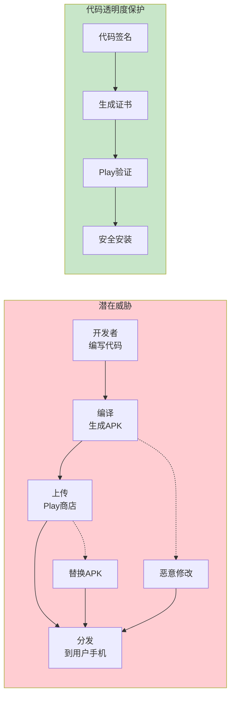
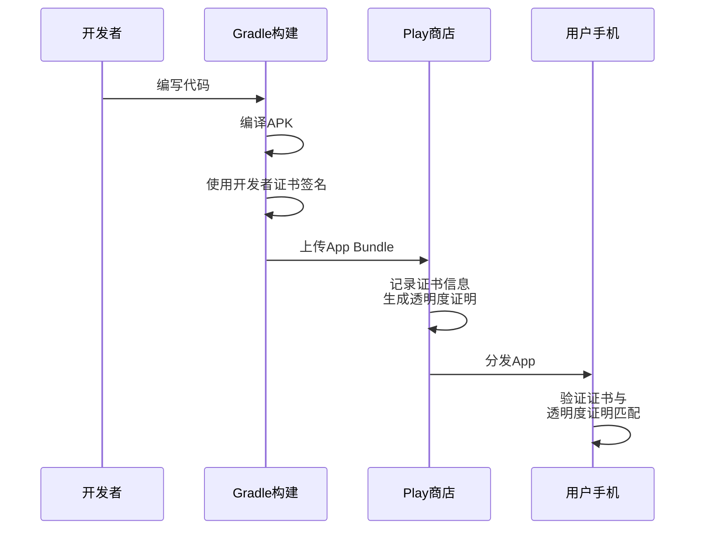
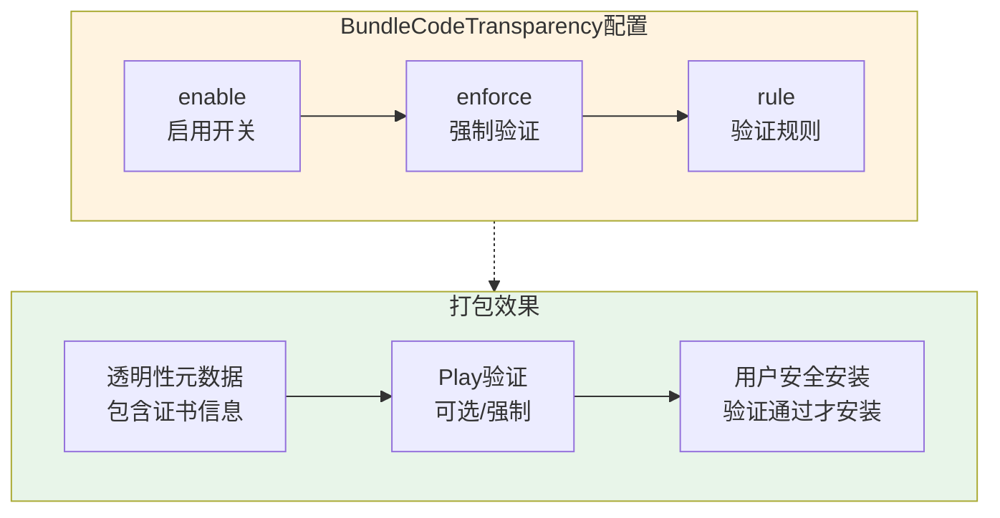
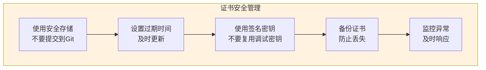
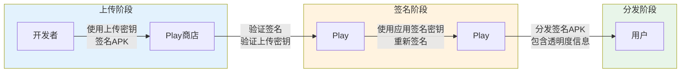

# 21.1.91 BundleCodeTransparency

洛芙滑动着手机屏幕，忽然停在一个应用的页面上。

“咦？”她轻声嘀咕。

“怎么了？”伊莎递过来一瓶冰镇桃子汽水。

“这个App说'已通过Play安全验证'，”洛芙指着屏幕上的小图标，“可是它是怎么验证的？我们怎么知道下载的App没有被坏人改过？”

希尔正在调试代码，抬起头来：“这个问题问得好！其实Android系统有一个叫做'代码透明度'（Code Transparency）的机制——可以验证App的代码有没有被篡改过。”

“代码也能透明？”洛芙好奇地问，“就像——能看透代码里面有没有坏东西？”

黛琳笑着把白板翻到新的一页：“差不多是那个意思。今天我们就来聊聊BundleCodeTransparency——这是Android Gradle DSL里专门用来配置代码透明度验证的接口。”

---

## 什么是代码透明度

树荫下，黛琳开始画图解释。

“你们有没有想过这个问题，”她问道，“一个App从开发到用户安装，中间会经过很多环节——开发者在电脑写代码，编译成APK，上传到Play商店，Play商店分发到用户手机。在这些环节里，有没有可能有人偷偷修改了你的代码？”

洛芙想了想：“比如——有人在Play商店里放了一个假的应用？”

“对，这就是所谓的'供应链攻击'，”黛琳点点头，“代码透明度就是为了防止这种情况而设计的。”



希尔补充道：“代码透明度就像App的'身份证'——它会记录App的原始签名信息。用户安装时，系统会验证这个身份证是真是假。如果对不上号，说明代码被篡改过，系统就会拒绝安装或者发出警告。”

---

## 代码透明度的工作原理

伊莎问：“那它是怎么工作的呢？”

“关键在于'签名'和'证书'，”黛琳说，“每个开发者都有自己的证书，就像签名一样。代码透明度会记录App使用的是哪个证书。”

她画出了一个详细的流程图：



“开发者在本地用证书给APK签名，这个证书信息会被记录下来；上传到Play商店后，Play会生成一个'透明度证明'；用户下载安装时，手机会验证这个证明和APK的签名是否匹配。”

洛芙问：“如果不用Play商店，直接从网上下载APK呢？”

“那就没有这个保护了，”黛琳说，“所以从非官方渠道下载APK是有风险的——你不知道它是不是被修改过的。”

---

## BundleCodeTransparency的作用

“BundleCodeTransparency就是用来开启这个验证功能的开关，”黛琳说，“它告诉Gradle构建系统：在生成App Bundle的时候，要把代码透明度信息也一起打包进去。”

她画出了一个配置示意图：



---

## 配置方法

希尔打开笔记本电脑，展示具体的配置代码：

```kotlin
// app/build.gradle.kts

android {
    // ...
    
    bundle {
        // BundleCodeTransparency配置
        codeTransparency {
            // 是否启用代码透明度功能
            // true = 生成包含透明度信息的App Bundle
            // false = 不包含透明度信息（默认）
            enable = true
            
            // 可选：是否强制验证
            // true = Play商店会强制验证代码透明度
            // false = 验证是可选的
            // enforce = true
            
            // 可选：设置验证规则
            // 可以指定哪些模块需要验证
            // rule("com.example.module", VerificationType.STRICT)
        }
    }
}
```

黛琳补充道：“`enable = true`开启后，Gradle会在生成App Bundle时自动添加代码透明度元数据。这些元数据包含了App的签名证书信息，Play商店可以用它来验证App的完整性。”

---

## 代码透明度的类型

伊莎问：“代码透明度有什么类型吗？”

“有的，”黛琳点点头，“Google Play支持两种类型的代码透明度：”

```kotlin
// 验证类型配置
codeTransparency {
    enable = true
    
    // 基础透明度（Basic Transparency）
    // 只验证APK的签名证书
    // 适用于：大多数应用
    verificationType = VerificationType.BASIC
    
    // 完整透明度（Full Transparency）
    // 验证APK的完整内容，包括所有资源和代码
    // 适用于：对安全性要求极高的应用（如银行、支付类）
    // verificationType = VerificationType.FULL
}
```

“**基础透明度**只验证签名证书——速度快，但只能防止证书被替换；**完整透明度**会验证APK的每一个字节——更安全，但验证时间更长。”

---

## 典型使用场景

希尔展示了几个常见的配置场景：

```kotlin
// 场景1：启用基础代码透明度（推荐大多数App）
// 适用于：防止App被篡改，但不需要极致安全
bundle {
    codeTransparency {
        enable = true
        // 基础验证即可
    }
}

// 场景2：启用完整代码透明度
// 适用于：银行、支付、加密货币等高安全要求应用
bundle {
    codeTransparency {
        enable = true
        // 完整验证
    }
}

// 场景3：按模块配置透明度
// 适用于：大型应用，不同模块有不同安全要求
codeTransparency {
    enable = true
    
    // 核心模块使用严格验证
    rule("core", VerificationType.FULL)
    // 普通模块使用基础验证
    rule("feature", VerificationType.BASIC)
}

// 场景4：不启用代码透明度
// 适用于：不需要Play分发，或有特殊原因
bundle {
    codeTransparency {
        enable = false  // 默认
    }
}
```

“不同的场景需要不同的配置，”希尔解释道，“普通App用基础验证就够了；银行、支付类App最好用完整验证。”

---

## 反模式：忽视代码透明度

黛琳忽然严肃起来：“我见过一些开发者的错误——完全忽视代码透明度验证。”

```kotlin
// ❌ 反模式：忽视代码透明度

bundle {
    // 没有配置codeTransparency
    // 默认enable = false
    
    // 结果：
    // 1. App无法通过Play的安全验证
    // 2. 用户安装时没有"已验证"标识
    // 3. 更容易受到供应链攻击
}
```

“这会导致什么问题？”希尔问。

洛芙思考了一下：“是不是——用户会觉得我的App不安全？”

“岂止是那个！”黛琳说，“没有代码透明度验证，App在分发过程中被篡改的风险会大大增加。比如有人入侵了开发者账号，上传了一个恶意版本；如果没有代码透明度验证，用户可能根本看不出来。”

伊莎问：“那应该怎么做？”

---

## 重构后：正确的代码透明度配置

希尔展示了正确的配置：

```kotlin
// ✅ 正确模式：合理的代码透明度配置

// 方案1：启用基础透明度（推荐大多数App）
bundle {
    codeTransparency {
        enable = true
        // 不指定verificationType，默认BASIC
    }
}

// 方案2：启用完整透明度（高安全要求）
bundle {
    codeTransparency {
        enable = true
        verificationType = VerificationType.FULL
    }
}

// 方案3：启用并强制验证
bundle {
    codeTransparency {
        enable = true
        enforce = true  // Play会强制验证
    }
}

// 方案4：Play自动处理（最简单）
bundle {
    // 只需要enable = true
    // Play会自动选择合适的验证级别
    codeTransparency {
        enable = true
    }
}
```

黛琳补充了选择依据：

1. **enable = true**：基本要求，开启代码透明度保护
2. **verificationType = BASIC**：普通App，平衡安全性和性能
3. **verificationType = FULL**：高安全要求App，如金融类
4. **enforce = true**：强制验证，用户必须通过验证才能安装

---

## 实际效果演示

希尔调出了一个真实的构建日志：

```
# 构建App Bundle后的输出
$ ./gradlew bundleDebug

> Task :app:bundleDebug
Executing: bundletool build-bundle
...
Code Transparency:
  - Enabled: true
  - Verification Type: BASIC
  - Certificate Hash: SHA256:AB:CD:EF:...
  - Transparency Metadata: included

Generated bundle: app-debug.aab (核心包 + 透明度元数据)
```

“你们看，”希尔说，“开启代码透明度后，构建日志会显示验证类型和证书哈希值。”

---

## 验证代码透明度

黛琳展示了如何验证配置是否生效：

```bash
# 构建后检查App Bundle的元数据
$ java -jar bundletool.jar validate --bundle app.aab

# 输出示例
{
  "base": {
    "versionCode": 1,
    "versionName": "1.0.0",
    "codeTransparency": {
      "enabled": true,
      "verificationType": "BASIC",
      "signingCertificate": {
        "algorithm": "SHA256withRSA",
        "subject": "CN=Developer Name, O=Company",
        "fingerprint": "AB:CD:EF:12:34:..."
      }
    }
  }
}
```

“你们看，`codeTransparency`显示的就是我们配置的元数据，”黛琳说。

---

## 证书管理的重要性

伊莎问：“证书泄露了怎么办？”

“这是个好问题，”黛琳说，“代码透明度的安全性很大程度上取决于证书的安全。”



“几个关键点：第一，永远不要把证书上传到公开仓库；第二，给证书设置合理的过期时间；第三，申请新的签名密钥用于正式发布，不要用调试密钥；第四，安全备份证书；第五，监控是否有异常签名的App出现。”

希尔补充道：“Google Play提供了一种叫做'应用签名密钥'的功能——你可以让Play帮你管理密钥，这样更安全。”

```kotlin
// 使用Play应用签名
// 在Google Play Console中配置：

// 1. 选择"让Google管理并保护应用签名密钥"
// 2. 上传最初的密钥（用于验证）
// 3. Play会生成新的签名密钥

// 优点：
// - Google保管密钥，更安全
// - 可以使用相同的密钥签名多个App
// - 自动启用代码透明度

// 缺点：
// - 无法获取最终的签名密钥
// - 卸载后重新安装可能使用不同的密钥
```

---

## Play应用签名密钥的工作原理

黛琳画出了Play应用签名的架构：



“开发者用上传密钥签名APK，上传到Play；Play验证上传密钥的有效性，然后用应用签名密钥重新签名；同时生成代码透明度信息；最后分发给用户。”

洛福问：“那我怎么知道Play用的是哪个密钥呢？”

“在Play Console里可以看到，”希尔说，“打开你的应用 -> 发布 -> 设置 -> 应用签名，你就能看到Play正在使用的签名密钥信息。”

---

## 防止回滚攻击

黛琳介绍了一个高级话题：“代码透明度还可以防止'回滚攻击'。”

“什么叫回滚攻击？”洛芙问。

“就是——攻击者拿到你App的旧版本，然后把它重新发布，”黛琳解释说，“旧版本可能有安全漏洞，攻击者诱导用户安装旧版本，然后利用漏洞搞破坏。”

```kotlin
// 防止回滚攻击的配置
bundle {
    // 启用代码透明度
    codeTransparency {
        enable = true
    }
    
    // 启用最小版本限制
    // 用户只能安装指定版本及以上的App
    // preventDowngrade = true
    
    // 设置最小版本
    // minSdkVersion = 21  // 或者更高
}
```

“通过设置最小版本限制，可以防止用户安装过旧的、有安全漏洞的App版本。”

---

## 实际案例：配置一个安全的App

希尔展示了一个真实项目的配置：

```kotlin
// ✅ 一个注重安全的App的完整配置

android {
    // ...
    
    // App Bundle配置
    bundle {
        // 代码透明度：启用完整验证
        codeTransparency {
            enable = true
            verificationType = VerificationType.FULL
        }
        
        // 其他安全相关配置
        // ...
    }
    
    // 签名配置
    signingConfigs {
        create("release") {
            // 使用密钥库文件
            storeFile = file("keystore.jks")
            storePassword = System.getenv("KEYSTORE_PASSWORD")
            keyAlias = "release-key"
            keyPassword = System.getenv("KEY_PASSWORD")
        }
    }
    
    buildTypes {
        release {
            // 使用正式签名
            signingConfig = signingConfigs.release
            
            // 启用混淆
            isMinifyEnabled = true
            isShrinkResources = true
            
            // 启用R8优化
            proguardFiles(
                getDefaultProguardFile("proguard-android-optimize.txt"),
                "proguard-rules.pro"
            )
        }
    }
}
```

伊莎惊叹：“原来一个安全的App需要配置这么多东西！”

“对，”黛琳说，“代码透明度只是其中一小部分——它负责验证代码没被篡改，但App安全还需要其他方面的保护，比如代码混淆、安全存储、权限控制等等。”

---

## 代码透明度与App Bundle的关系

洛芙问：“代码透明度只对App Bundle有效吗？对普通的APK呢？”

“问得好！”黛琳说，“代码透明度是App Bundle特有的功能。”

```kotlin
// App Bundle vs 普通APK的代码透明度对比

// App Bundle（.aab）
bundle {
    codeTransparency {
        enable = true  // ✅ 支持
    }
}

// 普通APK
android {
    // ❌ 没有codeTransparency配置
    // APK本身不包含代码透明度元数据
    // 但Play会给APK添加透明度信息（在上传后）
}

// 直接导出APK（不通过Play）
android {
    buildTypes {
        release {
            // ❌ 不会自动添加代码透明度
            // 需要手动配置其他验证方式
        }
    }
}
```

“App Bundle原生支持代码透明度——元数据直接打包在Bundle里；但普通APK是上传到Play后，Play才给它添加透明度信息。”

---

## 检查配置效果

黛琳展示了如何验证配置是否正确：

```bash
# 1. 检查构建输出
$ ls -la app/build/outputs/bundle/debug/

# 输出
app-debug.aab  # 包含代码透明度元数据

# 2. 使用bundletool查看元数据
$ java -jar bundletool.jar dump --bundle app-debug.aab --metadata

# 输出
{
  "signingCertificate": {
    "sha256": "AB:CD:EF:..."
  },
  "includedModules": [
    "base",
    "feature1"
  ]
}

# 3. 在Play Console查看
# 发布 -> 发布设置 -> 应用签名
# 可以看到Play使用的签名密钥
```

---

## 配置检查清单

希尔总结了一套配置检查清单：

```kotlin
// ✅ BundleCodeTransparency配置检查清单

// 1. 确认enable配置
bundle {
    codeTransparency {
        // 必须设为true才能启用代码透明度
        enable = true  // 推荐
    }
}

// 2. 选择合适的验证类型
// 推荐选项A：基础透明度（适用于大多数App）
verificationType = VerificationType.BASIC

// 推荐选项B：完整透明度（适用于金融、安全类App）
verificationType = VerificationType.FULL

// 3. 考虑是否需要强制验证
// enforce = true  // Play会强制验证

// 4. 证书管理
// - 使用正式签名密钥，不要用调试密钥
// - 安全存储密钥，不要上传到Git
// - 设置合理的过期时间

// 5. Play应用签名
// - 建议让Google Play管理签名密钥
// - 在Play Console查看密钥信息

// 6. 防止回滚攻击
// - 设置最小版本限制
// - 使用最新的安全库
```

---

## 章节小结

洛芙躺在草地上，看着天空：“原来App也有'身份证'！这样我们下载应用的时候，就知道它是不是正版了～”

伊莎笑着说：“而且代码透明度就像一个'守门人'——只有验证通过的App才能安装到手机上，这样就不怕遇到坏人了！”

“对，”黛琳微笑着说，“BundleCodeTransparency就是帮助我们配置这个守门人的——它让我们的App更安全，也让用户更放心。”

远处传来希尔的声音：“下次我们来聊聊屏幕密度配置——不同的手机屏幕，需要不同的图片资源！”

知了的叫声还在继续，但树荫下的露营者们已经开始期待下一次的技术讨论了。风吹过草坪，带来了青草和花朵的清香。

---

> BundleCodeTransparency是Android Gradle DSL中用于配置App Bundle代码透明度验证的接口。代码透明度（Code Transparency）是Google Play提供的安全机制，可以验证用户下载的App代码是否与开发者发布的原始版本一致，防止供应链攻击和APK篡改。通过`bundle.codeTransparency.enable = true`开启，配合`verificationType`设置验证级别（BASIC或FULL），可以生成包含签名证书信息的App Bundle。BASIC验证只检查签名证书，性能好；FULL验证检查APK完整内容，安全性更高。启用代码透明度后，用户在Play商店可以看到"已通过Play安全验证"标识，提升信任度。建议使用Google Play的应用签名功能，由Google保管签名密钥更安全。注意代码透明度是App Bundle特有功能，普通APK需要上传到Play后由Play添加元数据。

---

> 学习建议：BundleCodeTransparency配置是提升App安全性的重要手段。建议所有通过Play分发的App都启用代码透明度验证。金融、支付等高安全要求应用应使用FULL验证类型。注意保护签名密钥的安全，永远不要把密钥上传到公开仓库。启用代码透明度后，用户安装时会看到安全验证标识，提升信任度。结合代码混淆（ProGuard/R8）、安全存储、权限最小化等策略，构建完整的App安全体系。

## 洛芙的小小日记本

今天学到了代码透明度！原来App也有"身份证"——通过证书验证，确保下载的应用没有被坏人篡改。启用BundleCodeTransparency后，Play会显示"已验证"标识，用户安装更安心～感觉就像给App穿了一件防护衣！🛡️

---

## 今日关键词

**代码透明度**：Code Transparency，Google Play提供的安全机制，验证App代码完整性。

**BundleCodeTransparency**：Android Gradle DSL接口，用于配置App Bundle的代码透明度功能。

**签名证书**：Signing Certificate，用于给App签名的证书，包含开发者的身份信息。

**供应链攻击**：Supply Chain Attack，在App分发过程中植入恶意代码的攻击方式。

**BASIC验证**：Code Transparency的基础级别，只验证签名证书。

**FULL验证**：Code Transparency的完整级别，验证APK的所有内容。

**应用签名密钥**：App Signing Key，Google Play用于重新签名App的密钥。

**上传密钥**：Upload Key，开发者用于上传App到Play的密钥。

**回滚攻击**：Rollback Attack，诱导用户安装旧版本有漏洞App的攻击方式。

**Play安全验证**：Play Protect，Google Play的安全验证机制。
