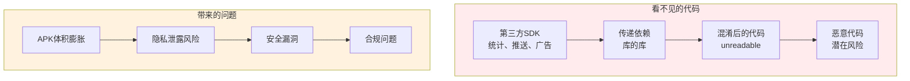
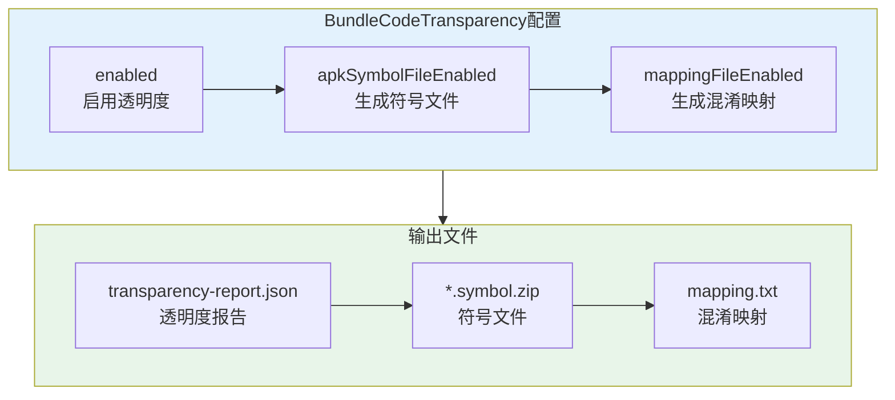
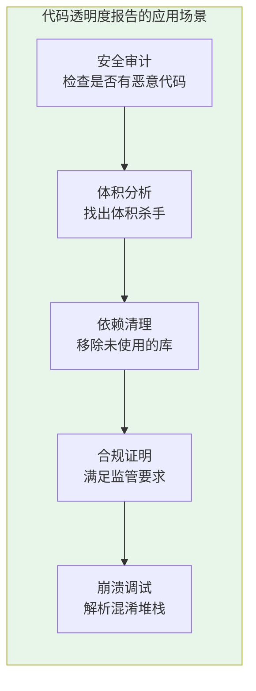
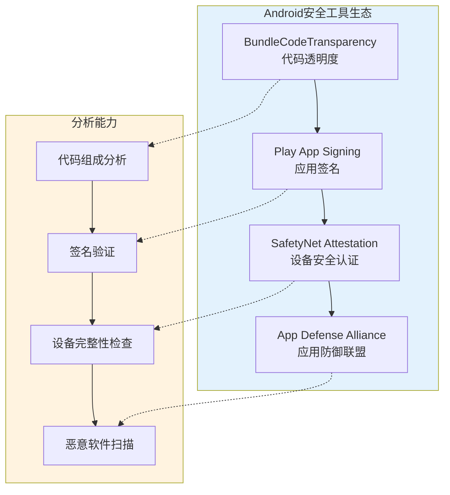
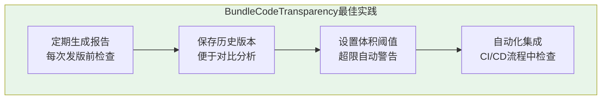

# 21.1.91 BundleCodeTransparency

洛芙盯着手机屏幕上满满一堆代码文件，眉头越皱越紧。

“黛琳，”她举起手机，“你说我们打了这么多包，塞了这么多代码……可是我完全不知道最终用户手机里装的是些什么东西。有的第三方库会偷偷加入一些代码，我们也不知道。”

希尔正在收拾数据线，闻言停下手：“这个问题问得好！现在很多App都会集成各种第三方SDK—— analytics、推送、广告、支付……这些SDK可能包含它们自己的代码，有的还有混淆过的代码。”

伊莎凑过来：“那怎么知道自己的App里到底有什么代码呢？”

黛琳笑着翻开白板的新的一页：“这就是我们今天要聊的话题——BundleCodeTransparency，代码透明度配置。”

---

## 什么是代码透明度

树荫下，黛琳开始解释代码透明度的概念。

“你们有没有这种感觉，”她问道，“有时候你写了一个很简单的功能，但打包出来的APK却变得很大？”

洛芙点头：“对！我就写了几行代码，结果APK多了好几MB！”

“这说明你的App里多了很多'看不见的代码'，”黛琳说，“可能是第三方库的，也可能是依赖传递带进来的。这些代码可能：”



“代码透明度就是帮你看清这些'看不见的代码'的技术，”黛琳解释道，“它会生成一份详细的报告，告诉你最终打包的代码里都有什么。”

---

## 代码透明度报告的内容

希尔打开笔记本电脑，调出一份示例报告：“我们来看一份真实的透明度报告。”

```text
=== App Bundle Code Transparency Report ===

App: CampingHelper
Version: 1.0.0
Build Time: 2024-07-15 14:30:00

--- 代码组成统计 ---
总DEX文件数: 5
总方法数: 45,678
总类数: 2,134

--- 顶级依赖 ---
com.example.myapp (主应用)
  - androidx.core:core-ktx:1.12.0
  - androidx.appcompat:appcompat:1.6.1
  - com.google.android.material:material:1.11.0
  - org.jetbrains.kotlin:kotlin-stdlib:1.9.22

--- 传递依赖 ---
androidx.annotation:annotation:1.7.1
  -> androidx.core:core-ktx:1.12.0
androidx.lifecycle:lifecycle-runtime-ktx:2.7.0
  -> androidx.core:core-ktx:1.12.0
  -> androidx.activity:activity-ktx:1.8.2

--- 第三方SDK ---
com.google.android.gms:play-services-base:18.3.0
  包含: 定位、地图、推送
com.onesignal:OneSignal:4.8.5
  包含: 推送通知、用户分析
```

洛芙惊呼：“原来我们的App里装了这么多东西！”

“而且这只是冰山一角，”黛琳说，“更详细的报告还会告诉你每个库包含哪些类、哪些方法，以及它们从哪里来。”

---

## BundleCodeTransparency的配置

黛琳指向白板上画出的配置结构：



“BundleCodeTransparency提供三个主要配置选项，”黛琳说，“`enabled`开关是否启用透明度报告；`apkSymbolFileEnabled`是否生成符号文件；`mappingFileEnabled`是否生成混淆映射文件。”

希尔开始展示具体的配置代码：

```kotlin
// app/build.gradle.kts

android {
    // ...
    
    bundle {
        // 代码透明度配置
        codeTransparency {
            // 是否启用代码透明度报告
            // true = 生成包含所有代码组成信息的JSON报告
            enabled = true
            
            // 是否生成APK符号文件
            // 符号文件用于调试和分析崩溃堆栈
            // 包含每个类、方法的名字和行号信息
            apkSymbolFileEnabled = true
            
            // 是否生成混淆映射文件
            // 当开启R8/ProGuard混淆时，映射文件记录了
            // 原始类名、方法名与混淆后名称的对应关系
            mappingFileEnabled = true
        }
    }
}
```

洛芙好奇地问：“这些文件都生成在哪里呀？”

“在构建输出目录里，”希尔说，“具体的路径是这样的：”

```kotlin
// 构建输出目录结构
// app/build/outputs/
//     ├── app-release.aab                    # App Bundle文件
//     ├── code_transparency/
//     │   └── transparency-report.json        # 透明度报告
//     ├── symbols/
//     │   └── app-release-symbols.zip        # 符号文件
//     └── mapping/
//         └── app-release-mapping.txt         # 混淆映射
```

---

## 透明度报告的实际应用

黛琳列举了几个透明度报告的实际应用场景：



**1. 安全审计**：如果你在为金融或医疗行业开发App，监管机构可能要求你证明App中没有恶意代码或后门。透明度报告可以提供代码组成清单。

**2. 体积分析**：定期检查透明度报告，可以发现哪些第三方库占用了大量空间，从而决定是否替换或移除。

**3. 依赖清理**：很多项目经过长时间开发，会引入很多不再使用的依赖。透明度报告可以帮你找出这些“僵尸依赖”。

**4. 合规证明**：一些应用商店和安全认证要求提供代码来源的证明，透明度报告可以作为证据。

**5. 崩溃调试**：符号文件和混淆映射对于分析用户崩溃报告至关重要——没有它们，崩溃堆栈将是一堆无意义的字母数字。

---

## 透明度报告详解

希尔调出一份更详细的报告示例：

```json
{
  "reportVersion": "1.0",
  "appId": "com.example.camping",
  "versionCode": 1,
  "versionName": "1.0.0",
  "buildType": "release",
  
  "dexFiles": [
    {
      "name": "classes.dex",
      "size": 2048576,
      "methodCount": 12345,
      "classCount": 567,
      "packages": [
        "com.example.camping",
        "androidx.core",
        "com.google.android.material"
      ]
    },
    {
      "name": "classes2.dex",
      "size": 1048576,
      "methodCount": 5678,
      "classCount": 234,
      "packages": [
        "com.example.camping.ui",
        "androidx.lifecycle"
      ]
    }
  ],
  
  "dependencies": {
    "direct": [
      "androidx.core:core-ktx:1.12.0",
      "androidx.appcompat:appcompat:1.6.1",
      "com.google.android.material:material:1.11.0"
    ],
    "transitive": [
      "androidx.annotation:annotation:1.7.1",
      "androidx.arch.core:core:1.3.2",
      "com.google.code.findbugs:jsr305:3.0.2"
    ]
  },
  
  "thirdPartySdks": [
    {
      "name": "OneSignal",
      "version": "4.8.5",
      "purpose": "Push notifications and user analytics",
      "includes": [
        "com.onesignal.PushNotification",
        "com.onesignal.UserState"
      ]
    }
  ],
  
  "obfuscation": {
    "enabled": true,
    "obfuscator": "R8",
    "mappingFileAvailable": true
  }
}
```

伊莎仔细看着报告：“原来第三方SDK也会被列出来！”

“对，”黛琳说，“透明度报告的核心目的就是让你知道你的App里到底有什么——不仅是你的代码，还包括所有引入的库和SDK。”

---

## 与其他安全工具的配合

“代码透明度只是App安全的一部分，”黛琳补充道，“它需要和其他工具配合使用。”



“BundleCodeTransparency生成的报告可以用于多种场景：配合Play App Signing，可以验证应用签名是否被篡改；配合SafetyNet Attestation，可以检查应用运行在安全的设备上；提交给App Defense Alliance进行恶意软件扫描，可以获得更全面的安全评估。”

洛芙若有所思：“原来Android有这么多安全机制！”

---

## 配置注意事项

希尔提醒几个重要的配置注意事项：

```kotlin
// ⚠️ 注意事项

bundle {
    codeTransparency {
        // 1. 调试构建也可以启用透明度
        // 调试构建默认不混淆，报告更容易阅读
        enabled = true
        
        // 2. 混淆映射文件只在使用R8/ProGuard时生成
        // 如果没有启用混淆，mappingFileEnabled = true 也不会生成文件
        // minifyEnabled true 时才有效
        mappingFileEnabled = true
        
        // 3. 符号文件在发布构建中特别重要
        // 调试构建的符号通常嵌入在APK中
        apkSymbolFileEnabled = true
    }
}

// buildTypes 配置
buildTypes {
    release {
        // 启用代码混淆
        isMinifyEnabled = true
        // 启用资源混淆
        isShrinkResources = true
        // R8配置文件
        proguardFiles(
            getDefaultProguardFile("proguard-android-optimize.txt"),
            "proguard-rules.pro"
        )
    }
}
```

“重点注意，”希尔强调：

**第一**，透明度报告在调试构建和发布构建中都可以生成，但内容有所不同——调试构建通常包含更多信息（因为没有混淆），更容易阅读。

**第二**，混淆映射文件（mapping.txt）只有在启用R8/ProGuard混淆时才会生成。如果你的release构建没有开启混淆，这个配置会被忽略。

**第三**，符号文件（symbols.zip）对崩溃分析至关重要。每次发布新版本，都要保存对应的符号文件，否则后续将无法解析崩溃堆栈。

---

## 实际案例：找出体积膨胀的原因

黛琳展示了一个真实的案例：

“有一个团队发现他们的App从10MB增长到了50MB，却不知道是什么原因。通过代码透明度报告，他们发现：”

```text
=== 体积分析结果 ===

主要贡献者:
1. com.google.android.gms:play-services-base:18.3.0  → 15MB
2. com.google.firebase:firebase-analytics:21.5.0     → 8MB
3. com.facebook:facebook-android-sdk:15.0.0         → 12MB
4. 其他第三方库                                        → 10MB
5. 应用代码和资源                                      → 5MB

问题:
- 同时集成了Firebase和Facebook两个分析SDK，功能重复
- play-services-base包含了所有API，但实际上只用了地图功能
```

“他们发现同时使用了两个分析SDK，而且每个都很大，”黛琳说，“后来他们移除了Facebook SDK，只保留Firebase，App体积减少了20MB！”

洛芙惊叹：“原来透明度报告这么有用！”

---

## 最佳实践

黛琳总结了BundleCodeTransparency的最佳实践：



**1. 定期生成报告**：每次发布新版本前，都应该生成并检查透明度报告，确保没有引入新的、不必要的依赖。

**2. 保存历史版本**：保留每个版本的透明度报告和符号文件，方便后续分析和调试。

**3. 设置体积阈值**：在构建脚本中设置规则，当某个依赖超过一定大小（比如10MB）时发出警告。

**4. 集成到CI/CD**：将透明度报告生成集成到持续集成流程中，自动检查依赖变化。

---

## 与ProGuard/R8的配合

希尔演示了代码透明度与代码混淆的配合使用：

```kotlin
// app/build.gradle.kts

android {
    buildTypes {
        release {
            // 启用代码混淆
            isMinifyEnabled = true
            isShrinkResources = true
            
            // 配置混淆规则
            proguardFiles(
                getDefaultProguardFile("proguard-android-optimize.txt"),
                "proguard-rules.pro"
            )
        }
        
        debug {
            // 调试构建也可以启用透明度
            // 但默认不混淆，更容易阅读报告
        }
    }
    
    bundle {
        codeTransparency {
            // 透明度报告和混淆可以同时启用
            enabled = true
            apkSymbolFileEnabled = true
            // 混淆映射只在release构建有意义
            mappingFileEnabled = true
        }
    }
}
```

“透明度报告和代码混淆是互补的关系，”黛琳解释道，“混淆用来保护你的代码不被逆向工程，透明度用来记录最终打包了什么。两者配合，既能保护App，又能了解App的组成。”

---

## 日志输出示例

希尔运行了一次构建，展示了终端输出：

```
> ./gradlew assembleRelease

> Task :app:codeTransparencyReport
Generating code transparency report...
✓ DEX analysis complete: 5 files, 45,678 methods
✓ Dependency tree built
✓ Third-party SDKs identified
✓ Report written to: app/build/outputs/code_transparency/app-release-transparency.json

> Task :app:extractApkSymbols
Extracting APK symbols...
✓ Symbols extracted to: app/build/outputs/symbols/app-release-symbols.zip

> Task :app:packageRelease
Building release APK...
✓ APK built: app/build/outputs/apk/release/app-release.apk
✓ APK size: 12.4 MB

BUILD SUCCESSFUL in 45s
```

洛芙看着输出：“原来构建过程中会自动生成这么多东西！”

---

## 章节小结

黛琳整理着白板上的笔记：“今天我们学习了BundleCodeTransparency——代码透明度配置。它能帮助我们：”

“**看清App的组成**——透明度报告会列出所有代码文件、依赖和第三方SDK；**分析体积分布**——找出哪些库占用了最多空间；**确保安全合规**——为安全审计和监管提供证据；**配合崩溃分析**——符号文件和混淆映射对调试至关重要。”

伊莎补充道：“就像露营时要检查背包里的东西一样——知道装了什么，才能更好地管理！”

“对，”黛琳微笑着说，“代码透明度就是帮你'检查背包'的工具。”

远处的湖面被夕阳染成深金色，风吹过草丛，带来一阵阵青草的香气。露营者们收拾好东西，准备迎接下一个话题。

---

> BundleCodeTransparency是Android Gradle DSL中用于配置App Bundle代码透明度报告的接口。当今Android App通常集成大量第三方SDK，这些SDK可能包含大量代码并带来体积膨胀、隐私风险和安全漏洞。启用透明度报告（`enabled = true`）后，Gradle会生成详细的JSON报告，列出所有DEX文件、依赖树、第三方SDK及其用途。配合`apkSymbolFileEnabled = true`生成符号文件（用于崩溃分析），以及`mappingFileEnabled = true`生成混淆映射（用于反混淆），可以构建完整的安全和调试体系。最佳实践包括：每次发版前生成报告、保留历史版本、设置体积阈值警告、集成到CI/CD流程。代码透明度与代码混淆（R8/ProGuard）配合使用，既保护App安全，又保持可观测性。

---

> 学习建议：BundleCodeTransparency是App安全和可维护性的重要工具。强烈建议在所有发布构建中启用透明度报告，并将报告存档。符号文件（.symbols.zip）必须与每个发布版本一一对应保存，否则后续无法解析用户崩溃报告。混淆映射（mapping.txt）同样需要存档。建议使用体积阈值来自动化检测依赖异常增长。代码透明度报告可以集成到安全审计流程中，满足金融、医疗等行业的合规要求。

## 洛芙的小小日记本

今天学到了代码透明度！以前总觉得App打包后就看不见了，原来可以生成一份"体检报告"，看看里面到底有什么～第三方SDK、传递依赖都能看得一清二楚！还可以配合混淆映射来分析崩溃，太实用了！就像整理背包一样，知道装了什么，才能更好地管理～明天继续！

---

## 今日关键词

**BundleCodeTransparency**：Android Gradle DSL中用于配置App Bundle代码透明度报告的接口。

**代码透明度**：Code Transparency，显示App中所有代码组成的技术，包括依赖、第三方SDK等。

**DEX文件**：Dalvik Executable，Android平台上可执行文件的格式，每个DEX包含一组类的字节码。

**符号文件**：Symbol File，包含每个类、方法名字和行号信息的文件，用于调试和分析崩溃堆栈。

**混淆映射**：Mapping File，记录原始类名/方法名与混淆后名称对应关系的文件。

**R8**：Google的代码混淆和压缩工具，继承自ProGuard。

**传递依赖**：Transitive Dependency，通过其他依赖间接引入的库。

**第三方SDK**：Third-party SDK，来自第三方开发者的软件开发工具包。

**App Defense Alliance**：Google发起的应用安全联盟，提供恶意软件扫描服务。

**SafetyNet Attestation**：Google提供的设备安全认证服务。
