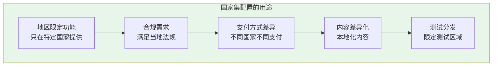
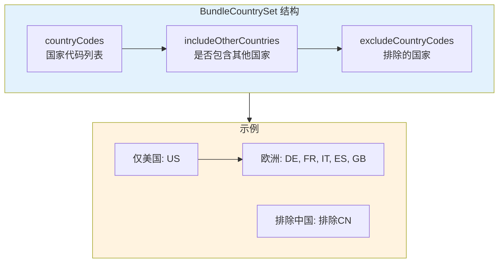
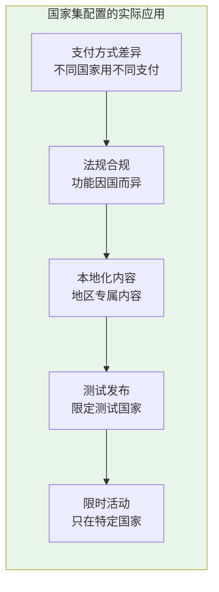
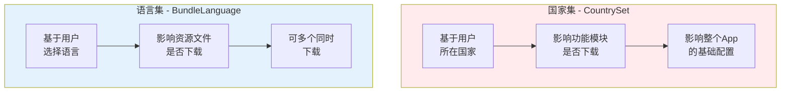
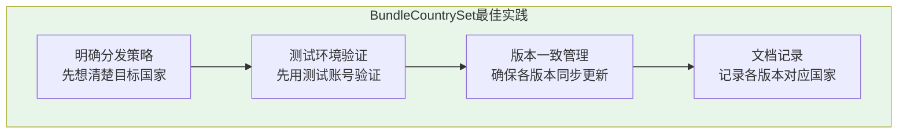
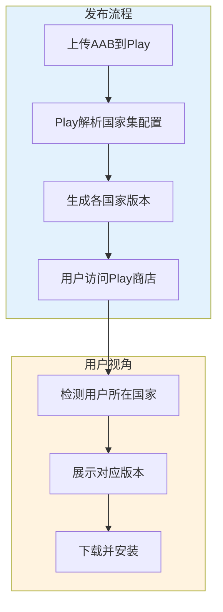

# 21.1.92 BundleCountrySet

夕阳慢慢下沉，把湖面染成了橘子汽水的颜色。

洛芙躺在草坪上，双手枕在脑袋后面，看着天空从浅蓝一点点变成深蓝。几只蜻蜓在头顶盘旋，时不时俯冲到湖面上点一下，激起一圈圈涟漪。

“黛琳，”洛芙突然开口，“我们之前学了代码透明度，能看到App里有什么……那有没有办法控制哪些国家的用户能下载到什么呢？”

希尔正在用树枝在地上画着什么，抬起头：“咦？你怎么会想到这个？”

“因为我在想，”洛芙翻了个身，撑着下巴，“有些App在不同国家可能内容不一样。比如，有些功能在某些国家不能用，或者某些国家的用户需要特别版本的App……”

伊莎正在整理她的画具，听到这话停了下来：“你说的是地区限制吗？我记得有些视频App会根据你所在的国家显示不同的内容呢。”

“对对对！”洛芙点头如捣蒜，“就是那个意思！”

黛琳微笑着翻开白板的新的一页：“这正是我们今天要聊的话题——BundleCountrySet，国家集配置。”

---

## 什么是国家集配置

树荫下，黛琳开始解释国家集的概念。

“你们有没有注意到，”她问道，“有时候一个App在不同国家的Play商店里，显示的功能或大小可能不一样？”

洛芙歪着头想了想：“好像是的！我之前下载同一个App，国内版本和国外版本好像有点不一样。”

“那就是因为App Bundle支持按国家分发，”黛琳说，“通过BundleCountrySet，你可以指定：”



“国家集配置就是告诉Google Play，哪些用户可以看到或下载特定的配置或功能模块，”黛琳解释道。

希尔补充道：“比如你开发了一个App，里面有某些功能在A国是合法的，在B国不合法。你就可以用国家集配置，让B国的用户下载的App不包含那个功能。”

---

## 国家集的基本概念

黛琳在白板上画出国家集的结构：



“国家集包含三个主要部分，”黛琳说：

**1. countryCodes** - 指定包含的国家代码列表，比如 ["US", "CA", "GB"]
**2. includeOtherCountries** - 是否包含列表之外的国家
**3. excludeCountryCodes** - 从列表中排除特定国家

洛芙举手提问：“那如果我想让App只在日本和韩国发布，不给其他国家呢？”

“好问题，”黛琳笑着说，“这种情况下，你可以设置 countryCodes = ["JP", "KR"]，然后设置 includeOtherCountries = false。这样就只有日本和韩国的用户能下载了。”

---

## 国家集配置的语法

希尔打开笔记本电脑，展示具体的配置代码：

```kotlin
// app/build.gradle.kts

android {
    // ...
    
    bundle {
        // 国家集配置
        // 用于指定哪些国家的用户可以下载特定的配置
        
        // 示例1：只在特定国家提供
        countrySet {
            // 包含的国家代码（ISO 3166-1 alpha-2 格式）
            // 美国、加拿大、英国
            countryCodes.addAll(listOf("US", "CA", "GB"))
            
            // 是否包含列表之外的国家
            // false = 只允许上述国家
            // true = 上述国家 + 其他所有国家
            includeOtherCountries = false
        }
    }
}
```

“国家代码使用的是ISO 3166-1 alpha-2格式，”希尔补充道，“就是国际上标准的两位字母国家代码。”

伊莎好奇地问：“那中国怎么表示？”

“中国是CN，日本是JP，韩国是KR，美国是US，英国是GB，”希尔如数家珍，“很标准的两位字母代码。”

---

## 国家集与动态功能模块

黛琳接着解释国家集如何与动态功能模块配合使用：

“国家集通常和动态功能模块（Dynamic Features）一起使用，”她说，“你可以在配置某个功能模块时，指定它只在特定国家可用。”

```kotlin
// app/build.gradle.kts

android {
    // 动态功能模块配置
    
    // 创建一个只在特定国家提供的功能模块
    dynamicFeatures += ":premiumFeatures"
}

dependencies {
    // 动态功能模块的依赖
    implementation(project(":premiumFeatures"))
}
```

然后在动态功能模块的 build.gradle 中配置国家集：

```kotlin
// dynamicFeatures/premiumFeatures/build.gradle.kts

android {
    // 动态功能配置
    bundle {
        // 国家集：只在日本和美国提供高级功能
        countrySet {
            countryCodes.addAll(listOf("JP", "US"))
            includeOtherCountries = false
        }
    }
}
```

洛芙惊叹：“所以我可以创建一个只有日本和美国用户才能下载的高级功能？！”

“对，”黛琳点头，“这就是按国家分发的基础。”

---

## 国家集配置的详细示例

希尔展示了一个更完整的示例：

```kotlin
// app/build.gradle.kts

android {
    bundle {
        
        // 场景1：只在特定国家提供的基础配置
        countrySet {
            // 指定国家列表
            countryCodes.addAll(listOf(
                "DE",  // 德国
                "FR",  // 法国
                "IT",  // 意大利
                "ES",  // 西班牙
                "GB"   // 英国
            ))
            
            // 只包含列表中的国家
            includeOtherCountries = false
        }
        
        // 场景2：排除特定国家
        // 假设这个配置在除中国外的所有国家提供
        countrySet {
            // 首先包含所有国家（通过不设置countryCodes或留空）
            countryCodes.clear()
            
            // 然后排除特定国家
            excludeCountryCodes.addAll(listOf("CN", "KP", "IR"))
            
            // 包含除排除国家外的其他国家
            includeOtherCountries = true
        }
        
        // 场景3：只在特定地区（通过组合多个国家）
        // 亚太地区示例
        countrySet {
            // 日本、韩国、澳大利亚、新西兰、新加坡
            countryCodes.addAll(listOf(
                "JP", "KR", "AU", "NZ", "SG"
            ))
            includeOtherCountries = false
        }
    }
}
```

---

## 按国家分发的实际应用场景

黛琳列举了几个典型的应用场景：



**1. 支付方式差异**：不同国家支持不同的支付方式。比如某些支付服务只在特定国家可用，你就可以让那个国家的用户下载包含该支付功能的App版本。

**2. 法规合规**：某些功能在特定国家是合法的，在其他国家不合法。比如博彩相关功能在很多国家是非法的，就可以用国家集限制。

**3. 本地化内容**：某些内容只在特定国家提供。比如特定的视频内容、音乐、新闻等，可以根据用户所在国家提供不同版本。

**4. 测试发布**：在新功能正式全球发布前，可以先在特定国家进行测试，收集反馈。

**5. 限时活动**：某些促销或活动只在特定国家开展，可以创建临时配置来支持。

---

## 国家集与设备配置的配合

希尔讲解国家集如何与其他配置配合：

“国家集通常不是单独使用的，”她说，“它会和设备配置、屏幕密度配置等一起使用，构建完整的分发规则。”

```kotlin
// app/build.gradle.kts

android {
    
    // 默认配置：所有国家
    defaultConfig {
        // ... 其他配置
    }
    
    bundle {
        
        // 高端设备配置：只在欧美国家提供
        // 这个配置包含更高质量的资源
        deviceTier {
            // 设备等级配置
            // ...
        }
        
        countrySet {
            // 只在美国、加拿大、英国、德国、法国提供
            countryCodes.addAll(listOf("US", "CA", "GB", "DE", "FR"))
            includeOtherCountries = false
        }
        
        // 低端设备配置：所有国家
        // 针对发展中国家市场优化
    }
}
```

洛芙好奇地问：“那用户怎么知道自己下载的是哪个版本？”

“用户看到的Play商店会根据他们的设备和所在国家，自动展示合适的版本，”黛琳解释说，“你不需要告诉用户这些细节，Play会自动处理。”

---

## 国家集与语言配置的对比

伊莎提出了一个问题：“国家集和语言配置（bundleLanguage）有什么区别？”

黛琳画了一个对比图：



“国家集和语言集有本质区别，”黛琳解释道：

**国家集（CountrySet）**：
- 基于用户所在国家
- 控制功能模块是否下载
- 影响整个App的基础配置
- 通常只选一个配置

**语言集（BundleLanguage）**：
- 基于用户选择的语言
- 控制语言资源是否下载
- 用户可以同时下载多种语言
- 可以选择多种语言包

洛芙若有所思：“所以国家集是'你在哪个国家'，语言集是'你想用什么语言'？”

“对，概括得很准确！”黛琳笑着说。

---

## 国家集配置的最佳实践

希尔总结了国家集配置的最佳实践：



**1. 明确分发策略**：在配置国家集之前，先想清楚你的分发目标。是要全球发布？还是特定国家测试？

**2. 测试环境验证**：在正式发布前，使用测试账号在不同国家进行验证，确保配置正确。

**3. 版本一致性管理**：当App更新时，确保所有国家配置都同步更新，避免某些国家停留在旧版本。

**4. 文档记录**：记录每个国家配置对应的功能和版本，便于后续维护和问题排查。

---

## 常见问题与解决方案

黛琳列举了几个常见问题：

```kotlin
// 问题1：国家代码格式错误
// ❌ 错误示例
countryCodes.add("USA")      // 错误：应该用两位字母代码
countryCodes.add("America")  // 错误：不能用全名

// ✅ 正确示例
countryCodes.add("US")       // 正确


// 问题2：includeOtherCountries 理解错误
// ❌ 错误示例
countryCodes.addAll(listOf("US", "CN"))
includeOtherCountries = true  // 这会包含所有国家，countryCodes无效

// ✅ 正确示例
// 如果想包含特定国家
countryCodes.addAll(listOf("US", "CN"))
includeOtherCountries = false  // 只包含列表中的国家


// 问题3：与其他配置冲突
// 多个bundle块中配置了不同的国家集
// 系统会如何处理？
// 
// Android Gradle Plugin会合并配置
// 如果配置冲突，可能导致不可预期的行为
```

“国家代码必须使用ISO 3166-1 alpha-2格式，”黛琳强调，“这是国际标准，不能用全名或缩写。”

---

## 与Play商店发布的配合

希尔讲解了国家集配置如何与Google Play商店配合工作：

“当你上传一个包含国家集配置的App Bundle后，”她说，“Google Play会自动处理分发逻辑。”



“具体流程是这样的，”希尔解释说：

1. **上传AAB**：你将包含国家集配置的App Bundle上传到Google Play Console
2. **配置解析**：Play解析你的国家集配置
3. **生成版本**：Play为每个国家/地区组合生成对应的App版本
4. **用户访问**：当用户访问Play商店时，Play检测用户所在国家
5. **展示版本**：根据用户所在国家，展示对应的App版本

洛芙问：“那用户能选择下载其他国家的版本吗？”

“一般情况下不能，”黛琳说，“用户只能下载他们所在国家对应的版本。这是Play自动处理的。”

---

## 实际配置示例：分地区支付

希尔展示了一个实际的业务场景示例：

“假设你开发了一个App，”她说，“需要根据不同国家提供不同的支付方式：”

```kotlin
// app/build.gradle.kts

android {
    
    // 基础App：所有国家都可下载
    defaultConfig {
        applicationId = "com.example.camping"
        // 基础功能
    }
    
    bundle {
        
        // 日本版：包含PayPay支付
        countrySet {
            countryCodes.add("JP")
            includeOtherCountries = false
        }
    }
}

// dynamicFeatures/paypay/build.gradle.kts

android {
    bundle {
        // 日本专享的支付模块
        countrySet {
            countryCodes.add("JP")
            includeOtherCountries = false
        }
    }
}

dependencies {
    implementation("jp.ne.payway:payway-sdk:3.0.0")
}

// dynamicFeatures/alipay/build.gradle.kts

android {
    bundle {
        // 中国大陆专享的支付宝模块
        countrySet {
            countryCodes.add("CN")
            includeOtherCountries = false
        }
    }
}

dependencies {
    implementation("com.alipay.sdk:alipaysdk-android:15.8.11")
}

// dynamicFeatures/paypal/build.gradle.kts

android {
    bundle {
        // 其他国家使用PayPal
        // 不设置countryCodes，默认所有国家
        includeOtherCountries = true
    }
}
```

洛芙看着代码惊呼：“所以我可以为不同国家提供完全不同的支付模块？！”

“对，”黛琳点头，“这就是国家集配置的强大之处。你可以让日本用户下载包含PayPay的版本，中国用户下载包含支付宝的版本，其他国家用户下载包含PayPal的版本。”

---

## 日志输出与验证

希尔运行了一次构建，展示了终端输出：

```
> ./gradlew bundleRelease

> Task :app:generateReleaseBundleConfig
Generating bundle configuration...
✓ Country set configuration detected:
  - Japan (JP): PayPay module included
  - China (CN): Alipay module included  
  - Other countries: PayPal module included

> Task :app:packageReleaseBundle
Building release bundle...
✓ Bundle created: app/build/outputs/bundle/release/app-release.aab
✓ Bundle size: 15.2 MB
✓ Country-specific splits:
  - base.apk (all countries): 12.0 MB
  - paypay.apk (JP only): 1.5 MB
  - alipay.apk (CN only): 1.2 MB
  - paypal.apk (others): 0.5 MB

BUILD SUCCESSFUL in 52s
```

洛芙看着输出：“原来构建时会自动识别国家配置并生成对应的模块！”

“对，”希尔说，“这就是App Bundle的强大之处——它会根据你的配置自动拆分出最合适的包。”

---

## 章节小结

黛琳整理着白板上的笔记：“今天我们学习了BundleCountrySet——国家集配置。它能帮助我们：”

“**按国家分发内容**——指定哪些国家的用户可以下载特定配置；**实现地区差异化**——不同国家获得不同功能或内容；**满足法规要求**——确保特定功能只在合法地区提供；**灵活测试发布**——在新功能全球发布前，可以先在特定国家测试。”

伊莎补充道：“就像露营时，不同的营地适合不同的人数——有些人多的去大营地，有些人少的去小营地！”

“对，”黛琳微笑着说，“国家集配置就是帮你把用户分配到最合适的'营地'的工具。”

夕阳已经完全沉入湖面，天空变成了深蓝色，第一批星星开始闪烁。湖面上倒映着星光，仿佛整个宇宙都在这个小小的露营地里。

---

> BundleCountrySet是Android Gradle DSL中用于配置App Bundle按国家分发的接口。在App全球发布时，不同国家可能有不同的法规要求、支付方式或内容策略。通过countryCodes指定国家列表，配合includeOtherCountries控制是否包含列表外国家，以及excludeCountryCodes排除特定国家，可以实现精细化的分发控制。国家集通常与动态功能模块（Dynamic Features）配合使用，为不同国家提供不同的功能模块。配置使用ISO 3166-1 alpha-2标准国家代码。Google Play会自动解析国家集配置，为每个目标国家生成对应的App版本，用户在Play商店会自动看到适合他们所在国家的版本。最佳实践包括：明确分发策略、使用测试账号验证、保持版本一致性、做好文档记录。国家集与语言集（bundleLanguage）不同：国家集基于用户所在国家，语言集基于用户选择的语言。

---

> 学习建议：BundleCountrySet是实现App全球化分发的重要工具。建议在规划全球发布时，先列出各国的法规要求和功能差异，然后据此设计国家集配置。配置完成后务必使用测试账号在目标国家验证。countryCodes必须使用标准的两位字母国家代码（ISO 3166-1 alpha-2）。注意includeOtherCountries的默认值是true，务必根据实际需求显式设置。国家集配置会生成多个App版本，需要确保各版本的同步更新和维护。

## 洛芙的小小日记本

今天学到了国家集配置！原来App可以根据用户所在国家分发不同的功能和内容～日本用户用PayPay，中国用户用支付宝，其他用户用PayPal！还可以用来满足不同国家的法规要求，简直太强了！就像根据不同人的口味准备不同的料理一样～明天继续！

---

## 今日关键词

**BundleCountrySet**：Android Gradle DSL中用于配置App Bundle按国家分发的接口。

**国家集**：Country Set，指定哪些国家的用户可以下载特定App配置的概念。

**ISO 3166-1 alpha-2**：国际标准的两位字母国家代码格式，如US代表美国、CN代表中国。

**动态功能模块**：Dynamic Features，App Bundle中可按需下载的功能模块。

**按国家分发**：Country-specific Delivery，根据用户所在国家提供不同App版本的功能。

**设备配置**：Device Configuration，App Bundle中控制资源分发的配置。

**屏幕密度配置**：Screen Density Configuration，控制不同屏幕密度设备的资源分发。

**语言集**：Language Bundle，App Bundle中控制语言资源分发的配置。

**Google Play Console**：Google Play开发者控制台，用于发布和管理Android应用。

**App Bundle**：Google推荐的Android应用发布格式，支持模块化分发。
