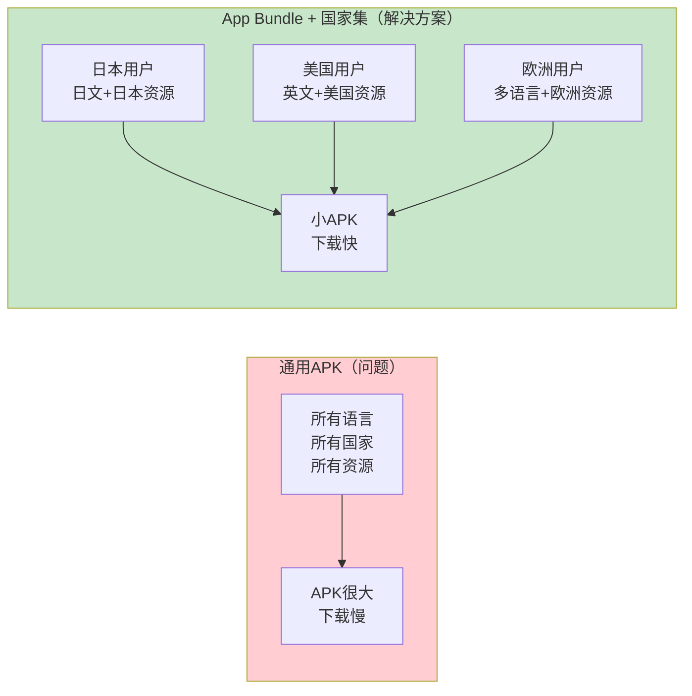
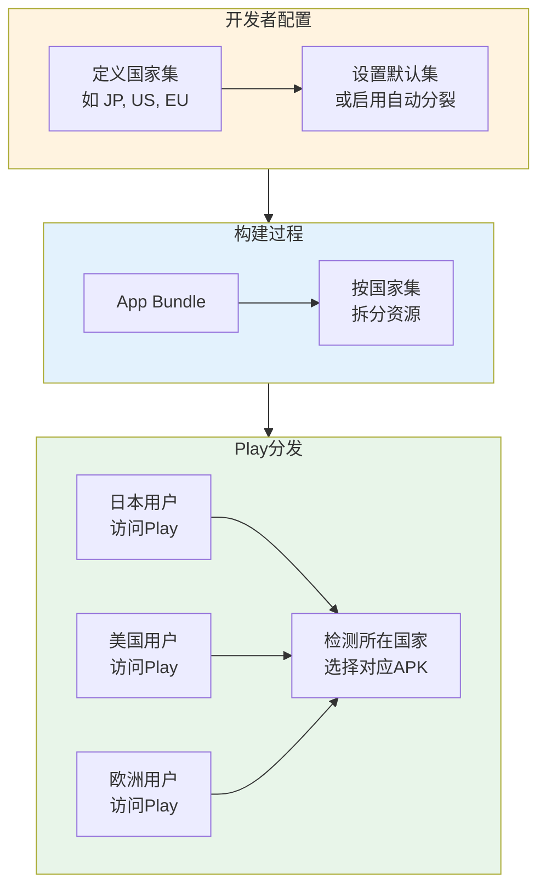

# 21.1.92 BundleCountrySet

太阳慢慢西沉，金色的阳光洒在湖面上，像是撒了一把碎金子。

洛芙躺在湖边的草坪上，双手枕着头，看着天空从蓝色渐渐变成橘红色。伊莎递过来一盒切好的西瓜，洛芙随手拿了一块，咬了一口——清甜的汁水顺着嘴角流下来。

“真好吃呀～”洛芙满足地叹了口气。

希尔正在笔记本电脑上敲代码，忽然停下来：“对了，洛芙，我记得你说你的App要在好几个国家发布？”

“对呀！”洛芙一下子坐起来，“我想在日本、美国、欧洲都上线。可是……每个国家的用户需要的资源可能不一样吧？比如日本需要日文，美国需要英文，欧洲有些国家需要好几种语言……而且不同国家可能只需要自己国家的资源包？”

黛琳正在整理她的白板，听见这话转过身来：“这个问题问得好！不同的确的用户，确实可能需要不同的资源。如果我们把所有国家的资源都打包在一起，APK会变得很大，用户下载起来也很慢。”

“那怎么办呀？”洛芙问。

“这就是BundleCountrySet要解决的问题了，”黛琳笑着说，“它是用来配置'国家集'的——告诉Google Play，哪些国家的用户应该分发什么样的APK。”

---

## 什么是国家集

伊莎好奇地问：“国家集是什么呀？听起来好像是把国家打包一样～”

“差不多是那个意思，”黛琳点点头，在白板上画了起来，“你们想，一个App要在全球发布，如果把所有的资源都塞进一个APK里——所有语言的翻译、所有国家的图片资源、所有的配置……这个APK会变得非常大。”

洛芙想起来之前下载过的某些App：“确实！我之前下载过一个游戏，刚安装完就占了1GB多的空间！”

“对，这就是'通用APK'的问题，”黛琳说，“但实际上，大部分用户只需要自己国家的那部分资源。比如中国用户不需要日文，美国用户不需要中文。所以我们可以把App拆分成不同的'变体'，每个变体只包含特定国家需要的资源。”



“国家集就是用来配置这个的，”黛琳解释道，“你可以告诉Google Play：‘对于日本用户，分发包含日文资源的APK；对于美国用户，分发只包含英文的APK。’这样每个用户下载的APK都是'量身定制'的，体积最小。”

---

## 国家集的工作原理

希尔补充道：“国家集本质上是一种'分裂'（Split）策略——把一个大的App拆分成多个小的APK片段。”

“国家集有两种使用方式，”黛琳继续说，“第一种是设置默认国家集——告诉Play默认给用户分发什么版本；第二种是启用国家分裂——让Play根据用户所在国家自动选择最合适的版本。”



洛芙问：“那如果我在中国，但想用日文版怎么办？”

“好问题！”黛琳说，“用户可以手动选择想用的语言版本，不一定非要和所在国家一致。国家集主要是为了优化下载体积，但用户还是可以自由选择的。”

---

## BundleCountrySet的配置

希尔打开笔记本电脑，展示具体的配置代码：

```kotlin
// app/build.gradle.kts

android {
    // ...
    
    bundle {
        // 国家集配置
        countrySet {
            // 设置默认国家集
            // 指定默认包含哪些国家的资源
            defaultSet = "US,JP,GB,DE,FR"
            
            // 是否启用按国家分裂
            // true = 根据用户所在国家自动分发对应版本
            // false = 所有用户都下载默认版本
            enableSplit = true
        }
    }
}
```

黛琳解释道：“`defaultSet`是你默认要包含的国家代码，用逗号分隔。比如'US,JP,GB,DE,FR'表示美国、日本、英国、德国、法国。`enableSplit`是开关——打开后，Google Play会自动根据用户所在国家分发最合适的版本。”

---

## 国家代码的格式

伊莎问：“国家代码是怎么写的呀？”

“国家代码用的是ISO 3166-1 alpha-2标准，”黛琳说，“就是两个字母的国家简写。”

```kotlin
// 常见的国家代码示例
countrySet {
    // 美国
    defaultSet = "US"
    
    // 日本
    defaultSet = "JP"
    
    // 中国
    defaultSet = "CN"
    
    // 韩国
    defaultSet = "KR"
    
    // 德国
    defaultSet = "DE"
    
    // 法国
    defaultSet = "FR"
    
    // 英国
    defaultSet = "GB"
    
    // 多个国家
    defaultSet = "US,JP,CN,KR,GB,DE,FR,ES,IT,BR"
}
```

“国家代码都是两个大写字母，”黛琳补充道，“比如US是美国，JP是日本，CN是中国。Play商店会根据用户的Google账号设置或手机SIM卡来判断用户所在国家。”

---

## 实际使用场景

希尔展示了几个常见的配置场景：

```kotlin
// 场景1：只在特定国家发布
// 适用于：只在少数国家运营的App
bundle {
    countrySet {
        // 只在日本发布
        defaultSet = "JP"
        enableSplit = true
    }
}

// 场景2：主要市场 + 其他
// 适用于：有主要目标市场，但也会全球发布
bundle {
    countrySet {
        // 主要市场：美国、日本、德国
        // 其他国家用默认配置
        defaultSet = "US,JP,DE"
        enableSplit = true
    }
}

// 场景3：按地区分组
// 适用于：不同地区需要不同资源
bundle {
    countrySet {
        // 亚洲国家
        defaultSet = "JP,CN,KR,SG,TW,HK"
        enableSplit = true
    }
}

// 场景4：所有国家（默认）
// 适用于：App需要全球发布，所有用户都能用
bundle {
    countrySet {
        // 不指定具体国家，表示所有国家
        defaultSet = ""  // 或者不配置
        enableSplit = true
    }
}
```

“对大多数App来说，不需要配置countrySet，”黛琳说，“Play会自动处理。但如果你有特殊需求——比如只在某些国家发布，或者某些国家需要特殊资源——就需要配置它。”

---

## 国家集与资源的关系

洛芙好奇地问：“国家集和资源有什么关系呀？”

“问得好！”黛琳画了一张图来解释，“国家集不仅仅是分发不同版本的APK，它还会影响资源的选择。”

```mermaid
flowchart LR
    subgraph Resources["App资源"]
        R1[values/strings.xml<br/>默认英文] --> R2[values-ja/strings.xml<br/>日文]
        R2 --> R3[values-zh/strings.xml<br/>中文]
        R3 --> R4[values-fr/strings.xml<br/>法文]
    end
    
    subgraph CountrySet["国家集配置"]
        CS1[defaultSet = "US,JP,FR"]
    end
    
    subgraph Result["分发结果"]
        Result1[美国用户<br/>英文APK] --> Out1[最小APK]
        Result2[日本用户<br/>日文APK] --> Out1
        Result3[法国用户<br/>法文APK] --> Out1
        Result4[其他国家用户<br/>默认英文APK] --> Out1
    end
    
    Resources --> CountrySet --> Result
    
    style Resources fill:#e3f2fd
    style CountrySet fill:#fff3e0
    style Result fill:#e8f5e9
```

“国家集会和Android的资源系统配合工作，”黛琳解释道，“当你配置了特定国家集后，Gradle在构建时会自动把对应的资源打包进去。比如你配置了JP，Gradle就会把日文资源（values-ja）一起打包；配置了FR，就会包含法文资源（values-fr）。”

---

## 国家集与语言的区别

伊莎问：“国家集和语言配置有什么区别呀？”

“很好的问题！”黛琳说，“国家集是用于分发策略的，语言是用于显示内容的。它们有关联，但不是一回事。”

```kotlin
// 语言配置（通过 BundleLanguage）
bundle {
    language {
        // 强制App只包含指定语言
        // 用来限制语言种类，减少体积
        defaultLocale = "en"
        enableSplit = true
    }
}

// 国家集配置
bundle {
    countrySet {
        // 指定按国家分发哪些资源
        defaultSet = "US,JP,DE"
        enableSplit = true
    }
}
```

“国家集控制的是'分发'——哪个国家的用户应该得到什么版本；语言控制的是'显示'——App界面应该用什么语言。它们可以单独使用，也可以配合使用。”

---

## 反模式：不合理的国家集配置

黛琳忽然严肃起来：“我见过一些开发者的错误配置，反而让APK变大了。”

```kotlin
// ❌ 反模式1：国家集范围过小
bundle {
    countrySet {
        // 只配置了一个国家
        defaultSet = "US"
        enableSplit = true
    }
    // 问题：其他国家的用户会下载通用版本，
    // 包含了所有语言的资源，反而更大
}

// ❌ 反模式2：enableSplit = false
bundle {
    countrySet {
        defaultSet = "US,JP,CN,KR,GB,DE,FR,ES,IT"
        enableSplit = false  // 关闭分裂
    }
    // 问题：所有用户都下载完整版本，
    // 失去了按国家优化的意义
}

// ❌ 反模式3：和国家代码混淆
bundle {
    countrySet {
        // 错误：使用了语言代码而不是国家代码
        defaultSet = "en,ja,zh,fr"  // ❌ 这是语言代码！
        // 正确应该是：defaultSet = "US,JP,CN,FR"
    }
}
```

“这会导致什么问题？”希尔问。

洛芙思考了一下：“是不是——用户下载的APK反而变大了？”

“没错！”黛琳说，“配置不当的话，用户可能下载到包含所有资源的通用版本，而不是针对他们国家的优化版本。”

---

## 重构后：正确的国家集配置

希尔展示了正确的配置：

```kotlin
// ✅ 正确模式1：合理的目标国家集
bundle {
    countrySet {
        // 设置目标国家
        defaultSet = "US,JP,DE,GB,FR,KR"
        // 启用分裂，让Play自动优化
        enableSplit = true
    }
}

// ✅ 正确模式2：单一国家发布
bundle {
    countrySet {
        // 只在日本发布
        defaultSet = "JP"
        enableSplit = true
    }
}

// ✅ 正确模式3：使用地区通配符
// 注意：Gradle DSL不支持通配符，
// 但可以通过配置多个国家实现类似效果
bundle {
    countrySet {
        // 亚洲主要市场
        defaultSet = "JP,CN,KR,SG,HK,TW,IN"
        enableSplit = true
    }
}

// ✅ 正确模式4：默认配置（让Play自动处理）
bundle {
    // 不配置countrySet
    // Play会使用默认行为：
    // - 自动根据用户所在国家分发
    // - 优化资源体积
}
```

黛琳补充了选择依据：

1. **只在特定国家运营**：配置目标国家 + enableSplit = true
2. **全球发布但有重点市场**：配置重点市场 + enableSplit = true
3. **完全让Play自动处理**：不配置countrySet
4. **不要关闭enableSplit**：否则会失去按国家优化的效果

---

## 构建输出示例

希尔调出了一个真实的构建日志：

```
# 构建App Bundle后的输出
$ ./gradlew bundleDebug

> Task :app:bundleDebug
Executing: bundletool build-bundle
...
Bundle configuration:
  - Country Set:
    - Default Set: US,JP,DE,GB,FR,KR
    - Enable Split: true
  - Splits generated:
    * base-US.apk (English resources only)
    * base-JP.apk (Japanese resources only)
    * base-DE.apk (German resources only)
    * base-master.apk (all resources, fallback)

Generated bundle: app-debug.aab
```

“你们看，”希尔说，“开启国家集后，构建日志会显示生成了哪些国家变体。”

---

## 国家集与设备兼容

黛琳介绍了另一个重要概念：“国家集还会影响设备兼容性。”

“国家还和设备有关系？”洛芙问。

“有间接关系，”黛琳说，“不同国家的用户可能使用不同类型的设备——比如日本用户很多用iPhone，美国用户Android和iPhone都有，欧洲有些国家Windows Phone用户比较多……”

“国家集可以帮助你根据目标国家优化设备支持，”她继续说，“比如你发现日本市场主要是高端Android和iPhone，你可以针对这些设备优化资源配置。”

```kotlin
// 配合设备配置使用
bundle {
    // 国家集
    countrySet {
        defaultSet = "US,JP,DE"
        enableSplit = true
    }
    
    // 设备组（后续章节会讲）
    deviceGroup {
        // 配置不同设备组的资源
    }
    
    // 屏幕密度
    density {
        // 配置不同屏幕密度的资源
    }
}
```

“国家集、密度集、设备组——这些可以配合使用，构建一个非常精细的分发策略，”黛琳说。

---

## 验证配置效果

黛琳展示了如何验证配置是否正确：

```bash
# 1. 构建App Bundle
$ ./gradlew bundleDebug

# 2. 使用bundletool查看元数据
$ java -jar bundletool.jar dump --bundle app.aab --metadata

# 输出示例
{
  "countrySet": {
    "defaultSet": "US,JP,DE,GB,FR,KR",
    "enableSplit": true
  },
  "splits": [
    { "config": "us", "resources": ["values", "values-ja"] },
    { "config": "jp", "resources": ["values", "values-ja"] },
    { "config": "de", "resources": ["values", "values-fr"] }
  ]
}

# 3. 在Play Console查看分发配置
# 发布 -> 高级设置 -> 国家/地区
# 可以看到App将在哪些国家发布
```

---

## 与其他Bundle配置的配合

希尔展示了一个综合配置的例子：

```kotlin
// ✅ 综合配置示例

android {
    bundle {
        // 国家集：按国家分发
        countrySet {
            defaultSet = "US,JP,DE,GB,FR,KR,CN"
            enableSplit = true
        }
        
        // 语言：按语言分发
        language {
            defaultLocale = "en"
            enableSplit = true
        }
        
        // 屏幕密度：按设备分发
        density {
            // 启用密度分裂
            enableSplit = true
            // 包含的密度
            include("ldpi", "mdpi", "hdpi", "xhdpi", "xxhdpi", "xxxhdpi")
        }
        
        // ABI：按CPU架构分发
        abi {
            enableSplit = true
            include("armeabi-v7a", "arm64-v8a", "x86", "x86_64")
        }
    }
}
```

“这些配置可以叠加使用，”黛琳说，“国家集控制按国家分发，语言集控制按语言分发，密度集控制按屏幕密度分发……它们组合起来，可以让每个用户下载的APK都是'刚刚好'的大小。”

---

## 章节小结

洛芙看着湖面上闪烁的波光：“原来App还可以按国家来分发呀！这样日本用户就不会下载到不需要的中文资源了～”

伊莎笑着说：“而且每个用户都能用到'刚好合适'的版本，不会浪费流量和存储空间！”

“对，”黛琳微笑着说，“BundleCountrySet就是帮助我们配置这个的——它让App分发更加精准，也用户体验更好。”

远处传来希尔的声音：“下次我们来聊聊屏幕密度配置——不同的手机屏幕，需要不同的图片资源！”

晚霞把天空染成了紫红色，湖面上倒映着山的影子。露营者们收拾着东西，期待着明天的技术讨论。

---

> BundleCountrySet是Android Gradle DSL中用于配置App Bundle国家集选项的接口。国家集（Country Set）是一种App Bundle分发优化策略，允许开发者指定目标国家，让Google Play根据用户所在国家自动分发包含对应资源的APK，从而减少用户下载的APK体积。通过`bundle.countrySet { defaultSet = "US,JP,DE"; enableSplit = true }`配置，其中`defaultSet`指定默认包含的国家代码（ISO 3166-1 alpha-2格式，如US、JP、CN），`enableSplit`控制是否启用按国家分裂。建议目标国家明确时配置国家集，如果App全球发布且没有特殊需求，可以让Play自动处理。注意国家代码是两位字母（如US表示美国，JP表示日本），不要与语言代码（如en、ja）混淆。国家集通常与语言集（BundleLanguage）、密度集（BundleDensity）、ABI等配置配合使用，实现精细化的资源分发优化。

---

> 学习建议：国家集配置是App Bundle分发优化的重要手段。如果你的App只在特定国家运营，配置目标国家集可以显著减少APK体积并提升用户体验。注意`enableSplit = true`才能启用按国家分裂，否则配置无效。国家代码使用ISO 3166-1 alpha-2标准（两位大写字母）。如果App全球发布且没有特殊需求，可以不配置countrySet，让Play自动处理资源优化。国家集可以与语言集、密度集、ABI等其他分裂策略配合使用，构建完整的分发优化体系。

## 洛芙的小小日记本

今天学到了国家集配置！原来App可以按国家来"定制"——日本用户下载日文版，美国用户下载英文版，这样APK体积更小，下载更快～通过BundleCountrySet配置目标国家，让每个用户都能用到"刚好合适"的版本，真是太贴心了！🌏

---

## 今日关键词

**国家集**：Country Set，App Bundle的分发配置策略，按国家分发不同版本。

**BundleCountrySet**：Android Gradle DSL接口，用于配置App Bundle的国家集选项。

**ISO 3166-1 alpha-2**：国际标准国家代码，由两位大写字母组成（如US、JP、CN）。

**App Bundle分裂**：App Bundle Split，根据不同条件将App拆分成多个APK的技术。

**资源优化**：Resource Optimization，通过配置减少APK体积的优化策略。

**分发策略**：Distribution Strategy，控制如何向不同用户分发App配置的策略。

**语言集**：Language Set，按语言分发资源的配置。

**密度集**：Density Set，按屏幕密度分发资源的配置。

**ABI分裂**：ABI Split，按CPU架构分发不同APK的技术。
