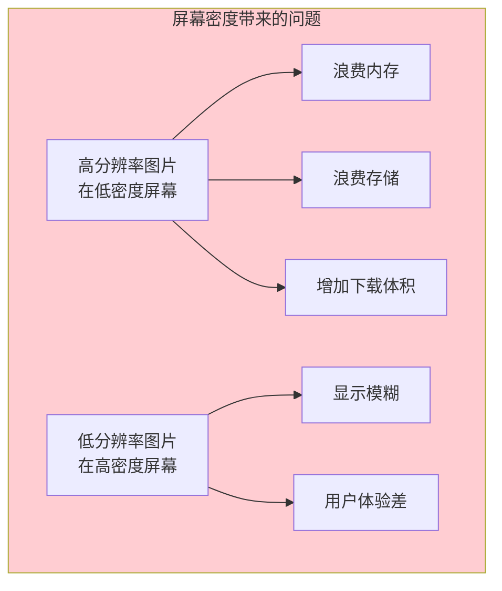
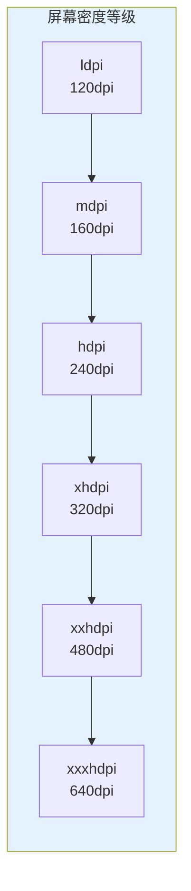
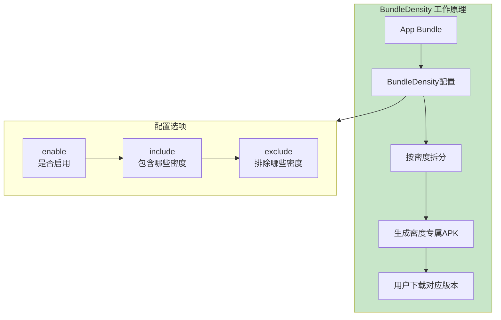
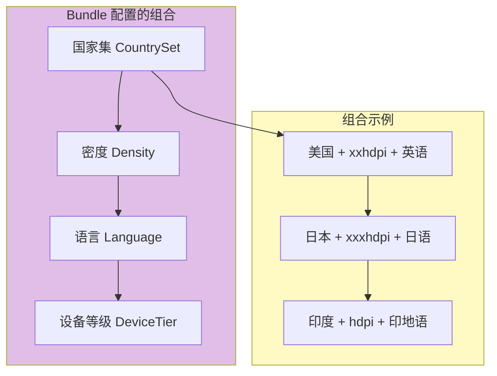

# 21.1.93 BundleDensity

湖面上的金光随着波纹轻轻晃动，像撒了一把碎金子。

洛芙用手遮住眼睛，抬头看了看天。太阳已经没有那么毒辣了，温度恰到好处，正是最舒服的下午时分。她翻了个身，趴在草坪上，看着希尔在那边敲代码。

“希尔，”洛芙随口问道，“我们之前学了按国家分发 App，那……手机屏幕不一样大不一样清楚，怎么处理呀？”

黛琳正在整理她的白板笔，听到这个问题停了下来。

“你问得很及时，”她笑着说，“这正是我们今天要聊的话题——BundleDensity，屏幕密度配置。”

伊莎抬起头，好奇地问：“屏幕密度？那是什么？”

“就是屏幕上像素的密集程度，”黛琳解释道，“有的手机屏幕很小但很清楚，有的屏幕很大但看起来有点模糊，这就是屏幕密度的区别。”

---

## 为什么要配置屏幕密度

希尔停下敲代码的手，转过身来：“这个问题问得好。洛芙，你有没有想过，为什么下载一个 App 的时候，它的大小会不一样？”

洛芙歪着头想了想：“好像……是跟手机型号有关？”

“对，但具体来说，是跟屏幕密度有关，”希尔说，“你想啊，一个给老人机准备的低分辨率图片，放到现在的旗舰手机上，肯定会模糊得没法看。反过来，给旗舰机准备的高清大图，放到低密度手机上，就是浪费存储空间和下载流量。”

黛琳点点头，在白板上画了起来：



“所以我们需要针对不同的屏幕密度，提供不同的资源文件，”黛琳说，“这就是 BundleDensity 要解决的问题。”

---

## 屏幕密度的基本概念

伊莎举手提问：“那个……屏幕密度到底怎么区分啊？”

“好问题！”希尔立刻来了精神，“Android 把屏幕密度分成了几个等级：”



“简单来说，”希尔解释道，“dpi 就是每英寸有多少个像素点。ldpi 是最低的，xxxhdpi 是最高的。现在的手机大多数都是 xxhdpi 或 xxxhdpi 了。”

洛芙掰着手指头数：“那……是不是意味着我需要为每个密度都准备一套图片？”

“以前是这么做的，”黛琳说，“但有了 App Bundle 和 BundleDensity，我们可以更智能地处理这个问题。”

---

## BundleDensity 的工作原理

黛琳在白板上画出了 BundleDensity 的结构：



“BundleDensity 的核心思想是这样的，”黛琳解释道，“与其让用户的手机下载包含所有密度资源的超大 APK，不如在服务器端就按密度拆分成多个小 APK。用户下载的时候，Play 商店会自动匹配用户的屏幕密度，下载最合适的那一个。”

洛芙眼睛一亮：“所以低端手机的用户不用下载高清图片了？！”

“对！”希尔笑着说，“这就是省流量和省空间的秘诀。”

---

## 配置 BundleDensity

希尔打开笔记本电脑，展示具体的配置代码：

```kotlin
// app/build.gradle.kts

android {
    
    bundle {
        
        // 屏幕密度配置
        // 控制生成哪些密度版本的 APK
        
        density {
            
            // 是否启用密度拆分
            // true = 启用，按密度生成多个 APK
            // false = 不启用，生成一个包含所有密度的 APK
            enable = true
            
            // 指定要包含的屏幕密度
            // 可选值: "ldpi", "mdpi", "hdpi", "xhdpi", "xxhdpi", "xxxhdpi"
            include.add("mdpi")
            include.add("hdpi")
            include.add("xhdpi")
            include.add("xxhdpi")
            include.add("xxxhdpi")
            
            // 指定要排除的屏幕密度
            // 排除后，该密度的资源不会被打包进 APK
            // exclude.add("ldpi")  // 低端机越来越少了
            
        }
        
    }
}
```

“这里有个小技巧，”希尔补充道，“如果你想排除某个密度，比如觉得 ldpi 用户太少，可以把它排除掉，这样所有 APK 都不会包含 ldpi 资源，省一点空间。”

伊莎好奇地问：“那如果我不配置会怎么样？”

“不配置的话，”黛琳说，“默认行为是生成所有常见密度的 APK。”

---

## 常见配置场景

黛琳列举了几个典型的配置场景：

```kotlin
// app/build.gradle.kts

android {
    bundle {
        
        // 场景1：包含所有常见密度（默认推荐）
        density {
            enable = true
            include.addAll(listOf(
                "mdpi", "hdpi", "xhdpi", "xxhdpi", "xxxhdpi"
            ))
        }
        
        // 场景2：排除低密度（现代 App 主流做法）
        // 理由：ldpi 设备几乎绝迹，排除可以节省包体积
        density {
            enable = true
            include.clear()
            include.addAll(listOf(
                "hdpi", "xhdpi", "xxhdpi", "xxxhdpi"
            ))
            // 不包含 mdpi 和 ldpi
        }
        
        // 场景3：只包含高端密度
        // 适用于游戏或视觉为主的应用
        density {
            enable = true
            include.clear()
            include.addAll(listOf(
                "xhdpi", "xxhdpi", "xxxhdpi"
            ))
        }
        
        // 场景4：使用 exclude 排除特定密度
        density {
            enable = true
            // 包含所有密度，但排除 ldpi
            include.addAll(listOf(
                "mdpi", "hdpi", "xhdpi", "xxhdpi", "xxxhdpi"
            ))
            exclude.add("ldpi")
        }
        
    }
}
```

洛芙看着代码：“所以我可以自己决定包含哪些密度？”

“对，”黛琳说，“但要注意，如果你排除了某个密度，那个密度的用户就可能遇到资源缺失的问题。所以排除之前要想清楚。”

---

## 密度配置与国家集的配合

希尔讲解密度配置如何与国家集配合：

“实际项目中，我们经常把密度配置和国家集配置结合起来用，”她说。

```kotlin
// app/build.gradle.kts

android {
    
    // 基础配置：所有国家
    defaultConfig {
        applicationId = "com.example.camping"
    }
    
    bundle {
        
        // 高端配置：只在发达国家提供高清资源
        // 发达国家用户通常使用高密度屏幕
        // 同时配置密度
        density {
            enable = true
            include.addAll(listOf(
                "xhdpi", "xxhdpi", "xxxhdpi"
            ))
        }
        
        // 同时配置国家：只在美国、日本、韩国、德国等发达国家提供
        countrySet {
            countryCodes.addAll(listOf(
                "US", "JP", "KR", "DE", "GB", "FR", "CA", "AU"
            ))
            includeOtherCountries = false
        }
        
    }
}
```

洛芙好奇地问：“这样配置的话，低端手机或者发展中国家的用户会怎样？”

“他们会收到一个通用的 APK，”黛琳解释说，“或者根据其他配置获得不同的资源包。Play 商店会智能匹配。”

---

## 反模式与最佳实践

黛琳特意强调了常见的错误做法：

```kotlin
// ❌ 反模式1：排除所有密度
density {
    enable = true
    // 错误：没有包含任何密度！
    include.clear()
}

// ✅ 正确做法：至少包含一个密度
density {
    enable = true
    include.add("xxhdpi") // 至少包含一个


// ❌ 反模式2：enable = false 却配置了 include/exclude
density {
    enable = false
    // 错误：禁用时，include/exclude 是无效的
    include.add("xxxhdpi")
}

// ✅ 正确做法：启用时再配置
density {
    enable = true
    include.add("xxxhdpi")


// ❌ 反模式3：同时使用 include 和 exclude
density {
    enable = true
    include.addAll(listOf("mdpi", "hdpi", "xhdpi", "xxhdpi", "xxxhdpi"))
    // 错误：同时使用会造成混乱
    exclude.add("hdpi")
}

// ✅ 正确做法：只使用其中一种
density {
    enable = true
    include.addAll(listOf("mdpi", "xhdpi", "xxhdpi", "xxxhdpi"))
}
```

“记住一个原则，”黛琳总结道，“要么用 include 指定包含哪些，要么用 exclude 指定排除哪些，不要两个同时用。”

---

## 构建输出示例

希尔运行了一次构建，展示了终端输出：

```
> ./gradlew bundleDebug

> Task :app:generateDebugBundleConfig
Generating bundle configuration...
✓ Density split configuration:
  - enable: true
  - included densities: mdpi, hdpi, xhdpi, xxhdpi, xxxhdpi

> Task :app:packageDebugBundle
Building debug bundle...
✓ Bundle created: app/build/outputs/bundle/debug/app-debug.aab
✓ Density splits generated:
  - app-mdpi.apk: 8.2 MB
  - app-hdpi.apk: 9.5 MB
  - app-xhdpi.apk: 11.3 MB
  - app-xxhdpi.apk: 13.8 MB
  - app-xxxhdpi.apk: 16.2 MB

✓ Each APK contains only the required density resources
✓ Users will download the appropriate APK based on their device

BUILD SUCCESSFUL in 35s
```

洛芙看着输出惊呼：“原来会生成这么多 APK！每个大小都不一样！”

“对，”希尔说，“xxxhdpi 的 APK 最大，因为它要装最清晰的图片；mdpi 的最小。用户手机是什么密度，就下什么包。”

---

## 与其他 Bundle 配置的关系

伊莎问道：“我们之前学的国家集，和这个密度配置，会冲突吗？”

“不会冲突，”黛琳说，“它们可以组合使用，形成更精细的分发策略。”



“国家集、密度、语言、设备等级，这些配置可以任意组合，”黛琳解释道，“Play 商店会根据用户的设备和国家，自动选择最合适的 APK。”

---

## 实际业务场景示例

希尔展示了一个更完整的业务场景：

“假设你开发了一个图片分享 App，”她说，“可以这样配置：”

```kotlin
// app/build.gradle.kts

android {
    
    defaultConfig {
        applicationId = "com.example.photoshare"
        // 基础功能
    }
    
    bundle {
        
        // 高清图片模块：只给高端设备
        density {
            enable = true
            // 只包含高端密度
            include.addAll(listOf("xhdpi", "xxhdpi", "xxxhdpi"))
        }
        
        // 低端设备模块：使用压缩图片
        // 通过国家集和密度的组合实现
        
    }
}

// dynamicFeatures/highQualityPhoto/build.gradle.kts

android {
    bundle {
        // 高清图片模块：只给高密度屏幕
        density {
            enable = true
            include.addAll(listOf("xhdpi", "xxhdpi", "xxxhdpi"))
        }
    }
}

dependencies {
    // 包含高清图片资源
    // drawable-xxhdpi/, drawable-xxxhdpi/
}

// dynamicFeatures/standardPhoto/build.gradle.kts

android {
    bundle {
        // 标准图片模块：给其他密度
        density {
            enable = true
            include.addAll(listOf("mdpi", "hdpi"))
        }
    }
}
```

洛芙明白了：“所以高端手机用户能看到高清图片，低端手机用户也不会因为图片太大而卡顿？”

“对！”希尔说，“这就是按需分发的好处。”

---

## 章节小结

黛琳整理着白板上的笔记：“今天我们学习了 BundleDensity——屏幕密度配置。它能帮助我们：”

“**按屏幕密度分发资源**——让不同密度的设备下载最合适的资源；**节省下载体积**——用户只下载需要的密度资源；**优化用户体验**——高端设备显示高清，低端设备运行流畅；**与国家集配合**——结合多种配置实现更精细的分发策略。”

伊莎补充道：“就像露营时，不同大小的帐篷适合不同人数——小帐篷省空间，大帐篷住着舒服！”

“对，”黛琳微笑着说，“屏幕密度配置就是帮你把最合适的'帐篷'分给每个用户的工具。”

夕阳开始西沉，把湖面染成了橙红色。远处传来一阵阵鸟鸣声，似乎在催促她们该准备晚饭了。

---

> BundleDensity是Android Gradle DSL中用于配置App Bundle按屏幕密度分发的接口。屏幕密度（dpi）表示屏幕上像素的密集程度，Android分为ldpi、mdpi、hdpi、xhdpi、xxhdpi、xxxhdpi六个等级。通过density.enable控制是否启用密度拆分，通过density.include指定要包含的密度，通过density.exclude指定要排除的密度。启用后，Gradle会为每个指定密度生成独立的APK，用户在Play商店会下载与设备屏幕密度匹配的最佳版本。常见最佳实践包括：排除已很少见的ldpi、至少包含一个密度、避免同时使用include和exclude、结合国家集和设备等级实现更精细的分发控制。密度拆分可显著减少低端设备的下载体积和内存占用，同时保证高端设备的显示质量。

---

> 学习建议：BundleDensity是优化App分发体积的重要工具。建议根据目标用户群体的设备分布来设计密度配置策略，如果低端设备用户较多，可以包含更多低密度；如果目标用户主要是旗舰机用户，可以只包含高密度。配置完成后通过Build Analyzer检查拆分是否正确生效。注意排除某个密度后，该密度用户可能会遇到资源回退或缺失的问题，需要做好测试验证。

## 洛芙的小小日记本

今天学到了屏幕密度配置！原来手机屏幕也分高低配，低密度手机不用下载高清图片，省流量省空间～而且还可以和国家集一起用，不同国家发不同版本！黛琳说这就是"让每个用户拿到最合适的那个包"，我觉得好有道理呀～明天继续！

---

## 今日关键词

**BundleDensity**：Android Gradle DSL中用于配置App Bundle按屏幕密度分发的接口。

**屏幕密度**：Screen Density，屏幕上每英寸包含的像素数量（dpi），决定屏幕显示的清晰度。

**ldpi**：Low Density，每英寸约120个像素，Android最早的屏幕密度等级。

**mdpi**：Medium Density，每英寸约160个像素，Android的基准密度。

**hdpi**：High Density，每英寸约240个像素。

**xhdpi**：Extra High Density，每英寸约320个像素。

**xxhdpi**：Extra Extra High Density，每英寸约480个像素，现代手机常见密度。

**xxxhdpi**：Extra Extra Extra High Density，每英寸约640个像素，旗舰机常用密度。

**密度拆分**：Density Split，按屏幕密度生成多个独立APK的机制。

**按需分发**：On-demand Delivery，根据用户设备条件分发合适资源的功能。

**App Bundle**：Google推荐的Android应用发布格式，支持模块化动态分发。

**Google Play**：Google官方的Android应用商店。

**设备等级**：Device Tier，根据设备硬件能力进行分级的配置。

**国家集**：Country Set，指定哪些国家的用户可以下载特定配置。

**动态功能模块**：Dynamic Features，App Bundle中可按需下载的功能模块。
