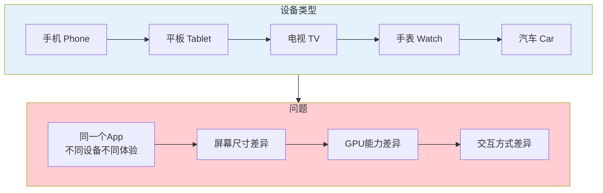
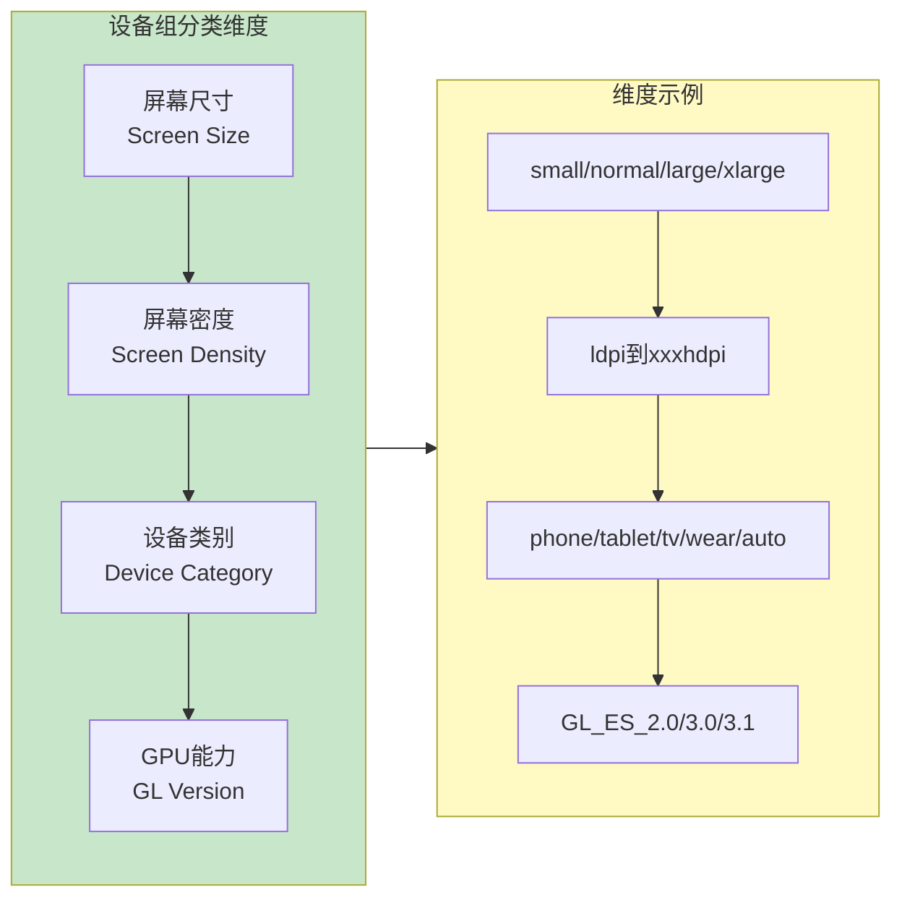
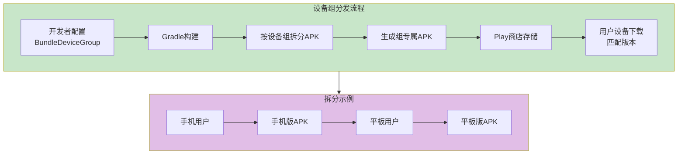
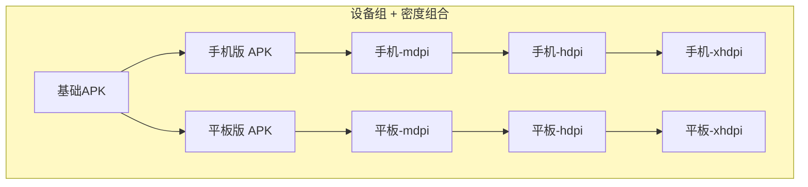
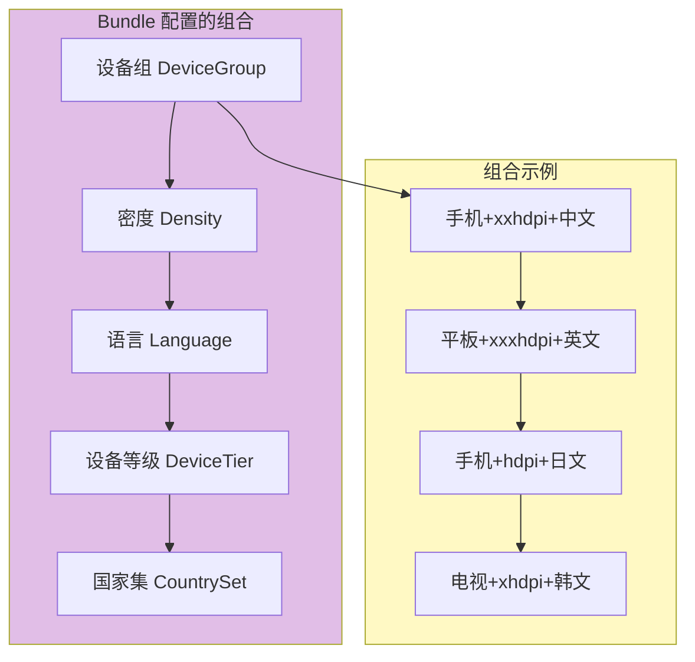

# 21.1.94 BundleDeviceGroup

夕阳把湖面染成了橘红色，几只白鹭从芦苇丛中起飞，翅膀在金光里划出优雅的弧线。

洛芙躺在草坪上，双手枕在脑袋后面，看着天空从金黄渐渐变成深蓝。黛琳还在白板前写着什么，伊莎捧着一本小本子在画速写，希尔则在一旁敲代码。

“黛琳，”洛芙翻了个身，“我们今天学了屏幕密度，是不是所有手机都差不多啦？”

黛琳停下笔，想了想：“不完全是。手机和平板不一样，手机和手表也不一样。你有没有想过，同一个App，在手机上和在平板上，可能需要不同的布局？”

洛芙点点头：“好像也是哦，平板屏幕大，可以显示更多东西。”

“还有呢？”希尔抬起头，“不同的设备GPU也不一样，有的能渲染高级特效，有的只能渲染基础图形。这又该怎么处理？”

伊莎放下速写本，好奇地问：“设备之间差别这么大，那我们怎么给每个设备都提供最合适的体验呢？”

“这就轮到今天的主角登场了，”黛琳笑着说，“——BundleDeviceGroup，设备组配置。”

---

## 什么是设备组

黛琳在白板上画了一个简单的示意图：



“设备组就是根据设备的特性，把设备分成不同的组，”黛琳解释道，“每个组可以收到不同的资源配置。”

洛芙歪着头：“怎么分组呢？”

“Android设备可以按几个维度分组，”希尔抢着说，“屏幕尺寸是一个维度，GPU/OpenGL版本是另一个维度，还有设备类别——手机、平板、电视、汽车信息系统等等。”

---

## 设备组的分类维度

黛琳详细讲解设备组的分类维度：



“第一个维度是屏幕尺寸，”黛琳说，“Android把屏幕尺寸分为small、normal、large、xlarge四个等级。第二个维度是屏幕密度，我们昨天学过了。第三个维度是设备类别——手机、平板、电视、手表、汽车。第四个维度是GPU版本，不同的GPU支持的OpenGL版本不一样。”

伊莎举手提问：“那这些维度怎么用到App Bundle里呢？”

“问得好，”黛琳笑着说，“BundleDeviceGroup就是用来配置这些维度的。”

---

## BundleDeviceGroup 的基本用法

希尔打开笔记本电脑，展示具体的配置代码：

```kotlin
// app/build.gradle.kts

android {
    
    bundle {
        
        // 设备组配置
        // 按不同维度对设备进行分组
        
        deviceGroup {
            
            // 屏幕尺寸分组
            // 将设备按屏幕尺寸分为不同组
            // 可选值: "small", "normal", "large", "xlarge"
            screenSize {
                // 包含哪些尺寸组
                include.add("normal")
                include.add("large")
                include.add("xlarge")
                // 排除小屏幕设备（如旧款小型手机）
                // exclude.add("small")
            }
            
            // 设备类别分组
            // 将设备按类型分为不同组
            // 可选值: "phone", "tablet", "tv", "watch", "auto"
            deviceCategory {
                include.add("phone")
                include.add("tablet")
                // 不包含电视和手表
                // include.add("tv")
                // include.add("watch")
            }
            
            // GL版本分组（用于游戏或图形密集型应用）
            // 按OpenGL ES版本分组
            glVersion {
                // 包含哪些GL版本
                // 可选值: "GL_ES_2_0", "GL_ES_3_0", "GL_ES_3_1"
                include.add("GL_ES_2_0")
                include.add("GL_ES_3_0")
                include.add("GL_ES_3_1")
            }
            
        }
        
    }
}
```

“这里有个关键点，”希尔补充道，“设备组配置是用于生成不同的APK变体的。每个设备组会收到匹配其特性的APK。”

洛芙看着代码：“所以手机用户下载手机版，平板用户下载平板版？”

“对的，”黛琳说，“这就是设备组分发。”

---

## 设备组的工作原理

黛琳画出了设备组的工作流程：



“设备组配置的核心思想是这样的，”黛琳解释道，“与其让所有设备都下载一个包含所有资源的大APK，不如在服务器端就把APK按设备组拆分成多个小APK。用户下载的时候，Play商店会自动检测用户设备的特性，下载最匹配的那个版本。”

洛芙眼睛一亮：“所以手表用户不用下载手机的大应用了？！”

“对！”希尔笑着说，“这就是按设备类型分发的好处。”

---

## 常见的设备组配置场景

黛琳列举了几个典型的配置场景：

```kotlin
// app/build.gradle.kts

android {
    bundle {
        
        // 场景1：区分手机和平板
        // 平板需要更大的布局资源
        deviceGroup {
            deviceCategory {
                include.add("phone")
                include.add("tablet")
            }
        }
        
        // 场景2：排除电视和手表
        // 它们的交互方式和手机完全不同
        deviceGroup {
            deviceCategory {
                // 只包含手机和平板
                include.add("phone")
                include.add("tablet")
                // 明确排除电视和手表
                // 如果不配置，默认会包含所有类型
            }
        }
        
        // 场景3：屏幕尺寸分组
        // 小屏幕设备可能需要特殊优化
        deviceGroup {
            screenSize {
                // 包含所有常见尺寸
                include.add("small")    // 小屏手机
                include.add("normal")   // 普通手机
                include.add("large")    // 大屏手机/小平板
                include.add("xlarge")   // 大平板
            }
        }
        
        // 场景4：GPU版本分组（游戏专用）
        // 不同GPU能力的设备需要不同的图形资源
        deviceGroup {
            glVersion {
                // 支持不同版本的GPU
                include.add("GL_ES_2_0")  // 基础图形
                include.add("GL_ES_3_0")  // 中级图形
                include.add("GL_ES_3_1")  // 高级图形
            }
        }
        
    }
}
```

洛芙好奇地问：“那我不配置会怎么样？”

“不配置的话，”黛琳说，“默认行为是生成一个包含所有资源配置的通用APK。”

---

## 设备组与屏幕密度的组合

希尔讲解设备组如何与屏幕密度配置配合使用：

“实际项目中，我们经常把设备组和屏幕密度结合起来用，”她说。

```kotlin
// app/build.gradle.kts

android {
    
    defaultConfig {
        applicationId = "com.example.camping"
    }
    
    bundle {
        
        // 设备组配置：区分手机和平板
        deviceGroup {
            deviceCategory {
                include.add("phone")
                include.add("tablet")
            }
        }
        
        // 屏幕密度配置：按屏幕密度分发
        density {
            enable = true
            include.addAll(listOf(
                "mdpi", "hdpi", "xhdpi", "xxhdpi", "xxxhdpi"
            ))
        }
        
    }
}
```

伊莎好奇地问：“这样配置的话，手机和平板会收到不同的APK吗？”

“会的，”黛琳解释说，“实际上会生成手机版APK和平板版APK，每个版本又可能按密度再拆分。”



洛芙看着图惊呼：“原来会生成这么多APK！那每个APK都只包含需要的资源？”

“对，”希尔说，“这样用户下载的APK体积最小，但功能最匹配他们的设备。”

---

## 反模式与最佳实践

黛琳特意强调了常见的错误做法：

```kotlin
// ❌ 反模式1：包含不存在的设备类型
deviceGroup {
    deviceCategory {
        // 错误：包含不支持的类型
        include.add("unknown_device")
    }
}

// ✅ 正确做法：只包含有效的设备类型
deviceGroup {
    deviceCategory {
        include.add("phone")
        include.add("tablet")
    }
}

// ❌ 反模式2：screenSize 和 deviceCategory 混淆
deviceGroup {
    // 错误：screenSize 应该用尺寸值，不是设备类型
    screenSize {
        include.add("phone")  // 这是错误的！
    }
    // 错误：deviceCategory 应该用设备类型，不是尺寸
    deviceCategory {
        include.add("normal")  // 这也是错误的！
    }
}

// ✅ 正确做法：分清维度
deviceGroup {
    // screenSize 用尺寸值
    screenSize {
        include.add("small")
        include.add("normal")
        include.add("large")
        include.add("xlarge")
    }
    // deviceCategory 用设备类型
    deviceCategory {
        include.add("phone")
        include.add("tablet")
    }
}

// ❌ 反模式3：GL版本写错
deviceGroup {
    glVersion {
        // 错误：OpenGL版本格式不正确
        include.add("OpenGL 3.0")
        include.add("GL3.0")
    }
}

// ✅ 正确做法：使用正确的格式
deviceGroup {
    glVersion {
        include.add("GL_ES_2_0")
        include.add("GL_ES_3_0")
        include.add("GL_ES_3_1")
    }
}
```

“记住一个原则，”黛琳总结道，“每个维度有自己特定的值域，不要把不同维度的值混用。”

---

## 构建输出示例

希尔运行了一次构建，展示了终端输出：

```
> ./gradlew bundleDebug

> Task :app:generateDebugBundleConfig
Generating bundle configuration...
✓ Device group configuration:
  - deviceCategory: phone, tablet
  - screenSize: normal, large, xlarge
  - glVersion: GL_ES_2_0, GL_ES_3_0, GL_ES_3_1

> Task :app:packageDebugBundle
Building debug bundle...
✓ Bundle created: app/build/outputs/bundle/debug/app-debug.aab
✓ Device group splits generated:
  - app-phone.apk: 15.2 MB
  - app-tablet.apk: 18.5 MB
  - app-phone-screen-xl.apk: 14.8 MB
  - app-tablet-screen-xl.apk: 17.9 MB
  - app-phone-gl3.apk: 16.1 MB

✓ Each APK contains only required resources for its device group
✓ Users will download the appropriate APK based on their device

BUILD SUCCESSFUL in 42s
```

洛芙看着输出惊呼：“原来真的会生成手机版和平板版！而且还会按屏幕尺寸和GPU版本再拆分！”

“对，”希尔说，“这就是设备组分发带来的精细控制。”

---

## 与其他Bundle配置的关系

伊莎问道：“我们之前学的屏幕密度，和这个设备组配置，会冲突吗？”

“不会冲突，”黛琳说，“它们可以组合使用，形成更精细的分发策略。”



“国家集、密度、设备组、设备等级、语言，”黛琳数着手指头说，“这些配置可以任意组合。Play商店会根据用户的设备情况，自动选择最合适的APK。”

---

## 实际业务场景示例

希尔展示了一个更完整的业务场景：

“假设你开发了一个视频播放App，”她说，“可以这样配置：”

```kotlin
// app/build.gradle.kts

android {
    
    defaultConfig {
        applicationId = "com.example.videoplayer"
    }
    
    bundle {
        
        // 设备组配置：区分不同类型的设备
        deviceGroup {
            // 区分手机和平板
            deviceCategory {
                include.add("phone")
                include.add("tablet")
            }
            // 区分屏幕尺寸
            screenSize {
                include.add("normal")
                include.add("large")
                include.add("xlarge")
            }
            // GPU版本用于视频解码能力
            glVersion {
                include.add("GL_ES_2_0")
                include.add("GL_ES_3_0")
                include.add("GL_ES_3_1")
            }
        }
        
        // 密度配置
        density {
            enable = true
            include.addAll(listOf(
                "mdpi", "hdpi", "xhdpi", "xxhdpi", "xxxhdpi"
            ))
        }
        
    }
}
```

洛芙明白了：“所以不同设备会收到不同的APK——手机收到手机版，平板收到平板版，而且每个版本只包含它需要的资源！”

“对！”希尔说，“这就是按设备分发的强大之处。”

---

## 设备组与动态功能模块的配合

黛琳补充了一个高级用法：

“设备组还可以和动态功能模块配合使用，”她说，“比如只有高端设备才下载高级特效模块。”

```kotlin
// dynamicFeatures/advancedEffects/build.gradle.kts

android {
    bundle {
        // 只有特定设备组才能下载这个模块
        deviceGroup {
            // 只给平板和高配手机
            deviceCategory {
                include.add("tablet")
            }
            // 只要大屏幕
            screenSize {
                include.add("large")
                include.add("xlarge")
            }
            // 只要高端GPU
            glVersion {
                include.add("GL_ES_3_0")
                include.add("GL_ES_3_1")
            }
        }
    }
}

dependencies {
    // 高级视频特效
    implementation project(':effects-advanced')
}
```

“这样只有符合条件的设备才会收到高级特效模块，”黛琳解释说，“不符合条件的设备不会下载这个模块，节省了空间和流量。”

---

## 章节小结

黛琳整理着白板上的笔记：“今天我们学习了BundleDeviceGroup——设备组配置。它能帮助我们：”

“**按设备类型分发资源**——让手机、平板、电视等不同设备获得最合适的资源配置；**节省下载体积**——用户只下载需要的资源；**优化用户体验**——每个设备都获得最佳体验；**与其他配置组合**——结合密度、语言、设备等级等实现更精细的分发控制。”

伊莎补充道：“就像露营时，不同大小的帐篷适合不同人数——小帐篷给一个人，大帐篷给一家人！”

“对，”黛琳微笑着说，“设备组配置就是帮你把最合适的'帐篷'分给每个用户的工具。”

星星开始在天空中闪烁，湖面上倒映着月光。远处的草丛里传来阵阵蛙鸣，像是夏夜的交响乐。

---

> BundleDeviceGroup是Android Gradle DSL中用于配置App Bundle按设备特性分组的接口。设备组通过四个维度进行分类：屏幕尺寸（small/normal/large/xlarge）、设备类别（phone/tablet/tv/watch/auto）、屏幕密度（ldpi到xxxhdpi）、GPU的OpenGL ES版本（GL_ES_2_0/3_0/3_1）。通过deviceGroup.screenSize配置屏幕尺寸分组，通过deviceGroup.deviceCategory配置设备类别分组，通过deviceGroup.glVersion配置GPU版本分组。启用后，Gradle会为每个设备组生成独立的APK，用户在Play商店会下载与设备特性匹配的最佳版本。常见最佳实践包括：分清不同维度的值域、结合屏幕密度配置实现更精细控制、结合动态功能模块实现条件分发、设备组配置不会影响App的核心功能分发。

---

> 学习建议：BundleDeviceGroup是实现精细化App分发的关键配置。建议根据目标用户群体的设备分布来设计设备组策略，如果主要面向手机用户，可以只包含phone类别；如果有平板专属功能，需要包含tablet。GPU版本分组主要用于游戏或图形密集型应用，普通App可以不配置。配置完成后通过Build Analyzer检查拆分是否正确生效。注意设备组配置应该与App的功能设计相匹配，确保每个设备组都能获得可用的App体验。

## 洛芙的小小日记本

今天学到了设备组配置！原来手机、平板、电视、手表都可以收到不同版本的App，而且还可以按屏幕尺寸和GPU版本再细分～黛琳说这就叫"让每个设备都拿到最适合自己的那个包"，我觉得好像给不同人发不同的工具一样，好智能呀！夏天的夜晚好舒服，星星好多～

---

## 今日关键词

**BundleDeviceGroup**：Android Gradle DSL中用于配置App Bundle按设备特性分组的接口。

**设备组**：Device Group，根据设备特性（屏幕尺寸、设备类别、GPU版本等）对设备进行分组的机制。

**屏幕尺寸**：Screen Size，Android将设备屏幕分为small、normal、large、xlarge四个等级。

**设备类别**：Device Category，设备的类型，如phone（手机）、tablet（平板）、tv（电视）、watch（手表）、auto（汽车）。

**GPU版本**：GPU Version，设备支持的OpenGL ES版本，如GL_ES_2_0、GL_ES_3_0、GL_ES_3_1。

**设备拆分**：Device Split，按设备特性生成多个独立APK的机制。

**按需分发**：On-demand Delivery，根据用户设备条件分发合适资源的功能。

**App Bundle**：Google推荐的Android应用发布格式，支持模块化动态分发。

**Google Play**：Google官方的Android应用商店。

**屏幕密度**：Screen Density，屏幕上每英寸包含的像素数量（dpi）。

**动态功能模块**：Dynamic Features，App Bundle中可按需下载的功能模块。

**Gradle**：Android项目的构建系统。

**APK**：Android Package，Android应用的安装包文件。

**设备等级**：Device Tier，根据设备硬件能力进行分级的配置。
