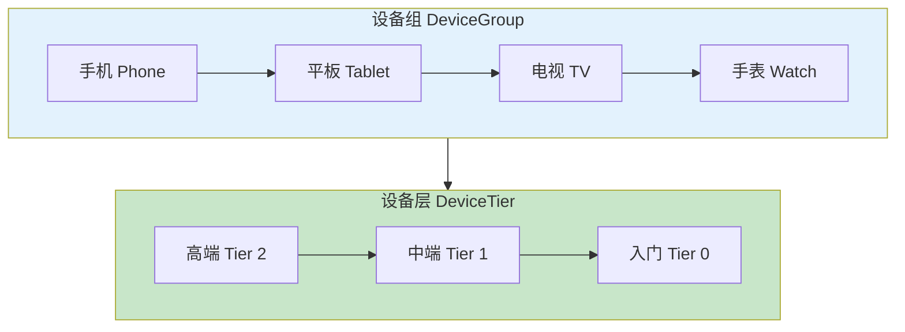
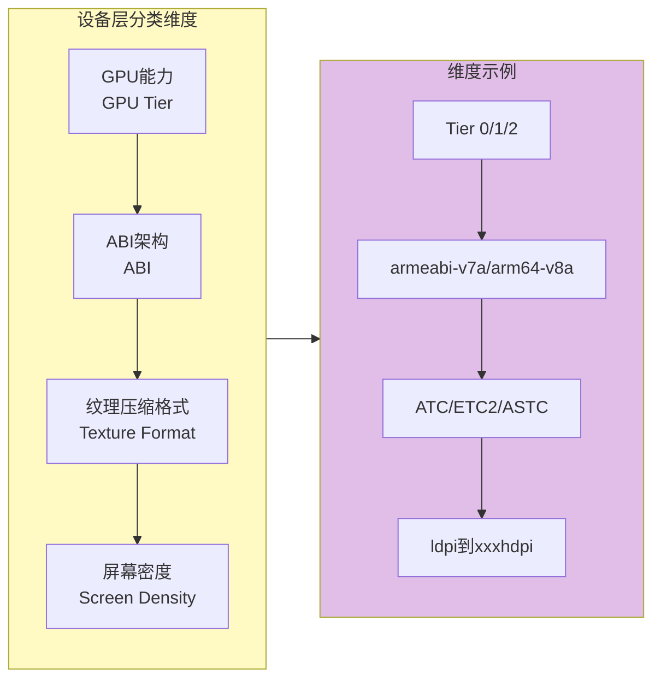
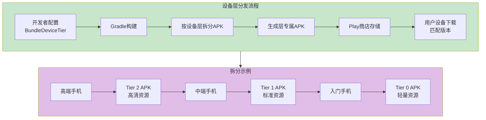
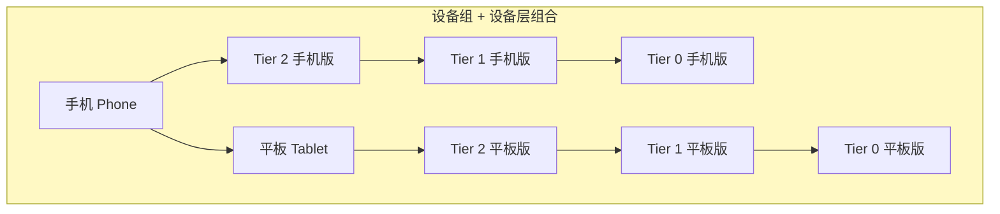
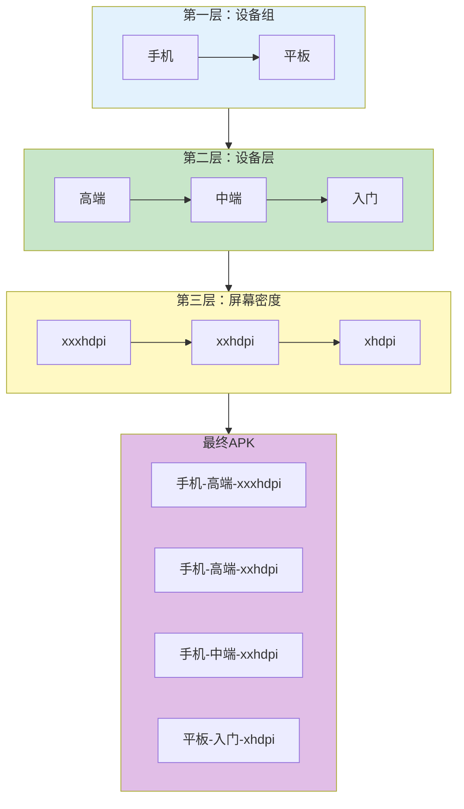

# 21.1.95 BundleDeviceTier

晚风轻轻吹过湖面，把荷叶吹得轻轻摇晃，像是在水面上画着绿色的圆圈。

洛芙枕着黛琳的大腿，躺在草地上看着天空。伊莎在一边用狗尾草编着一个小兔子，希尔则坐在折叠桌前继续摆弄她的笔记本。

“黛琳，”洛芙突然开口，“我刚才在想一个问题。”

“什么问题？”黛琳低下头，阳光穿过树叶的缝隙，在洛芙脸上投下点点光斑。

“就是我们今天学的设备组吧——手机收到手机版，平板收到平板版，”洛芙翻了个身，撑着下巴，“可是手机上也有很大的差别呀。你看，我奶奶用的那个手机，运行内存只有2GB，屏幕分辨率也低。但是我新买的那个手机，8GB内存，高刷新率屏幕，GPU也很强。这两个都是手机，但差别可大了去了。”

希尔抬起头：“对啊，这就是设备层要解决的问题。”

“设备层？”洛芙眨眨眼。

黛琳微笑着坐起来：“看来你已经抓到今天的重点了。这就是BundleDeviceTier——设备层配置。”

---

## 什么是设备层

黛琳又在白板上画了起来：



“设备组是按设备的类型来分，”黛琳解释道，“手机、平板、电视、手表，这是第一层分类。”

她指着下半部分：“设备层呢，是在同一个设备组内部，再按硬件能力细分。比如所有的手机，可以分成高端、中端、入门三个层级。”

洛芙好奇地问：“那怎么判断一个手机是高端还是入门呢？”

“标准有很多，”希尔抢着说，“GPU能力、运行内存、ABI架构、纹理压缩格式……这些都是判断依据。”

---

## 设备层的分类维度

黛琳详细列出设备层的分类维度：



“第一个维度是GPU能力，”黛琳说，“Android用Tier 0、Tier 1、Tier 2来表示GPU的三个等级。Tier 2是高端GPU，Tier 1是中端，Tier 0是入门级。”

伊莎举手提问：“那怎么知道自己的手机是哪个Tier呢？”

“Android系统在安装App的时候会自动检测，”黛琳说，“Play商店会根据检测结果分配对应的APK。”

“第二个维度是ABI架构，”希尔补充道，“armeabi-v7a是32位，arm64-v8a是64位。现在新手机基本上都是64位了，但还有一些老手机是32位。”

“第三个维度是纹理压缩格式，”黛琳继续说，“游戏开发中常用到这个——ATC、ETC2、ASTC这些格式，不同的GPU支持不同的格式。”

“第四个维度是屏幕密度，”洛芙说，“这个我们昨天学过了！”

“对，”黛琳笑着说，“所以设备层和设备组、密度配置都是配合在一起用的。”

---

## BundleDeviceTier 的基本用法

希尔打开笔记本电脑，展示具体的配置代码：

```kotlin
// app/build.gradle.kts

android {
    
    bundle {
        
        // 设备层配置
        // 按硬件能力对设备进行分层
        
        deviceTier {
            
            // GPU能力分层
            // Tier 2 = 高端GPU（如旗舰手机的Adreno 600系列、Mali G76+）
            // Tier 1 = 中端GPU（如中端手机的Adreno 600系列、Mali G72）
            // Tier 0 = 入门级GPU（如入门手机的Adreno 500系列、Mali T系列）
            gpuTier {
                // 包含哪些层级
                include.add(2)  // 高端
                include.add(1)  // 中端
                include.add(0)  // 入门
                // 排除某些层级
                // exclude.add(0)
            }
            
            // ABI架构分层
            // 用于区分32位和64位设备
            abi {
                include.add("arm64-v8a")  // 64位ARM
                include.add("armeabi-v7a") // 32位ARM
                // 不包含x86架构（通常用于模拟器）
                // include.add("x86")
                // include.add("x86_64")
            }
            
            // 纹理压缩格式分层
            // 主要用于游戏
            textureFormat {
                // 包含哪些格式
                include.add("ATC")        // Adreno Texture Compression
                include.add("ETC2")       // Ericsson Texture Compression 2
                include.add("ASTC")        // Adaptive Scalable Texture Compression
            }
            
        }
        
    }
}
```

“这里有个关键点，”希尔强调道，“设备层配置是可选的。如果你只配置了设备组，没配置设备层，那所有同类设备都会收到同一个APK。”

洛芙看着代码：“所以高端手机和入门手机，如果我配置了设备层，就会收到不同的APK？”

“对的，”黛琳说，“高端手机会收到包含高清纹理、复杂特效的版本，入门手机会收到优化过的轻量版本。”

---

## 设备层的工作原理

黛琳画出了设备层的工作流程：



“设备层配置的核心思想是这样的，”黛琳解释道，“同一个App，在高端设备上可以展现更多的特效和功能，在入门设备上则提供基础功能，保证流畅运行。”

洛芙眼睛一亮：“所以入门手机也不会卡顿了？！”

“对！”希尔笑着说，“这就是按设备能力分发的好处——让每个设备都能流畅运行。”

---

## 常见的设备层配置场景

黛琳列举了几个典型的配置场景：

```kotlin
// app/build.gradle.kts

android {
    bundle {
        
        // 场景1：只给高端设备高级特效
        // 游戏常用这个策略
        deviceTier {
            gpuTier {
                // 只包含高端GPU
                include.add(2)
                // exclude.add(1)
                // exclude.add(0)
            }
        }
        
        // 场景2：区分32位和64位
        // 64位设备性能更好，可以加载更多资源
        deviceTier {
            abi {
                // 64位设备
                include.add("arm64-v8a")
                // 32位设备
                include.add("armeabi-v7a")
            }
        }
        
        // 场景3：游戏纹理压缩格式
        // 不同GPU支持不同的压缩格式
        deviceTier {
            textureFormat {
                // 高端设备支持ASTC（更高压缩率）
                include.add("ASTC")
                // 中端设备支持ETC2（兼容性更好）
                include.add("ETC2")
                // 老设备可能只支持ETC
                // include.add("ETC")
            }
        }
        
        // 场景4：组合配置
        // 多个维度组合
        deviceTier {
            // GPU能力
            gpuTier {
                include.add(2)
                include.add(1)
                include.add(0)
            }
            // ABI架构
            abi {
                include.add("arm64-v8a")
                include.add("armeabi-v7a")
            }
        }
        
    }
}
```

洛芙好奇地问：“那我不配置会怎么样？”

“不配置的话，”黛琳说，“默认行为是生成一个包含所有层级资源的通用APK，所有设备都收到同样的版本。”

---

## 设备层与设备组的组合

希尔讲解设备层如何与设备组配置配合使用：

“实际项目中，我们经常把设备组和设备层结合起来用，”她说。

```kotlin
// app/build.gradle.kts

android {
    
    defaultConfig {
        applicationId = "com.example.camping"
    }
    
    bundle {
        
        // 设备组配置：区分手机和平板
        deviceGroup {
            deviceCategory {
                include.add("phone")
                include.add("tablet")
            }
        }
        
        // 设备层配置：区分高端、中端、入门
        deviceTier {
            gpuTier {
                include.add(2)  // 高端
                include.add(1)  // 中端
                include.add(0)  // 入门
            }
            abi {
                include.add("arm64-v8a")
                include.add("armeabi-v7a")
            }
        }
        
    }
}
```

伊莎好奇地问：“这样配置的话，会生成多少个APK？”

“很多！”希尔笑着说，“手机高端、手机中端、手机入门、平板高端、平板中端、平板入门……每个组合都可能生成一个APK。”



洛芙看着图惊呼：“原来会生成这么多APK！那每个APK都只包含需要的资源？”

“对，”希尔说，“这样用户下载的APK体积最小，但功能最匹配他们的设备。”

---

## 反模式与最佳实践

黛琳特意强调了常见的错误做法：

```kotlin
// ❌ 反模式1：GPU Tier 值错误
deviceTier {
    gpuTier {
        // 错误：Tier 值应该是数字
        include.add("high")     // 错误！
        include.add("medium")   // 错误！
        include.add("low")      // 错误！
    }
}

// ✅ 正确做法：使用数字
deviceTier {
    gpuTier {
        include.add(2)  // 高端
        include.add(1)  // 中端
        include.add(0)  // 入门
    }
}

// ❌ 反模式2：ABI名称错误
deviceTier {
    abi {
        // 错误：ABI名称不正确
        include.add("arm64")     // 错误！
        include.add("arm")       // 错误！
        include.add("64bit")     // 错误！
    }
}

// ✅ 正确做法：使用正确的ABI名称
deviceTier {
    abi {
        include.add("arm64-v8a")   // 64位ARM
        include.add("armeabi-v7a") // 32位ARM
        include.add("x86_64")     // 64位x86（模拟器）
        include.add("x86")        // 32位x86（模拟器）
    }
}

// ❌ 反模式3：纹理压缩格式写错
deviceTier {
    textureFormat {
        // 错误：格式名称不正确
        include.add("PNG")       // 错误！PNG不是GPU压缩格式
        include.add("JPG")       // 错误！JPG不是GPU压缩格式
        include.add("DXT")       // 错误！这是桌面GPU的格式
    }
}

// ✅ 正确做法：使用正确的格式
deviceTier {
    textureFormat {
        include.add("ATC")        // Adreno Texture Compression
        include.add("ETC2")       // Ericsson Texture Compression 2
        include.add("ASTC")       // Adaptive Scalable Texture Compression
    }
}

// ❌ 反模式4：设备层和设备组混淆
// 设备组是按类型分（手机/平板），设备层是按能力分（高端/中端/入门）
// 错误地在一个配置里混用
bundle {
    // 错误：deviceGroup里放的是设备类型
    deviceGroup {
        deviceCategory {
            include.add("phone")
            include.add("tablet")
        }
    }
    
    // 错误：deviceTier里放的是能力等级
    // 但如果把deviceCategory放在deviceTier里，就是错的
    deviceTier {
        gpuTier {
            include.add(2)
        }
        // 错误！不能在这里放设备类型
        // deviceCategory { include.add("phone") }  // 这是错的！
    }
}

// ✅ 正确做法：分清设备组和设备层
bundle {
    // 设备组：按类型分
    deviceGroup {
        deviceCategory {
            include.add("phone")
            include.add("tablet")
        }
    }
    
    // 设备层：按能力分
    deviceTier {
        gpuTier {
            include.add(2)
            include.add(1)
            include.add(0)
        }
    }
}
```

“记住一个原则，”黛琳总结道，“设备组管的是'这是什么类型的设备'，设备层管的是'这个设备有多强'。两者配合使用，但不要混为一谈。”

---

## 构建输出示例

希尔运行了一次构建，展示了终端输出：

```
> ./gradlew bundleDebug

> Task :app:generateDebugBundleConfig
Generating bundle configuration...
✓ Device tier configuration:
  - gpuTier: 0, 1, 2
  - abi: arm64-v8a, armeabi-v7a
  - textureFormat: ATC, ETC2, ASTC

> Task :app:packageDebugBundle
Building debug bundle...
✓ Bundle created: app/build/outputs/bundle/debug/app-debug.aab
✓ Device tier splits generated:
  - app-arm64-v8a-tier2.apk: 18.5 MB  (64位 + 高端GPU)
  - app-arm64-v8a-tier1.apk: 16.2 MB  (64位 + 中端GPU)
  - app-arm64-v8a-tier0.apk: 14.8 MB  (64位 + 入门GPU)
  - app-armeabi-v7a-tier2.apk: 17.9 MB (32位 + 高端GPU)
  - app-armeabi-v7a-tier1.apk: 15.6 MB (32位 + 中端GPU)
  - app-armeabi-v7a-tier0.apk: 14.2 MB (32位 + 入门GPU)

✓ Each APK contains only required resources for its tier
✓ Users will download the appropriate APK based on their device capabilities

BUILD SUCCESSFUL in 38s
```

洛芙看着输出惊呼：“原来真的会按GPU和ABI再拆分！而且高端GPU的APK更大，因为包含了更多高级资源！”

“对，”希尔说，“这就是按设备能力分发带来的精细控制。”

---

## 实际业务场景示例

希尔展示了一个更完整的业务场景：

“假设你开发了一个3D游戏App，”她说，“可以这样配置：”

```kotlin
// app/build.gradle.kts

android {
    
    defaultConfig {
        applicationId = "com.example.3dgame"
    }
    
    bundle {
        
        // 设备组配置：区分不同类型的设备
        deviceGroup {
            deviceCategory {
                include.add("phone")
                include.add("tablet")
            }
        }
        
        // 设备层配置：按GPU能力和ABI分层
        deviceTier {
            // GPU能力分层
            gpuTier {
                // 高端：最高画质
                include.add(2)
                // 中端：标准画质
                include.add(1)
                // 入门：简化画质
                include.add(0)
            }
            
            // ABI分层
            abi {
                // 64位设备性能更好
                include.add("arm64-v8a")
                // 32位设备内存可能较小
                include.add("armeabi-v7a")
            }
            
            // 纹理压缩格式（游戏专用）
            textureFormat {
                // ASTC压缩率最高，但需要较新的GPU
                include.add("ASTC")
                // ETC2兼容性最好
                include.add("ETC2")
            }
        }
        
    }
}
```

洛芙明白了：“所以不同配置的手机会收到不同的游戏版本——高端手机收到高清版，入门手机收到轻量版！而且32位和64位也会分开！”

“对！”希尔说，“这就是按设备能力分发的强大之处。”

---

## 设备层与动态功能模块的配合

黛琳补充了一个高级用法：

“设备层还可以和动态功能模块配合使用，”她说，“比如只有高端设备才下载高级特效模块。”

```kotlin
// dynamicFeatures/ultraGraphics/build.gradle.kts

android {
    bundle {
        // 只有特定设备层才能下载这个模块
        deviceTier {
            // 只要高端GPU
            gpuTier {
                include.add(2)
            }
            // 只要64位架构（内存更大）
            abi {
                include.add("arm64-v8a")
            }
            // 只要支持ASTC格式
            textureFormat {
                include.add("ASTC")
            }
        }
    }
}

dependencies {
    // Ultra级图形特效
    implementation project(':graphics-ultra')
}

// dynamicFeatures/standardGraphics/build.gradle.kts

android {
    bundle {
        // 中端和入门设备使用标准图形
        deviceTier {
            gpuTier {
                include.add(1)
                include.add(0)
            }
        }
    }
}
```

“这样只有符合条件的设备才会收到高级特效模块，”黛琳解释说，“不符合条件的设备不会下载这个模块，既节省了空间，又保证了流畅运行。”

---

## 设备组、设备层、密度的三层配合

伊莎好奇地问：“我们学了设备组、设备层，还有之前的屏幕密度，它们三个怎么配合使用？”

黛琳画了一个综合的示意图：



“、设备组、设备层、密度，这三个配置是层层递进的关系，”黛琳解释道，“第一层按设备类型分组，第二层在组内按能力分层，第三层按屏幕密度细分。”

“Play商店会根据用户的设备情况，”希尔补充说，“从这三个维度找到最匹配的那个APK。”

洛芙惊叹道：“原来分层这么细致！那我奶奶的老手机只会下载一个很小很合适的包，而我的新手机会下载一个功能最全的包！”

“对，”黛琳微笑着说，“这就是现代Android分发的智慧。”

---

## 章节小结

黛琳整理着白板上的笔记：“今天我们学习了BundleDeviceTier——设备层配置。它能帮助我们：”

“**按硬件能力分发资源**——让高端、中端、入门设备获得最合适的资源配置；**节省下载体积**——用户只下载需要的资源；**优化用户体验**——每个设备都能流畅运行；**与设备组配合**——形成三层分发体系，实现最精细的控制。”

伊莎补充道：“就像露营时，不同等级的帐篷适合不同需求——简易帐篷给轻装旅行者，豪华帐篷给资深露营者！”

“对，”黛琳微笑着说，“设备层配置就是帮你把最合适的'装备'分给每个用户的工具。”

晚霞染红了天空，湖面上倒映着紫红色的云朵。远处传来夜鸟的叫声，提醒大家该准备晚餐了。

---

> BundleDeviceTier是Android Gradle DSL中用于配置App Bundle按设备硬件能力分层的接口。设备层通过三个维度进行分类：GPU能力（Tier 0/1/2）、ABI架构（arm64-v8a/armeabi-v7a/x86等）、纹理压缩格式（ATC/ETC2/ASTC）。通过deviceTier.gpuTier配置GPU分层，通过deviceTier.abi配置ABI分层，通过deviceTier.textureFormat配置纹理压缩格式。启用后，Gradle会为每个设备层生成独立的APK，用户在Play商店会下载与设备硬件能力匹配的最佳版本。常见最佳实践包括：GPU分层主要用于游戏或图形密集型应用、ABI分层用于区分32位和64位设备、纹理压缩格式用于游戏资源优化、设备层与设备组配合使用实现三层分发、结合动态功能模块实现条件下载。配置完成后通过Build Analyzer检查拆分是否正确生效。

---

> 学习建议：BundleDeviceTier是实现精细化按能力分发App的关键配置。建议根据目标用户群体的设备分布来设计设备层策略，高端资源（高清纹理、高级特效）只分配给高端设备，中端和入门设备使用优化过的资源。GPU Tier的检测由系统在安装时自动完成，开发者无需手动指定。纹理压缩格式主要用于游戏开发，普通App可以不配置。配置完成后通过Build Analyzer检查拆分是否正确生效。注意设备层配置应该与App的功能设计相匹配，确保每个设备层都能获得可用的App体验。

## 洛芙的小小日记本

今天学到了设备层配置！原来手机也分高端、中端、入门的——黛琳说这就跟露营装备一样，有人背简易帐篷，有人背专业帐篷，都要适合自己才行呀～而且32位64位也会影响APK的大小，真是太有意思了！夏天的晚风好舒服，湖畔的青蛙又在唱歌了～

---

## 今日关键词

**BundleDeviceTier**：Android Gradle DSL中用于配置App Bundle按设备硬件能力分层的接口。

**设备层**：Device Tier，根据设备硬件能力（GPU、ABI、纹理压缩格式等）对设备进行分层的机制。

**GPU Tier**：GPU能力等级，Android用0、1、2三个等级表示GPU的能力，Tier 2为高端，Tier 1为中端，Tier 0为入门级。

**ABI**：Application Binary Interface，应用的二进制接口，如arm64-v8a（64位ARM）、armeabi-v7a（32位ARM）。

**纹理压缩格式**：Texture Compression Format，GPU支持的纹理压缩格式，如ATC、ETC2、ASTC。

**设备拆分**：Device Split，按设备特性生成多个独立APK的机制。

**按需分发**：On-demand Delivery，根据用户设备条件分发合适资源的功能。

**App Bundle**：Google推荐的Android应用发布格式，支持模块化动态分发。

**Google Play**：Google官方的Android应用商店。

**设备组**：Device Group，根据设备类型（手机、平板、电视、手表等）对设备进行分组的机制。

**屏幕密度**：Screen Density，屏幕上每英寸包含的像素数量（dpi）。

**动态功能模块**：Dynamic Features，App Bundle中可按需下载的功能模块。

**Gradle**：Android项目的构建系统。

**APK**：Android Package，Android应用的安装包文件。

**32位/64位**：32-bit/64-bit，指处理器的寻址能力和数据处理宽度，影响设备性能和内存管理。
