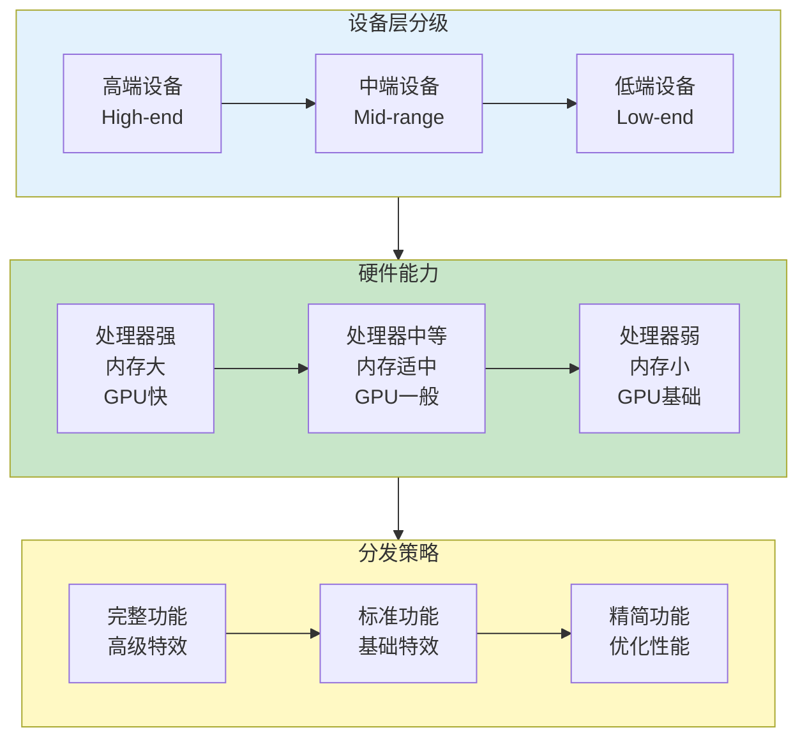
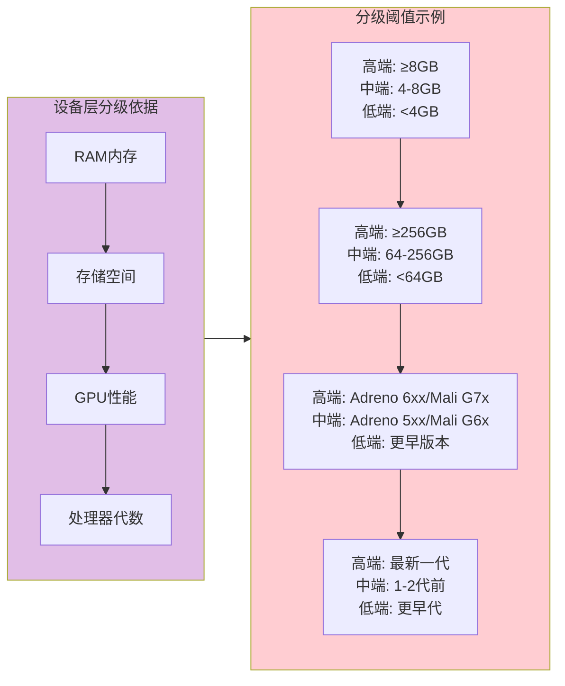
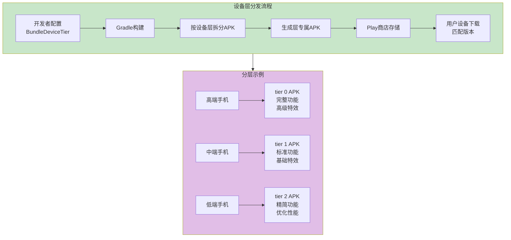
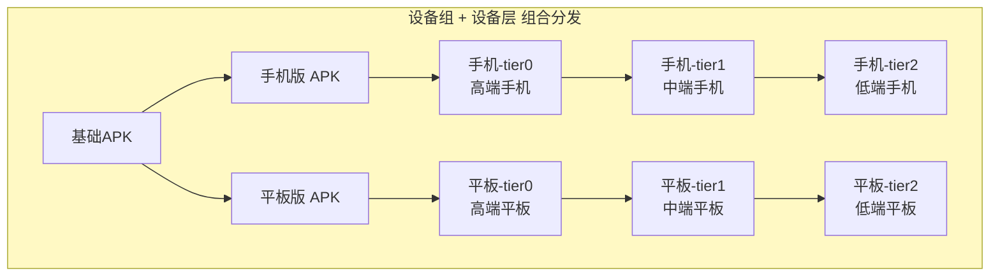

# 21.1.95 BundleDeviceTier

夜幕降临得恰到好处。

黛琳把白板架好的时候，天边最后一抹晚霞正好变成深蓝色。篝火里的木柴发出噼啪的声响，火星子一蹦一蹦地往天上飘，像是散落在夜空里的小星星。

伊莎从背包里翻出好几根棉花糖，递给每个人：“今天的露营，怎么能没有棉花糖呢？”

洛芙接过棉花糖，插在树枝上，慢慢地转动着。火光把她的脸映得红彤彤的。

“黛琳，”洛芙盯着棉花糖上渐渐焦黄的糖衣，“我们昨天学了设备组，手机和平板会收到不同的APK。那……”

“那同是手机，为什么我的手机和你的手机下载的App可能不一样？”希尔笑着接话，把笔记本放在膝盖上，“你问到点子上了！”

伊莎歪着头：“同样都是手机，性能差别也很大呀。有的手机运行流畅，有的会卡顿。这该怎么处理呢？”

“这就轮到今天的魔法道具登场了，”黛琳微笑着说，“——BundleDeviceTier，设备层配置。”

---

## 什么是设备层

黛琳用树枝在地上画了一个简单的示意图，火光把她的影子拉得很长。

“你们看，”她在地上点了几个点，“手机可以分成高端、中端、低端三个层次。高端手机处理器快、内存大、GPU强；低端手机配置一般，资源有限。”

洛芙点点头：“就像帐篷也有不同等级——有的轻便简易，有的坚固复杂。”

“对，”黛琳说，“设备层就是按设备的硬件能力，把设备分成不同的'等级'。每个等级可以收到不同的资源配置。”



希尔补充道：“设备层和设备组不一样哦。设备组是按设备类型分——手机、平板、电视；设备层是按设备性能分——高端、中端、低端。”

“原来是这样！”洛芙恍然大悟，“一个按'种类'分，一个按'能力'分！”

---

## 设备层的分级标准

黛琳详细讲解设备层的分级依据：



“设备层的分级主要看四个硬件指标，”黛琳说，“**内存容量**、**存储空间**、**GPU性能**、**处理器代数**。Google Play会根据这些指标把设备归到不同的层。”

伊莎好奇地问：“那这些分级是Google自动判断的吗？”

“对的，”希尔说，“Play商店有自己的设备分级模型。开发者只需要配置想把设备分成几层、每层想分发什么资源，不需要自己写代码去判断设备性能。”

---

## BundleDeviceTier 的基本用法

希尔打开笔记本电脑，展示具体的配置代码：

```kotlin
// app/build.gradle.kts

android {
    
    bundle {
        
        // 设备层配置
        // 按设备硬件能力进行分层
        
        deviceTier {
            
            // tierGroup: 设备层的分组配置
            // 决定生成几个版本的APK
            
            // 方案1：两级分层（高端 vs 低端）
            // 适合大多数应用
            tiers {
                // 包含高端和中端设备
                // tier 0, 1, 2 对应不同的硬件级别
                // 具体数值由Play商店的设备分级模型决定
                include.add(0)  // tier 0: 高端设备
                include.add(1)  // tier 1: 中端设备
                include.add(2)  // tier 2: 低端设备
            }
            
            // 方案2：三级分层（高端/中端/低端）
            // 适合需要精细控制的应用
            // tiers {
            //     include.add(0)  // tier 0: 高端
            //     include.add(1)  // tier 1: 中端
            //     include.add(2)  // tier 2: 低端
            // }
            
            // 方案3：只包含高端设备
            // 适合需要高级特效的游戏或应用
            // tiers {
            //     include.add(0)  // 只给高端设备
            // }
            
        }
        
    }
}
```

“这里有个关键概念，”希尔强调说，“tier的数值越小，代表设备性能越高。tier 0是最高端，tier 1次之，以此类推。”

洛芙看着代码：“所以我配置了tier 0、1、2，就会生成三个不同的APK？”

“对的，”黛琳说，“Play商店会根据用户设备的实际性能，下载最匹配的那个APK。”

---

## 设备层的工作原理

黛琳画出了设备层的分发流程：



“设备层配置的核心思想是这样的，”黛琳解释道，“高端设备可以享受完整的功能和高级特效，中端设备使用标准配置，低端设备则使用经过优化的精简版本。这样每个设备都能流畅运行。”

洛芙眼睛一亮：“所以低端手机不会因为加载太多高级资源而卡顿了？！”

“对！”希尔笑着说，“这就是按设备能力分发的好处——让合适的资源匹配合适的设备。”

---

## 设备层与设备组的组合

伊莎问道：“设备层和设备组可以一起用吗？”

“不仅可以，而且经常一起用！”黛琳兴奋地说，“两者组合可以实现超级精细的分发控制。”

```kotlin
// app/build.gradle.kts

android {
    
    bundle {
        
        // 设备组配置：区分手机和平板
        deviceGroup {
            deviceCategory {
                include.add("phone")
                include.add("tablet")
            }
        }
        
        // 设备层配置：区分高端、中端、低端
        deviceTier {
            // 包含所有层级
            tiers {
                include.add(0)  // tier 0: 高端
                include.add(1)  // tier 1: 中端
                include.add(2)  // tier 2: 低端
            }
        }
        
    }
}
```

黛琳画出了组合后的分发矩阵：



洛芙看着图惊呼：“原来会生成这么多APK！那每个APK都只包含需要的资源？”

“对，”希尔说，“这样用户下载的APK体积最小，但功能最匹配他们的设备性能。”

---

## 常见的设备层配置场景

黛琳列举了几个典型的配置场景：

```kotlin
// app/build.gradle.kts

android {
    bundle {
        
        // 场景1：只给高端设备
        // 适合需要高级特效的游戏
        deviceTier {
            tiers {
                include.add(0)  // 只包含tier 0（最高端）
            }
        }
        
        // 场景2：排除低端设备
        // 适合需要一定性能支持的应用
        deviceTier {
            tiers {
                include.add(0)  // 高端
                include.add(1)  // 中端
                // 不包含tier 2（低端）
            }
        }
        
        // 场景3：所有设备层级
        // 适合需要最大覆盖面的应用
        deviceTier {
            tiers {
                include.add(0)  // 高端
                include.add(1)  // 中端
                include.add(2)  // 低端
            }
        }
        
    }
}
```

洛芙好奇地问：“那我不配置设备层会怎么样？”

“不配置的话，”黛琳说，“默认行为是生成一个包含所有资源配置的通用APK，所有设备都下载一样的内容。”

---

## 设备层与资源优化

希尔讲解设备层如何帮助优化资源分发：

“假设你开发了一个图片处理App，”她说，“可以这样利用设备层：”

```kotlin
// app/build.gradle.kts

android {
    
    bundle {
        
        // 设备层配置：不同层级分发不同资源
        deviceTier {
            tiers {
                include.add(0)  // tier 0: 高端
                include.add(1)  // tier 1: 中端
                include.add(2)  // tier 2: 低端
            }
        }
        
    }
}
```

“在资源目录中，你可以这样组织：”

```kotlin
// res/values/integers.xml
// 通用配置
<integer name="max_image_size">2048</integer>

// res/values-sw600dp-tiers/tier0/integers.xml  
// 高端设备 - 使用更大尺寸
// <integer name="max_image_size">8192</integer>

// res/values-sw600dp-tiers/tier1/integers.xml
// 中端设备 - 使用中等尺寸
// <integer name="max_image_size">4096</integer>

// res/values-sw600dp-tiers/tier2/integers.xml  
// 低端设备 - 使用较小尺寸
// <integer name="max_image_size">2048</integer>
```

伊莎好奇地问：“这个tiers目录是怎么工作的？”

“tiers是设备层专用的资源限定符，”黛琳解释说，“tier0对应高端设备，tier1对应中端，tier2对应低端。APK只包含对应层级的资源。”

---

## 反模式与最佳实践

黛琳特意强调了常见的错误做法：

```kotlin
// ❌ 反模式1：包含不存在的tier值
deviceTier {
    tiers {
        // 错误：tier值只能是0、1、2等整数
        include.add(5)  // 不存在的tier！
    }
}

// ✅ 正确做法：只包含有效的tier值
deviceTier {
    tiers {
        include.add(0)
        include.add(1)
        include.add(2)
    }
}

// ❌ 反模式2：设备层和设备组混淆
// 设备层是tier数值，设备组是设备类型
// 两者不能混用

// ❌ 反模式3：只配置设备层不配置设备组时
// 期望按设备类型分发但实际没有效果

// ✅ 正确做法：明确分发目标
// 如果只想按设备性能分发，只配deviceTier
// 如果想同时按类型和性能分发，两者都配
deviceGroup {
    deviceCategory {
        include.add("phone")
    }
}
deviceTier {
    tiers {
        include.add(0)
        include.add(1)
    }
}

// ❌ 反模式4：设备层数值理解错误
// 误以为数值越大性能越高

// ✅ 正确理解：
// tier 0 = 最高端（性能最强）
// tier 1 = 中端
// tier 2 = 低端（性能最弱）
```

“记住一个原则，”黛琳总结道，“tier数值越小，代表设备性能越强。配置时要想清楚每个层级要分发什么资源。”

---

## 构建输出示例

希尔运行了一次构建，展示了终端输出：

```
> ./gradlew bundleDebug

> Task :app:generateDebugBundleConfig
Generating bundle configuration...
✓ Device tier configuration:
  - tiers: 0, 1, 2
✓ Device group configuration:
  - deviceCategory: phone

> Task :app:packageDebugBundle
Building debug bundle...
✓ Bundle created: app/build/outputs/bundle/debug/app-debug.aab
✓ Device tier splits generated:
  - app-phone-tier0.apk: 22.5 MB  (高端设备)
  - app-phone-tier1.apk: 18.3 MB  (中端设备)
  - app-phone-tier2.apk: 14.7 MB  (低端设备)

✓ Each APK contains resources matched to device capability
✓ High-end devices get full features and advanced effects
✓ Mid-range devices get standard features
✓ Low-end devices get optimized, performance-tuned version

BUILD SUCCESSFUL in 38s
```

洛芙看着输出惊呼：“原来真的会按设备性能生成三个版本！高端设备版本最大，低端设备版本最小！”

“对，”希尔说，“这就是设备层分发带来的精细控制——每个设备都获得最适合自己的APK。”

---

## 实际业务场景示例

希尔展示了一个更完整的业务场景：

“假设你开发了一个拍照App，”她说，“可以这样配置：”

```kotlin
// app/build.gradle.kts

android {
    
    defaultConfig {
        applicationId = "com.example.camera"
    }
    
    bundle {
        
        // 设备组：只面向手机
        deviceGroup {
            deviceCategory {
                include.add("phone")
            }
        }
        
        // 设备层：区分高端、中端、低端
        deviceTier {
            tiers {
                include.add(0)  // tier 0: 高端 - 完整功能
                include.add(1)  // tier 1: 中端 - 标准功能
                include.add(2)  // tier 2: 低端 - 优化功能
            }
        }
        
        // 屏幕密度：按密度分发
        density {
            enable = true
            include.addAll(listOf(
                "mdpi", "hdpi", "xhdpi", "xxhdpi", "xxxhdpi"
            ))
        }
        
    }
}
```

洛芙明白了：“所以不同性能的手机会收到不同的APK——高端手机收到完整功能版，中端手机收到标准版，低端手机收到优化版！而且还会按屏幕密度再细分！”

“对！”希尔说，“这就是按设备能力分发的强大之处。”

---

## 设备层与动态功能模块的配合

黛琳补充了一个高级用法：

“设备层还可以和动态功能模块配合使用，”她说，“比如只有高端设备才下载高级滤镜模块。”

```kotlin
// dynamicFeatures/advancedFilters/build.gradle.kts

android {
    bundle {
        // 只有高端设备才能下载这个模块
        deviceTier {
            // 只给tier 0（高端设备）
            tiers {
                include.add(0)
            }
        }
    }
}

dependencies {
    // 高级滤镜功能
    implementation project(':filters-advanced')
}
```

“这样只有高端设备才会收到高级滤镜模块，”黛琳解释说，“中端和低端设备不会下载这个模块，既节省了空间，又避免了性能问题。”

---

## 章节小结

黛琳整理着白板上的笔记：“今天我们学习了BundleDeviceTier——设备层配置。它能帮助我们：”

“**按设备性能分发资源**——让高端、中端、低端设备获得最合适的资源配置；**节省下载体积**——用户只下载需要的资源；**优化用户体验**——每个设备都能流畅运行；**与其他配置组合**——结合设备组、密度、语言等实现更精细的分发控制。”

伊莎补充道：“就像露营时，不同级别的装备适合不同体力的人——体力好的背大帐篷，体力差的背轻便的！”

“对，”黛琳微笑着说，“设备层配置就是帮你把最合适的'装备'分给每个用户的工具。”

星空越来越亮了。篝火里的木柴烧得差不多了，只剩下红红的炭火。偶尔有一两颗流星划过夜空，转瞬即逝。

洛芙靠坐在垫子上，看着天上的星星：“今天学到了好多……设备组按类型分，设备层按能力分。以后我的App就能让每个用户都用到最适合的版本了！”

---

> BundleDeviceTier是Android Gradle DSL中用于配置App Bundle按设备硬件能力分层的接口。设备层通过tier数值进行分级，tier 0代表最高端设备（性能最强），tier 1代表中端设备，tier 2代表低端设备（性能最弱）。分级依据主要包括内存容量、存储空间、GPU性能和处理器代数等硬件指标。通过deviceTier.tiers配置方法可以指定包含哪些层级的APK。启用后，Gradle会为每个设备层生成独立的APK，用户在Play商店会下载与设备性能匹配的最佳版本。设备层配置可以与设备组（deviceGroup）、屏幕密度（density）等配置组合使用，实现更精细的分发控制。常见最佳实践包括：明确各层级要分发的资源内容、根据应用特性选择合适的分层策略、结合动态功能模块实现条件分发、高端层级可包含高级特效和完整功能、低端层级应使用优化后的精简资源。

---

> 学习建议：BundleDeviceTier是实现精细化App分发的关键配置。建议根据目标用户群体的设备分布来设计设备层策略，如果用户群体以高端设备为主，可以配置更多层级；如果以中低端设备为主，可以只配置tier 1和tier 2。设备层配置主要用于需要适配不同性能设备的场景，如游戏（不同画质）、图片处理App（不同图片尺寸）、视频App（不同解码能力）等。配置完成后通过Build Analyzer检查拆分是否正确生效。注意设备层配置不会影响App的核心功能分发，只影响资源的精细程度。

## 洛芙的小小日记本

今天学到了设备层配置！原来手机也分高端、中端、低端，不同性能的设备可以收到不同版本的App～黛琳说这就叫"让每个设备都拿到最适合自己的那个包"。我觉得好像给不同体力的人发不同的登山装备一样，体力好的背重型装备，体力差的背轻便装备——好有道理呀！今晚的星星好多好亮，篝火也超级暖～

---

## 今日关键词

**BundleDeviceTier**：Android Gradle DSL中用于配置App Bundle按设备硬件能力分层的接口。

**设备层**：Device Tier，根据设备硬件能力（内存、存储、GPU、处理器）对设备进行分层的机制。

**tier**：设备层的等级数值，tier 0代表最高端，tier 1代表中端，tier 2代表低端。

**设备拆分**：Device Split，按设备特性生成多个独立APK的机制。

**按需分发**：On-demand Delivery，根据用户设备条件分发合适资源的功能。

**App Bundle**：Google推荐的Android应用发布格式，支持模块化动态分发。

**Google Play**：Google官方的Android应用商店。

**设备组**：Device Group，按设备类型（手机、平板、电视等）对设备进行分组的机制。

**屏幕密度**：Screen Density，屏幕上每英寸包含的像素数量（dpi）。

**动态功能模块**：Dynamic Features，App Bundle中可按需下载的功能模块。

**Gradle**：Android项目的构建系统。

**APK**：Android Package，Android应用的安装包文件。

**资源限定符**：Resource Qualifier，用于区分不同设备配置的资源目录后缀。

**硬件能力**：Hardware Capability，设备的硬件配置水平，决定设备属于哪个层级。
