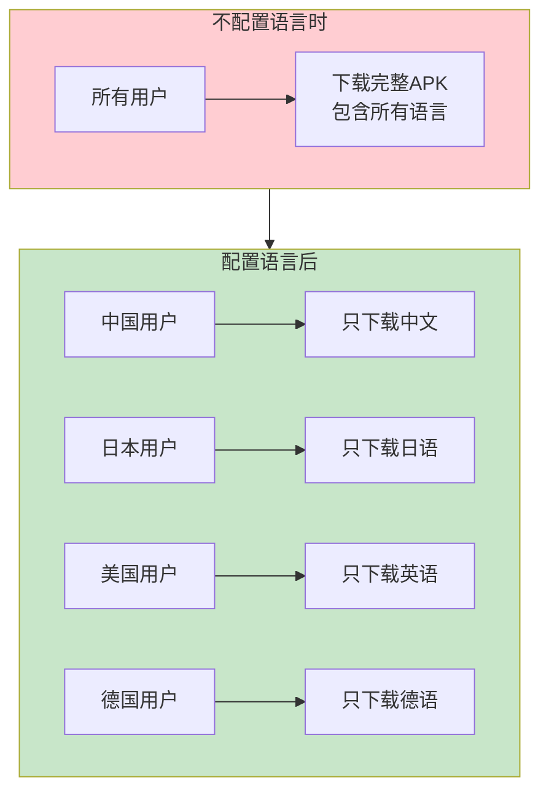
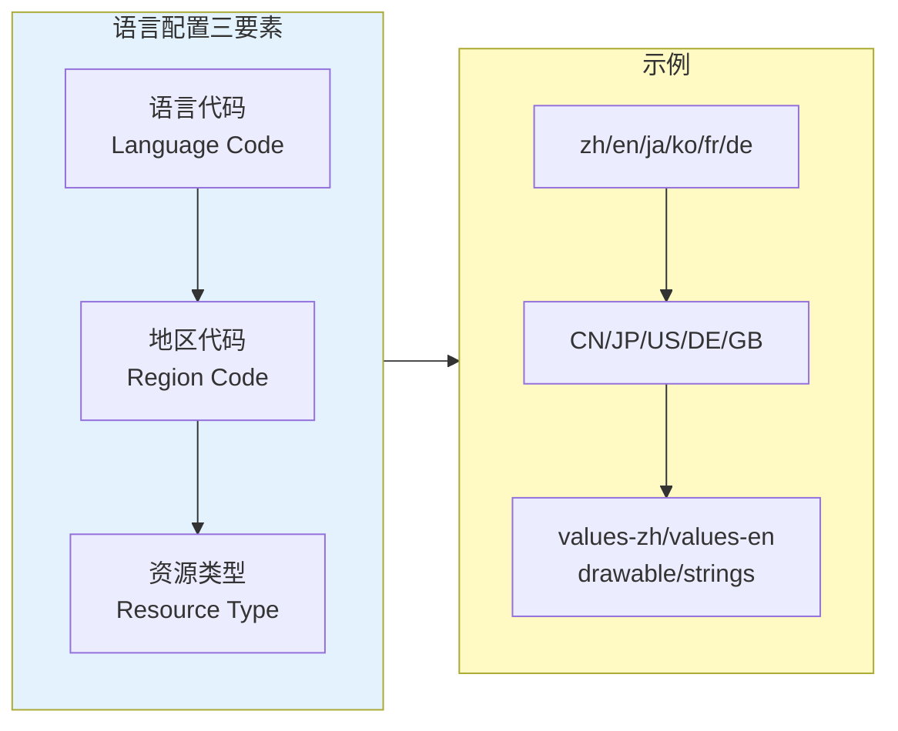
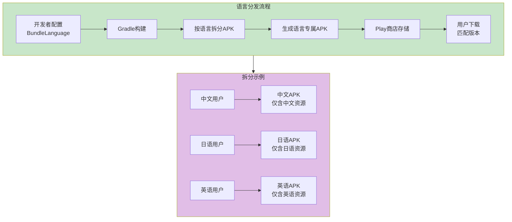
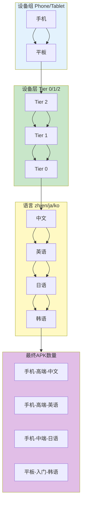
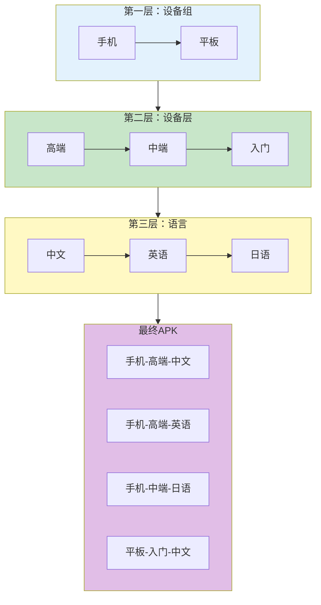

# 21.1.96 BundleLanguage

夕阳把湖面染成了金色。

洛芙躺在草地上，嘴里叼着一根草茎，看着天边的晚霞一点点变化颜色。伊莎在旁边整理着她的速写本，黛琳则拿出白板笔，准备继续今天的内容。

“黛琳，”洛芙翻了个身，“我们今天学了什么设备层、GPU、Tier什么的东西，好厉害的样子。但是我突然想到一个问题诶。”

“什么问题？”黛琳笑着问。

“我们那个露营App，要发布到全球对吧？”洛芙坐起来，“那是不是每个国家的用户都需要所有语言？比如中国用户也要下载英语、日语、韩语的资源？那不是浪费流量吗？”

希尔正在敲代码，听到这话抬起头：“你问到点子上了！这正是我们今天要学的——BundleLanguage！”

“语言也能配置？”洛芙眼睛一亮。

“对，”黛琳点点头，“不仅是设备能分层，语言也能分层。让每个用户只下载他们需要的语言包。”

---

## 什么是语言配置

黛琳在白板上画了一个示意图：



“App Bundle的语言配置，就是控制哪些语言的资源要打包进APK，哪些不打包，”黛琳解释道。

洛芙好奇地问：“那不打包的怎么办？”

“不打包的语言，用户就看不到了呗，”希尔说，“或者说，系统会用默认语言来代替。”

---

## 语言配置的基本概念

黛琳详细解释语言配置的几个关键概念：



“第一个概念是语言代码，”黛琳说，“比如中文是'zh'，英语是'en'，日语是'ja'。”

“第二个是地区代码，”希尔补充道，“比如中国是'CN'，美国是'US'。有时候同一语言在不同地区也有差异，比如英国英语和美國英语。”

“第三个是资源类型，”黛琳继续说，“strings.xml、drawable图片、layout布局……每种资源都可以有不同的语言版本。”

洛芙举手提问：“那英语也有区别吗？”

“有啊，”希尔说，“values-en（英语）和values-en-rUS（美国英语）不一样。美国人写的是'color'，英国人写的是'colour'。”

---

## BundleLanguage 的基本用法

希尔打开笔记本电脑，展示具体的配置代码：

```kotlin
// app/build.gradle.kts

android {
    
    bundle {
        
        // 语言配置
        // 控制App Bundle包含哪些语言资源
        
        language {
            
            // enableSplit = true 表示启用语言拆分
            // 启用后，每种语言会生成独立的APK
            enableSplit = true
            
            // 配置包含哪些语言
            // 只有这里列出的语言会生成独立APK
            include.add("zh")     // 中文
            include.add("en")     // 英语
            include.add("ja")     // 日语
            include.add("ko")     // 韩语
            include.add("fr")     // 法语
            include.add("de")     // 德语
            include.add("es")     // 西班牙语
            include.add("pt")     // 葡萄牙语
            include.add("it")     // 意大利语
            include.add("ru")     // 俄语
            
            // 也可以排除某些语言
            // exclude.add("en-rGB")  // 排除英式英语
            
        }
        
    }
}
```

“这里有个关键点，”希尔强调道，“enableSplit = true 是启用语言拆分的关键。如果不设置这个，或者设置为false，那所有语言都会打包进同一个APK。”

洛芙看着代码：“所以如果我配置了这几种语言，日本用户就只会下载日语版本的APK？”

“对，”黛琳说，“而且日语版本里不会包含中文、韩语、法语……那些用不着的语言资源。”

---

## 语言配置的工作原理

黛琳画出了语言配置的工作流程：



“语言配置的核心思想是，”黛铭解释道，“让每个用户只下载他们需要的语言包。这对于App体积的影响是非常明显的。”

洛芙问：“能减少多少？”

希尔算了一下：“假设你的App有10种语言，每种语言的字符串资源有1MB，图片资源有5MB。如果不拆分，所有用户都要下载包含60MB语言的完整包。如果拆分了，中国用户只下载6MB的包，体积减少90%！”

“这么夸张！”洛芙惊呼。

“而且语言越多，节省越明显，”希尔补充道。

---

## 语言与地区的组合配置

黛琳讲解更高级的用法——语言和地区的组合：

```kotlin
// app/build.gradle.kts

android {
    bundle {
        
        // 场景1：基础语言配置
        // 只配置语言代码
        language {
            enableSplit = true
            include.add("zh")  // 所有中文（包括简体、繁体）
            include.add("en")  // 所有英语（包括英式、美式）
        }
        
        // 场景2：精确到地区的语言配置
        // 使用 "语言-地区" 格式
        language {
            enableSplit = true
            // 中文简体（中国）
            include.add("zh-CN")
            // 中文繁体（台湾）
            include.add("zh-TW")
            // 中文繁体（香港）
            include.add("zh-HK")
            // 英语（美国）
            include.add("en-US")
            // 英语（英国）
            include.add("en-GB")
            // 葡萄牙语（巴西）
            include.add("pt-BR")
            // 葡萄牙语（葡萄牙）
            include.add("pt-PT")
        }
        
        // 场景3：混合配置
        // 有些语言精确到地区，有些只到语言
        language {
            enableSplit = true
            // 中文：区分地区
            include.add("zh-CN")
            include.add("zh-TW")
            // 英语：区分地区
            include.add("en-US")
            include.add("en-GB")
            // 其他语言：不区分地区
            include.add("ja")
            include.add("ko")
            include.add("fr")
            include.add("de")
        }
        
    }
}
```

伊莎好奇地问：“那如果用户手机设置的是'中文-香港'，但我只配置了'中文-台湾'，会怎样？”

“好问题，”黛琳说，“系统会 fallback 到'zh'（通用中文）。如果连'zh'都没有，就用默认语言。”

---

## 常见的语言配置场景

黛琳列举了几个典型的配置场景：

```kotlin
// app/build.gradle.kts

android {
    bundle {
        
        // 场景1：只支持少数几种语言
        // 如果你的App只做了几种语言
        language {
            enableSplit = true
            include.add("zh")   // 中文
            include.add("en")   // 英语
            // 其他语言用户会看到默认语言（或系统语言）
        }
        
        // 场景2：全球化App
        // 大型App通常支持很多语言
        language {
            enableSplit = true
            // 亚洲语言
            include.add("zh")    // 中文
            include.add("zh-CN") // 中文简体
            include.add("zh-TW") // 中文繁体
            include.add("ja")    // 日语
            include.add("ko")    // 韩语
            // 欧洲语言
            include.add("en")    // 英语
            include.add("en-US") // 美式英语
            include.add("en-GB") // 英式英语
            include.add("fr")    // 法语
            include.add("de")   // 德语
            include.add("es")   // 西班牙语
            include.add("it")   // 意大利语
            include.add("pt")   // 葡萄牙语
            include.add("ru")   // 俄语
            // 中东语言
            include.add("ar")    // 阿拉伯语
            include.add("he")    // 希伯来语
            // 南亚语言
            include.add("hi")    // 印地语
            include.add("ta")   // 泰米尔语
        }
        
        // 场景3：排除某些语言
        // 某些地区不想支持
        language {
            enableSplit = true
            // 先包含所有需要的语言
            include.add("zh")
            include.add("en")
            include.add("ja")
            include.add("ko")
            include.add("fr")
            include.add("de")
            include.add("es")
            // 再排除特定变体
            // exclude.add("en-GB")  // 不单独做英式英语
            // exclude.add("zh-TW")  // 不单独做繁体
        }
        
    }
}
```

洛芙问：“那我不配置会怎样？”

“不配置的话，”黛琳说，“默认行为是生成一个包含所有语言资源的通用APK，所有用户都收到同样的版本。”

---

## 语言配置与设备层、设备组的组合

希尔讲解如何将语言配置与前面学过的设备层、设备组配置结合使用：

```kotlin
// app/build.gradle.kts

android {
    
    defaultConfig {
        applicationId = "com.example.camping"
    }
    
    bundle {
        
        // 设备组配置：区分手机和平板
        deviceGroup {
            deviceCategory {
                include.add("phone")
                include.add("tablet")
            }
        }
        
        // 设备层配置：区分高端、中端、入门
        deviceTier {
            gpuTier {
                include.add(2)  // 高端
                include.add(1)  // 中端
                include.add(0)  // 入门
            }
            abi {
                include.add("arm64-v8a")
                include.add("armeabi-v7a")
            }
        }
        
        // 语言配置：区分不同语言
        language {
            enableSplit = true
            include.add("zh-CN")  // 简体中文
            include.add("zh-TW")  // 繁体中文
            include.add("en-US")  // 美式英语
            include.add("en-GB")  // 英式英语
            include.add("ja")     // 日语
            include.add("ko")     // 韩语
        }
        
    }
}
```

黛琳画出了一个三维度的分发示意图：



“如果三个配置都启用，”希尔说，“生成的数量是指数级增长的。每个设备组 × 每个设备层 × 每种语言，都会生成一个独立的APK。”

洛芙惊呼：“那会生成好几十个APK？！”

“对，”黛琳说，“所以要根据自己的实际需求来配置。如果你的App只支持3种语言，就不要配置20种。”

---

## 反模式与最佳实践

黛琳特意强调了常见的错误做法：

```kotlin
// ❌ 反模式1：语言代码写错
language {
    enableSplit = true
    // 错误：语言代码应该是ISO 639-1标准
    include.add("chinese")   // 错误！
    include.add("english")   // 错误！
    include.add("japanese")  // 错误！
    include.add("CN")        // 错误！这是地区代码
}

// ✅ 正确做法：使用标准语言代码
language {
    enableSplit = true
    include.add("zh")    // 中文
    include.add("en")   // 英语
    include.add("ja")   // 日语
    include.add("ko")   // 韩语
}

// ❌ 反模式2：地区代码格式错误
language {
    enableSplit = true
    // 错误：地区代码应该小写
    include.add("zh-CN")   // 这个其实是对的
    include.add("zh_cn")   // 错误！下划线不对
    include.add("zh-CN")   // 正确：连字符
    include.add("zh_CN")   // 错误！
}

// ✅ 正确做法：使用正确的格式
language {
    enableSplit = true
    include.add("zh-CN")   // 中文-中国（简体）
    include.add("zh-TW")   // 中文-台湾（繁体）
    include.add("zh-HK")   // 中文-香港
    include.add("en-US")   // 英语-美国
    include.add("en-GB")   // 英语-英国
    include.add("pt-BR")   // 葡萄牙语-巴西
    include.add("pt-PT")   // 葡萄牙语-葡萄牙
}

// ❌ 反模式3：enableSplit没有启用
language {
    // 错误：没有设置enableSplit
    include.add("zh")
    include.add("en")
    include.add("ja")
    // 这样不会拆分，所有语言都会打包进同一个APK
}

// ✅ 正确做法：启用语言拆分
language {
    enableSplit = true   // 必须设为true
    include.add("zh")
    include.add("en")
    include.add("ja")
}

// ❌ 反模式4：语言配置与资源文件不匹配
// build.gradle配置了很多语言，但values文件夹里没有对应的资源
// values-zh/values-en/values-ja/
// 这些文件夹必须存在，否则配置了也没用

// ✅ 正确做法：确保资源文件存在
// 在 res/ 目录下创建对应的values文件夹：
// - values/ (默认语言)
// - values-zh/ (中文)
// - values-zh-rCN/ (中文简体)
// - values-zh-rTW/ (中文繁体)
// - values-en/ (英语)
// - values-en-rUS/ (英语-美国)
// - values-ja/ (日语)
// - values-ko/ (韩语)
```

“还有一个常见的错误，”希尔补充道，“就是配置了语言拆分，但手机测试的时候发现没生效——那可能是因为你在Android Studio直接运行的是debug build，而debug build默认不拆分。”

洛芙问：“那怎么测试语言拆分？”

“用release build，或者在build.gradle里也给debug开启拆分，”希尔说。

---

## 构建输出示例

希尔运行了一次构建，展示了终端输出：

```
> ./gradlew bundleDebug

> Task :app:generateDebugBundleConfig
Generating bundle configuration...
✓ Language configuration:
  - enableSplit: true
  - include: zh-CN, zh-TW, en-US, en-GB, ja, ko, fr, de, es

> Task :app:packageDebugBundle
Building debug bundle...
✓ Bundle created: app/build/outputs/bundle/debug/app-debug.aab
✓ Language splits generated:
  - app-zh-CN.apk: 12.5 MB  (简体中文)
  - app-zh-TW.apk: 13.2 MB  (繁体中文)
  - app-en-US.apk: 10.8 MB  (美式英语)
  - app-en-GB.apk: 10.9 MB  (英式英语)
  - app-ja.apk: 11.5 MB    (日语)
  - app-ko.apk: 11.2 MB    (韩语)
  - app-fr.apk: 10.5 MB    (法语)
  - app-de.apk: 10.6 MB    (德语)
  - app-es.apk: 10.7 MB    (西班牙语)

✓ Each APK contains only required language resources
✓ Users will download the appropriate APK based on their device language settings

BUILD SUCCESSFUL in 42s
```

洛芙看着输出惊呼：“原来中文版本比英文版本大！因为中文字符比英文多！”

“对，”希尔说，“这就是为什么语言拆分很有必要——中文用户没必要下载那些用不着的语言资源。”

---

## 实际业务场景示例

希尔展示了一个更完整的业务场景：

“假设你开发了一个面向全球的旅游App，”她说，“可以这样配置：”

```kotlin
// app/build.gradle.kts

android {
    
    defaultConfig {
        applicationId = "com.example.travelapp"
    }
    
    bundle {
        
        // 设备组配置：主要面向手机用户
        deviceGroup {
            deviceCategory {
                include.add("phone")
                // 平板也可以支持
                include.add("tablet")
            }
        }
        
        // 语言配置：支持主要旅游目的地语言
        language {
            enableSplit = true
            
            // 亚洲
            include.add("zh-CN")   // 中国大陆
            include.add("zh-TW")   // 台湾
            include.add("zh-HK")   // 香港
            include.add("ja")      // 日本
            include.add("ko")      // 韩国
            include.add("th")       // 泰国
            include.add("vi")       // 越南
            include.add("id")       // 印尼
            include.add("ms")       // 马来
            
            // 北美
            include.add("en-US")   // 美国
            include.add("en-CA")   // 加拿大
            include.add("fr-CA")   // 加拿大法语
            
            // 欧洲
            include.add("en-GB")   // 英国
            include.add("fr")      // 法国
            include.add("de")      // 德国
            include.add("es")      // 西班牙
            include.add("it")      // 意大利
            include.add("pt")      // 葡萄牙
            include.add("ru")      // 俄罗斯
            include.add("nl")      // 荷兰
            include.add("pl")      // 波兰
            include.add("sv")      // 瑞典
            
            // 中东
            include.add("ar")      // 阿拉伯语
            include.add("he")      // 希伯来语
            include.add("tr")      // 土耳其语
            
            // 南亚
            include.add("hi")      // 印地语
            
        }
        
    }
}
```

洛芙明白了：“所以不同国家的用户会下载不同语言的版本，而且如果他们的语言我没有做，会fallback到默认语言！”

“对，”黛琳说，“这就是现代Android全球分发的智慧。”

---

## 语言配置与动态功能模块的配合

黛琳补充了一个高级用法：

“语言配置还可以和动态功能模块配合使用，”她说，“比如某些高级功能只有特定语言才提供。”

```kotlin
// dynamicFeatures/chineseCulture/build.gradle.kts

android {
    bundle {
        // 只有中文用户才能下载这个模块
        language {
            enableSplit = false  // 动态模块不参与语言拆分
        }
    }
}

dependencies {
    // 中国文化特色内容
    implementation project(':content-chinese-culture')
}

// dynamicFeatures/japaneseCulture/build.gradle.kts

android {
    bundle {
        // 只有日语用户才能下载
    }
}

dependencies {
    // 日本文化特色内容
    implementation project(':content-japanese-culture')
}
```

“这样不同语言的用户会看到不同的特色内容，”黛铭解释说，“中文用户看到中国人的使用习惯，日语用户看到日本人的使用习惯。”

---

## 设备组、设备层、语言的三层配合

伊莎好奇地问：“我们学了设备组、设备层、语言，它们三个怎么配合使用？”

黛琳画了一个综合的示意图：



“设备组、设备层、语言，这三个配置是层层递进的关系，”黛琳解释道，“第一层按设备类型分组，第二层在组内按能力分层，第三层按语言细分。”

“Play商店会根据用户的设备情况，”希尔补充说，“从这三个维度找到最匹配的那个APK。”

洛芙惊叹道：“原来分层这么细致！那不同用户下载的APK完全不同！”

“对，”黛琳微笑着说，“这就是现代Android分发的极致优化。”

---

## 章节小结

黛琳整理着白板上的笔记：“今天我们学习了BundleLanguage——语言配置。它能帮助我们：”

“**按语言分发资源**——让每个用户只下载他们需要的语言包；**节省下载体积**——用户只下载需要的语言资源；**优化用户体验**——用户看到的是自己的母语；**与设备组、设备层配合**——形成三维分发体系，实现最精细的控制。”

伊莎补充道：“就像露营时，不同国家的人说不同语言——日本人拿日语说明书，德国人拿德语说明书，大家都能看懂！”

“对，”黛琳微笑着说，“语言配置就是帮你把最合适的'语言包'分给每个用户的工具。”

晚霞染红了天空，湖面上倒映着紫红色的云朵。远处传来夜鸟的叫声，提醒大家该准备晚餐了。

---

> BundleLanguage是Android Gradle DSL中用于配置App Bundle按用户语言设置分发的接口。通过设置enableSplit = true启用语言拆分，使用include添加需要生成独立APK的语言，使用exclude排除不需要的语言。语言代码遵循ISO 639-1标准，地区代码遵循ISO 3166-1标准，组合时使用连字符（如zh-CN、en-US）。配置完成后，Gradle会为每种语言生成独立的APK，用户在Play商店会下载与设备语言设置匹配的最佳版本。常见最佳实践包括：语言拆分主要针对字符串资源较多的App、根据目标市场选择支持的语言、不区分地区的语言使用简短代码（如zh而非zh-CN）、配置完成后通过Build Analyzer检查拆分是否正确生效。注意语言拆分只影响资源文件，不影响代码。

---

> 学习建议：BundleLanguage是实现精细化按语言分发App的关键配置。建议根据目标市场选择支持的语言，不要盲目支持太多语言。语言拆分只影响资源文件（strings.xml、drawable等），不影响Java/Kotlin代码。配置完成后通过Build Analyzer检查拆分是否正确生效。测试时注意debug build默认不拆分，需要用release build测试。如果某些语言没有对应资源文件，系统会fallback到默认语言。

## 洛芙的小小日记本

今天学到了语言配置！原来App也可以按语言拆分——黛琳说这就跟旅行指南一样，去日本拿日语版，去法国拿法语版，大家都能看懂！而且语言包拆分了之后，下载体积能少很多呢～夏天的晚风好舒服，湖畔的萤火虫星星点点的～🌟

---

## 今日关键词

**BundleLanguage**：Android Gradle DSL中用于配置App Bundle按用户语言设置分发的接口。

**语言拆分**：Language Split，按语言生成多个独立APK的机制。

**ISO 639-1**：国际标准化组织制定的语种编码标准，如zh（中文）、en（英语）、ja（日语）。

**ISO 3166-1**：国际标准化组织制定的地区编码标准，如CN（中国）、US（美国）、GB（英国）。

**语言代码**：Language Code，表示语言的代码，如zh、en、ja、ko。

**地区代码**：Region Code，表示地区的代码，如CN、US、TW、HK。

**资源文件**：Resource Files，Android中的strings.xml、drawable、layout等资源。

**App Bundle**：Google推荐的Android应用发布格式，支持模块化动态分发。

**Google Play**：Google官方的Android应用商店。

**设备组**：Device Group，根据设备类型（手机、平板、电视、手表等）对设备进行分组的机制。

**设备层**：Device Tier，根据设备硬件能力（GPU、ABI、纹理压缩格式等）对设备进行分层的机制。

**Fallback**：回退机制，当找不到精确匹配的语言时，使用更通用的语言或默认语言。

**动态功能模块**：Dynamic Features，App Bundle中可按需下载的功能模块。

**Gradle**：Android项目的构建系统。

**APK**：Android Package，Android应用的安装包文件。

**字符串资源**：String Resources，应用界面中显示的文本内容。

**values文件夹**：Android中存放字符串资源的默认文件夹。
