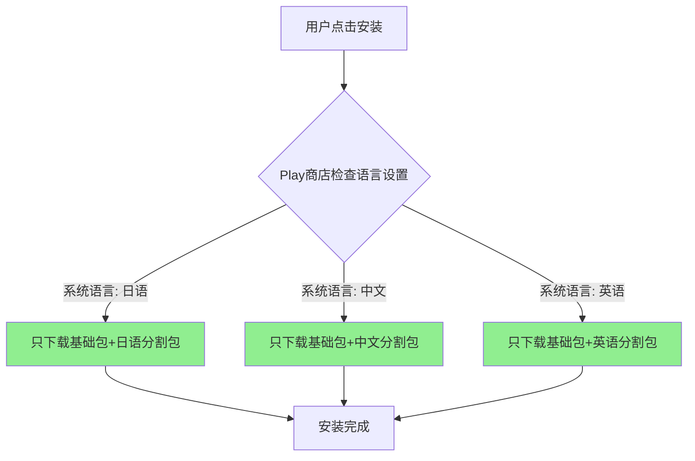

# 21.1.96 捆绑语言

太阳慢慢西沉，把湖面染成了蜜橙色。

洛芙躺在草地上，嘴里叼着一根草茎，手里有一下没一下地拨弄着手机屏幕。她刚刚理解了BundleDeviceTier的概念——原来高端机和入门机可以用不同的配置来优化性能，这让她觉得很有意思。但作为一个刚入职的新人，她总有问不完的问题。

“黛琳，”她翻了个身，趴在草地上，“我刚才在看我们的App Store页面，发现一个问题。”

黛琳正在整理她的背包，听到洛芙的声音抬起头来。伊莎和希尔也各自停下了手里的事情。

“什么问题？”黛琳问道。

洛芙把手机递过去：“你看，我们App支持十几种语言呢。但是每次更新，所有用户都要下载完整的安装包——这也太浪费流量了吧？尤其是那些只说一种语言的用户，凭什么要为他们下载其他语言的资源？”

希尔凑过来看了一眼：“确实，我们支持中日韩英法德西葡俄阿……十几种语言呢。每个语言的字符串资源加起来得好几MB。”

“而且有些语言资源特别大，”伊莎轻声补充道，“比如中文和日文，字体文件也不小呢。”

洛芙点点头：“所以我在想——有没有办法让不同语言的用户只下载他们需要的语言资源？就像……就像点菜一样，只点自己要的？”

黛琳露出了一丝微笑。她从背包里掏出一本小册子——那是Android开发文档的纸质版，边缘已经被翻得有些卷曲。

“你问得很好，”她翻开其中一页，“这正是App Bundle要解决的核心问题之一。而BundleLanguage，就是专门用来配置语言分割的。”

“又是Bundle？”洛芙眨眨眼，“上次是BundleDeviceTier，现在又是BundleLanguage……感觉Bundle系列都是用来做分割优化的啊。”

“没错，”黛琳点点头，“Bundle的本意是'捆绑包'，而我们做的事情恰恰是'解绑'——把一个巨大的整体拆分成多个小部分，让用户只取自己需要的那部分。”

---

黛琳在地上铺开一张防水垫，把笔记本电脑放好。太阳快要落山了，天边的云彩被染成了紫红色，湖面上倒映着晚霞，美得有些不真实。

“我们先来看一下传统的APK是怎么工作的，”黛琳打开Android Studio，“假设你开发了一个App，支持20种语言。在不使用任何分割的情况下，你打包出来的APK会包含所有20种语言的字符串资源、字体资源，还有所有的配置。”

她打开build.gradle文件，指给洛芙看：“这种情况下，一个日本用户下载了你的App，但实际上他只需要日文资源——但他被迫下载了包含中英法德等所有语言的完整包。这不仅浪费流量，还占用了宝贵的存储空间。”

洛芙皱起眉头：“那有多浪费？”

希尔快速心算了一下：“这么说吧。如果每种语言平均500KB的字符串资源，加上字体文件和其他资源……20种语言就是10MB左右的额外负担。对于存储空间只有16GB的入门机用户来说，这可能是压垮骆驼的最后一根稻草。”

“天哪！”洛芙惊呼，“10MB可以存好几百张照片了！”

“所以Google推出了App Bundle，”黛琳调出项目配置，“而语言分割是其中最基础也是最重要的功能。通过BundleLanguage配置，你可以告诉构建系统：‘请把不同语言的资源打包成独立的分割文件’。”

她在build.gradle中添加了一段配置：

```kotlin
android {
    bundle {
        language {
            enableSplit = true
        }
    }
}
```

“这就是BundleLanguage最核心的配置，”黛琳解释道，“enableSplit = true 表示启用语言分割。”

---

伊莎泡了一壶热茶过来，分给每个人。晚风轻轻吹过，带来湖水的凉意和荷叶的清香。

“让我来打个比方吧，”伊莎双手捧着茶杯，“你们有没有去过那种自助餐厅？”

洛芙点点头：“去过！之前公司团建的时候去过一次。”

“在自助餐厅里，”伊莎继续说道，“通常会有很多道菜。但如果你只喜欢吃海鲜，你会不会把每一道菜都盛到盘子里？”

“当然不会！”洛芙笑了，“那样胃会撑坏的。”

“传统APK就像那个自助餐厅，”伊莎柔声说，“它把所有语言的资源都'盛'在一起，不管用户需不需要。而App Bundle的语言分割，就像餐厅提供的单点菜单——用户可以只选择自己需要的语言。”

“而且更棒的是，”黛琳补充道，“Google Play会自动处理这个分发过程。用户下载App时，Play商店会根据用户的系统语言设置，自动匹配并只下载对应的语言包。”

洛芙若有所思：“那……如果用户后来想换语言呢？比如日本人去美国工作，需要把系统语言从日语换成英语？”

“好问题，”黛琳赞许地说，“Play商店支持按需下载额外的语言包。用户可以在Play商店的App详情页找到'其他语言'的选项，点击后会自动下载并安装。”

“就像在手机应用商店里添加语言一样简单，”希尔补充道，“不需要重新下载整个App。”

---

天色渐暗，湖面上开始泛起星星点点的萤火虫。希尔点燃了露营灯，暖黄色的灯光在草地上投下一圈圈光晕。

“我们来看一个更完整的配置示例，”黛琳把笔记本转向大家，“BundleLanguage不仅仅可以启用分割，还有一些高级选项。”

```kotlin
android {
    bundle {
        language {
            // 启用语言分割
            enableSplit = true
            
            // 是否在根目录包含所有语言的资源
            // 设为false可以进一步减小基础包大小
            // 但某些场景可能需要设为true（比如测试时）
            includeInRoot = false
            
            // 指定一个或多个默认语言
            // 这些语言会被包含在基础包中
            // 其他语言则作为独立分割包
            defaultLocale = listOf("en", "zh")
        }
    }
}
```

“这里有两个重要的选项，”黛琳开始解释，“一个是includeInRoot，一个是defaultLocale。”

洛芙凑近屏幕：“includeInRoot = false是什么意思？”

“想象一下，”黛琳说，“如果你不带任何语言设定去买手机，手机出厂时通常会预装英语——因为英语是国际通用语言。includeInRoot的作用类似：设为false时，基础APK不包含任何语言资源，所有语言都作为独立分割包下载。”

“这有什么好处？”

“基础包更小，”希尔插话道，“你想啊，如果你的App有20种语言，includeInRoot = false可以让基础包减少10MB左右的体积。用户第一次下载时会非常快。”

“那defaultLocale呢？”

“这个选项可以指定哪些语言'重要到'必须放在基础包里，”黛琳解释道，“比如你设置defaultLocale = listOf('en', 'zh')，英语和中文资源就会被默认包含在基础包中，其他语言（如日语、法语）作为独立包。”

洛芙好奇地问：“为什么要这样设计？全部单独下载不好吗？”

“有两个考虑，”黛琳伸出两根手指，“第一，Google Play商店本身有默认语言偏好设置——如果用户没设置语言，系统会使用设备的默认语言。如果这个语言正好在你的defaultLocale里，用户就不需要额外下载，体验更好。第二，少数语言在某些地区特别常见，比如中文在东南亚很多国家都很受欢迎，把这些语言放在基础包里可以减少大部分用户的下载量。”

---

夜幕完全降临了，星星一颗一颗地冒出来，倒映在湖面上，仿佛天地颠倒。远处的山峦变成了深蓝色的剪影，知了的叫声渐渐稀疏，只有偶尔的蛙鸣点缀着夜色。

“我有个问题，”洛芙仰头看着星空，“如果用户下载了App后发现需要的语言不存在会怎么样？比如一个用户手机系统设成了某个小语种，但我们的App没支持那个语言，会崩溃吗？”

“不会的，”黛琳确定性地说，“Android系统有默认的回退机制。如果App没有用户系统语言的资源，系统会回退到defaultLocale指定的语言。如果defaultLocale也没有，就回退到第一个可用的语言资源。”

希尔补充道：“这个机制叫做'资源回退'（Resource Fallback），是Android资源系统最基本的功能之一。理论上，你的App至少应该包含一种语言——通常是英语——作为保底。”

洛芙放心地点点头：“那我就放心了。对了，我还想问——BundleLanguage的配置会影响调试构建吗？我担心本地调试时会不方便。”

“很好的问题，”黛琳笑了，“在调试构建（debug build）时，默认情况下语言分割是禁用的——这样你可以方便地在设备上测试所有语言的资源，而不需要额外下载分割包。”

“如果想在调试时也启用分割呢？”

“那需要显式配置，”黛琳调出另一段代码，“你可以在buildTypes或productFlavors中单独配置：”

```kotlin
android {
    buildTypes {
        release {
            bundle {
                language {
                    enableSplit = true
                }
            }
        }
        debug {
            bundle {
                language {
                    // 调试时也启用语言分割
                    enableSplit = true
                }
            }
        }
    }
}
```

“但通常我们不建议在调试时启用，”希尔说，“因为每次测试不同语言都要重新下载分割包，很麻烦。除非你要验证分割包本身的行为。”

---

晚风越来越大，伊莎把毯子裹紧了一些。湖面上的萤火虫越来越多，像撒落在水面上的星星。

“黛琳，我突然想到一个更深入的问题，”洛芙的认真劲又上来了，“语言分割听起来很好，但它会不会增加开发的复杂度？比如我们要怎么测试每种语言的显示效果？”

黛琳理解地点点头：“这是个好问题。测试多语言App确实需要一些技巧。”

她打开Android Studio的设备管理器：“首先，你可以创建不同语言配置的虚拟设备——比如一台设备系统语言设为日语，另一台设为中文，还有一台设为英语。这样就可以在本地测试各种语言的显示效果。”

```kotlin
// 在Android Studio中创建语言特定的AVD
// 命令行方式：
avdmanager create avd -n "Pixel_6_Japanese" -k "system-images;android-34;google_apis;x86_64" 
    --device "pixel_6" 
    -g "ja-JP"
```

“其次，”黛琳继续说道，“你可以在应用内切换语言进行测试——很多App都有语言设置功能。你可以开发一个开发者选项菜单，暂时改变App的显示语言来测试。”

“还有一个重要工具，”希尔补充道，“就是App Bundle Explorer——这是Android Studio内置的工具，可以查看和分析App Bundle生成的分割包。你可以清楚地看到每个语言包的大小，检查是否有异常。”

洛芙把这些都记了下来：“听起来工具链还是很完善的。那……语言分割会影响App的性能吗？比如启动速度？”

“问得好，”黛琳赞许地说，“实际上，语言分割对性能有正面影响。”

她画了一张简单的流程图：



“你看，”黛琳指着图说，“因为只下载必要的语言包，安装速度会更快。而且基础包体积变小后，首次启动时的资源加载也会变快——这对你的入门机用户特别重要。”

洛芙兴奋地说：“这就是说，一个16GB存储的入门机用户，下载我们的App只需要几十MB，而不是一百多MB？！”

“没错，”黛琳微笑着说，“这就是语言分割的力量。”

---

夜深了，湖面上的萤火虫变成了主要的光源。露营灯的光线变得柔和，映照着四张专注的脸庞。

“最后一个问题，”洛芙打了个哈欠，“如果我们App需要支持一些特殊的语言变体，比如繁体中文的台湾版本和香港版本，要怎么配置？”

黛琳点点头：“这是很常见的需求。Android使用BCP 47语言标签来区分语言变体。”

她在电脑上输入了几个例子：

```kotlin
android {
    bundle {
        language {
            // 支持语言变体
            // 完整列表可以参考BCP 47标准
            // zh-Hant: 繁体中文
            // zh-Hans: 简体中文  
            // zh-Hant-TW: 繁体中文-台湾
            // zh-Hant-HK: 繁体中文-香港
            // pt-BR: 葡萄牙语-巴西
            // pt-PT: 葡萄牙语-葡萄牙
        }
    }
}
```

“资源目录的命名也需要对应上，”希尔补充道，“比如values-zh-rTW表示台湾的繁体中文，values-zh-rHK表示香港的繁体中文。”

洛芙拿出手机备忘录记了下来：“明白了！这样精细的配置可以让不同地区的用户都获得最准确的语言体验。”

---

夜空中划过一颗流星，洛芙赶紧双手合十许愿。

“好啦，今天就到这里吧，”黛琳合上笔记本电脑，“Language分割是App Bundle最基础也是最重要的优化手段之一。用好了可以让APK体积减少50%以上，对用户体验是巨大的提升。”

伊莎轻声说：“就像露营时要带合适的东西——带太多了负担重，带太少了不够用。语言分割就是帮用户带'刚好够'的东西。”

洛芙伸了个懒腰，看着湖面上倒映的星空：“今天学到了很多呢。原来不只是硬件配置需要优化，连语言资源都可以这样精细地管理。”

“Android系统就是这样，”黛琳收拾着东西，“每一个细节都值得优化，因为正是这些细节累积起来，才决定了用户的体验。”

希尔打了个响指：“明天我们再接着讲ABI分割和屏幕密度分割——到时候你就知道为什么有时候一个App只需要下载几十MB，有时候却要几百MB。”

洛芙吐了吐舌头：“听起来是个大话题。不过今天先好好休息！”

她躺在睡袋里，看着头顶的星空，慢慢地闭上了眼睛。湖风吹过来，带着荷叶的清香，知了的叫声仿佛一首温柔的摇篮曲。

---

> 学习建议

1. BundleLanguage是App Bundle配置的核心组成部分，建议在所有正式发布的App中启用语言分割（enableSplit = true）
2. 合理设置defaultLocale，通常包含英语和你的主要目标市场语言
3. 使用Android Studio的Bundle Explorer工具分析分割包大小，确保没有异常大的语言包
4. 测试时使用不同语言设置的设备或AVD验证资源回退机制
5. 注意资源文件的命名规范（values-zh-rTW等），确保语言变体能正确匹配

---

## 洛芙的小小日记本

今天学到了BundleLanguage！原来App可以像点菜一样只下载用户需要的语言——这样入门机用户再也不用下载几十MB的额外语言包了。黛琳说优化要从细节做起，语言分割看起来是小功能，但对用户体验影响很大呢。好困，星星好亮，晚安~ 💫

---

## 今日关键词

- **BundleLanguage**：Android Gradle DSL中用于配置App Bundle语言分割的组件
- **App Bundle**：Google推出的应用分发格式，可根据用户设备动态生成优化的安装包
- **语言分割（Language Split）**：将不同语言的资源打包成独立分割包的技术
- **enableSplit**：BundleLanguage的配置项，用于启用或禁用分割
- **includeInRoot**：配置项，决定是否在基础包中包含语言资源
- **defaultLocale**：配置项，指定默认包含在基础包中的语言列表
- **资源回退（Resource Fallback）**：当用户语言资源不存在时，系统回退到备用语言的机制
- **BCP 47**：语言标签标准，用于精确指定语言变体（如zh-Hant-TW）
- **AVD（Android Virtual Device）**：Android虚拟设备，用于模拟不同配置的Android设备
- **Bundle Explorer**：Android Studio工具，用于分析App Bundle的分割包内容
- **values-zh-rTW**：Android资源目录命名，表示台湾繁体中文
