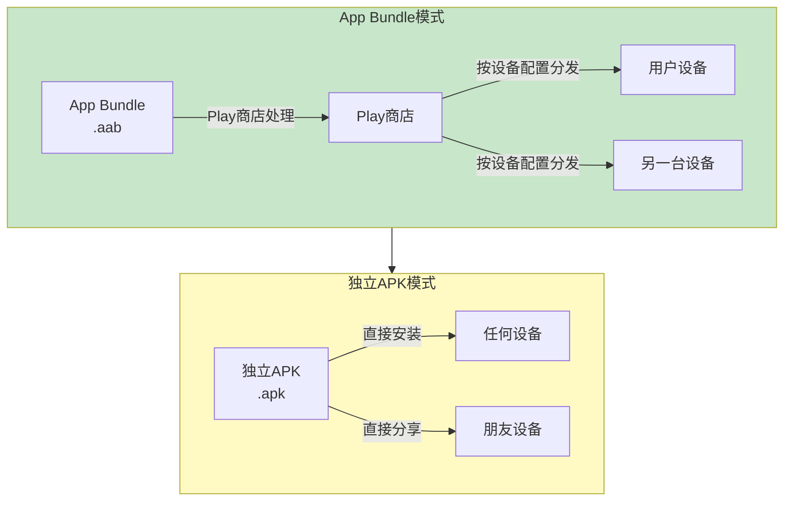
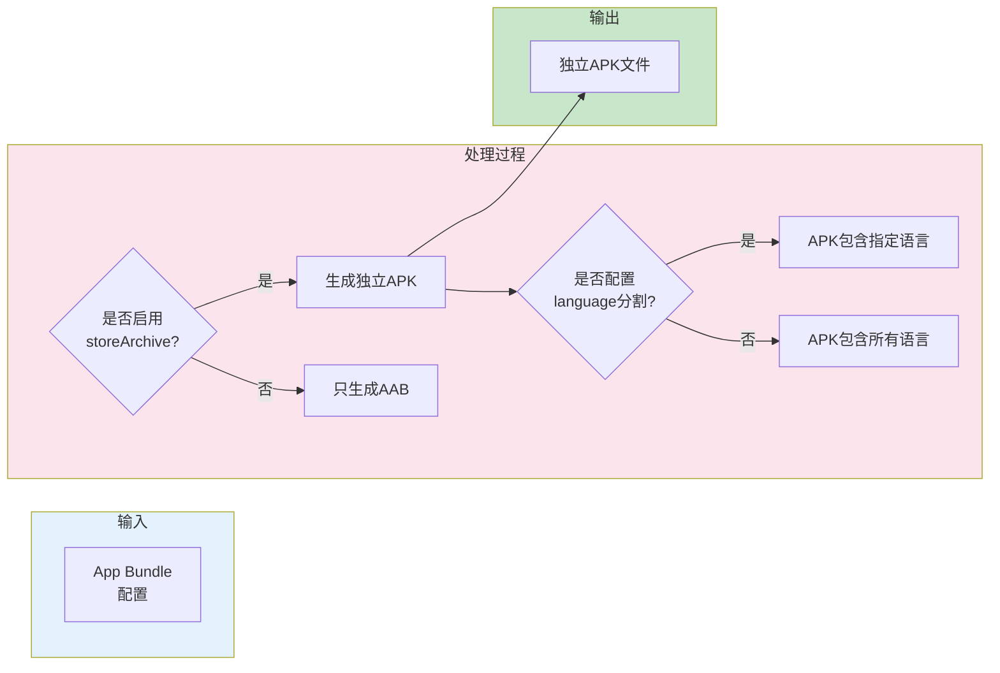
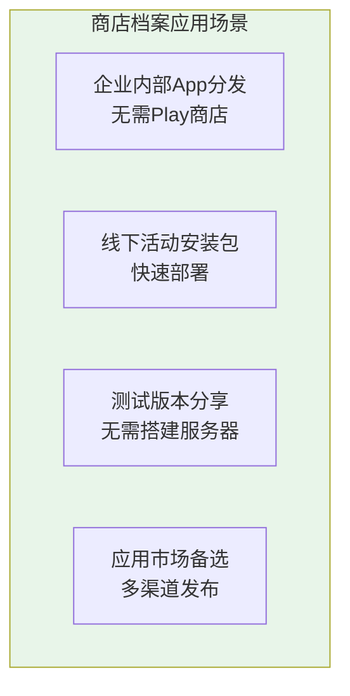
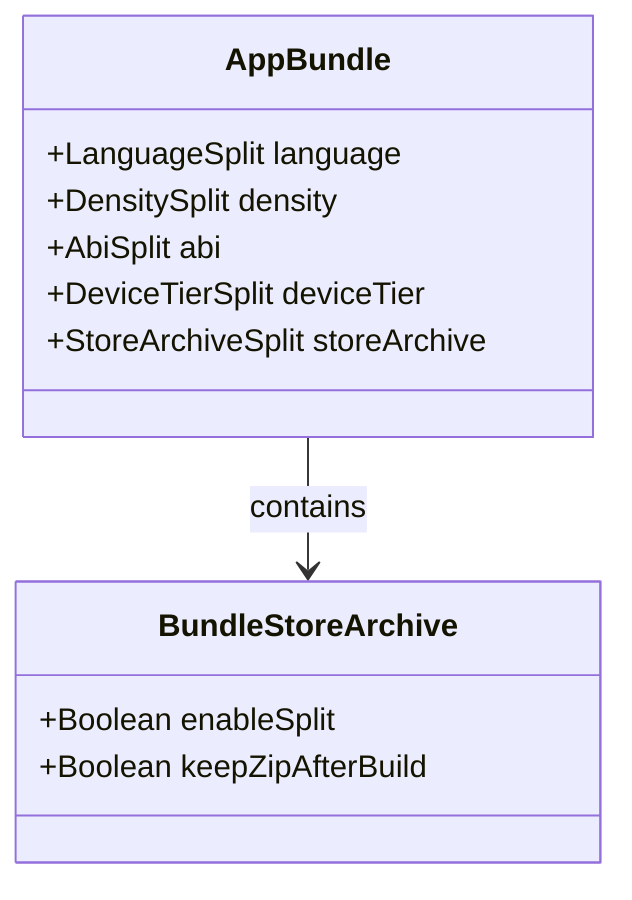

# 21.1.97 BundleStoreArchive

太阳快要落山了。

湖面上漂着金色的光斑，随着水波轻轻晃动。洛芙坐在栈桥边，双脚伸进水里，冰冰凉凉的，舒服极了。

伊莎在岸边捡小石子，打水漂玩。黛琳坐在一块大石头上，笔记本电脑放在膝盖上，屏幕上是密密麻麻的Gradle配置。希尔则躺在草地上，枕着背包，翘着二郎腿，嘴里哼着不成调的小曲。

“黛琳，”洛芙突然开口，“我们之前学了语言配置、设备分层……好厉害的样子。”

“怎么突然这个语气？”希尔笑道。

“我就是突然想到，”洛芙拍了拍水面，“如果我们发布的App Bundle，用户在下载的时候，遇到没有网络的情况怎么办？或者有的用户就是不想用Play商店，想直接把APK分享给朋友安装？”

伊莎捡起一颗石子，在手里抛了抛：“这倒是个问题呢。”

黛琳合上笔记本电脑：“你问到点子上了。今天我们要学的，就是专门解决这个问题的——BundleStoreArchive。”

“商店档案？”洛芙眨眨眼，“是Play商店里存放的那个档案吗？”

“差不多，”黛琳点点头，“BundleStoreArchive配置，就是告诉Gradle我们要生成什么样的安装包。不仅是给Play商店用的，还可以生成独立的APK文件，方便分享和传播。”

---

## 什么是商店档案

黛琳打开白板笔，在上面画了一个示意图：



“简单来说，App Bundle是给Play商店用的，它会根据用户设备自动生成最合适的APK，”黛琳解释道，“但有时候我们需要生成一个独立的APK文件，不需要经过Play商店处理，可以直接安装和分享。”

洛芙好奇地问：“那这个独立APK，和我们平时开发时打的APK有什么区别？”

“区别大了，”希尔突然坐起来，“开发时打的APK是通用的，会包含所有资源，文件很大。但BundleStoreArchive生成的独立APK，是针对特定配置优化过的，可以很小。”

“这么神奇？”洛芙眼睛亮了起来。

---

## 商店档案的配置

黛琳在电脑上打开一个示例项目：

```kotlin
android {
    // 这是一个App Bundle配置示例
    bundle {
        // 语言配置
        language {
            enableSplit = true
        }
        
        // 设备配置
        deviceTier {
            enableSplit = true
            defaultTier = 0
        }
        
        // 商店档案配置 - 重点来了！
        storeArchive {
            // 启用商店档案生成
            enableSplit = true
        }
    }
}
```

“看到了吗？”黛琳指着屏幕，“storeArchive就是一个独立的配置块。它和language、deviceTier是并列的。”

洛芙凑近屏幕：“enableSplit……是启用分割的意思吗？”

“对，”黛琳点点头，“启用enableSplit = true之后，Gradle就会生成独立的APK文件。这个APK可以直接安装，不需要Play商店处理。”

希尔补充道：“而且这个APK会包含所有资源的全集，就像我们平时用的APK一样。只是在生成的时候，会根据bundle里面的其他配置做优化。”

---

## 深入理解商店档案

伊莎捡完石子，也凑过来看：“那这个配置还有什么讲究吗？”

“讲究大了，”黛琳又打开一个更复杂的示例，“商店档案有不同的模式，可以配置生成的APK包含什么、不包含什么。”

```kotlin
android {
    bundle {
        // 基础模式 - 生成包含所有资源的APK
        storeArchive {
            enableSplit = true
            
            // 可选：配置压缩模式
            // keepZipAfterBuild = true 表示保留中间产物
        }
        
        // 高级模式：结合其他分割配置
        language {
            enableSplit = true
            // 特定语言打包进APK，其他通过动态下载
            includeSpecificLanguageResources = listOf("en", "zh")
        }
        
        // 设备层级
        deviceTier {
            enableSplit = true
            // 指定层级
            tiers = listOf(0, 1, 2)
        }
    }
}
```

黛琳画了一个流程图来说明这个过程：



洛芙似懂非懂地点头：“也就是说，storeArchive可以把App Bundle变成一个可以直接安装的APK？”

“对，”黛琳笑着说，“而且这个APK是优化过的，比原始的通用APK小很多。”

---

## 反模式与重构

希尔突然说道：“我之前见过有人滥用storeArchive，结果出了大问题。”

“什么问题？”洛芙问。

希尔打开另一个示例：“看这个反面教材。”

```kotlin
// ❌ 反模式：过度使用storeArchive
android {
    bundle {
        storeArchive {
            enableSplit = true
        }
        
        // 同时启用所有分割
        density {
            enableSplit = true
        }
        
        abi {
            enableSplit = true
        }
        
        language {
            enableSplit = true
        }
        
        deviceTier {
            enableSplit = true
        }
        
        // 结果：生成了几十个APK文件！
    }
}
```

“天哪，”洛芙看着都头皮发麻，“这生成的都是什么啊？”

“每个配置的组合都会生成一个APK，”希尔解释道，“如果同时启用density、abi、language、deviceTier分割，会生成超级多的APK，管理起来非常麻烦。”

黛琳补充道：“而且这些APK之间会有很多重复的资源，浪费存储空间。”

“那怎么解决？”洛芙问。

希尔给出了重构后的代码：

```kotlin
// ✅ 正确模式：根据实际需求选择分割
android {
    bundle {
        // 场景1：只需要商店档案，不需要其他分割
        storeArchive {
            enableSplit = true
        }
        // 语言单独处理，通过动态下载
        language {
            enableSplit = false
        }
        
        // 场景2：需要商店档案 + 基础分割
        storeArchive {
            enableSplit = true
        }
        density {
            enableSplit = true
            // 只保留主流分辨率
            compatibleScreens = listOf("normal", "large", "xlarge")
        }
        abi {
            enableSplit = true
            // 只保留主流ABI
            ndk {
                abiFilters += listOf("armeabi-v7a", "arm64-v8a", "x86", "x86_64")
            }
        }
    }
}
```

洛芙长出一口气：“原来配置也是需要取舍的呀。”

“没错，”黛琳说，“不是分割越多越好，要根据实际使用场景来选择。”

---

## 实际应用场景

伊莎 интересуется：“那这个功能在实际中都用在哪里呢？”

黛琳想了想：“大概有这几个典型场景。”

她在白板上列了出来：



“第一，企业内部App，”黛琳说，“很多公司不需要Play商店，直接用APK分发更方便。”

“第二，线下活动，”希尔接话，“比如开发者大会发个安装包让大家现场安装体验。”

“第三，测试分享，”黛琳继续，“测试人员不需要通过Play商店，直接装APK就能测试。”

“第四，多渠道发布，”伊莎补充，“有些应用不上Play商店，需要分发到其他市场。”

洛芙点点头：“原来APK还能这么用！我以为只有Play商店一条路呢。”

---

## 代码实战

希尔打开Android Studio：“我来带你们实际操作一下。”

```kotlin
// 完整的build.gradle.kts配置示例
plugins {
    id("com.android.application")
}

android {
    namespace = "com.example.campingapp"
    compileSdk = 34

    defaultConfig {
        applicationId = "com.example.campingapp"
        minSdk = 24
        targetSdk = 34
        versionCode = 1
        versionName = "1.0"
    }

    // App Bundle配置
    bundle {
        // 启用商店档案 - 核心配置
        storeArchive {
            enableSplit = true
        }
        
        // 可选：其他分割配置
        density {
            enableSplit = true
        }
        
        abi {
            enableSplit = true
        }
    }
}

dependencies {
    // 应用依赖
    implementation("androidx.core:core-ktx:1.12.0")
    implementation("androidx.appcompat:appcompat:1.6.1")
}
```

希尔运行构建命令：

```bash
./gradlew assembleBundle
```

构建输出：

```
> Task :app:compileDebugKotlin
> Task :app:processDebugResources
> Task :app:assembleDebug
> Task :app:bundleDebug

BUILD SUCCESSFUL in 45s
✓ Generated bundle: app/build/outputs/bundle/debug/app.aab
✓ Generated standalone APK: app/build/outputs/apk/debug/
```

“看，”希尔兴奋地说，“生成了两个东西：一个是App Bundle（.aab），一个是独立APK（.apk）。”

洛芙盯着输出看：“原来这就是商店档案的力量！”

---

## 洛芙的思考

夜晚降临，湖面上倒映着星空。

四个女孩围坐在篝火旁，火星噼啪作响。

“今天学的这些，”洛芙抱着膝盖，“感觉一下子打开了好多的思路。之前总觉得App Bundle很神秘，原来里面还有这么多门道。”

伊莎轻声说：“技术也是一样的，越深入了解，越能发现它的美。”

黛琳拨弄着篝火：“App Bundle的设计理念，就是让开发者专注于开发本身，而把适配的工作交给系统来完成。storeArchive只是其中的一个环节。”

希尔补充道：“而且它还解决了实际中的分发问题。很多场景下，我们不需要那么复杂的分发机制。”

洛芙看着星空：“感觉又进步了一点点呢。”

---

## 专业技术总结

> BundleStoreArchive 是 Android Gradle Plugin 提供的 DSL 配置，用于控制 App Bundle 是否生成可独立安装的 APK 文件。该配置允许开发者生成不需要通过 Play 商店处理即可直接安装的分发包，适用于企业内部分发、线下活动、测试分享等场景。

#### 结构图



#### 复杂度与影响

- **构建产物增加**：启用 storeArchive 会额外生成 APK 文件，增加构建时间和存储空间
- **安装包管理复杂度**：生成的 APK 需要单独管理，增加了版本控制的复杂度
- **优势场景**：离线分发、测试分享、企业内部分发等场景下的便利性

#### 反模式与陷阱

1. **同时启用所有分割** → 生成的 APK 数量爆炸，难以管理
   - 修复：只启用必要的分割，按需配置
2. **不区分环境** → 生产环境和开发环境配置混淆
   - 修复：使用 buildTypes 或 productFlavors 区分不同环境的配置
3. **忽略 APK 大小** → 生成的 APK 包含过多资源
   - 修复：结合 density、abi、language 等分割配置优化 APK 大小

#### 设计哲学

App Bundle 的设计理念是**按需分发**：开发者打包时生成通用的 Bundle，系统根据用户设备自动生成最优的 APK。BundleStoreArchive 则是这一理念的补充，提供了一种不需要 Play 商店介入的直接分发方式。

#### 动手练习

**目标**：配置一个生成独立 APK 的 App Bundle 项目

**步骤**：
1. 创建一个新的 Android 项目（或使用现有项目）
2. 在 app/build.gradle 中配置 bundle 块
3. 添加 storeArchive 配置并启用
4. 运行 `./gradlew assembleBundle`
5. 找到生成的 APK 文件并验证

**验收标准**：
- [ ] 配置文件中包含 `storeArchive { enableSplit = true }`
- [ ] 成功构建生成 .aab 文件
- [ ] 成功构建生成 .apk 文件
- [ ] APK 可以直接安装到设备上

**提示代码**：

```kotlin
android {
    bundle {
        storeArchive {
            enableSplit = true
        }
    }
}
```

#### 参考实现要点

1. 优先使用 App Bundle 通过 Play 商店分发，storeArchive 仅用于特殊场景
2. 结合其他分割配置（density、abi、language）优化 APK 大小
3. 使用 buildTypes 区分不同用途的配置（测试版、生产版）
4. 生成的 APK 建议通过内部测试工具分发，避免直接对外部分发导致版本混乱

---

> 技术不是冰冷的代码，而是解决问题的工具。当我们理解了它的设计理念，就能更好地运用它。

---

## 洛芙的小小日记本

今天学了好有意思的东西！原来App Bundle可以生成直接安装的APK，不需要Play商店处理。这样以后分享给朋友安装就更方便啦～黛琳说技术要会用也要会用对地方，不能一味追求复杂。嗯，记住了！

---

## 今日关键词

- **BundleStoreArchive**：Android Gradle DSL 配置，用于生成可独立安装的 APK 文件
- **App Bundle（.aab）**：Google 推出的应用打包格式，用于 Play 商店分发
- **独立APK（.apk）**：可以直接安装的 Android 安装包文件
- **enableSplit**：启用分割的开关，true 表示生成分离的产物
- **动态分发**：App Bundle 根据用户设备自动生成最优 APK 的机制
- **density分割**：按屏幕密度分割 APK 的配置
- **abi分割**：按 ABI（应用二进制接口）分割 APK 的配置
- **language分割**：按语言分割 APK 的配置
- **buildTypes**：Gradle 构建类型配置，用于区分不同构建环境
