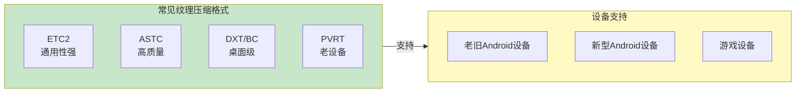
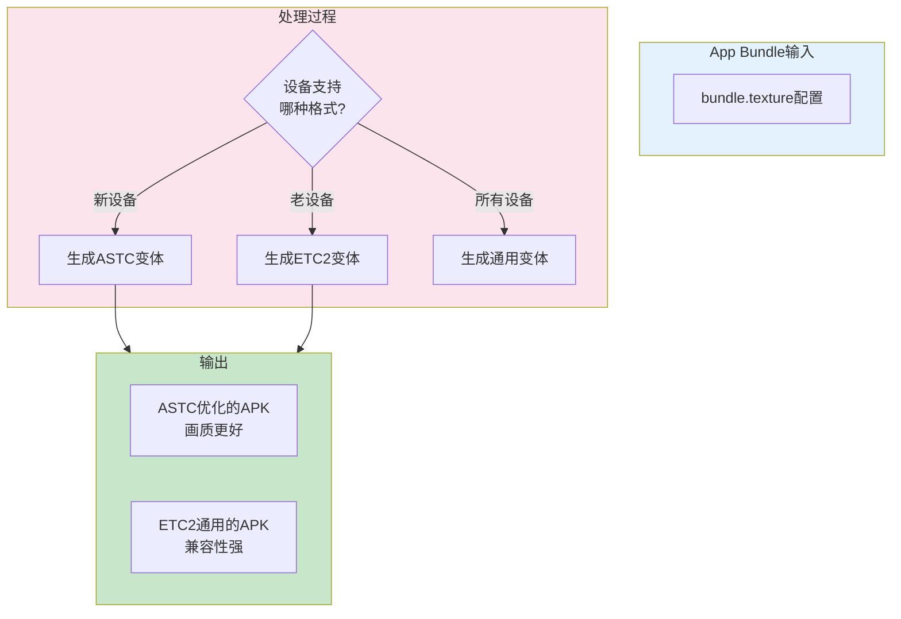
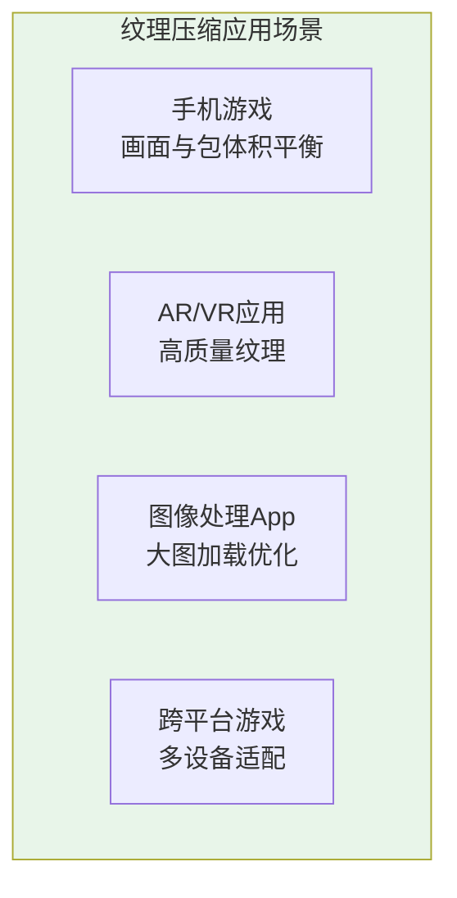
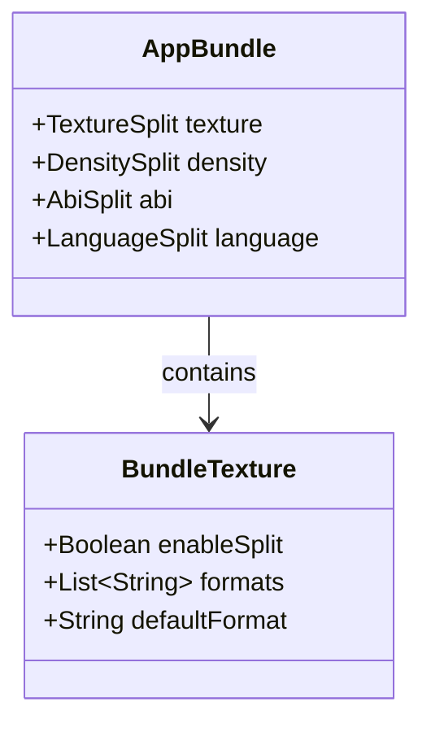

# 21.1.98 BundleTexture

夜色渐浓。

湖面上飘着薄薄的雾气，把倒映的星光衬得更加朦胧。四个女孩围坐在篝火旁，火星噼啪作响，偶尔有几颗火星打着旋儿升上夜空，融进银河里。

洛芙靠在折叠椅上，仰头看着星空。刚才学的商店档案知识还在脑海里转悠，冷不丁地，她突然想到一个问题。

“黛琳，”她轻声开口，“我刚才忽然想到一个问题。”

“什么？”黛琳正在往笔记本上记录今天的学习要点，抬起头来。

“你们看这个星星，”洛芙指了指天空，“每颗星星大小都不一样，有的亮有的暗。就像……就像我们App里的图片资源，是不是也有大有小，有的清晰有的模糊？”

希尔正在往篝火里添柴火，听到这话回过头来：“你这个问题问得好！App里的图片确实不一样，而且不同手机支持的图片格式也不一样。”

“不一样？”洛芙眨眨眼，“图片格式还有什么不一样吗？”

伊莎轻轻笑了：“记得我们上次看相机App的时候，说过什么拍摄模式吗？”

“记得记得！”洛芙一下子来了精神，“有的是RAW格式，有的是JPEG，还有的是HEIC什么的！”

“对，”黛琳合上笔记本，“图片格式不同，效果和大小也不同。今天我们要学的更具体——是**纹理压缩格式**。这和App Bundle的打包密切相关。”

“纹理压缩？”洛芙歪着头，“是给图片减肥的意思吗？”

“差不多，”希尔拍了拍手，沾上了一些炭灰，“走，我们找个更舒服的地方，我给你慢慢讲。”

---

## 什么是纹理压缩格式

四个人转移到了帐篷前的草坪上。黛琳打开带来的便携式白板，莹莹的蓝光在黑暗中格外醒目。

“先说说为什么需要纹理压缩，”黛琳开口，“洛芙，你玩过那种画面特别精致的游戏吗？”

“玩过！”洛芙点头，“那个RPG游戏，画面可漂亮了，人物衣服的纹理都看得清清楚楚。”

“那你知道那个游戏安装包有多大吗？”

洛芙想了想：“好像……有好几个G？”

“对，大的甚至到十几G，”黛琳说，“为什么这么大？很大一部分原因就是图片太占地方了。一张高清纹理图片，随随便便就几MB。”

伊莎插话道：“就像画一幅油画和拍一张照片，油画需要很多颜料，很多细节，占用的'空间'自然就大。”

“纹理压缩，就是给图片'减肥'的技术，”黛琳继续解释，“通过特殊的算法，把图片的体积变小，但视觉效果差不多。这样用户的手机就不用下载那么多数据了。”

洛芙似懂非懂：“那……压缩，会不会让图片变得不清楚啊？”

“这就是技术的奇妙之处了，”希尔笑道，“好的压缩算法，能够在保持视觉效果的同时，大大减少文件大小。而且现在手机硬件都很厉害，解压速度很快。”

---

## 纹理压缩格式的种类

黛琳在白板上画了一个简单的图：



“常见的纹理压缩格式有几种，”黛琳一边画一边解释，“ETC2是最通用的，几乎所有Android设备都支持。ASTC是较新的格式，画质更好，但需要较新的设备支持。DXT和PVRT是以前用的，现在用得少了。”

洛芙好奇地问：“那开发的时候，我们要选哪种格式呢？”

“这就是BundleTexture要解决的问题了，”黛琳笑着说，“以前我们只能打包一种格式，或者所有格式都打包进去。现在有了App Bundle和BundleTexture，我们可以只打包用户设备支持的格式。”

“这么智能？”洛芙眼睛亮了起来。

---

## BundleTexture的配置

希尔打开笔记本电脑，调出一个示例项目：

```kotlin
android {
    // App Bundle 配置
    bundle {
        // 纹理压缩格式配置 - 重点来了！
        texture {
            // 启用纹理压缩格式分割
            enableSplit = true
            
            // 指定支持的格式
            formats += listOf("etc2", "astc")
            
            // 可选：指定默认格式
            // defaultFormat = "etc2"
        }
    }
}
```

“看到了吗？”希尔指着屏幕，“texture就是一个独立的配置块。它告诉Gradle，我们要为App Bundle生成支持不同纹理压缩格式的变体。”

洛芙凑近屏幕：“enableSplit……是启用分割的意思吗？formats里面这些etc2、astc又是什么？”

“对，”黛琳解释道，“enableSplit = true表示启用纹理格式分割。formats列表里是我们要支持的格式。etc2是最基础的，几乎所有设备都能用。astc是较新的格式，画质更好。”

希尔补充道：“而且这种分割是自动的！Gradle会根据用户设备的GPU能力，自动选择合适的APK下载。”

---

## 深入理解纹理分割

伊莎捡起一根树枝，在地上画了起来：



“简单来说，”伊莎一边画一边解释，“配置好BundleTexture之后，Gradle会为不同的纹理格式生成不同的APK变体。用户从Play商店下载的时候，会自动得到最适合他们设备的那个。”

洛芙明白了：“就像去商店买衣服，店员会根据你的身材推荐合适的尺寸？”

“差不多是这个意思，”黛琳笑着说，“而且这个过程是自动的，开发者不需要关心用户具体用什么设备。”

---

## 实际配置示例

希尔打开一个更完整的配置示例：

```kotlin
// 完整的build.gradle.kts配置示例
plugins {
    id("com.android.application")
}

android {
    namespace = "com.example.campingapp"
    compileSdk = 34

    defaultConfig {
        applicationId = "com.example.campingapp"
        minSdk = 21
        targetSdk = 34
        versionCode = 1
        versionName = "1.0"
    }

    // App Bundle配置
    bundle {
        // 纹理压缩格式配置
        texture {
            enableSplit = true
            
            // 指定支持的格式
            // etc2: 几乎所有Android设备都支持
            // astc: 需要ARMv8或更高版本的设备
            formats += listOf("etc2", "astc")
            
            // 可选配置：压缩级别
            // compressionLevel = 6
        }
        
        // 其他分割配置
        density {
            enableSplit = true
        }
        
        abi {
            enableSplit = true
        }
    }
}

dependencies {
    implementation("androidx.core:core-ktx:1.12.0")
    implementation("androidx.appcompat:appcompat:1.6.1")
}
```

希尔运行构建命令：

```bash
./gradlew assembleBundle
```

构建输出：

```
> Task :app:compileDebugKotlin
> Task :app:processDebugResources
> Task :app:assembleDebug
> Task :app:bundleDebug

BUILD SUCCESSFUL in 52s
✓ Generated bundle: app/build/outputs/bundle/debug/app.aab
✓ Generated texture splits:
  - app-etc2.apk (通用格式)
  - app-astc.apk (高质量格式)
```

“看，”希尔兴奋地说，“生成了两个纹理格式的APK变体！用户可以根据自己的设备选择合适的版本下载。”

洛芙盯着输出看：“原来纹理压缩还有这么多门道！”

---

## 反模式与重构

黛琳突然说道：“我之前见过有人乱配纹理格式，结果出了大问题。”

“什么问题？”洛芙问。

黛琳打开另一个示例：“看这个反面教材。”

```kotlin
// ❌ 反模式：配置了所有可能的格式
android {
    bundle {
        texture {
            enableSplit = true
            
            // 贪多求全，把所有格式都加上
            formats += listOf("etc1", "etc2", "astc", "dxt1", "dxt5", "pvrtc", "pvrtc2")
            
            // 结果：生成了超级多的APK变体！
        }
    }
}
```

“天哪，”洛芙看着都头皮发麻，“这生成的都是什么啊？”

“每个纹理格式都会生成一个APK变体，”黛琳解释道，“如果把所有格式都加上，会生成非常多的APK。而且很多格式已经是过时的老格式，新设备根本不支持。”

希尔补充道：“而且生成的APK之间会有很多重复的资源，浪费存储空间和下载带宽。”

“那怎么解决？”洛芙问。

黛琳给出了重构后的代码：

```kotlin
// ✅ 正确模式：根据目标设备选择合适的格式
android {
    bundle {
        texture {
            enableSplit = true
            
            // 方案1：只支持最通用的格式（推荐）
            formats += listOf("etc2")
            
            // 方案2：支持通用格式 + 高质量格式（平衡）
            // formats += listOf("etc2", "astc")
            
            // 方案3：只支持最新格式（激进）
            // 注意：需要minSdk足够高
            // formats += listOf("astc")
        }
    }
}
```

洛芙长出一口气：“原来配置也是需要取舍的呀。”

“没错，”黛琳说，“不是支持的格式越多越好，要根据实际用户群体来选择。”

---

## 实际应用场景

伊莎 интересуется：“那这个功能在实际中都用在哪里呢？”

黛琳想了想：“大概有这几个典型场景。”

她在白板上列了出来：



“第一，手机游戏，”黛琳说，“游戏是最需要纹理压缩的场合。一款游戏可能有几百MB甚至几GB的纹理资源，通过纹理分割，可以让用户只下载需要的部分。”

“第二，AR/VR应用，”希尔接话，“这类应用对画质要求特别高，需要高质量的纹理格式。”

“第三，图像处理App，”黛琳继续，“处理大图的时候，纹理格式会影响加载速度和内存占用。”

“第四，跨平台游戏，”伊莎补充，“要同时适配低端机和旗舰机，纹理分割就很有用了。”

洛芙点点头：“原来纹理压缩这么重要！我以前以为只要图片小就行了呢。”

---

## 纹理压缩与性能

希尔调出另一份数据：“来，给你们看看实际的性能对比。”

```kotlin
// 纹理压缩格式性能对比数据（示例）
data class TextureFormat(
    val name: String,
    val compressionRatio: Float,  // 压缩率（越小越好）
    val quality: Int,             // 画质评分 1-10
    val supportRate: Float        // 设备支持率 0-1
)

// 各格式对比
val formats = listOf(
    TextureFormat("ETC1", 0.125f, 6, 1.0f),
    TextureFormat("ETC2", 0.125f, 8, 0.99f),
    TextureFormat("ASTC 4x4", 0.25f, 10, 0.7f),
    TextureFormat("ASTC 8x8", 0.0625f, 9, 0.7f),
    TextureFormat("DXT1", 0.125f, 7, 0.3f),
    TextureFormat("PVRT 4bpp", 0.125f, 6, 0.5f)
)
```

“你们看，”希尔指着数据解释，“ASTC格式的画质最好，但支持率只有70%左右。ETC2的画质也不错，支持率几乎100%。这就是为什么我们通常推荐ETC2作为默认格式。”

洛芙好奇地问：“那画质最好的ASTC，为什么支持率不高呢？”

“因为ASTC是比较新的格式，”黛琳解释道，“需要较新的GPU才能解码。老一些的手机不支持。”

---

## 洛芙的思考

夜空中划过一颗流星。

“快看！”洛芙指着天空激动地说。

四个人都抬起头，静静地看着那颗流星划过夜空，留下一道短暂而明亮的光痕。

“真美啊，”伊莎轻声说。

黛琳打破沉默：“今天学的这些，关于纹理压缩格式……洛芙，你有什么感想吗？”

洛芙想了想：“我以前觉得，图片嘛，压缩一下不就行了。原来里面有这么多讲究。不同的格式，适合不同的设备。就像星星，有的亮有的暗，但每颗星星都有自己的位置。”

“说得好，”希尔笑道，“技术也是一样的。不是什么最好就用什么，而是要找到最适合当前场景的方案。”

洛芙看着天空：“感觉又进步了一点点呢。”

---

## 专业技术总结

> BundleTexture 是 Android Gradle Plugin 提供的 DSL 配置，用于控制 App Bundle 是否生成支持不同纹理压缩格式的 APK 变体。该配置允许开发者生成针对不同 GPU 能力优化的安装包，高端设备可以享受更好的画质，低端设备也能正常运行。

#### 结构图



#### 复杂度与影响

- **构建产物增加**：启用 texture 分割会生成多个 APK 变体，增加构建时间
- **用户下载体验优化**：用户只下载适合其设备的版本，节省流量和时间
- **开发复杂度**：需要测试多个纹理格式的兼容性

#### 反模式与陷阱

1. **配置所有格式** → 生成的 APK 数量爆炸，难以管理
   - 修复：只配置必要的格式，通常 ETC2 + ASTC 就够了
2. **忽略设备兼容性** → 某些格式在目标设备上无法使用
   - 修复：先调研目标用户的设备分布，选择兼容性好的格式
3. **纹理分割与其他分割叠加** → APK 变体数量指数增长
   - 修复：合理规划分割策略，避免无意义的组合

#### 设计哲学

App Bundle 的设计理念是**按需分发**：开发者打包时生成通用的 Bundle，系统根据用户设备自动生成最优的 APK。Texture 分割是这一理念的具体体现——让高端设备享受高质量纹理，让低端设备也能流畅运行。

#### 动手练习

**目标**：配置一个生成支持不同纹理压缩格式的 App Bundle 项目

**步骤**：
1. 创建一个新的 Android 项目（或使用现有项目）
2. 在 app/build.gradle 中配置 bundle 块
3. 添加 texture 配置并启用
4. 运行 `./gradlew assembleBundle`
5. 找到生成的 APK 文件并验证

**验收标准**：
- [ ] 配置文件中包含 `texture { enableSplit = true }`
- [ ] 成功构建生成 .aab 文件
- [ ] 成功生成多个纹理格式的 APK 变体
- [ ] 验证不同变体的文件大小差异

**提示代码**：

```kotlin
android {
    bundle {
        texture {
            enableSplit = true
            formats += listOf("etc2", "astc")
        }
    }
}
```

#### 参考实现要点

1. 优先使用 ETC2 作为基础格式（兼容性最好）
2. 如需支持高质量纹理，可添加 ASTC 格式
3. 结合其他分割配置（density、abi）优化整体包体积
4. 使用 buildTypes 区分不同用途的配置（测试版、生产版）
5. 定期更新格式配置，跟踪最新设备市场份额

---

> 技术的选择，就像夜空中选择星星。不是每一颗最亮的星星都适合你，找到属于自己的那颗，才是最重要的。

---

## 洛芙的小小日记本

今天学了好有意思的东西！原来图片也有这么多压缩格式，不同的手机支持不同的格式。黛琳说，就像星星有的亮有的暗，但每颗星星都有自己的位置。技术也是一样的，适合最重要～

---

## 今日关键词

- **BundleTexture**：Android Gradle DSL 配置，用于生成支持不同纹理压缩格式的 APK 变体
- **纹理压缩格式**：通过特殊算法减小图片体积的技术，兼顾画质和大小
- **ETC2**：最通用的纹理压缩格式，几乎所有 Android 设备支持
- **ASTC**：高质量纹理压缩格式，需要较新的设备支持
- **App Bundle（.aab）**：Google 推出的应用打包格式，用于 Play 商店分发
- **enableSplit**：启用分割的开关，true 表示生成分离的产物
- **formats**：配置支持的纹理压缩格式列表
- **GPU**：图形处理器，决定设备支持的纹理格式
- **按需分发**：App Bundle 根据用户设备自动生成最优 APK 的机制
- **density分割**：按屏幕密度分割 APK 的配置
- **abi分割**：按 ABI（应用二进制接口）分割 APK 的配置
