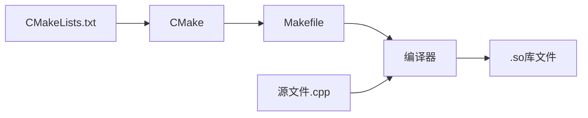
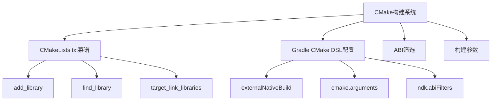

# 21.1.99 Cmake

星光如瀑。

帐篷的纱窗掀开着，让夜晚的凉风能透进来。洛芙跪坐在睡袋上，手肘撑在膝盖上，托着腮帮子。帐篷顶是透明的夜视天窗，星星一颗一颗地冒出来，像是有人在看不见的地方 gradually 点亮一盏盏小灯。

“今天的星星真漂亮啊。”伊莎靠在抱枕上，眯着眼睛看天。

“在想什么呢？”希尔已经从背包里掏出了笔记本，屏幕的光映在她脸上。

洛芙犹豫了一下：“我在想……我们今天学了图片压缩，那代码本身呢？我记得之前用过什么NDK之类的，说是可以写C++代码？那些代码是怎么变成App里能跑的东西的？”

黛琳正在整理数据线，听到这话手上动作停了停：“你问到点子上了。”

“怎么说？”洛芙眼睛亮了一下。

“C++代码不能直接跑，需要**编译**。”黛琳把数据线卷好，“在Android里，我们用CMake来干这件事。”

“Sea Make？”洛芙发音有点奇怪。

“CMake，”黛琳笑了，“C Make，全称是'C Make'。不是海洋的sea，是C语言的make。”

“make我听说过！”洛芙举手，“是不是就是那个很多命令行里都会出现的make？”

“对，”黛琳点点头，“make是一个经典的构建工具，但写起来比较繁琐。CMake是它的升级版，可以用更简洁的脚本生成make文件，然后让make去干具体的编译活儿。”

希尔把笔记本转过来，屏幕上是Android Studio的项目结构：“看，这里有个cpp文件夹，里面就是C++源代码。”

洛芙探过头去，看到几个后缀名为.cpp和.h的文件。

“这些就是原生代码？”洛芙问。

“对，也叫native code，”希尔说，“Java或者Kotlin在虚拟机里跑，但这些C++代码需要编译成机器能直接认识的指令。”

“那……怎么编译呢？”洛芙继续问。

“这就要说到我们今天的主角了，”黛琳打开一张图，“CMakeLists.txt。”

---

### 什么是CMake

黛琳在白板上写下几个大字：CMakeLists.txt。

“这个文件就像一份菜谱，”黛琳解释，“它告诉CMake：我们要编译哪些源文件？输出什么？需要链接哪些库？用什么编译选项？”

“菜谱……”洛芙想了想，“那是不是就像我们露营的时候，要先决定做什么菜，然后列出食材清单，再按照步骤来？”

“差不多是这个意思，”黛琳点点头，“而且CMake会帮我们处理很多繁琐的事情，比如不同平台的差异啊，库的路径啊之类的。”

伊莎插话道：“就像露营时要根据天气选场地一样，CMake也会根据目标设备的情况调整编译策略。”

洛芙似懂非懂地点点头：“那……能不能看一下这个菜谱长什么样？”

希尔从项目里找出一个CMakeLists.txt，投射到帐篷里的小投影仪上。

```cmake
cmake_minimum_required(VERSION 3.18.1)

# 项目名称
project("mynativeapp")

# 添加一个库
add_library(
    native-lib
    SHARED
    native-lib.cpp
)

# 找到系统日志库
find_library(
    log-lib
    log
)

# 链接库
target_link_libraries(
    native-lib
    ${log-lib}
)
```

“哇……”洛芙盯着屏幕，“这就是CMake的语法？看起来好像Python啊。”

“确实有点像，”希尔说，“不过它有自己的规则。你看第一行，cmake_minimum_required指定了最低版本；第二行project给项目起名字；第三行的add_library是说我们要生成一个库，native-lib是库名，SHARED表示是动态库，后面的是源文件。”

“动态库？”洛芙捕捉到一个新词。

“简单说，动态库就是App运行时才加载的代码，”黛琳解释，“对应的是静态库，直接编译进App里。各有各的用法。”

洛芙继续看下面的部分：“find_library又是找库？log是什么？”

“Android系统有个日志系统，叫logcat，”希尔说，“我们要往里面写日志，就得链接这个库。find_library就是帮我们找到系统提供的这个库。”

“原来如此，”洛芙点头，“那最后这个target_link_libraries是把库连起来？”

“对，”黛琳说，“就像把所有食材按顺序放进锅里，target_link_libraries把我们写的native-lib和系统日志库链接在一起，生成最终能跑的库文件。”

---

### 在Gradle里配置CMake

“那……怎么让Android Studio知道要用CMake呢？”洛芙问。

“这就要在build.gradle里配置了，”黛琳切换到一个新页面，“Android Gradle插件提供了一整套CMake DSL，专门用来配置原生构建。”

她指向一段配置：

```kotlin
android {
    ...
    defaultConfig {
        ndk {
            // 指定ABI
            abiFilters += listOf("armeabi-v7a", "arm64-v8a", "x86", "x86_64")
        }
    }
    
    externalNativeBuild {
        cmake {
            path = file("src/main/cpp/CMakeLists.txt")
            version = "3.18.1"
        }
    }
}
```

“这里有几个关键点，”黛琳讲解起来，“externalNativeBuild.cmake就是CMake的配置块。path指定CMakeLists.txt在哪里，version指定CMake的版本。”

“abiFilters是什么？”洛芙问。

“ABI是Application Binary Interface的缩写，”黛琳说，“你可以理解为CPU指令集。不同的手机用不同的CPU：有的用ARM，有的用x86。abiFilters就是告诉构建系统，我们要为哪些CPU生成库。”

“原来手机CPU也有区别啊，”洛芙感叹。

“区别大了，”希尔说，“主流是ARM，高端机用arm64-v8a，中端用armeabi-v7a，有的模拟器用x86。生成对应的库，App才能在那些手机上跑。”

洛芙看着配置里的几个名词：“armeabi-v7a、arm64-v8a……好复杂。”

“不用全记住，”黛琳安慰她，“常用的就这几个：arm64-v8a是64位ARM，armeabi-v7a是32位ARM，x86和x86_64主要是模拟器用。实际开发中，ndk.abiFilters一般就够用了。”

“如果我想给CMake传一些参数呢？”洛芙又问。

黛琳指了指另一段配置：“看这里，可以用cmake.arguments来传递。”

```kotlin
cmake {
    path = file("src/main/cpp/CMakeLists.txt")
    version = "3.18.1"
    
    arguments += listOf(
        "-DANDROID_ARM_NEON=ON",
        "-DANDROID_PLATFORM=android-24",
        "-DANDROID_TOOLCHAIN=clang"
    )
}
```

“这些参数都是什么意思？”洛芙问。

“-D是CMake定义变量的语法，”黛琳解释，“ANDROID_ARM_NEON=ON是启用NEON指令集，可以让ARM处理器跑得更快；ANDROID_PLATFORM指定目标Android版本，这里是android-24；ANDROID_TOOLCHAIN指定用哪个编译器工具链，clang是目前Android推荐用的。”

“编译器还有区别？”洛芙好奇。

“有，GCC是老的，clang是新的，”希尔说，“Google现在主推clang，GCC已经不推荐使用了。”

---

### CMake的构建流程

洛芙盯着投影仪看了一会儿冷不丁地问：“那CMake到底是怎么工作的？我还是有点晕。”

黛琳想了想，在白板上画了起来：



“你看，”黛琳指着图解释，“CMake首先读取CMakeLists.txt这个菜谱，然后生成Makefile这个详细的工作清单，最后编译器根据Makefile把C++源文件编译成.so库文件。”

“.so是什么？”洛芙问。

“Shared Object，共享库，”黛琳说，“在Linux和Android系统里，这种格式的库文件后缀就是.so。App运行的时候，系统会加载这些.so文件里面的代码。”

“原来是这样，”洛芙点头，“那……如果我们有多个源文件怎么办？”

“在CMakeLists.txt里添加就行了，”希尔演示了一下，“比如这样：”

```cmake
# 添加多个源文件
add_library(
    native-lib
    SHARED
    native-lib.cpp
    utils.cpp
    math-helper.cpp
)
```

“或者更聪明的方式，”黛琳补充，“用file命令自动收集所有源文件：”

```cmake
# 自动收集所有cpp文件
file(GLOB SOURCES 
    "${CMAKE_CURRENT_SOURCE_DIR}/*.cpp"
)

add_library(
    native-lib
    SHARED
    ${SOURCES}
)
```

“这样就不用一个个写了？”洛芙问。

“对，”黛琳说，“不过GLOB有个小问题：如果用IDE打开项目，新增文件可能不会自动被识别，需要刷新一下CMake。但对于小项目来说，手动列出来更可控。”

---

### 常见问题和反模式

“有没有什么容易犯的错？”洛芙问。

“有几个典型的，”黛琳说，“第一个是版本不匹配。”

她举了个例子：

```kotlin
// 错误示例：CMake版本和插件版本不匹配
cmake {
    version = "3.10.0"  // 太旧了
    path = file("CMakeLists.txt")
}
```

“CMake版本太旧会有问题，”黛琳解释，“有些新特性用不了，还可能遇到奇怪的bug。推荐用3.18.1以上的版本。”

“第二个常见错误是ABI过滤遗漏，”希尔说，“比如只指定了arm64-v8a，但用户手机是armeabi-v7a，就会因为找不到对应的库而崩溃。”

```kotlin
// 反模式：只指定一个ABI
ndk {
    abiFilters += listOf("arm64-v8a")  // 错误！丢失其他ABI的用户
}

// 正解：覆盖所有主流ABI
ndk {
    abiFilters += listOf("armeabi-v7a", "arm64-v8a", "x86", "x86_64")
}
```

“第三个是忘记链接库，”黛琳说，“编译的时候找不到符号定义。”

```kotlin
# 反模式：忘记链接库
add_library(native-lib SHARED native-lib.cpp)
# 编译能通过，但运行时会崩溃

# 正解：链接需要的库
target_link_libraries(native-lib log android)
```

“log是日志，android是什么？”洛芙问。

“Android系统的基础库，”黛琳说，“包含很多系统级的函数，native开发几乎都会用到。”

---

### 调试原生代码

“那……如果编译出来的库跑不起来怎么办？”洛芙问。

“好问题，”希尔说，“Android Studio提供了NDK调试功能。”

她打开一个调试配置界面：“看，这里可以选择调试类型。如果是原生代码，就选'Native'模式。”

“调试的时候和Java代码一样吗？”洛芙问。

“差不多，”希尔说，“可以设断点，看变量值。不过原生代码调试需要生成带调试符号的库。”

```cmake
# 调试构建
set(CMAKE_BUILD_TYPE Debug)

# 发布构建
set(CMAKE_BUILD_TYPE Release)
```

“Debug模式会包含调试信息，库文件会大一些，”黛琳解释，“Release模式会优化，文件更小，但调试困难。”

洛芙若有所思：“那……我能不能同时生成两种版本？”

“可以的，”黛琳说，“通过构建变体。比如debug版本用Debug配置，release版本用Release配置。”

---

### 实际案例：游戏引擎的原生库

“说了这么多，”伊莎轻声开口，“能不能举个实际的例子？”

黛琳点点头：“比如游戏引擎，很多核心逻辑都是用C++写的，为了性能嘛。像Unity、Unreal这种引擎，都会生成对应平台的原生库。”

“游戏……”洛芙眼睛亮了，“那岂不是说，我们玩的手游，里面大部分代码都是原生编译的？”

“对，”黛琳说，“尤其是大型游戏，原生代码占比很高。App Store或者Google Play分发的时候，只会包含用户设备对应的ABI库，这样包体更小。”

“所以BundleTexture也是做这个的？”洛芙问。

“异曲同工，”黛琳说，“BundleTexture管图片纹理，CMake管原生代码，都是优化App包体和性能的手段。”

洛芙长出一口气：“今天信息量好大啊。”

“慢慢来，”伊莎柔声说，“先知道CMake是干什么的，能配置基本的CMakeLists.txt，就已经很好了。”

帐篷外传来一阵蛙鸣，此起彼伏的，像是夏夜的交响乐。

---

### 章节知识点回顾



“好啦，”黛琳收起白板笔，“今天就到这里吧。CMake是Android原生开发的核心，学会配置CMakeLists.txt和Gradle DSL，以后再学NDK就方便多了。”

洛芙揉了揉眼睛：“感觉又打开了一扇新大门。”

“加油吧，”希尔打了个哈欠，“改天我们可以用NDK写个简单的C++函数，体会一下native开发的乐趣。”

星空依旧明亮。帐篷里的灯渐暗，女孩们相继睡去。

---

> 本章主要介绍了Android CMake构建系统的配置方法。通过CMakeLists.txt定义构建规则，使用Gradle的CMake DSL进行配置，可以编译C/C++原生代码生成.so库文件供App使用。关键点包括：CMakeLists.txt的基本语法（add_library、find_library、target_link_libraries）、Gradle中的externalNativeBuild.cmake配置、ABI筛选（abiFilters）、构建参数传递（arguments）、以及常见的反模式和调试方法。掌握这些内容后，开发者可以在Android项目中集成原生代码，利用C/C++的性能优势构建高性能应用。

---

> **学习建议**：建议先在Android Studio中创建一个包含C++支持的新项目，观察自动生成的CMakeLists.txt和Gradle配置，尝试修改ABI筛选条件和构建参数，体验实际的编译过程。CMake的学习曲线较陡，但掌握基础配置后，深入学习NDK开发会变得顺理成章。

---

## 洛芙的小小日记本

今天学了CMake！原来App里的C++代码是这样被"烹饪"出来的——CMakeLists.txt是菜谱，CMake是厨师，编译器是灶台。一套流程下来，原生代码就变成了手机能跑的.so库文件。好神奇！明天想试试自己写个简单的C++函数玩一玩~ 🌙

---

## 今日关键词

**CMake** - 跨平台的构建系统生成工具，用于管理C/C++代码的编译过程。CMake通过读取CMakeLists.txt生成Makefile，再由编译器执行实际编译。

**CMakeLists.txt** - CMake的配置文件，定义了项目名称、源文件、库链接、编译选项等构建规则，是native开发的"菜谱"。

**add_library()** - CMake命令，用于添加一个库目标。参数包括库名、类型（SHARED/STATIC）、源文件列表。

**find_library()** - CMake命令，用于查找系统预置的库，如Android的log库。

**target_link_libraries()** - CMake命令，用于将库链接到目标，生成最终的可执行文件或共享库。

**ABI (Application Binary Interface)** - 应用二进制接口，定义了CPU指令集。常见的有armeabi-v7a（32位ARM）、arm64-v8a（64位ARM）、x86、x86_64。

**ndk.abiFilters** - Gradle NDK配置项，用于指定App支持哪些ABI，构建时只会生成对应平台的库文件。

**externalNativeBuild** - Android Gradle插件的配置块，用于配置CMake或NDK-Build等外部原生构建工具。

**.so (Shared Object)** - Linux/Android系统的动态库文件格式，原生C/C++代码编译后的产物，App运行时由系统加载。

**clang** - LLVM项目的前端编译器，Google目前推荐用于Android NDK的编译器工具链。
