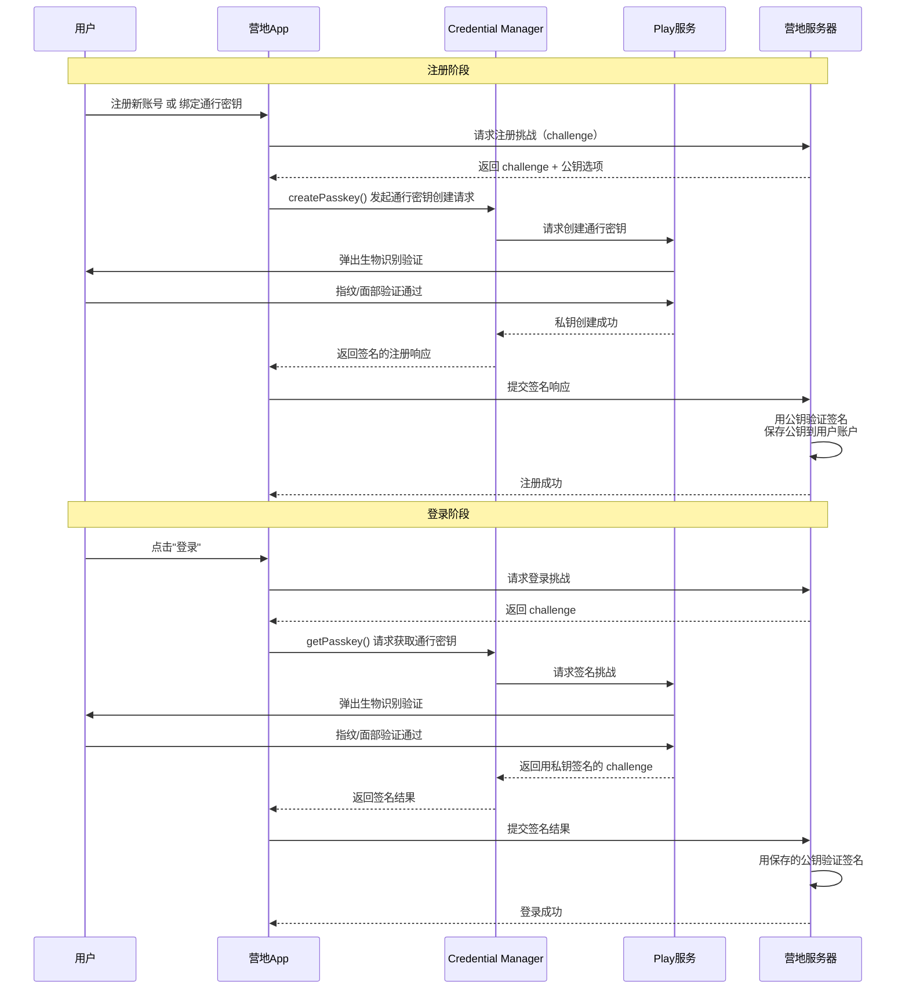
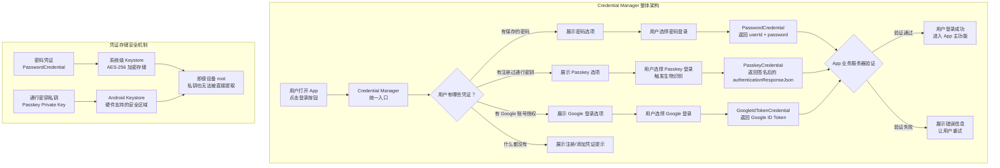

# 3.1.1 身份

篝火已经烧得只剩一小堆红彤彤的余烬了。

希尔往火堆里又添了两根干树枝，火苗"呼"地一下又蹿高了些，橙红色的光在四个人脸上跳动着。夜风从湖面上吹过来，带着一点点潮湿的凉意，把刚才热可可的香气吹散在空气里。

"讲完权限，"洛芙抱着膝盖，下巴搁在膝盖上，"我突然想到一个问题。"

"什么？"伊莎把保温壶的盖子拧紧。

"我们这个营地App，"洛芙说，"现在有拍照功能、营地位置记录功能……但一直都没做登录。那些照片都是存在本地的——如果用户换了一部手机，数据不就全没了吗？"

希尔把笔记本电脑合上，屏幕的冷光消失了，篝火的暖光重新成为现场唯一的光源。

"你说到了点子上。"她说，"没有账号体系的App，数据只能跟着设备走。但真正的营地App——比如那些能同步营地预约、能分享照片到云端的——必须有用户身份系统。"

"用户身份……"洛芙重复了一遍这个词。

"就是'这个App怎么知道你是谁'。"黛琳说，"Android 为这个问题提供了一整套官方解决方案，叫做 Credential Manager——凭证管理器。"

"听起来是个保险箱。"伊莎说。

"比保险箱更聪明。"黛琳微笑，"它不只存东西，还会帮你'认出'用户。"

---

## 一、从保险箱开始：什么是凭证管理器

希尔重新打开笔记本电脑，但没有把屏幕转向大家，而是转成了纵向，放在膝盖上。

"你们知道浏览器保存密码那个功能吗？"她问。

"知道！"洛芙点头，"Chrome 会在你登录的时候问'要不要保存密码'，下次再进同一个网站就会自动填进去。"

"Android 上也有类似的东西，叫 Smart Lock for Passwords。"希尔说，"Google 做的，能跨 App 保存和填写密码。你在豆瓣登录过一次，下次打开爱奇艺，如果两者都用同一个 Google 账号，密码就能自动同步过来。"

"那不是很不安全吗？"洛芙皱眉，"密码存在云上……"

"所以 Google 后来做了一个很大的升级。"黛琳说，"把 Smart Lock 升级成了 Credential Manager——凭证管理器。不只是存密码，还支持通行密钥（Passkey），以及联合登录（Federated Sign-in）。"

"通行密钥是什么？"洛芙问。

"你把它想象成一把'活的钥匙'。"伊莎说，"普通密码是你自己设定的一串字符，通行密钥是一对数学钥匙——一把公钥存在服务器上，一把私钥存在你手机里。登录的时候，手机里的私钥会'签名'一个挑战，证明你就是你。"

"整个过程你不需要输入任何文字。"希尔补充，"打开 App，点登录，手机弹出指纹或面部识别——验证通过，直接进。"

"比密码安全，因为私钥永远不会离开你的设备。"黛琳说，"也比密码方便，因为不需要记。"

洛芙想了想："所以 Credential Manager 就是……一个统一的地方，管理所有的'身份证明'？"

"对。"黛琳点头，"密码、通行密钥、Google 账号登录——全在一个入口。用户不需要记住每个 App 不同的登录方式，Credential Manager 全部帮你搞定。"

---

## 二、三种登录方式的统一入口

希尔把屏幕转过来，让大家都能看到。她打开了一个文档页面，是 Android 官方关于 Credential Manager 的说明。

"官方文档说，Credential Manager 支持三种主要的认证方式。"她指着屏幕上的列表：

"第一种，密码（Password）——最传统的，用户输入用户名和密码，Credential Manager 可以保存和自动填写。"

"第二种，通行的密钥（Passkey）——基于公钥加密的现代认证方式，不需要输入密码。"

"第三种，联合登录（Federated Sign-in）——比如'用 Google 账号登录'、'用 GitHub 登录'这种方式，用户授权给一个第三方账号，第三方再告诉 App'这个人是我确认过的'。"

"第一种我理解，"洛芙说，"但通行密钥和联合登录有什么区别？"

"通行密钥是你和这个 App 之间的事。"黛琳说，"公钥存在这个 App 的服务器上，私钥存在你手机里。没有任何第三方参与。"

"联合登录是有第三方参与的。"希尔说，"比如'用 Google 登录'，实际上是 Google 在帮你确认身份，然后 Google 把这个确认结果告诉 App。App 相信 Google，所以让你进去了。"

"通行密钥的私钥只有你自己知道，"伊莎说，"联合登录的确认权在 Google 手里。本质上，这两者的信任链条不一样。"

洛芙点了点头："那 Credential Manager 把这三种方式统一起来，对开发者来说有什么好处？"

"最大的好处是 UI 统一。"黛琳说，"以前 Android 没有统一的登录界面，密码登录要自己写 UI，Google 登录要用 Google 提供的按钮……样式不一样，用户要适应不同的交互。"

"Credential Manager 提供了一个标准的底部弹窗，"希尔打开了一个模拟界面，"所有认证方式都在里面，用户点一下就能选。"

她用手机模拟器截了一张图，展示了一个Credential Manager的登录界面：

```
┌────────────────────────────────────────┐
│  🔑 登录                                │
│  营地App                                 │
│                                        │
│  ┌──────────────────────────────────┐  │
│  │  🔐  使用通行密钥登录              │  │
│  │      用指纹或面部识别             │  │
│  └──────────────────────────────────┘  │
│                                        │
│  ┌──────────────────────────────────┐  │
│  │  👤  使用 Google 登录              │  │
│  │      lfv-camp@email.com          │  │
│  └──────────────────────────────────┘  │
│                                        │
│  ┌──────────────────────────────────┐  │
│  │  🔑  使用保存的密码登录            │  │
│  │      用户名：lfv_user            │  │
│  └──────────────────────────────────┘  │
│                                        │
│         取消                            │
└────────────────────────────────────────┘
```

"看，所有选项都在一个界面里。"希尔说，"用户不需要记密码，也不需要找 Google 登录按钮在哪里。"

"这就是官方说的'一次点击即可登录'。"黛琳说，"用户在任何一个接入了 Credential Manager 的 App 里，都可以用同一个界面完成认证。"

---

## 三、从零开始：集成Credential Manager的骨架代码

"那怎么集成到我们的营地App里？"洛芙问，"现在就加登录功能吗？"

"还不到时候。"希尔摇头，"我们先把骨架搭好，知道怎么调用 API。今天主要搞懂 Credential Manager 怎么工作。"

她开始敲代码，同时把思路讲给大家听：

"集成 Credential Manager，第一步是加依赖。"希尔说，"Credential Manager 是一个 Jetpack 库，要先在 `build.gradle` 里加上。"

```kotlin
// build.gradle (app level)
// 依赖版本建议使用最新稳定版，这里用变量管理
dependencies {
    // Credential Manager 是 Android 官方推荐的认证库
    // 需要 Android 5.0+ (API 21)
    implementation("androidx.credentials:credentials:1.12.0")

    // Play Services 的 Credential Manager 扩展（支持通行密钥）
    // 如果需要通行密钥功能，需要这个
    implementation("androidx.credentials:credentials-play-services-auth:1.12.0")

    // Lifecycle，用于在配置变更时保持登录状态
    implementation("androidx.lifecycle:lifecycle-runtime-ktx:2.7.0")
}
```

"这两个库有什么区别？"洛芙问。

"`credentials` 是核心库，支持所有基本功能。"希尔说，"`credentials-play-services-auth` 是 Google Play 服务的扩展，专门处理通行密钥（Passkey）的公钥注册和挑战签名——因为通行密钥涉及到和 FIDO2 服务器的交互，这部分由 Play 服务提供支持。"

"如果只做密码登录和联合登录，用核心库就够了。"黛琳补充，"如果要支持 Passkey，才需要加第二个库。"

---

## 四、密码登录：保存与自动填写

"好，现在假设我们要支持密码登录。"希尔说，"用户输入用户名和密码，App 把凭证保存到 Credential Manager，下次打开 App 自动填写。"

她写出了一个基础的密码保存流程：

```kotlin
// 密码保存示例（营地App）
// 当用户成功登录后，将凭证保存到 Credential Manager
import android.content.Context
import androidx.credentials.CreateCredentialRequest
import androidx.credentials.CredentialManager
import androidx.credentials.PasswordCredential
import kotlinx.coroutines.Dispatchers
import kotlinx.coroutines.launch
import kotlinx.coroutines.withContext

class LoginManager(private val context: Context) {

    private val credentialManager = CredentialManager.create(context)

    // 保存密码到 Credential Manager
    suspend fun savePasswordCredential(
        userId: String,      // 用户标识，如邮箱或用户名
        password: String     // 密码
    ) {
        // 构建密码凭证对象
        // PasswordCredential 是官方提供的结构，
        // 用于将用户名和密码保存到系统级凭证存储
        val passwordCredential = PasswordCredential(
            userId = userId,
            password = password
        )

        // 构建设保存请求
        // CreateCredentialRequest 告诉 Credential Manager
        // "我要保存一个凭证"
        val createRequest = CreateCredentialRequest(
            // 指定要保存的凭证类型
            credentialManager.createCredentialRequest(
                context = context,
                credential = passwordCredential,
                origin = null,      // 如果从 Activity 调用可填 null
                sessionId = null   // 如果需要会话标识可填 null
            )
        )

        // 发起保存请求
        // 系统会弹出 UI 让用户确认保存（可选）
        // 用户同意后，凭证会被加密存储到系统 Keystore
        try {
            withContext(Dispatchers.IO) {
                credentialManager.createCredential(
                    createCredentialRequest,
                    context,
                    null, // CancelableCallback，可为 null
                    java.util.concurrent.Executors.newSingleThreadExecutor()
                )
            }
            android.util.Log.d("LoginManager", "密码凭证保存成功: $userId")
        } catch (e: androidx.credentials.exceptions.CreateCredentialException) {
            // 保存失败：可能用户取消了，或存储已满
            android.util.Log.e("LoginManager", "密码保存失败: ${e.message}")
        }
    }
}
```

"这里出现了一个新的类——`CreateCredentialRequest`。"黛琳在白板上画出了它的结构，"它是一个请求容器，装着'我要保存什么类型的凭证'这个意图。Credential Manager 会根据凭证类型决定用哪种存储格式。"

"密码凭证会存在 Android 的 Keystore 里，"希尔补充，"这是一个系统级的安全存储区域，连 root 权限都很难直接读取。"

---

## 五、密码自动填写：从 Credential Manager 读取凭证

"保存了密码，下一步是让用户下次打开 App 时能自动登录。"希尔说，"这个过程叫'获取凭证'——Credential Manager 从存储里取出之前保存的数据。"

她写出了获取凭证的代码：

```kotlin
// 密码自动填写示例
// 当用户打开登录页面时，从 Credential Manager 获取保存的凭证
import androidx.credentials.GetCredentialRequest
import androidx.credentials.GetCredentialRequest as GetCredReq
import androidx.credentials.GetPasswordOption
import androidx.credentials.PasswordCredential
import androidx.credentials.exceptions.GetCredentialException

class CredentialGetter(private val context: Context) {

    private val credentialManager = CredentialManager.create(context)

    // 从 Credential Manager 获取保存的密码凭证
    suspend fun getSavedPassword(): PasswordCredential? {
        // 构建获取请求：只获取密码类型的凭证
        // GetPasswordOption 是官方提供的选项类，
        // 表示"我只想要之前用 PasswordCredential 保存的凭证"
        val passwordOption = GetPasswordOption()

        val getRequest = GetCredentialRequest(
            listOf(passwordOption)
        )

        return try {
            val result = withContext(Dispatchers.IO) {
                credentialManager.getCredential(
                    getRequest,
                    context,
                    null
                )
            }

            // result.credential 就是存储的凭证
            // 如果有保存的密码，返回一个 PasswordCredential
            // 如果没有保存的凭证，抛出 NoCredentialException
            when (val credential = result.credential) {
                is PasswordCredential -> {
                    android.util.Log.d(
                        "CredentialGetter",
                        "获取到密码凭证: ${credential.userId}"
                    )
                    credential
                }
                else -> {
                    android.util.Log.w("CredentialGetter", "凭证类型不匹配")
                    null
                }
            }
        } catch (e: GetCredentialException) {
            android.util.Log.w("CredentialGetter", "无保存的凭证: ${e.message}")
            null
        }
    }
}
```

"希尔，"洛芙举手，"`GetCredentialRequest` 里面为什么传一个 `List`，而不是单个选项？"

"好问题。"希尔说，"因为 Credential Manager 支持多种凭证类型——密码、通行密钥、Google 账号……传一个列表，系统会把所有可用的凭证选项都展示给用户。"

"比如用户保存过 Google 账号登录，也保存过密码——那这个请求会同时展示两个选项，用户自己选用哪个登录。"黛琳说，"这样用户的登录体验就完全统一了。"

"如果不传列表，只传 `GetPasswordOption`，"希尔补充，"那就只展示密码选项。用户没有保存密码的话，会直接回调失败——而不是展示空列表让用户愣住。"

---

## 六、通行密钥：从注册到登录的完整流程

"通行密钥比密码复杂一些，"黛琳说，"它的流程分两步——注册和认证。"

她在白板上画出了完整的流程图：



"这张图把通行密钥的逻辑画得很清楚。"希尔指着屏幕说，"关键点是——服务器只存公钥，私钥永远在用户的手机里。"

"这和密码登录完全不同。"黛琳说，"密码登录是服务器存着你的密码，登录时要传密码过去比对；通行密钥登录是服务器存着'锁'，你手机里拿着'钥匙'，服务器出一道题考你，钥匙用它自己的方式回答，锁验证这个回答是不是用对应的钥匙答的。"

"所以即使用户的密码数据库泄露，黑客也只能拿到公钥——公钥解不了密，也登不了录。"希尔说，"这就是通行密钥比密码安全的根本原因。"

---

## 七、三种认证方式的代码对比

"我来把三种方式的 API 调用放在一起做个对比。"希尔打开了一个新文件，开始敲：

```kotlin
// 三种认证方式的 API 对比
// 统一入口：CredentialManager.getCredential()

// ====== 方式一：密码凭证 ======
// 适用于：传统用户名+密码登录场景
// 用户在登录页面输入用户名和密码，App 保存到 Credential Manager
// 下次打开 App 自动获取并填入
val passwordOption = GetPasswordOption()
val passwordRequest = GetCredentialRequest(
    credentialOptions = listOf(passwordOption),
    origin = null
)
// 用户之前必须用 PasswordCredential 保存过凭证
// 如果没有保存过 → 回调 GetCredentialException

// ====== 方式二：通行密钥（Passkey） ======
// 适用于：现代无密码认证场景
// 用户首次注册时生成密钥对，登录时用生物识别验证身份
// 不需要输入任何文字
val passkeyOption = GetPasskeyOption(
    challenge = serverChallenge,      // 服务器下发的随机挑战
    rpId = "camp.example.com",         // 依赖方ID，通常是域名
    userDisplayName = "lfv_user",       // 用户显示名
    timeout = 120,                      // 超时时间（秒）
    allowedTransports = listOf(
        HardwareAuthenticationBundle.AUTHENTICATOR_BLE,
        HardwareAuthenticationBundle.AUTHENTICATOR_NFC,
        HardwareAuthenticationBundle.AUTHENTICATOR_SECURITY_KEY
    )
)
val passkeyRequest = GetCredentialRequest(
    credentialOptions = listOf(passkeyOption),
    origin = null
)
// 通行密钥需要用户在设备上首次注册
// 如果没有注册过 → 回调 CredentialManagerException

// ====== 方式三：联合登录（Google 账号） ======
// 适用于：第三方账号登录场景
// 用户点击"用 Google 登录"，App 调用 Google 授权流程
// 授权成功后将 Google 返回的 ID token 提交给自己的服务器
val googleIdOption = GetCredentialOption(
    provider = GetGoogleIdTokenCredentialOption.PROVIDER,
    filter = listOf(GetGoogleIdTokenCredentialOption.SUGGESTED_ACCOUNT_NAME_KEY),
    // SUGGESTED_ACCOUNT_NAME_KEY 建议使用哪个 Google 账号
    // 如果用户有多个 Google 账号，可以提示用户选择
)
val googleRequest = GetCredentialRequest(
    credentialOptions = listOf(googleIdOption),
    origin = null
)
// 联合登录不需要在 Credential Manager 里预先保存
// 它会调起 Google 授权流程，获取 Google ID Token
// App 将 ID Token 提交给自己的服务器验证

// ====== 统一获取 ======
// 无论哪种方式，都用同一个 API 获取
val result = credentialManager.getCredential(
    request = request,  // 以上任意一种 request
    context = context,
    activity = activity // 需要 Activity 上下文才能调起 UI
)

// result.credential 的类型取决于 request 传了什么
// 可能是 PasswordCredential / PasskeyCredential / GoogleIdTokenCredential
```

"三种方式的 API 形状是一样的，但返回的 `credential` 类型完全不同。"希尔说，"代码里要分别处理这三种类型。"

"怎么判断是哪种类型？"洛芙问。

"用 `is` 判断。"黛琳说，"Kotlin 的 smart cast 会帮你把类型转换好，代码里可以直接用对应类型的属性。"

"比如 `credential is PasswordCredential`，就可以读 `credential.userId` 和 `credential.password`；如果是 `credential is PasskeyCredential`，就有 `credential.authenticationResponseJson`——这个 JSON 要发回服务器验证。"

---

## 八、反模式：混用多种认证框架

"我来说一个我以前踩过的坑。"希尔换了个坐姿，把笔记本电脑翻到新的一页，"刚开始做登录功能的时候，我把三种登录方式分开写了三套逻辑——密码用 Credential Manager，Google 登录用 Google 官方库，Facebook 登录用 Facebook SDK。"

"三个 SDK，登录按钮三个样式，每次改 UI 要改三个地方。"伊莎说。

"对。"希尔说，"而且每次调登录 UI，三种方式的行为完全不一样——密码弹的是一个样式，Google 弹的是 Google 自己的登录页，Facebook 又是一个新的。用户体验很割裂。"

她在空白页上写出那段有问题的代码：

```kotlin
// ❌ 反模式：三种登录方式分别独立调用
class BadLoginActivity : AppCompatActivity() {

    // 密码登录：自己写的 UI，自己保存
    private fun showPasswordLogin() {
        val dialog = AlertDialog.Builder(this)
            .setTitle("登录营地App")
            .setView(R.layout.dialog_password_login)
            .create()
        dialog.show()
    }

    // Google 登录：Google 官方按钮
    private fun launchGoogleSignIn() {
        // Google Sign In Button 是一个单独的 View
        // 它的样式由 Google 控制，和 App 风格不一致
        val gso = GoogleSignInOptions.Builder(
            GoogleSignInOptions.DEFAULT_SIGN_IN
        ).requestIdToken("SERVER_CLIENT_ID").build()

        val googleSignInClient = GoogleSignIn.getClient(this, gso)
        startActivityForResult(
            googleSignInClient.signInIntent,
            RC_GOOGLE_SIGN_IN
        )
    }

    // Facebook 登录：Facebook SDK
    private fun launchFacebookSignIn() {
        // Facebook Login Button 也是一个单独的 View
        // 两个第三方按钮的样式放在一起，非常不协调
        LoginManager.getInstance().logInWithReadPermissions(
            this,
            listOf("email", "public_profile")
        )
    }

    // 结果回调也是三套……维护成本极高
    override fun onActivityResult(
        requestCode: Int, resultCode: Int, data: Intent?
    ) {
        super.onActivityResult(requestCode, resultCode, data)

        when (requestCode) {
            RC_GOOGLE_SIGN_IN -> handleGoogleSignIn(data)
            // Facebook 登录也有自己的 requestCode
            // 密码登录在 dialog 里直接处理
        }
    }
}
```

"这段代码的问题是——三种登录方式各自为政，没有统一的入口。"希尔说，"UI 不统一，代码不统一，维护成本极高。"

"正确做法是什么？"洛芙问。

"全部统一到 Credential Manager。"黛琳说，"Google 登录、Facebook 登录，只要提供了对应 `GetCredentialOption` 的 SDK，都能接进来。所有登录选项在一个底部弹窗里，用户自己选。"

"而且回调也统一了——不管用户选哪种方式，最后都通过 `credentialManager.getCredential()` 返回，代码里统一处理 `result.credential` 的类型判断即可。"

```kotlin
// ✅ 正确做法：统一用 Credential Manager 管理所有登录方式
class GoodLoginActivity : AppCompatActivity() {

    private val credentialManager = CredentialManager.create(this)

    // 统一的登录入口
    private fun launchCredentialLogin() {
        lifecycleScope.launch {
            val credentials = getAvailableCredentials()
            if (credentials.isNotEmpty()) {
                // 有可用的凭证，直接获取
                getCredential(credentials)
            } else {
                // 没有保存的凭证，展示注册选项
                showRegistrationOptions()
            }
        }
    }

    // 获取所有可用的凭证选项
    private fun getAvailableCredentials(): List<GetCredentialOption> {
        return listOf(
            // 密码
            GetPasswordOption(),
            // 通行密钥
            GetPasskeyOption(
                challenge = serverChallenge,
                rpId = "camp.example.com",
                userDisplayName = ""
            ),
            // Google 联合登录
            GetGoogleIdTokenCredentialOption(
                provider = PROVIDER_GOOGLE_ID_TOKEN,
                filter = listOf(SUGGESTED_ACCOUNT_NAME_KEY)
            )
        )
    }

    // 统一获取凭证
    private suspend fun getCredential(options: List<GetCredentialOption>) {
        val request = GetCredentialRequest(
            credentialOptions = options
        )

        try {
            val result = credentialManager.getCredential(
                request = request,
                context = this@GoodLoginActivity,
                activity = this@GoodLoginActivity
            )

            // 统一处理结果：三种类型统一入口
            handleCredentialResult(result.credential)
        } catch (e: GetCredentialException) {
            handleCredentialError(e)
        }
    }

    // 统一处理凭证结果
    private fun handleCredentialResult(credential: Credential) {
        when (credential) {
            is PasswordCredential -> {
                // 密码登录
                validateAndLogin(credential.userId, credential.password)
            }
            is PasskeyCredential -> {
                // 通行密钥登录
                val responseJson = credential.authenticationResponseJson
                submitPasskeyToServer(responseJson)
            }
            is GoogleIdTokenCredential -> {
                // Google 登录
                val token = credential.tokenId
                submitGoogleTokenToServer(token)
            }
        }
    }
}
```

"这样一来，"希尔指着屏幕说，"不管用户有多少种登录方式，App 只需要维护一个入口——`getCredential()`。结果处理的代码也是统一的 `when` 分支。"

"如果以后要加新的登录方式，比如 GitHub 联合登录，"黛琳补充，"只需要在 `getAvailableCredentials()` 里加一行代码，不需要改任何业务逻辑。这就是统一 API 的威力。"

---

## 九、从旧版迁移到Credential Manager

"现在我们的营地App用的是旧版登录，"希尔说，"用的是 `GoogleSignInClient`，那个 API 已经在慢慢淘汰了。官方推荐迁移到 Credential Manager。"

"迁移麻不麻烦？"洛芙问。

"不麻烦。"黛琳说，"核心变化是把'Google 登录 SDK 的 API 调用'替换成'Credential Manager 的 `GetGoogleIdTokenCredentialOption`'，业务流程是一样的。"

"但有几个地方要注意。"希尔在白板上列出了迁移要点：

```
┌─────────────────────────────────────────────────────────────────┐
│  从旧版 Google 登录迁移到 Credential Manager                    │
│                                                                 │
│  旧版（GoogleSignInClient）：                                    │
│  → 使用 GoogleSignInClient.signIn() 启动 Intent                │
│  → 在 onActivityResult 回调里拿到 GoogleSignInAccount          │
│  → 用 account.idToken 做身份验证                                │
│  → 样式由 Google SDK 控制，不能自定义                             │
│  → 不同版本的 Google Play 服务可能有兼容性问题                    │
│                                                                 │
│  新版（Credential Manager + GetGoogleIdTokenCredentialOption）：│
│  → 使用统一的 getCredential() API                               │
│  → UI 样式由 Credential Manager 统一提供                         │
│  → 所有登录方式（密码、Passkey、Google）共用同一个底部弹窗         │
│  → 代码路径统一，维护成本降低                                    │
│                                                                 │
│  迁移步骤：                                                      │
│  1. 添加 androidx.credentials 依赖                               │
│  2. 在 getAvailableCredentials() 中加入 GetGoogleIdTokenOption   │
│  3. 处理回调时，将原来的 idToken 验证改为新 API 的 tokenId         │
│  4. 可以删掉 Google Play Services Auth 的旧依赖                  │
│  5. 保留服务器端验证逻辑（服务器仍然要验证 token）                  │
│                                                                 │
└─────────────────────────────────────────────────────────────────┘
```

"关键是服务器端验证逻辑不需要改。"希尔说，"不管用什么方式拿到的 token，服务器验证的方式是一样的。"

"这就是'瘦客户端，肥服务端'的设计。"黛琳说，"客户端只负责获取 token，真正验证身份的工作留给服务器。客户端不需要关心 token 是从 Google 拿的，还是从 GitHub 拿的——它们拿到 token 之后的处理方式完全一样。"

---

火堆又低了一些，只剩下几颗火星在灰烬里明明灭灭。

希尔往火堆里添了几根干草，火苗"噗"地一下又蹿起来，把四个人的脸映得橙红橙红的。

"等等，"洛芙突然说，"通行密钥那个图里，服务器要保存公钥……那我们营地App的服务器要做很多改造吗？"

"不需要。"黛琳说，"通行密钥的公钥验证是一个标准的 WebAuthn 协议，大部分后端框架都有现成的库。你只需要找一个合适的库，把公钥存起来，验证的时候调一下库就完成了。"

"大部分工作是后端的事。"希尔说，"我们 Android 端只需要调用 Credential Manager 的 API，把签名结果拿到，发给服务器，剩下的由服务器处理。"

"这就是 Android 的设计哲学——端上只做端上的事。"黛琳说，"凭证的创建、存储、认证——这些都是系统级别的功能，Android 已经帮你封装好了。App 不需要自己实现加密逻辑，不需要自己管理密钥，不需要自己设计登录 UI——这些都是 Credential Manager 的职责。"

"App 要做的，就是调用 API，然后等结果。"伊莎说，"就像露营的时候用电——发电、输电、配电都有人管好了，你只需要把插头插进插座。"

希尔噗嗤笑出声："伊莎的比喻永远这么……电气化。"

夜风又吹过来一阵，把火苗吹得东倒西歪。洛芙把手缩进袖子里，靠近了火堆一些。

"所以总结一下，"她说，"Credential Manager 就是 Android 提供的统一身份认证平台。它把密码、通行密钥、联合登录三种方式统一起来，给用户一个一致的登录体验，给开发者一个一致的 API。"

"对。"黛琳点头，"核心价值是三个——安全、方便、统一。"

"安全是因为通行密钥的私钥永远在用户手里，"希尔说，"方便是因为指纹/人脸识别替代了输入密码，统一是因为所有登录方式共用一个 UI 和一套 API。"

伊莎往火堆里扔了一颗栗子，栗子在灰烬里"啪"地裂开了。

"三种登录方式，"她慢慢地说，"就像三个不同的人来营地拜访——有的是走着来的，有的是开车来的，有的是坐船来的。但他们在门口都用同一张通行证。通行证才是真正的身份证明，不是来访方式。"

"……伊莎的比喻又来了。"希尔翻了个白眼，但嘴角是上扬的。

---

篝火在夜风中轻轻摇曳，像一盏温暖而坚定的灯。

四个人围坐在火边，烤栗子的香味飘散在空气里，和松针的味道混在一起。头顶的星星越来越亮了，湖面上的倒影和天上的星星连成一片，分不清哪些是真实的世界，哪些是倒影中的幻梦。

明天，她们会继续讨论身份认证的更多细节——通行密钥怎么注册，服务器怎么验证，Google 登录怎么迁移。

但今晚，这些已经足够了。

凭证管理器是 Android 提供的统一身份认证平台。它把密码、通行密钥、联合登录三种认证方式统一到一个入口，同时为用户和开发者提供了安全、方便、一致的体验。私钥永远留在用户设备上，由系统的 Keystore 保护；公钥存在服务器上用于验证签名。整个认证过程由系统级别的 API 驱动，App 只需要调用接口，无需自己实现加密或设计登录 UI。

仅此而已。

---

## 专业技术总结

> **Credential Manager（凭证管理器）定义**：Android 官方提供的 Jetpack API，作为统一入口管理所有用户身份认证方式，包括密码（PasswordCredential）、通行密钥（Passkey，基于公钥加密的现代无密码认证）和联合登录（Federated Sign-in，如 Google 账号登录）。Credential Manager 将认证流程标准化，为用户提供一致的登录 UI（底部弹窗），为开发者提供统一的 API，同时通过系统级 Keystore 保护私钥，确保安全性。

#### 结构图



#### 复杂度与影响

| 维度 | 影响 |
|------|------|
| **用户登录体验** | 统一 UI（底部弹窗）替代多个分离的登录界面，用户学习成本降低，转化率提升 |
| **开发维护成本** | 统一 API 替代多套 SDK，新增认证方式只需加一行代码，无需改变业务逻辑 |
| **安全性** | 通行密钥（Passkey）私钥存储在 Android Keystore，硬件级别保护；密码通过 AES-256 加密存储；联合登录 token 验证由服务器完成 |
| **迁移成本** | 从旧版 Google Sign-In 迁移到 Credential Manager 主要是客户端替换 API，服务器验证逻辑不变 |
| **兼容性** | Credential Manager 需要 Play 服务支持（通行密钥功能）；纯密码登录只需核心库 |

#### 反模式与陷阱

1. **三种登录方式各自独立实现（三个 SDK、三套 UI）** → 修复：统一使用 `credentialManager.getCredential()` 管理所有认证方式，在 `getAvailableCredentials()` 里配置所有选项，回调统一处理 `result.credential` 的类型判断
2. **通行密钥登录时不发服务器 challenge 直接调用** → 修复：通行密钥的 security by design 要求每次登录都要有服务器下发的随机 challenge；challenge 必须是一次性的，防止重放攻击；无 challenge 的 Passkey 调用会导致服务器验证失败
3. **Google ID Token 验证在客户端完成** → 修复：Google ID Token 的验证必须发送到自己的服务器，由服务器调用 Google 的 token 验证接口确认签名有效性；客户端验证无效，因为攻击者可以伪造响应数据

#### 设计哲学

**统一认证入口（Consolidated Authentication Entry Point）**：Credential Manager 的核心理念是用一套 API、一个 UI 管理所有身份认证方式。它不是"又一个新的登录服务"，而是"所有登录服务的统一调度层"。开发者不需要关心凭证从哪里来，只需要向 Credential Manager 发起请求，由系统决定如何展示选项、如何获取凭证、如何完成认证。

**隐私优先（Privacy by Design）**：Credential Manager 设计之初就把隐私作为核心原则。通行密钥的私钥永远在用户设备上，不经过任何第三方；密码凭证加密存储在系统级 Keystore 中，App 无法读取明文；联合登录需要用户明确授权才能获取 ID Token。

**渐进式信任（Progressive Trust）**：用户首次使用 App 时没有保存任何凭证，登录只能走传统的用户名密码或联合登录；随着使用次数增加，凭证被 Credential Manager 保存，用户下次登录可以直接选择更方便的 Passkey 或保存的密码。用户体验随着信任积累而持续优化。

#### 🏕️ 动手练习

**目标**：搭建一个支持密码保存与自动填写的登录界面，理解 Credential Manager 的基本使用流程。

**你需要做的事**：

1. 创建新项目（或使用现有营地 App 项目），在 `build.gradle` 中添加依赖：`implementation("androidx.credentials:credentials:1.12.0")`
2. 在 `AndroidManifest.xml` 中声明 `android:name="androidx.credentials.CredentialManager"`（可选，现代 Android 自动支持）
3. 创建两个 Activity：`LoginActivity`（登录页面）和 `MainActivity`（登录成功后的主页）
4. 在 `LoginActivity` 中实现密码保存功能：用户输入用户名+密码，点击"登录"按钮后，先调用 `validateCredentials()` 验证（这里用本地 mock 数据模拟），验证成功后调用 `credentialManager.createCredential()` 保存密码
5. 在 `LoginActivity.onStart()` 中实现密码自动获取：调用 `credentialManager.getCredential()`，如果有保存的密码则自动填入 EditText，如果没有则不做任何操作
6. 使用 Logcat 打印保存/获取的结果（`Log.d("CredentialDemo", ...)`），不要在 UI 上弹 Toast 干扰用户

**验收标准**：
- [ ] 项目能编译运行，点击"登录"后输入用户名和密码能成功登录并跳转 MainActivity
- [ ] 首次登录成功后，再次打开 App，能看到用户名和密码被自动填入（从 Credential Manager 读取）
- [ ] 点击"登录"后 Logcat 输出 `CredentialManager: 密码凭证保存成功` 或类似日志
- [ ] 卸载重装后，首次打开 App，EditText 为空（因为凭证随 App 一起删除了，这是预期行为）
- [ ] 代码中正确处理了 `GetCredentialException`（无保存凭证的情况）和 `CreateCredentialException`（保存失败的情况），不崩溃

**提示**：
```kotlin
// 保存凭证的关键代码骨架
val passwordCredential = PasswordCredential(
    userId = userIdEditText.text.toString(),
    password = passwordEditText.text.toString()
)
val createRequest = CreateCredentialRequest(
    listOf(passwordCredential),
    context = context
)
// 在协程中执行
lifecycleScope.launch {
    try {
        credentialManager.createCredential(createRequest, this@LoginActivity)
        Log.d("CredentialDemo", "密码保存成功")
        navigateToMain()
    } catch (e: CreateCredentialException) {
        Log.e("CredentialDemo", "保存失败: ${e.message}")
        // 即使保存失败，登录仍然应该成功（凭证保存是附加功能）
        navigateToMain()
    }
}
```

> 学习建议

Credential Manager 是 Android 身份认证的集大成之作——它不是凭空创造的，而是站在密码管理、通行密钥、联合登录三座山峰的肩膀上。理解它最好的方式不是直接啃 API 文档，而是先问自己一个问题：如果我要做一个登录功能，我会遇到哪些问题？密码怎么安全存储？用户怎么不输密码也能登录？换了手机凭证还在不在？当你带着这些问题去看 Credential Manager 的设计，你会明白它为什么要这样设计——每一个 API 的存在，都是为了解决一个真实存在的安全问题。不要只学 API 的用法，要理解 API 背后的安全假设。

## 洛芙的小小日记本

今天学的是身份认证——听起来很复杂，但其实 Credential Manager 就是把所有登录方式统一起来管理。伊莎说"通行密钥就像活的钥匙"，我很喜欢这个说法。私钥在手机里，公钥在服务器上，登录的时候它们自己对话验证，服务器说"行"，我就进去了。很神奇，也很好看。

## 今日关键词

**Credential Manager**：Android 官方 Jetpack API，作为统一入口管理所有身份认证方式，支持密码、通行密钥和联合登录，提供一致的 UI 和 API。

**PasswordCredential**：官方提供的密码凭证类，用于将用户名和密码保存到系统级 Keystore，或从中读取保存的密码。

**Passkey（通行密钥）**：基于公钥加密的现代认证方式，私钥存储在用户设备 Keystore 中，登录时通过生物识别验证身份，无需输入密码。

**GetCredentialRequest**：Credential Manager 的凭证获取请求类，包含一个 `credentialOptions` 列表，可同时请求多种凭证类型。

**GetPasswordOption**：凭证选项类，表示"我只要密码类型的凭证"，用于密码自动填写场景。

**GetPasskeyOption**：凭证选项类，表示"我要通行密钥认证"，需要服务器下发 challenge 参数。

**GetGoogleIdTokenCredentialOption**：凭证选项类，表示"我要 Google 账号联合登录"，用于 Google Sign-In 迁移场景。

**CreateCredentialRequest**：凭证创建请求类，用于将新凭证（密码等）保存到 Credential Manager。

**Android Keystore**：系统级安全存储区域，用于加密存储密码凭证和通行密钥私钥，提供硬件级别保护。

**Federated Sign-in（联合登录）**：第三方账号提供商（如 Google）帮助 App 验证用户身份的认证方式，App 收到 ID Token 后提交给自己的服务器验证。

**WebAuthn**：通行密钥遵循的标准 Web 认证协议，定义了公钥注册、挑战签名、验证签名的完整流程。

**Smart Lock for Passwords**：Google 旧版密码管理工具，已被 Credential Manager 取代，后者支持更多认证方式。
