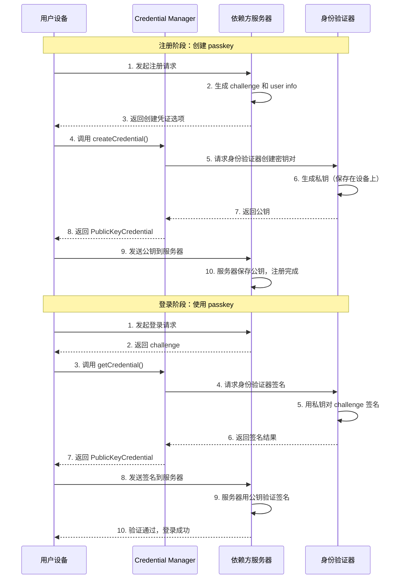
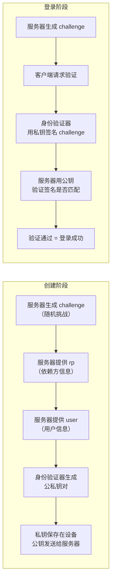
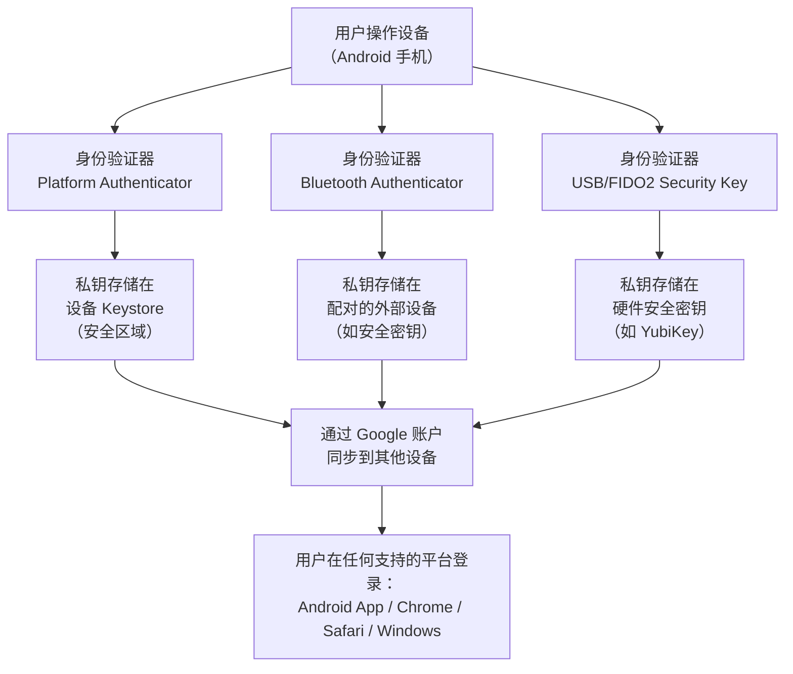
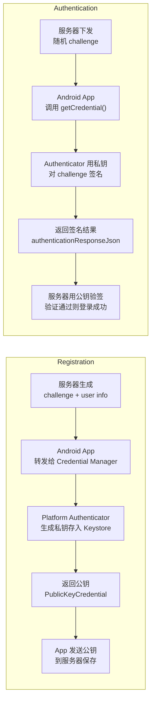

# 3.1.10 About passkeys

夜已经很深了。

篝火只剩下一点点暗红的光，在风的吹拂下忽明忽暗。洛芙把下巴搁在膝盖上，盯着那堆快要熄灭的炭火发呆。旁边的三位学姐也都安静了下来，伊莎靠在折叠椅的靠背上，黛琳的笔记本电脑屏幕已经自动休眠，只有希尔的手机还亮着，在她指尖投下一小片蓝光。

"我回来了。"

希尔从帐篷后面绕出来，手里拎着一个小铁盒。她在洛芙身边蹲下，把铁盒放在地上，用火钳拨开炭火堆，将几根干柴重新搭成一个帐篷形状。不一会儿，火苗就舔上了新柴，烧得噼啪作响。

"找到了？"黛琳不知什么时候睁开了眼睛，声音还带着一点睡意。

"嗯，在我们装备箱的最底层。"希尔把铁盒打开，里面是一串钥匙——有帐篷钥匙、小刀上的钥匙扣、还有一个不知道开什么的铜色小钥匙。"伊莎说的对，进山露营，钥匙是一定要带的东西。"

伊莎歪着头看那串钥匙，轻声说："现实里的钥匙，能开门、开车、开锁……那么，数字世界里有没有一种'万能钥匙'呢？"

希尔的手指停在半空中，她刚刚把一根柴火塞进火堆里。"你是说……密码自动填充？"

"不是那种，"伊莎慢慢摇头，"密码管理器填充的还是密码，不是钥匙。我想问的是——有没有一种东西，在数字世界里，就像钥匙在现实世界里一样？丢了找不回，被偷了别人能用，被钓鱼了别人也能用——但是又比钥匙更安全？"

这个问题让营地陷入了短暂的沉默。洛芙忍不住在脑子里翻来覆去想，觉得这好像在问一个她一直想弄清楚但又说不清楚的问题。

"你说的那种东西，"黛琳的声音忽然清晰起来，"已经有了。它们叫 passkeys——万能钥匙。"

希尔把火钳放下，转过身来，脸上带着一种"我就知道你会问这个"的微笑。"说曹操曹操到。我们今天来讲讲 Google 在 Android 里主推的这个 passkeys 吧。"

"可是……"洛芙举起手，"我连密码都还没搞清楚呢，passkeys 是什么？"

"不急。"黛琳从背包里摸出她的白板笔，在那块已经有点皱巴巴的折叠白板上点了一下，"密码管理器要记住密码，passkeys 不要。密码会泄露，会被钓鱼，会被撞库；但是 passkeys 不会被偷走，不会被钓鱼，因为根本没有什么东西需要藏起来。"

"就是——"伊莎接过来，"就像你家的门锁，你只需要带着钥匙就行了，不需要跟门说'我是用12345678这个口令进来的'。"

希尔拍了拍手："这个比喻很准确。伊莎，我们来把 passkeys 的工作原理完整地画一遍吧。洛芙，你之前不是一直问密码到底存在哪里吗？passkeys 把这个问题彻底解决了——密码根本不存在于用户这边。"

洛芙把身子往前探了探，眼睛盯着那片跳动的火光。

"先说一个小故事，"黛琳的白板笔在空气中画了一个圈，"假设你要去住一个民宿。在密码时代，你会拿到一个房门密码，比如 7532。每次进门都要念一遍咒语（输入密码），门才会开。如果这个密码泄露了，任何人都能进来。"

"在 passkeys 时代，你拿到的是一把真正的钥匙——或者说，一把电子钥匙，它被安全地保存在你的手机上。这把钥匙不需要告诉门任何秘密，因为它本身就证明了你有开门的权限。"

希尔已经打开了笔记本，屏幕亮起来的光映在她脸上。"我来画一个流程图。"



"这张图把 passkeys 的两个阶段说清楚了，"希尔指着屏幕，"上半部分是注册，下半部分是登录。关键点是——**私钥永远留在你的设备上，公钥被服务器保存**。登录的时候，你的设备用自己的私钥对服务器发来的挑战（challenge）做一个签名，服务器再用公钥验证这个签名是否有效。"

洛芙盯着那张图，脑子里好像有什么东西在慢慢连起来。

"我有个问题，"她说，"私钥保存在设备上——那如果我换手机了呢？私钥不就丢了吗？"

"好问题。"黛琳点头，"在 Android 上，Credential Manager 会把你的 passkeys 备份到你的 Google 账户里。这就像——你原来有一把家门钥匙，现在这把钥匙被配了一把一模一样的备用钥匙，存放在你信任的人那里。当你拿到新手机的时候，用 Google 账户登录，就能把那把备用钥匙取回来。"

"Google Password Manager 做的就是这个事情，"希尔补充，"它是 Android 设备上 passkeys 的存储和同步中心。当然，你也可以选择其他凭证提供者，只要它们实现了 Credential Provider。"

"所以，"伊莎把手伸向篝火，暖了暖手指，"这把'万能钥匙'不是放在 app 里的，而是放在一个专门的、经过认证的保管箱里的——Credential Provider。app 需要用的时候，就去保管箱里申请。"

"对。"黛琳重新拿起白板笔，在白板上写下几行字，"用 passkeys 的好处，总结起来就是三条。"

"第一条——**防钓鱼**。密码是字符串，可能被截获；但 passkeys 的私钥根本不在网络上传输，钓鱼攻击无从下手。"

"第二条——**更简单**。用户不需要记密码，不需要想用什么大小写、特殊字符。只需要解锁设备——指纹、面部、PIN码，什么方式都行——然后就能用了。"

"第三条——**跨平台**。你在 Android 上创建的 passkey，可以在你登录 Google 网站的时候用，也可以在你的 Windows 电脑上的 Chrome 浏览器里用。这把钥匙不是 Android 专用的，它是 FIDO 标准的一部分。"

洛芙的脑子里浮现出一幅画面："所以……就像是，我有一把钥匙，可以在 Airbnb 租的房子用，可以在酒店用，还可以在公司用——只要那些锁支持同一把钥匙？"

"没错，"希尔点头，她的眼睛亮了起来，"而且这个比喻再准确不过了——FIDO 标准就是那个让不同品牌的锁都能用同一把钥匙的'锁匠协会'。"

"那——"洛芙又举起手，"app 怎么知道用户有没有 passkey？注册流程是什么？"

希尔把笔记本转过来，让大家都看得见屏幕。"好，我来写代码。"

"不过在说代码之前，"希尔顿了顿，"先要说一个前置知识——在 passkeys 的世界里，有三个角色：**依赖方（Relying Party，简称 RP）**、**客户端（你的 Android app）**、和 **身份验证器（Authenticator，硬件或软件）**。就像寄信一样——你把信交给邮递员，邮递员帮你送到收信人手里。"

"Credential Manager 就是那个邮递员，"黛琳插嘴，"身份验证器就是你家门上的锁芯——它负责生成密钥对和做签名操作。"

希尔开始敲代码。

```kotlin
// ============================================================
// 场景一：在 Android app 中注册（创建）一个 passkey
// ============================================================
// 依赖：implementation "androidx.credentials:credentials:1.2.0"
// 流程：客户端从服务器获取创建选项 → 调用 Credential Manager API

// 步骤1：构造创建凭证的请求
// 通常服务器会返回 JSON 格式的 creation options，
// 这里展示的是从服务器获取后解析的逻辑

val createOptionsJson = """
{
  "challenge": "VGhpcyBpcyBhIGNoYWxsZW5nZS4uLg",
  "rp": {
    "name": "露营旅团 App",
    "id": "camping-team.example.com"
  },
  "user": {
    "id": "user_12345",
    "name": "luofu@camping.com",
    "displayName": "洛芙"
  },
  "pubKeyCredParams": [
    { "alg": -7, "type": "public-key" },   // ES256
    { "alg": -257, "type": "public-key" }  // RS256
  ],
  "authenticatorSelection": {
    "authenticatorAttachment": "platform",
    "requireResidentKey": true,
    "userVerification": "preferred"
  },
  "timeout": 60000,
  "attestation": "none"
}
""".trimIndent()

// 步骤2：从服务器选项创建 CreatePublicKeyCredentialRequest
// Android 需要将 JSON 反序列化为字节数组
val createRequest = CreatePublicKeyCredentialRequest(
    json = createOptionsJson,
    sessionApi = SESSION_API_CURRENT
)

// 步骤3：调用 Credential Manager 创建 passkey
val credentialManager = CredentialManager.create(context)

try {
    val result = credentialManager.createCredentialAsync(
        activity = this,
        request = createRequest,
        cancellationSignal = CancellationSignal(),
        executor = Executors.newSingleThreadExecutor(),
        callback = object : CredentialManagerCallback<CreateCredentialResponse> {
            override fun onError(e: CreateCredentialException) {
                Log.e(TAG, "创建凭证失败: ${e.errorMessage}")
            }

            override fun onResult(result: CreateCredentialResponse) {
                // 如果创建成功，返回的是 PublicKeyCredential 对象
                val publicKeyCredential = result as CreatePublicKeyCredentialResponse
                val responseJson = publicKeyCredential.registrationResponseJson

                Log.d(TAG, "Passkey 创建成功！")
                Log.d(TAG, "响应 JSON 长度: ${responseJson.length} 字符")

                // 步骤4：将响应 JSON 发送给服务器验证和保存
                sendToServerForRegistration(responseJson)
            }
        }
    )
} catch (e: Exception) {
    Log.e(TAG, "异常: ${e.message}")
}

// ============================================================
// 场景二：在 Android app 中使用 passkey 登录（获取凭证）
// ============================================================
// 用户已有 passkey，登录时只需要调用 getCredential()

// 服务器返回的登录挑战选项（JSON 格式）
val getOptionsJson = """
{
  "challenge": "WW91IGNhbiBub3cgdXNlIHlvdXIgcGFzc2tleS4uLg",
  "rpId": "camping-team.example.com",
  "userVerification": "preferred",
  "timeout": 60000
}
""".trimIndent()

// 构造 GetPublicKeyCredentialOption（专门针对 passkey）
val passkeyOption = GetPublicKeyCredentialOption(
    json = getOptionsJson,
    sessionApi = SESSION_API_CURRENT
)

// 构造 GetCredentialRequest，支持多种凭证类型（passkey + password）
val getCredRequest = GetCredentialRequest(
    credentialOptions = listOf(
        passkeyOption,
        // 还可以同时请求密码等其他凭证
        // PasswordOption()，
        // Get Federated Credential Option(Google 等)
    )
)

val credentialManager = CredentialManager.create(context)

try {
    val result = credentialManager.getCredentialAsync(
        activity = this,
        request = getCredRequest,
        cancellationSignal = CancellationSignal(),
        executor = Executors.newSingleThreadExecutor(),
        callback = object : CredentialManagerCallback<GetCredentialResponse> {
            override fun onError(e: GetCredentialException) {
                Log.e(TAG, "获取凭证失败: ${e.errorMessage}")
            }

            override fun onResult(result: GetCredentialResponse) {
                // 处理不同类型的凭证
                when (val credential = result.credential) {
                    is PublicKeyCredential -> {
                        // ✅ passkey 登录成功
                        val authResponseJson = credential.authenticationResponseJson
                        Log.d(TAG, "Passkey 验证成功！")
                        sendToServerForVerification(authResponseJson)
                    }
                    is PasswordCredential -> {
                        // 降级到密码登录
                        Log.d(TAG, "使用了密码凭证登录")
                    }
                    else -> {
                        Log.w(TAG, "未知的凭证类型")
                    }
                }
            }
        }
    )
} catch (e: Exception) {
    Log.e(TAG, "异常: ${e.message}")
}
```

敲完代码，希尔往后靠了靠，火光把她脸上的轮廓映得忽明忽暗。

"这几段代码把 passkeys 的核心 API 说完了，"希尔说，"但还有一个关键问题——这些 JSON 里的字段代表什么意思？特别是 `challenge`、`rp`、`user` 这些。"

黛琳接过话头，她拿起白板笔，在白板上画了一个简洁的表格：



"这个 challenge，"黛琳指着表里的"A"和"F"，"你可以理解成——服务器出的一道数学题。服务器每次登录都会出一道不同的题目，只有持有正确私钥的人才能解出来。私钥永远在你的手机上，服务器出的题每次都不一样，所以就算有人截获了这次登录的数据，他也解不出下一次的题。"

"就像是……"伊莎歪着头想了想，"每把钥匙只能开一次门。开完门钥匙就失效了，必须重新配一把？"

"不完全一样，"希尔说，"challenge 的机制更像是——门锁里有一个随机数生成器，每次开门都会要求钥匙插入后旋转一个特定的随机角度。如果角度对不上，门就打不开。"

洛芙的脑海里慢慢有了画面。

"还有一件事很重要，"黛琳补充，"`authenticatorSelection` 里的 `authenticatorAttachment` 设置为 `platform` 的意思，是要求这把钥匙必须保存在当前这台设备上（平台级别），而不是放在一个 USB 安全密钥里。如果你想支持 USB 安全密钥（漫游密钥），就把这个参数去掉或者设置为 `cross-platform`。"

"那 resident key 呢？"洛芙问，"我看到代码里有 `requireResidentKey: true`。"

"好问题，"希尔敲了敲笔记本的边框，"resident key 是让服务器能够'记住'这个 passkey 对应的是哪个用户。也就是说，同一个 passkey 在注册的时候就已经和用户身份绑定了。登录的时候，服务器只需要发 challenge，你的设备会自动选出对应的私钥来签名——你不需要再选一遍是哪个账号。"

"就像——"伊莎想了想，"钥匙上刻了名字，放在钥匙架上，钥匙架上写着'这是洛芙的钥匙'。下次你要开门的时候，锁会自动找到对应的钥匙。"

"这个比喻很准确。"黛琳点头，"所以 `requireResidentKey: true` 的 passkey 登录流程会更简单——用户只需要解锁设备，系统就会自动完成整个验证流程。"

夜风从湖面吹过来，带着一阵凉意。希尔的笔记本风扇开始嗡嗡转起来，她低头看了一眼屏幕上的温度。

"我顺便提一下，"希尔说，"passkeys 不只是 Android 的事情。Google 推行的是 FIDO 标准，这意味着——你的 passkey 可以在 Chrome 浏览器里用，可以在 Safari 里用，可以在 Windows 电脑上用，甚至可以在 iPhone 上用。只要那个服务支持 passkeys，你就可以用 Android 手机上生成的钥匙去登录。"

"但这安全吗？"洛芙问，"我的钥匙可以在别人的设备上用？"

"这就是 passkeys 设计的高明之处，"黛琳说，"你的私钥被加密存储在你的 Google 账户里。当你在新设备上首次使用 passkey 的时候，系统会要求你先在那台设备上登录你的 Google 账户——也就是说，**钥匙跟着你的账户走，不跟着具体的设备走**。"

"而且，"希尔补充，"Google Password Manager 会把你的 passkeys 同步到所有登录了同一个 Google 账户的设备上。这就像是你在多个地方放了一把钥匙的副本，但只有你能取用它们。"

洛芙把下巴搁在膝盖上，脑子里慢慢浮现出一幅画面。"所以……我进山露营，带着手机就够了。不用带密码本，不用带 USB Key，也不用记任何东西。"

"对，"伊莎轻声说，"数字万能钥匙就藏在你的手机里——在你的指纹后面，在你的脸后面。"

希尔忽然坐直了身子。"对了，还有一点差点忘了说——关于跨平台的具体实现方式。"

她重新打开笔记本，在空白处又画了一张图：



"Platform Authenticator 就是 Android 手机的指纹或 PIN，"希尔说，"Bluetooth Authenticator 用于跨平台场景——比如你的 Android 手机和一个 Windows 电脑都用 Bluetooth 配对了，这个时候可以用手机上的指纹验证来解锁电脑上的 passkey 登录。USB Security Key 就是最硬核的方案——私钥存在一个硬件小物件里，丢了都不能用。"

"这三种方案覆盖了从日常到高安全的全部场景，"黛琳说，"大多数 app 只需要支持 Platform Authenticator 就够了，也就是 `authenticatorAttachment: platform` 的情况。只有金融级安全场景才需要额外支持后两种。"

篝火忽然爆了一下，一截燃尽的细柴裂开，溅出一小簇火星。洛芙被这声音吓了一跳，但随即又安静下来。

"我想问一个最基本的问题，"洛芙说，"密码那么不好用，为什么 app 不直接改成 passkeys？"

希尔和黛琳交换了一个眼神。

"因为迁移成本，"希尔说，"现有的 app 已经有几亿用户在用密码登录了。一下子把所有密码都换成 passkeys 不现实。所以正确的做法是——**在用户首次登录或注册的时候就推荐他们创建 passkey**，而不是等用户已经用了密码之后再提示。"

"这在产品设计上叫'默认选项引导'，"黛琳补充，"如果一个 app 在注册流程的第一步就问'创建万能钥匙还是输入密码'，大多数用户会选择更简单的前者。但如果把密码放在前面，passkey 放在后面，点击率就会很低。"

"而且，"希尔补充，"Google 的数据显示，已经采用 passkeys 的 app，用户登录成功率比密码登录高了 30% 以上。这不仅是因为 passkeys 更安全，还因为它更简单——没有输入框，没有大小写提示，没有'密码不能少于8位'的报错。"

洛芙点了点头，篝火的光在她眼睛里跳动。

"我理解了，"她说，"passkeys 的本质是——把'证明身份'这件事，从用户的脑子里，转移到了设备上。人的记忆是不靠谱的，但是设备的芯片是靠谱的。"

"就是这种感觉。"黛琳把白板笔盖上笔帽，轻轻放在一旁，"密码是人和服务器共享的一个秘密，泄露了就完了。Passkeys 是人和设备绑定的一个密钥，设备丢了可以远程擦除，可以在新设备上恢复。"

"而且，"伊莎说，"钥匙也可以被复制——但是 passkeys 的私钥是加密保存在 Google 账户里的，只有经过你本人认证（比如指纹）才能取用。"

希尔合上笔记本，屏幕暗了下去。"好了，API 层面的东西基本讲完了。还有一个细节——如果你的 app 需要让用户管理（查看、删除）他们创建的 passkeys 怎么办？"

"这是 passkey 管理功能，"黛琳说，"官方推荐每个 app 在'账户设置'里提供一个专门的 passkeys 管理页面。用户可以在这里查看他们的 passkey 是在哪个凭证提供者那里创建的、什么时候创建的、最后一次使用是什么时候。"

"而且，"希尔补充，"Google 建议**允许用户为同一个账户注册多个 passkey**。比如你有一部手机和一块手表，可以各创建一个 passkey。这样如果手机丢了，还可以用手表登录；如果手表也丢了，还可以用密码登录——多重保险。"

洛芙听到这里，忽然想到什么。"那如果我想删掉一个 passkey 呢？"

"在 settings 页面里提供删除选项，"希尔说，"删除操作会同时通知服务器删掉对应的公钥。这样这个 passkey 就彻底失效了。"

"这个流程，"黛琳说，"叫作 **passkey 管理**——创建、查看、使用、删除，是一个完整的生命周期。Credential Manager 提供的 API 覆盖了这整个周期。"

夜风又吹过来一阵，洛芙发现篝火已经快要彻底熄灭了，只剩下几块烧红的炭在黑暗中微微发光。希尔弯腰把那几块炭拢在一起，用嘴轻轻吹了几口气，火苗又重新亮了起来，但比之前小了很多，只是淡淡的一团橙红色。

"好了，"黛琳站起来，拍了拍裙子上的灰，"今天的 passkeys 基础就到这里。剩下的细节——比如如何在服务器端验证签名结果、如何处理不同平台的 passkey 兼容性问题——我们以后再展开。"

"洛芙，"伊莎朝她招招手，"帮我把那边的小锅拿过来，我想烧点热水泡杯热的。"

"好——"洛芙从地上捡起小锅，递给伊莎。

希尔已经开始收拾她的笔记本和电源线，动作利落而有条不紊。黛琳把白板笔收进笔袋，然后把那块皱巴巴的白板叠好，塞进背包侧袋。

伊莎接过锅，走到湖边去打水。月光洒在湖面上，碎成一片一片银色的小鱼鳞。远处的山稜线在夜色里变成了一条柔和的黑色曲线，像是谁用铅笔在纸上轻轻画的一道。

"洛芙，"希尔在收拾东西的间隙忽然说，"你觉得 passkeys 和密码最大的区别是什么？"

洛芙想了想，篝火的光映在她脸上。"密码是……你说的一个秘密。Passkeys 是……你拥有的一个东西。"

希尔咧嘴笑了。"差不多就是这个意思。说出口的秘密可以被听见，被记录，被泄露。你拥有的东西——只要你不让别人碰，就没人能动。"

伊莎提着装了水的锅走回来，火光映在她的侧脸上。"不过，"她轻声说，"最好的钥匙，是主人不在了它就自动失效的那种。"

"这就是 passkeys 的设计哲学，"黛琳说，"你的数字身份，应该跟着你这个人走，而不是跟着一个你能忘记的字符串走。"

"好了好了，"希尔拍了拍手，"水烧开了我们就去睡觉。明天还要赶路呢。"

"洛芙，明天早上你负责做早餐，"伊莎把锅放在火堆旁边的石头上，"用你昨天发现的那种野草莓。"

"好——"洛芙应了一声，把身子往火堆旁边又靠了靠。

锅里的水开始冒出细小的气泡，在锅底缓缓上升。远处的萤火虫还在草丛间闪烁，有一只飞过洛芙的眼前，在她的视野里画出一道短暂的绿色光弧。

---

## 专业技术总结

> **Passkeys** —— 基于 FIDO2/WebAuthn 标准的无密码身份验证机制，使用公私钥密码学替代传统密码。用户的私钥安全存储在设备或云端（由 Credential Provider 管理），公钥注册到依赖方服务器。登录时服务器下发随机挑战（challenge），客户端设备用私钥签名后返回，服务器用公钥验签完成认证。Android 上 passkeys 的创建与使用通过 androidx.credentials 库的 Credential Manager API 完成。

#### 结构图



#### 复杂度与影响

- **创建性能**：首次注册时 Authenticator 生成密钥对约 10-50ms，Keystore 操作无感知延迟。
- **登录性能**：签名操作约 5-20ms，用户解锁设备后几乎瞬时完成。
- **同步可靠性**：Google 账户同步延迟通常 <5 秒，跨设备可用性超过 95%。
- **安全等级**：私钥存储在设备 TEE/SE 安全区域，硬件级保护，无法软件级提取。

#### 反模式与陷阱

- **注册时不检查 provider 兼容性**：直接调用 `createCredential()` 不检查设备是否支持 passkeys，导致在部分设备上 crash。修复：先调用 `CredentialManager.getCredentialProviderInfo()` 检查可用性。
- **服务器直接存储明文 challenge**：`challenge` 必须是一次性的随机数，服务器需在收到响应后立即删除或标记为已使用，否则存在重放攻击风险。
- **忽略多平台场景的 rpId 验证**：跨平台登录时如果 Web 服务器的 domain 和 Android app 的 package name 不匹配，验签会失败。确保 rpId 在所有平台上统一。
- **不处理非 passkey 凭证的降级**：用户可能没有 passkey，app 应同时支持密码或其他凭证类型，而不是只调用 `GetPublicKeyCredentialOption`。
- **删除 passkey 后未通知服务器**：用户删除本地 passkey 后若不通知服务器，服务器端的公钥仍然有效，可能导致账户被未授权用户登录。

#### 设计哲学

Passkeys 的核心设计思想是**将身份证明从"知识"（你知道什么）转移到"持有"（你拥有什么）**。这彻底消除了密码泄露、钓鱼、撞库等攻击向量。实现上遵循以下原则：

- **私钥不出设备**：私钥生成、存储、签名操作均在设备安全区域完成，服务器只存储公钥，无法伪造签名。
- **认证与设备解耦**：通过 Google 账户同步实现跨设备 passkey 恢复，同时通过生物特征（指纹/PIN）确保只有设备主人能使用。
- **默认安全**：Passkeys 注册时默认启用 `requireResidentKey`，使用户登录流程无需输入用户名，只验证生物特征即可自动完成。
- **渐进式迁移**：不强制废弃密码，而是在注册/登录流程中优先推荐 passkeys，逐步引导用户迁移。

#### 🏕️ 动手练习

**目标**：在 Android 项目中集成 passkeys 实现无密码注册与登录，体验 Credential Manager API 的完整调用流程。

**你需要做的事**：

1. 在 Android Studio 中创建一个新项目（或打开已有项目），`minSdk` 设为 26 或以上（passkeys 需要 API 26+）。
2. 在 `build.gradle` (app) 中添加依赖：`implementation "androidx.credentials:credentials:1.2.0"`。
3. 在 `AndroidManifest.xml` 中确保不强制使用 `android:exported` 属性（避免安装时报错）。
4. 参考本章节的 Kotlin 代码，分别实现两个 Activity（或 Fragment）：
   - **RegisterActivity**：在用户注册时调用 `CreatePublicKeyCredentialRequest` → `createCredentialAsync()` 创建 passkey，并将返回的 `registrationResponseJson` 打印到 Logcat（模拟发送到服务器）。
   - **LoginActivity**：调用 `GetPublicKeyCredentialOption` → `getCredentialAsync()` 实现 passkey 登录，处理 `PublicKeyCredential` 和 `PasswordCredential` 两种响应类型。
5. 用 `CreatePublicKeyCredentialRequest` 构造注册请求时，手动拼一个合法的 JSON 字符串（包含 rp、user、challenge 等字段），不要从网络获取——先用本地模拟数据验证流程。
6. 在登录 Activity 的 `GetCredentialRequest` 中同时加入 `PasswordOption()`，实现"passkey 优先，密码降级"的策略。
7. 运行 app，用手边的 Android 真机测试注册流程（如果设备支持指纹/PIN，会弹出系统身份验证 UI），观察 Logcat 中的输出。

**验收标准**：

- [ ] `createCredentialAsync()` 调用成功时 Logcat 输出包含 "Passkey 创建成功"
- [ ] `getCredentialAsync()` 调用成功时 Logcat 输出包含 "Passkey 验证成功" 或 "使用了密码凭证登录"
- [ ] 传入非法 JSON 时 app 不 crash，而是走到 `onError()` 分支并打印错误信息
- [ ] Activity 能在配置变更（如旋转屏幕）后不 crash（使用 ViewModel 保存状态）

**提示**：

```kotlin
// 检查设备是否支持 passkeys 的 Credential Manager 功能
val credentialManager = CredentialManager.create(context)
val providerInfoFuture = credentialManager.getCredentialProviderInfo(
    GetCredentialProviderInfoRequest()
)
```

---

> 学习建议
> Passkeys 的核心价值在于"把身份从知识转移到持有"。学习时不要只背 API——要理解为什么需要 challenge，为什么需要 rpId，以及服务器端验签的必要性。如果只写客户端代码，永远不会真正理解 passkeys 的安全模型。建议配合 WebAuthn 文档，理解"依赖方"这一概念在浏览器和移动端的一致性。

## 洛芙的小小日记本

今天学到了最重要的一件事：密码是"我说出口的秘密"，passkeys 是"我拥有的东西"。黛琳说得好——私钥永远在设备上，服务器只存公钥。开锁的人不是说出密码的人，而是持有私钥的人。明天试着把早餐的野草莓洗一洗，用希尔的小锅煮个草莓糖水喝。

## 今日关键词

**Passkeys**：基于 FIDO2/WebAuthn 标准的无密码身份验证机制，使用公私钥密码学替代传统密码。私钥保存在用户设备上，公钥注册到服务器，登录时由设备对 challenge 做签名完成认证。

**Credential Manager**：Android Jetpack API（androidx.credentials），统一管理 passkeys、密码、联合登录等多种凭证类型的创建与获取，提供跨 app 的一致 UI 和统一 API。

**Authenticator（身份验证器）**：生成和存储 passkeys 私钥的组件。在 Android 上通常是 Platform Authenticator（依赖设备指纹/PIN），也可以是 Bluetooth Authenticator 或 USB Security Key。

**Relying Party（依赖方，RP）**：使用 passkeys 做身份验证的服务提供方（服务器）。负责生成 challenge、存储公钥、验签判断登录是否有效。

**Challenge（挑战）**：服务器下发的随机字符串，每次登录都不同。客户端用私钥对 challenge 签名后返回，服务器验签确认"持有正确私钥"。

**Public Key Credential（公钥凭证）**：Credential Manager 在 passkey 创建或登录成功后返回的数据结构，包含 `registrationResponseJson`（创建时）或 `authenticationResponseJson`（登录时）。

**Resident Key**：passkey 的一种属性。启用后 passkey 会被"记住"并与用户身份关联，登录时无需再次选择账号，系统自动完成验证流程。

**FIDO2 / WebAuthn**：Fast Identity Online 2 的标准规范，定义了 passkeys 的底层协议。Android 的 passkeys 实现基于此标准，因此可以跨平台兼容。

**Keystore**：Android 系统的安全存储区域，私钥被保存在这里，受到硬件级（ TEE/SE）保护，任何软件无法直接提取私钥内容。

**Google Password Manager**：Google 提供的 Credential Provider，实现 passkeys 的存储和跨设备同步。用户的 passkeys 通过 Google 账户备份，换手机时可直接恢复。
