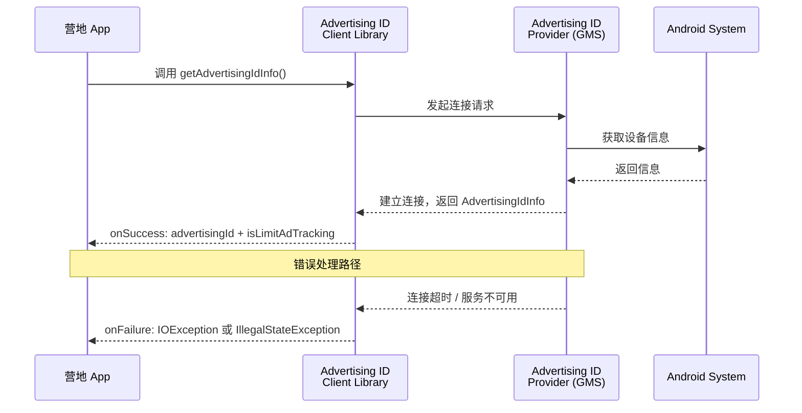
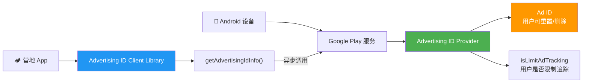

# 3.1.2 身份

夜风从湖面上吹来，带着初夏特有的凉意和一丝水草的清香。篝火已经矮了大半，只剩下几块烧得通红的炭在灰烬中明明灭灭，偶尔爆出一点火星。

洛芙盘腿坐在折叠凳上，手肘撑着膝盖，下巴搁在掌心里，眼睛亮亮地望着对面的希尔。刚才那场关于 Credential Manager 的讨论实在太精彩了，她现在满脑子都是通行密钥、通行密钥——那感觉就像第一次听说有人可以用指纹解锁一整座图书馆。

"所以，用指纹或者人脸识别就能登录了？不用记密码？"洛芙又确认了一遍。

"对，"希尔点头，"Google 把这套方案叫 Passkey，中文叫通行密钥。用户体验特别好，而且比密码安全多了。"

伊莎抱着膝盖坐着，火光在她侧脸上投下柔和的暖色。"那营地 App 的登录功能就这么定了？密码加通行密钥，双保险。"

"嗯，Credential Manager 统一处理，很方便。"黛琳说，"不过登录只是第一步。"

"还有啥？"洛芙歪头。

黛琳偏过头看向希尔。希尔正在用树枝拨弄炭火，经她一看，手上的动作顿了顿。

"……好吧，确实还有。"希尔叹了口气，把树枝往火里一丢，"营地 App 还需要追踪用户行为。不是为了监控你们隐私啊——是为了做个性化推荐。你浏览过哪些营地的帖子、收藏过哪些路线、对什么类型的活动感兴趣，这些数据汇总起来，我们才能给你推荐'你可能喜欢'的内容。就像……"

"就像书店店员记住你上次买过什么，下次推荐同类型的新书？"洛芙接话。

"对，差不多这个意思。"

"那这个'记住'，在代码里是怎么做到的？"

希尔和黛琳对视一眼。

"这就涉及到一个有点敏感的话题了。"伊莎轻声说，把下巴搁在膝盖上，望着篝火，"设备标识。"

洛芙眨眨眼。"设备……标识？"

"就是给每一台手机、每一个用户发一个编号。"希尔拍了拍自己的手机，"有了这个编号，服务器就知道'哦，这是洛芙的手机'，然后把她的浏览记录、偏好设置都关联起来，下次她打开 App，直接显示她感兴趣的内容。"

"听起来很方便啊。"洛芙说。

"是很方便，"黛琳的声音平静，但洛芙总觉得她下一秒就要转折，"但也很危险。"

篝火噼啪响了一声。远处湖面上传来鱼跳出水面的声音，扑通一下，很轻。

"危险？"洛芙不自觉地压低了声音。

"想象一下，"伊莎伸出手指，在火光前比划，"这个编号是固定的，永远不变。你换手机，它跟着你走；你恢复出厂设置，它还在。广告商、网站、所有想追踪你的人，只要拿到这个编号——"

"就能拼出一整个'洛芙'。"黛琳接话，"你在网上搜过什么、去過哪里、几点睡觉、喜欢什么类型的男生——全都能被关联起来。你就变成了一本摊开的书。"

洛芙打了个寒颤。

"好可怕……"她说。

"所以 Google 后来出了新规定，"希尔把手机拿起来，在火光下晃了晃，"Android 设备不能再随便用那些固定的设备标识了。IMEI、序列号、MAC 地址……这些都禁了。"

"那怎么追踪用户？"洛芙问。

"用一个特殊的、可重置的 ID。"希尔眼睛亮了——每当要讲新知识的时候她都这样，"叫做 Advertising ID，广告 ID，简称 Ad ID。"

## Ad ID 是什么

"Ad ID 是 Google Play 服务提供的一个特殊标识符。"希尔掏出笔记本电脑，屏幕亮起来，IDE的深色界面在夜色中显得格外分明，"每个设备、每个用户 profiles（用户配置）都有一个，是用来做广告追踪的。"

"等等，profiles？"洛芙抓住了这个词。

"对，现代 Android 支持多用户 profiles。"黛琳解释道，"一部手机可以创建多个用户账号，比如'主用户'、'访客'、或者给孩子的'儿童profile'。每个 profile 都有自己独立的 Ad ID，互相不干扰。"

"就像同一栋公寓楼里，每户有自己的门牌号？"洛芙试着理解。

"很好的比喻。"伊莎笑着点头。

希尔在键盘上敲了几下，调出一个代码文件。"先说最重要的三个特性——Ad ID 的设计哲学就藏在里面。"

她把屏幕转过来给所有人看。

"第一，**用户可以重置**。用户随时可以去系统设置里把 Ad ID 复位，就像换一个新门牌号。服务器那边看，这个用户突然变陌生了，但其实还是同一个人。"

"第二，**用户可以删除**。在 Android 13 及以上，用户可以直接删掉 Ad ID。删了之后，这个设备就再也不提供任何广告 ID 了，广告商只能干瞪眼。"

"第三，**作用域限定**。Ad ID 只能用于广告和数据分析，不能用于安全认证、支付这些敏感场景。你不能用 Ad ID 来当作用户登录的凭证——那是 Credential Manager 的活儿。"

"三种身份标识，用在三个不同的地方。"洛芙慢慢理清了，"Credential Manager 管登录，Ad ID 管广告追踪……那 IMEI 那些呢？"

"禁用了。"希尔说得很干脆，"Google Play 政策明确规定，应用更新时必须把广告目的的设备标识替换成 Ad ID。要是你敢用 IMEI 做广告追踪，轻则收到警告，重则下架。"

## Ad ID 的技术细节

"原理讲完了，上代码。"希尔把笔记本往自己面前拉了拉，"要用 Ad ID，得先在项目里加依赖。Google Play 服务提供了专门的 Advertising ID library。"

她开始敲代码。

```kotlin
// build.gradle (Module: app)
// 依赖 Advertising ID 客户端库
dependencies {
    implementation("com.google.android.gms:play-services-ads-identifier:18.0.1")
    // 同时需要广告服务的基础库
    implementation("com.google.android.gms:play-services-base:18.3.0")
}
```

"这个库有两个核心类。"希尔敲完，抬头解释，"`AdvertisingIdClient` 和 `AdManager`。我们先看怎么获取 Ad ID。"

她继续敲。

```kotlin
// 获取 Advertising ID 的标准流程
// 注意：这必须在后台线程执行，不能在主线程调用
class AdIdManager {

    fun getAdvertisingIdInfo(executor: Executor, callback: (AdvertisingIdInfo?) -> Unit) {
        // AdvertisingIdClient.getAdvertisingIdInfo() 是异步的
        // 需要传入 Context 和 Executor
        AdvertisingIdClient.getAdvertisingIdInfo(
            android.app.ApplicationApplication_Accessor.getInstance(),
            executor
        ).addOnSuccessListener { adInfo ->
            // 获取成功
            val advertisingId: String = adInfo.id ?: ""
            val isLimitedAdTracking: Boolean = adInfo.isLimitAdTrackingEnabled

            callback(adInfo)
        }.addOnFailureListener { e ->
            // 获取失败的可能情况：
            // 1. 设备没有 Google Play 服务（如华为部分机型）
            // 2. 用户删除了 Ad ID（Android 13+）
            // 3. Google Play 服务版本过旧
            callback(null)
        }
    }
}
```

"等一下等一下，"洛芙凑近屏幕，"`addOnSuccessListener` 这个写法……是异步的吧？"

"对。"希尔点头，"`AdvertisingIdClient.getAdvertisingIdInfo()` 是非阻塞的，但实际运行中有时候也会卡——尤其是第一次调用时，库需要去和 Google Play 服务建立连接。如果这时候你放在主线程……"

"会卡 UI。"黛琳接话。

"ANR，Application Not Responding，应用无响应。"希尔说，"系统直接弹对话框问用户要不要关掉你。"

"好严重……"洛芙缩了缩脖子。

"所以官方文档特别强调了，必须在后台线程调用这个方法。"黛琳指了指屏幕上的 `Executor` 参数，"希尔用的这个写法，用了 `java.util.concurrent.Executor`，非常标准。"

## 架构与连接流程

"光看代码不够直观，"伊莎说，"希尔，你上次画的那个图还在吗？"

"在的在的。"希尔切换到一个注释掉一堆代码的 Markdown 文件，调出一段 mermaid 图，"来，看这个。"



"图 1 对应代码第 8 到 22 行。"希尔用手指点了点屏幕，"核心流程就是：App 发请求 → Client Library 转发 → Google Play 服务里的 Provider 处理 → 返回结果。"

"如果 Google Play 服务本身有问题呢？"洛芙问。

"那就拿不到 Ad ID。"黛琳说，"比如华为被制裁之后、新出厂的华为手机就不带 Google Play 服务了。在这种情况下，`getAdvertisingIdInfo()` 会抛异常，你的 App 必须有兜底逻辑。"

"什么兜底？"

希尔切换到另一个代码片段。

```kotlin
// 兜底逻辑：如果 Ad ID 获取失败，该怎么做
fun fetchAdIdSafely(callback: (Result) -> Unit) {
    val executor = Executor { Thread(it).start() }

    try {
        AdvertisingIdClient.getAdvertisingIdInfo(applicationContext, executor)
            .addOnSuccessListener { adInfo ->
                val adId = adInfo?.id
                val isTrackingLimited = adInfo?.isLimitAdTrackingEnabled ?: true

                if (adId == null) {
                    // Android 13+ 用户删除了 Ad ID
                    // 这种情况下，遵循用户意愿，不进行追踪
                    callback(Result.NoAdId(isTrackingLimited))
                } else {
                    callback(Result.Success(adId, isTrackingLimited))
                }
            }
            .addOnFailureListener { exception ->
                // Google Play 服务不可用（如设备不支持）
                // 常见异常类型：
                // - IOException: 连接超时或网络错误
                // - IllegalStateException: GMS 版本过低
                // - SecurityException: 权限不足
                callback(Result.Error(exception))
            }
    } catch (e: IllegalArgumentException) {
        // Context 或 Executor 为 null，参数校验失败
        callback(Result.InvalidParameter(e.message ?: "参数错误"))
    }
}

sealed class Result {
    data class Success(val adId: String, val isTrackingLimited: Boolean) : Result()
    data class NoAdId(val isTrackingLimited: Boolean) : Result()
    data class Error(val exception: Throwable) : Result()
    data class InvalidParameter(val message: String?) : Result()
}
```

"这段代码就把所有可能的失败情况都覆盖了。"希尔说，"成功、用户删了 ID、服务不可用、参数错误——四种结果，每种都有对应的处理。"

"好详细……"洛芙感叹。

"做广告追踪的应用，这段逻辑必须有。"黛琳说，"而且很重要的一点：如果用户限制了广告追踪 `isLimitAdTrackingEnabled = true`，你应该尊重用户的选择，不要偷偷绕过这个限制。Google Play 政策对这块管得很严。"

## Android 13+ 的权限变化

"对了，你之前说 Android 13 要声明什么权限？"洛芙问希尔。

"`com.google.android.gms.permission.AD_ID`。"希尔说，"在 Android 13（API 33）之前，应用默认就有 Ad ID 访问权，不需要声明。但从 13 开始，必须在 manifest 里显式声明。"

她在屏幕上打开 `AndroidManifest.xml`。

```xml
<!-- AndroidManifest.xml -->
<!-- Android 13+ 必须声明此权限才能获取 Ad ID -->
<manifest xmlns:android="http://schemas.android.com/apk/res/android">

    <!-- Ad ID 权限：获取用户广告标识符 -->
    <!-- 没有此权限时调用 getAdvertisingIdInfo() 会抛 SecurityException -->
    <uses-permission android:name="com.google.android.gms.permission.AD_ID" />

    <application
        android:label="摇曳露营"
        android:icon="@mipmap/ic_launcher">
        <!-- 其他配置... -->
    </application>
</manifest>
```

"这个权限的危险等级是 `normal`，不是 `dangerous`。"黛琳解释，"所以不需要运行时申请，用户安装时就自动授权了。"

"那不加会怎样？"洛芙问。

"不加的话，"希尔慢悠悠地说，"`getAdvertisingIdInfo()` 直接抛 `SecurityException`，你的 App 在 Android 13 设备上拿不到任何 Ad ID，广告功能全废。"

"装 App 的时候也不会提示用户'这个应用要获取广告ID'吗？"洛芙又问。

"不会，这个权限太常见了，系统认为用户应该已经知道 App 会获取这个信息。"黛琳说，"但如果你用的 SDK 里有获取 Ad ID 的代码，系统同样会隐式要求这个权限——即使你自己没写。所以有时候 App 莫名奇妙装不上，就是因为某个第三方 SDK 偷偷用了 Ad ID。"

"……还有这种操作？"洛芙瞪大眼睛。

"所以要小心选 SDK。"希尔撇撇嘴，"垃圾 SDK 坑死你。"

## 反模式：滥用设备标识

"说到 SDK，我要提一个很多新手会踩的坑。"黛琳从希尔手里接过话头。

"什么坑？"

"用 Ad ID 做不该做的事。"黛琳说，"Ad ID 的作用域只限广告和分析，你不能用它来代替用户登录、不能用来做支付验证、不能用来关联敏感信息。但有些 App 就是乱来——"

"比如？"洛芙好奇。

"比如用 Ad ID 当作用户 ID 存到自己的服务器上，然后说'这是匿名用户记录'。"希尔接话，"这其实是打擦边球，Google 不提倡。而且 Ad ID 是可以重置的，用户重置之后，服务器上的'匿名用户'就突然消失了，你的历史数据全断。"

"还有更过分的，"黛琳补充，"有些 App 用 Ad ID 来做设备指纹识别，再加上 IMEI、WiFi MAC 地址等其他信息，拼出一个'超长设备指纹'。就算用户重置了 Ad ID，他们也能通过其他信息把新 ID 和旧 ID 关联起来——等于重置无效。"

"Google 对这个管得特别严，"希尔说，"Play 商店审核时会扫包，发现有 App 同时读取 Ad ID 和其他硬件标识符，直接标记违规。轻则警告，重则下架。"

"那正确的做法是什么？"洛芙问。

"只用一个 Ad ID，"黛琳竖起一根手指，"不混用其他设备标识。"

"用户重置之后，坦然接受，"希尔竖起第二根手指，"不要想办法绕过。"

"Ad ID 只用于广告和数据分析，"黛琳竖起第三根手指，"不用来认证、不用来支付。"

"三根手指，"伊莎笑着数，"记住了吗洛芙？"

洛芙用力点头。

## 场景切换：篝火旁的思考

篝火已经快灭了，只剩下一堆暗红的炭。希尔起身去添柴，动作带起的风吹得炭火重新亮起来，火苗窜动，在夜色中摇曳。

洛芙抬头看天。星星比刚才又多了几颗，湖面的倒影里也布满了细碎的光点。

"我想到了一个问题。"洛芙突然说。

"说。"希尔把柴放好，重新坐下。

"如果用户删了 Ad ID，或者限制了追踪，我们是不是就完全不知道用户是谁了？"

"对，"黛琳说，"但这本来就是正确的用户体验。用户有权拒绝被追踪。"

"可是这样我们就没法给用户做推荐了呀……"

"那是另一个问题了。"希尔想了想，"Ad ID 的设计初衷是保护用户隐私，同时给广告商一个'不精准但够用'的追踪手段。如果你真的需要精确知道'这个用户是谁'，应该用 Credential Manager 做真正的登录，而不是靠 Ad ID。"

"两条路，"伊莎轻声说，"一条是隐身的路，一条是认证的路。隐身的人，你尊重他们的选择；认证的人，你用账号体系服务他们。Ad ID 只负责中间那一段——'匿名但相关'的广告体验。"

洛芙沉默了一会儿。

"感觉……好多东西要平衡啊。"

"这就是做产品的感觉。"黛琳笑了笑，"技术不是非黑即白的。每做一个功能，都要问自己：用户得到什么？代价是什么？这样做真的好吗？"

"好哲学……"洛芙轻声说。

远处传来一声夜鸟的啼叫，清亮而悠远。湖面的风又吹过来，带着一丝凉意。

"今天学了好多，"洛芙说，"Credential Manager、Ad ID、设备标识……感觉脑子里塞了好多新东西。"

"慢慢消化。"伊莎温柔地说，"明天还有更多呢。"

希尔伸了个懒腰，打了个哈欠。"困了。今晚就到这儿吧。"

洛芙站起来，揉了揉坐麻的腿。炭火的光映在她脸上，暖洋洋的。

"晚安，各位学姐。"

"晚安，洛芙。"

---

## 专业技术总结

**Ad ID（Advertising ID）** — Android 系统提供的用户可重置、可删除的广告标识符，用于在广告和数据分析场景中匿名追踪用户，同时保护用户隐私。

### 结构图



### 复杂度与影响

获取 Ad ID 的操作本身耗时约 50-200ms（首次调用较慢，后续有缓存），但因为是异步非阻塞设计，对主线程无直接影响。真正的风险在于：错误处理不当导致崩溃（SecurityException）或在主线程调用引发 ANR。

### 反模式与陷阱

1. **在主线程调用 `getAdvertisingIdInfo()`** → 首次调用耗时较长，主线程阻塞导致 ANR。修复：始终使用后台线程（Executor + 异步回调）。
2. **混用 Ad ID 和 IMEI/MAC 等硬件标识** → Google Play 政策违规，可能导致下架。修复：仅使用 Ad ID，不读取其他设备标识用于广告目的。
3. **忽略 `isLimitAdTrackingEnabled` 标志** → 违反用户隐私选择。修复：当标志为 `true` 时，停止追踪并使用匿名标识。
4. **用 Ad ID 代替用户认证** → Ad ID 可重置，数据无法持久关联。修复：需要用户识别时，使用 Credential Manager 实现登录。

---

#### 🏕️ 动手练习

**项目目标**：构建一个 Ad ID 读取工具，演示标准用法、错误处理和用户隐私尊重。

**Task 1：搭建项目与依赖**

目标：创建项目并引入 Advertising ID Library。

步骤：
- 在 Android Studio 中创建新项目（Empty Activity，Kotlin）
- 在 `build.gradle (Module)` 中添加：`implementation("com.google.android.gms:play-services-ads-identifier:18.0.1")`
- 在 `AndroidManifest.xml` 中声明 `AD_ID` 权限
- 同步 Gradle，确认无冲突

验收标准：
- [ ] 项目编译通过
- [ ] `AndroidManifest.xml` 包含 `<uses-permission android:name="com.google.android.gms.permission.AD_ID" />`
- [ ] Build 输出无依赖冲突错误

**Task 2：封装安全的 Ad ID 读取类**

目标：实现一个带完整错误处理的 AdIdClient 类。

步骤：
- 创建 `AdIdClient.kt`，使用 `object` 单例模式
- 实现 `getAdId()` 方法：在后台线程调用 `AdvertisingIdClient.getAdvertisingIdInfo()`
- 在 Activity/Fragment 中调用并展示结果

验收标准：
- [ ] AdIdClient 使用 Executor 切换到后台线程
- [ ] 覆盖成功、失败、Ad ID 为 null 三种回调情况
- [ ] Logcat 中能看到 `getAdvertisingIdInfo()` 的执行日志

**Task 3：实现 UI 展示与隐私尊重**

目标：在界面上显示 Ad ID 信息，并尊重用户的追踪限制选择。

步骤：
- 创建布局：TextView 显示 Ad ID、Switch 显示追踪限制状态
- 当 `isLimitAdTrackingEnabled = true` 时，在界面上提示用户"追踪已限制"
- 用户点击"刷新"按钮时重新获取

验收标准：
- [ ] 界面正确显示 Ad ID（若用户未删除）和追踪限制状态
- [ ] 当追踪受限时，UI 有对应提示
- [ ] 刷新按钮能重新获取最新信息

**Task 4：模拟用户删除 Ad ID 的行为**

目标：测试 Ad ID 为 null 时的降级处理。

步骤：
- 在 Android 13+ 设备上，手动删除 Ad ID（设置 → Google → 广告 → 删除广告 ID）
- 观察 App 运行日志和 UI 变化
- 实现"无 Ad ID"状态下的降级逻辑（例如：使用匿名会话 ID）

验收标准：
- [ ] 删除后再次调用 `getAdId()`，`result` 为 null 或抛出异常
- [ ] App 不会崩溃，有友好提示
- [ ] 降级逻辑有日志记录

**Task 5：验证权限缺失行为**

目标：确认缺少 `AD_ID` 权限时的错误表现。

步骤：
- 临时从 `AndroidManifest.xml` 移除 `AD_ID` 权限
- 编译运行，观察 Logcat 错误日志
- 恢复权限，确认恢复正常

验收标准：
- [ ] 无权限时 `getAdvertisingIdInfo()` 抛出 `SecurityException`
- [ ] 异常被 `onFailure` 捕获，不崩溃
- [ ] 恢复权限后功能正常

**Task 6：混淆与 ProGuard 配置**

目标：确保 Ad ID 相关 API 不被混淆破坏。

步骤：
- 在 `proguard-rules.pro` 中添加 Google Play Services 的标准混淆规则
- 开启混淆构建，检查 APK 是否正常

验收标准：
- [ ] ProGuard 规则包含 `-keep class com.google.android.gms.ads.** { *; }`
- [ ] 混淆后 APK 可正常安装运行
- [ ] Ad ID 获取功能不受影响

**Task 7：单元测试（Mock Google Play 服务）**

目标：在无 Google Play 服务的设备（如模拟器）上安全处理异常。

步骤：
- 使用 `mockito-kotlin` 或 `mockk` Mock `AdvertisingIdClient`
- 模拟成功、失败、Ad ID 为 null 三种场景
- 验证回调结果正确

验收标准：
- [ ] 测试覆盖三种回调路径
- [ ] Mock 环境下测试可通过
- [ ] 代码逻辑与异常处理对应

**Task 8：综合测试与总结**

目标：完整运行一次 Ad ID 获取流程，输出测试报告。

步骤：
- 运行 App，打开 Logcat 过滤 `AdIdClient`
- 记录不同设备的 Ad ID 值（每台设备不同）
- 撰写测试报告，包含：成功路径、失败路径、权限影响、混淆影响

验收标准：
- [ ] 测试报告包含所有场景的运行结果
- [ ] 文档说明 Ad ID 的适用场景与不适用场景
- [ ] 代码符合 Google Play 广告政策要求

**面试热身**

Q1：用一句话解释 Ad ID 是什么，以及它和设备序列号的根本区别。

Q2：为什么 `getAdvertisingIdInfo()` 必须在后台线程调用？如果在主线程调用会发生什么？

Q3：Android 13 对 Ad ID 做了什么重大改变？开发者需要做什么适配？

Q4：用户点击"限制广告追踪"后，App 应该怎么做？请从技术实现和用户体验两个角度回答。

Q5：Ad ID 能用来做用户登录吗？为什么？应该用什么替代？

### 参考实现要点

1. **始终后台线程调用**：`getAdvertisingIdInfo()` 是耗时 I/O 操作，必须通过 `Executor` 切换到后台线程。
2. **完整错误处理**：覆盖 Google Play 服务不可用、用户删除 Ad ID、权限缺失、参数校验失败等场景。
3. **尊重用户选择**：当 `isLimitAdTrackingEnabled = true` 时，停止追踪并记录审计日志。
4. **仅用于广告目的**：Ad ID 不得用于认证、支付等敏感场景，此类场景应使用 Credential Manager。
5. **不混用硬件标识**：获取 Ad ID 时不要同时读取 IMEI/MAC/WiFi 信息，Google Play 政策对此严格限制。

---

> 学习建议
>
> 理解 Ad ID 的关键是把握"可重置"这个核心理念——这是 Google 在用户隐私和广告效果之间做的一次平衡设计。建议动手实践时，重点测试三种边界情况：Ad ID 为 null（用户删除）、服务不可用（无 Google Play）、权限缺失（manifest 未声明）。这三坑踩过一遍，Ad ID 的工程实践你就掌握了。

## 洛芙的小小日记本

今天知道了 Ad ID 这个东西。好神奇，一个可以重置、可以删除的编号——就像给自己发一张临时身份证，不想用了随时剪掉重来。黛琳说，尊重用户隐私和做好产品不矛盾，只是需要多动脑筋想一些兜底方案。我要记住希尔学姐那三条：只用 Ad ID、坦然接受重置、只用它做广告分析。

## 今日关键词

**Advertising ID（广告标识符）** — Google Play 服务提供的设备级唯一标识符，用于广告追踪，可被用户重置或删除。

**AdManager** — Google Play 服务中负责广告标识符管理的组件，提供获取和配置 Ad ID 的接口。

**isLimitAdTrackingEnabled** — 布尔标志，表示用户是否限制了广告追踪。当为 `true` 时，应用应停止基于 Ad ID 的追踪行为。

**SecurityException** — 当应用缺少 `AD_ID` 权限时调用 `getAdvertisingIdInfo()` 抛出的安全异常。

**Executor** — Java 并发框架接口，用于将任务分配到后台线程执行，避免阻塞主线程。

**Google Play 服务（Google Mobile Services, GMS）** — Android 设备上的 Google 核心服务集合，包括 Ad ID Provider、地图、登录等组件。部分国产设备（如华为）默认不预装。

**AD_ID 权限** — `com.google.android.gms.permission.AD_ID`，Android 13+ 设备获取广告标识符必须声明的权限，属于 normal 级别。

**Credential Manager** — Android 统一认证 API，管理密码、通行密钥（Passkey）和联合登录，提供安全的用户身份验证能力。

**用户 Profile** — Android 多用户功能，允许一部设备创建多个独立用户空间，每个 Profile 拥有自己的 Ad ID、应用数据和使用设置。

**ProGuard/R8** — Android 构建工具，用于代码压缩、混淆和优化，可减少 APK 大小并保护源代码不被轻易反编译。
