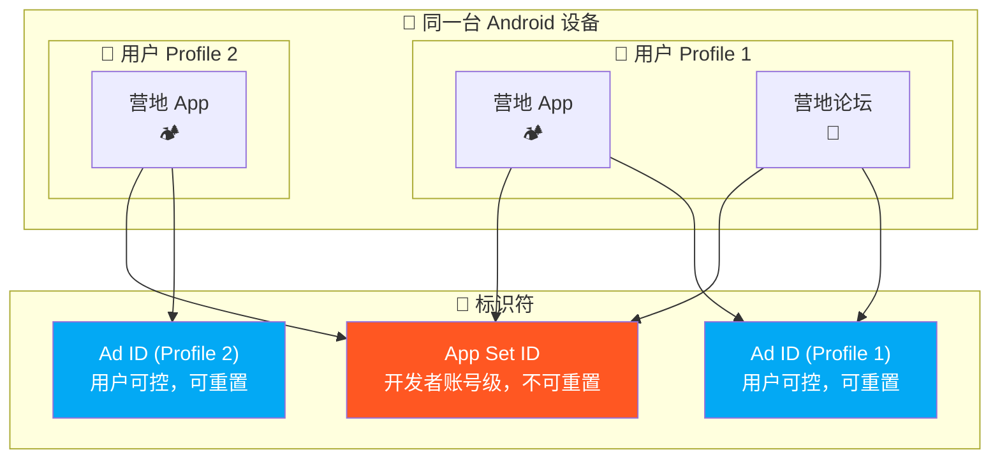
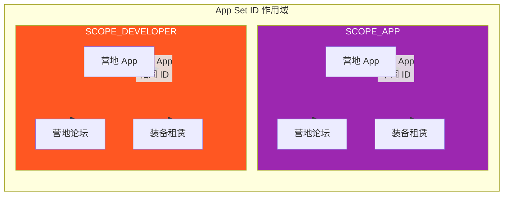
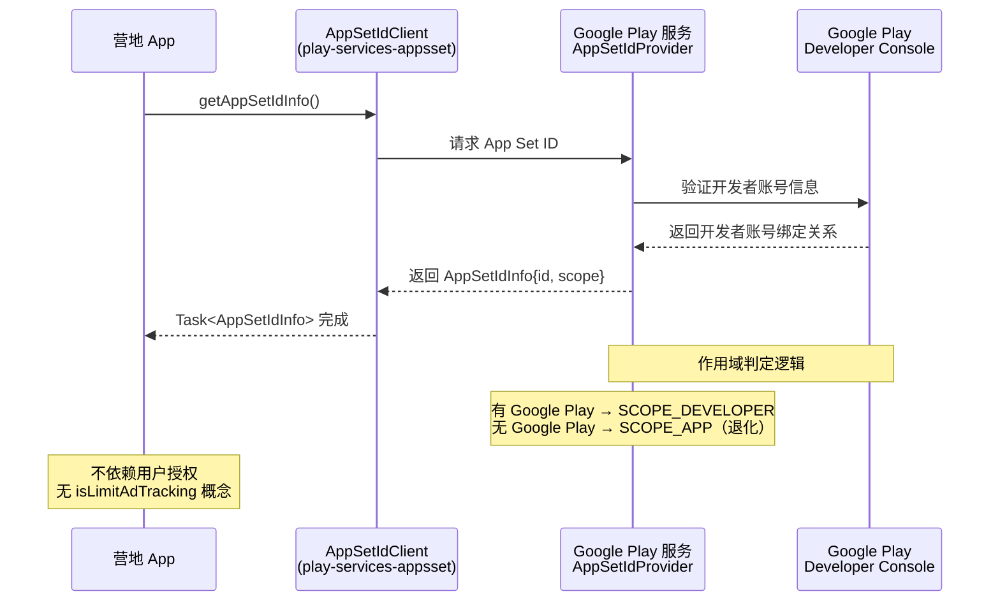
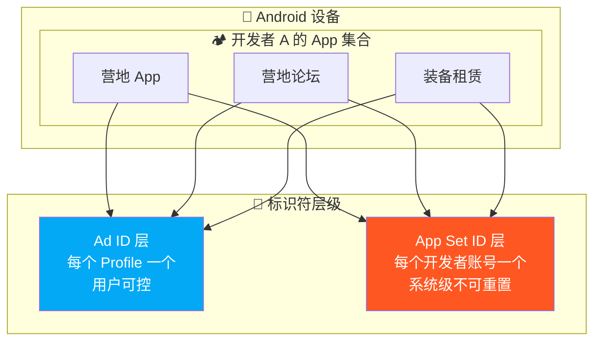

# 3.1.3 识别开发者拥有的应用程序

清晨的雾还没有完全散去。

洛芙是被鸟叫醒的。不是希尔那种"该起床了"的大嗓门，而是一种轻轻的、试探性的啾啾声，像是有什么小东西在帐篷外面犹豫要不要敲门。

她把睡袋的拉链拉开一条缝，凉丝丝的空气立刻钻了进来，带着草叶和露水混合的清甜气息。帐篷外面的世界是一片柔和的灰蓝色——太阳还没有完全升起来，整个营地都笼罩在一层薄薄的晨雾里。

远处的湖面平得像一面镜子，倒映着还没有亮透的天空。几根芦苇从岸边探出头来，叶尖上挂着晶莹的露珠。

"醒了？"

希尔的声音从右边传来。洛芙偏过头，看到她正盘腿坐在一块大石头上，笔记本电脑搁在膝盖上，手指在键盘上飞快地敲着什么。希尔的头发有点乱，脸上还有枕头印——显然也是刚起来没多久。

"你醒得好早……"洛芙揉着眼睛坐起来，声音还带着一点起床气的沙哑。

"睡不着了，想着昨天说的那个问题。"希尔头也不抬，"Ad ID 是用户层面的，一个 profile 一个。但我们营地 App 不只是给用户推荐内容——我们还想做一个开发者层面的统计。比如，不同的营地 App 之间想共享一些数据，但又不是所有用户都需要。"

"等等，"洛芙完全清醒了，"你说'不同的营地 App'？我们不是只做了一个 App 吗？"

希尔终于抬起头，嘴角带着一丝神秘的笑意。

"现在是一个。但以后呢？"

## 从一个问题开始的早晨

希尔把电脑转过来一点，屏幕上是她的笔记本应用，上面画了一个简单的草图。

"想象一下，"她说，"我们公司不只想做一个营地 App。我们还想做一个'营地论坛'、一个'野外装备租赁'、还有一个'露营路线分享'——三个独立的 App，但都是我们公司开发的。"

"四个 App。"洛芙纠正，"还有那个地图工具。"

"对，四个。"希尔在草图上加了一笔，"这时候我们遇到一个问题：怎么知道这四个 App 是同一个开发者发布的？"

洛芙想了想。"用包名？"

"包名能区分 App，但不能告诉服务器'这四个 App 属于同一个开发者'。"希尔说，"更重要的是，如果我们想在四个 App 之间共享一些数据——比如用户买过装备、预约过营地——Ad ID 帮不了我们。"

"为什么？"洛芙问。

"因为 Ad ID 是跟着用户 profile 走的，不是跟着开发者账号走的。"希尔叹了口气，"用户 A 在营地 App 里买东西，用 Ad ID 记下了他的购买记录。但用户 A 打开论坛 App 的时候，服务器根本不知道'这还是那个买了装备的用户 A'。Ad ID 没法跨 App 关联同一个开发者的不同产品。"

洛芙慢慢明白了。"所以需要一个'开发者的编号'，而不是'用户的编号'？"

希尔笑着点头。"答对了。"

晨雾开始变淡了，阳光从树缝间漏下来，在地上投下斑驳的光点。伊莎的帐篷里传来动静——拉链声、伸懒腰的声音，然后伊莎从帐篷里钻出来，头发乱糟糟的，脸上还有枕头印。

"你们在说什么？"伊莎揉着眼睛走过来，声音软软的还带着起床气。

"App Set ID。"希尔说。

伊莎愣了一下，然后眼睛亮了。"开发者层面的标识符？"

"对。"希尔和黛琳异口同声。黛琳不知道什么时候也醒了，正站在帐篷旁边整理头发，脸上也是一副"我早就知道你们在聊什么"的表情。

"你们两个好早啊……"伊莎打了个哈欠。

## App Set ID 是什么

黛琳从背包里拿出四个小纸片，分给每个人，然后在石头上坐下。

"我们先来理清一件事。"她说，"Android 里有很多种 ID，各有各的用途。Ad ID 是给广告追踪用的，跟用户 profile 绑定。Device ID（现在基本禁用了）是跟硬件绑定的。而 App Set ID——"

她在面前的沙地上画了一个简单的图。

"App Set ID 是跟**开发者账号**绑定的。所有用同一个 Google Play 开发者账号发布的 App，在同一台设备上共享同一个 ID。"

"等等，"洛芙举起手，"同一台设备？"

"对。"黛琳点头，"同一部手机上，安装了四个营地系列 App——论坛、装备租赁、路线分享、地图工具。这四个 App 来自同一个开发者账号，它们在同一部手机上会有同一个 ID 值。"

"但如果换了一部手机呢？"洛芙问。

"那就不一样了。"希尔接话，"App Set ID 是设备 + 开发者账号的组合，不是绝对稳定的设备标识符。"

"这个 ID 能被用户重置吗？"伊莎问。

"不能。"黛琳的回答很干脆，"这是 App Set ID 和 Ad ID 最大的区别——App Set ID 不能被用户重置，也不能被删除。它是系统级的，由 Google Play 服务管理。"

洛芙低头看着手里的小纸片。"所以……Ad ID 是用户可以控制的，App Set ID 是开发者控制的？"

"可以这么理解。"黛琳说，"Ad ID 保护用户隐私，用户有权拒绝追踪。App Set ID 是开发者用来识别'我的产品们'的工具，不涉及用户隐私——因为它只在同一开发者的 App 之间共享，不会跨开发者追踪用户。"

希尔把电脑放到地上，转向洛芙。"我给你画个图，更清楚。"

## 双层标识符的世界

希尔在笔记本上新建了一个 Markdown 文件，开始敲 mermaid 代码。



"图 1，"希尔指着屏幕，"这是双层标识符的结构。外层是 Ad ID，跟每个用户 profile 绑定，同一个 App 在不同 profile 里会拿到不同的 Ad ID。内层是 App Set ID，跟开发者账号绑定——不管哪个 profile，只要 App 是同一个开发者发布的，App Set ID 就一样。"

"等等，"洛芙凑近屏幕，"Profile 2 里只有一个 App，Profile 1 里有论坛 App——Profile 2 的 App Set ID 和 Profile 1 一样吗？"

"一样。"希尔点头，"App Set ID 只看 App 是谁发布的，不看用户 profile。同一个开发者的所有 App，App Set ID 都相同。"

伊莎若有所思。"这样的话，服务器看到同一个 App Set ID，就知道'这些请求来自同一家公司的不同 App 的同一个用户'。"

"对，"黛琳说，"但这里有一个重要的前提——App Set ID 的作用域有级别之分。"

"级别？"洛芙眨眨眼。

"两种作用域。"黛琳在地上又画了一个图，"**SCOPE_APP** 和 **SCOPE_DEVELOPER**。"

## 两种作用域

希尔切换到另一个 mermaid 图。



"图 2，"希尔说，"左边是 SCOPE_APP 模式——每个 App 有自己独立的 App Set ID。营地 App 是一个 ID，论坛是一个 ID，装备租赁又是一个 ID。它们之间互不关联。"

"右边是 SCOPE_DEVELOPER 模式——所有来自同一个开发者账号的 App 共享同一个 ID。营地 App、论坛、装备租赁，它们的 App Set ID 是一样的。"

"这两种模式什么时候用？"洛芙问。

"SCOPE_APP 适合分析单个 App 的表现，"黛琳说，"比如你想单独看营地 App 的用户数据，不需要跨 App 关联。"

"SCOPE_DEVELOPER 适合做跨 App 的统一体验，"希尔补充，"比如用户在论坛 App 里买了装备，营地 App 应该知道这笔交易——因为都是同一家公司的产品。"

"那这两种作用域是开发者选的吗？"洛芙又问。

"是 Google Play 决定的。"黛琳说，"通过 Google Play 安装的 App，App Set ID 是 DEVELOPER 作用域——因为 Google 知道你用的是哪个开发者账号。没有 Google Play 的设备，比如某些国产应用市场，App Set ID 可能退化成 APP 作用域——每个 App 有独立 ID。"

"所以 Google Play 不只是一种分发渠道，"伊莎轻声说，"它还是身份认证层。"

"没错。"黛琳点头。

希尔重新拿起电脑。"好，概念讲完了。上代码。"

## AppSetIdClient 的使用

希尔的手指在键盘上飞快地敲打，IDE的界面在晨光中亮起来。

"要用 App Set ID，得先加依赖。"她说，"Google Play 服务 appset 库。"

```kotlin
// build.gradle (Module: app)
// 依赖 App Set ID 客户端库
dependencies {
    // App Set ID 库
    implementation("com.google.android.gms:play-services-appset:16.0.2")
    // 同时需要 Play 服务基础库
    implementation("com.google.android.gms:play-services-base:18.3.0")
}
```

"这个库的核心类是 `AppSetIdClient`。"希尔继续敲，"使用方式是异步的，通过 `Tasks` API 获取结果。"

```kotlin
// 获取 App Set ID 的标准流程
// 必须在后台线程调用
class AppSetIdRepository {

    private val client: AppSetIdClient by lazy {
        AppSetId.getClient(applicationContext)
    }

    /**
     * 获取 App Set ID 信息
     * @param executor 后台线程执行器，用于执行 I/O 操作
     * @param callback 结果回调，在主线程执行
     */
    fun getAppSetIdInfo(
        executor: Executor,
        callback: (AppSetIdResult) -> Unit
    ) {
        // getAppSetIdInfo() 是异步方法，返回 Task<AppSetIdResult>
        // 不要在主线程直接调用，首次调用可能耗时较长
        val task: Task<AppSetIdResult> = client.getAppSetIdInfo()

        task.addOnSuccessListener(executor) { result: AppSetIdResult ->
            // 获取成功
            val appSetId: String = result.id
            val scope: Int = result.scope

            val scopeName = when (scope) {
                AppSetIdInfo.SCOPE_APP -> "SCOPE_APP"
                AppSetIdInfo.SCOPE_DEVELOPER -> "SCOPE_DEVELOPER"
                else -> "UNKNOWN"
            }

            callback(AppSetIdResult.Success(appSetId, scopeName))
        }.addOnFailureListener(executor) { exception: Exception ->
            // 获取失败的几种情况：
            // 1. 设备没有 Google Play 服务
            // 2. Google Play 服务版本过低（低于 18.3.0）
            // 3. 设备上的 App Set ID 服务未正确初始化
            callback(AppSetIdResult.Error(exception))
        }
    }
}

/**
 * App Set ID 获取结果
 * 密封类，强制调用方处理所有可能的分支
 */
sealed class AppSetIdResult {
    data class Success(val appSetId: String, val scope: String) : AppSetIdResult()
    data class Error(val exception: Exception) : AppSetIdResult()
}
```

"这段代码的逻辑和 Ad ID 很像，"希尔说，"都是异步的，都需要后台线程，都有成功和失败两种回调。"

"但有一个关键区别。"黛琳插话，"App Set ID 没有'用户限制'的概念。Ad ID 有 `isLimitAdTrackingEnabled`，用户可以限制广告追踪。但 App Set ID 没有这个标志——它是开发者的工具，不需要用户授权。"

"所以不会有 null 的情况？"洛芙问。

"App Set ID 本身不会返回 null。"希尔说，"但可能返回 `SCOPE_APP` 作用域——这种情况下每个 App 有不同的 ID，跨 App 关联就失效了。你的代码需要能处理这种退化情况。"

## 完整的使用示例

希尔继续敲，屏幕上出现了一段更完整的代码。

```kotlin
// 营地 App 中的实际使用场景
// 场景：跨 App 共享用户偏好设置
class CrossAppPreferencesRepository(
    private val applicationContext: Context
) {
    private val appSetIdClient: AppSetIdClient = AppSetId.getClient(applicationContext)
    private val prefs: SharedPreferences = applicationContext.getSharedPreferences(
        "cross_app_prefs", Context.MODE_PRIVATE
    )

    /**
     * 获取当前设备的 App Set ID
     * 用于关联同一开发者旗下多个 App 的用户数据
     */
    fun fetchAppSetId(callback: (String?, Scope) -> Unit) {
        val executor = Executor { thread -> thread.start() }

        appSetIdClient.getAppSetIdInfo()
            .addOnSuccessListener(executor) { info: AppSetIdInfo ->
                val id: String = info.id
                val scope: Int = info.scope

                // 将 App Set ID 存入本地，备用
                prefs.edit().putString(KEY_APP_SET_ID, id).apply()

                val scopeEnum = when (scope) {
                    AppSetIdInfo.SCOPE_APP -> Scope.APP
                    AppSetIdInfo.SCOPE_DEVELOPER -> Scope.DEVELOPER
                    else -> Scope.UNKNOWN
                }

                callback(id, scopeEnum)
            }
            .addOnFailureListener(executor) { e: Exception ->
                // 获取失败，打印日志，使用本地缓存
                Log.e(TAG, "Failed to get App Set ID", e)
                val cached = prefs.getString(KEY_APP_SET_ID, null)
                callback(cached, Scope.UNKNOWN)
            }
    }

    /**
     * 检查是否可以使用跨 App 关联功能
     * 只有 SCOPE_DEVELOPER 模式下才有效
     */
    fun canUseCrossAppFeatures(scope: Scope): Boolean {
        return scope == Scope.DEVELOPER
    }

    enum class Scope {
        APP,      // 每个 App 有独立 ID，跨 App 关联不可用
        DEVELOPER,// 所有同开发者 App 共享 ID，跨 App 关联可用
        UNKNOWN   // 获取失败，未知状态
    }

    companion object {
        private const val TAG = "CrossAppPrefs"
        private const val KEY_APP_SET_ID = "cached_app_set_id"
    }
}
```

"这个示例展示了两个关键点。"希尔指着屏幕，"第一，失败时有本地缓存降级——获取不到 App Set ID 时，用上次缓存的值撑一下，不至于完全不可用。第二，通过 `Scope` 枚举告诉调用方当前是哪种模式，调用方自己决定要不要用跨 App 功能。"

"好贴心……"洛芙感叹，"不让调用方猜。"

"接口设计的基本原则。"黛琳说，"让正确的用法容易，错误的用法难。"

## 架构全景图

伊莎从旁边拿过希尔的电脑，在代码块下面加了一段注释，然后轻声说："我给你们画个完整的流程图。"

希尔把 IDE 切到一个新的 Markdown 缓冲，开始敲 mermaid。



"图 3，"伊莎说，"这个图展示了完整的调用链路。App 发起请求 → Client 转发 → Google Play 服务里的 Provider 查询开发者账号绑定关系 → 返回结果。"

"关键在于 Google Play 这一步。"黛琳说，"Google Play 知道你的 App 是用哪个开发者账号发布的——这个绑定关系是不可伪造的。所以 App Set ID 的作用域才可靠。"

"没有 Google Play 呢？"洛芙问。

"退化。"希尔说，"Provider 会返回 SCOPE_APP，每个 App 有自己的 ID。这时候跨 App 关联功能就自动失效——你不能假装有这个功能。"

"这就是设计上的诚实。"伊莎轻声说，"不欺骗用户，不伪造能力。"

## 反模式：滥用 App Set ID

"说到诚实，"黛琳的表情变得严肃起来，"App Set ID 有几个绝对不能踩的红线。"

"什么红线？"洛芙问。

"第一，"黛琳竖起一根手指，"不能用 App Set ID 追踪用户。"

"等等，"洛芙愣了一下，"Ad ID 不就是用来追踪用户的吗？"

"Ad ID 是用户层面的追踪，"黛琳说，"用户可以重置、可以删除。App Set ID 是开发者层面的——它本来是用于'识别这是我的哪些 App 的用户'，不是用来追踪'这个用户做了什么'。如果你用 App Set ID 做行为分析，比如记录用户点击了什么、搜索了什么，这是越界。"

"第二，"希尔竖起第二根手指，"不能把 App Set ID 当作用户 ID 来用。"

"用户 ID 应该是账户体系里的那个 ID，"黛琳说，"App Set ID 是设备层面的，同一个用户换手机就变了。你可以用它来辅助去重、关联设备，但不能用它来代替真正的用户身份认证。"

"第三，"伊莎竖起第三根手指，"不能假设 App Set ID 永远不变。"

"它不像 Ad ID 可以被用户重置，但它自己可能会变。"黛琳说，"比如用户刷机恢复了出厂设置，Google Play 服务重新初始化——App Set ID 可能会变。你的服务器端逻辑不能假设这个 ID 永久有效，必须用账户体系来维护真正的用户关系。"

"还有，"希尔补充，"不能依赖 App Set ID 做任何安全相关的功能。它只是一个统计标识符，不是认证凭据。"

洛芙在心里默默记下这三点。

"总结一下，"黛琳说，"App Set ID 是开发者的统计分析工具，不是用户追踪器，更不是认证系统。它和 Ad ID 各司其职——Ad ID 负责广告效果，App Set ID 负责产品线数据整合。"

## App Set ID 与 Ad ID 的对比

希尔新建了一个代码块，把两种 ID 的区别整理成表格。

```kotlin
/**
 * Android 标识符对比：App Set ID vs Ad ID
 * 
 * 这两个标识符服务于完全不同的目的，不能互换使用
 */

// Ad ID：用户层面的广告标识符
// - 作用域：每个用户 profile 一个
// - 用户控制：可重置、可删除
// - 权限：Android 13+ 需要 AD_ID 权限
// - 用途：广告追踪、广告效果归因
// - 限制追踪：isLimitAdTrackingEnabled 标志必须尊重
val adIdInfo: AdvertisingIdInfo = // ...
val adId: String = adIdInfo.id                // 可能为 null（用户删除）
val isTrackingLimited: Boolean = adIdInfo.isLimitAdTrackingEnabled

// App Set ID：开发者层面的产品标识符
// - 作用域：开发者账号（SCOPE_DEVELOPER）或单个 App（SCOPE_APP）
// - 用户控制：不可重置、不可删除
// - 权限：无需特殊权限
// - 用途：同一开发者旗下多 App 的数据关联、产品线分析
// - 限制追踪：无此概念
val appSetIdInfo: AppSetIdInfo = // ...
val appSetId: String = appSetIdInfo.id        // 永不为 null，但 scope 可能退化
val scope: Int = appSetIdInfo.scope           // SCOPE_APP 或 SCOPE_DEVELOPER
```

"两种 ID 各有各的地盘，"希尔说，"混用了就会出问题。Google Play 政策对这块管得很严——如果发现 App 用 App Set ID 做用户追踪，轻则警告，重则下架。"

"这两个 ID 可以同时使用吗？"洛芙问。

"可以，而且推荐同时使用。"黛琳说，"Ad ID 用于广告效果分析，App Set ID 用于产品线数据整合——两者互不干扰，服务于不同的目的。"

## 清晨露营地上的收尾

太阳终于完全升起来了。

金色的光线洒在湖面上，露水开始从草叶上滑落，整个营地都被镀上了一层暖色。希尔合上电脑，伊莎伸了个懒腰，黛琳开始收拾昨晚散落在石头上的笔记本。

洛芙盘腿坐在草地上，闭着眼睛回想刚才学到的东西。

App Set ID。开发者账号级别的标识符。同一个开发者发布的 App 共享同一个 ID，但不同设备上不一样。它不能重置，不能删除，不需要用户授权，也没有追踪限制的概念。它只负责一件事——告诉服务器"这是我的哪些 App 的用户"。

而 Ad ID 是用户可以控制的广告追踪工具，用户可以选择拒绝。

两条路，各走各的。

"洛芙，"希尔的声音打断了她的思绪，"想什么呢？"

"在想，"洛芙睁开眼睛，看着头顶渐渐变蓝的天空，"Android 设计这套标识符系统，其实是在问一个问题：谁拥有什么权利？"

"用户有权拒绝追踪——Ad ID 给用户这个权利。开发者有权关联自己的产品——App Set ID 给开发者这个权利。但两边都不能越界。"

"说得很好。"黛琳微笑着走过来，"这就是 Android 隐私设计哲学的核心——多方制衡，互相不能侵犯。"

"而且，"伊莎补充，"系统通过'不可重置'和'可重置'这两个属性，把越界的成本变得很高。你想偷偷追踪用户？Ad ID 随时可以重置，让你的数据失效。你想伪造开发者身份？App Set ID 绑定 Google Play 账号，没法伪造。"

希尔站起身，拍了拍裤子上的草屑。

"好了，今天就到这里。收拾东西，准备出发。"

洛芙站起来，腿有点麻。她看了看四周——晨雾已经完全散了，湖面在阳光下闪闪发光，远处有几只野鸭在游弋。

新的一天开始了。

"等一下，"她突然说，"我想确认一件事。"

"说。"

"App Set ID 是跟着开发者账号走的，不是跟着 App 走的——所以如果我把营地 App 的所有权转给另一个公司，App Set ID 也会变？"

希尔和黛琳对视一眼。

"好问题。"黛琳说，"答案是——会的。开发者账号变了，App Set ID 就变了。因为它本质上绑定的是开发者账号，不是 App 本身。"

"所以 App Set ID 只能在同一开发者账号下使用，换了账号就失效了。"

"对。"

洛芙点点头，把这个知识点记在心里。

"现在可以出发了。"她说。

---

## 专业技术总结

**App Set ID** — Android 系统提供的开发者账号级标识符，同一开发者账号发布的多个 App 在同一设备上共享同一个 ID，用于跨 App 数据关联和产品线分析，不可被用户重置或删除。

### 结构图



### 复杂度与影响

App Set ID 的获取操作本身耗时约 30-100ms（通过 Google Play 服务 IPC），与 Ad ID 的性能特征类似。因为使用 `Tasks` API 实现异步非阻塞调用，对主线程无直接影响。核心性能风险在于：未正确处理 `SCOPE_APP` 退化场景导致跨 App 功能静默失效。

### 反模式与陷阱

1. **用 App Set ID 做用户行为追踪** → App Set ID 的设计目的是跨 App 产品关联，不是用户行为分析。修复：仅用于产品线数据整合，广告效果分析用 Ad ID。
2. **假设 App Set ID 恒定不变** → 虽然用户无法重置，但刷机、更换 Google 账号、App 转让给其他开发者等情况会导致 ID 变化。修复：服务器端使用账户体系维护用户关系，不依赖单一设备标识符。
3. **忽略作用域退化（SCOPE_APP）** → 无 Google Play 设备会退化成每个 App 独立 ID，跨 App 功能自动失效。修复：通过 `scope` 字段检测退化，主动降级并记录日志。
4. **用 App Set ID 代替用户认证** → App Set ID 是设备统计标识符，不是安全凭据。修复：需要用户身份时使用 Credential Manager 实现登录。

---

#### 🏕️ 动手练习

**项目目标**：构建一个 App Set ID 读取与跨 App 共享演示工具，理解开发者账号级标识符的设计意图和使用场景。

**Task 1：搭建项目与依赖**

目标：创建项目并引入 App Set ID Library。

步骤：
- 在 Android Studio 中创建新项目（Empty Activity，Kotlin）
- 在 `build.gradle (Module)` 中添加：`implementation("com.google.android.gms:play-services-appset:16.0.2")`
- 同步 Gradle，确认无冲突

验收标准：
- [ ] 项目编译通过，无依赖冲突
- [ ] Build 输出无版本不兼容警告
- [ ] `build.gradle` 中记录了添加的依赖版本

**Task 2：封装 AppSetIdClient 读取类**

目标：实现一个带完整错误处理和作用域检测的 AppSetIdClient 封装。

步骤：
- 创建 `AppSetIdRepository.kt`，使用 `object` 单例模式
- 实现 `getAppSetId()` 方法，在后台线程调用 `AppSetIdClient.getAppSetIdInfo()`
- 在 `onSuccess` 回调中解析 `AppSetIdInfo.id` 和 `AppSetIdInfo.scope`
- 在 `onFailure` 回调中打印错误日志并使用空值降级

验收标准：
- [ ] 正确区分 `SCOPE_APP` 和 `SCOPE_DEVELOPER`
- [ ] `getAppSetIdInfo()` 在后台线程执行（使用 `Executors.newSingleThreadExecutor()`）
- [ ] Logcat 中能看到 `scope` 字段的值（`SCOPE_APP` 或 `SCOPE_DEVELOPER`）

**Task 3：实现作用域感知的跨 App 功能判断**

目标：根据 App Set ID 的作用域决定是否启用跨 App 功能。

步骤：
- 在 Repository 中添加 `canUseCrossApp(scope: Int): Boolean` 方法
- 当 scope 为 `SCOPE_DEVELOPER` 时返回 `true`，否则返回 `false`
- 在 UI 中展示当前作用域和跨 App 功能是否可用

验收标准：
- [ ] UI 明确显示"开发者作用域（可用）"或"App 作用域（不可用）"
- [ ] 跨 App 功能状态随 scope 变化而正确切换
- [ ] 功能不可用时有友好提示

**Task 4：实现本地缓存降级**

目标：当 App Set ID 获取失败时，使用 SharedPreferences 缓存的历史值。

步骤：
- 每次成功获取后，将 `id` 和 `scope` 存入 SharedPreferences
- 获取失败时，读取缓存值并标记为"可能过期"
- UI 上对缓存数据加特殊标记（如时间戳），提示用户这是历史数据

验收标准：
- [ ] 缓存命中率在首次获取后为 100%（内存缓存）
- [ ] 获取失败时使用缓存值，不崩溃
- [ ] UI 上能区分"实时数据"和"历史缓存"

**Task 5：对比 Ad ID 和 App Set ID**

目标：在同一项目中同时使用两种 ID，体会它们的互补关系。

步骤：
- 在项目中同时引入 `play-services-ads-identifier` 和 `play-services-appset` 依赖
- 创建两个 Repository：`AdIdRepository` 和 `AppSetIdRepository`
- 在同一界面展示两种 ID 的值、作用域/是否限制追踪
- 用注释说明两者的使用场景区别

验收标准：
- [ ] 两种 ID 同时获取，互不干扰
- [ ] Ad ID 可能为 null（用户删除），App Set ID 永不为 null
- [ ] 代码注释准确说明两者的不同职责

**Task 6：单元测试（Mock Google Play 服务不可用）**

目标：在测试环境中模拟 App Set ID 获取失败的场景。

步骤：
- 使用 `mockito-kotlin` Mock `AppSetIdClient`
- 模拟两种失败场景：`Exception`（服务不可用）和 `Task` 返回 SCOPE_APP
- 验证回调结果正确处理了所有异常分支

验收标准：
- [ ] 测试覆盖成功、失败、作用域退化三种场景
- [ ] Mock 环境下测试可通过
- [ ] 缓存降级逻辑有对应测试

**Task 7：混淆与 ProGuard 配置**

目标：确保 App Set ID 相关 API 不被混淆破坏。

步骤：
- 在 `proguard-rules.pro` 中添加 Google Play Services appset 的混淆规则
- 开启混淆构建，检查 APK 是否正常

验收标准：
- [ ] ProGuard 规则包含 `-keep class com.google.android.gms.appset.** { *; }`
- [ ] 混淆后 APK 可正常安装运行
- [ ] App Set ID 获取功能不受影响

**Task 8：综合测试与总结**

目标：完整运行一次 App Set ID 获取流程，撰写测试报告。

步骤：
- 运行 App，记录不同设备的 App Set ID 值和作用域
- 在有 Google Play 和无 Google Play 的设备上分别测试
- 撰写测试报告，包含：成功路径、失败路径、作用域判定、Ad ID 对比

验收标准：
- [ ] 测试报告包含所有场景的运行结果
- [ ] 文档说明 App Set ID 的适用场景与不适用场景
- [ ] 代码符合 Google Play 开发者政策要求

**面试热身**

Q1：用一句话解释 App Set ID 是什么，以及它和 Ad ID 的根本区别。

Q2：App Set ID 的两种作用域（SCOPE_APP 和 SCOPE_DEVELOPER）分别是什么时候触发？开发者能控制吗？

Q3：为什么 App Set ID 没有类似 Ad ID 的"isLimitAdTrackingEnabled"概念？

Q4：App Set ID 获取失败时，应该如何做降级处理？请从代码实现和用户体验两个角度回答。

Q5：能用 App Set ID 做用户登录吗？什么情况下 App Set ID 会发生变化？

### 参考实现要点

1. **始终后台线程调用**：`getAppSetIdInfo()` 是耗时 I/O 操作（涉及 IPC），必须通过 `Executor` 切换到后台线程。
2. **处理作用域退化**：无 Google Play 设备会退化为 `SCOPE_APP`，跨 App 功能自动失效。通过 `scope` 字段主动检测并降级。
3. **不用于用户追踪**：App Set ID 是开发者产品线分析工具，广告效果分析用 Ad ID，不可混用。
4. **不作为认证凭据**：App Set ID 是统计标识符，永久用户关系必须用账户体系维护。
5. **失败降级策略**：获取失败时使用本地缓存值 + 标记过期，而不是直接返回空。

---

> 学习建议
>
> App Set ID 的核心是理解"开发者账号"这个概念——它是 Google Play 为每个开发者账号分配的内部标识符，用于在设备层面识别"这是我的哪些 App 的用户"。学习时抓住三个关键词：开发者级别、不可重置、跨 App 关联。动手时重点测试作用域退化场景（模拟无 Google Play 环境），这是最容易忽略的边界条件。

## 洛芙的小小日记本

今天学到了 App Set ID，和 Ad ID 完全不一样的东西。Ad ID 是用户的权利，App Set ID 是开发者的工具。一个保护用户，一个服务开发者。感觉 Android 这套标识符系统，就像一个社会——每个人、每个公司都有自己的权利和义务，谁也不能越界。希尔学姐说，做产品最难的就是"知道自己的边界在哪里"。我好像开始有点懂了。

## 今日关键词

**App Set ID** — 开发者账号级设备标识符，同一开发者发布的多个 App 在同一设备上共享同一个 ID，用于跨 App 数据关联和产品线分析。

**AppSetIdClient** — Google Play 服务提供的 App Set ID 客户端类，通过 `getAppSetIdInfo()` 方法异步获取 App Set ID 信息。

**AppSetIdInfo** — App Set ID 的信息封装类，包含 `id`（标识符值）和 `scope`（作用域）两个字段。

**SCOPE_DEVELOPER** — App Set ID 的开发者作用域，同一开发者账号下的所有 App 共享同一个 ID，适用于跨 App 数据关联场景。

**SCOPE_APP** — App Set ID 的 App 级作用域，每个 App 有独立的 ID，适用于单 App 分析场景。无 Google Play 设备会退化至此模式。

**Google Play 服务（Google Mobile Services, GMS）** — Android 设备上的 Google 核心服务集合，提供 App Set ID Provider、Ad ID Provider 等身份标识服务。

**Ad ID（Advertising ID）** — 用户层面的广告标识符，与用户 profile 绑定，可被用户重置或删除，用于广告追踪。

**Tasks API** — Google Play 服务提供的异步任务 API，通过 `addOnSuccessListener` 和 `addOnFailureListener` 处理异步结果。

**作用域（Scope）** — App Set ID 的作用范围定义，`SCOPE_DEVELOPER` 表示开发者级别，`SCOPE_APP` 表示 App 级别。

**跨 App 关联** — 使用 App Set ID 将同一开发者的多个 App 的用户行为数据进行关联，用于产品线级别的数据分析和统一用户体验。

**SharedPreferences** — Android 轻量级键值存储，用于缓存 App Set ID 等配置信息，支持应用重启后数据持久化。

**Executor** — Java 并发框架接口，用于将任务分配到后台线程执行，避免阻塞主线程。
