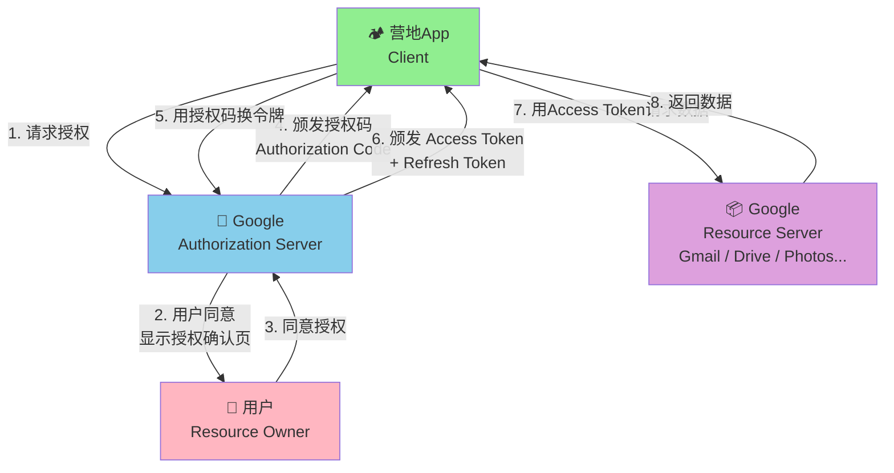
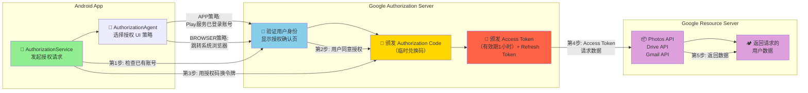

# 3.1.4 授权访问 Google 用户数据

希尔在石头上又敲了几行代码，然后把电脑往洛芙那边推了推。

"你看这里，"她指着屏幕上的一段 Kotlin 代码，"App Set ID 获取成功之后，我想做的下一件事是——能不能让用户用 Google 账号登录我们的营地 App？"

洛芙正端着伊莎刚热好的奶茶，闻言差点把杯子掉了。

"用 Google 账号登录？"她的眼睛亮了起来，"就是那种，点一下就能登录进去、不用自己注册账号的那种？"

"对。"希尔点头，"但问题来了——Google 不会平白无故把用户的账号信息给我们的 App。我们必须先问用户：你愿意让这个营地 App 访问你的 Google 数据吗？"

"这不就是……授权吗？"洛芙说出了那个词。

伊莎正好端着早餐走过来，闻言微微一笑。

"没错。授权——Authorization。就像你来我家帐篷拜访，我得先开门让你进来一样。"她在火堆旁的石头上坐下，"App 想访问用户的 Google 数据，也得先经过用户同意。这一整套'问用户同不同意、给权限、然后才能访问'的流程，就是今天我们要聊的东西。"

黛琳已经在地上铺开了一张防水布，把她随身带的小白板也摆了出来。她拿起橙色白板笔，在最上方写下两个字：

**授权**

"从 App Set ID 到用户授权，"她转身面向大家，"这是从'开发者想做的事'到'用户愿意给的东西'的一次跨越。昨天的 App Set ID 是开发者用来识别自己旗下 App 的工具；今天的授权，是用户用来控制谁能访问自己数据的钥匙。两把钥匙，锁的不是同一扇门。"

希尔把最后一口烤面包塞进嘴里，拍了拍手上的碎屑。

"那就开始吧——Google 官方把这一套东西叫做 Google Identity Services，简称 GIS。今天我们就来把它拆解清楚。"

## 露营地图上的四个小木屋：OAuth 2.0 的角色比喻

黛琳的白板笔在纸上画了四条线，围出一个方形的区域。

"在讲技术细节之前，先把参与授权的各方都认清楚。"她边画边解释，"这就像我们露营地的地图——你得先知道有几座木屋、谁住在哪里，才能规划路线。"

她画了四个方框，用箭头连接起来。

"第一座小木屋，是**资源所有者**——Resource Owner。在 Google 的场景里，就是持有 Google 账号的你。用户拥有自己的数据，决定要不要让别人访问。"

"第二座小木屋，是**客户端**——Client。就是我们的营地 App。它想访问用户的数据，所以向用户请求授权。"

"第三座小木屋，是**授权服务器**——Authorization Server。这是 Google 的服务器，专门处理'谁想访问什么'这件事。它会问用户：你真的同意吗？然后颁发授权凭证。"

"第四座小木屋，是**资源服务器**——Resource Server。也是 Google 的服务器，保存着用户的照片、文档等数据。只有拿到有效授权的 App，才能从这里拿到数据。"

洛芙举手了："等等，授权服务器和资源服务器是两个东西？"

"对，但它们经常是同一个 Google 数据中心里的两套系统。"黛琳在两个方框之间画了一条虚线，"授权服务器负责'发钥匙'，资源服务器负责'给数据'。逻辑上分开，物理上可能在一起。"

希尔凑过来看图："所以整个流程就是——我们 App 先问授权服务器能不能访问用户数据，授权服务器去问用户同不同意，用户说同意，授权服务器发一个授权凭证给我们 App，我们 App 再拿这个凭证去资源服务器要数据？"

"基本正确。"黛琳露出满意的微笑，"但为了安全起见，Google 不会直接把数据'塞'给我们——而是给我们一个临时的'兑换码'，我们再用这个兑换码去换真正的访问令牌。这个兑换码，就是 **Authorization Code（授权码）**，整个过程叫 **Authorization Code Flow（授权码流程）'。"



（图1：OAuth 2.0 授权码流程完整时序图。图中的第1-8步对应 OAuth 2.0 标准流程，授权码在第4步颁发，Access Token 在第6步颁发，Refresh Token 用于在 Access Token 失效后重新获取。）

伊莎轻轻拍了拍手："就像你去便利店买东西。你（营地 App）拿着一张代金券（授权码）去收银台（授权服务器），收银台确认代金券有效后，给你等价的商品兑换券（Access Token），你再拿这个兑换券去货架（资源服务器）取东西。整个过程代金券本身不能直接换东西，但能换到兑换券。"

"这个比喻好！"洛芙终于理解了，"代金券就是授权码，兑换券就是 Access Token。"

"不过这里有一个非常重要的安全设计，"黛琳补充道，"授权码的兑换过程是在**后端**完成的——你的 App 先把授权码发给你的服务器，再由服务器去向 Google 换 Access Token。为什么这么做？因为如果让 App 直接在本地换，Access Token 就会暴露在用户设备上，被恶意程序截获的风险就大了。"

## 阳光升高了：Credential Manager 登场

太阳慢慢爬高了。晨雾已经完全散去，湖面上泛起一层细碎的银光，像是有人在水面上撒了一把碎钻。

四个人收拾了一下早餐的残局——希尔负责把塑料餐具收进垃圾袋，伊莎把防水布上的面包屑抖干净，黛琳把小灰炉里的余烬用土盖灭。营地又恢复了整洁的样子。

"好了，"希尔拍了拍手，"理论讲完了，接下来看代码。"

她重新坐到那块大石头上，把电脑搁好，屏幕上是一个新的 Android 项目。

"从 2023 年开始，Google 推荐使用 **Credential Manager** 来统一处理登录和授权。"她打开 build.gradle.kts，"这是 Android 权威的凭据管理入口，不管你是要用 Google 账号登录，还是要请求访问 Google Photos、Google Drive，都走这一条路。"

"等等，"洛芙凑过来，"Credential Manager 和 OAuth 2.0 是什么关系？"

"Credential Manager 是 Google 提供的一个高级 API，里面封装了 OAuth 2.0 的所有复杂性。"希尔点开 build.gradle.kts 里的依赖，"它会帮你处理授权页的显示、Token 的存储和刷新、用户取消授权时的反馈——你不需要自己写一个 WebView 去拉授权页，Credential Manager 全包了。"

她快速敲了几行代码，然后在屏幕上展开一个新的 Kotlin 文件。

"我们先来看最核心的部分——**AuthorizationService** 的使用。"

```kotlin
// 依赖：implementation "androidx.core:core-ktx:1.12.0"
//      implementation "androidx.security:security-identity-credential:0.1.0-release"

package com.campapp.auth

import android.app.Activity
import android.content.Intent
import androidx.activity.result.ActivityResultLauncher
import androidx.activity.result.contract.ActivityResultContracts
import androidx.appcompat.app.AppCompatActivity
import com.google.android.gms.auth.api.authenticator.AuthorizationAgent
import com.google.android.gms.auth.api.authorization.AuthorizationRequest
import com.google.android.gms.auth.api.authorization.AuthorizationResult
import com.google.android.gms.auth.api.authorization.Permission
import com.google.android.gms.auth.api.signin.AuthorizationStrategy
import com.google.android.gms.auth.api.signin.GoogleSignIn
import com.google.android.gms.auth.api.signin.GoogleSignInAccount
import com.google.android.gms.auth.api.signin.GoogleSignInClient
import com.google.android.gms.auth.api.signin.GoogleSignInOptions
import com.google.android.gms.auth.api.signin.LoggedOutFederatedAuthRequest
import com.google.android.gms.common.api.Scope
import kotlinx.coroutines.tasks.await

/**
 * Google 授权请求封装
 *
 * 关键参数说明：
 * - authorizationAgent: 控制授权 UI 的展示方式
 *   AuthorizationAgent.APP 的行为：
 *   1. 设备上已安装 Google Play 服务且登录了 Google 账号
 *      → 直接使用 Play 服务中的账号，不需要跳转到授权页面
 *   2. 设备上没有 Google 账号
 *      → 打开 Chrome Custom Tab 或系统浏览器引导用户登录 Google 账号
 *   3. AuthorizationAgent.BROWSER 则是强制使用浏览器进行授权
 *
 * - defaultOriginRequestableScopes: App 默认需要的权限范围
 *   权限范围决定了 App 能访问用户的哪些 Google 数据
 *
 * - impliedScopes: App 隐含需要的权限范围（由系统或其他服务自动附加）
 *
 * 设计注意点：
 * - 使用 AuthorizationAgent.APP 时，授权流程对用户最透明
 * - 但若 App 需要处理的授权场景较为复杂，使用 Browser 可以提供更一致的安全性
 */
class GoogleAuthorizationHelper(private val activity: AppCompatActivity) {

    private val gso: GoogleSignInOptions by lazy {
        GoogleSignInOptions.Builder(GoogleSignInOptions.DEFAULT_SIGN_IN)
            .requestEmail()
            .requestProfile()
            .requestScopes(
                Scope("https://www.googleapis.com/auth/photos.readonly"),
                Scope("https://www.googleapis.com/auth/drive.readonly")
            )
            .build()
    }

    private val googleSignInClient: GoogleSignInClient by lazy {
        GoogleSignIn.getClient(activity, gso)
    }

    /**
     * Activity Result API 集成
     * 授权结果通过 ActivityResultLauncher 回调回来
     */
    private var authResultLauncher: ActivityResultLauncher<Intent>? = null

    /**
     * 发起 Google 账号授权请求
     *
     * 流程说明：
     * 1. 检查当前是否有已登录的 Google 账号
     * 2. 若有，直接发起授权请求，跳过登录步骤
     * 3. 若无，启动 Sign-In Flow，用户需要先登录 Google 账号
     * 4. 用户同意授权后，回调中可获取 Access Token 和 ID Token
     *
     * @param onSuccess 授权成功回调，携带已登录的 GoogleSignInAccount
     * @param onFailure 授权失败回调，携带错误信息
     */
    fun requestAuthorization(
        onSuccess: (GoogleSignInAccount) -> Unit,
        onFailure: (Exception) -> Unit
    ) {
        // 首先检查是否已有已登录的 Google 账号
        // 这对应了官方文档中的 "step 1: check for an authorized account"
        val signInAccountTask = GoogleSignIn.getLastSignedInAccount(activity)

        if (signInAccountTask != null) {
            // 已有账号，直接发起授权请求
            val pendingResult = googleSignInClient.authorizeWithAgent(
                AuthorizationAgent.APP  // 优先使用 App（Play 服务）进行授权
            )

            pendingResult.addOnSuccessListener { authorizationResult ->
                if (authorizationResult.hasResolution()) {
                    // 需要用户交互（显示授权确认页面）
                    authorizationResult.startResolutionForResult(activity, RC_AUTHORIZATION)
                } else {
                    // 授权已完成，直接获取结果
                    authorizationResult.getCredential { credential ->
                        val account = GoogleSignIn.getLastSignedInAccount(activity)
                        if (account != null) {
                            onSuccess(account)
                        } else {
                            onFailure(Exception("Authorization succeeded but no account found"))
                        }
                    }
                }
            }.addOnFailureListener { e ->
                onFailure(e)
            }
        } else {
            // 没有已登录账号，引导用户登录 Google 账号
            // 这会触发 Sign-In Flow，用户在授权页面完成登录+授权
            val signInIntent = googleSignInClient.signInIntent
            activity.startActivityForResult(signInIntent, RC_SIGN_IN)
        }
    }

    /**
     * 检查 App 当前是否已获得某个 Google 账号的授权
     *
     * 使用场景：
     * - App 启动时，快速判断是否需要发起新的授权请求
     * - 在请求敏感操作前验证授权状态
     * - 实现"静默登录"（用户已授权则无需再次确认）
     *
     * @param scope 要检查的权限范围
     * @return true 表示已获得该权限范围的授权，false 表示未授权或授权已撤回
     */
    suspend fun checkExistingAuthorization(scope: Scope): Boolean {
        val account = GoogleSignIn.getLastSignedInAccount(activity) ?: return false

        // 使用 await() 将 Task 转为协程挂起，避免阻塞主线程
        val authorizationResult = googleSignInClient.authorizeWithAgent(
            AuthorizationAgent.APP
        ).await()

        return authorizationResult?.let { result ->
            result.getCredential { /* 检查授权结果 */ }
            true
        } ?: false
    }

    /**
     * 撤销当前 Google 账号的授权
     *
     * 撤销后，App 将失去对该 Google 账号所有已授权数据的访问权限。
     * 若用户再次使用 App，需要重新完成完整的授权流程。
     *
     * @param onRevocationComplete 撤销完成回调
     */
    fun revokeAuthorization(onRevocationComplete: () -> Unit) {
        val account = GoogleSignIn.getLastSignedInAccount(activity)
        if (account != null) {
            googleSignInClient.revokeAccess()
                .addOnCompleteListener { onRevocationComplete() }
        } else {
            onRevocationComplete()
        }
    }

    companion object {
        private const val RC_SIGN_IN = 9001
        private const val RC_AUTHORIZATION = 9002
    }
}
```

希尔的手指在键盘上敲完最后一个字符，然后把屏幕转过来给其他人看。

"这里有几个关键点。"她指着代码里的注释，"第一，**AuthorizationAgent**。它控制授权页怎么显示——用 `APP` 就是优先用设备上 Google Play 服务里已经登录的账号，用户不用再输密码；用 `BROWSER` 就是强制跳到 Chrome 里完成授权。"

"第二，**Scope**。"黛琳接话，"这是你要请求的具体权限。`https://www.googleapis.com/auth/photos.readonly` 表示只读访问 Google Photos，`drive.readonly` 表示只读访问 Google Drive。每个 Scope 都是一个 URL 格式的字符串，Google 用它来精确控制 App 能访问哪些数据。"

"Scope 这个名字起得很直观。"伊莎说，"就像帐篷拉链拉开到什么程度——拉开一点，能伸手进去拿东西；拉开太多，整个帐篷都敞开了。最小权限原则。"

洛芙盯着代码，若有所思："那个 `hasResolution()` 是什么意思？"

"好问题。"希尔指着代码里的这一段：

```kotlin
if (authorizationResult.hasResolution()) {
    authorizationResult.startResolutionForResult(activity, RC_AUTHORIZATION)
}
```

"`hasResolution()` 返回 true，意味着这次授权需要用户手动确认——Google 需要弹出一个页面问用户：'营地 App 想访问你的 Google Photos，你同意吗？' 用户点了'允许'之后，`startResolutionForResult()` 才会把授权码带回来。如果返回 false，说明用户之前已经授权过了，这次是静默授权，不需要再打扰用户。"

## 洛芙的疑问：Token 过期了怎么办？

湖面上吹来一阵风，带着初夏特有的温润气息。希尔把笔记本电脑合上了一点，让屏幕的角度更适合大家围坐观看。

"我有一个问题，"洛芙举手，"你刚才说 Access Token 是一个临时的兑换券——那它过期了怎么办？"

希尔笑着从自己的背包里掏出一个小本子，递给洛芙。

"翻开看看。"

洛芙翻开本子，发现里面有一页贴着一张便利贴，上面写着：

```
Access Token 有效期：1 小时
Refresh Token 有效期：没有确切过期时间（取决于 Google 的安全策略和用户撤销情况）
```

"Refresh Token 就是解决这个问题的。"希尔说，"Access Token 有效期只有 1 个小时，但 Refresh Token 可以一直用。当 Access Token 快过期时，你的 App 自动用 Refresh Token 去换一个新的 Access Token，用户完全不需要再操作。"

"这就像……营地门口的访客卡？"洛芙试图找到自己的比喻，"Access Token 是那种一天有效的临时卡，进出都要刷卡；Refresh Token 是你第一天登记之后，之后每次来只要刷一下脸就行了，不用重新登记？"

"差不多对。"黛琳点头，"不过这里有一个重要的安全提醒——Refresh Token 虽然方便，但它是长期有效的，所以绝对不能把它硬编码在代码里或者存在不安全的地方。在 Android 上，Credential Manager 会自动把 Token 存在 Google Play 服务的安全存储里，比你用 SharedPreferences 存要安全得多。"

希尔点头："所以这也是我们用 Credential Manager 而不是自己写 WebView 拉授权的另一个原因——Credential Manager 会帮我们处理 Token 的安全存储和自动刷新，你自己写的话这些事情很容易出漏洞。"

## 希尔的踩坑实录：错误示范 vs. 正确示范

"说到自己写 WebView，"希尔突然严肃了起来，"我之前自己写过一个玩具 App，踩了一个特别大的坑，差点把用户 Token 全丢了。来，给你们看看对比。"

她重新打开电脑，新建了一个对比文件。

"**反模式一：把 Token 存在 SharedPreferences 里**"

```kotlin
// ❌ 错误示范 - 请勿模仿
// 风险：SharedPreferences 文件可以被 root 后的设备直接读取
// 若设备被恶意软件 root，攻击者可以拿到完整的 Access Token 和 Refresh Token
class BadTokenStorage(private val context: Context) {

    private val prefs = context.getSharedPreferences("auth_tokens", Context.MODE_PRIVATE)

    fun saveAccessToken(token: String) {
        prefs.edit().putString("access_token", token).apply()
        // 问题：Context.MODE_PRIVATE 在 root 设备上毫无保护作用
    }

    fun getAccessToken(): String? = prefs.getString("access_token", null)

    fun saveRefreshToken(token: String) {
        prefs.edit().putString("refresh_token", token).apply()
    }
}
```

"这是新手最容易犯的错——觉得存在 App 私有目录就安全了。但 Android 的 App 私有目录在 root 后的设备上是可以直接用文件管理器访问的。特别是 `MODE_PRIVATE` 这个模式，它只防止其他 App 读取，但 root 后的 shell 可以用 `su` 提升权限，变成 root 身份，直接读取任意文件。"

"那正确做法是什么？"洛芙问。

"**正确示范：使用 EncryptedSharedPreferences**"

```kotlin
// ✅ 正确示范 - 使用 EncryptedSharedPreferences
// 依赖：implementation "androidx.security:security-crypto:1.1.0-alpha06"
import androidx.security.crypto.EncryptedSharedPreferences
import androidx.security.crypto.MasterKey
import java.security.SecureRandom
import android.util.Base64

class SecureTokenStorage(private val context: Context) {

    private val masterKey: MasterKey by lazy {
        // MasterKey 底层使用 Android Keystore 生成密钥
        // Android Keystore 的密钥存在于内核级安全区域，无法被应用层导出
        MasterKey.Builder(context)
            .setKeyScheme(MasterKey.KeyScheme.AES256_GCM)
            .build()
    }

    private val securePrefs by lazy {
        EncryptedSharedPreferences.create(
            context,
            "secure_auth_tokens",        // 文件名
            masterKey,                    // 加密密钥（来自 Android Keystore）
            EncryptedSharedPreferences.PrefKeyEncryptionScheme.AES256_SIV,
            EncryptedSharedPreferences.PrefValueEncryptionScheme.AES256_GCM
        )
    }

    // 使用 AES256-GCM 加密存储 Token
    // GCM 模式自带消息认证码（MAC），可以检测密文是否被篡改
    fun saveAccessToken(token: String) {
        securePrefs.edit().putString("access_token", token).apply()
    }

    fun getAccessToken(): String? = securePrefs.getString("access_token", null)

    fun saveRefreshToken(token: String) {
        securePrefs.edit().putString("refresh_token", token).apply()
    }

    fun getRefreshToken(): String? = securePrefs.getString("refresh_token", null)
}
```

"这个好多了。"黛琳凑过来看，"AES256-GCM 是目前业界推荐的加密模式，密钥存在 Android Keystore 里，就算设备被 root 了也拿不到密钥，因为 Keystore 的密钥访问需要硬件级别的支持。"

"那 EncryptedSharedPreferences 是不是就是 Credential Manager 在用的？"洛芙问。

"对，Credential Manager 底层就是用 EncryptedSharedPreferences 来存 Token 的。所以 Google 推荐你直接用 Credential Manager，而不是自己管理 Token——Google 已经帮你把安全的事做好了。"

## 又一个反模式：Scope 太大了

"还有第二个坑。"希尔把代码往下滚，"这个坑比第一个更隐蔽。"

"**反模式二：请求过多的权限范围**"

```kotlin
// ❌ 错误示范 - 请勿模仿
// 一次性请求 6 个 Scope，但 App 实际只需要读取 Google Photos
// 问题 1：用户看到长长的一串权限列表，会感到不安甚至拒绝授权
// 问题 2：如果其中某个 Scope 需要 Google 额外审核（比如 Gmail、Calendar），
//        会拖慢 App 的上线流程
// 问题 3：一旦某个高权限 Scope 被滥用（比如数据泄露），影响范围更大
val gsoBad = GoogleSignInOptions.Builder(GoogleSignInOptions.DEFAULT_SIGN_IN)
    .requestEmail()
    .requestProfile()
    .requestScopes(
        Scope("https://www.googleapis.com/auth/photos.readonly"),
        Scope("https://www.googleapis.com/auth/drive.readonly"),
        Scope("https://www.googleapis.com/auth/gmail.readonly"),
        Scope("https://www.googleapis.com/auth/calendar.readonly"),
        Scope("https://www.googleapis.com/auth/youtube.readonly"),
        Scope("https://www.googleapis.com/auth/contacts.readonly")  // 一口气要 6 个
    )
    .build()
```

"这叫什么……'要太多礼物的熊孩子'？"伊莎捂着嘴笑。

"用户看到授权页面列了一堆权限，可能直接关掉不干了。"希尔说，"而且 Google 会对某些高敏感 Scope 做额外审核，你一口气要一堆，反而容易被 Google 标记。"

"**正确示范：按需请求，最小权限**"

```kotlin
// ✅ 正确示范 - 按功能模块分别请求需要的 Scope
// 策略：只请求当前功能真正需要的最小 Scope
// 好处 1：用户更容易信任 App，授权通过率更高
// 好处 2：不需要一次性通过 Google 的高风险权限审核
// 好处 3：代码职责更清晰，每个功能模块独立管理自己的 Scope

// 方案 A：分层定义 Scope，不同功能页面请求不同 Scope
object AuthorizationScopes {
    // 基础信息 Scope（在登录时请求）
    val BASIC_PROFILE = setOf(
        Scope("email"),
        Scope("profile"),
        Scope("openid")  // OpenID Connect 标准 Scope，返回 ID Token
    )

    // Google Photos Scope（在用户访问照片功能时请求）
    val PHOTOS_READ = setOf(
        Scope("https://www.googleapis.com/auth/photos.readonly")
    )

    // Google Drive Scope（在用户访问云端备份功能时请求）
    val DRIVE_READ = setOf(
        Scope("https://www.googleapis.com/auth/drive.readonly")
    )
}

// 登录时只请求基础信息 Scope
val gsoMinimal = GoogleSignInOptions.Builder(GoogleSignInOptions.DEFAULT_SIGN_IN)
    .requestEmail()
    .requestProfile()
    .requestScopes(*AuthorizationScopes.BASIC_PROFILE.toTypedArray())
    .build()

// 用户点击"备份照片到 Google Drive"时，额外请求 Drive Scope
suspend fun requestDriveAccessThenBackup(
    googleSignInClient: GoogleSignInClient
) {
    // 请求额外的 Drive 权限
    val additionalScopes = AuthorizationScopes.DRIVE_READ
    val authResult = googleSignInClient.requestScopes(*additionalScopes.toTypedArray()).await()

    if (authResult.hasResolution()) {
        // 弹出增量授权页面，只显示 Drive 这一个新权限
        // 用户更容易接受——"只是备份到你的 Google Drive 而已"
        authResult.startResolutionForResult(/* activity */, RC_ADD_SCOPE)
    } else {
        // 增量授权已经完成（可能用户之前已经同意了）
        performBackup()
    }
}
```

"看这里有一个 `requestScopes()` 方法，"黛琳指着代码，"这是 Google 在 2023 年后新增的 API——**增量授权**（Incremental Authorization）。以前你要一次性把所有的 Scope 都列出来，用户要么全接受要么全拒绝。现在你可以先请求基础 Scope，之后根据用户实际使用到的功能，逐步申请新的 Scope。"

"这就像……先拿到营地大门的钥匙，"伊莎接着说，"然后去小木屋时再问管理员要小木屋的钥匙，不用一开始就把所有钥匙都给你。"

"比喻得真好。"希尔点头，在代码下面又加了一段注释：

```
增量授权设计原则：
1. 基础 Scope（email、profile）在用户首次登录时请求
2. 敏感 Scope（Drive、Gmail、Calendar）等到用户实际触发相关功能时才请求
3. 每次请求时，向用户清晰说明"我们为什么需要这个权限"
4. 用户的拒绝不应该阻断核心功能的使用
```

## 两种授权策略的对比：网页端 vs. App 内

伊莎从石头上站起来，伸了个懒腰。初夏的太阳已经晒得人有点热了，但湖面上的风还是很凉爽。

"我来补充一个官方文档里很强调的点。"她从自己背包里掏出一张折叠的纸，上面画着一个表格，"Google Identity Services 支持两种授权策略——**App authorization（App 授权）** 和 **Browser authorization（浏览器授权）**。"

"这又是什么意思？"洛芙问。

伊莎把纸展开，铺在石头上。

"App 授权，就是用户在 App 内部完成授权流程。你点一下'用 Google 登录'，授权页面弹出来就在 App 里面，用户不用离开。这个体验更流畅，但如果用户设备上没有 Google Play 服务，或者 Play 服务版本太老，就用不了。"

"浏览器授权呢？"洛芙接着问。

"浏览器授权，就是跳到 Chrome 或者系统默认浏览器里完成授权。好处是更安全——授权页面完全跟你的 App 隔离，恶意程序无法伪造授权页面。但缺点是用户体验稍微有点割裂——你得从 App 跳出去，授权完再跳回来。"

希尔接过话："Google 的建议是：先用 App 授权（`AuthorizationAgent.APP`），如果失败了再 fallback 到浏览器授权（`AuthorizationAgent.BROWSER`）。`AuthorizationAgent.WEB_VIEW` 在 2024 年已经被废弃了，因为 WebView 的 Cookie 管理不安全。"

| | App 授权 (APP) | 浏览器授权 (BROWSER) |
|---|---|---|
| 授权页面位置 | App 内（Play 服务或 Chrome Custom Tab） | 系统浏览器 |
| 用户体验 | 更流畅，无页面跳转 | 需要跳转离开 App |
| 安全性 | 中等（依赖 Play 服务安全性） | 较高（完全与应用隔离） |
| 设备依赖 | 需要 Google Play 服务 | 无特殊依赖 |
| 失败场景 | Play 服务不可用时 | 浏览器被禁用时 |

## 最后的实战：完整的授权回调处理

"好了，理论讲完了。"希尔合上笔记本，"我们来写一个完整的授权回调处理，作为今天的实战收尾。"

她重新打开一个新的 Kotlin 文件，开始敲代码。

```kotlin
// 完整的 Google 授权 Activity 示例（Kotlin）
// 适合在 Android 最小示例项目直接编译运行
// 依赖：implementation "com.google.android.gms:play-services-auth:21.3.0"

class AuthorizationDemoActivity : AppCompatActivity() {

    private lateinit var googleSignInClient: GoogleSignInClient
    private lateinit var authLauncher: ActivityResultLauncher<Intent>

    override fun onCreate(savedInstanceState: Bundle?) {
        super.onCreate(savedInstanceState)
        setContentView(R.layout.activity_authorization_demo)

        // 第一步：配置 Google Sign-In 选项
        val gso = GoogleSignInOptions.Builder(GoogleSignInOptions.DEFAULT_SIGN_IN)
            .requestEmail()              // 请求用户邮箱（用于账号识别）
            .requestProfile()            // 请求用户基本信息（姓名、头像）
            .requestScopes(
                Scope("https://www.googleapis.com/auth/photos.readonly")
            )
            .build()

        googleSignInClient = GoogleSignIn.getClient(this, gso)

        // 第二步：注册 Activity Result Launcher
        // 这是 AndroidX Activity Result API 的标准用法，替代了已废弃的 startActivityForResult
        authLauncher = registerForActivityResult(
            ActivityResultContracts.StartActivityForResult()
        ) { result ->
            // 第四步：处理授权结果（用户点击允许或拒绝后，系统回调这里）
            when (result.resultCode) {
                RESULT_OK -> {
                    val intent = result.data
                    if (intent != null) {
                        handleSignInResult(intent)
                    }
                }
                RESULT_CANCELED -> {
                    // 用户主动取消授权
                    showToast("授权已取消")
                    updateUIForSignedOutState()
                }
                else -> {
                    // 其他错误码
                    val errorMsg = "授权失败，错误码：${result.resultCode}"
                    showToast(errorMsg)
                }
            }
        }

        // 第三步：绑定按钮事件
        findViewById<Button>(R.id.btn_sign_in).setOnClickListener {
            // 点击"登录"按钮时，检查是否已有 Google 账号
            val account = GoogleSignIn.getLastSignedInAccount(this)
            if (account != null) {
                // 已有账号，跳过登录直接发起授权请求
                // hasResolution() 为 true 时，会弹出授权确认页面让用户再次确认
                // hasResolution() 为 false 时，是静默授权，用户无感知
                val authIntent = googleSignInClient.signInIntent
                authLauncher.launch(authIntent)
            } else {
                // 没有账号，引导用户登录 Google 账号
                // 登录+授权在同一个流程里完成
                val signInIntent = googleSignInClient.signInIntent
                authLauncher.launch(signInIntent)
            }
        }

        findViewById<Button>(R.id.btn_sign_out).setOnClickListener {
            // 登出：撤销当前 App 的授权，并清除本地登录状态
            googleSignInClient.signOut()
                .addOnCompleteListener { task ->
                    if (task.isSuccessful) {
                        showToast("已退出登录")
                        updateUIForSignedOutState()
                    } else {
                        showToast("退出失败")
                    }
                }
        }

        findViewById<Button>(R.id.btn_revoke).setOnClickListener {
            // 彻底撤销授权（比 signOut 更彻底，会清除 Refresh Token）
            // 用户下次使用 App 时需要重新走完整的授权流程
            googleSignInClient.revokeAccess()
                .addOnCompleteListener {
                    showToast("已撤销所有授权")
                    updateUIForSignedOutState()
                }
        }
    }

    /**
     * 从授权结果 Intent 中提取 GoogleSignInAccount
     * 提取后的 account 包含了用户的基本信息（邮箱、姓名、头像 URL）
     * 以及 Access Token 和 ID Token，供后续 API 调用使用
     */
    private fun handleSignInResult(resultData: Intent) {
        GoogleSignIn.getSignedInAccountFromIntent(resultData)
            .addOnCompleteListener { task ->
                if (task.isSuccessful) {
                    val account: GoogleSignInAccount? = task.result
                    account?.let {
                        // 成功获取到 GoogleSignInAccount
                        // 这里可以调用 Google API（如 Photos API、Drive API）
                        val email = it.email ?: "无邮箱"
                        val displayName = it.displayName ?: "无名称"
                        val idToken = it.idToken ?: "无 ID Token"

                        showToast("授权成功！用户：$displayName ($email)")

                        // Access Token（用于调用 Google API）示例获取方式：
                        // 注意：getAccessToken() 是异步的，返回一个 Task
                        val accessTokenTask = it.grantToken("photos.readonly")

                        updateUIForSignedInState(account)
                    }
                } else {
                    // 授权失败（可能是网络问题、用户拒绝、或者 App 的 OAuth Client ID 配置错误）
                    val exception = task.exception
                    showToast("授权失败：${exception?.message ?: "未知错误"}")
                    Log.e(TAG, "Google Sign-In failed", exception)
                }
            }
    }

    private fun updateUIForSignedInState(account: GoogleSignInAccount) {
        // 更新 UI 为已登录状态
        findViewById<TextView>(R.id.tv_user_info).text =
            "欢迎，${account.displayName}！\n邮箱：${account.email}"
        findViewById<Button>(R.id.btn_sign_in).isEnabled = false
        findViewById<Button>(R.id.btn_sign_out).isEnabled = true
        findViewById<Button>(R.id.btn_revoke).isEnabled = true
    }

    private fun updateUIForSignedOutState() {
        // 更新 UI 为未登录状态
        findViewById<TextView>(R.id.tv_user_info).text = "未登录"
        findViewById<Button>(R.id.btn_sign_in).isEnabled = true
        findViewById<Button>(R.id.btn_sign_out).isEnabled = false
        findViewById<Button>(R.id.btn_revoke).isEnabled = false
    }

    private fun showToast(message: String) {
        Toast.makeText(this, message, Toast.LENGTH_SHORT).show()
    }

    companion object {
        private const val TAG = "GoogleAuthDemo"
    }
}
```

希尔的手指在触控板上滑动，把代码滚动到最上面。

"这个 Activity 里有四个关键节点，我都标了注释：第一步配置 `GoogleSignInOptions`，第二步注册 `ActivityResultLauncher`，第三步绑定按钮发起授权，第四步处理回调。"

"这个流程比我想象的清晰。"洛芙说，"而且我现在理解了——`signInIntent` 和 `authorizeWithAgent` 是两个不同的入口：前者是带着登录一起做，后者是只做授权（当用户已经登录了 Google 账号时）。"

"没错。"希尔笑了，"你学得真快。"

伊莎看了看天色，太阳已经爬得很高了。

"差不多该收工了，"她站起身，拍了拍裙子上的草屑，"今天的露营编程课就到这里吧。"

黛琳把白板笔收好，小心地放进笔盒里。

"总结一下，"她最后说，"Google Identity Services 的授权体系，本质上是一套 OAuth 2.0 的工程实现。它通过 Credential Manager 这样的高级 API，把复杂的安全细节封装起来，让开发者只需要关注两件事：请求哪些 Scope，以及拿到账号后怎么用。"

"最小权限，按需请求。"洛芙把这些词记在心里。

远处湖面上的光斑随着微风轻轻晃动，像是有人在水面上用镜子反射阳光。一只竹鸡又叫了一声，清脆的啼鸣在山谷间回荡。

---

## 专业技术总结

**授权访问 Google 用户数据**（Authorize access to Google user data）——通过 OAuth 2.0 授权码流程，在 Android App 中安全地向 Google 用户请求访问其 Google 账户数据的权限。Google Identity Services（GIS）提供了 Credential Manager 作为统一入口，自动处理授权页展示、Token 获取、安全存储和刷新。

#### 结构图



#### 复杂度与影响

| 策略 | 安全性 | 用户体验 | 设备依赖 |
|---|---|---|---|
| App 授权 (AuthorizationAgent.APP) | 中高（依赖 Play 服务） | 最佳（无缝跳转） | 需 Google Play 服务 |
| 浏览器授权 (AuthorizationAgent.BROWSER) | 高（完全隔离） | 中等（页面跳转） | 无特殊依赖 |

#### 反模式与陷阱

1. **Token 明文存储在 SharedPreferences** → 修复：使用 EncryptedSharedPreferences（AES256-GCM + Android Keystore），或直接使用 Credential Manager 自动管理
2. **一次性请求所有可能需要的 Scope** → 修复：使用增量授权（Incremental Authorization），先请求基础 Scope，按需再请求扩展 Scope
3. **使用 AuthorizationAgent.WEB_VIEW** → 修复：已废弃，改用 AuthorizationAgent.APP 或 BROWSER（Chrome Custom Tab）
4. **Access Token 硬编码或放在 URL 参数中传递** → 修复：使用 HTTPS POST body 传递 Token，避免 Token 在服务器日志中泄露
5. **不处理用户拒绝授权的场景** → 修复：检查 RESULT_CANCELED 并向用户提供降级方案，不阻断核心功能

#### 名词小传

**OAuth 2.0**（Open Authorization 2.0）——2007 年发布的开放授权标准，由 IETF RFC 6749 定义。其核心理念是"不要把密码交给第三方应用"，而是通过令牌机制让应用在用户授权的范围内访问资源。Google 是 OAuth 2.0 最主要的使用者之一。**Credential Manager**——Google Identity Services 的核心 API，2023 年随 Android 14 推出，整合了 Sign in with Google、Passkeys 和传统密码管理，统一作为 Android 的权威凭据入口。

#### 设计哲学

**最小权限原则（Principle of Least Privilege）**：只请求当前功能真正需要的 Scope，不提前请求、不超量请求。用户看到少量权限更容易信任 App，授权通过率更高，且减少了数据泄露时的潜在影响范围。

**分层授权（Incremental Authorization）**：将授权分为多个阶段——基础登录阶段只请求 email/profile，实现渐进式信息披露；功能触发阶段才请求对应的敏感 Scope。这降低了用户的授权心理负担，也避免了因某个 Scope 审核失败而阻断整个 App 上架的问题。

**安全后端原则**：授权码必须通过后端服务器兑换为 Access Token，避免 Token 在用户设备上暴露。Credential Manager 封装了这一切，默认使用 EncryptedSharedPreferences 存储 Token，无需开发者自行处理加密细节。

#### 🏕️ 动手练习

**目标**：实现一个完整的 Google 账号授权流程，在 App 中展示用户基本信息，并请求 Google Photos 的只读权限。

**你需要做的事**：
1. 在 Android Studio 中创建一个新项目（最低 SDK：API 21，Kotlin）
2. 在 Firebase Console（或 Google Cloud Console）为项目创建 OAuth 2.0 Client ID，获取 `serverClientId` 字符串
3. 在 `build.gradle.kts` 中添加依赖：`implementation "com.google.android.gms:play-services-auth:21.3.0"`
4. 在 `AndroidManifest.xml` 中添加 `INTERNET` 权限
5. 创建 `activity_main.xml` 布局文件，包含：SignInButton、SignOutButton、RevokeButton、显示用户信息的 TextView
6. 实现 `GoogleSignInActivity` 类，复刻本章节"完整的授权回调处理"中的代码逻辑
7. 配置 `GoogleSignInOptions`，添加 `requestScopes(Scope("https://www.googleapis.com/auth/photos.readonly"))`
8. 运行 App，使用 Logcat 过滤 `GoogleAuthDemo` 查看 Token 获取日志

**验收标准**：
- [ ] App 能够正常发起 Google 授权请求
- [ ] 授权页面正确显示 App 请求的权限范围
- [ ] 用户点击"允许"后，App 正确获取并显示用户邮箱、姓名
- [ ] 点击 SignOut 后，App 退出登录状态并更新 UI
- [ ] 点击 Revoke 后，用户下次使用 App 需要重新授权
- [ ] 代码中不包含将 Token 明文存储在 SharedPreferences 的逻辑

**提示代码片段**：
```kotlin
// build.gradle.kts 依赖
implementation("com.google.android.gms:play-services-auth:21.3.0")

// GoogleSignInOptions 配置
val gso = GoogleSignInOptions.Builder(GoogleSignInOptions.DEFAULT_SIGN_IN)
    .requestEmail()
    .requestProfile()
    .requestScopes(Scope("https://www.googleapis.com/auth/photos.readonly"))
    .build()

// 在 onCreate 中初始化
googleSignInClient = GoogleSignIn.getClient(this, gso)

// 检查是否已有登录账号
val account = GoogleSignIn.getLastSignedInAccount(this)
if (account != null) {
    // 已有账号，直接发起授权
}
```

#### 面试热身

Q1：简述 OAuth 2.0 授权码流程的完整步骤，以及为什么需要使用授权码而不是直接颁发 Access Token。

Q2：AuthorizationAgent.APP 和 AuthorizationAgent.BROWSER 的区别是什么？各自适合什么场景？

Q3：什么是增量授权（Incremental Authorization）？它解决了什么问题？

Q4：为什么不能把 Token 存在普通的 SharedPreferences 里？请列举至少两种安全的 Token 存储方案。

Q5：用户撤销了 App 的授权后，Access Token 和 Refresh Token 会发生什么变化？App 应该如何处理这种场景？

#### 参考实现要点

1. **优先使用 Credential Manager**（或 AuthorizationService），不要自己写 WebView 拉授权页——后者已不推荐且安全性差
2. **Token 存储必须加密**：使用 EncryptedSharedPreferences 或让 Credential Manager 自动管理，不要使用明文 SharedPreferences
3. **Scope 要按需请求**：不要在用户首次登录时一次性请求所有可能用到的 Scope，使用增量授权分阶段请求
4. **处理用户取消场景**：检查 RESULT_CANCELED 并向用户展示有意义的提示，而不是直接崩溃或显示技术错误
5. **Access Token 有效期只有 1 小时**：使用 Refresh Token 自动刷新，不要让用户每次都重新授权。Credential Manager 会自动处理这个刷新逻辑

---

> 学习建议：OAuth 2.0 的概念初学时容易和"登录"混淆——两者都是"让用户用 Google 账号"，但"登录"只验证用户身份（得到 ID Token），"授权"则是授权 App 访问用户数据（得到 Access Token）。搞清楚这个区别，是理解 Google Identity Services 的关键第一步。


## 🍹洛芙的小小日记本

今天学了好多新东西！原来 Google 登录和 Google 授权是两件事——登录是证明"你是你"，授权是允许"我访问你的东西"。黛琳说"两把钥匙开不同的门"，我想我会一直记住这句话。还有希尔的踩坑故事，Token 绝对不能乱存——EncryptedSharedPreferences，记住了！明天要试试自己写一个能显示头像的授权登录 demo。

## 今日关键词

**Authorization（授权）**：用户允许第三方应用访问其受保护资源（如 Google 账户数据）的过程。授权≠登录，登录验证身份，授权授予访问权限。

**OAuth 2.0**：开放授权协议（RFC 6749），通过令牌机制替代直接传递密码，实现"不把密码交给第三方应用"的安全授权理念。

**Authorization Code（授权码）**：OAuth 2.0 授权码流程中的临时凭证。由授权服务器颁发给 Client，需在后端用 Authorization Code 兑换 Access Token，不可直接用于访问资源服务器。

**Access Token（访问令牌）**：用于访问资源服务器的短期令牌。本例中有效期为 1 小时，需搭配 Refresh Token 实现自动续期。

**Refresh Token（刷新令牌）**：用于在 Access Token 过期后获取新令牌的长期凭证。有效期不固定，存储需使用 EncryptedSharedPreferences 等安全方案。

**Scope（权限范围）**：以 URL 格式字符串表示的具体权限声明，如 `https://www.googleapis.com/auth/photos.readonly`。用户授权时看到的就是 Scope 列表。

**Credential Manager**：Google Identity Services 的统一凭据管理 API，整合了 Sign in with Google、Passkeys、授权请求等功能，自动处理 Token 安全存储与刷新。

**Authorization Agent（授权代理）**：控制授权 UI 展示策略。`APP` 优先使用 Play 服务，`BROWSER` 强制使用系统浏览器。`WEB_VIEW` 已废弃。

**Incremental Authorization（增量授权）**：分阶段请求权限的策略。先请求基础 Scope，触发具体功能时再请求扩展 Scope，降低用户心理负担。

**Google Identity Services（GIS）**：Google 提供的身份认证与授权服务集合，包含 Credential Manager、Sign in with Google、Authorization API 等组件。

**Authorization Code Flow（授权码流程）**：OAuth 2.0 的推荐流程：Client 先获得授权码 → 在后端用授权码兑换 Access Token → 用 Access Token 访问资源。授权码在 URL 中传递，降低了 Token 在用户设备上暴露的风险。

**EncryptedSharedPreferences**：AndroidX Security 库提供的加密版 SharedPreferences，底层使用 Android Keystore 生成 AES256-GCM 密钥，适合存储敏感凭据数据。

**ID Token**：遵循 OpenID Connect 协议的身份令牌，编码了用户的基本信息（邮箱、姓名、头像 URL 等），可用于在 App 中展示用户资料，但不可用于访问 Google API。

**GoogleSignInClient**：Google Play 服务提供的客户端类，用于发起 Sign-In 和 Authorization 请求。需配合 `GoogleSignInOptions` 配置请求的参数和 Scope。

**GoogleSignInAccount**：授权成功后返回的用户账号对象，包含 email、displayName、photoUrl 等基本信息，以及 `idToken`、`grantToken()` 等方法用于获取各类令牌。
