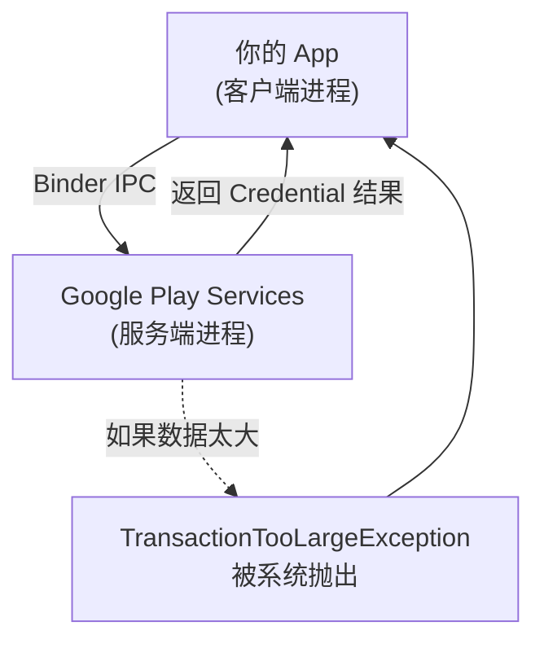
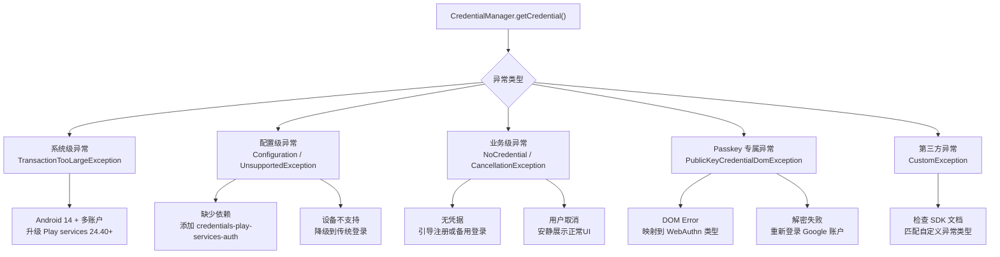

# 3.1.40 解决常见的凭据管理器错误

"呜哇——又崩了。"

希尔把手机往睡袋上一摔，整个人往后一仰，盯着帐篷顶发出一声长长的哀嚎。

帐篷里的灯换成了最暗的那一档，暖橙色的光把四个人的影子拉得很长。篝火早就只剩下一堆暗红的余烬，偶尔有一两点火星从炭堆里跳起来，像是被深夜的寂静惊醒的萤火虫。

"怎么啦？"洛芙从帐篷门口探进半个脑袋，手里还捧着一杯已经凉透的柠檬水，"我刚去湖边洗了杯子回来……"

"别提了。"希尔把手机举起来，屏幕的光映在她脸上，照出一脸挫败，"我照着文档写了一个数字身份证的恢复流程，结果一跑起来，七八种错误全撞上了——TransactionTooLargeException、NoCredentialException、GetCredentialUnsupportedException——全给我来了一遍。"

"七八种？"洛芙小心翼翼地跨过黛琳的背包，在自己的睡袋上坐下，"那么多啊……"

"这还不算完。"希尔划了划屏幕，往上翻着 Logcat，"还有 CreateCredentialCancellationException、GetCredentialProviderConfigurationException、CreatePublicKeyCredentialDomException——我都怀疑我是不是把整个 Android 抛异常的字典都跑了一遍。"

黛琳不知道什么时候已经把白板笔拿在了手里，在一块随身携带的小白板上画起了格子。

"来，"她拍了拍白板，"我们一个一个理。露营的时候最怕什么？最怕背包里装了一堆乱七八糟的东西，要用的时候找不着。错误也是，背包里装了一堆异常，要处理的时候不知道该从哪个下手——所以，先分类。"

"分类？"希尔从地上捞起自己的笔记本，咕咕哝哝地翻开。

"你看，"黛琳在白板上画了一个三层的金字塔，从下到上分别是"系统级错误"、"SDK 级错误"、"业务级错误"，"TransactionTooLargeException 是系统级，因为它跟 Android 14 的进程间通信机制有关。CreateCredentialProviderConfigurationException 是配置级，因为依赖没配对。NoCredentialException 是业务级，因为它是'找不到凭证'——这个不是系统坏了，是正常情况。"

伊莎从帐篷角落里探出脑袋，披着一件有点大的卫衣，看起来像一只刚从窝里钻出来的小动物。

"就像我们露营，"她打了个哈欠，"篝火灭了是系统级问题——得重新生火。忘带打火石是配置级问题——下次记得带。帐篷拉链卡住了是业务级问题——找找哪根绳子绕住了。"

"就是这个意思。"黛琳在白板上写下第一行字：按层级分类。

"那，TransactionTooLargeException 到底是怎么回事？"希尔把手机递过去，"官方文档说是 Android 14 的已知问题——"

"'在 Android 14 及更高版本上，当设备上存在多个 Google 账户时，credentialManager.getCredential() API 无法显示登录对话框'，"黛琳把官方文档的原话念出来，"而且专门针对 GetGoogleIdOption，不针对 GetSignInWithGoogleOption。"

"等等，"洛芙举起手，"为什么多个账户会有问题啊？"

"你想啊，"希尔抓起旁边一包没开封的薯片，哗啦哗啦地比划起来，"你的手机就像一个露营营地——如果只有一个帐篷（账户），门口的信箱（凭据管理器）直接送信过去就行了。但如果同时支了五顶帐篷——五个 Google 账户——凭据管理器得问清楚：这封信该投进哪顶帐篷？这时候如果营地管理员（Activity Manager Service）发现信封太大（Intent 携带的数据太大），就会直接把信退回来说'你这包太沉了我搬不动'——就是 TransactionTooLargeException。"

"信封太大了，"伊莎噗嗤一声笑出来，"这个比喻也太好笑了吧。"

"所以官方怎么修的？"黛琳追问。

"升级 Google Play services 到 24.40.XX 或更高版本。"希尔说，"这个我们控制不了，但我们可以在代码里加一个兜底——如果捕获到这个异常，就改用 GetSignInWithGoogleOption，因为那个不受影响。"

```kotlin
// 兜底处理 TransactionTooLargeException（Android 14 + 多账户场景）
// 在 GetCredentialRequest 中添加备选方案
val getCredentialRequest = GetCredentialRequest.Builder()
    .addCredentialOption(googleIdOption) // 首选 GetGoogleIdOption
    .addCredentialOption(googleSignInOption) // 备选 GetSignInWithGoogleOption
    .build()

try {
    val result = credentialManager.getCredential(
        context = context,
        request = getCredentialRequest
    )
    handleCredentialResult(result)
} catch (e: GetCredentialException) {
    when (e) {
        // 兜底：当 GetGoogleIdOption 因 TransactionTooLargeException 失败时
        // 自动降级使用 GetSignInWithGoogleOption
        is TransactionTooLargeException -> {
            // Google Play services 版本低于 24.40.XX
            // 记录日志并通知开发者更新 Google Play services
            Log.e(TAG, "TransactionTooLargeException detected. " +
                       "Consider prompting user to update Google Play services.")
        }
        else -> throw e
    }
}
```

"等等，"洛芙突然说，"这个 TransactionTooLargeException 是在 catch 块里被单独捕获的，但是它不是继承自 GetCredentialException 吗？"

"好问题。"黛琳点点头，"TransactionTooLargeException 是 java.lang.RuntimeException 的子类，不是 GetCredentialException 的子类。所以在 catch (GetCredentialException e) 里面是抓不到它的，得单独 catch。"

"那不对啊，"希尔皱着眉头，"RuntimeException 的异常怎么会从 getCredential() 里抛出来呢——"

"因为它在跨进程通信的时候被系统抛出来了。"黛琳在白板上画了一个简略的流程图：



"看到了吗？"黛琳指着图，"这个异常不是 Google Play services 代码里抛的，是 Linux 内核的 Binder 驱动在跨进程传递大数据包的时候，因为超过了 1MB 的限制，直接把 TransactionTooLargeException 塞回来的。所以它不走 getCredential() 的正常异常通道——它是一个'系统级逃逸'。"

希尔在笔记本上刷刷地记着："系统级逃逸……记住了。"

"下一个，"黛琳在白板上画了第二格，"业务级错误——NoCredentialException。"

"'没有找到匹配的凭据'，"伊莎把这句话念出来，"这个应该很常见吧？"

"非常常见。"希尔说，"用户第一次打开 App，从来没登录过，Credential Manager 里什么都没有——这时候就会遇到这个错误。"

"就像营地门口，"伊莎说，"有一块空白的布告栏，但是还没贴任何公告。访客来了说'你们这什么都没有啊'——就是这种感觉。"

"对。而且这个错误不是 bug，"黛琳强调，"它是预期行为。用户没有存过任何凭证，NoCredentialException 是正常反馈。"

"那怎么处理？"洛芙掏出她随身带的小本子准备记。

"两种方式。"希尔伸出两根手指，"第一种，引导用户去注册——调用 CreateCredentialFlow 让用户创建新的凭据，比如注册一个 passkey。第二种，给用户提供替代登录方式，比如传统的用户名密码登录。"

```kotlin
// 处理 NoCredentialException（正常情况，不代表错误）
// 引导用户注册或使用备用登录方式
suspend fun handleGetCredential(credentialManager: CredentialManager) {
    try {
        val result = credentialManager.getCredential(
            context = context,
            request = buildGetCredentialRequest()
        )
        processCredentialResult(result)
    } catch (e: NoCredentialException) {
        // NoCredentialException 是正常情况——用户尚未保存任何凭据
        // 策略1：引导用户创建新凭据（passkey）
        showCreateCredentialPrompt()
        // 或策略2：展示备用登录界面（用户名+密码）
        showAlternativeSignInUI()
    }
}

// 构建获取凭据的请求
private fun buildGetCredentialRequest(): GetCredentialRequest {
    val googleIdOption = GetGoogleIdOption.Builder()
        .setServerClientId(WEB_CLIENT_ID)  // 替换为你的 Web Client ID
        .setFilterByAuthorizedAccounts(true)
        .build()

    return GetCredentialRequest.Builder()
        .addCredentialOption(googleIdOption)
        .build()
}
```

"你看这个代码，"希尔指着 setFilterByAuthorizedAccounts(true) 这一行，"如果传 true，就是'只返回用户之前授权过的账户'——如果没有，NoCredentialException 就会立刻被抛出来。如果传 false，就是'返回设备上所有可能的账户'——可能会多，但能避免让用户第一次就遇到空状态。"

"等等，"洛芙举手，"setFilterByAuthorizedAccounts 是什么意思？"

"你可以理解为，"黛琳想了想，"篝火旁有一个签名簿。如果 setFilterByAuthorizedAccounts(true)，就是在问'在这本已经有人签过名的簿子里，有没有你的名字'——没有的话就是 NoCredentialException。如果传 false，就是问'这本簿子里有没有空行可以让你签名'——有没有都能返回一个结果，可能是空列表，但不一定是异常。"

"明白了！"洛芙赶紧记下来。

"好，下一个。"黛琳在白板上写下第三个错误类型，"CreateCredentialCancellationException 和 GetCredentialCancellationException。"

"用户取消？"希尔说，"这个应该最好处理吧。"

"但处理不好会很烦人。"黛琳说，"很多 App 遇到用户取消就弹一个红框错误提示——用户会想'我只是想取消登录，为什么给我报错'。"

"对！"洛芙猛点头，"我之前遇到过一个 App，点取消直接闪退，吓死我了。"

"所以 CancellationException 的处理原则是——安静地接受取消，给用户展示正常的界面就行。不要弹错误提示，不要记录为 bug 级别日志，Info 级别记录一下就行了。"

```kotlin
// 处理用户取消操作
// 关键原则：安静处理，不弹错误提示，给用户展示正常界面
try {
    val result = credentialManager.getCredential(context, request)
    handleCredentialSuccess(result)
} catch (e: GetCredentialCancellationException) {
    // 用户主动取消了获取凭据的操作
    // 这是正常行为，不需要弹错误提示
    Log.i(TAG, "User cancelled credential retrieval")
    // 展示正常的登录界面或返回上一页
    showNormalSignInUI()
} catch (e: CreateCredentialCancellationException) {
    // 用户主动取消了创建凭据的操作
    Log.i(TAG, "User cancelled credential creation")
    // 展示正常的注册引导界面
    showRegistrationPrompt()
}
```

"这个我懂！"伊莎说，"就像露营的时候有人问你要不要去山顶看日出，你说'下次吧'——人家不会觉得你拒绝了就生气，只会安静地等你下次想来。"

"就是这个意思。"

"下一个，"希尔翻了一页笔记，"GetCredentialProviderConfigurationException。"

"'getCredentialAsync no provider dependencies found'，"洛芙念出屏幕上的文字，"这个是什么意思啊？"

"依赖没配。"希尔叹了口气，"build.gradle 里忘加 androidx.credentials:credentials-play-services-auth 这个依赖了。"

"哦——"洛芙恍然大悟，"就像露营清单里忘带了某样东西！"

"对对对，就是这个意思。"希尔说，"Credential Manager 底层依赖 Google Play services 的认证模块，如果不引入 credentials-play-services-auth，就等于帐篷里没有带防潮垫——直接没法睡。"

```groovy
// build.gradle (Module: app)
// 关键依赖：credentials-play-services-auth
// 必须引入，否则 GetCredentialProviderConfigurationException 会被抛出
dependencies {
    implementation 'androidx.credentials:credentials:1.2.0'
    implementation 'androidx.credentials:credentials-play-services-auth:1.2.0'
    // 其他依赖...
}
```

"还有 CreateCredentialProviderConfigurationException 也是一样的意思，"黛琳补充，"只不过是在创建凭据的时候检测到缺少依赖。"

"这两种异常，"希尔在白板上画了一个对比表，"都是因为缺少同一个依赖——credentials-play-services-auth。而且都是 ConfigurationException，说明是'配置阶段'就失败了，还没到真正的调用。"

"就像露营搭帐篷，"伊莎说，"你还没开始搭，就发现防潮垫没带——这就是 Configuration 阶段的失败，不是帐篷搭到一半塌了。"

"对，这个比喻很准确。"

"还有一个——GetCredentialUnsupportedException 和 CreateCredentialUnsupportedException。"希尔说，"这个是设备本身不支持 Credential Manager。"

"不支持？"洛芙歪着脑袋，"Android 10 以上不都支持吗？"

"正常情况下是的。"黛琳说，"但有些设备定制了 Android 系统，把 Credential Manager 功能移除了——比如某些企业定制机，或者过老的设备。"

"那怎么修？"希尔问。

"官方文档说，升级 credentials 库到 1.2.1 或更高版本。"黛琳说，"但如果设备本身就移除了这个功能，那就没办法了——只能给用户提示'您的设备不支持此功能'，然后降级到传统的登录方式。"

```kotlin
// 处理设备不支持 Credential Manager 的情况
// 兜底方案：降级到传统的用户名+密码登录
try {
    val result = credentialManager.getCredential(context, request)
    handleCredentialSuccess(result)
} catch (e: GetCredentialUnsupportedException) {
    // 设备不支持 Credential Manager
    Log.w(TAG, "Credential Manager not supported on this device. " +
               "Falling back to traditional sign-in.")
    showTraditionalSignInUI()
} catch (e: CreateCredentialUnsupportedException) {
    // 设备不支持创建凭据
    Log.w(TAG, "Credential creation not supported. " +
               "Falling back to traditional sign-up.")
    showTraditionalSignUpUI()
}
```

"好，下一个——"希尔的声音突然变小了，她盯着屏幕看了好一会儿，"这个有意思了——CreatePublicKeyCredentialDomException 和 GetPublicKeyCredentialDomException。"

"DOM 异常？"洛芙凑过去看，"这是什么？"

"DOM exception，"黛琳慢慢念出来，"意思是'文档对象模型异常'——这是 WebAuthn 的标准异常类型，从浏览器那边传过来的。"

"WebAuthn ？"希尔挑起眉毛，"我们不是在搞 Android 原生开发吗，怎么跟 WebAuthn 扯上关系了？"

"因为 passkey 的底层是 WebAuthn 标准，"黛琳解释道，"Google Password Manager 在底层用的是 WebAuthn 协议，所以当 passkey 相关操作出错时，异常会包装成 WebAuthn DOM Exception 的格式传回来。"

"那 domError 是什么？"希尔问。

"文档里说，'DOM exception 里很可能包含更具体的 domError'。"黛琳把官方文档的原文念出来，"你需要把 domError 映射成 WebAuthn DomException，才能看到具体是什么问题。"

"怎么映射？"希尔掏出手机开始查。

"WebAuthn 的 DOM Exception 有几种标准类型，"黛琳在白板上写下：

| domError 值 | 含义 | 对应场景 |
|---|---|---|
| InvalidStateError | 凭据已存在或不存在 | 用户重复注册或调用了不该调的注册接口 |
| NotAllowedError | 操作被拒绝 | 用户拒绝或浏览器不允许 |
| SecurityError | 安全错误 | 服务器端配置有问题 |
| UnknownError | 未知错误 | 其他未分类的错误 |

"'InvalidStateError' 最常见，"黛琳说，"场景是：你调用了 createPublicKeyCredential() 但是用户已经注册过 passkey 了——这时候浏览器会报 InvalidStateError，意思是'状态不对，你不应该在这里调用这个'。"

"就像露营的时候，"伊莎想了想，"你想在已经搭好帐篷的地方再搭一个新帐篷——帐篷管理员说'InvalidStateError，这里已经有帐篷了'。"

"但是这个错误，"希尔插嘴道，"官方文档里专门提了一种情况——'无法在注册期间创建密钥'，原因是'用户在屏幕锁对话框期间Dismiss了'。"

"屏幕锁对话框？"洛芙问，"注册 passkey 还要屏幕锁？"

"对，"黛琳点头，"passkey 的私钥需要设备的安全硬件保护，所以注册的时候需要用户设置或验证屏幕锁——如果没有屏幕锁，或者用户点取消，passkey 创建就会失败。"

"'Not able to create passkey due to encrypted data being locked'，"希尔念出文档里的另一段话，"解决方案是——'用户需要重置 Chrome 服务端数据'。"

"这个错误，"黛琳皱起眉头，"听起来不像是我们 App 端的问题……"

"不是，"希尔摇摇头，"这是 Google Account 层面的问题——Chrome 保存的 passkey 数据被加密锁定了，需要用户去 chrome.google.com/sync 清除数据，然后重新开启 Sync。"

"这都能被我们撞上？"洛芙有点震惊。

"文档里专门列出来，说明不是罕见情况。"希尔说，"我们在调试 passkey 的时候很可能遇到——尤其是用户换账户登录过之后。"

"'Failed to decrypt credential'，"希尔又念出一条，"'在登出 Google 账户并重新登录后尝试验证 passkey 时发生'——解决方案是让用户重新在设备上登录 Google 账户。"

"就像露营储物柜的密码变了，"伊莎打了个比方，"你之前存的密码本还在柜子里，但是钥匙换了一把，打不开了。"

"那怎么在代码里处理这个错误？"洛芙问。

"在捕获 GetPublicKeyCredentialException 的时候，检查错误类型，"希尔说，"如果包含'解密失败'相关的信息，就提示用户重新登录 Google 账户。"

```kotlin
// 处理 passkey 解密失败
// 原因：用户登出并重新登录 Google 账户后，加密密钥发生了变化
try {
    val result = credentialManager.getCredential(context, request)
    handlePasskeyResult(result)
} catch (e: GetPublicKeyCredentialException) {
    val domException = e.domException
    if (domException is DomException) {
        when (domException.name) {
            "InvalidStateError" -> {
                // 凭据状态无效：可能已注册但调用了错误的方法
                Log.w(TAG, "InvalidStateError: credential may already exist")
                showCredentialExistsPrompt()
            }
            "NotAllowedError" -> {
                // 用户拒绝了操作
                Log.i(TAG, "User denied passkey operation")
                showFallbackSignIn()
            }
            "SecurityError" -> {
                // 服务器端 digital asset link 配置问题
                Log.e(TAG, "SecurityError: check server asset link configuration")
                showConfigurationError()
            }
            else -> {
                // 检查是否为解密失败相关的错误
                val errorMessage = domException.message ?: ""
                if (errorMessage.contains("decrypt") ||
                    errorMessage.contains("credential")) {
                    // 用户需要重新登录 Google 账户
                    Log.w(TAG, "Credential decryption failed. " +
                               "User may need to re-sign into Google Account.")
                    promptReSignInGoogleAccount()
                }
            }
        }
    }
}
```

"好，最后一个，"希尔翻到笔记本最后一页，"CreateCredentialUnknownException。"

"'在保存密码时，发现来自 one tap 16 的密码保存失败响应：[28431] 跳过密码保存，因为用户可能收到了 Android Autofill 的提示'。"

"等等，"洛芙说，"one tap 是什么？"

"One Tap 是 Google 早期的登录 UI，"黛琳解释道，"比 Credential Manager 更老。现在 Credential Manager 会自动和 Autofill 协作，但如果是旧设备（Android 13 及更早）并且 Google 是默认的 Autofill 提供商，密码保存会走 Autofill 路径，而不是 Credential Manager。"

"所以这个错误——"

"可以安全忽略。"黛琳说，"因为密码已经被 Autofill 保存了，而且 Autofill 保存的密码会双向同步到 Credential Manager——用户下次用 Credential Manager 依然可以获取到这个密码。"

"就是露营地的邮件系统有两套，"伊莎说，"一套是信件投递箱，一套是快递柜——如果快递柜收到件了，投递箱显示'投递失败'也没关系，反正东西已经在快递柜里了。"

"这个比喻有点绕但是挺准的。"

希尔看了看时间，已经过了凌晨两点了。

"我们把剩下的错误快速过一遍吧，"她揉了揉眼睛，"还有 CreateCredentialCustomException、CreateCredentialInterruptedException、Begin Sign In Failure 里的 Unknown internal error……"

"CustomException 是给第三方 SDK 用的，"黛琳说，"如果你们用了一些非 Google 的认证提供商，它们的 SDK 可能会抛出自定义异常类型——这时候要检查 SDK 文档里的 exception type constants。"

"InterruptedException 是说用户跑到设置里去重新配置密码管理器了，"希尔补充，"这个就是告诉你要重试。"

"'Begin Sign In Failure: Unknown internal error'，"她念出最后一条，"原因可能是：设备没有正确设置 Google 账户，或者 passkey JSON 创建有问题。"

"所以这条错误——"

"需要双重排查，"黛琳说，"既检查设备端账户配置，也检查服务端 passkey creation options 的 JSON 格式。"

帐篷外面不知道什么时候起了风，湖面传来一阵阵轻柔的波浪声。希尔把笔记本合上，往睡袋里一缩。

"呼——七八种错误，全过了一遍。"

"总结一下，"黛琳举起小白板，上面密密麻麻地写满了各种异常的分类，"Credential Manager 的错误分三类：系统级异常（TransactionTooLargeException）、配置级异常（ConfigurationException、UnsupportedException）、业务级异常（NoCredentialException、CancellationException、DOMException）。"

"系统级看系统日志，"希尔接话。

"配置级检查依赖和设备兼容性，"洛芙接下去。

"业务级给用户正常的引导提示，"伊莎最后收尾。

四个人对视一眼，不约而同地笑了起来。

"好，收工！"希尔啪地一声把手机扔到枕头边，"明天继续搞数字身份证的事——今天被这堆错误折腾惨了。"

帐篷里的灯被关掉了，只剩下窗外的星光和远处湖面上反射的月色。四个人的呼吸渐渐变得绵长，露营地的深夜终于安静了下来。

---

## Credential Manager 常见错误排查指南

> **Credential Manager 错误处理核心原则**：错误不等于 Bug——NoCredentialException 是正常业务流，CancellationException 是用户主动放弃，UnknownException 需要分场景排查。

#### 结构图



#### 反模式与陷阱

1. **遇到 CancellationException 弹错误提示** → 用户取消是正常行为，应安静展示登录界面
2. **NoCredentialException 被当作 Bug 记录** → 这是正常情况，需引导用户注册或使用备用登录
3. **未单独捕获 TransactionTooLargeException** → 该异常继承 RuntimeException，不在 GetCredentialException 分支下
4. **Passkey 错误不区分 DOM Exception 类型** → InvalidStateError、NotAllowedError、SecurityError 处理方式完全不同
5. **忽略 CreateCredentialUnknownException（Android 13 Autofill 场景）** → 该错误可安全忽略，密码已被 Autofill 保存

#### 设计哲学

**分层错误处理**是 Credential Manager 开发的核心原则：
- **系统级错误**（如 TransactionTooLargeException）反映 Android 框架层问题，通常需要 Google Play services 更新或设备兼容性处理
- **配置级错误**在编译期或初始化期被检测，属于"预防性"异常，处理成本最低
- **业务级错误**是用户交互的一部分，需要精心设计 UI 反馈，而不是简单的 try-catch
- **Passkey 专属错误**与 WebAuthn 协议强相关，需要理解公钥密码学基础（creation/assertion、challenge、RP ID）

#### 🏕️ 动手练习

**项目目标**：构建一个完整的 Credential Manager 错误处理 Demo App，能够演示和调试所有主流错误类型。

**Task 1：基础集成（★）**
- 创建新 Android 项目，添加 androidx.credentials 和 credentials-play-services-auth 依赖
- 实现基本的 getCredential 流程，使用 GetGoogleIdOption
- 在 Logcat 中观察正常成功调用的日志输出
- 验收标准：App 能够正确显示 Google 账户选择器并返回凭据

**Task 2：模拟 NoCredentialException（★★）**
- 在请求中使用 setFilterByAuthorizedAccounts(true)，并准备一个没有任何已授权账户的测试环境
- 捕获 NoCredentialException，在 UI 上展示"引导注册"的界面（按钮跳转到 CreateCredentialFlow）
- 验收标准：遇到无凭据情况时，不闪退，显示友好的引导界面

**Task 3：处理 CancellationException（★★）**
- 在 Task 2 的基础上，捕获 CreateCredentialCancellationException 和 GetCredentialCancellationException
- 两个取消异常都只记录 Info 级别日志，不弹 Toast，不显示错误 Alert
- 验收标准：用户按返回键取消时，App 安静地返回上一个界面

**Task 4：捕获 TransactionTooLargeException（★★★）**
- 准备一台 Android 14 设备，登录 3 个以上 Google 账户
- 使用 GetGoogleIdOption（不是 GetSignInWithGoogleOption）触发 getCredential
- 单独 catch TransactionTooLargeException，记录并提示用户更新 Google Play services
- 验收标准：Android 14 多账户场景下 App 不崩溃，能给出清晰提示

**Task 5：配置级异常处理（★★）**
- 故意注释掉 credentials-play-services-auth 依赖，运行 App
- 观察 GetCredentialProviderConfigurationException 的日志输出
- 恢复依赖，再次运行验证正常
- 验收标准：能够区分"缺少依赖"错误与业务逻辑错误

**Task 6：Passkey DOM Exception 映射（★★★★）**
- 实现 CreatePublicKeyCredential 和 GetPublicKeyCredential 流程
- 在 catch 块中提取 domException 并 switch-case 处理 InvalidStateError / NotAllowedError / SecurityError
- 在测试设备上模拟不同场景触发不同 DOM Error
- 验收标准：每种 DOM Error 类型有对应的 UI 反馈，不混用

**Task 7：解密失败与账户重绑定（★★★★）**
- 实现 passkey 登录，然后登出 Google 账户再次尝试登录
- 捕获 "Failed to decrypt credential" 错误（GetPublicKeyCredentialException）
- 展示引导用户重新登录 Google 账户的界面
- 验收标准：解密失败时用户能看到清晰的恢复指引

**Task 8：完整兜底策略（★★★★★）**
- 实现一个统一的 CredentialExceptionHandler，能够根据异常类型分发到对应的处理函数
- 在 Handler 中实现所有主流异常的兜底 UI（不含 TransactionTooLargeException 的 Play services 更新提示外）
- 验收标准：任意一种异常被触发，App 都能优雅处理，不崩溃，有用户可理解的提示

**面试热身**
1. Credential Manager 的错误分为哪几层？各层的典型异常是什么？
2. 为什么 TransactionTooLargeException 不能被 catch (GetCredentialException) 捕获？应该如何处理？
3. NoCredentialException 和"没有凭据"是一回事吗？App 应该怎么应对？
4. Passkey 的 DOM Exception 和 Android 原生异常有什么区别？如何正确处理 InvalidStateError？
5. 如果用户在注册 passkey 的过程中点击了屏幕锁的"取消"，会触发哪种异常？应该如何引导用户？

#### 参考实现要点

1. **Always catch TransactionTooLargeException separately**——它继承 RuntimeException，不在 GetCredentialException 分支下
2. **NoCredentialException 是正常业务流**——不要弹错误提示，引导用户注册或提供备用登录方式即可
3. **CancellationException 安静处理**——Info 日志记录即可，不触发任何错误 UI
4. **Passkey DOM Exception 需映射**——使用 WebAuthn 的标准 DOM Error 类型（InvalidStateError / NotAllowedError / SecurityError）做分支判断
5. **Configuration/UnsupportedException 预防优先**——在 App 启动时检测依赖和设备兼容性，提前降级

> 学习建议：Credential Manager 的错误处理实际上是理解整个认证架构的窗口——从系统级 Binder 通信（TransactionTooLargeException）到用户交互设计（ CancellationException），再到协议层（DOM Exception），每一种错误背后都是一个需要被设计的用户体验场景。建议在真实设备上逐一触发各种错误，观察实际 UI 表现，再对照代码理解系统如何将底层异常转换为用户可见的提示。

## 🍹洛芙的小小日记本

今天踩了七八个坑，全是 Credential Manager 的错。黛琳说得对，错误不等于 Bug——NoCredentialException 就不是错，是正常情况。希尔说她的手机"把整个异常字典都跑了一遍"，笑死我了。不过真的理清楚了很多：配置问题看依赖，业务问题看用户取消了还是没找到，Passkey 的问题看 DOM Error 类型——这比我想象的要复杂多了，但好像没那么可怕了。

## 今日关键词

**Credential Manager** —— Android Jetpack API，用于在应用中进行凭据的创建、获取和管理，支持 passkey、密码、联合登录等多种认证方式

**TransactionTooLargeException** —— Android 系统级异常，在跨进程通信时因数据超过 1MB 限制被 Binder 驱动抛出；Android 14 + 多 Google 账户场景下使用 GetGoogleIdOption 时可能触发；需单独 catch，解决方案为升级 Google Play services 到 24.40+

**GetCredentialProviderConfigurationException** —— 配置级异常，发生在调用 getCredentialAsync 时检测到没有找到任何凭据提供者的依赖；原因是 build.gradle 缺少 androidx.credentials:credentials-play-services-auth 依赖

**CreateCredentialProviderConfigurationException** —— 与 GetCredentialProviderConfigurationException 类似，但在创建凭据（createCredentialAsync）时触发，原因相同（缺少 credentials-play-services-auth 依赖）

**GetCredentialUnsupportedException** —— 设备不支持 Credential Manager 时抛出的异常；某些企业定制机或过老设备可能不支持；应降级到传统的用户名+密码登录方式

**CreateCredentialUnsupportedException** —— 与 GetCredentialUnsupportedException 类似，但在创建凭据时触发；处理方式同为降级到传统方式

**NoCredentialException** —— 业务级异常，表示设备上没有找到匹配指定过滤条件的凭据；这是正常情况，不代表 Bug；应引导用户注册新凭据或提供备用登录方式

**CreateCredentialCancellationException** —— 用户主动取消了创建凭据的操作；应安静处理（Info 日志），不弹错误提示，直接展示正常引导界面

**GetCredentialCancellationException** —— 与 CreateCredentialCancellationException 对应，用户主动取消了获取凭据的操作；安静处理即可

**CreateCredentialInterruptedException** —— 创建凭据操作被中断；可能原因是用户导航到设置重新配置了密码管理器；应提示用户重试

**GetCredentialInterruptedException** —— 与 CreateCredentialInterruptedException 对应，获取凭据时操作被中断；处理方式为提示重试

**CreateCredentialCustomException** —— 使用第三方 SDK（subclass CreateCustomCredentialRequest 或 GetCustomCredentialOption）时可能抛出的自定义异常；需检查 SDK 文档中的 exception type constants 进行匹配

**GetCredentialCustomException** —— 与 CreateCredentialCustomException 对应，在获取凭据时触发；需根据具体 SDK 类型处理

**CreateCredentialUnknownException** —— 未知错误，特定场景为 Android 13 及更早版本中 Google 作为默认 Autofill 提供商时，密码保存走 Autofill 路径而非 Credential Manager；该错误可安全忽略，密码已被 Autofill 存储且与 Credential Manager 双向同步

**CreatePublicKeyCredentialDomException** —— Passkey 创建时抛出的 WebAuthn DOM Exception；domException 中包含更具体的 domError，需要映射到 WebAuthn DomException 类型进行处理；常见场景包括 InvalidStateError（凭据已存在）、SecurityError（服务器端 digital asset link 配置问题）、用户Dismiss屏幕锁对话框

**GetPublicKeyCredentialDomException** —— 与 CreatePublicKeyCredentialDomException 对应，在 Passkey 验证（获取凭据）时触发；同样需要映射 domError 类型

**InvalidStateError** —— WebAuthn DOM Exception 的一种，含义为"操作状态无效"；常见场景是调用 createPublicKeyCredential() 时用户已经注册过该 RP 的 passkey；可能需要检查是否重复调用了注册接口

**NotAllowedError** —— WebAuthn DOM Exception 的一种，含义为"操作被浏览器/系统拒绝"；场景包括用户拒绝指纹验证、用户在 passkey 创建/验证中途取消等

**SecurityError** —— WebAuthn DOM Exception 的一种，含义为"安全错误"；在 Credential Manager 场景中通常指服务器端 digital asset link 配置问题（package ID 或 SHA 不匹配）；需检查服务器端的 assetlinks.json 文件

**"Failed to decrypt credential"** —— GetPublicKeyCredentialException 的一种具体表现；发生在用户登出并重新登录 Google 账户后，原 passkey 加密密钥失效；解决方案为提示用户重新在设备上登录 Google 账户

**"Not able to create passkey due to encrypted data being locked"** —— Passkey 创建失败的具体场景；原因是 Chrome 服务端保存的加密数据被锁定；用户需访问 chrome.google.com/sync 清除数据，然后在设备上重新开启 Chrome Sync

**"Begin Sign In Failure: Unknown internal error"** —— 未知内部错误；可能原因包括设备未正确设置 Google 账户、或 passkey JSON 创建格式有误；需双重排查（设备端账户配置 + 服务端 WebAuthn JSON 格式）

**digital asset link** —— Google 提供的资产关联验证机制，用于确认 App 与服务端属于同一实体；passkey 的 RP ID 验证依赖此配置；若配置错误会导致 SecurityError

**WebAuthn** —— Web Authentication API 标准，定义了公钥凭据的创建和验证流程；passkey 建立在 WebAuthn 基础之上；Credential Manager 在底层使用 WebAuthn 协议

**GetGoogleIdOption** —— Google 提供的 CredentialOption，用于请求用户的 Google ID Token；Android 14 + 多 Google 账户场景下可能触发 TransactionTooLargeException

**GetSignInWithGoogleOption** —— Google 提供的另一个 CredentialOption，与 GetGoogleIdOption 类似但不受 TransactionTooLargeException 影响；可作为降级方案

**setFilterByAuthorizedAccounts** —— GetGoogleIdOption.Builder 中的方法；传 true 表示只返回用户之前授权过的账户（没有则抛 NoCredentialException），传 false 表示返回设备上所有可能的账户
