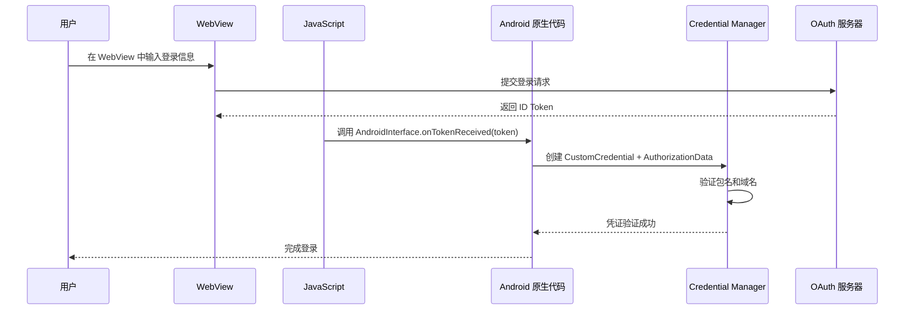

# 3.1.41 使用 WebView 验证用户身份

天刚蒙蒙亮的时候，洛芙就被帐篷外的鸟叫声吵醒了。

她揉了揉眼睛，侧过头看了看睡在旁边的伊莎——那头栗色的长发散在枕头上，晨光从帐篷的缝隙里漏进来，在发丝上镀了一层淡淡的金边。帐篷外面能听到希尔压低了的说话声，还有黛琳那永远不紧不慢的语调。

洛芙把睡袋的拉链拉开一点，探出脑袋往外看。

希尔和黛琳已经坐在了营地边缘那块被晨露打湿的大石头上，两人中间支着一台笔记本电脑，屏幕的蓝光在清晨的雾气里显得格外明亮。她们俩不知道在讨论什么，希尔正用力地敲着键盘，黛琳则用手指在屏幕上比划着什么。

"她们什么时候起来的啊……"洛芙打了个哈欠，小声嘟囔着。

伊莎似乎被她的动静弄醒了，迷迷糊糊地翻了个身："嗯……好像天刚亮就起来了……希尔说昨晚那个错误还没解决……"

"昨晚的错误？"洛芙一下子清醒了，"是说数字身份证那个吗？"

"嗯……好像是 WebView 什么的……"伊莎把被子往上拉了拉，声音又含糊了起来，"希尔说要试试用 WebView 做身份验证……"

洛芙的睡意一下子全消了。她想起昨晚篝火旁的那场讨论——希尔兴冲冲地想要在 App 里实现一个自定义的登录页面，结果调了半天，Credential Manager 始终报错，不是 `RESULT_CANCELED` 就是 `RESULT_FAILED`。最后四个人都困得睁不开眼，只好约定第二天一早继续。

现在看来，希尔和黛琳显然等不及了。

洛芙轻手轻脚地从睡袋里爬出来，套上外套，钻出帐篷。清晨的空气凉丝丝的，带着草叶上露水的清新气息。远处的湖面笼罩着一层薄薄的晨雾，对岸的青山在雾中若隐若现，像是一幅还没干透的水墨画。

"洛芙！快过来！"希尔一看到她出来，立刻兴奋地招手，"你知道我发现了什么吗？"

"什么？"洛芙走过去，在黛琳旁边蹲下。

"WebView！"希尔指着屏幕，眼睛亮晶晶的，"我们可以把登录页面嵌在 App 里的 WebView 中，然后用 Credential Manager 来处理这个 WebView 的身份验证！"

"把网页嵌在 App 里？"洛芙眨了眨眼睛。

"对！"希尔迫不及待地开始解释，"有时候你的 App 需要用户通过 Google 或者其他第三方账号登录，但如果你不想让用户跳转到浏览器，直接在他们面前展示一个网页来完成登录，体验会更好——这个网页就叫 WebView。"

"就像……在帐篷里挂一块小小的投影幕布，幕布上放一部电影？"洛芙尝试理解。

希尔想了想，点点头："差不多吧。WebView 就是 App 里的一块区域，专门用来显示网页内容的。用户不用离开 App，网页就在 App 里面跑。"

"但问题在于，"黛琳接过话头，她的语气永远是那么平稳，"WebView 里的网页是跑在另一个环境里的，它和原生 Android 代码之间的通信会比较麻烦。Credential Manager 是 Android 原生的 API，它和 WebView 里的网页之间需要一个桥梁来传递身份信息。"

"这个桥梁叫什么？"洛芙问。

"官方文档管这个叫 WebView 认证流程。"黛琳说，"简单来说是这样——"

她从背包里掏出一支白色的白板笔，在笔记本的空白处画了起来。

"首先，你的 App 启动一个 WebView，这个 WebView 会加载一个登录页面——比如 Google 的登录页面。用户在这个网页里输入用户名和密码。"

她在纸上画了一个方框，里面写着"WebView"。

"然后，当用户登录成功后，网页会生成一个凭证——比如 Google ID Token。这是一个代表用户身份的东西。然后这个 Token 需要从网页里传出来，交给 App 里的 Credential Manager 来处理。"

"怎么传出来呢？"洛芙歪着脑袋。

"这就是关键了。"黛琳在方框旁边画了一个小箭头，"网页通过一种叫 JavaScript Interface 的机制，把 Token 交给 Android 原生代码。然后原生代码再用 Credential Manager 的 `CustomCredential` 类型来处理这个 Token。"

希尔已经迫不及待地在键盘上敲了起来。"来，我给你看代码！"

---

## 白板上的认证流程

黛琳看了看希尔那兴奋的表情，无奈地笑了笑，然后转向洛芙："在我们看代码之前，先把整个流程弄清楚。洛芙，你知道为什么我们要在 App 里用 WebView 做登录，而不是直接跳到浏览器吗？"

洛芙认真地想了想。"因为……在 App 里打开网页，用户体验更连贯？不用跳来跳去的。"

"对，这是一点。"黛琳点点头，"另一个原因是，有些情况下你不希望用户离开你的 App——比如你的 App 需要用户必须完成登录才能继续使用某些功能，如果跳到浏览器，用户可能就顺手关掉了。"

"而在 WebView 里，登录页面一直都在 App 里面，用户必须完成登录才能继续操作。"

"那岂不是有点强迫用户的意思？"洛芙皱了皱眉头。

"所以 Google 会要求你必须在登录页面上明确告诉用户，这是第三方的登录服务，隐私政策由第三方提供。"黛琳说，"这是隐私方面的要求。"

希尔这时候已经把代码写好了一部分，转过屏幕给大家看。

"你看，"她指着屏幕，"首先你需要在布局文件里放一个 WebView。就像这样——"

```xml
<WebView
    android:id="@+id/webView"
    android:layout_width="match_parent"
    android:layout_height="match_parent" />
```

"然后在 Activity 里，你得设置一些东西。"希尔继续敲代码，"你需要给 WebView 设置一个 WebViewClient，这个家伙负责处理网页加载的事件——比如页面开始加载、页面加载完成、遇到错误等等。"

"为什么需要这个？"洛芙问。

"因为当用户在 WebView 里点击一个链接的时候，默认行为是 WebView 自己处理这个链接。"黛琳解释道，"但如果你想拦截这个行为——比如判断这个链接是不是某个特定的 URL，然后做特殊的处理——你就需要自定义一个 WebViewClient。"

"比如我们现在的场景，登录成功之后网页会跳转到某个特定的 URL，这个 URL 携带了一个 Token。"希尔接过话头，"我们需要拦截这个跳转，取出 Token，然后通知 App。"

"怎么拦截？"洛芙追问。

"重写 `shouldOverrideUrlLoading` 方法。"希尔说，"这个方法会在 WebView 要加载一个 URL 之前被调用，你可以在里面判断——如果这个 URL 是我们想要的那个（包含 Token 的回调 URL），就把它拦截下来，取出 Token，然后通知 Credential Manager。"

她开始敲代码：

```kotlin
// MainActivity.kt
// WebViewClient 负责拦截 URL 加载事件
private class MyWebViewClient : WebViewClient() {
    override fun shouldOverrideUrlLoading(
        view: WebView?,
        request: WebResourceRequest?
    ): Boolean {
        // 获取即将加载的 URL
        val url = request?.url?.toString() ?: return false
        
        // 检查 URL 是否为我们的回调地址
        // 如果是，说明登录流程已完成，提取 Token
        if (url.startsWith(CALLBACK_SCHEME)) {
            // 从 URL 中提取 Token
            // 例如：myapp://callback?token=xxxxx
            extractTokenFromUrl(url)
            return true // 返回 true 表示我们自定义处理，不让 WebView 继续加载
        }
        
        return false // 其他 URL 正常加载
    }
}
```

"等等，"洛芙举起手，"`CALLBACK_SCHEME` 是什么？"

"这是你自己定义的一个 URL 协议。"黛琳解释道，"比如 `myapp://callback` 或者 `https://yourapp.com/callback`。当网页完成登录后，它会跳转到这个 URL，WebView 捕获到这个跳转，就能知道登录成功了。"

"就像露营的时候，我们约定好一个暗号——听到这个暗号，就知道有事情要发生了。"伊莎不知道什么时候醒了，正捧着一杯热可可走过来，"这个暗号就是 `CALLBACK_SCHEME`。"

"比喻得很好。"黛琳点点头，"不过有一点需要注意——这个回调 URL 必须是你在 OAuth 服务商（比如 Google）那边注册过的redirect_uri。不然 Google 不会把 Token 发到这个地址。"

---

## JavaScript Interface：网页和 App 的桥梁

"那 Token 怎么从网页里取出来呢？"洛芙看着希尔继续敲代码，"网页里的数据怎么交给 App？"

"好问题。"希尔说，"这需要用到一个叫 JavaScript Interface 的东西。"

她停顿了一下，似乎在组织语言。"你知道 WebView 里可以运行 JavaScript 代码吗？"

洛芙点点头："JavaScript 就是让网页有交互性的那种语言对吧？"

"对。"希尔说，"JavaScript Interface 是一种让 JavaScript 代码能够调用 Android 原生代码的机制。你可以给 WebView 注入一个对象，然后网页里的 JavaScript 就能通过这个对象来调用 Android 的方法。"

她开始画图：

```
┌─────────────────────────────────────────────────────────────┐
│                        Android App                           │
│  ┌─────────────────────────────────────────────────────┐    │
│  │                    WebView                            │    │
│  │  ┌───────────────────────────────────────────────┐  │    │
│  │  │              HTML + JavaScript                 │  │    │
│  │  │                                               │  │    │
│  │  │   网页登录成功后，JavaScript 调用:              │  │    │
│  │  │   AndroidInterface.onTokenReceived(token)       │  │    │
│  │  │                                               │  │    │
│  │  └───────────────────────────────────────────────┘  │    │
│  └─────────────────────────────────────────────────────┘    │
│                            ▲                                 │
│                            │ JavaScript Interface            │
│                            │ (WebView.addJavascriptInterface)│
│  ┌─────────────────────────────────────────────────────┐    │
│  │              AndroidInterface (Java/Kotlin)        │    │
│  │  @JavascriptInterface                                │    │
│  │  fun onTokenReceived(token: String) {                │    │
│  │      // 处理收到的 Token                            │    │
│  │  }                                                   │    │
│  └─────────────────────────────────────────────────────┘    │
│                                                              │
│  ┌─────────────────────────────────────────────────────┐    │
│  │              CredentialManager                       │    │
│  │  处理 CustomCredential + GoogleIDToken               │    │
│  └─────────────────────────────────────────────────────┘    │
└─────────────────────────────────────────────────────────────┘
```

"在这个例子里，`AndroidInterface` 是一个我们自定义的类，里面有一个 `@JavascriptInterface` 注解的方法。当网页里的 JavaScript 调用 `AndroidInterface.onTokenReceived(token)` 的时候，Android 就会执行对应的 Kotlin 代码。"

"网页怎么知道要调用这个接口呢？"洛芙问。

"需要在网页的 JavaScript 里写好调用代码。"希尔说，"不过这一步通常是后端或者网页开发者做的，我们 App 开发者只需要定义好这个接口就行。"

"那 App 端怎么接收这个 Token 呢？"洛芙继续追问。

"看这里。"希尔指着屏幕上的代码：

```kotlin
// 定义 JavaScript Interface 类
class WebAppInterface(private val activity: Activity) {
    
    // 这个方法会被网页里的 JavaScript 调用
    // @JavascriptInterface 注解是必须的，没有它 JavaScript 无法调用此方法
    @JavascriptInterface
    fun onTokenReceived(token: String) {
        // Token 接收成功，现在用它来创建 CustomCredential
        createCredentialFromToken(token)
    }
}

// 在 Activity 中设置 WebView
webView.settings.javaScriptEnabled = true  // 必须启用 JavaScript
webView.addJavascriptInterface(
    WebAppInterface(this),  // 注入到网页的对象
    "AndroidInterface"        // 网页中引用此对象的名称
)
```

"哦！"洛芙恍然大悟，"网页里就可以用 `window.AndroidInterface.onTokenReceived(token)` 来调用这个方法了！"

"没错。"黛琳说，"不过你需要在网页的 JavaScript 里写好这个调用逻辑，通常是你接入的 OAuth 服务商（比如 Google）提供的标准登录页面会自带这个逻辑。"

---

## WebChromeClient：让网页的对话框正常显示

"等一下。"洛芙突然想到了什么，"如果登录页面弹出对话框怎么办？比如有些网站登录的时候会弹出一个确认框，问用户是否授权某个权限。"

"好问题！"希尔眼睛一亮，"这种情况就需要另一个重要的组件——`WebChromeClient`。"

她开始敲代码：

```kotlin
// WebChromeClient 负责处理网页的 UI 相关事件
// 比如 JavaScript 的 alert()、confirm()、prompt() 对话框
// 还有网页的进度条、网页标题等
private class MyWebChromeClient : WebChromeClient() {
    
    // 处理 JavaScript 的 alert() 对话框
    override fun onJsAlert(
        view: WebView?,
        url: String?,
        message: String?,
        result: JsResult?
    ): Boolean {
        // 可以在这里自定义 alert 对话框的样式
        // 或者直接使用系统默认对话框
        Toast.makeText(context, message, Toast.LENGTH_SHORT).show()
        result?.confirm()
        return true
    }
    
    // 处理 JavaScript 的 confirm() 对话框（确认/取消）
    override fun onJsConfirm(
        view: WebView?,
        url: String?,
        message: String?,
        result: JsResult?
    ): Boolean {
        // 返回 true 表示我们自定义处理
        AlertDialog.Builder(context)
            .setMessage(message)
            .setPositiveButton("确定") { _, _ -> result?.confirm() }
            .setNegativeButton("取消") { _, _ -> result?.cancel() }
            .show()
        return true
    }
}

// 在 Activity 中设置 WebChromeClient
webView.webChromeClient = MyWebChromeClient()
```

"哇，原来对话框是这么处理的。"洛芙感叹道。

"如果没有设置 WebChromeClient，"黛琳补充道，"网页里的 JavaScript 对话框会默默失效，用户什么都看不到，但也不会知道发生了什么。这会导致用户卡在某个步骤，不知道怎么继续。"

---

## CustomCredential：Token 的容器

"好了，现在我们假设网页已经成功把 Token 传递给了 App。"希尔拍了拍手，"接下来就轮到 Credential Manager 出场了。"

"Token 怎么交给 Credential Manager 呢？"洛芙问。

"用 `CustomCredential` 类型。"希尔说，"`CustomCredential` 是 Credential Manager 支持的一种凭证类型，专门用来存放非密码、非 Passkey 的自定义凭证——比如我们从网页收到的 Google ID Token。"

她开始写代码：

```kotlin
// 假设 token 是从网页收到的 Google ID Token
val token = "eyJhbGciOiJSUzI1NiIsInR5cCI6IkpXVCJ9..."

// 创建一个 CustomCredential
// CustomCredential 需要指定类型和原始数据
val customCredential = CustomCredential.builder(
    CredentialManager.CREDENTIAL_TYPE_CUSTOM_MESSAGE  // 自定义凭证类型
)
    .setType(CustomCredential.TYPE_GOOGLE_ID_TOKEN)   // Google ID Token 类型
    .setData(token.toByteArray())                     // Token 的原始数据
    .build()

// 使用 AuthetorizationData 来关联 WebView 的来源信息
// 这样 Credential Manager 知道这个 Token 是从哪个包名的 App 的 WebView 发起的
val authData = AuthorizationData.builder()
    .setRequestUrl(requestUrl)          // OAuth 请求的 URL
    .setPackageName(packageName)        // 发起请求的 App 包名
    .build()

// 构建完整的 AuthCredential
val authCredential = AuthCredentialFactory.createAuthCredential(
    customCredential,
    authData
)
```

"等等，这个 `AuthorizationData` 是用来做什么的？"洛芙指着那部分代码。

"安全验证用的。"黛琳接过话头，表情变得认真了起来，"这是非常重要的一步。当你在 WebView 里做 OAuth 登录的时候，你需要告诉 Credential Manager，这个请求是从哪个包名的 App 发起的。"

"为什么需要这个？"洛芙不解。

"防止 Token 被盗用。"黛琳解释道，"假设有一个恶意 App，它伪装成你的 App，然后在一个伪造的 WebView 里完成登录，获取了你的 Token。如果没有包名验证，这个恶意 App 就可以拿着这个 Token 去冒充你。"

"但如果有了包名验证，"希尔接过话头，"Credential Manager 会检查——发起请求的 App 的包名和注册时填写的包名是否一致。如果不一致，就拒绝处理这个 Token。"

"还有 `requestUrl` 也是同样的道理。"黛琳补充道，"Credential Manager 会检查 OAuth 服务器的域名是否是你注册的那个域名，防止被钓鱼网站骗走 Token。"

---

## 安全最佳实践

"所以这是一种安全机制。"洛芙终于理解了。

"对，而且是非常重要的安全机制。"黛琳强调道，"使用 WebView 做认证的时候，有几个安全注意点是必须遵守的——"

她伸出手指，一项一项地数：

"第一，**必须验证包名和域名**。就像刚才说的，不验证的话，Token 可能会被盗用。"

"第二，**不要在 WebView 里保存用户的敏感信息**。WebView 有个 `WebViewDatabase` 的概念，默认情况下可能会缓存一些表单数据。你应该在不需要的时候清除这些缓存。"

希尔插嘴道："对，可以用 `WebView.clearHistory()`、`WebView.clearFormData()` 这些方法。"

"第三，"黛琳继续说，"**限制 JavaScript 的访问范围**。如果你只需要网页和 App 之间传递 Token，就不要给网页开放其他不该有的权限。"

"第四，"她的声音变得严肃，"**必须在 UI 上明确告知用户**，这是在通过第三方服务进行身份验证。用户的知情权是很重要的。"

---

## 完整的 WebView 认证示例

"好，我来把整个流程串起来，给大家看一个完整的例子。"希尔说。

她深吸一口气，开始在键盘上飞舞：

```kotlin
// WebViewAuthActivity.kt
package com.campingapp.auth

import android.os.Bundle
import android.webkit.*
import androidx.activity.result.contract.ActivityResultContracts
import androidx.appcompat.app.AppCompatActivity
import androidx.credentials.*
import com.google.android.gms.auth.api.signin.GoogleIdToken
import kotlinx.coroutines.*

class WebViewAuthActivity : AppCompatActivity() {
    
    private lateinit var webView: WebView
    private lateinit var credentialManager: CredentialManager
    
    // OAuth 配置
    private val clientId = "YOUR_CLIENT_ID.apps.googleusercontent.com"
    private val callbackScheme = "myapp://callback"
    
    // 用于存储 Token，等待后续处理
    private var pendingToken: String? = null
    
    private val authLauncher = registerForActivityResult(
        ActivityResultContracts.StartActivityForResult()
    ) { result ->
        // 处理返回结果
    }
    
    override fun onCreate(savedInstanceState: Bundle?) {
        super.onCreate(savedInstanceState)
        
        credentialManager = CredentialManager.create(this)
        setupWebView()
        
        // 开始加载登录页面
        // 这是 Google OAuth 的登录 URL，实际项目中需要替换为你的配置
        val loginUrl = buildGoogleLoginUrl()
        webView.loadUrl(loginUrl)
    }
    
    private fun setupWebView() {
        webView = WebView(this).apply {
            // 必须启用 JavaScript，否则网页无法正常工作
            settings.javaScriptEnabled = true
            
            // 设置 WebViewClient 来拦截 URL 加载
            webViewClient = MyWebViewClient()
            
            // 设置 WebChromeClient 来处理对话框等 UI 事件
            webChromeClient = MyWebChromeClient()
        }
        setContentView(webView)
    }
    
    // 构建 Google 登录 URL
    private fun buildGoogleLoginUrl(): String {
        // 实际项目中，这个 URL 应该由后端服务器生成
        // 这里只是一个示例
        return "https://accounts.google.com/o/oauth2/v2/auth?" +
            "client_id=$clientId" +
            "&redirect_uri=$callbackScheme" +
            "&response_type=id_token" +
            "&scope=openid%20profile%20email"
    }
    
    // WebViewClient：拦截 URL 加载，提取 Token
    private inner class MyWebViewClient : WebViewClient() {
        override fun shouldOverrideUrlLoading(
            view: WebView?,
            request: WebResourceRequest?
        ): Boolean {
            val url = request?.url?.toString() ?: return false
            
            // 检查是否为回调 URL
            if (url.startsWith(callbackScheme)) {
                // 从 URL 中提取 id_token 参数
                // 格式：myapp://callback?id_token=xxxxx
                val uri = android.net.Uri.parse(url)
                val idToken = uri.getQueryParameter("id_token")
                
                if (idToken != null) {
                    // 找到 Token，通过 JavaScript Interface 传递给 App
                    pendingToken = idToken
                    // 关闭 WebView
                    webView.destroy()
                    // 处理 Token
                    handleIdToken(idToken)
                }
                return true
            }
            
            return false
        }
    }
    
    // WebChromeClient：处理 JavaScript 对话框
    private inner class MyWebChromeClient : WebChromeClient() {
        override fun onJsAlert(
            view: WebView?,
            url: String?,
            message: String?,
            result: JsResult?
        ): Boolean {
            // 使用 Android 原生对话框替代网页的 alert
            android.app.AlertDialog.Builder(this@WebViewAuthActivity)
                .setMessage(message)
                .setPositiveButton("OK") { _, _ -> result?.confirm() }
                .show()
            return true
        }
    }
    
    // 处理收到的 Google ID Token
    private fun handleIdToken(idToken: String) {
        CoroutineScope(Dispatchers.Main).launch {
            try {
                // 创建 CustomCredential
                val customCredential = CustomCredential.builder(
                    CredentialManager.CREDENTIAL_TYPE_CUSTOM_MESSAGE
                )
                    .setType(CustomCredential.TYPE_GOOGLE_ID_TOKEN)
                    .setData(idToken.toByteArray())
                    .build()
                
                // 创建 AuthorizationData，包含安全验证信息
                val authData = AuthorizationData.builder()
                    .setRequestUrl("https://accounts.google.com")
                    .setPackageName(packageName)
                    .build()
                
                // 创建 AuthCredential
                val authCredential = AuthCredentialFactory.createAuthCredential(
                    customCredential,
                    authData
                )
                
                // 验证并保存凭证
                val response = credentialManager.getCredential(
                    GetCredentialRequest(
                        listOf(authCredential)
                    )
                )
                
                // 处理成功响应
                val savedCredential = response.credential
                // ... 后续处理，保存用户信息等
                
            } catch (e: Exception) {
                // 处理错误
                android.util.Log.e("WebViewAuth", "Authentication failed", e)
            }
        }
    }
    
    override fun onBackPressed() {
        // 如果 WebView 可以返回上一页，则返回
        if (webView.canGoBack()) {
            webView.goBack()
        } else {
            super.onBackPressed()
        }
    }
}
```

"哇……"洛芙看着满屏的代码，有些发晕，"好多内容啊……"

"没事，"希尔安慰她，"我们一点一点来看。"

---

## 晨雾中的总结

这时候，太阳已经完全升起来了。晨雾在湖面上慢慢消散，露出波光粼粼的水面。一只不知名的水鸟从湖边掠过，翅膀在阳光下一闪一闪的。

黛琳把白板笔盖上，看向洛芙。

"来，我们总结一下今天学到的内容。"

她用手指在大石头上画了一个小图：

"第一，WebView 是 Android 提供的一个组件，它可以在 App 里显示网页内容。"

"第二，如果想在 WebView 里做身份验证（OAuth），你需要设置 WebViewClient 来拦截登录成功后的回调 URL，提取 Token。"

"第三，网页里的 JavaScript 可以通过 JavaScript Interface 来和 Android 原生代码通信。"

"第四，收到 Token 后，用 CustomCredential 类型把它包装起来，然后用 AuthorizationData 加上安全验证信息，最后交给 Credential Manager 处理。"

"第五，安全很重要——必须验证包名和域名，防止 Token 被盗用。"

"还有，"希尔补充道，"别忘了设置 WebChromeClient，不然网页的对话框可能显示不出来。"

"最重要的一点，"伊莎捧着已经见底的可可杯，轻声说，"WebView 认证是一种在 App 内完成登录的方式，适合那些不想让用户跳转到浏览器的场景。但它也有自己的复杂性——网页和原生代码之间的通信毕竟不如纯原生代码那么直接。"

"所以，"洛芙慢慢消化着大家的话，"选择用什么方式做身份验证，也要看具体的需求对吧？"

"没错。"黛琳露出一个赞许的微笑，"没有银弹，只有最适合当前场景的方案。"

洛芙点了点头，把笔记本合上，抬头看了看天空。初夏的阳光已经很暖和了，照得人懒洋洋的。

远处，湖面上泛起了粼粼的波光，几只水鸟在芦苇丛里钻进钻出。帐篷旁边的野餐垫上，不知道谁已经摆好了早餐——烤得金黄的吐司、几片西瓜、还有一壶还在冒着热气的咖啡。

"好啦，"希尔拍拍手，"先吃早餐！代码的事下午再继续搞！"

---

## 专业技术总结

**WebView 认证机制**（WebView Authentication）——一种在 Android App 内嵌的 WebView 组件中加载登录页面，通过 JavaScript Interface 与原生代码通信，接收 OAuth Provider 颁发的身份凭证（Google ID Token 等），再使用 Credential Manager 的 CustomCredential 类型进行处理的身仚认证方式。

#### 结构图



#### 复杂度与影响

使用 WebView 进行身份验证相比跳转到浏览器的方式，提供了更好的用户体验（无需离开 App），但同时增加了代码复杂度。Credential Manager 的介入提供了统一 API 和安全验证机制，但需要正确配置 AuthorizationData（包名、请求 URL）才能生效。

#### 反模式与陷阱

- **未设置 WebChromeClient**：网页的 alert() / confirm() 对话框会静默失效，用户可能卡在授权确认页面。
- **跳过 AuthorizationData 验证**：Token 可能被恶意 App 盗用，存在安全风险。
- **WebView 未启用 JavaScript**：网页无法正常加载和执行，所有交互功能失效。
- **未在 WebView 销毁时清理缓存**：用户的敏感表单数据可能被后续使用者获取。

#### 设计哲学

WebView 认证体现了「体验一致性」的设计思想——在不打断用户操作流的前提下完成身份验证。但这种便捷性需要付出安全验证的代价：必须通过 AuthorizationData 确保请求来源的可信性。Credential Manager 的介入将散落的认证实现统一为标准化 API，降低了开发者的心智负担。

#### 🏕️ 动手练习

**练习目标**：构建一个完整的 WebView 身份验证流程

**练习说明**：本练习将帮助你掌握在 Android App 中使用 WebView 进行 OAuth 登录的全流程，包括 WebView 配置、JavaScript Interface、CustomCredential 处理和安全验证。

**Task 1 - 基础配置**：创建项目结构，添加必要的依赖

**目标**：搭建支持 WebView 认证的 Android 项目基础

**你需要做的事**：
1. 创建一个新的 Android 项目（最低 SDK 24+）
2. 在 `build.gradle` 中添加以下依赖：
```kotlin
implementation("androidx.credentials:credentials:1.3.0")
implementation("androidxwebkit:webkit:1.8.0")
implementation("com.google.android.gms:play-services-auth:20.7.0")
```
3. 在 `AndroidManifest.xml` 中声明网络权限：
```xml
<uses-permission android:name="android.permission.INTERNET" />
```

**验收标准**：
- [ ] 项目编译通过，无依赖冲突
- [ ] AndroidManifest.xml 正确配置
- [ ] build.gradle 依赖版本兼容

**Task 2 - WebView 布局与初始化**：在 Activity 中配置 WebView

**目标**：学会 WebView 的基本配置和初始化

**你需要做的事**：
1. 在布局文件中添加 WebView：
```xml
<WebView
    android:id="@+id/webView"
    android:layout_width="match_parent"
    android:layout_height="match_parent" />
```
2. 在 Activity 中获取 WebView 实例并配置：
```kotlin
webView.settings.apply {
    javaScriptEnabled = true  // 必须启用 JavaScript
    domStorageEnabled = true   // 启用 DOM 存储
    javaScriptCanOpenWindowsAutomatically = true
}
```

**验收标准**：
- [ ] WebView 正确显示在布局中
- [ ] JavaScript 已启用
- [ ] WebView 可加载网页

**Task 3 - 实现 WebViewClient**：拦截 URL 加载

**目标**：掌握如何通过 WebViewClient 拦截 OAuth 回调 URL

**你需要做的事**：
1. 创建一个继承自 `WebViewClient` 的内部类
2. 重写 `shouldOverrideUrlLoading` 方法
3. 判断 URL 是否为回调地址，如果是则提取 Token：
```kotlin
private class MyWebViewClient : WebViewClient() {
    override fun shouldOverrideUrlLoading(
        view: WebView?,
        request: WebResourceRequest?
    ): Boolean {
        val url = request?.url?.toString() ?: return false
        if (url.startsWith("myapp://callback")) {
            // 提取 token 并处理
            val uri = Uri.parse(url)
            val token = uri.getQueryParameter("token")
            // 通知 Activity
            return true
        }
        return false
    }
}
```
4. 将 WebViewClient 设置给 WebView：
```kotlin
webView.webViewClient = MyWebViewClient()
```

**验收标准**：
- [ ] WebViewClient 正确拦截回调 URL
- [ ] Token 提取逻辑正确
- [ ] 回调 URL 不在 WebView 中继续加载

**Task 4 - 实现 WebChromeClient**：处理 JavaScript 对话框

**目标**：学会处理网页中的 JavaScript 对话框

**你需要做的事**：
1. 创建继承自 `WebChromeClient` 的内部类
2. 重写 `onJsAlert` 方法处理确认对话框
3. 重写 `onJsConfirm` 方法处理确认/取消对话框
4. 将 WebChromeClient 设置给 WebView：
```kotlin
webView.webChromeClient = MyWebChromeClient()
```

**验收标准**：
- [ ] JavaScript alert() 对话框正常显示
- [ ] JavaScript confirm() 对话框正常显示
- [ ] 用户选择能正确传递给 JavaScript

**Task 5 - 实现 JavaScript Interface**：建立网页与 App 的通信桥梁

**目标**：掌握通过 @JavascriptInterface 进行双向通信

**你需要做的事**：
1. 创建一个带有 `@JavascriptInterface` 注解方法的类：
```kotlin
class WebAppInterface(
    private val onTokenReceived: (String) -> Unit
) {
    @JavascriptInterface
    fun onTokenReceived(token: String) {
        onTokenReceived(token)
    }
}
```
2. 将接口注入 WebView：
```kotlin
webView.addJavascriptInterface(
    WebAppInterface { token -> handleToken(token) },
    "AndroidInterface"
)
```

**验收标准**：
- [ ] JavaScript 可调用 AndroidInterface.onTokenReceived
- [ ] Token 能正确传递到 Activity
- [ ] 无安全警告或错误

**Task 6 - CustomCredential 处理**：集成 Credential Manager

**目标**：学会使用 CustomCredential 处理自定义 Token

**你需要做的事**：
1. 在 Activity 中创建 CredentialManager 实例
2. 将 Token 包装为 CustomCredential：
```kotlin
val customCredential = CustomCredential.builder(
    CredentialManager.CREDENTIAL_TYPE_CUSTOM_MESSAGE
)
    .setType(CustomCredential.TYPE_GOOGLE_ID_TOKEN)
    .setData(token.toByteArray())
    .build()
```
3. 创建 AuthorizationData 进行安全验证：
```kotlin
val authData = AuthorizationData.builder()
    .setRequestUrl("https://accounts.google.com")
    .setPackageName(packageName)
    .build()
```
4. 调用 getCredential 验证凭证

**验收标准**：
- [ ] CustomCredential 正确构建
- [ ] AuthorizationData 包含正确的包名和 URL
- [ ] Credential Manager 正确处理请求

**Task 7 - 安全验证与调试**：确保认证流程安全可靠

**目标**：掌握 WebView 认证的安全最佳实践

**你需要做的事**：
1. 实现包名验证逻辑（检查 packageName 是否匹配）
2. 实现域名验证逻辑（检查 requestUrl 是否来自可信域名）
3. 在 WebView 销毁时清理缓存：
```kotlin
override fun onDestroy() {
    webView.apply {
        clearHistory()
        clearFormData()
        clearCache(true)
        destroy()
    }
    super.onDestroy()
}
```
4. 添加错误处理和日志

**验收标准**：
- [ ] 恶意 URL 被正确拦截
- [ ] 缓存清理生效
- [ ] 错误场景有友好提示

**Task 8 - 完整流程测试**：端到端验证

**目标**：验证整个 WebView 认证流程的正确性

**你需要做的事**：
1. 启动 App，观察 WebView 加载 OAuth 登录页面
2. 使用测试账号完成登录
3. 验证 Token 被正确提取和处理
4. 验证用户成功登录后的后续操作
5. 测试返回键行为、WebView 返回等边界情况

**验收标准**：
- [ ] 登录流程顺利完成
- [ ] Token 正确传递到 App
- [ ] 错误处理正常工作
- [ ] UI 交互流畅无卡顿

**面试热身**

1. 请解释 WebView 认证和浏览器跳转认证的区别，以及各自的适用场景。
2. WebViewClient 和 WebChromeClient 的区别是什么？各自负责什么职责？
3. @JavascriptInterface 的作用是什么？为什么需要这个注解？
4. AuthorizationData 在 WebView 认证中起到什么作用？为什么要验证包名和域名？
5. CustomCredential 和普通的 PasswordCredential 有什么区别？各自适合什么场景？

#### 参考实现要点

- WebView 的 JavaScript 必须启用（`settings.javaScriptEnabled = true`），但要评估安全风险
- WebViewClient 的 `shouldOverrideUrlLoading` 是拦截 OAuth 回调的关键入口
- WebChromeClient 处理所有网页 UI 交互（对话框、进度条、标题等）
- CustomCredential 需要配合 AuthorizationData 使用，否则安全验证会失效
- WebView 销毁时务必清理缓存，防止敏感信息泄露
- 实际项目中，OAuth URL 应由后端服务器生成，不要在前端硬编码敏感配置

> 学习建议：WebView 认证是 Android 身份验证中的进阶话题，涉及 WebView 配置、JavaScript 通信、OAuth 流程和 Credential Manager 四个方面的知识。建议先理解 OAuth 2.0 的基本原理，再学习 WebView 与网页的通信机制，最后掌握 Credential Manager 的 CustomCredential 处理流程。在实际项目中，优先考虑使用 Google 提供的官方 Sign in with Google 库，而非自己实现 WebView 认证，除非有特殊的产品需求。

## 洛芙的小小日记本

今天学会了在 WebView 里做身份验证！希尔说这是"网页和 App 之间的桥"，黛琳说更重要的是那座桥上的安全检查。伊莎姐姐说得好对——没有最好的方案，只有最适合的选择。

---

**今日关键词**

**WebView**：Android 提供的组件，可以在 App 内显示网页内容，类似内置的浏览器窗口。

**WebViewClient**：负责处理 WebView 的页面加载事件，核心方法 `shouldOverrideUrlLoading` 用于拦截 URL 跳转。

**WebChromeClient**：负责处理网页的 UI 交互，包括 JavaScript 的 alert()、confirm()、prompt() 对话框，以及页面标题和进度条。

**JavaScript Interface**：一种让网页中的 JavaScript 代码能够调用 Android 原生方法的机制，需要通过 `@JavascriptInterface` 注解标记可被调用的方法。

**CustomCredential**：Credential Manager 支持的凭证类型之一，用于存放非密码、非 Passkey 的自定义凭证，如 OAuth 流程中的 Google ID Token。

**AuthorizationData**：包含安全验证信息的数据类，包括请求来源的 URL 和 App 包名，用于防止 Token 被恶意 App 盗用。

**OAuth 2.0**：一种开放标准的授权协议，允许用户在不提供密码的情况下授权第三方应用访问其在某个服务（如 Google）上的资源。

**Google ID Token**：一种 JWT 格式的令牌，包含用户的身份信息，由 Google 在 OAuth 流程结束后颁发。

**Credential Manager**：Android Jetpack 提供的统一凭证管理 API，整合了对密码、Passkey 和自定义凭证的支持。

**JavaScript Enabled**：WebView 的设置项，启用后 WebView 才能执行网页中的 JavaScript 代码。
