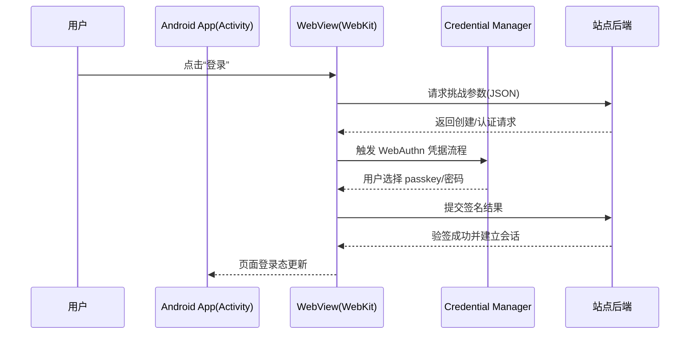
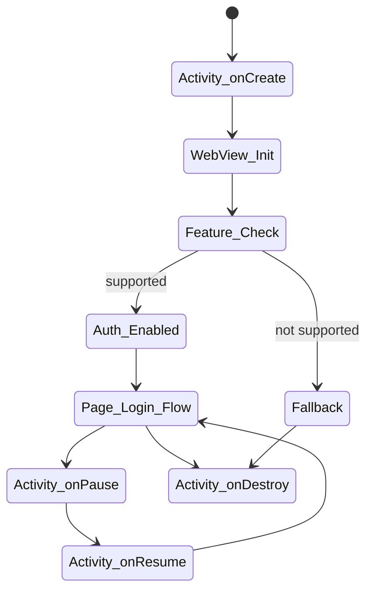
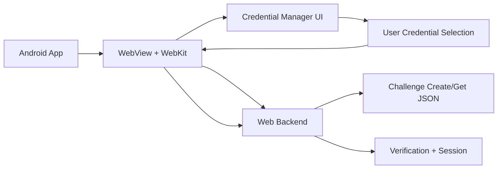

# 3.1.41 Authenticate users with WebView

清晨是从一声很轻的“咔哒”开始的。

帐篷门扣被希尔从里面拨开，湖畔的凉气立刻钻进来，把熬夜后发热的额头轻轻压住。洛芙裹着睡袋坐起来，先看见黛琳抱着笔记本，肩上搭着毛毯，像一棵在晨雾里站得很稳的松树；又看见伊莎把保温杯递到她手里，杯壁温热，掌心慢慢回了血色。

“昨晚我们把 Credential Manager 的坑都填了一轮，”希尔打了个响指，“今天要收尾最难受的一段：WebView 里的登录。”

洛芙还迷糊着：“WebView 不是网页嘛……网页登录不就网页自己搞定吗？”

黛琳摇头，把屏幕转过来：“如果 App 里嵌了 WebView，用户在这块‘内嵌浏览器’里点登录，想要用通行密钥（passkey）或已保存凭据时，App 端和 Web 端要协同。不是‘各干各的’，是‘同一条认证链’。”

伊莎蹲在便携白板旁，用记号笔画了第一张图。



“图 1 对应下面代码片段 A 的 18-39 行。”黛琳说，“你看这条线，App 不直接替网页做验签，但它必须把 WebView 的认证能力打开，不然用户点了也没反应。”

洛芙点点头：“像营地门禁系统。门禁是门禁，前台是前台，但电得通、线接对了，人才进得去。”

“对，”希尔笑，“而且今天我们不用玄学，全是硬配置。”

她新建了一个最小可运行示例，先从依赖写起。

```kotlin
// build.gradle.kts (app)
// 依赖：Credential Manager + Play Services + WebKit
// 运行：minSdk 按项目要求，推荐在支持 WebAuthn 的 WebView 环境测试

dependencies {
    implementation("androidx.credentials:credentials:1.6.0-beta02")
    implementation("androidx.credentials:credentials-play-services-auth:1.6.0-beta02")
    implementation("androidx.webkit:webkit:1.14.0")
}
```

“这三条是官方路径。”黛琳指着第一行，“少一条都可能出现你以为是‘网页问题’，其实是‘宿主能力没装齐’的假象。”

洛芙马上举手：“那我以前只加了 WebView 依赖，怪不得一直像卡在门外。”

“还有第二把钥匙，”伊莎说，“Digital Asset Links。”

希尔把终端日志拉出来：“App 和你自己的网站要做数字资产关联。系统得确认‘这个 App 和这个域名确实是同一主人’，不然凭据系统不会放心把身份动作交给你。”

洛芙皱眉：“是不是我之前用测试域名乱跳来跳去，也会出问题？”

“会。”黛琳说，“域名、证书、assetlinks.json 这条链只要断一段，登录就会表现成‘按钮能点，但身份能力像消失了’。”

她们继续写 Activity，希尔边敲边念。

```kotlin
// 代码片段 A：WebViewActivity.kt
// 图 1 对应代码 A 第18-39行（特性检测 + 能力开启）

import android.annotation.SuppressLint
import android.os.Bundle
import android.util.Log
import android.webkit.WebView
import android.webkit.WebViewClient
import androidx.activity.ComponentActivity
import androidx.webkit.WebSettingsCompat
import androidx.webkit.WebViewFeature

class WebViewActivity : ComponentActivity() {

    private lateinit var webView: WebView

    @SuppressLint("SetJavaScriptEnabled")
    override fun onCreate(savedInstanceState: Bundle?) {
        super.onCreate(savedInstanceState)

        webView = WebView(this).apply {
            settings.javaScriptEnabled = true
            webViewClient = WebViewClient()
        }

        setContentView(webView)

        val url = "https://your-domain.example/passkey-signin"
        webView.loadUrl(url)

        if (WebViewFeature.isFeatureSupported(WebViewFeature.WEB_AUTHENTICATION)) {
            WebSettingsCompat.setWebAuthenticationSupport(
                webView.settings,
                WebSettingsCompat.WEB_AUTHENTICATION_SUPPORT_FOR_APP
            )

            val mode = WebSettingsCompat.getWebAuthenticationSupport(webView.settings)
            Log.i("WebViewAuth", "Web authentication mode = $mode")
        } else {
            Log.e("WebViewAuth", "WEB_AUTHENTICATION not supported in current WebView")
        }
    }

    override fun onResume() {
        super.onResume()
        webView.onResume()
    }

    override fun onPause() {
        webView.onPause()
        super.onPause()
    }

    override fun onDestroy() {
        webView.destroy()
        super.onDestroy()
    }
}
```

“注意生命周期。”黛琳敲了敲白板，“这章主角是 WebView 认证，但宿主仍是 Activity。`onCreate` 初始化，`onResume/onPause` 同步 WebView 状态，`onDestroy` 释放资源。你昨晚被异常追着跑，很大一部分就是生命周期没收口。”

洛芙把这句话抄进本子里，字有点歪，但很用力。

伊莎把第二张图补了上去。



“图 2 对应代码片段 A 的 13-58 行。”她说，“当设备不支持 `WEB_AUTHENTICATION` 时，不要假装没事发生，应该进入回退策略。”

洛芙追问：“回退是指让用户输密码？”

“是。”希尔回答得很干脆，“而且要明确告诉用户为什么回退，不然她会以为 App 坏了。”

她贴出一段反模式代码，语气立刻变得严肃。

```kotlin
// 反模式（坏味道）
// 问题1：不检查特性就直接开启
// 问题2：把异常吞掉，用户无感知
// 问题3：在主线程做网络准备，容易卡顿

fun unsafeSetup(webView: WebView) {
    webView.settings.javaScriptEnabled = true
    try {
        WebSettingsCompat.setWebAuthenticationSupport(
            webView.settings,
            WebSettingsCompat.WEB_AUTHENTICATION_SUPPORT_FOR_APP
        )
    } catch (_: Exception) {
        // 什么都不做（错误）
    }
    webView.loadUrl("https://your-domain.example/passkey-signin")
}
```

“这段像什么？”伊莎笑着问。

洛芙秒答：“像天还没亮就盲着下湖，脚下有没有石头完全不看。”

“正确。”黛琳点头，“现在看重构。”

```kotlin
// 重构后（推荐）
// 目标：可观测、可回退、可维护

sealed class AuthCapability {
    data object WebAuthSupported : AuthCapability()
    data class WebAuthUnsupported(val reason: String) : AuthCapability()
}

fun detectAuthCapability(webView: WebView): AuthCapability {
    return if (WebViewFeature.isFeatureSupported(WebViewFeature.WEB_AUTHENTICATION)) {
        WebSettingsCompat.setWebAuthenticationSupport(
            webView.settings,
            WebSettingsCompat.WEB_AUTHENTICATION_SUPPORT_FOR_APP
        )
        AuthCapability.WebAuthSupported
    } else {
        AuthCapability.WebAuthUnsupported("Current WebView missing WEB_AUTHENTICATION")
    }
}

fun launchAuthPage(webView: WebView, capability: AuthCapability) {
    when (capability) {
        AuthCapability.WebAuthSupported -> {
            webView.loadUrl("https://your-domain.example/passkey-signin")
        }
        is AuthCapability.WebAuthUnsupported -> {
            webView.loadUrl("https://your-domain.example/password-signin")
            Log.w("WebViewAuth", capability.reason)
        }
    }
}
```

“这才是工程写法。”希尔说，“`sealed class` 把分支收敛住，你以后接埋点、接 A/B、接灰度都好做。”

她又补了一段测试，给洛芙看“不是凭感觉判断是否成功”。

```kotlin
// 单元测试片段：验证能力分支逻辑（示意）
// 依赖：junit

import org.junit.Assert.assertTrue
import org.junit.Test

class CapabilityDecisionTest {
    @Test
    fun fallbackWhenUnsupported() {
        val result = AuthCapability.WebAuthUnsupported("no feature")
        assertTrue(result is AuthCapability.WebAuthUnsupported)
    }
}
```

然后她贴出一次真机日志。

```text
I/WebViewAuth: Web authentication mode = 1
I/AuthFlow: challenge fetched from /webauthn/get
I/AuthFlow: credential selected: passkey
I/AuthFlow: assertion posted, waiting verification
I/AuthFlow: verification success, session established
```

“这五行日志比‘我觉得可以了’可靠一百倍。”希尔把电脑推给洛芙，“你以后每次提测，先要一条完整认证链日志。”

湖面上有鸟掠过去，水纹一圈一圈晕开。

洛芙喝了一口已经不烫的可可，小声问：“官方文档还提了一个限制，对吗？”

黛琳“嗯”了一声：“WebKit 当前不支持 mediation 为 `conditional` 的请求。你要记住：不是所有 Web 上可用的姿势都能在这个集成里直接照搬。”

“那就要在产品层做说明，”伊莎说，“让用户知道她走的是‘明确点击登录’这条路，而不是无感漂过来的自动建议流。”

“还有上线前的整流，”希尔接过话头，“这章最后一个硬点：端到端测试。”

她在白板角落列了三层检查：

1) App 侧：依赖版本、Feature 检测、日志可观测。
2) Web 页侧：create/get 的 JSON 结构正确，JS 触发点明确。
3) Backend 侧：挑战生成、签名验签、会话建立、错误码返回。

“这三层缺一层，都可能表现成同一句抱怨：‘登录怎么又不行了’。”

洛芙抬头看她们，忽然有点想笑。

昨夜她还在各种异常名词里打转，像在黑灯里找绳结；而现在，清晨的光从帐篷缝隙斜进来，刚好照在“Feature_Check -> Fallback”那行字上，她第一次觉得自己不只是会抄答案，而是能看见系统为什么这样设计。

“所以，真正的顺序是，”她慢慢复述，“先确认 App 和站点关系（Digital Asset Links），再确认 WebView 是否支持 `WEB_AUTHENTICATION`，支持就开启 `setWebAuthenticationSupport`，不支持就走明确回退；然后用日志把 create/get 到验签的链路串起来。”

“完美。”黛琳说。

希尔把手里的笔转了一圈，落下，像给这个清晨盖了章：“欢迎来到‘能上线的登录流’。”

伊莎收起白板，轻轻拍掉毛毯上的露珠。湖对岸的树梢已经彻底亮了，风吹过来，不冷，像把人从通宵的疲惫里慢慢领出来。

“身份验证这件事，”她望着湖面说，“从来不是让系统显得聪明，而是让用户安心地回家。”

洛芙没有立刻接话。

她只是把电脑抱紧一点，指尖停在回车键上，听见营地外第一阵更清晰的鸟鸣。

---
## 专业技术总结

> **WebView 身份验证（Authenticate users with WebView）**：指在 Android 应用内嵌的 WebView 中，借助 WebKit 与 Credential Manager 能力，让网页登录流程可调用通行密钥/凭据选择，同时由后端完成挑战生成与验签，最终建立可信会话。

#### 结构图（必须）



含义：App 负责承载与能力开关，Web 负责发起协议，Backend 负责安全校验与会话落地。

#### 复杂度与影响（可选）

- 增加一层 WebView 集成后，登录链路从“App-Backend”变为“App-WebView-Backend”，可观测性要求更高。
- 正确引入回退策略后，低能力设备不会完全阻断登录，转化率通常优于“只支持 passkey”的硬门槛。
- 若缺少 Digital Asset Links，问题排查成本显著上升，因为前端现象与根因常不在同一层。

#### 反模式与陷阱（≥3 条）

1. 不做 `WebViewFeature.isFeatureSupported` 检查就直接开启功能。修复：先检测再设置。
2. 异常吞掉不记录日志。修复：统一打点并输出错误码、设备信息。
3. 把不支持场景当作“静默失败”。修复：显式回退到密码登录并给用户提示。
4. 忽视 Digital Asset Links。修复：校验域名、证书与 `assetlinks.json` 一致性。
5. 只测前端页面，不测后端验签。修复：端到端联调 create/get/verify 全链路。

#### 设计哲学：能力探测优先，回退路径同等重要

1. 先判断环境能力，再选择认证策略，不做“盲开”。
2. 用户体验不是“永远最新技术”，而是“永远可完成登录”。
3. 身份系统必须可观测：每一步都要可记录、可复盘。
4. 认证链设计要端到端一致，前后端协议字段必须版本化管理。
5. 生命周期管理是稳定性的底板，WebView 与 Activity 状态要同步。

---
#### 🏕️ 动手练习

项目制：做一个“营地日志站点内嵌登录 App”，支持 WebAuthn 优先、密码回退。

**Task 1（★）依赖与最小页面加载**
- 目标：让 WebView 成功打开你的登录页面。
- 你需要做的事：
  1. 添加 credentials、play-services-auth、webkit 依赖。
  2. 创建 `WebViewActivity`，启用 JavaScript。
  3. 加载测试登录 URL。
- 验收标准：
  - [ ] App 启动后可见登录页面。
  - [ ] 无崩溃、无白屏。
- 提示：
```kotlin
webView.settings.javaScriptEnabled = true
webView.loadUrl("https://your-domain.example/passkey-signin")
```

**Task 2（★）特性检测与日志**
- 目标：能判断当前 WebView 是否支持 `WEB_AUTHENTICATION`。
- 你需要做的事：
  1. 调用 `WebViewFeature.isFeatureSupported`。
  2. 记录检测结果日志。
- 验收标准：
  - [ ] 日志中明确显示 supported / not supported。
- 提示：
```kotlin
val supported = WebViewFeature.isFeatureSupported(WebViewFeature.WEB_AUTHENTICATION)
```

**Task 3（★★）开启 Web Authentication 支持**
- 目标：在支持设备上正确调用 `setWebAuthenticationSupport`。
- 你需要做的事：
  1. 在 supported 分支内设置 `WEB_AUTHENTICATION_SUPPORT_FOR_APP`。
  2. 再读取一次当前 mode 做二次确认。
- 验收标准：
  - [ ] 日志输出 mode 值且非默认关闭。
- 提示：
```kotlin
WebSettingsCompat.setWebAuthenticationSupport(
    webView.settings,
    WebSettingsCompat.WEB_AUTHENTICATION_SUPPORT_FOR_APP
)
```

**Task 4（★★）实现回退登录页**
- 目标：不支持时自动进入密码登录页。
- 你需要做的事：
  1. 定义能力密封类 `AuthCapability`。
  2. 根据能力选择 passkey 页或 password 页。
- 验收标准：
  - [ ] 支持设备进入 passkey 页面。
  - [ ] 不支持设备进入 password 页面。
- 提示：
```kotlin
when (capability) {
  AuthCapability.WebAuthSupported -> loadPasskeyPage()
  is AuthCapability.WebAuthUnsupported -> loadPasswordPage()
}
```

**Task 5（★★★）校验 Digital Asset Links**
- 目标：确认 App 与站点归属关系配置正确。
- 你需要做的事：
  1. 准备 `assetlinks.json`。
  2. 校验包名、SHA-256 指纹与域名一致。
- 验收标准：
  - [ ] 配置文件可被站点正确访问。
  - [ ] 实机流程不再出现“凭据能力缺失”的伪失败。
- 提示：优先固定测试域名，避免多环境混淆。

**Task 6（★★★）补全生命周期管理**
- 目标：避免切后台后 WebView 状态错乱。
- 你需要做的事：
  1. 在 `onResume/onPause` 调用 WebView 同步方法。
  2. 在 `onDestroy` 释放资源。
- 验收标准：
  - [ ] 切前后台后登录流程仍可继续。
- 提示：
```kotlin
override fun onPause() { webView.onPause(); super.onPause() }
```

**Task 7（★★★★）端到端日志链路**
- 目标：串起 create/get/verify 全链路日志。
- 你需要做的事：
  1. Web 端打印挑战获取与提交节点。
  2. App 端记录 mode、页面跳转、错误分支。
  3. Backend 端记录验签结果与会话创建。
- 验收标准：
  - [ ] 一次成功登录可看到完整链路日志。
- 提示：统一 traceId，三端共用。

**Task 8（★★★★★）异常注入与恢复测试**
- 目标：验证回退路径和错误提示是否可用。
- 你需要做的事：
  1. 模拟关闭 `WEB_AUTHENTICATION` 支持。
  2. 模拟后端验签失败。
  3. 观察用户提示与恢复动作。
- 验收标准：
  - [ ] 任一失败都能给出明确提示。
  - [ ] 用户可继续用密码登录完成流程。
- 提示：不要吞异常，记录失败原因分类。

**面试热身（Q1-Q5）**
1. 为什么 WebView 场景下仍需要 App 侧参与身份验证能力配置？
2. `WEB_AUTHENTICATION` 特性检测失败时，理想用户体验应该是什么？
3. Digital Asset Links 在安全模型里解决了什么信任问题？
4. 你会如何设计三端（App/Web/Backend）统一排障的日志字段？
5. 如果产品要求“登录成功率优先”，你如何平衡 passkey 优先与密码回退？

#### 参考实现要点（5 条）

1. 依赖版本与官方指南保持一致，避免跨大版本混搭。
2. 先做 `isFeatureSupported`，再做 `setWebAuthenticationSupport`。
3. 回退策略必须前置设计，不作为临时补丁。
4. WebAuthn 的 create/get JSON 与后端验签协议要做版本管理。
5. 端到端联调时引入 traceId，缩短故障定位路径。

---
> 学习建议：先把“支持检测 + 回退流程 + 日志链路”三件事做扎实，再追求更高级的无感登录体验。能稳定完成登录，永远比“看起来很先进”更重要。

## 🍹洛芙的小小日记本
天亮的时候我才发现，登录功能像露营收绳结：一根一根理顺就不乱了。今天最开心的是，我终于能自己说清楚“为什么这样配”，不是只会照抄代码啦。

## 今日关键词
- Credential Manager：Android 的统一凭据管理入口，可协调 passkey、密码等登录方式。
- WebView：应用内嵌网页容器，用于在 App 中加载和交互 Web 内容。
- WebKit：AndroidX 提供的 WebView 增强支持库，本章用它开启 Web Authentication 能力。
- WebViewFeature：用于检测 WebView 是否支持某项特性的 API 集合。
- WEB_AUTHENTICATION：WebView 的身份认证特性标识，支持后可配合网页登录凭据流程。
- WebSettingsCompat：兼容层设置工具，用于配置 WebView 高级能力。
- setWebAuthenticationSupport：开启 WebView 身份认证支持的关键方法。
- getWebAuthenticationSupport：读取当前 WebView 身份认证支持模式的方法。
- WEB_AUTHENTICATION_SUPPORT_FOR_APP：表示由 App 为 WebView 开启身份认证支持的模式常量。
- Passkey：基于公私钥体系的无密码登录凭据，通常具备更高抗钓鱼能力。
- WebAuthn：网页端认证标准，定义凭据创建与认证请求流程。
- Digital Asset Links：用于证明 App 与网站归属关系的机制，建立跨端信任。
- assetlinks.json：部署在站点上的关联声明文件，包含包名与证书指纹等信息。
- Activity：Android 界面组件，本章中承载 WebView 并管理生命周期。
- onCreate：Activity 创建回调，适合初始化 WebView 与配置特性。
- onResume：Activity 恢复回调，应同步 WebView 恢复交互状态。
- onPause：Activity 暂停回调，应同步 WebView 暂停以保持状态稳定。
- onDestroy：Activity 销毁回调，应释放 WebView 资源避免泄漏。
- JavaScript Enabled：WebView 执行网页脚本的开关，认证页面通常依赖它。
- Fallback：当高阶认证能力不可用时的回退路径，常见为密码登录。
- Backend Verification：后端验签步骤，用于确认认证响应有效并建立会话。
- Session：用户登录后在服务端建立的会话状态。
- Logcat：Android 日志系统，用于观察认证流程节点与错误。
- sealed class：Kotlin 的受限继承结构，适合表达有限状态分支。
- Unit Test：单元测试，用于验证分支逻辑与行为正确性。
- TraceId：跨端请求追踪标识，便于 App/Web/Backend 联合排障。