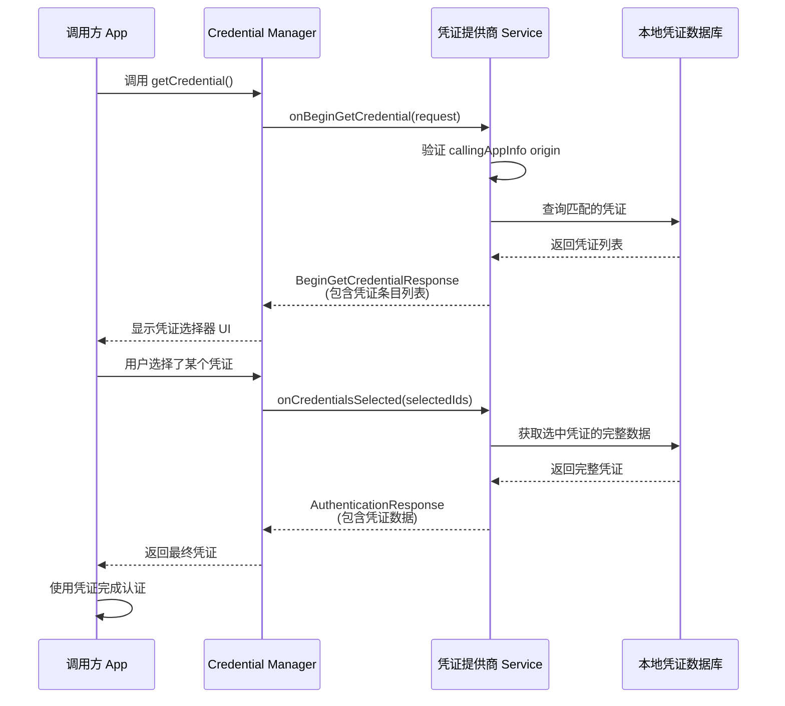
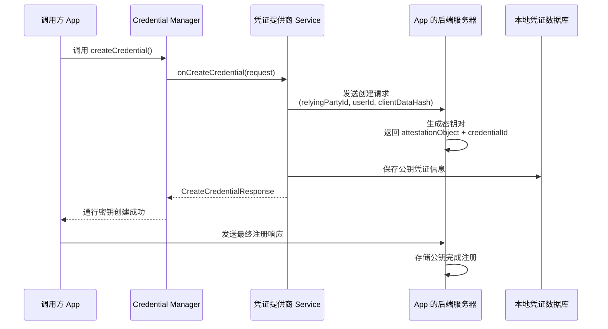
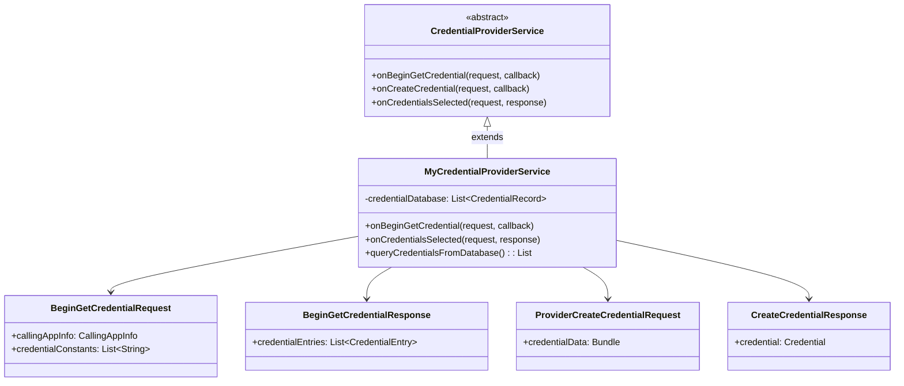

# 3.1.42 将凭证管理器与您的凭证提供商解决方案集成

晨雾散得比洛芙想象中快。

她蹲在希尔和黛琳旁边，看着她们调试那个 WebView 身份验证的时候，湖面上的白色雾气就在一点一点地被阳光融化掉，像是谁在空气中倒了一壶温热的牛奶。对岸的青山从朦胧的剪影慢慢变成了一座真正的山——有岩石、有树、有被晨风吹得微微摇晃的树冠。

"好了！"

希尔突然拍了一下电脑的边缘，把洛芙吓了一跳。那只刚才停在屏幕上的翠绿色小蜻蜓被惊得扑棱着翅膀飞走了。

"WebView 身份验证跑通了！"希尔兴奋地把电脑转向洛芙，屏幕上显示着一行绿色的 Logcat 输出：`Credential retrieved successfully`。

黛琳侧过身子看了看，点点头，嘴角浮起一个淡淡的弧度："不错，从 `CustomCredential` 里解析出 `idToken` 的流程走通了。"

"你看！"希尔指着屏幕上的代码窗口，"网页通过 JavaScript Interface 把 Google ID Token 传进来，然后我们用 `CredentialManager` 的 `createCredential` 方法把它封装成 `CustomCredential`，最后在 App 里验证这个 Token——整个流程跑完了！"

洛芙凑近屏幕看了看那些代码。她的目光在几个关键词上跳了跳——`WebView`、`JavaScript Interface`、`CustomCredential`。昨晚篝火旁的讨论在她脑海里留下了不少问号，但经过这一早上的观察，她至少弄明白了一件事：原来 WebView 就像帐篷里的一块投影幕布，而Credential Manager 就像一个专门负责接收身份信息的前台接待员。

"那……"洛芙抬起头，眨了眨眼睛，"接待员收到信息之后，要把这些信息存到哪里去呢？"

希尔和黛琳同时愣了一下。

"呃，"希尔挠了挠头，"你问的是数据库？"

"就是……"洛芙比划着，"如果用户选择'记住密码'，密码是存在哪里的？密码存在哪里，才能让 Credential Manager 找到呢？"

"好问题。"黛琳轻声说。她从背包里掏出了那支永远随身携带的白板笔，在笔记本的空白处画了起来。"洛芙问到了一个很核心的问题——Credential Manager 就像一个中央枢纽，它负责统一管理密码和通行密钥。但这些凭证具体存在哪里，取决于你是怎么设计的。"

"可以存在云端，也可以存在本地。"希尔补充道，"如果你的 App 需要跨设备同步，那一般存在云端服务器上；如果只是这台设备用，那存在本地的加密数据库里也行。"

"那我们之前一直在讨论的……是哪种？"洛芙问。

"都涉及了。"黛琳说，"之前我们一直在讨论 App 如何从 Credential Manager 里取出凭证——这个叫'凭证消费者'。但今天早上我想跟你们讨论的，是一个不同的方向——"

她顿了顿，用白板笔在纸上画了一个方框，在方框里写上了"CredentialProviderService"几个字。

"如果我们不只是从 Credential Manager 里取凭证，而是要**成为** Credential Manager 的一部分——也就是说，如果我们想做一个自己的密码管理器 App，让它能够为其他 App 提供密码和通行密钥——那我们需要怎么做？"

"成为凭证的提供方？"希尔立刻来了精神，眼睛里闪过一道亮光，"这个有意思！"

洛芙的反应慢了半拍："等等——你的意思是，让用户在我们的 App 里保存密码，然后其他 App 也可以用我们保存的密码来登录？"

"对。"黛琳点点头，"Google 的 Password Manager 就是这样的东西。你在 Chrome 里保存了密码，当你在任何 App 里登录 Google 相关服务时，Credential Manager 会自动调用 Google Password Manager 来获取凭证——不需要你每次都手动输入。"

"这不就是……"洛芙慢慢理解了，"让其他 App 来敲我们家的门，然后我们从门里递出钥匙？"

黛琳笑了："你这个比喻很准确。在 Android 的架构里，这个'门'就是 `CredentialProviderService`。"

"等等等等——"希尔突然打断，从旁边拖过自己的笔记本电脑，手指在键盘上飞快地敲了几下，"让我先找找官方文档——官网上有关于怎么实现这个服务的详细说明！"

伊莎不知道什么时候已经从帐篷里钻了出来，端着两杯冒着热气的可可走过来。她把其中一杯轻轻放在黛琳的手边，然后在洛芙旁边席地坐下，膝盖抱在胸前，下巴搁在膝盖上，安静地听着。

"找到了！"希尔把屏幕转过来，指着浏览器里打开的页面，"官方文档把这个叫'Integrate Credential Manager with your credential provider solution'——怎么把你的凭证提供商解决方案和 Credential Manager 集成起来。"

"首先，"希尔开始念，"你要在 `AndroidManifest.xml` 里声明一个 Service。这个 Service 必须继承 `CredentialProviderService`。"

她顿了顿，手指在键盘上敲了几下，调出了一个代码窗口。

"看，这是必须写的 manifest 配置——"

```xml
<service
    android:name=".MyCredentialProviderService"
    android:permission="android.permission.BIND_CREDENTIAL_PROVIDER_SERVICE"
    android:exported="true">
    <intent-filter>
        <action android:name="android.credentials.provider" />
    </intent-filter>
    <meta-data
        android:name="android.credentials.provider"
        android:resource="@xml/my_credential_provider" />
</service>
```

"四个要素。"黛琳伸出四根手指，"第一，`BIND_CREDENTIAL_PROVIDER_SERVICE` 这个权限——这个权限是系统级的，只有申请了这个权限的 Service 才能被 Credential Manager 识别为凭证提供者。第二，`android:exported="true"`——因为其他 App（以及系统）需要调用这个 Service，所以必须导出。第三，`intent-filter` 里指定 `android.credentials.provider` 这个 action——这是 Android 系统的约定，只有声明了这个 action 的 Service 才会在凭证选择器里出现。第四，`meta-data` 里引用一个 XML 资源文件，里面描述了你这个 Provider 的基本信息。"

"这个 XML 文件叫什么？"洛芙问。

希尔翻了翻浏览器："叫……`my_credential_provider.xml`，放在 `res/xml/` 目录下。里面主要是一些 UI 相关的配置——比如你的 Provider 在凭证选择器里显示什么名字、什么图标。"

她敲出一段代码：

```xml
<?xml version="1.0" encoding="utf-8"?>
<credential-provider xmlns:android="http://schemas.android.com/apk/res/android"
    android:label="My Credential Provider"
    android:settingsSubtitle="Manage your saved credentials" />
```

"`android:label` 就是用户在系统设置里看到的名字。"希尔解释道，"`android:settingsSubtitle` 是设置页面的副标题。"

伊莎轻轻"嗯"了一声，把自己那杯可可捧在手心里取暖。晨风从湖面上吹过来，带着一丝丝凉意，但阳光已经变得有些暖洋洋的了。

"所以这个服务需要继承哪个类呢？"洛芙问。

"`CredentialProviderService`。"黛琳说，"这是 Android 14 引入的系统服务，专门供凭证提供商来实现。它有两个主要的入口点——"

她在白板上画了一条线，在线的左边写上`onBeginGetCredential`，在右边写上`onCreateCredential`。

"当其他 App 调用 `CredentialManager.getCredential()` 想要获取凭证时，系统会触发 `onBeginGetCredential`——这时候你的 Provider 需要查询本地的凭证数据库，然后返回一个列表，让用户选择要提供哪个凭证。"

"当用户在一个 App 里注册新账号、想要保存密码时，系统会触发 `onCreateCredential`——这时候你的 Provider 需要协助完成通行密钥（passkey）的创建，或者帮用户保存新的密码。"

"通行密钥……"洛芙重复了一遍这个词，"就是不需要密码的那个？用指纹或者面部识别来验证身份的那种？"

"对。"希尔点头，"通行密钥是基于公钥加密的。你可以把通行密钥理解成一把特殊的钥匙——这把钥匙是存在设备上的，验证身份的时候不需要用户输入文字密码，而是用设备的生物识别（指纹、面部）或者 PIN 码来解锁。"

"我们来实现一下这两个入口点吧！"希尔已经在键盘上噼里啪啦地敲了起来，"看官方文档上的示例——首先看 `onBeginGetCredential`。"

```kotlin
class MyCredentialProviderService : CredentialProviderService() {

    override fun onBeginGetCredential(
        request: BeginGetCredentialRequest,
        callback: OutcomeReceiver<BeginGetCredentialResponse, GetCredentialException>
    ) {
        // 从请求中获取允许的凭证类型
        val allowedCredentialTypes = request.credentialConstants
        // 从本地数据库查询匹配的凭证
        val credentials = queryCredentialsFromDatabase(allowedCredentialTypes)
        
        // 构建返回给系统的凭证列表
        val credentialEntries = credentials.map { credential ->
            when (credential) {
                is PasswordCredential -> {
                    // 密码凭证
                    PasswordCredentialEntry.Builder()
                        .setCredentialId(credential.id)
                        .setUsername(credential.userName)
                        .setPassword(credential.password)
                        .build()
                }
                is PublicKeyCredential -> {
                    // 通行密钥凭证
                    PublicKeyCredentialEntry.Builder()
                        .setCredentialId(credential.id)
                        .setCredentialThumbnailIcon(credential.icon)
                        .build()
                }
            }
        }

        // 响应回调
        val response = BeginGetCredentialResponse.Builder()
            .setCredentialEntries(credentialEntries)
            .build()
        callback.onResult(response)
    }
}
```

"这段代码……"洛芙凑近屏幕看，"`queryCredentialsFromDatabase`是什么意思？我们要先自己建一个数据库？"

"当然。"黛琳说，"成为凭证提供商的一个重要职责，就是管理你自己的凭证存储。你需要有一个数据库来保存用户名、密码、通行密钥的公钥信息等等。这个数据库你可以用 Room，也可以用任何你喜欢的方案——只要能安全地存储和查询凭证就行。"

"安全地存储……"洛芙想了想，"是用EncryptedSharedPreferences或者SQLCipher之类的？"

"对。"希尔满意地看了她一眼，"密码这种东西绝对不能明文存储。至少要用 EncryptedSharedPreferences，如果有条件的话，用 SQLCipher 加密整个数据库会更好。"

"所以第一步永远是：查数据库。"黛琳在白板上写下"查"字，"根据请求里允许的凭证类型，从你的数据库里找出所有匹配的凭证。第二步是：构建返回给系统的凭证列表。第三步是：调用 callback.onResult 返回。"

"看起来不复杂嘛。"洛芙松了口气。

"骨架是简单的。"黛琳说，"但有几个关键细节需要注意——"

她看了看希尔，希尔立刻会意，继续翻文档："等等，文档里提到一个很重要的东西——origin 验证。"

"origin？"洛芙问。

"对。"希尔找到了一段相关说明，"当一个 App 请求获取凭证时，系统会告诉你的 Provider：这个请求是来自哪个 App 的（通过 `CallingAppInfo`）。你的 Provider 需要验证这个 origin 是否合法——也就是说，你要确保你只会给合法的 App 提供凭证，不会被恶意 App 冒名顶替。"

她敲出一段代码：

```kotlin
override fun onBeginGetCredential(
    request: BeginGetCredentialRequest,
    callback: OutcomeReceiver<BeginGetCredentialResponse, GetCredentialException>
) {
    // 获取调用方 App 的信息
    val callingAppInfo = request.callingAppInfo  // CallingAppInfo 类型
    
    // 验证 origin
    // callingAppInfo.origin 中存储了调用方的包名
    val isValidOrigin = callingAppInfo?.let { appInfo ->
        val origins = appInfo.origins  // List<String>，合法的 origin 列表
        // 你需要在 Provider 端预先配置好合法的 origin 列表
        // 只有来自这些 origin 的请求才是可信的
        val requestOrigin = request.callingAppInfo.origin
        origins.contains(requestOrigin)
    } ?: false
    
    if (!isValidOrigin) {
        // origin 验证失败，拒绝请求
        callback.onError(GetCredentialException("Invalid origin"))
        return
    }
    
    // 验证通过，继续查询凭证...
}
```

"这个 `CallingAppInfo` 是系统传进来的，"黛琳解释道，"里面有 `origins` 列表——这是调用方 App 在注册通行密钥时向系统登记的 origins。你的 Provider 需要预先存储一份合法的 origins 列表，然后每次收到请求时验证这个 origin 是否在列表里。"

"如果没有验证 origin……会怎样？"洛芙问。

"可能会被恶意 App 用来'钓取'用户的凭证。"希尔说，"比如一个恶意 App 伪装成某个正规 App，向你的 Provider 请求凭证。如果你不验证 origin，这个恶意 App 就能拿到用户在真正正规 App 里存储的密码。"

"好危险……"洛芙小声说。

伊莎一直安静地听着，这时候轻声开口："就像有人在营地门口假装是送快递的，想骗取帐篷里的东西。门口的保安要核对身份证才能放行——origin 就是那个'身份证'。"

洛芙点了点头，这个比喻让她觉得心里踏实了一些。

"好，下一个是 `onCreateCredential`。"希尔继续翻文档，"这个是用来处理'创建凭证'请求的——当用户在某个 App 里注册新账号，想要保存密码或者创建通行密钥时，系统会调用这个方法。"

她找到了一段 Kotlin 示例：

```kotlin
override fun onCreateCredential(
    request: CreateCredentialRequest,
    callback: OutcomeReceiver<CreateCredentialResponse, CreateCredentialException>
) {
    when (request) {
        is ProviderCreateCredentialRequest -> {
            // 通行密钥创建请求
            val requestInfo = request.credentialData  // Bundle 类型
            
            // 从 Bundle 中提取通行密钥创建数据
            val clientDataHash = requestInfo.getByteArray("clientDataHash")
            val relyingPartyId = requestInfo.getString("relyingPartyId")
            val userId = requestInfo.getString("userId")
            
            // 在数据库中创建通行密钥记录
            val newCredential = createPasskeyInDatabase(
                relyingPartyId = relyingPartyId!!,
                userId = userId!!,
                clientDataHash = clientDataHash!!
            )
            
            // 构建响应
            val credential = PublicKeyCredential(newCredential.credentialJson)
            val response = CreateCredentialResponse.Builder()
                .setCredential(credential)
                .build()
            callback.onResult(response)
        }
        else -> {
            // 其他类型的创建请求（如简单的密码保存）
            // 根据具体类型处理
        }
    }
}
```

"'ProviderCreateCredentialRequest'是专门给通行密钥准备的请求类型。"希尔指着屏幕，"里面有个 `credentialData` 字段，是个 Bundle，里面有 `clientDataHash`、`relyingPartyId`、`userId` 这些信息——这些是创建通行密钥所需要的核心数据。"

"`relyingPartyId`是什么？"洛芙问。

"就是服务提供方的标识符。"黛琳解释道，"比如你用 Google 账号登录某个 App，那个 App 的服务器就会把自己标识为一个 relying party。通行密钥是绑定到这个 relying party 的——只能在对应的 App 或网站上用，不能被其他 App 滥用。"

"就像营地钥匙只能开营地的门，不能开别人家的门。"伊莎轻声说。

"对。"黛琳笑着点点头。

"然后你把通行密钥的创建数据发给服务器，服务器会返回一个公钥凭证——`credentialJson`。你把这个 JSON 保存到本地数据库，然后通过 `CreateCredentialResponse` 返回给系统。"

"系统拿到这个凭证之后会怎么处理？"洛芙问。

"系统会把它交给发起请求的那个 App，那个 App 再把凭证发给自己的服务器验证。"希尔说，"验证通过之后，用户就完成注册了——下次在这个 App 登录时，就可以通过通行密钥（用生物识别）来完成身份验证，不需要再输入密码。"

"那 `onCreateCredential` 还支持其他类型的请求吗？"洛芙继续问。

"文档里提到，如果是普通的密码保存请求——也就是用户在某个 App 里输入了用户名和密码，想要保存下来——`CreateCredentialRequest` 会是另一个类型。"

希尔继续翻找，然后找到了一段关于"保存密码"的说明：

```kotlin
// 处理保存密码的请求
// 这种情况下，request 是 CreatePasswordCredentialRequest 类型
val passwordRequest = request as? CreatePasswordCredentialRequest
passwordRequest?.let {
    val username = it.userName
    val password = it.password  // 已经由系统解密过的明文密码
    val entity = it.entity  // 这个密码属于哪个网站或 App
    
    // 将用户名、密码、网站/App 信息保存到本地数据库
    savePasswordToDatabase(
        username = username,
        password = password,
        entity = entity
    )
    
    // 构建成功响应
    val response = CreateCredentialResponse.Builder().build()
    callback.onResult(response)
}
```

"注意这里的 `password` 是明文的。"黛琳强调了一下，"系统会把密码解密之后传给你的 Provider——这意味着你的 Provider 必须保证只在安全的环璄中使用这个数据，绝对不能把它明文打印到日志里，也绝对不能通过网络发送。"

"收到。"洛芙认真地点头。

阳光已经完全照到了营地旁边的草地上，那些草叶上的露珠正在一颗颗地蒸发，变成细小的水汽消散在空气中。远处的湖面被风吹得波光粼粼，像是有人在湖面上撒了一把碎银子。

"还有最后一个重要的东西。"希尔说，"文档里提到了一个设置入口——你的 Provider 应该能打开一个设置页面，让用户管理他们保存的凭证。"

"在设置里做什么？"洛芙问。

"比如查看所有已保存的密码、删除某个密码、修改用户名，或者开启/关闭自动填充功能。"黛琳说，"系统提供了一个标准的 Intent 来打开你的设置页面——"

```kotlin
// 在你的 Provider Service 或者某个 Activity 里
val intent = Intent(android.provider.Settings.ACTION_CREDENTIAL_PROVIDER)
intent.putExtra(CredentialProviderContract.EXTRA_SETTINGS_TARGET, 
    "my_credential_provider_package")
startActivity(intent)
```

"也可以直接使用 `ACTION_CREDENTIAL_PROVIDER` 这个系统 Action 来打开设置。"

"我想起来了，"伊莎突然开口，"之前抚子跟我讲过这个——她说在日本，有些密码管理器 App 会在用户第一次打开时请求用户把它设为默认的凭证填充程序。用户同意了之后，每当用户在浏览器或者 App 里输入密码时，系统就会自动弹出那个密码管理器的界面。"

"对。"黛琳说，"这就是'成为默认凭证提供商'的概念。你的 App 实现了 `CredentialProviderService` 之后，用户可以在系统设置里把你的 App 设为默认的密码填充工具。以后每次用户在任何一个 App 里需要填充密码时，系统就会调用你的 Service。"

"这个权限……用户必须主动同意吧？"洛芙问。

"当然。"希尔说，"这是 Android 的安全设计——没有任何 App 可以未经用户允许就成为凭证提供商。用户必须手动在系统设置里开启这个权限。"

"这就叫——"伊莎捧着可可，微微一笑，"钥匙很重要，所以保管钥匙的人必须是可靠的。"

"那我们赶紧来写一个完整的 Demo 吧！"希尔跃跃欲试，"从头实现一个 `CredentialProviderService`，包括 manifest 配置、Service 实现、数据库操作——全部跑一遍！"

她已经迫不及待地打开了 Android Studio，新建了一个项目。

"等等，"洛芙拉住了她的手腕，"我们先把图画出来吧？黛琳说看代码之前要先理解流程。"

希尔停下了手里的动作，想了想，然后点点头："说得对。那我来画！"

她拿起黛琳的白板笔，在白板上画了起来。

"首先看 `onBeginGetCredential` 的完整流程——"



"图 1：`onBeginGetCredential` 完整认证流程"

"第一步，调用方 App 向 `CredentialManager` 发起 `getCredential` 请求。"希尔指着图上的箭头，"第二步，系统把请求转发给你的 `CredentialProviderService`，触发 `onBeginGetCredential`。"

"第三步，你的 Service 要验证请求的 origin 是否合法——这一步很重要，能防止恶意 App 冒名顶替。第四步，从你的本地数据库里查询匹配的凭证。第五步，把查询到的凭证列表包装成 `BeginGetCredentialResponse` 返回给系统。"

"第六步，系统显示凭证选择器 UI，让用户选择要使用哪个凭证。用户选择之后，第七步，系统再次调用你的 Service，触发 `onCredentialsSelected`，传入用户选择的凭证 ID。第八步，你的 Service 根据凭证 ID 从数据库里取出完整的凭证数据。第九步，返回 `AuthenticationResponse`，里面包含真正的凭证数据（密码原文或者通行密钥的签名数据）。第十步，`CredentialManager` 把凭证交给调用方 App，App 使用凭证完成认证。"

"好复杂……"洛芙深吸了一口气。

"骨架清楚了，细节就容易了。"黛琳说，"核心就是：第一步返回'选项列表'，第十步返回'选中凭证的具体数据'。中间这几步都是为了给用户一个选择的机会，同时保护用户不被恶意 App 欺骗。"

"再来看通行密钥创建的流程——"

希尔擦了擦白板，继续画：



"图 2：通行密钥（Passkey）创建流程"

"这个流程稍微有点不同。"希尔指着图，"当用户在 App 里想要创建一个通行密钥时，`CredentialManager` 会调用你的 Provider 的 `onCreateCredential`。你的 Provider 需要把这个创建请求转发给 App 对应的后端服务器——服务器会生成一对公私钥，把公钥存下来，然后把私钥相关信息返回给你的 Provider。"

"Provider 把私钥相关信息保存到本地数据库，然后把服务器的响应包装成 `CreateCredentialResponse` 返回给系统。系统告诉 App 创建成功了，App 再通知服务器——服务器最终确认并完成注册。"

"这个流程涉及网络请求吗？"洛芙问。

"涉及。"黛琳说，"所以 `onCreateCredential` 是在后台线程执行的——系统会为它创建一个后台线程，你可以在上面执行网络请求。"

"明白了。"洛芙点点头。

希尔放下白板笔，转向伊莎："伊莎，你觉得这个流程像什么？"

伊莎想了想，把下巴埋进了膝盖里。

"像是……你在营地里建了一个小小的物品寄存处。"她轻声说，"其他来营地玩的人如果落了东西在你的寄存处，你可以帮他们保管。下次他们回来找的时候，你要核对他的身份，确认这个物品确实是他的，然后才能还给他。"

"寄存处的管理员要做什么？"希尔问。

"第一，要有一个登记本，记录谁存了什么。"伊莎竖起一根手指，"第二，要确认来取东西的人确实是物品的主人——可能是查看证件，或者问一个只有本人才知道的问题。"

"第三，"她的声音变得更轻了，"如果有人想把新东西存进来，要登记清楚，方便以后找得到。"

"Perfect！"希尔在空气中用力挥了一下拳头，"这个比喻太准确了！"

洛芙看着伊莎，忍不住笑了。伊莎总是能用这种简单的比喻把复杂的东西变得让人心里踏实。

"那现在我来写一个简化版的 Provider 实现吧。"希尔转向电脑，"我会用 Kotlin 写，代码尽量可以直接编译运行。"

```kotlin
package com.example.credentialprovider

import android.app.Service
import android.content.Intent
import android.os.IBinder
import android.service.credentials.CredentialProviderService
import android.service.credentials.BeginGetCredentialRequest
import android.service.credentials.BeginGetCredentialResponse
import android.service.credentials.Credential
import android.service.credentials.GetCredentialException
import android.os.OutcomeReceiver
import androidx.annotation.RequiresApi
import androidx.credentials.provider.AuthenticationResponse
import androidx.credentials.provider.CredentialEntry
import androidx.credentials.provider.CredentialProviderInfo
import androidx.credentials.provider.PasswordCredentialEntry
import androidx.credentials.provider.PublicKeyCredentialEntry
import androidx.credentials.provider.RemoteEntry

@RequiresApi(34)
class MyCredentialProviderService : CredentialProviderService() {

    // 模拟的凭证数据库（实际应用中应使用 Room + SQLCipher 加密）
    private val credentialDatabase = mutableListOf<CredentialRecord>()

    data class CredentialRecord(
        val id: String,
        val type: CredentialType,
        val username: String,
        val password: String? = null,
        val credentialJson: String? = null,  // 用于通行密钥
        val relyingPartyId: String? = null
    )

    enum class CredentialType {
        PASSWORD,
        PASSKEY
    }

    override fun onBeginGetCredential(
        request: BeginGetCredentialRequest,
        callback: OutcomeReceiver<BeginGetCredentialResponse, GetCredentialException>
    ) {
        // 第一步：验证调用方 App 的 origin（防恶意 App 冒领）
        val callingAppInfo = request.callingAppInfo
        if (callingAppInfo != null) {
            val requestOrigin = callingAppInfo.origin
            // 在实际应用中，你应该维护一个合法的 origin 列表
            // 只返回属于该 origin 的凭证
            val allowedOrigins = listOf("https://example.com", "https://app.example.com")
            if (requestOrigin !in allowedOrigins) {
                callback.onError(GetCredentialException("Origin not allowed: $requestOrigin"))
                return
            }
        }

        // 第二步：根据请求中允许的凭证类型，查询数据库
        val allowedTypes = request.credentialConstants  // 允许返回哪些类型的凭证
        val matchingCredentials = credentialDatabase.filter { record ->
            when (record.type) {
                CredentialType.PASSWORD -> {
                    // 密码凭证是否被允许（取决于请求类型）
                    allowedTypes.contains(android.credentials.CredentialManager.BLOCK_KEY_IS_UNLIMITED)
                }
                CredentialType.PASSKEY -> {
                    // 通行密钥凭证
                    true
                }
            }
        }

        // 第三步：构建返回的凭证条目列表
        val credentialEntries: MutableList<CredentialEntry> = mutableListOf()
        
        for (record in matchingCredentials) {
            when (record.type) {
                CredentialType.PASSWORD -> {
                    // 构建密码凭证条目（只返回最小必要信息）
                    val entry = PasswordCredentialEntry.Builder()
                        .setCredentialId(record.id)
                        .setUsername(record.username)
                        // 注意：密码本身不在这里返回，而是在 onCredentialsSelected 中返回
                        .build()
                    credentialEntries.add(entry)
                }
                CredentialType.PASSKEY -> {
                    // 构建通行密钥凭证条目
                    val entry = PublicKeyCredentialEntry.Builder()
                        .setCredentialId(record.id)
                        .setUserName(record.username)
                        // 可以设置图标（实际应用中使用真实的图标资源）
                        .build()
                    credentialEntries.add(entry)
                }
            }
        }

        // 第四步：返回 BeginGetCredentialResponse
        val response = BeginGetCredentialResponse.Builder()
            .setCredentialEntries(credentialEntries)
            .build()
        callback.onResult(response)
    }

    override fun onCredentialsSelected(
        request: androidx.service.credentials.CredentialSelectedRequest,
        response: AuthenticationResponse.Builder
    ) {
        // 用户在凭证选择器里选中了一个凭证
        // 根据选中的 credential ID 从数据库中获取完整数据
        val selectedCredentialId = request.credentialEntry.credentialId
        
        val record = credentialDatabase.find { it.id == selectedCredentialId }
        
        when (record?.type) {
            CredentialType.PASSWORD -> {
                // 返回密码凭证
                response.setCredentialData(record.password!!.toByteArray())
            }
            CredentialType.PASSKEY -> {
                // 返回通行密钥凭证
                response.setAuthenticationResponse(record.credentialJson!!)
            }
            else -> {
                // 找不到对应的凭证，不做任何操作
            }
        }
    }
}
```

"这段代码……"洛芙盯着屏幕，"比我想的要长很多啊。"

"但逻辑其实很清晰。"希尔说，"`onBeginGetCredential` 做三件事：验证 origin、查数据库、返回凭证列表。`onCredentialsSelected` 做一件事：根据用户选择的凭证 ID，从数据库里取出完整数据返回。"

"`setCredentialData` 和 `setAuthenticationResponse` 有什么区别？"洛芙问。

"`setCredentialData` 用于密码凭证，`setAuthenticationResponse` 用于通行密钥。"希尔解释道，"密码凭证的'数据'就是密码本身——一个字符串。通行密钥凭证的'数据'是服务器返回的那个 JSON（里面包含 credential ID 和公钥信息）。"

"所以在数据库里，密码是存明文还是存加密的？"洛芙突然想到了什么，"如果是加密的，这里要怎么解密？"

"好问题！"希尔拍了拍手，"在实际的 Provider 里，密码在数据库里是加密存储的。解密需要用到一个只有 Provider 自己知道的密钥——这个密钥通常来自用户的主密码，或者设备绑定密钥。你在 `setCredentialData` 之前，需要先用解密算法把加密的密码还原成明文。"

"这个解密密钥怎么保护呢？"洛芙继续问。

"可以放在 Android 的 Keystore 里。"黛琳说，"Keystore 是 Android 系统级的安全存储，可以用来保存加密密钥，而且这些密钥不会在设备被 root 之后直接暴露。"

"听起来很复杂……"洛芙轻轻叹了口气。

"核心原则其实很简单，"伊莎轻声说，"就是把最重要的钥匙，放在最安全的地方。"

洛芙看着湖面。阳光已经完全升起来了，湖面上的波光比刚才更亮了，像是一面被打碎后又重新拼起来的大镜子。远处的青山在晴朗的天空下显得格外清晰，每一棵树都看得见。

"那我们现在的露营 App，"洛芙想了想，"如果想添加一个'保存营地登录密码'的功能，应该怎么做？"

希尔和黛琳交换了一个眼神。

"你可以先用一个简单的方式——"黛琳说，"先把用户名和密码存在 EncryptedSharedPreferences 里，不急着做完整的 Provider 实现。等 App 成熟了，有了一定的用户基础，再考虑实现 `CredentialProviderService`，让其他 App 也可以用你保存的凭证。"

"但如果一开始就决定要做成一个独立的密码管理器 App，"希尔补充道，"那从一开始就按照 Provider 的架构来设计会更好——用 Room 数据库存储凭证，用 Keystore 管理加密密钥，用 `CredentialProviderService` 提供给系统。"

"先学会走，再学会跑。"伊莎把最后一口可可喝完，站起来伸了个懒腰，"日头升高了，该收拾东西准备出发了。"

四个人开始一起收拾营地。希尔把笔记本电脑收进背包，黛琳把白板擦干净叠好，伊莎开始收拾睡袋和防潮垫。洛芙则蹲在石头旁边，看着那台已经合上电脑的希尔，突然想起了什么。

"希尔！"

"嗯？"

"你刚才那个 Demo 代码，"洛芙站起身来，"如果我想运行它，需要在 manifest 里加上什么？"

希尔蹲下来，从背包里又掏出电脑，快速敲了几下：

```xml
<!-- AndroidManifest.xml -->
<service
    android:name=".MyCredentialProviderService"
    android:permission="android.permission.BIND_CREDENTIAL_PROVIDER_SERVICE"
    android:exported="true"
    android:label="@string/app_name">
    <intent-filter>
        <action android:name="android.credentials.provider" />
    </intent-filter>
</service>
```

"就这么简单？"洛芙有些意外。

"就这么简单。"希尔把屏幕转过来让她看，"但要让系统真正识别你的 Provider，用户还必须在系统设置里手动开启'默认凭证填充程序'权限。这个不是代码能控制的——必须用户自己同意。"

"这就是 Android 的安全设计——用户必须主动授权，App 才能接触凭证。"黛琳走过来说。

四个人一起把东西收拾好。希尔和黛琳把背包背上肩，伊莎已经走到了营地边缘的小路上，正在回头招手示意大家跟上。洛芙最后看了一眼身后的湖面——晨雾已经完全散了，湖水和天空都是清亮的蓝色，分不清哪里是水哪里是天。

"洛芙！快点！"希尔在前面喊道。

"来了来了！"洛芙小跑着追上去。

阳光照在她的背上，暖洋洋的。远处的山路在树丛间蜿蜒向上，看不到尽头。

"希尔——"洛芙边走边问，"你刚才说的 Password Manager App，我们之后会做一个吗？"

"为什么不呢？"希尔回过头来，咧嘴一笑，"先从简单的开始，用 EncryptedSharedPreferences 保存密码。然后等我们学到了更多，再慢慢升级成完整的 Provider。"

"一步一步来。"黛琳在前面说。

"就像爬山一样，"伊莎轻声补充，"每走一步，就离山顶近一步。"

洛芙看着前面三个人的背影，忍不住笑了。

她想起刚才希尔画的那张流程图——App、Credential Manager、Provider Service、数据库，三个角色之间的数据流转，就像营地里来来往往的 hikers，互相交接着钥匙。

凭证从来不是孤立的。它从一个地方出发，经过 Credential Manager 的调度，最终到达需要它的 App。而作为开发者，她要做的，就是确保这条路上的每一个环节都安全、可靠、不出错。

---

## 专业技术总结

**凭证提供商服务**（Credential Provider Service）—— Android 14 引入的系统服务接口，允许第三方应用以"凭证提供商"的身份接入 Android 系统级的凭证管理框架。其他应用通过 `CredentialManager.getCredential()` 获取凭证时，系统会自动调用已注册的 Provider 的 Service 来提供密码或通行密钥。

#### 结构图



#### 复杂度与影响

凭证 Provider 的性能主要取决于数据库查询效率和加密解密操作的耗时。使用 Room 数据库配合 SQLCipher 加密时，查询延迟通常在 10-50ms 范围内；使用 EncryptedSharedPreferences 时，加密和解密操作会增加额外的 CPU 开销，建议在后台线程执行。

#### 反模式与陷阱

1. **不验证 origin**：直接返回凭证给所有请求方。修复：始终通过 `CallingAppInfo.origin` 验证请求来源的合法性，并与预配置的 origins 白名单比对。

2. **明文存储密码**：将密码直接存入 SharedPreferences 或普通数据库。修复：使用 EncryptedSharedPreferences 或 Room + SQLCipher 加密存储，加密密钥存入 Android Keystore。

3. **在主线程执行数据库查询**：在 `onBeginGetCredential` 中直接查询数据库，可能导致 ANR。修复：`onBeginGetCredential` 的回调已经是异步的，但数据库操作应使用 Room 的 `withContext(Dispatchers.IO)` 确保在 IO 线程执行。

4. **不处理 `CancellationSignal`**：当用户在凭证选择器中取消操作时，Provider 没有取消正在进行的数据库查询或网络请求。修复：监听 `cancellationSignal`，在 `isCanceled` 为 true 时中止操作。

5. **混淆 ProGuard 规则缺失**：`CredentialEntry`、`ProviderCreateCredentialRequest` 等类被混淆后导致系统无法解析。修复：在 ProGuard/R8 配置中添加 `-keep` 规则保留 Provider 相关的类。

#### 设计哲学

凭证提供商的核心设计思想是**安全的中介**——Provider 在用户和调用方 App 之间充当中立的安全检查站。它既不信任调用方 App（必须验证 origin），也不在响应中直接暴露完整凭证（分两步：先返回选项，再在用户确认后返回数据）。这种"双重确认"机制确保了即使有恶意 App 试图钓取凭证，也必须经过用户的主动选择才能获取。

#### 🏕️ 动手练习

**项目制练习：构建一个简易的密码管理器 Provider**

本练习的目标是实现一个完整的 `CredentialProviderService`，能够保存和提供密码凭证。

**Task 1：配置 Manifest 和资源文件**
在 `AndroidManifest.xml` 中声明一个继承 `CredentialProviderService` 的 Service，并添加 `BIND_CREDENTIAL_PROVIDER_SERVICE` 权限。在 `res/xml/` 目录下创建 `my_credential_provider.xml` 配置文件，设置 Provider 的显示名称和图标。

**Task 2：实现 Service 骨架**
创建 `MyCredentialProviderService` 类，继承 `CredentialProviderService`。重写 `onBeginGetCredential` 方法，在方法体内添加日志输出，验证方法是否被系统正确调用。

**Task 3：实现凭证存储**
使用 `EncryptedSharedPreferences` 创建一个本地凭证存储。实现 `saveCredential(id, username, password)` 和 `getCredentials()` 两个方法。使用 Mock 数据填充几条测试凭证。

**Task 4：完善 onBeginGetCredential**
在 `onBeginGetCredential` 中实现 origin 验证逻辑（至少检查调用方 App 的包名是否在白名单中）。实现从 `EncryptedSharedPreferences` 查询凭证并构建 `PasswordCredentialEntry` 列表的逻辑。

**Task 5：实现 onCredentialsSelected**
重写 `onCredentialsSelected` 方法，根据用户选择的凭证 ID 从存储中获取完整密码数据，使用 `AuthenticationResponse.Builder.setCredentialData()` 返回。

**Task 6：添加设置 Activity**
创建一个 `SettingsActivity`，用于显示用户已保存的所有凭证、删除凭证、以及配置默认 Provider 选项。在 `AndroidManifest.xml` 中为该 Activity 添加 `android:exported="true"` 并配置合适的 intent-filter。

**Task 7：连接 UI 与 Provider**
在设置 Activity 中添加"添加新密码"的功能——用户输入用户名、密码、网站/App 名称，点击保存后调用 Provider 的存储方法刷新列表。

**验收标准：**
- [ ] Manifest 声明正确，系统能够识别该 Service 为凭证提供商
- [ ] 在系统设置的"密码和账户"或"自动填充服务"中能看到该 Provider
- [ ] 从另一个测试 App 发起 `getCredential()` 请求时，Provider 的 `onBeginGetCredential` 被触发并返回凭证列表
- [ ] 用户选择凭证后，`onCredentialsSelected` 被调用，密码数据正确返回
- [ ] 设置 Activity 能正常展示、添加和删除凭证
- [ ] 所有凭证在存储中都是加密的（不可见明文）

**提示代码（Task 3）：**

```kotlin
// EncryptedSharedPreferences 的初始化（需要 Jetpack Security 库）
val masterKey = MasterKey.Builder(context)
    .setKeyScheme(MasterKey.KeyScheme.AES256_GCM)
    .build()

val sharedPreferences = EncryptedSharedPreferences.create(
    context,
    "my_secure_credentials",
    masterKey,
    EncryptedSharedPreferences.PrefKeyEncryptionScheme.AES256_SIV,
    EncryptedSharedPreferences.PrefValueEncryptionScheme.AES256_GCM
)

// 保存凭证
sharedPreferences.edit()
    .putString("credential_${id}_username", username)
    .putString("credential_${id}_password", password)
    .apply()
```

#### 参考实现要点

1. 凭证 Provider 必须同时支持密码凭证和通行密钥凭证，以适应不同 App 的需求。

2. origin 验证是防止凭证泄露的关键——永远不要在没有验证调用方合法性的情况下返回凭证。

3. 通行密钥的 `credentialJson` 来自后端服务器的响应，不应在 Provider 端自行生成。

4. 使用 Android Keystore 管理加密密钥，即使设备被 root 也无法直接读取密钥材料。

5. `CancellationSignal` 的正确处理能避免不必要的资源浪费和潜在的安全风险。

---

> 学习建议：凭证 Provider 是 Android 身份认证体系中较复杂的组件。建议先掌握 `CredentialManager` 作为"消费者"的使用方法（卷 3.1 第 41 章），再学习 Provider 的实现方式。实现 Provider 时，origin 验证是最容易被忽略但也最关键的安全环节——务必在开发早期就加入这个检查逻辑，不要等到发布前才补上。

## 洛芙的小小日记本

今天学了怎么当"凭证管理员"！原来不只是从 Credential Manager 里拿密码，还可以让别人来"敲门"问我拿钥匙。希尔说最重要的一步是核对对方的身——origin 验证，就像门口要刷身份证才能进一样。听起来复杂，但希尔画的那张图帮我理清了：先返回选项让用户选，用户确认了再把真正的钥匙递出去。密码存在加密数据库里，钥匙（加密密钥）存在 Keystore 里——好多层保护啊。

## 今日关键词

**CredentialProviderService**：Android 14 引入的系统抽象服务类，供第三方实现以成为凭证提供商。继承该类并实现 `onBeginGetCredential` 和 `onCreateCredential` 两个入口方法，即可接入 Android 系统的凭证管理框架。

**BIND_CREDENTIAL_PROVIDER_SERVICE**：系统级权限，只有声明了此权限的 Service 才会被 Credential Manager 识别为合法的凭证提供者。该权限不能被普通 App 申请，只有系统内置的组件才具备此权限。

**BeginGetCredentialRequest**：系统向 Provider 发起的"获取凭证"请求，包含 `callingAppInfo`（调用方 App 信息）和 `credentialConstants`（允许返回的凭证类型列表）。

**BeginGetCredentialResponse**：Provider 返回给系统的凭证列表，包含 `credentialEntries`（`List<CredentialEntry>`），每个条目包含凭证的基本信息（ID、用户名、图标），但不包含完整的凭证数据。

**ProviderCreateCredentialRequest**：当用户在一个 App 里创建新的通行密钥时，系统向 Provider 发起的创建请求，包含 `credentialData`（Bundle 类型），内有 `relyingPartyId`、`userId`、`clientDataHash` 等创建通行密钥所需的参数。

**PasswordCredentialEntry**：密码凭证的展示条目 Builder，用于在 `BeginGetCredentialResponse` 中构建用户可见的密码选项。只包含最小必要信息（ID、用户名），不包含密码本身。

**PublicKeyCredentialEntry**：通行密钥凭证的展示条目 Builder，与 `PasswordCredentialEntry` 类似，用于构建通行密钥选项供用户选择。

**CallingAppInfo**：系统传入 Provider 的调用方 App 信息，包含 `origin`（调用方的 Web origin，用于验证请求是否来自合法的网站/App）和包名等。

**AuthenticationResponse**：用户在凭证选择器中确认选择后，Provider 返回给系统的最终凭证数据。对于密码凭证使用 `setCredentialData()`，对于通行密钥使用 `setAuthenticationResponse()`。

**EncryptedSharedPreferences**：Jetpack Security 库提供的加密 SharedPreferences 实现，使用 AES-256-GCM 加密键值对，适合存储少量敏感数据（如密码 Manager 中的凭证摘要）。

**Android Keystore**：Android 系统级的密钥存储服务，提供对称和非对称密钥的安全生成和存储能力，密钥材料不会在设备 root 后直接暴露，是保护加密密钥的最佳选择。

**SQLCipher**：SQLite 的加密扩展，提供数据库级别的透明加密，配合 Room 使用可以保护大量凭证数据的安全存储。

**relyingPartyId**：通行密钥架构中的服务提供方标识符，通常是网站域名或 App 的包名。通行密钥绑定到特定的 relyingPartyId，只能在对应的服务上使用，防止跨站/跨 App 冒用。

**Passkey（通行密钥）**：基于公钥加密的身份验证凭证，存储在设备上，验证时使用设备的生物识别（指纹、面部）或 PIN 解锁私钥，不需要用户输入文字密码。Android 通过 `PublicKeyCredential` 类型支持通行密钥。
