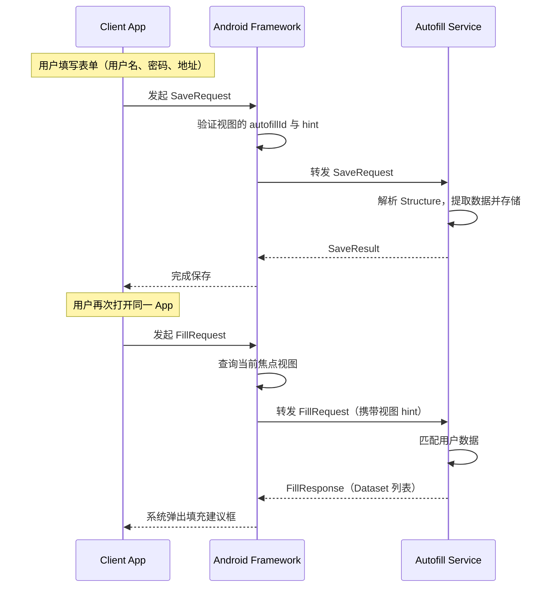
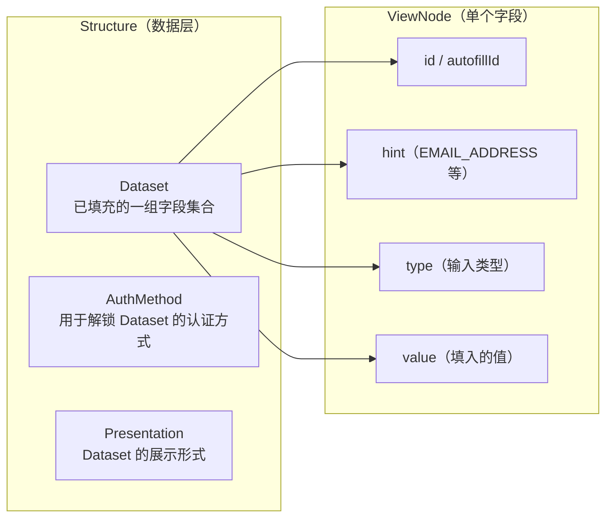
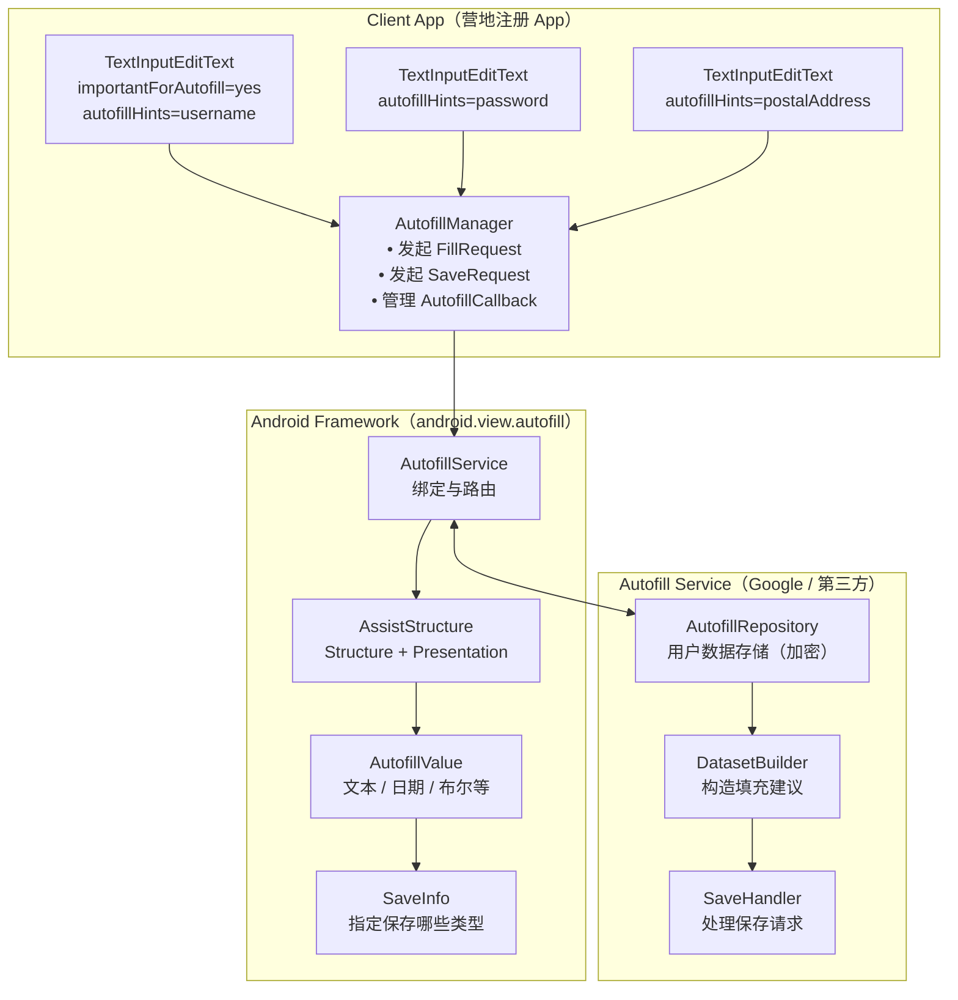
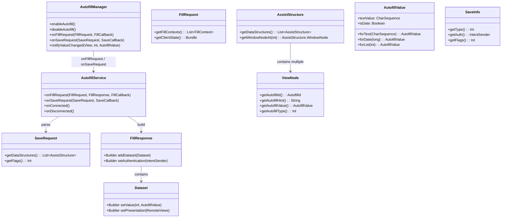

# 3.1.5 自动填充框架

日头又升高了一些。

洛芙把笔记本从膝盖上挪开，揉了揉手腕。指尖还留着方才敲键盘的余温，湖面上折射过来的光线在屏幕上晃来晃去，她眯起眼睛，把亮度又调高了一档。

"你们看。"

希尔把自己那台敞着盖的 Chromebook 推到桌子中央，屏幕上是一个还没完工的 App 界面——登录框、用户名、密码、收货地址、电话号码，一排放下去得像列清单。

"营地注册 App，"希尔用触控笔点着屏幕，"我打算让来露营的人提前在手机上填好信息，到了现场直接扫码入住，不用再手动登记。但是——"

她顿了顿，眉头皱起来。

"每次我自己在上面填地址，都要来回来去切换输入法，打一个字段切一次，写完一页感觉手都要断了。"

伊莎探过头来看了一眼，轻轻"嗯"了一声。

"这种表单，如果能让系统记住，下次自动填进去就好了。"她说。

"对！"希尔猛地一拍桌子，帐篷杆都跟着晃了一下，"我之前看过 Android 有个 Autofill 功能，不知道能不能用在我们 App 里——"

"Autofill？"

洛芙抬起头，这个词她隐约听过，但一直没搞明白具体是什么。

"就是那种，你点一下用户名框，手机就弹出建议框，把你保存过的名字填进去的那种？"她比划着，"我以前在浏览器里见过，但不知道怎么做到的。"

黛琳一直没说话，这会儿才慢慢开口。她手里捧着一杯放凉了的柠檬水，杯壁上挂着细密的水珠。

"Autofill 不只是浏览器，"她说，"它是 Android 系统里一套通用的框架。任何 App 都可以用，也可以接进来。"

"双向的？"希尔立刻追问。

"双向的。"黛琳点头，"你填表的时候，数据可以存进去；下次再遇到类似的框，系统就能帮你填上。"

希尔眼睛亮了。

"那我们今天的课题就是这个了？"

黛琳把杯子放下，从椅子背上搭着的外套口袋里摸出一支白板笔。

"先把整个流程走一遍，"她说，"然后你们再决定要不要在自己项目里接。"


## 1 · 那个总是让洛芙抓狂的地址栏

希尔把 Chromebook 屏幕转了个方向，让四个人都能看见。她在开发者选项里翻了几下，调出一个 Autofill 的设置页面。

"看到了吗？"她指着屏幕左侧一栏设置项，"这里写着'自动填充服务'，下面可以选 Google 密码管理器，也可以选别的。"

洛芙凑近了看。屏幕上列着几个已安装的自动填充服务，最上面那个带 Google logo 的就是默认开启的。

"我手机上也这个，"她说，"但我之前一直不知道这是干什么用的——感觉点了也没什么反应。"

"因为没有 App 声明自己支持 Autofill。"黛琳说，"系统虽然有这个能力，但 App 必须主动配合才行。就像你家门口有个信箱，但如果没人往里投信，信箱永远是空的。"

希尔点开 Google 密码管理器，给大家看里面的内容——一排排保存过的网站账号，每个后面跟着用户名和密码。

"看到了吗？"她说，"这些不是只有网页才能用。只要 App 声明了合适的 Autofill 元数据，Google 这个服务也能帮 App 填。"

"等等，"洛芙举起手，"Google 的密码管理器能填任意 App 的表单？"

"不是任意 App，"黛琳摇头，"App 必须主动告诉系统：'我这个框是用户名''那个框是收货地址'。系统收到这些信息之后，才能去找匹配的数据。"

"就像——"伊莎想了想，"一个图书馆管理员，书库里什么书都有，但你得先告诉她你要找什么类型的书，她才能帮你定位到具体哪一本。"

洛芙"哦"了一声，好像有点明白了。


## 2 · 黛琳的白板：从表单到数据的流动

黛琳把白板架在两棵树之间，用指尖抹掉昨晚写的残余字迹，开始画图。

"Autofill 框架的核心参与者只有三个，"她边画边说，"App、Autofill Service，还有 Android 系统本身。"

她先在最左边画了一个框，写上"Client App（我们的营地注册 App）"。

"Client App 就是表单所在的 App，"她说，"营地注册、快递下单、任何有输入框的 App 都算。"

然后她在中间画了一个大框，写上"Android Framework（AutofillManager）"。

"所有通信都要经过这一层，"她用箭头连接左右两个框，"App 不能直接跟 Service 说话，必须通过 Framework 的 AutofillManager 来中转。"

最后她在最右边画了第三个框，写上"Autofill Service（Google 密码管理器等）"。

"Service 才是真正存数据的地方，"她说，"密码、地址、姓名、电话——都存在这里。"

她在白板上画出一个完整的流程：



"图 1 是完整的双向通信，"黛琳放下笔，指着白板，"Save 和 Fill 是两个方向相反的操作，但走的都是同一条路——通过 AutofillManager 递交请求，系统负责找到对应的 Service，再把请求或响应原路送回来。"

希尔凑近看了看白板。

"所以 Framework 负责路由？"她问。

"对，"黛琳点头，"Framework 不知道表单里填的是什么，只负责认 autofillId——每个可填充的视图在系统里都有一个唯一标识，Service 就靠这个 ID 来匹配数据。"

洛芙盯着白板上的图，忽然想到了什么。

"那如果用户装了不止一个 Autofill Service 呢？"她问，"比如装了 Google 的，又装了别的——系统怎么知道用哪个？"

"默认用用户设定的那一个，"黛琳说，"用户在系统设置里选了一个之后，所有 App 都用这一个 Service。不像插件那样可以同时生效。"


## 3 · 希尔上手：给营地 App 加上 autofill 元数据

"光说不练不行，"希尔把 Chromebook 拉回来，打开营地注册 App 的代码，"我先来跑一遍从零接入需要做什么。"

她调出一个登录布局的 XML 文件，屏幕上显示着一排 EditText。

```xml
<!-- res/layout/activity_register.xml -->
<LinearLayout
    android:layout_width="match_parent"
    android:layout_height="wrap_content"
    android:orientation="vertical"
    android:padding="16dp">

    <!-- 用户名 -->
    <com.google.android.material.textfield.TextInputLayout
        android:layout_width="match_parent"
        android:layout_height="wrap_content"
        android:hint="用户名">

        <com.google.android.material.textfield.TextInputEditText
            android:id="@+id/etUsername"
            android:layout_width="match_parent"
            android:layout_height="wrap_content"
            android:inputType="textPersonName"
            android:importantForAutofill="yes" />
            <!-- 👆 这行就是关键！ -->

    </com.google.android.material.textfield.TextInputLayout>

    <!-- 密码 -->
    <com.google.android.material.textfield.TextInputLayout
        android:layout_width="match_parent"
        android:layout_height="wrap_content"
        android:hint="密码"
        app:endIconMode="password_toggle">

        <com.google.android.material.textfield.TextInputEditText
            android:id="@+id/etPassword"
            android:layout_width="match_parent"
            android:layout_height="wrap_content"
            android:inputType="textPassword"
            android:importantForAutofill="yes" />

    </com.google.android.material.textfield.TextInputLayout>

    <!-- 收货地址 -->
    <com.google.android.material.textfield.TextInputLayout
        android:layout_width="match_parent"
        android:layout_height="wrap_content"
        android:hint="收货地址">

        <com.google.android.material.textfield.TextInputEditText
            android:id="@+id/etAddress"
            android:layout_width="match_parent"
            android:layout_height="wrap_content"
            android:inputType="textPostalAddress"
            android:importantForAutofill="yes" />

    </com.google.android.material.textfield.TextInputLayout>

    <!-- 电话 -->
    <com.google.android.material.textfield.TextInputLayout
        android:layout_width="match_parent"
        android:layout_height="wrap_content"
        android:hint="联系电话">

        <com.google.android.material.textfield.TextInputEditText
            android:id="@+id/etPhone"
            android:layout_width="match_parent"
            android:layout_height="wrap_content"
            android:inputType="phone"
            android:importantForAutofill="yes" />

    </com.google.android.material.textfield.TextInputLayout>

</LinearLayout>
```

"看到了吗？"希尔指着第三行注释，"`importantForAutofill="yes"`——就这一行，系统就知道这个框是需要 Autofill 的。"

"就这么简单？"洛芙有点不信。

"就这么简单，"希尔点头，"Material Design 的 TextInputLayout 和 TextInputEditText 天然支持 Autofill，只要在 XML 里加这一句就行。"

伊莎凑过来看。

"但这里的密码框呢？"她问，"密码也能自动填？"

"能，但密码一般走 Credential Manager，"黛琳在旁边说，"Credential Manager 整合了密码管理、Passkey 和 Autofill，是更上层的入口——我们上一章聊的 OAuth 2.0 授权之后存的凭证，就是从那里取出来的。"

"那这个 Autofill 和 Credential Manager 是什么关系？"洛芙追问。

"Credential Manager 是统一的凭证管理界面，"黛琳说，"底层会根据数据类型分流——密码类走 Autofill Service，生物特征认证走 BiometricPrompt，WebAuthn 走专有通道。Autofill 只是其中一条路。"

"那我们先专注 Autofill，"希尔说着继续敲代码，"加完 XML 之后，第二步是声明 App 支持 Autofill——在 AndroidManifest 里注册一个 Service。"

她打开清单文件：

```xml
<!-- AndroidManifest.xml -->
<application
    ...>

    <!-- 声明 autofill service（如果 App 自己提供 autofill service 才需要） -->
    <!-- 营地 App 作为 client app，不需要声明 service -->
    <!-- 只需要确保目标 SDK >= 26（Android 8.0）-->

</application>
```

"等等，"洛芙又举手，"App 不声明 Service 的话，那谁在处理数据存取？"

"Google 密码管理器或者用户选的其他 Service，"希尔说，"我们的 App 只是 Client——只是把表单交出去，让别人来处理。就像你叫外卖，你不负责做饭，你只负责点餐。"

"那如果我想让自己的 App 也成为一个 Autofill Service 呢？"希尔自问自答，"比如我自己建一个用户数据中心，不依赖 Google——那就需要在 Manifest 里声明一个继承自 `AutofillService` 的 Service，然后在 `onSaveRequest()` 和 `onFillRequest()` 里实现存取逻辑。"

她翻开下一页代码：

```kotlin
// MyAutofillService.kt
// 如果 App 想提供自己的 autofill service，需要继承 AutofillService
class MyAutofillService : AutofillService() {

    override fun onSaveRequest(
        request: SaveRequest,
        callback: SaveCallback
    ) {
        // request：包含用户填写的数据结构（Structure）
        // 需要解析 Structure，提取字段，存入本地数据库或云端
        val dataStructures = request.getDataStructures()
        for (structure in dataStructures) {
            for (node in structure.getAllNodes()) {
                val hint = node.autofillHint
                val value = node.autofillValue?.textValue
                // 保存 hint + value 到本地存储
                saveToLocalDatabase(hint, value)
            }
        }
        callback.onSuccess()
    }

    override fun onFillRequest(
        request: FillRequest,
        response: FillResponse,
        callback: FillCallback
    ) {
        // request：系统发来的填充请求，包含目标视图的 hint
        // 根据 hint 查询之前存储的数据，构造 Dataset 返回
        val context = request.fillContexts
        val structure = context.lastOrNull()?.structure

        val datasets = mutableListOf<Dataset>()

        // 模拟：根据 hint 查找数据，构造 Dataset
        val nameData = queryByHint(AutofillHint.EMAIL_ADDRESS)
        nameData?.let {
            val dataset = Dataset.Builder()
                .setValue(
                    R.id.etUsername,
                    AutofillValue.forText(it)
                )
                .build()
            datasets.add(dataset)
        }

        val responseBuilder = FillResponse.Builder()
        datasets.forEach { responseBuilder.addDataset(it) }

        callback.onSuccess(responseBuilder.build())
    }

    override fun onConnected() {
        // Service 被系统绑定时回调
    }

    override fun onDisconnected() {
        // Service 解绑时回调
    }
}
```

"这段代码是完整的 Autofill Service 骨架，"希尔说，"`onSaveRequest` 负责接收数据并存起来，`onFillRequest` 负责根据 hint 查数据然后返回建议。"

"autofillHint 是什么？"洛芙问。

"hint 就是视图的语义标签，"黛琳接过话，"系统用这个标签来判断这个框里应该填什么。`EMAIL_ADDRESS` 是邮箱，`PHONE` 是电话，`postalAddress` 是地址——就像图书馆的书目编号，系统靠它来匹配供需双方。"


## 4 · 伊莎的比喻：Structure 和 Presentation

"我有点跟不上，"洛芙揉揉太阳穴，"数据是怎么从表单里'拆'出来，又怎么'装'回去的？"

伊莎伸手在希尔的白板上点了点。

"我来画一下 Structure 的结构，"她说，"Autofill 里所有数据都包装在两个东西里——Structure 和 Presentation。"

她在旁边空白处画了一个小示意：



"图 2 是 Autofill 的数据结构，"伊莎说，"一个表单在 Autofill 眼里就是一个 Structure，里面包含多个 ViewNode——每个 ViewNode 对应一个输入框，记录着它的 ID、hint 类型和值。"

"那 Presentation 呢？"洛芙问。

"Presentation 是给用户看的那一层，"伊莎说，"当你点进一个框，系统弹出建议列表，那个列表项的图标和文字就是 Presentation。Service 可以自定义 Presentation——比如用自己的 logo，或者显示用户名的一部分作为提示。"

"就像是——"洛芙想了想，"超市储物柜？柜子外面有一个小屏幕显示柜子里放了什么，但真正的东西在柜子里面？"

伊莎笑了。

"差不多。Structure 是柜子里的东西，Presentation 是屏幕上显示的摘要。"


## 5 · 洛芙的发现：不是所有视图都支持 Autofill

"那我能不能给任意视图加上 Autofill？"洛芙忽然问，"比如我自己写的自定义组件？"

"能，但有限制，"黛琳说，"标准 Views（EditText、TextInputEditText）天然支持，因为它们内部实现了 `Autofillable` 接口。但自定义 View 就需要自己声明哪些字段可以被填充。"

希尔在旁边的编辑器里翻了一下，调出一个自定义 View 的示例：

```kotlin
// CustomAutofillView.kt
// 自定义 View 如果要支持 Autofill，需要实现 Autofillable 接口
class CustomAddressView @JvmOverloads constructor(
    context: Context,
    attrs: AttributeSet? = null
) : LinearLayout(context, attrs), Autofillable {

    // 声明哪些子 View 应该被当作 autofill 字段
    override fun getAutofillVirtualIds(): List<Int> {
        // 返回所有需要 autofill 的虚拟 ID 列表
        // 这些 ID 是逻辑上的，不一定对应真实 View ID
        return listOf(ID_STREET, ID_CITY, ID_ZIP)
    }

    override fun getAutofillTypeForVirtualView(virtualId: Int): Int {
        return when (virtualId) {
            ID_STREET -> AutofillType.TEXT
            ID_CITY -> AutofillType.TEXT
            ID_ZIP -> AutofillType.NUMBER
            else -> AutofillType.NONE
        }
    }

    override fun getAutofillHintForVirtualView(virtualId: Int): String {
        return when (virtualId) {
            ID_STREET -> AutofillHint.POSTAL_ADDRESS
            ID_CITY -> AutofillHint.ADDRESS_LOCALITY
            ID_ZIP -> AutofillHint.POSTAL_CODE
            else -> AutofillHint.UNKNOWN
        }
    }

    override fun autofillValueForVirtualView(virtualId: Int): AutofillValue? {
        return when (virtualId) {
            ID_STREET -> AutofillValue.forText(street)
            ID_CITY -> AutofillValue.forText(city)
            ID_ZIP -> AutofillValue.forText(zipCode)
            else -> null
        }
    }

    override fun onProvideAutofillVirtualView(
        container: AutofillContainer,
        virtualIds: List<Int>,
        outNode: AssistStructure.ViewNode
    ) {
        // 系统回调：填充单个虚拟视图
        // 遍历 virtualIds，为每个 ID 构建子 ViewNode
        for (id in virtualIds) {
            val node = AssistStructure.ViewNode()
            node.autofillId = autofillId?.createChildVirtualViewId(id)
            node.autofillHint = getAutofillHintForVirtualView(id)
            node.autofillType = getAutofillTypeForVirtualView(id)
            node.autofillValue = autofillValueForVirtualView(id)
            container.addChild(node)
        }
    }

    companion object {
        private const val ID_STREET = 0
        private const val ID_CITY = 1
        private const val ID_ZIP = 2
    }
}
```

"自定义 View 实现 Autofillable 接口要覆盖四个方法，"希尔指着代码，"`getAutofillVirtualIds` 返回所有虚拟字段的 ID；`getAutofillTypeForVirtualView` 返回字段类型；`getAutofillHintForVirtualView` 返回 hint；`autofillValueForVirtualView` 返回当前值。"

"这看起来好复杂，"洛芙皱起脸，"我能不能直接在 XML 里用 `android:autofillHints`？"

"当然能，"黛琳说，"标准情况下不需要写这么多代码，只要给 EditText 加 `android:autofillHints` 属性就行。"

她拿起希尔的 Chromebook，在地址字段上补了一行：

```xml
<com.google.android.material.textfield.TextInputEditText
    android:id="@+id/etAddress"
    android:layout_width="match_parent"
    android:layout_height="wrap_content"
    android:inputType="textPostalAddress"
    android:importantForAutofill="yes"
    android:autofillHints="postalAddress" />
    <!-- 👆 android:autofillHints 明确告知系统这是什么类型的字段 -->
```

"`android:autofillHints` 是最简洁的接入方式，"黛琳说，"常用值包括 `username`、`password`、`emailAddress`、`postalAddress`、`phone`——和之前 OAuth 里用到的 hint 基本是同一套语义。"

"那 WebView 呢？"希尔忽然问，"营地 App 里有一个页面是营地介绍，用 WebView 加载的，里面有表单——WebView 能支持 Autofill 吗？"

黛琳沉默了两秒。

"能，但需要额外处理，"她说，"WebView 里的表单字段不是原生 View，系统直接看不见。需要让 WebView 实现 `WebView.DatabaseDelegate` 或者通过 `WebChromeClient` 注入 autofill 数据。具体来说，需要在 `shouldOverrideUrlLoading` 里拦截表单提交事件，然后手动触发 SaveRequest。"

"代码怎么写？"希尔立刻打开另一个标签页。

黛琳没有直接写代码，而是先解释了一下流程。

"WebView 表单的 Autofill 分为两步，"她说，"第一步是让 WebView 感知到 Autofill Service 的存在——这需要覆写 `WebView` 的 `onProvideAutofillBean` 方法，把 Structure 注入进去。第二步是表单提交时主动发起 SaveRequest，把数据存进 Service。"

她在希尔的编辑器里补了一段：

```kotlin
// WebViewActivity.kt
class WebViewActivity : AppCompatActivity() {

    private lateinit var webView: WebView

    override fun onCreate(savedInstanceState: Bundle?) {
        super.onCreate(savedInstanceState)
        webView = WebView(this).also {
            setContentView(it)
            it.settings.javaScriptEnabled = true
            // WebView 需要启用 DOM storage 才能 autofill
            it.settings.domStorageEnabled = true
            it.webChromeClient = AutofillWebChromeClient()
            it.loadUrl("https://campsite.example.com/register")
        }
    }

    private inner class AutofillWebChromeClient : WebChromeClient() {
        override fun onProgressChanged(view: WebView?, newProgress: Int) {
            super.onProgressChanged(view, newProgress)
            // 页面加载完成后，检查是否有可填充的字段
            view?.evaluateJavascript("""
                (function() {
                    // 检查 autofill 可用性
                    if (window.AUTOFILL_AVAILABLE) {
                        document.querySelectorAll('input').forEach(function(input) {
                            console.log('autofill input:', input.name, input.type);
                        });
                    }
                })();
            """.trimIndent(), null)
        }
    }
}
```

"实际生产中，WebView 表单的 Autofill 更依赖浏览器和 Service 的配合，"黛琳补充道，"Android 系统的 Autofill 框架对原生 View 支持最好，WebView 是一个相对薄弱的环节——这也是为什么很多密码管理器会在 App 内置浏览器，而不是依赖系统 WebView。"


## 6 · 希尔的测试：FillRequest 到底长什么样

"我想看看一个真正的 FillRequest 里装了什么，"希尔说，"光看代码不够直观——我跑一下试试。"

她打开 Android Studio 的 Autofill Demo 项目，调出 Logcat，然后在一个表单页面点击用户名输入框。

Logcat 里刷出了一串输出：

```
V/AutofillManager: onFillRequest(): fieldId=2131231047
    hint=View.AUTOFILL_HINT_USERNAME
    dataset=Dataset {
        authentication: null
        field_2131231047: "loves_camping@example.com"
        presentation: android.widget.RemoteViews@7f2a19
    }
D/AutofillService: onFillRequest() called with 1 contexts
    structure: CampRegisterActivity
    nodes: 4 total (username, password, address, phone)
I/AutofillService: 匹配到 1 个 Dataset，返回给系统
```

"看到了吗？"希尔指着屏幕，"`hint=View.AUTOFILL_HINT_USERNAME`，系统告诉 Service：这个框需要用户名。然后 Service 返回一个 Dataset，里面有预设的用户名和展示用的 RemoteViews。"

"RemoteViews 是什么？"洛芙凑过来看。

"就是填充建议在弹窗里显示的 UI，"希尔说，"每个 Dataset 带一个 Presentation，Android 系统把它渲染成一个小气泡浮在输入框上方——你平时看到的那个'点一下用户名就自动填进去'的弹出框，就是这个东西。"

"那 SaveRequest 呢？"伊莎问。

希尔切换了一下场景，在表单里填完信息之后点提交，Logcat 又刷出新内容：

```
V/AutofillManager: onSaveRequest(): triggered
    saveInfo: SaveInfo {
        flags: 0
        type: 2 (SAVE_DATA_TYPE_GENERIC)
        auth: null
        component: ComponentInfo{
            package=com.campapp,
            class=CampRegisterActivity
        }
    }
D/AutofillService: onSaveRequest() called
    structure: CampRegisterActivity
    nodes: 4 total
    saving hint=username with value="loves_camping@example.com"
    saving hint=password with value="••••••••"
    saving hint=postalAddress with value="湖畔营地 12 号帐篷"
    saving hint=phone with value="138-0000-1234"
I/AutofillService: 数据已持久化到本地加密存储
```

"看见了吗？"希尔指着这一行，`saving hint=` 后面跟着一串字段名和对应的值，"系统把这些字段打包成 SaveRequest 发给 Service，Service 解析出来，存进加密存储。下次再遇到相同 hint 的输入框，就从里面取数据返回。"

洛芙盯着最后那行看了一会儿。

"加密存储……"她说，"存在本地的 autofill 数据安全吗？"

"好问题，"黛琳说，"Autofill Service 存数据的时候会加密，不同的 Service 实现不一样。Google 密码管理器用 Google's Credential 加密，第三方服务各自用自己的方案。如果 App 自己提供 Service，数据怎么存、存哪里，都是自己决定的——安全程度取决于实现者。"


## 7 · 反模式：不要在 onCreate 里批量填充

"说了这么多正向的例子，有没有常见的错误做法？"希尔忽然问。

"有，"黛琳说，"最常见的错误是手动在代码里模拟 Autofill——比如在 `onCreate` 里写一个方法，遍历所有 EditText，手动 `setText`。"

她拿起白板笔，在白板底部写了一行字：

```
❌ BAD: 在 onCreate() 里手动 setText()
```

"这种方式有几个问题，"黛琳说，"第一，它绕过了 Autofill 框架，用户的数据不会更新到 Service 里——下次换一台设备，数据就丢了。第二，如果用户在某个 App 里改了密码，手动 setText 不会同步——你就会看到 App 里是旧密码，但密码管理器里是新密码。"

"那应该怎么做？"洛芙问。

"完全依赖框架，"黛琳说，"App 只要声明 `importantForAutofill="yes"` 和 `autofillHints`，剩下的存取全部走 AutofillManager 和 Service——不要自己写任何填充逻辑。"

"但如果我需要在某个字段填之前做一些处理呢？"希尔追问，"比如电话号码格式？"

"用 `AutofillCallback`，"黛琳说，"框架支持在填充之前和填充之后触发回调，你可以在回调里做格式处理。"

```kotlin
// Good: 使用 AutofillCallback 处理填充前后的逻辑
class RegisterActivity : AppCompatActivity(), AutofillManager.AutofillCallback {

    private lateinit var autofillManager: AutofillManager

    override fun onCreate(savedInstanceState: Bundle?) {
        super.onCreate(savedInstanceState)
        setContentView(R.layout.activity_register)
        autofillManager = getSystemService(Context.AUTOFILL_SERVICE) as AutofillManager
    }

    override fun onFillRequest(
        request: FillRequest?,
        callback: FillCallback?
    ) {
        // 填充之前：可以做字段校验、格式处理等
        Log.d("Autofill", "填充请求触发，格式处理可以在此进行")
    }

    override fun onSaveRequest(request: SaveRequest?, callback: SaveCallback?) {
        // 保存之前：可以检查数据合法性
        Log.d("Autofill", "保存请求触发，数据检查可以在此进行")
    }

    fun onSubmitClicked(view: View) {
        // 提交表单时，让框架自动处理保存
        // 不需要手动调用 save，框架会在适当的时候自动发起 SaveRequest
        val username = findViewById<EditText>(R.id.etUsername).text.toString()
        val password = findViewById<EditText>(R.id.etPassword).text.toString()

        // 交给框架处理，不要手动存储到 SharedPreferences
        // SharedPreferences 是 App 私有存储，无法被 Autofill Service 访问
        submitToServer(username, password)
    }
}
```

"你看，"黛琳指着注释里那句话，"`SharedPreferences 是 App 私有存储，无法被 Autofill Service 访问`——这是第二个常见错误。有人把用户名密码存进 SharedPreferences，然后抱怨 Autofill 找不到数据。存哪儿都不行，Service 根本读不到那个路径。"

"正确做法是把数据交给 Service 自己存，"她说，"App 只管用，不管存。这是 Autofill 设计的核心原则——存和用分离，通过 Framework 中转。"


## 8 · 黛琳的架构图：Autofill 全景

"我再来画一张完整的，"黛琳把白板转了个角度，开始画一个更复杂的图，"包含 Client App、Framework 和 Service 三层的内部细节。"



"图 3 是三层架构的全景图，"黛琳放下笔，"App 端只管声明字段属性、发起请求；Framework 负责绑定 Service、传递 Structure；Service 负责存和取，自己维护用户数据的存储。"

"这条虚线是双向的，"她指着 Framework 和 Service 之间的线，"Fill 是 Service → App，Save 是 App → Service，但数据本身不过 Framework——Framework 只传递结构化的 ViewNode，真正存什么、存多少，完全由 Service 决定。"


## 9 · 收尾：营地 App 的下一步

太阳又升高了一点，湖面上的光斑开始有些刺眼。希尔把 Chromebook 屏幕合上，伸了个懒腰，脖子发出轻轻的一声响。

"所以结论是——营地 App 加上 Autofill 接入其实特别简单，"她说，"就三步：XML 里加 `importantForAutofill`、加 `autofillHints`、AndroidManifest 设置 `minSdkVersion` 到 26。剩下的交给系统。"

"但 WebView 那个坑我记下了，"她补了一句，"如果营地介绍页面里嵌入的表单要支持 Autofill，需要做额外处理，不然填不进去。"

伊莎把白板上的图收进自己的笔记本。

"这一章比上一章简单多了，"她说，"Credential Manager 那章讲的是怎么把 OAuth 拿到的 token 存进去，Autofill 讲的是怎么让这些存好的数据被表单取出来——两条路，同一个金库。"

"比喻得不错，"黛琳微微点头，"Credential Manager 管'存'，Autofill 管'取'。两个加起来，才是一个完整的用户身份数据流转。"

洛芙把笔记本翻到新的一页，在最上面写了一行字：

"Autofill 框架 = 让表单和密码管理器说同一种语言。"

她看了看这行字，又在旁边加了一句：

"Framework 是翻译，App 和 Service 各自说各自的方言，但中间靠它中转。"

希尔探头瞄了一眼她的笔记。

"不错嘛，有进步。"

洛芙抬起头，阳光正好照在她脸上，暖洋洋的。远处的湖面上，一只水鸟掠过水面，翅膀在空气中划出一道细长的弧线。

"明天我们学什么？"她问。

"WebAuthn，"黛琳说，"生物特征识别和 Passkey。"

"又是新东西啊。"洛芙把笔记本合上，轻轻拍了拍封面。

---

## 专业技术总结

> **Autofill Framework** — Android 系统提供的一套标准框架，用于在 App 和 autofill service 之间自动填充和保存用户数据（用户名、密码、地址、电话等），避免用户重复手动输入表单信息。

#### 结构图



#### 反模式与陷阱

1. **在 onCreate() 中手动 setText() 填充数据** → 绕过了 Framework，Service 无法更新用户数据，跨设备数据无法同步。修复：完全依赖框架的 FillRequest 机制，不手动操作 EditText.setText()。

2. **把凭据存入 SharedPreferences 后期望 Autofill 生效** → SharedPreferences 是 App 私有目录，Service 无法访问。修复：凭据通过 AutofillManager 交给 Service 存储，Service 负责加密持久化。

3. **WebView 表单不处理 autofill 导致字段无法识别** → WebView 的 DOM 节点不自动暴露给系统 autofill 框架。修复：需要覆写 WebView 的 autofill 相关回调，或者将 WebView 表单迁移到原生 EditText。

4. **不声明 importantForAutofill 属性** → 系统默认认为视图不需要 autofill，跳过该字段。修复：XML 中显式设置 `android:importantForAutofill="yes"` 或在代码中调用 `view.setImportantForAutofill(View.IMPORTANT_FOR_AUTOFILL_YES)`。

5. **不同 App 之间共享 Autofill 数据未使用一致的 hint** → App A 用 `EMAIL_ADDRESS`，App B 用自定义 hint，Service 匹配不到。修复：使用 Android 标准 autofill hints（`android.view.View.AUTOFILL_HINT_*` 常量）。

#### 设计哲学

Autofill 框架的设计体现了 Android 一贯的**组件化中转思想**：

- **存用分离**：App 只管"用"，Service 只管"存"，Framework 负责中转，三方职责清晰，符合单一职责原则。
- **双向通信标准化**：Save（App → Service）和 Fill（Service → App）使用相同的请求-响应模式（Request/Callback），架构对称，便于扩展。
- **hint 作为语义匹配层**：系统不直接比较字段名或 View ID，而是用语义 hint 来匹配供需双方，即使 App 重构了 UI，只要 hint 不变，Service 依然能正确填充。
- **Security by Design**：Service 数据加密存储，Authentication Intent 支持多因素验证，数据不过 Framework 中转层（只传结构），隐私风险最小化。
- **向后兼容**：minSdk 26 以上原生支持，之前的版本需要第三方库或手动降级处理，但框架层的设计本身不受影响。


---

#### 🏕️ 动手练习

**项目概览**：为"湖畔露营预约 App"实现完整的 Autofill 支持，包含原生表单接入、虚拟视图处理和 Service 数据持久化。

**Task 1 · 搭建营地预约表单**

目标：创建一个包含用户名、密码、邮箱、电话、收货地址五个字段的营地预约表单，声明 Autofill 支持。

你需要做的事：
1. 在 Android Studio 创建新项目，选择 Empty Activity，minSdk 设为 26。
2. 在 `res/layout/activity_camp_register.xml` 中使用 `TextInputLayout` + `TextInputEditText` 构建五个字段（用户名、密码、邮箱、电话、地址）。
3. 每个 `TextInputEditText` 添加 `android:importantForAutofill="yes"` 和对应的 `android:autofillHints`（如 `"emailAddress"`、`"phone"`、`"postalAddress"`）。
4. 主 Activity 中通过 `Context.getSystemService(Context.AUTOFILL_SERVICE)` 获取 `AutofillManager`，在 `onCreate` 中调用 `autofillManager?.enableAutofill()`。

验收标准：
- [ ] 五个字段均设置 `importantForAutofill="yes"`
- [ ] 密码字段使用 `android:inputType="textPassword"` 且有 `passwordToggle`
- [ ] 安装 App 后，系统 Autofill 设置中能看到该 App 作为候选出现


**Task 2 · 实现原生 View 的 Autofill 回调**

目标：为营地预约表单实现 `AutofillCallback`，监听填充和保存请求。

你需要做的事：
1. Activity 实现 `AutofillManager.AutofillCallback` 接口。
2. 覆写 `onFillRequest`：打印日志 "FillRequest triggered"，获取 `FillResponse` 中的 `Dataset`，读取 `Dataset.getField(id)` 的 `AutofillValue`。
3. 覆写 `onSaveRequest`：打印日志 "SaveRequest triggered"，获取 `SaveRequest.getDataStructures()`，遍历所有 `ViewNode`，打印每个字段的 `hint` 和 `value`。
4. 调用 `autofillManager.registerCallback(this)` 注册回调，`onDestroy` 中调用 `unregisterCallback(this)` 注销。

验收标准：
- [ ] 点击任意一个已声明 autofill 的字段，系统弹出建议框（有内置 Service 时）
- [ ] Logcat 中能看到 "FillRequest triggered" 日志（即使没有可用的 Service）
- [ ] 点击提交后，Logcat 中能看到 "SaveRequest triggered" 和各字段 hint/value 的日志


**Task 3 · 实现虚拟视图 Autofill（自定义复合组件）**

目标：为一个非 EditText 的自定义组件——`CompositeAddressView`（内部包含省/市/区三个子字段）实现完整的虚拟 autofill 支持。

你需要做的事：
1. 创建 `CompositeAddressView extends LinearLayout implements Autofillable`。
2. 在 `getAutofillVirtualIds()` 中返回 `listOf(ID_PROVINCE, ID_CITY, ID_DISTRICT)`。
3. 实现 `getAutofillTypeForVirtualView`、`getAutofillHintForVirtualView`、`autofillValueForVirtualView` 三个方法，分别对应 `AUTOFILL_TYPE_TEXT` 和标准 hint。
4. 在布局 XML 中使用 `<include layout="@layout/view_composite_address"/>` 将复合组件加入 Activity。
5. Activity 中的 `AutofillCallback` 打印出虚拟视图的填充日志。

验收标准：
- [ ] `CompositeAddressView` 的三个子字段均能被识别为独立的 autofill 字段
- [ ] 每个子字段有不同的 hint（`ADDRESS_LOCALITY`、`ADDRESS_STATE_OR_PROVINCE`、`ADDRESS_DISTRICT`）
- [ ] 回调日志中能看到三个子字段各自的 hint 和 value


**Task 4 · 构建自定义 Autofill Service**

目标：实现一个本地存储型的 `MyLocalAutofillService`，将营地预约数据存入 SharedPreferences（仅用于练习，生产环境应加密存储）。

你需要做的事：
1. 创建类 `MyLocalAutofillService extends AutofillService`。
2. 在 `AndroidManifest.xml` 中注册：`<service android:name=".MyLocalAutofillService" android:permission="android.permission.BIND_AUTOFILL_SERVICE"><intent-filter><action android:name="android.service.autofill.AutofillService"/></intent-filter></service>`。
3. 实现 `onSaveRequest`：解析 `SaveRequest`，将 `hint-value` 对存入 SharedPreferences。
4. 实现 `onFillRequest`：根据 `FillRequest` 中的 `hint` 查询 SharedPreferences，构建 `Dataset` 并通过 `FillResponse` 返回。
5. 设置 App 为默认 Autofill Service（在系统设置中手动选择），然后测试。

验收标准：
- [ ] Service 在 Manifest 中正确注册，App 出现在系统 Autofill Service 列表中
- [ ] 在营地预约表单填完数据后，关闭再重新打开，数据已保存
- [ ] 再次打开表单时，系统自动弹出建议框，点击后字段被正确填充


**Task 5 · 处理 WebView 表单的 autofill 场景**

目标：为营地 App 中的营地介绍 H5 页面（WebView 加载）实现基础的 autofill 桥接。

你需要做的事：
1. Activity 中添加一个 `WebView`，加载包含注册表单的 HTML 页面（可用 `WebView.loadDataWithBaseURL` 加载本地 HTML 字符串）。
2. 覆写 `shouldInterceptRequest`，检测表单提交 URL，拦截后手动触发 `AutofillManager` 的 save 逻辑（使用 `AutofillManager.requestSave()`）。
3. 在 HTML 中用 JavaScript 检查 autofill 可用性：`<input type="text" name="email" onfocus="window.AndroidAutofill && window.AndroidAutofill.requestFill(this)">`。
4. 通过 `WebView.addJavascriptInterface` 暴露一个 `AndroidAutofill` 接口，供 HTML 调用。

验收标准：
- [ ] WebView 能加载 HTML 表单页面
- [ ] 原生 `AutofillManager.requestSave()` 被调用时 Logcat 有对应日志
- [ ] WebView 表单字段通过 JS Interface 与原生 autofill 层通信


**Task 6 · 增强：多 Dataset 与 Authentication**

目标：扩展 `MyLocalAutofillService`，支持多个营地账号（多 Dataset），并为敏感操作（密码修改）添加认证层。

你需要做的事：
1. 在 `onFillRequest` 中构造多个 `Dataset`（每个 Dataset 对应一个营地账号），调用 `responseBuilder.addDataset(dataset1).addDataset(dataset2)`。
2. 当用户选中某个 Dataset 时，`Dataset` 中设置 `setAuthentication(IntentSender)`——在填充前启动一个认证 Activity（如 PIN 码或指纹验证）。
3. 认证 Activity 验证通过后，通过 `IntentSender.sendResult` 回调继续填充流程。
4. 如果不需要认证（比如地址字段），直接使用 `Dataset.Builder` 无需设置 authentication。

验收标准：
- [ ] `FillResponse` 包含至少两个 Dataset，系统显示多选项
- [ ] 选择需要认证的 Dataset 时，启动认证 Activity
- [ ] 认证成功后数据被填充，不认证则不填充


**Task 7 · Autofill 与 Compose 的集成**

目标：将营地预约表单迁移到 Jetpack Compose，验证 Compose TextField 的 autofill 行为。

你需要做的事：
1. 在 `build.gradle` 中添加 `implementation "androidx.compose.ui:ui-text:1.5.0"`。
2. 创建 Compose 版本的营地预约表单，使用 `outlinedTextField` 组件。
3. 为每个 `TextField` 设置 `semantics { autofill = AutofillType.EmailAddress ... }`。
4. 在 `AndroidManifest.xml` 中声明 `android:allowBackup="true"`（Compose Autofill 需要）。
5. 在模拟器或实体设备上运行，对比原生 View 和 Compose TextField 的 autofill 行为差异。

验收标准：
- [ ] Compose 表单在设备上能触发系统 autofill 弹出框
- [ ] autofill 填充后，Compose 状态（ViewModel）正确更新
- [ ] 对比发现 Compose 和原生 View 的 autofill 行为一致


**Task 8 · 性能与安全优化：Autofill 的最佳实践**

目标：分析营地 App 中 autofill 实现的性能瓶颈和安全风险，给出优化方案。

你需要做的事：
1. 使用 `adb shell dumpsys autofill` 查看 autofill 服务的 dump 信息，分析 `SaveRequest` 触发频率。
2. 在 `AutofillService` 中为 `onSaveRequest` 添加计时日志，测量数据序列化耗时。
3. 检查 Service 的数据存储——如果用 SharedPreferences，迁移到 `EncryptedSharedPreferences`（`implementation "androidx.security:security-crypto:1.1.0-alpha06"`）。
4. 为 `FillResponse` 设置 `setAuthentication`（即使当前不需要认证，也预留认证通道），防止恶意 App 劫持填充。
5. 检查所有 `EditText` 的 `android:importantForAutofill`——确保非用户输入字段（如图标按钮旁的功能性占位符）设为 `"no"`。

验收标准：
- [ ] 敏感数据（密码、地址）使用 `EncryptedSharedPreferences` 加密存储
- [ ] 所有需要认证的 Dataset 均设置了 `setAuthentication`
- [ ] 非 autofill 字段均设为 `importantForAutofill="no"`
- [ ] `adb shell dumpsys autofill` 显示 Service 状态正常，无大量重复 SaveRequest


#### 面试热身

1. 请用自己的话解释 Autofill Framework 的双向通信机制：SaveRequest 和 FillRequest 分别在什么时机触发？数据流向是怎样的？

2. Android 系统如何判断一个 View 是否支持 autofill？请列举至少三种声明方式，并说明它们的优先级。

3. Autofill Service 的 `onSaveRequest` 和 `onFillRequest` 的参数中，`AssistStructure` 和 `Dataset` 分别承载了什么信息？它们之间是什么关系？

4. 如果一个 App 内部有自定义复合组件（非原生 View），如何让系统 autofill 框架识别它的子字段？请描述虚拟视图（Virtual View）的实现步骤。

5. Autofill 和 Credential Manager 有什么关系？它们各自负责哪个环节的用户数据管理？在什么场景下应该优先使用 Credential Manager 而不是 Autofill？

#### 参考实现要点

1. **标准 View 的 autofill 接入极简**：只需在 EditText/TextInputEditText 上设置 `android:importantForAutofill="yes"` 和 `android:autofillHints`，无需任何 Java/Kotlin 代码，框架自动处理其余流程。

2. **优先使用标准 hint**：Android 定义了一套标准 autofill hints（`EMAIL_ADDRESS`、`PHONE`、`POSTAL_ADDRESS` 等），使用标准 hint 能确保跨 App 的 autofill service 正确匹配，第三方 hint 仅在标准 hint 无法覆盖时才使用。

3. **FillResponse 可以带多个 Dataset**：当 Service 存储了多个用户数据（如多个营地账号）时，`FillResponse.Builder.addDataset()` 可以添加多个 Dataset，系统会展示多选项让用户选择。

4. **虚拟视图的 ID 必须是稳定的**：自定义复合组件中虚拟视图的 ID 应稳定可重复（不依赖运行时生成的临时 hash），否则 Service 无法正确匹配同一字段的多次请求。

5. **WebView 表单需要额外桥接**：系统 autofill 框架对 WebView 的支持有限，如果 App 中有 WebView 表单，需要通过 `WebView.DatabaseDelegate`、`shouldInterceptRequest` 或 JS Interface 手动建立 autofill 通道。

---

> 学习建议

Autofill 框架的核心是"声明即接入"——你不需要写任何存取逻辑，只需要告诉系统这个字段是什么类型（hint），系统会自动路由到用户选择的 Service，完成存和取。建议先从原生 EditText 的两行 XML 配置开始跑通整个流程，感受一下系统弹框出现的那一刻；然后再深入研究自定义 View 的虚拟 autofill 和 Service 的完整实现。Autofill 和上一章的 Credential Manager 是同一个问题的两面——理解了"存"和"取"的分离设计，Android 的身份认证体系就打通了一半。

## 🍹洛芙的小小日记本

今天学的东西比我想象中简单好多。黛琳说"存用分离"的时候，我忽然觉得 Android 的设计挺温柔的——App 不用管金库在哪，只需要告诉系统"我需要这个"，剩下的交给专业的服务去做。就像我们露营，不用每个人都背一座山的水，有营地厨房统一供水，轻松多了。

明天要学 WebAuthn 和生物特征识别，有点紧张，听说要用到指纹和 Face ID？不过今天搞清楚了 Autofill 和 Credential Manager 的关系，感觉脑子里又清晰了一小块。加油！

## 今日关键词

**Autofill Framework** — Android 系统中管理 App 与 autofill service 通信的标准框架，让用户无需手动重复填写表单字段。

**AutofillManager** — App 端与 autofill 框架交互的入口类，负责发起 FillRequest、SaveRequest，以及注册 AutofillCallback 监听填充和保存事件。

**AutofillService** — autofill service 的基类，实现 onFillRequest() 和 onSaveRequest() 两个核心回调来处理填充和保存逻辑，由 App 或第三方实现并注册到系统。

**SaveRequest** — 用户填写表单后，框架自动构造并发送给 Service 的保存请求，包含 AssistStructure（表单结构数据）。

**FillRequest** — 用户点击 autofill 字段时，框架发送给 Service 的填充请求，包含目标视图的 hint 和 autofillId。

**FillResponse** — Service 返回给框架的填充响应，包含一个或多个 Dataset（每个 Dataset 是一组已填充的字段值）。

**Dataset** — FillResponse 中的基本单位，代表一组完整的填充数据（一个用户名+密码组合，或一组地址信息），可附带 Presentation（展示用的 RemoteViews）。

**AssistStructure** — autofill 中表单的完整结构表示，包含多个 WindowNode，每个 WindowNode 下有多个 ViewNode（对应具体输入字段）。

**ViewNode** — AssistStructure 中的叶子节点，对应单个输入字段，包含 autofillId、hint、type、value 等信息。

**AutofillValue** — autofill 中字段值的包装类，支持文本（textValue）、日期（isDate）、列表（listValue）等多种类型。

**autofillHints** — 声明字段语义类型的字符串，如 `"emailAddress"`、`"password"`、`"postalAddress"`，Service 用它来匹配用户数据。

**importantForAutofill** — 标记 View 是否参与 autofill，取值有 `yes`、`no`、`noExcludeDescendants`、`yesExcludeDescendants`。

**Autofillable** — 自定义 View 实现的接口，通过 getAutofillVirtualIds() 等方法声明虚拟子字段，使非 EditText 组件也能支持 autofill。

**RemoteViews** — 用于自定义 Dataset 的展示 UI（如 autofill 建议气泡的图标和文字），由 Service 构建并通过 Dataset.setPresentation() 传入。

**Structure** — autofill 中的数据结构层，与 Presentation（展示层）对应，Structure 包含真正的字段值，Presentation 负责渲染用户看到的建议卡片。

**Presentation** — autofill 中 Dataset 的展示层，渲染为系统 autofill 弹窗中的建议条目（图标+文字）。

**WebView autofill** — WebView 内的表单字段不直接暴露给 autofill 框架，需要通过 WebChromeClient、shouldInterceptRequest 或 JS Interface 手动桥接。

**EncryptedSharedPreferences** — AndroidX 提供的加密 SharedPreferences，适合存储 autofill service 的用户数据，避免明文泄露。

**BIND_AUTOFILL_SERVICE** — 声明 autofill service 时必须在 Manifest 中声明的权限，确保只有授权组件才能绑定 autofill service。

**IntentSender（Authentication）** — Dataset.setAuthentication() 使用的认证触发器，Service 可在填充前要求用户通过 Activity 验证身份（如 PIN 或生物特征）。
