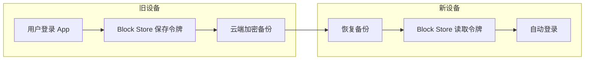
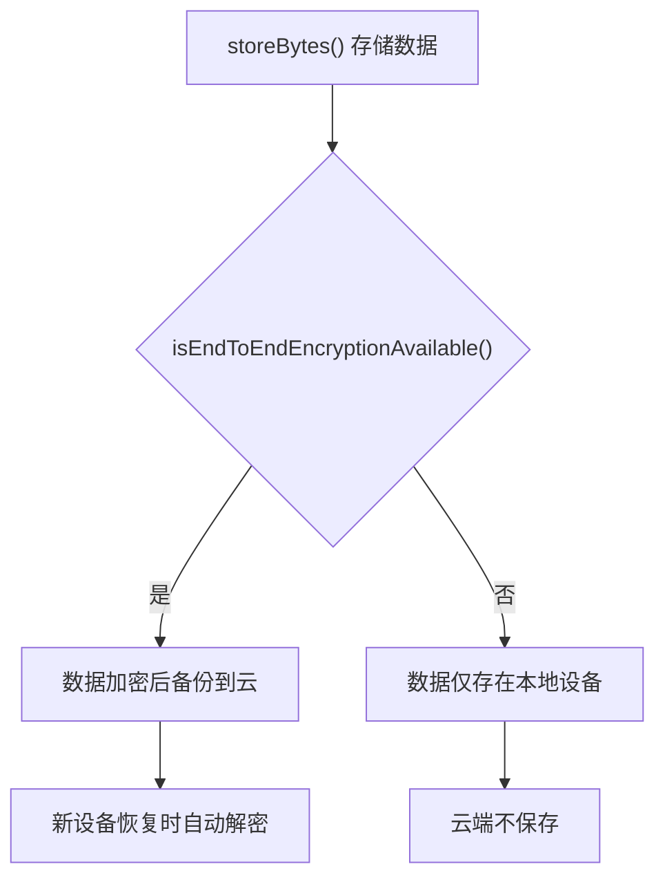
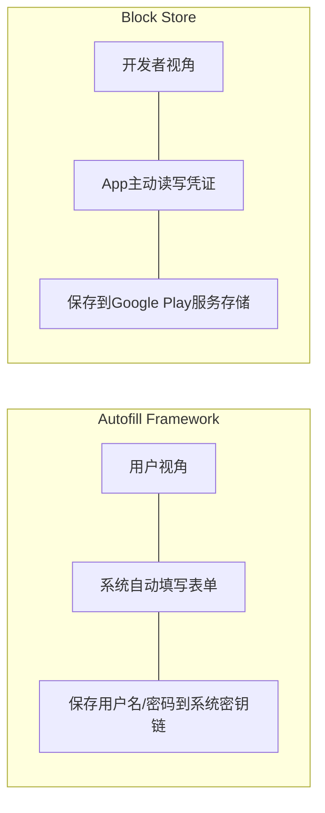
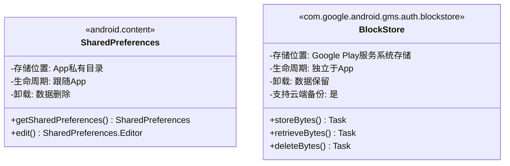
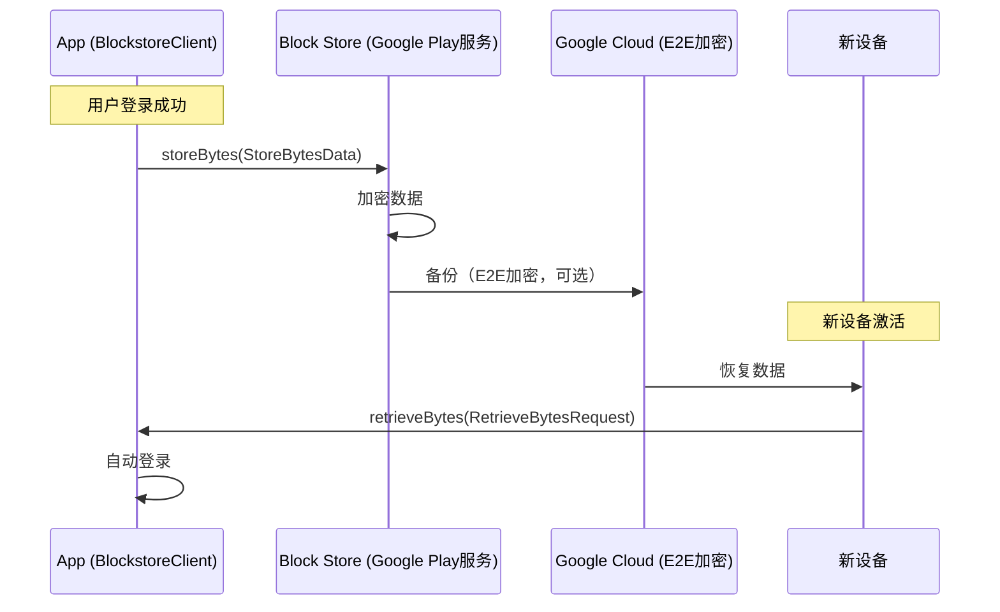

# 3.1.6 Block Store

希尔的手指在屏幕上一划，模拟着新手机激活的场景。

"好了，你们看——"她把平板转过来给大家看，"这是用户第一天拿到新手机的样子。"

屏幕上是一个干干净净的Android设置界面，壁纸是一片淡蓝色的天空。

"然后呢，他打开营地App——"希尔点了点那个图标，"然后？"

屏幕上弹出一个登录界面。用户名字段是空的。密码字段也是空的。

"什么都没有了。"希尔说，"一！切！都！没！有！了！"

她用夸张的语气强调着，拍了拍平板的边框。

洛芙张了张嘴。

她本来想说点什么，但是一阵午后的热风吹过来，把她想说的话连同那点困意一起吹散了。湖面上的光斑正在缓慢地变化着角度，从银白色慢慢变成淡金色，像是有人在水面下点燃了一盏小小的灯。

"……但如果用户之前用Autofill保存过账号密码呢？"洛芙还是问出了她的疑惑，"Autofill不是会自动填充吗？"

"Autofill救不了这种情况。"黛琳摇了摇头，"你想啊，换了新手机之后，Autofill的数据也存在旧设备上啊。除非他做了完整备份，否则……"

"否则就要从头再来。"希尔接话，"重新注册、重新验证邮箱、重新设置头像——用户体验直接归零。"

"好残忍。"伊莎轻声说。她正在用一根草茎逗一只不知道从哪里飞来的蚱蜢，那只蚱蜢跳了两下，飞走了。

希尔把平板往桌子上一放。"所以这就是Block Store要解决的问题。"

"Block什么？"洛芙问。

"Block Store。"黛琳重复了一遍，"块存储。不是那种存文件的块存储——是Google Play服务提供的一种凭证存储API。"

"凭证存储？"洛芙的眼睛微微眯起来，"就像……我们之前学的Autofill？"

"有点像，但完全不一样。"黛琳从她的背包里掏出她的笔记本，翻到一页白板，"Autofill是帮用户填表单，Block Store是帮App存凭证。而且——"

她拿起白板笔，在纸上画了一个简单的图：



"看这个流程。"黛琳指着图解释，"当用户登录App的时候，我们把认证令牌存到Block Store。Block Store会自动把它加密备份到Google云端——注意，是端到端加密，只有Google能解密，但Google不会看内容。"

"端到端加密？"洛芙问。

"就是只有发送方和接收方能看到内容，中间任何人——包括Google——都看不到。"黛琳解释道，"就像你把一封信锁在盒子里，邮递员只能帮你运盒子，打不开锁。"

"哦哦……"洛芙点头，"那换新手机之后呢？"

"新手机激活的时候，用户登录他的Google账号，Block Store就会自动把之前备份的凭证拉下来。然后App读取出来，用户就直接登录了。"

"无缝衔接！"希尔拍了拍手，"用户甚至不知道自己从哪里获取的凭证，只会觉得'诶，我没退出过登录啊'。"

洛芙的蚱蜢不知道什么时候又飞回来了，落在她的膝盖上，她小心翼翼地用手指戳了戳。

"但这和SharedPreferences存Token有什么区别？"她问，"我之前做项目就是用SharedPreferences存的啊。"

黛琳笑了。"这是一个很好的问题。SharedPreferences的问题是——"

"重装App就没了！"希尔抢答，"SharedPreferences存在应用私有目录里，你卸载App的时候它就一起被删了。Block Store存在Google Play服务的系统级存储里，不随App删除。"

"而且Block Store的存储空间很小。"黛琳补充，"只有16个key-value对，每个value最大也就几十KB。所以它不是用来存大量数据的——只存最重要的东西，比如认证令牌。"

"那能存什么？"洛芙问。

"字节数组。"黛琳说，"ByteArray。所以理论上你想存什么都可以——只要你把它序列化/反序列化。但实际上最典型的用法就是存Token。"

希尔已经开始在电脑上敲代码了。

"我直接给你们看代码吧——"

她把屏幕转过来，午后的阳光在屏幕上反射出一片淡淡的白色。

```kotlin
// build.gradle 添加依赖
// implementation "com.google.android.gms:play-services-auth-blockstore:16.1.0"

import com.google.android.gms.auth.blockstore.Blockstore
import com.google.android.gms.auth.blockstore.BlockstoreClient
import com.google.android.gms.auth.blockstore.StoreBytesData
import com.google.android.gms.auth.blockstore.RetrieveBytesRequest
import com.google.android.gms.auth.blockstore.DeleteBytesRequest
import com.google.android.gms.auth.blockstore.RetrieveBytesResponse

class AuthManager(private val context: Context) {

    private val blockstoreClient: BlockstoreClient by lazy {
        Blockstore.getClient(context)
    }

    // 保存认证令牌到Block Store
    fun saveAuthToken(token: String, onComplete: (Boolean) -> Unit) {
        val tokenBytes = token.toByteArray(Charsets.UTF_8)

        // 设置是否需要云端备份（需要E2E加密可用）
        val storeBytesDataBuilder = StoreBytesData.Builder()
            .setBytes(tokenBytes)
            .setShouldBackUpToCloud(true) // 启用云端备份，换机能恢复

        val storeBytesData = storeBytesDataBuilder.build()

        blockstoreClient.storeBytes(storeBytesData)
            .addOnSuccessListener {
                Log.d(TAG, "Token saved to Block Store")
                onComplete(true)
            }
            .addOnFailureListener { e ->
                Log.e(TAG, "Failed to save token", e)
                onComplete(false)
            }
    }

    // 从Block Store读取认证令牌
    fun retrieveAuthToken(onComplete: (String?) -> Unit) {
        // 指定要读取的key，设置为DEFAULT_BYTES_DATA_KEY读取默认key的数据
        val retrieveBytesRequest = RetrieveBytesRequest.Builder()
            .setKeys(listOf(BlockstoreClient.DEFAULT_BYTES_DATA_KEY))
            .build()

        blockstoreClient.retrieveBytes(retrieveBytesRequest)
            .addOnSuccessListener { response: RetrieveBytesResponse ->
                val bytes = response.getData().getOrDefault(
                    BlockstoreClient.DEFAULT_BYTES_DATA_KEY, null
                )
                if (bytes != null) {
                    val token = String(bytes, Charsets.UTF_8)
                    Log.d(TAG, "Token retrieved from Block Store")
                    onComplete(token)
                } else {
                    Log.d(TAG, "No token found in Block Store")
                    onComplete(null)
                }
            }
            .addOnFailureListener { e ->
                Log.e(TAG, "Failed to retrieve token", e)
                onComplete(null)
            }
    }

    // 删除存储的令牌（登出时调用）
    fun deleteAuthToken(onComplete: (Boolean) -> Unit) {
        val deleteBytesRequest = DeleteBytesRequest.Builder()
            .setKeys(listOf(BlockstoreClient.DEFAULT_BYTES_DATA_KEY))
            .build()

        blockstoreClient.deleteBytes(deleteBytesRequest)
            .addOnSuccessListener {
                Log.d(TAG, "Token deleted from Block Store")
                onComplete(true)
            }
            .addOnFailureListener { e ->
                Log.e(TAG, "Failed to delete token", e)
                onComplete(false)
            }
    }

    companion object {
        private const val TAG = "AuthManager"
    }
}
```

"代码逻辑其实很简单。"希尔指着屏幕，"三个操作——存、读、删。"

"这个DEFAULT_BYTES_DATA_KEY是什么？"洛芙问。

"默认的key。"黛琳解释道，"Block Store支持存16组不同的数据，每组有一个key。如果不指定key，就用这个默认值。"

"那如果我想存多个不同的数据呢？"洛芙继续问。

"用不同的key区分就行了。比如——"

希尔在代码里又加了一段：

```kotlin
// 用自定义key存储多个数据
fun saveRefreshToken(token: String) {
    val tokenBytes = token.toByteArray(Charsets.UTF_8)
    val storeBytesData = StoreBytesData.Builder()
        .setBytes(tokenBytes)
        .setKey("refresh_token") // 自定义key
        .setShouldBackUpToCloud(true)
        .build()

    blockstoreClient.storeBytes(storeBytesData)
}

// 读取时也要指定对应的key
fun retrieveRefreshToken(onComplete: (String?) -> Unit) {
    val retrieveBytesRequest = RetrieveBytesRequest.Builder()
        .setKeys(listOf("refresh_token"))
        .build()

    blockstoreClient.retrieveBytes(retrieveBytesRequest)
        .addOnSuccessListener { response ->
            val bytes = response.getData().getOrDefault("refresh_token", null)
            if (bytes != null) {
                onComplete(String(bytes, Charsets.UTF_8))
            } else {
                onComplete(null)
            }
        }
        .addOnFailureListener {
            onComplete(null)
        }
}
```

"看到了吗？"希尔说，"用不同的key，可以存access_token、refresh_token、user_id……想存什么存什么。"

洛芙若有所思地点点头。

她低头看了一眼膝盖上——那只蚱蜢已经不见了，不知道什么时候跳走了。

"那……加密是怎么回事？"她问，"怎么知道能不能用端到端加密？"

"这个也很简单。"

黛琳在白板上又画了一个简单的流程图：



"存储之前可以先检查一下E2E加密是否可用。"黛琳说，"条件是：设备系统版本Android 9以上，且设备设置了锁屏密码、图案锁或指纹。"

"为什么要有这个条件？"洛芙问。

"因为端到端加密需要一把钥匙。"黛琳解释道，"这把钥匙和设备的锁屏密码绑定。如果没有锁屏密码，钥匙就没有载体，加密就没有意义。"

"原来如此……"洛芙点头。

希尔已经开始写检测代码了。

```kotlin
// 检查E2E加密是否可用
fun checkE2EEncryptionAvailable(onResult: (Boolean) -> Unit) {
    blockstoreClient.isEndToEndEncryptionAvailable
        .addOnSuccessListener { available ->
            Log.d(TAG, "E2E encryption available: $available")
            onResult(available)
        }
        .addOnFailureListener {
            Log.e(TAG, "Failed to check E2E encryption availability")
            onResult(false)
        }
}

// 更好的存储实践：先检查再决定是否云端备份
fun smartSaveToken(token: String, onComplete: (Boolean) -> Unit) {
    blockstoreClient.isEndToEndEncryptionAvailable
        .addOnSuccessListener { available ->
            val tokenBytes = token.toByteArray(Charsets.UTF_8)
            val storeBytesData = StoreBytesData.Builder()
                .setBytes(tokenBytes)
                .setShouldBackUpToCloud(available) // 根据条件决定是否云端备份
                .build()

            blockstoreClient.storeBytes(storeBytesData)
                .addOnSuccessListener { onComplete(true) }
                .addOnFailureListener { onComplete(false) }
        }
        .addOnFailureListener { onComplete(false) }
}
```

"这里的核心思想是——"黛琳看着希尔敲代码，"安全性和用户体验要平衡。如果设备不支持E2E加密，强行云端备份反而有安全风险。"

"但如果不备份，换手机就恢复不了。"洛芙说。

"对，这是一个权衡。"黛琳点头，"Google的推荐做法是：优先使用E2E加密备份，但如果设备不支持，就本地存储。这样至少App卸载重装还能恢复，云端同步就……"

"就靠用户自己手动备份了。"希尔接话，"比如用设备到设备的传输。"

伊莎一直在旁边听着，这时她轻声说："这就像是……把贵重物品存到保险箱里。"

大家都看向她。

"如果家里有保险箱，指纹识别能开，那就把东西放进去，即使出门在外也能远程查看。"伊莎说，"但如果家里没有保险箱呢？东西就只能放在自己身上——丢了就是丢了。"

"伊莎的比喻总是这么……"希尔想了想，"诗情画意。"

"但很准确。"黛琳笑了。

洛芙也在笑。她抬头看了看天空——午后的云正在慢慢地从白色变成淡金色，像是有人在天空中涂了一层蜂蜜。

"那我有个问题。"她说，"Autofill和Block Store有什么区别？我感觉都是存凭证的。"

"这是两个完全不同的系统，服务的对象不一样。"黛琳说，"Autofill是Android系统级别的功能，服务对象是用户——帮用户自动填表单。Block Store是App级别的API，服务对象是开发者——帮App保存和恢复登录状态。"

她在白板上画了一个对比图：



"Autofill是用户主动保存，下次系统主动填。"黛琳解释道，"Block Store是App主动存，App主动读。触发时机完全由App控制。"

"而且Autofill存的是用户名密码，Block Store存的是Token。"希尔补充，"Token是服务器生成的，用户名密码是用户输入的。"

"Token更长、更复杂，也更安全。"黛琳说，"所以如果你有自己的后端服务，用Block Store存Token是最合适的做法。"

"那如果是纯前端App呢？"洛芙问，"没有自己的服务器？"

"那种情况下，Autofill更合适。"黛琳说，"因为你要依赖系统来保存用户输入的凭证。"

洛芙在脑子里默默地整理着这个逻辑。

一只蜻蜓飞过来，在桌面上停留了一秒，又飞走了。

"我大概懂了……"她说，"Autofill是系统帮你管，Block Store是App自己管。"

"对，就是这样。"

"那Block Store和SharedPreferences比呢？"洛芙继续问，"你刚才说SharedPreferences卸载App会丢，Block Store不会——但它们都是存Key-Value数据，有什么本质区别？"

"本质区别在于存储位置和生命周期。"黛琳说，"SharedPreferences存在App的私有目录，重装或卸载会丢失。Block Store存在Google Play服务里，App卸载不删除，云端备份永不丢失。"



"还有一点区别。"希尔说，"SharedPreferences可以存任何基本类型——int、boolean、String、Set<String>……但Block Store只存ByteArray。所有数据都要先序列化成字节数组。"

"这其实是好事。"黛琳说，"强制了你只能存小数据——Token、ID之类的。不会有人傻乎乎地往里存一整个用户数据库。"

"从源头防止了乱用。"伊莎轻声说。

"对。"

洛芙伸了个懒腰。

午后的阳光又斜了一些，湖面上的光斑已经变成了温暖的橙金色。风从湖面上吹过来，带着一点点水气和凉意，把之前那种慵懒的困意吹散了一些。

"那……我们在营地注册App里用上这个？"她问。

"当然要用。"希尔已经开始在她的项目里添加依赖了，"用户辛辛苦苦注册的账号，换个手机就没了——这也太残忍了。"

"而且营地App的核心就是账号体系。"黛琳说，"用户要记录自己的营地、装备、日记——这些都绑在账号上。如果换手机就全丢了，用户会骂死我们的。"

"我们还不会被骂。"伊莎轻声说，"但用户会生气。"

"生气比被骂更糟糕。"希尔说，"被骂了至少还有互动，生气就直接卸载了。"

她把电脑转过来，开始演示完整的登录流程：

```kotlin
class LoginActivity : AppCompatActivity() {

    private lateinit var authManager: AuthManager

    override fun onCreate(savedInstanceState: Bundle?) {
        super.onCreate(savedInstanceState)
        setContentView(R.layout.activity_login)

        authManager = AuthManager(this)

        // 检查是否已有保存的Token
        checkExistingToken()
    }

    private fun checkExistingToken() {
        authManager.retrieveAuthToken { token ->
            if (token != null) {
                // 有Token，尝试自动登录
                Log.d(TAG, "Found saved token, attempting auto login...")
                attemptAutoLogin(token)
            } else {
                // 没有Token，显示登录界面
                Log.d(TAG, "No saved token, showing login form...")
                showLoginForm()
            }
        }
    }

    private fun attemptAutoLogin(token: String) {
        // 调用后端API验证Token
        api.verifyToken(token)
            .enqueue(object : Callback<LoginResponse> {
                override fun onResponse(call: Call<LoginResponse>, response: Response<LoginResponse>) {
                    if (response.isSuccessful) {
                        // Token有效，直接进入主页
                        Log.d(TAG, "Auto login successful!")
                        navigateToMain()
                    } else {
                        // Token失效，清除并显示登录界面
                        Log.d(TAG, "Token invalid, clearing and showing form")
                        authManager.deleteAuthToken { }
                        showLoginForm()
                    }
                }

                override fun onFailure(call: Call<LoginResponse>, t: Throwable) {
                    Log.e(TAG, "Auto login failed", t)
                    showLoginForm()
                }
            })
    }

    private fun showLoginForm() {
        // 显示正常的登录表单
    }

    private fun navigateToMain() {
        // 跳转到主页
    }

    fun onLoginSuccess(token: String) {
        // 登录成功后保存Token
        authManager.saveAuthToken(token) { success ->
            if (success) {
                Log.d(TAG, "Token saved successfully")
            } else {
                Log.w(TAG, "Token save failed, but login succeeded")
            }
        }
        navigateToMain()
    }

    fun onLogout() {
        // 登出时删除Token
        authManager.deleteAuthToken { success ->
            Log.d(TAG, "Logout completed")
        }
    }

    companion object {
        private const val TAG = "LoginActivity"
    }
}
```

"看到了吗？"希尔指着代码，"核心逻辑很简单——App启动时先读Block Store，有Token就试着自动登录，没有就显示登录表单。登录成功就存Token。"

"那我有个问题。"洛芙说，"如果用户没有Google账号呢？"

"Block Store是Google Play服务的一部分。"黛琳说，"没有Google账号意味着没有Play服务，那就用不了Block Store。这种情况下fallback到SharedPreferences或者自己实现备份。"

"而且Play服务在国外的覆盖率也不是100%。"希尔补充，"所以Block Store适合作为首选方案，但App本身也要有兜底的本地存储策略。"

"不能把所有鸡蛋放一个篮子里。"伊莎说。

"对。"

黛琳把白板笔放下，活动了一下手腕。阳光在白板上留下了一道淡淡的光斑。

"总结一下Block Store的特点。"她说，"第一，Google Play服务提供的凭证存储API。第二，只存ByteArray，最多16组key-value。第三，重装App或换手机都能恢复，云端备份端到端加密。第四，需要设备有锁屏密码才能启用云端备份。"

"第五——"希尔补充，"最适合的场景是保存认证Token，实现换手机自动登录。"

"第六——"伊莎轻声说，"让用户少输一次密码，用户体验提升一大截。"

"第七——"洛芙说，"再也不会因为换手机导致用户流失了。"

"对！"

大家对视了一眼，都笑了起来。

湖面上的光斑已经从橙金色慢慢变成了淡紫色，傍晚快要来了。

"那我们今天的营地App原型就完整了。"希尔满意地在键盘上敲了敲，"注册登录有Autofill，账号保存有Block Store。"

"希尔姐姐好厉害！"洛芙由衷地说。

"是我们一起厉害。"希尔笑着说，"不过——你要不要自己试着集成一下Block Store？"

洛芙的眼睛亮了一下。"我可以吗？"

"当然可以。"黛琳说，"就按我们刚才讲的，先存一个Token，再读出来，最后删掉——完整的CRUD流程。"

"CRUD？"洛芙问。

"Create、Read、Update、Delete。"希尔解释道，"存、读、改、删。基本的存储操作。"

"哦哦，我懂了！"洛芙点头，"那我现在就试试！"

她从希尔手里接过电脑，开始在自己的营地App项目里添加依赖。

午后的风吹过来，带着湖水和青草混合的气息。远处的山在夕阳的映照下变成了一道深蓝色的剪影，云层被染成了淡淡的橙红色，像是有人在天空中点燃了一场无声的火焰。

洛芙专注地盯着屏幕，手指在键盘上飞快地敲击着。黛琳在旁边轻声指导着，希尔在调试她的平板，伊莎则靠在椅子上，看着天空中慢慢显现的第一颗星星。

这是初夏的午后，湖畔的露营编程旅团，正在一点一点地把她们的梦想变成现实。

---

## 专业技术总结

> Block Store 是 Google Play 服务提供的凭证管理 API，用于安全存储认证令牌等敏感数据，支持在设备间云端备份与恢复，即使 App 卸载或设备更换也能保留登录状态。

#### 结构图



#### 复杂度与影响

- **存储限制**：最多 16 组 key-value，每组 value 建议控制在几十 KB 以内
- **网络依赖**：云端恢复需要网络连接；本地读取则不需要
- **安全级别**：E2E 加密（Android 9+ 且设备有锁屏密码），否则仅本地存储
- **兼容性**：需要 Google Play 服务，中国大陆市场设备可能不支持

#### 反模式与陷阱

| 错误做法 | 正确做法 |
|---------|---------|
| 直接存明文Token或用户密码 | 只存服务端颁发的Token，不存原始密码 |
| 不检查E2E加密可用性直接开启云端备份 | 先调用isEndToEndEncryptionAvailable判断，再决定是否备份 |
| 在Block Store里存大量数据（如用户资料JSON） | 只存Token等关键凭证，大数据放服务器或Room数据库 |
| 不处理Token过期/失效的情况 | 读取Token后要调用API验证有效性，失效则清除并引导重新登录 |
| 忽略Play服务不可用的情况 | 实现fallback策略：SharedPreferences本地存储或提示用户 |

#### 设计哲学

**信任链与最小权限原则**：Block Store 将凭证存储与 App 自身隔离，App 不直接持有凭证明文，只通过 API 读写。这种设计确保即使 App 被恶意应用劫持，也无法直接获取用户密码。同时，云端备份的 E2E 加密保证了即使 Google 服务器被攻破，攻击者也无法解密用户数据。核心思想是：**安全不是靠隐藏算法，而是靠分离信任边界和最小化密钥暴露**。

---

#### 🏕️ 动手练习

**目标**：在 Android 项目中集成 Block Store API，实现认证令牌的保存、读取、删除和云端恢复功能。

**你需要做的事**：

1. **新建 Android 项目**（或使用现有营地注册 App 项目），配置 Kotlin DSL：
   ```kotlin
   // settings.gradle.kts
   dependencyResolutionManagement {
       repositories {
           google()
           mavenCentral()
       }
   }
   
   // build.gradle.kts (app)
   dependencies {
       implementation("com.google.android.gms:play-services-auth-blockstore:16.1.0")
   }
   ```

2. **创建 AuthManager 类**，包含以下方法：
   - `saveAuthToken(token: String, shouldBackup: Boolean)` — 保存 Token
   - `retrieveAuthToken()` — 读取 Token，返回 `String?`
   - `deleteAuthToken()` — 删除 Token
   - `checkE2EAvailable()` — 检查云端加密是否可用

3. **实现 LoginActivity**，在 `onCreate` 中调用 `retrieveAuthToken()`，有 Token 则尝试自动登录，无 Token 则显示登录表单。

4. **登录成功后**调用 `saveAuthToken()` 保存 Token。

5. **登出时**调用 `deleteAuthToken()` 清除 Token。

6. **尝试导出安装包**到另一台 Android 设备（或模拟器），验证换设备后 Token 是否能恢复。

**验收标准**：
- [ ] 添加了正确的 play-services-auth-blockstore 依赖，Gradle 同步无报错
- [ ] AuthManager 三个方法（存/读/删）均返回 `Task`，使用 `addOnSuccessListener` 和 `addOnFailureListener` 处理结果
- [ ] `saveAuthToken` 使用 `StoreBytesData.Builder().setBytes().setShouldBackUpToCloud().build()`
- [ ] `retrieveAuthToken` 使用 `RetrieveBytesRequest.Builder().setKeys(listOf(...)).build()`
- [ ] LoginActivity 在 `onCreate` 时自动检查并尝试恢复 Token
- [ ] Token 保存和读取流程在 Logcat 中有对应的 `Log.d(TAG, ...)` 输出

**提示代码**：
```kotlin
// AuthManager.kt 骨架
class AuthManager(private val context: Context) {
    private val client: BlockstoreClient = Blockstore.getClient(context)

    fun saveAuthToken(token: String, shouldBackup: Boolean = true) {
        val data = StoreBytesData.Builder()
            .setBytes(token.toByteArray(Charsets.UTF_8))
            .setShouldBackUpToCloud(shouldBackup)
            .build()
        client.storeBytes(data).addOnSuccessListener {
            Log.d(TAG, "Saved")
        }
    }

    fun retrieveAuthToken(callback: (String?) -> Unit) {
        val request = RetrieveBytesRequest.Builder()
            .setKeys(listOf(BlockstoreClient.DEFAULT_BYTES_DATA_KEY))
            .build()
        client.retrieveBytes(request).addOnSuccessListener { resp ->
            val bytes = resp.data[BlockstoreClient.DEFAULT_BYTES_DATA_KEY]
            callback(bytes?.let { String(it, Charsets.UTF_8) })
        }.addOnFailureListener {
            callback(null)
        }
    }

    fun deleteAuthToken() {
        val request = DeleteBytesRequest.Builder()
            .setKeys(listOf(BlockstoreClient.DEFAULT_BYTES_DATA_KEY))
            .build()
        client.deleteBytes(request)
    }

    companion object { private const val TAG = "AuthManager" }
}
```

#### 参考实现要点

1. **始终优先使用 Block Store 存 Token**，比 SharedPreferences 更安全且不随 App 删除而丢失
2. **Token 验证不能省略**：读取到 Token 后必须调用后端 API 验证有效性，过期或被吊销的 Token 要清除并引导重新登录
3. **E2E 加密条件判断**：只有设备支持时才能安全云端备份，否则fallback到本地存储并提示用户手动备份
4. **登出时必须删除 Token**：否则换设备后旧 Token 仍可被恢复，存在安全隐患
5. **多 Token 管理**：用不同 key 区分 access_token、refresh_token 等，做好版本兼容

---

> 学习建议：Block Store 是现代 Android 认证体系的重要组成，建议配合 Credential Manager（统一认证框架）一起学习，理解从密码管理到 Token 管理的完整演进路径。

## 洛芙的小小日记本

今天学到了Block Store！换手机不会丢登录状态了——黛琳说这是Google Play服务提供的凭证存储，希尔说是Token管理的最佳拍档。伊莎说就像是保险箱，有锁屏就能远程查看贵重物品。我觉得……这是对用户的一种温柔吧，不用每次换手机都重新登录，不用记住那些复杂的密码。虽然还不太懂E2E加密是怎么回事，但下次一定要弄清楚！加油！

## 今日关键词

**Block Store**：Google Play 服务提供的凭证存储 API，可安全保存最多 16 组 ByteArray 数据，支持云端加密备份，换设备可恢复

**StoreBytesData**：Block Store 存储数据的载体类，包含字节数组、key 名称、是否云端备份等配置，通过 Builder 模式构建

**RetrieveBytesRequest**：从 Block Store 读取数据的请求类，可指定要读取的 key 列表，或读取所有数据

**DeleteBytesRequest**：从 Block Store 删除数据的请求类，指定要删除的 key 列表即可

**DEFAULT_BYTES_DATA_KEY**：Block Store 的默认 key 名称，不指定 key 时使用此默认值

**isEndToEndEncryptionAvailable()**：检查设备是否支持云端端到端加密的前置条件：Android 9+ 且设备有锁屏密码/图案/指纹

**setShouldBackUpToCloud(boolean)**：StoreBytesData 的配置项，设为 true 时启用云端加密备份（需 E2E 加密可用）

**Token**：服务端颁发的认证凭证，通常是长字符串，比用户输入的密码更安全、更适合程序化处理

**Google Play 服务**：Google 提供的系统级服务和 API，包括 Block Store、Credential Manager、Auth 等组件

**端到端加密（E2E Encryption）**：加密方式的一种，数据在发送方加密、接收方解密，中间节点（包括服务提供商）无法解密

**fallback**：降级策略，当前方案不可用时使用的替代方案，如 Block Store 不可用时 fallback 到 SharedPreferences
