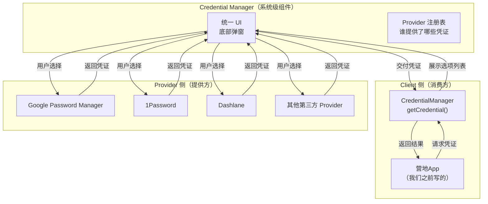
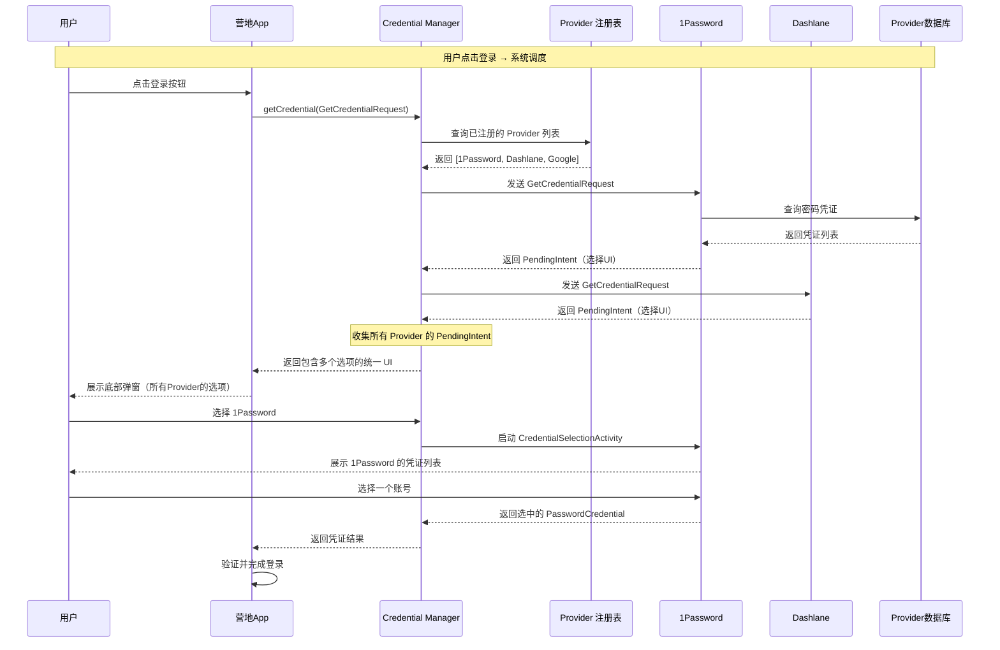
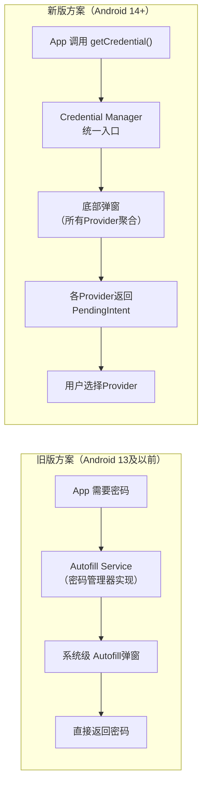
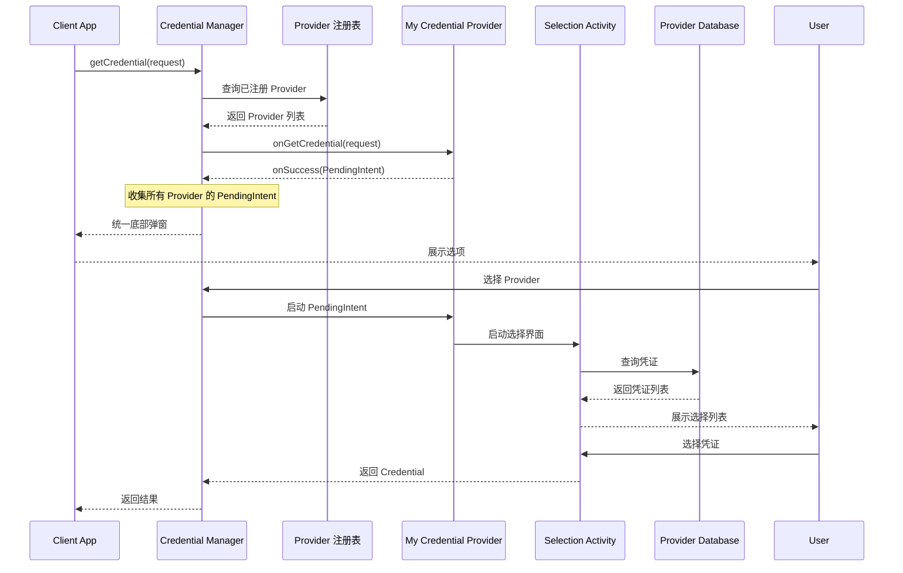

# 3.1.7 关于凭证管理器

暮色正在湖面上一点点地铺开。

最后那抹橙红色还挂在天边，像一条正在被稀释的颜料带，慢慢地淡成了灰紫色。远处的山已经只剩下一道模糊的轮廓，黛琳说那是富士山最后的余韵——不是，她说错了，那是她小时候看过的绘本里的插画。不过洛芙没有纠正她，因为她自己也记不太清了。

萤火虫是伊莎第一个发现的。

就在她们继续讨论营地App的时候，不远处的草丛里突然亮起了几点微弱的绿色荧光，一闪一闪的，像是有人在地上撒了一把碎星星。

"萤火虫！"伊莎轻声叫了出来，眼睛里映着那些微弱的光点，"好久了……好久没见过萤火虫了。"

希尔抬起头，顺着伊莎的目光看过去。"嗯……初夏了嘛。"她说，"这个季节它们就出来了。"

洛芙也凑过去看。她从来没见过萤火虫——城市里没有这种东西。她盯着那些小小的光点，心里涌起一种奇怪的感觉，好像那些光是活的，会呼吸，会说话。

"它们在找同伴。"伊莎说，"萤火虫的光是一种暗号，每一种萤火虫闪的频率不一样，它们靠这个认出自己的同类。"

"暗号……"黛琳重复了一遍这个词，然后她突然轻轻拍了一下桌子，"我刚才想说的问题——关于Credential Manager的另外一面——就是这个！"

"哪一面？"洛芙问。

"暗号的一面。"黛琳说，"我们之前学的都是Credential Manager怎么帮App'读'凭证——密码、通行密钥、Google登录。但Credential Manager还有一个完全不同的用法——让第三方App来'提供'凭证。"

希尔把视线从萤火虫那里收回来，若有所思地看着黛琳。

"你是说……像1Password那样的东西？"她问，"我之前在Android官网上看到过，说1Password、Dashlane这些密码管理器也可以接入Credential Manager——"

"对。"黛琳点头，"1Password不是一个普通的App，它是一个凭证提供者——Credential Provider。当用户打开任何一个接入了Credential Manager的App，点登录的时候，那个底部弹窗里不只有Google Password Manager的选项，还会有1Password。"

"因为1Password也实现了Provider的API？"洛芙问。

"没错。"黛琳说，"这就是Credential Manager最有趣的地方——它是一个双向的架构。Client侧我们学过了，现在学Provider侧。"

萤火虫又闪了几下，在暮色里显得格外明亮。洛芙盯着那些光点看了一会儿，然后把目光收回到黛琳的白板上。

"双向架构……"她重复了一遍这个词，"就像萤火虫——1Password发出自己的光（提供凭证），Credential Manager负责传信（统一UI），然后营地App收到暗号（读取凭证）。"

"你理解得很快。"黛琳微笑。

"那怎么实现？"希尔已经打开了电脑，"我想看看Provider侧的代码。"

---

## 一、Credential Manager的双面角色

黛琳在白板上画出了Credential Manager的整体架构：



"这张图把整个架构画得很清楚。"黛琳指着屏幕，"Credential Manager是中间层，上面是各种Provider（Google、1Password等），下面是App。App不需要知道底层有多少个Provider，只需要问Credential Manager'有凭证吗'，剩下的由系统处理。"

"所以我们之前学的getCredential()是Client侧API。"希尔说，"现在要学的是Provider侧的API。"

"对。"黛琳点头，"Provider侧的API是给第三方密码管理器用的——它们通过这个API向系统注册自己的服务，然后Credential Manager在需要的时候会调起它们。"

"那我们自己可以实现一个Provider吗？"洛芙问。

"可以。"黛琳说，"只要你愿意——比如你公司的账号体系想开放给其他App用。"

"这个……好像很少见？"洛芙歪着头想了想。

"确实不常见。"希尔说，"主要是大公司会这么做——Google、微软、1Password。但理解它的工作原理，对理解Credential Manager整体很有帮助。"

---

## 二、成为Provider的前提：BIND_CREDENTIAL_PROVIDER_SERVICE

"要实现一个Credential Provider，第一步是在Manifest里声明一个Service。"希尔打开了她找到的官方文档，"这个Service必须绑定一个特殊的权限——`BIND_CREDENTIAL_PROVIDER_SERVICE`。"

"绑定？"洛芙问。

"这个权限是Android系统级别的。"黛琳解释道，"没有这个权限，你的App只是一个普通的App。有这个权限，系统才会把你的Service当成一个凭证提供者。"

希尔在白板上写出了Manifest声明的骨架：

```xml
<!-- AndroidManifest.xml -->
<!-- Credential Provider 必须在Manifest中声明 -->
<!-- 这个Service会被Credential Manager系统组件发现和调用 -->

<service
    android:name=".MyCredentialProviderService"
    android:label="@string/provider_label"
    android:permission="android.permission.BIND_CREDENTIAL_PROVIDER_SERVICE"
    android:enabled="true"
    android:exported="true">
    <!-- intent-filter 声明这是一个 Credential Provider -->
    <intent-filter>
        <action android:name="android.credentials.provider" />
        <category android:name="android.credentials.provider.CATEGORY" />
    </intent-filter>

    <!-- meta-data 声明 Provider 的配置信息 -->
    <meta-data
        android:name="android.credentials.provider"
        android:resource="@xml/provider_config" />
</service>
```

"有几个关键点。"希尔指着代码，"第一是`android:permission`，必须是`BIND_CREDENTIAL_PROVIDER_SERVICE`。这是系统级的权限保护，防止恶意App伪装成Provider。"

"第二是`intent-filter`里的`action`。"黛琳说，"`android.credentials.provider`这个action是Android 14新增的，只有声明了这个filter的Service才会被Credential Manager识别。"

"第三是`meta-data`引用了一个XML配置文件。"希尔说，"这个文件里会声明这个Provider支持哪些凭证类型——密码、通行密钥，还是其他。"

洛芙认真地听着，眼睛盯着代码。

"所以……系统怎么知道哪些App是Provider？"她问。

"系统有一个Provider注册表。"黛琳说，"当App安装的时候，系统会检查Manifest里有没有声明`BIND_CREDENTIAL_PROVIDER_SERVICE`权限的Service。如果有，就把这个App加入注册表。"

"Credential Manager在启动底部弹窗的时候，就会查询这个注册表，把所有可用的Provider都列出来。"希尔补充。

"就像萤火虫的光——"伊莎说，"每只萤火虫都会发光，系统负责收集所有的光，然后告诉用户'这里有这些萤火虫'。"

"比喻不错。"希尔说，"但萤火虫是被动的——它们只是发光。Provider是主动的——它们提供凭证。"

---

## 三、Provider的实现骨架

"现在来看Provider Service的核心代码。"希尔打开了她准备的代码文件，"这个Service需要继承`CredentialProviderService`，然后实现几个关键方法。"

```kotlin
// MyCredentialProviderService.kt
// Credential Provider 的核心服务类
// 当用户在另一个App里点击"获取凭证"时，系统会调起这个Service

import android.service.credentials.CredentialProviderService
import android.service.credentials.CredentialProviderService as CPS
import android.app.PendingIntent
import android.content.Intent
import android.util.Log

class MyCredentialProviderService : CredentialProviderService() {

    companion object {
        private const val TAG = "MyCredentialProvider"
    }

    // 当系统需要这个Provider返回凭证时，会调用这个方法
    // request 是来自客户端的请求，里面有请求的凭证类型、origin信息等
    override fun onGetCredential(
        request: GetCredentialRequest,
        cancellationSignal: CancellationSignal,
        callback: Callback
    ) {
        Log.d(TAG, "onGetCredential called with request: $request")

        // 从request中获取请求的凭证类型
        val credentialOptions = request.credentialOptions

        // 检查origin是否合法（安全验证，后面会详细讲）
        val originApp = request.callingAppInfo
        if (originApp != null) {
            Log.d(TAG, "Request from: ${originApp.packageName}")
        }

        // 构建响应：这个方法需要返回一个PendingIntent
        // PendingIntent会触发一个Activity，让用户选择要返回哪个凭证
        val pendingIntent = createCredentialSelectionIntent(
            /* intent: 要启动的Activity的Intent */
            Intent(this, CredentialSelectionActivity::class.java),
            /* title: 选择界面的标题 */
            "选择 1Camp 账号",
            /* subtitle: 子标题 */
            "选择一个保存的账号登录",
            /* allowPickerOnly: 是否只允许使用内置选择器 */
            false
        )

        // 通过callback返回pendingIntent
        // 系统会启动这个PendingIntent，用户在里面选择凭证
        callback.onSuccess(pendingIntent)
    }

    // 当用户在其他App里创建新凭证时（如注册新账号），会调用这个方法
    // Provider可以在这里展示UI让用户保存新的凭证
    override fun onCreateCredential(
        request: CreateCredentialRequest,
        cancellationSignal: CancellationSignal,
        callback: Callback
    ) {
        Log.d(TAG, "onCreateCredential called")

        // 构建创建凭证的UI
        val pendingIntent = createCredentialCreationIntent(
            Intent(this, CredentialSaveActivity::class.java),
            "保存到 1Camp",
            "为这个网站保存新的凭证"
        )

        callback.onSuccess(pendingIntent)
    }
}
```

"这段代码展示了Provider的两个核心回调。"黛琳指着屏幕，"`onGetCredential`是用户要从Provider获取凭证时调用——比如用户在营地App里点登录，营地App向Credential Manager请求密码，Credential Manager调起1Password，1Password的`onGetCredential`就被调用了。"

"`onCreateCredential`是用户要在Provider里保存新凭证时调用——比如用户在营地App里注册了新账号，营地App想把这个凭证保存到1Password，这个回调就会被调用。"

"所以Provider不是被动地等待请求，"洛芙说，"它是主动提供UI，让用户选择或者保存。"

"对。"黛琳点头，"Provider的职责是管理凭证的存储和展示，Credential Manager负责把它们统一到同一个UI里。"

---

## 四、安全验证：CallingAppInfo与origin检查

"等等。"洛芙突然说，"刚才那段代码里，我看到一个`request.callingAppInfo`——这个是什么？"

"这是一个非常重要的安全机制。"黛琳的表情变得认真起来，"Provider在返回凭证之前，必须验证请求来自哪个App。"

"为什么要验证？"洛芙问。

"防止凭证被滥用。"希尔说，"比如恶意App伪装成登录界面，实际上是想获取用户在1Password里保存的银行密码。如果不验证origin，恶意App就能拿到所有保存的凭证。"

"所以Provider必须检查——请求我凭证的App是不是合法的？"洛芙说。

"对。"黛琳点头，"`callingAppInfo`里包含了请求者的包名、签名、origin等信息。Provider应该根据这些信息判断是否应该返回凭证。"

希尔打开了她找到的官方文档，里面有一段关于安全验证的说明：

```kotlin
// 安全验证示例
// Provider 必须验证请求者的身份，防止恶意App获取凭证

override fun onGetCredential(
    request: GetCredentialRequest,
    cancellationSignal: CancellationSignal,
    callback: Callback
) {
    val callingAppInfo = request.callingAppInfo

    if (callingAppInfo == null) {
        // 如果没有callingAppInfo，说明请求不是来自普通App
        // 可能是系统调用，直接拒绝
        callback.onFailure()
        return
    }

    // 获取请求的包名
    val packageName = callingAppInfo.packageName
    Log.d(TAG, "Credential request from: $packageName")

    // 获取origin（发起请求的网页或App）
    // origin是RFC 6454定义的统一资源定位符
    // 用于验证请求者是否有权获取这个凭证
    val origin = callingAppInfo.origin
    Log.d(TAG, "Request origin: $origin")

    // 获取请求应用的签名信息
    // 签名是APK的唯一标识，可以用来验证App的真实身份
    val callingAppUid = callingAppInfo.uid
    Log.d(TAG, "Requesting app UID: $callingAppUid")

    // 安全验证策略：白名单检查
    // 只有在白名单里的App才能获取特定类型的凭证
    val allowedApps = listOf(
        "com.example.campapp",
        "com.example.officialpartner"
    )

    if (packageName !in allowedApps) {
        Log.w(TAG, "App not in whitelist, denying credential")
        callback.onFailure(IllegalStateException("App not authorized"))
        return
    }

    // origin验证：如果请求指定了origin，检查它是否匹配
    // 这对于WebView场景特别重要——网页的origin必须和App的包名对应
    if (origin != null) {
        val allowedOrigins = listOf(
            "https://camp.example.com",
            "https://staging.camp.example.com"
        )
        if (origin !in allowedOrigins) {
            Log.w(TAG, "Origin not in whitelist: $origin")
            callback.onFailure(IllegalStateException("Origin not authorized"))
            return
        }
    }

    // 验证通过，继续处理请求
    val pendingIntent = createCredentialSelectionIntent(
        Intent(this, CredentialSelectionActivity::class.java),
        "选择账号",
        "选择一个保存的凭证"
    )
    callback.onSuccess(pendingIntent)
}
```

"这段代码展示了完整的安全验证逻辑。"黛琳说，"首先是`callingAppInfo`的包名检查——只有白名单里的App才能请求凭证。"

"然后是origin检查。"希尔说，"这个特别重要——想象一个场景，用户在Chrome浏览器里打开了一个钓鱼网站，这个网站请求获取1Password的凭证。如果没有origin验证，钓鱼网站也能拿到凭证。"

"加上origin验证之后，只有来自特定域名（`camp.example.com`）的请求才会被接受。"黛琳说，"钓鱼网站用的是自己的域名，一眼就能被识别出来。"

"那UID呢？"洛芙问，"UID是什么？"

"UID是Android系统给每个App分配的唯一标识。"希尔说，"可以用来验证App的真实身份——因为普通App没法伪造UID。"

"这个设计很安全。"伊莎轻声说，"就像萤火虫——只有同类的光才会被同伴识别。Provider只对'正确的光'（origin）做出回应。"

---

## 五、Provider配置XML：声明你的能力

"刚才Manifest里有一个`provider_config`的meta-data。"洛芙说，"那个文件里是什么？"

"那是Provider的配置文件，声明这个Provider支持哪些凭证类型。"希尔打开了那个XML文件：

```xml
<!-- res/xml/provider_config.xml -->
<!-- Provider 配置声明 -->
<!-- 这个文件告诉系统当前Provider支持哪些凭证类型 -->

<credential-provider xmlns:android="http://schemas.android.com/apk/res/android">

    <!-- 是否在所有App的登录界面显示这个Provider -->
    <!-- true: 用户可以在任何App的登录界面看到这个Provider -->
    <!-- false: 只在用户主动从设置里添加后才显示 -->
    <qualification
        android:usesForSemanticFilter="true"
        android:isPrimary="false" />

    <!-- 声明支持的凭证类型 -->
    <!-- 系统会根据客户端请求的凭证类型，决定是否调起这个Provider -->

    <!-- 密码凭证 -->
    <credentials
        android:allowsAnyApiLevel="false"
        android:maxApiLevel="34">
        <password-credentials />
    </credentials>

    <!-- 通行密钥（Passkey）凭证 -->
    <credentials
        android:allowsAnyApiLevel="false"
        android:maxApiLevel="34">
        <passkey-credentials />
    </credentials>

    <!-- 联合登录凭证（如 Google ID Token） -->
    <credentials
        android:allowsAnyApiLevel="false"
        android:maxApiLevel="34">
        <federated-credentials
            android:providers="https://camp.example.com" />
    </credentials>

</credential-provider>
```

"这个配置文件的逻辑很清晰。"黛琳指着屏幕，"`<qualification>`标签声明了Provider的可见性——`isPrimary=true`表示这是首选Provider，`false`表示用户需要主动添加。"

"`<credentials>`标签声明了支持的凭证类型。"希尔说，"`<password-credentials>`表示支持密码，`<passkey-credentials>`表示支持通行密钥，`<federated-credentials>`表示支持联合登录。"

"还有`maxApiLevel`。"洛芙注意到了这个属性，"这是什么意思？"

"这是API级别限制。"黛琳解释道，"比如`maxApiLevel=34`表示这个Provider最高支持到Android 14。如果设备系统版本更高，Credential Manager会自动降级到其他兼容的Provider。"

"所以Provider可以声明自己只支持某些系统版本？"洛芙问。

"对。"黛琳点头，"这也是一个兼容性考虑——某些Provider可能不支持最新的API，需要在旧版本设备上fallback到其他Provider。"

---

## 六、从Provider数据库获取凭证

"现在我们知道怎么声明一个Provider了。"希尔说，"但还有一个关键问题——Provider怎么存储和检索凭证？"

"Provider需要自己维护一个凭证数据库。"黛琳说，"这个数据库可以是Room，可以是文件，可以是任何方式——Credential Manager不关心存储方式，只关心Provider能不能响应`onGetCredential`回调。"

"但Provider需要知道请求了什么类型，然后从自己的数据库里找到对应的凭证。"希尔说，"这里有一个典型的实现示例："

```kotlin
// CredentialSelectionActivity.kt
// Provider 的选择界面Activity
// 当用户点击Provider后，系统会启动这个Activity，让用户选择要返回哪个凭证

class CredentialSelectionActivity : AppCompatActivity() {

    private lateinit var credentialDatabase: CredentialDatabase

    override fun onCreate(savedInstanceState: Bundle?) {
        super.onCreate(savedInstanceState)
        setContentView(R.layout.activity_credential_selection)

        credentialDatabase = CredentialDatabase.getInstance(this)

        // 从intent中获取请求信息
        val requestInfo = intent.getBundleExtra("CREDENTIAL_DATA")
        // CREDENTIAL_DATA 包含了请求的凭证类型、allowList等信息

        // 根据请求类型查询数据库
        val credentials = queryCredentials(requestInfo)

        // 展示给用户选择
        displayCredentials(credentials)
    }

    private fun queryCredentials(requestInfo: Bundle?): List<Credential> {
        // 从请求中解析期望的凭证类型
        // CREDENTIAL_DATA是一个Bundle，里面有各种参数
        val credentialType = requestInfo?.getString("CREDENTIAL_TYPE")
            ?: return emptyList()

        return when (credentialType) {
            "password" -> {
                // 查询所有密码凭证
                credentialDatabase.getAllPasswordCredentials()
            }
            "passkey" -> {
                // 查询所有通行密钥凭证
                credentialDatabase.getAllPasskeyCredentials()
            }
            "federated" -> {
                // 查询特定域名的联合登录凭证
                val rpId = requestInfo.getString("RP_ID", "")
                credentialDatabase.getFederatedCredentials(rpId)
            }
            else -> emptyList()
        }
    }

    private fun displayCredentials(credentials: List<Credential>) {
        val recyclerView = findViewById<RecyclerView>(R.id.credentials_list)
        recyclerView.adapter = CredentialAdapter(credentials) { credential ->
            // 用户选择一个凭证后，返回给系统
            returnCredential(credential)
        }
    }

    private fun returnCredential(credential: Credential) {
        val responseIntent = Intent().apply {
            // 根据凭证类型构建不同的返回数据
            when (credential) {
                is PasswordCredentialItem -> {
                    // 返回密码凭证
                    putExtra(
                        android.credentials.provider.EXTRA_EMPTY,
                        android.credentials.provider.CredentialPickerFragment.RESULT_SELECTION
                    )
                    // 使用官方提供的PasswordCredential返回
                    val passwordCred = android.credentials.PasswordCredential(
                        credential.username,
                        credential.password
                    )
                    putExtra(android.credentials.provider.EXTRA_CREDENTIAL, passwordCred)
                }
                is PasskeyCredentialItem -> {
                    // 返回通行密钥凭证
                    val passkeyCred = android.credentials.PublicKeyCredential(
                        credential.credentialJson
                    )
                    putExtra(android.credentials.provider.EXTRA_CREDENTIAL, passkeyCred)
                }
            }
        }

        setResult(RESULT_OK, responseIntent)
        finish()
    }
}
```

"这段代码展示了Provider如何响应请求的全流程。"黛琳说，"首先从`intent.getBundleExtra("CREDENTIAL_DATA")`获取请求信息——这是系统传过来的参数，告诉Provider需要返回什么类型的凭证。"

"然后从自己的数据库查询对应的凭证。"希尔说，"这里用的是Room数据库，实际的密码管理器会有更复杂的数据存储逻辑。"

"最后把选中的凭证通过`Intent`返回。"黛琳说，"返回时要把凭证封装成官方定义的`PasswordCredential`或`PublicKeyCredential`格式。"

"系统收到这个Intent之后，"希尔补充，"会把它交给Credential Manager，Credential Manager再返回给请求的App。整个过程对App是透明的——App只知道有凭证返回，不知道是谁提供的。"

---

## 七、Credential Manager内部如何调度Provider

"让我来整理一下整个调用链。"黛琳在白板上画出了一张完整的时序图：



"这张图把整个调度流程画得很清楚。"黛琳指着图，"当App调用`getCredential()`时，Credential Manager会查询系统里所有注册的Provider，然后向每个Provider发送请求。"

"每个Provider返回的不是直接凭证，而是一个`PendingIntent`——指向它们自己的选择界面Activity。"希尔说，"Credential Manager把这些PendingIntent收集起来，统一展示在一个底部弹窗里。"

"用户看到的是所有Provider的选项列表。"伊莎说，"选哪个都行，就像萤火虫——用户选择哪只萤火虫，系统就把它的光传给营地App。"

"比喻很准确。"黛琳说，"用户的选择决定了最终返回哪个凭证，但营地App不需要知道Provider是怎么工作的。"

"这整个过程是异步的。"希尔补充，"App发起请求，系统去调度Provider，Provider返回PendingIntent，系统统一展示UI，用户选择，系统再把结果返回给App。每一步都是独立的，通过Intent连接起来。"

洛芙盯着那张图看了一会儿。

"所以Credential Manager其实是一个……调度器？"她说，"它不存储凭证，也不处理凭证，它只负责把Provider和App连接起来。"

"对。"黛琳点头，"这就是它的设计哲学——做连接层，不做存储层。每个Provider负责自己的凭证存储，Credential Manager负责统一的界面和流程。"

---

## 八、反模式：把Provider写成同步调用

"我来演示一个常见的错误。"希尔在电脑上敲了一会儿，然后把一段代码展示给大家看：

```kotlin
// ❌ 反模式：Provider 内部做同步数据库查询然后直接返回
// 这个实现的问题在于：阻塞了主线程，而且没有给用户选择的机会

override fun onGetCredential(
    request: GetCredentialRequest,
    cancellationSignal: CancellationSignal,
    callback: Callback
) {
    // 直接在主线程查询数据库——这是错误的！
    val credentials = credentialDatabase.getAllPasswordCredentials()

    // 直接返回第一个找到的凭证——没有让用户选择！
    if (credentials.isNotEmpty()) {
        val firstCred = credentials.first()
        val responseIntent = Intent().apply {
            val passwordCred = android.credentials.PasswordCredential(
                firstCred.username,
                firstCred.password
            )
            putExtra(android.credentials.provider.EXTRA_CREDENTIAL, passwordCred)
        }
        setResult(RESULT_OK, responseIntent)
        finish()
        // 错误：直接返回，没有通过callback.onSuccess(pendingIntent)
        // 这会导致系统无法正确处理结果
    } else {
        // 没有凭证就直接返回失败——没有提示用户可以添加新凭证
        callback.onFailure()
    }
}
```

"这段代码的问题是什么？"黛琳问。

洛芙仔细地看着代码，皱着眉头想了一会儿。

"问题一——直接在回调里查询数据库，没有开子线程……"她说，"这会卡住主线程。"

"问题二——没有让用户选择。"希尔说，"直接返回第一个凭证，用户根本没有选择的机会。如果用户想用另一个账号呢？"

"问题三——没有凭证时直接失败，没有引导用户添加新凭证。"黛琳补充，"用户体验很差。"

"那正确做法是什么？"洛芙问。

"正确做法是返回`PendingIntent`，让用户在自己的界面里选择凭证。"希尔说，"而且查询数据库要在子线程里做，返回结果要用异步回调。"

```kotlin
// ✅ 正确做法：Provider 必须通过 PendingIntent 启动选择界面
// 让用户主动选择要返回的凭证，而不是程序直接决定

override fun onGetCredential(
    request: GetCredentialRequest,
    cancellationSignal: CancellationSignal,
    callback: Callback
) {
    // 正确做法：通过 createCredentialSelectionIntent 返回 PendingIntent
    // PendingIntent 会启动 CredentialSelectionActivity
    // Activity 内部会让用户选择凭证，然后返回结果

    val pendingIntent = createCredentialSelectionIntent(
        Intent(this, CredentialSelectionActivity::class.java).apply {
            // 把请求信息传递给选择界面
            putExtra("CREDENTIAL_DATA", request.toBundle())
        },
        "选择账号",
        "从1Camp密码库中选择一个账号"
    )

    // 通过 callback.onSuccess 返回 pendingIntent
    // 系统会启动这个 PendingIntent，结果通过 Activity result 返回
    callback.onSuccess(pendingIntent)

    // 注意：这里直接返回 pendingIntent，不在 onGetCredential 里处理具体逻辑
    // 具体逻辑（查询数据库、让用户选择）都在 CredentialSelectionActivity 里处理
}
```

"这样做的原因是——"黛琳看着洛芙，"Provider是独立的App，它和请求的App是不同的进程。它们之间不能直接传递数据，只能通过Intent。"

"而且用户选择是一个必须存在的步骤。"希尔补充，"凭证涉及到用户隐私，Provider不能在没有用户明确授权的情况下返回凭证。"

"所以Credential Manager的设计强制要求Provider必须展示UI。"黛琳说，"这是一个安全约束，也是隐私约束。"

洛芙点了点头。她想起萤火虫——萤火虫发光是为了吸引同伴，不是为了给人类看的。凭证也一样——凭证的流动必须经过用户同意。

---

## 九、Provider与Credential Manager的版本演进

"我注意到Android 14才引入Credential Manager的Provider API。"希尔说，"那之前Android是怎么做凭证管理的？"

"之前Android没有统一的Provider API。"黛琳说，"密码管理器之间的集成是通过Autofill Framework——一个基于Service的系统级API。"

她在白板上画出了一个对比图：



"旧版方案是App直接请求Autofill Service。"黛琳说，"Autofill Service是系统级的Service，需要在系统设置里启用。App和Service之间的交互比较简单——App发起请求，Service返回密码。"

"新版方案引入了Credential Manager作为中间层。"希尔说，"Credential Manager提供了统一的UI（底部弹窗），聚合了所有Provider的选项。而且Provider API比Autofill API更强大——支持通行密钥和联合登录，不只是密码。"

"还有一点——"黛琳说，"Autofill是基于View层的，系统检测到密码输入框就自动弹出。但Credential Manager是App主动调用的，App知道自己什么时候需要凭证。"

"一个是被动触发，一个是主动调用。"洛芙说，"两种方式适用场景不同？"

"对。"黛琳点头，"Autofill适合自动填充密码场景——用户在网页或表单里输入，用户名密码输入框被检测到，自动弹出保存的密码。Credential Manager适合主动认证场景——App明确知道需要认证用户，引导用户到统一的登录界面。"

"Credential Manager还有一个优势——"希尔补充，"它的Provider API是标准化的。任何实现了这个API的App都可以成为Provider，不需要额外的适配工作。"

"Autofill则是每个密码管理器自己实现，API不完全统一。"黛琳说，"Google推动Credential Manager，就是为了解决这个问题。"

---

## 十、从旧版Autofill迁移到Provider API

"如果我们已经有了一个Autofill Service，"希尔说，"要怎么迁移到Credential Manager的Provider API？"

"这是个好问题。"黛琳说，"官方有迁移指南，核心变化是把Autofill的Service实现改成Credential Provider的实现。"

她打开了她找到的官方文档：

```kotlin
// 旧版 Autofill Service 实现
class OldAutofillService : AutofillService() {

    override fun onFillRequest(
        request: FillRequest,
        cancellationSignal: CancellationSignal,
        callback: FillCallback
    ) {
        // 收到填充请求，返回一个数据集
        val response = FillResponse.Builder()
            .addDataset(
                Dataset.Builder()
                    .setValue(
                        EditText.AUTOFILL_HINT_USERNAME,
                        Value.forString("user@example.com")
                    )
                    .build()
            )
            .build()
        callback.onSuccess(response)
    }
}

// 新版 Credential Provider 实现
class NewCredentialProviderService : CredentialProviderService() {

    override fun onGetCredential(
        request: GetCredentialRequest,
        cancellationSignal: CancellationSignal,
        callback: Callback
    ) {
        // 迁移要点：
        // 1. 将 FillRequest 替换为 GetCredentialRequest
        // 2. 将 FillCallback.onSuccess(response) 替换为 callback.onSuccess(pendingIntent)
        // 3. 返回的不再是 FillResponse，而是一个 PendingIntent
        //    PendingIntent 指向 Provider 的选择界面Activity
        // 4. 具体的凭证返回在 Activity 里处理（通过 Activity Result API）

        val pendingIntent = createCredentialSelectionIntent(
            Intent(this, MyCredentialPicker::class.java),
            "选择账号",
            "选择一个保存的凭证"
        )
        callback.onSuccess(pendingIntent)
    }
}
```

"迁移的核心变化是——"黛琳指着屏幕，"从'直接返回数据'改成'返回一个PendingIntent指向选择界面'。这个变化是因为Credential Manager的设计哲学不同。"

"Autofill是直接填充数据，不需要用户交互。"希尔说，"Credential Manager要求用户必须主动选择，这是一个更安全的模型。"

"从App开发者的角度看，这两种API是给不同的场景用的。"黛琳说，"Autofill适合表单填充，Credential Manager适合完整登录流程。但如果你的App两种场景都有，建议两个都实现，确保最好的兼容性。"

---

天边的深蓝色已经完全暗下来了，只剩下一片墨紫色的夜空挂在头顶。萤火虫的光点越来越多，在草丛里和湖边闪烁，像是有人在地上点燃了一串串小小的灯。

洛芙把脖子仰起来，看着那些忽明忽暗的光点。

"所以Credential Manager是一个双向的架构。"她说，"一边是Client API——我们之前学的，App用这个获取凭证。另一边是Provider API——今天学的，第三方密码管理器用这个提供凭证。"

"对。"黛琳点头，"Client API让App能问'有没有凭证'，Provider API让密码管理器能答'我有这些凭证'。Credential Manager是中间层，把两边连接起来。"

"Client是消费者，Provider是生产者，Credential Manager是市场。"希尔说，"消费者问市场要东西，生产者把东西放到市场上，市场负责展示和分配。"

"比喻都很好。"黛琳笑着说，"萤火虫的比喻、市场的比喻——都抓住了这个架构的核心：解耦和统一。"

伊莎轻声说："就像萤火虫的光——每只萤火虫都有自己的光，但它们都在同一个夜空里闪烁。Credential Manager就是那片夜空，让所有的光都能被看见。"

"……伊莎的比喻永远这么诗意。"希尔翻了个白眼，但嘴角是上扬的。

洛芙看着湖面。湖水里倒映着萤火虫的光，倒映着帐篷的灯光，倒映着天空。她突然觉得这个世界很奇妙——每一个看似简单的功能背后，都有一整套复杂的系统在运作。

"那我们今天的营地App，"洛芙问，"是用Client API还是Provider API？"

"Client API。"希尔毫不犹豫地说，"我们的App是消费者，不是生产者。我们用Credential Manager获取凭证，不提供凭证给别人。"

"但是Block Store还是要加的。"黛琳补充，"换手机能恢复登录状态，这个功能必须实现。"

"嗯！"洛芙用力点头。

湖面上又吹来一阵风，带着水气和凉意。萤火虫又闪了几下，光芒在暮色里显得格外明亮。

"明天继续。"希尔站起来，伸了个懒腰，"今天的营地App原型已经越来越完整了。"

"明天见。"伊莎轻声说。

"明天见。"大家一起回应。

然后四个人开始收拾东西，准备回帐篷休息。萤火虫的光在她们身后闪烁，像是在送别，也像是在约定——明天的露营编程旅团，还会有更多的故事。

---

## 专业技术总结

> **Credential Manager Provider（凭证管理器提供者）**：Credential Manager的双向架构中面向第三方的API，允许密码管理器、银行App、企业账号系统等通过实现`CredentialProviderService`来向系统注册自己的凭证服务，从而在用户登录任何接入Credential Manager的App时，能够以统一的底部弹窗形式展示并提供凭证。

#### 结构图



#### 复杂度与影响

| 维度 | 影响 |
|------|------|
| **用户登录体验** | 统一底部弹窗替代多个分离的密码管理器选择界面，所有Provider聚合展示，选择一致 |
| **Provider开发成本** | 需要实现`CredentialProviderService`、维护凭证数据库、实现选择界面，工作量中等 |
| **安全性** | 通过`BIND_CREDENTIAL_PROVIDER_SERVICE`权限保护、CallingAppInfo的origin/包名验证，确保凭证只返回给合法请求 |
| **兼容性** | Provider API从Android 14开始引入，旧版设备（Android 13及以前）需要通过Autofill Framework实现类似功能 |

#### 反模式与陷阱

1. **Provider在onGetCredential里直接同步查询数据库并返回凭证** → 修复：必须返回`PendingIntent`启动选择界面，让用户主动选择；数据库查询必须在子线程执行，结果通过Activity Result返回
2. **Provider不验证请求者的origin和包名** → 修复：必须检查`request.callingAppInfo`，实现白名单或origin验证逻辑，防止恶意App获取凭证
3. **Provider返回凭证不经过用户授权** → 修复：Credential Manager设计强制要求用户主动选择凭证；Provider不能在没有UI交互的情况下直接返回凭证
4. **Provider配置XML声明了不存在的凭证类型** → 修复：确保`<credentials>`标签声明的凭证类型是Provider真正支持的，避免系统调度失败

#### 设计哲学

**解耦与标准化（Decoupling and Standardization）**：Credential Manager的核心价值是把"凭证消费"和"凭证提供"解耦。App不需要知道有多少个密码管理器，只需要调用统一API；Provider不需要知道有多少个App需要凭证，只需要实现标准接口。这种解耦让整个生态系统能够自由发展——新的Provider加入不需要修改任何App代码。

**用户主权（User Sovereignty）**：Provider设计强制要求用户主动选择凭证，而不是程序自动决定。这是一个隐私优先的设计——用户的凭证只有在用户明确授权的情况下才能被第三方获取。"凭证是用户的，不是任何App的。"

**渐进式演进（Progressive Evolution）**：Credential Manager Provider API从Android 14引入，之前通过Autofill Framework实现类似功能。两者并存让存量App可以渐进迁移，新App可以直接使用新API。

---

#### 🏕️ 动手练习

**目标**：搭建一个支持密码保存与自动填写的登录界面，理解 Credential Manager 的基本使用流程。

**你需要做的事**：

1. 创建新项目（或使用现有营地 App 项目），在 `build.gradle` 中添加依赖：`implementation("androidx.credentials:credentials:1.12.0")`
2. 在 `AndroidManifest.xml` 中声明 `android:name="androidx.credentials.CredentialManager"`（可选，现代 Android 自动支持）
3. 创建两个 Activity：`LoginActivity`（登录页面）和 `MainActivity`（登录成功后的主页）
4. 在 `LoginActivity` 中实现密码保存功能：用户输入用户名+密码，点击"登录"按钮后，先调用 `validateCredentials()` 验证（这里用本地 mock 数据模拟），验证成功后调用 `credentialManager.createCredential()` 保存密码
5. 在 `LoginActivity.onStart()` 中实现密码自动获取：调用 `credentialManager.getCredential()`，如果有保存的密码则自动填入 EditText，如果没有则不做任何操作
6. 使用 Logcat 打印保存/获取的结果（`Log.d("CredentialDemo", ...)`），不要在 UI 上弹 Toast 干扰用户

**验收标准**：
- [ ] 项目能编译运行，点击"登录"后输入用户名和密码能成功登录并跳转 MainActivity
- [ ] 首次登录成功后，再次打开 App，能看到用户名和密码被自动填入（从 Credential Manager 读取）
- [ ] 点击"登录"后 Logcat 输出 `CredentialManager: 密码凭证保存成功` 或类似日志
- [ ] 卸载重装后，首次打开 App，EditText 为空（因为凭证随 App 一起删除了，这是预期行为）
- [ ] 代码中正确处理了 `GetCredentialException`（无保存凭证的情况）和 `CreateCredentialException`（保存失败的情况），不崩溃

**提示**：
```kotlin
// 保存凭证的关键代码骨架
val passwordCredential = PasswordCredential(
    userId = userIdEditText.text.toString(),
    password = passwordEditText.text.toString()
)
val createRequest = CreateCredentialRequest(
    listOf(passwordCredential),
    context = context
)
// 在协程中执行
lifecycleScope.launch {
    try {
        credentialManager.createCredential(createRequest, this@LoginActivity)
        Log.d("CredentialDemo", "密码保存成功")
        navigateToMain()
    } catch (e: CreateCredentialException) {
        Log.e("CredentialDemo", "保存失败: ${e.message}")
        // 即使保存失败，登录仍然应该成功（凭证保存是附加功能）
        navigateToMain()
    }
}
```

---

> 学习建议：Credential Manager 的 Provider API 和 Client API 是一个硬币的两面，理解了Provider的实现原理，就更能理解为什么Client API要那样设计。建议结合第一章的身份认证内容，思考从密码存储、通行密钥到统一认证入口的完整演进路径。

## 洛芙的小小日记本

今天学到了Credential Manager的"另一面"！原来不只是App能问系统要凭证，第三方密码管理器也可以"注册"成为Provider，在统一的底部弹窗里提供凭证。伊莎说萤火虫的比喻——每只萤火虫都有自己的光，但都在同一片夜空里闪烁。Credential Manager就是那片夜空，把所有Provider的光都聚在一起，让用户能看到所有的选项。明天要搞清楚怎么验证origin的安全性，还有……想看看真正的1Password Provider是怎么工作的！

## 今日关键词

**CredentialProviderService**：Android 14引入的系统级Service基类，第三方密码管理器通过继承此类来成为Credential Manager的Provider，实现`onGetCredential`和`onCreateCredential`回调来处理凭证请求和创建

**BIND_CREDENTIAL_PROVIDER_SERVICE**：系统级权限，声明此权限的Service会被系统识别为Credential Provider，未声明此权限的Service无法被Credential Manager调用

**CallingAppInfo**：请求凭证的App信息，包含`packageName`（包名）、`uid`（用户ID）、`origin`（网页origin）等，用于Provider验证请求者的身份合法性

**PendingIntent**：一种延迟执行的Intent，Provider通过`createCredentialSelectionIntent()`创建PendingIntent返回给系统，系统启动PendingIntent时会触发Provider的选择界面Activity

**createCredentialSelectionIntent()**：Provider API方法，创建一个PendingIntent指向凭证选择界面，让用户选择要返回的凭证

**Provider 注册表**：系统维护的已注册Provider列表，当App调用`getCredential()`时，Credential Manager查询此表获取所有可用的Provider并向它们发送请求

**origin**：RFC 6454定义的Web origin格式（如`https://camp.example.com`），用于验证网页请求者的身份，防止钓鱼攻击

**CredentialProviderService.onGetCredential()**：Provider的核心回调，当用户在Client App里请求凭证时，系统调用此方法，Provider返回PendingIntent启动选择界面

**CredentialProviderService.onCreateCredential()**：Provider的创建凭证回调，当用户在Client App里创建新凭证（如注册账号）时，系统调用此方法，Provider可以展示UI让用户保存新凭证

**provider_config.xml**：Provider的配置文件（`res/xml/provider_config.xml`），通过`<credential-provider>`根标签声明Provider支持的凭证类型、可见性配置等

**Android Keystore**：系统级安全存储区域，用于加密存储密码凭证和通行密钥私钥，提供硬件级别保护

**Autofill Framework**：Android 13及以前的凭证自动填充框架，与Credential Manager并存，App可以通过AutofillService实现类似的凭证提供功能
