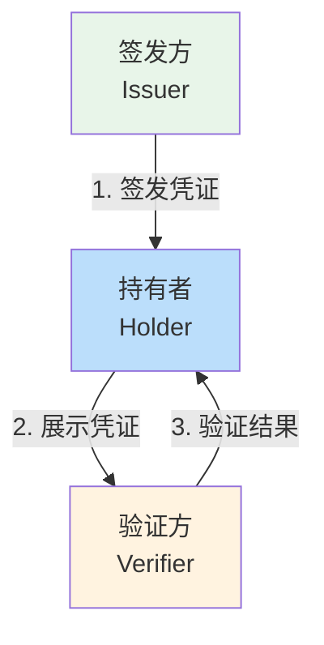
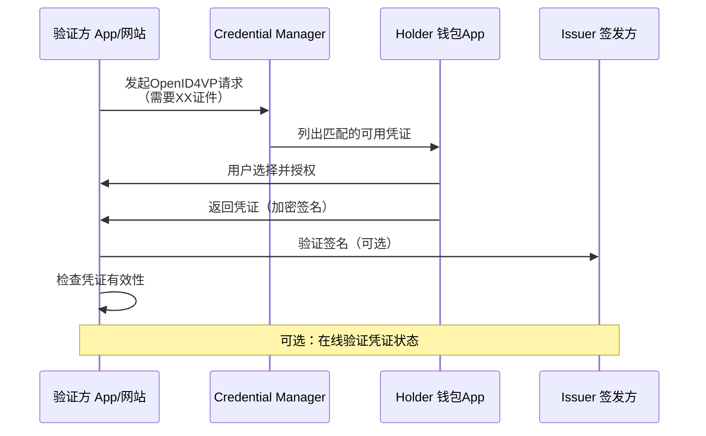
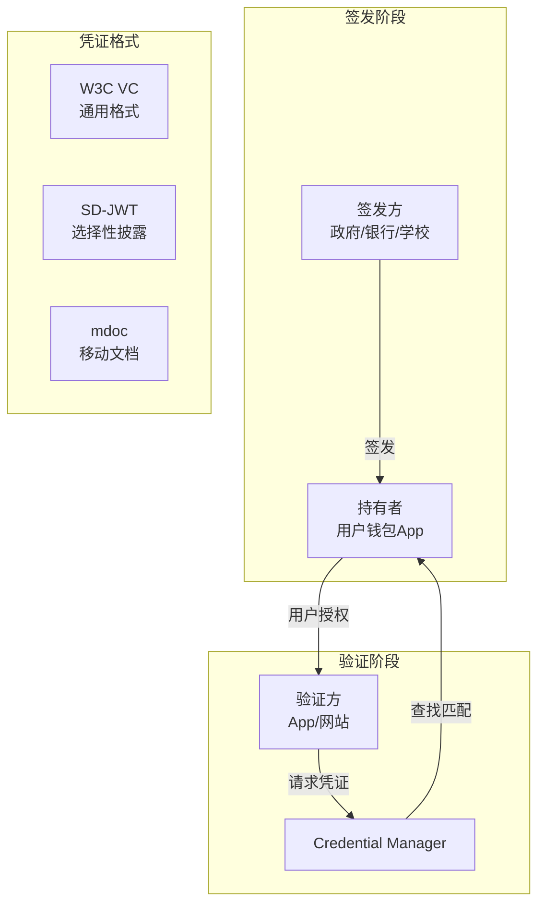

# 3.1.8 数字凭证概述

萤火虫的光点在草丛间明明灭灭，像是谁不小心打翻了一盒碎星星。

洛芙盘腿坐在篝火旁，手里捧着一杯已经温了的可可，目光落在跳动的火焰上。她还在回味刚才希尔演示的那个 Block Store 恢复流程——那些密码学的东西，明明听起来那么复杂，可一旦动手做起来，又觉得顺理成章。

"希尔，"洛芙忽然开口，"你说Credential Provider可以存密码、存Passkey，那……像我们平时用的数字身份证、驾照那些，也算凭证吗？"

希尔正往篝火里添柴，听到这话转过头来，眼睛亮了一下。"好问题。"她拍了拍手上的灰，"你是说——数字凭证。"

"数字凭证？"洛芙跟着重复了一遍。

"对。"黛琳不知什么时候已经拿起了她的白板笔，在那块随身携带的小白板上画了起来，"这个话题挺有意思的。其实你每天用手机刷公交卡、展示健康码，这些都可以算作数字凭证的雏形。只不过今天我们要聊的，是一套更标准、更安全、可以在不同平台之间互通的系统。"

"标准？"洛芙歪了歪头。

"嗯，"伊莎从她的睡袋里探出头来，声音软软的，"打个比方吧——你知道为什么不同国家发的护照都能被海关识别吗？因为它们都遵循国际民航组织制定的标准，照片格式、字体、防伪标记都是统一的。数字凭证也一样，需要一套大家公认的标准，这样你的数字身份证才能在不同的App和网站之间被正确识别和使用。"

"而且，"黛琳接过话头，在白板上写下几个词，"更重要的是——可验证。"

## 什么是数字凭证

"普通的电子文件，比如说一张PDF版的身份证复印件，"黛琳开始解释，"你可以复制、可以修改、可以截图发给任何人。但数字凭证不一样——它是密码学意义上可验证的。"

"就像……"洛芙想了想，"签名防伪的那种感觉？"

"比那更进一步。"黛琳在白板上画了一个简单的示意图，"假设你是一个数字凭证的持有者。这个凭证里包含了一些关于你的信息，比如你的姓名、出生日期、证件号码。签发这个凭证的机构——比如政府或者银行——会用私钥对这个凭证进行数字签名。"

"私钥？"洛芙眨眨眼。

"你可以把它理解成一把只有签发机构才有的、绝密的钥匙。"黛琳耐心地解释，"用这把钥匙签出来的签名，就像古代官府盖的印章一样，别人一看就知道这份文书是真的、没有被伪造过。"

"但是——"她顿了顿，在白板上又画了一个锁的图标，"验证的时候，验证方并不需要知道那把私钥。它只需要用签发机构公开提供的公钥去'解开'那个签名，就能确认这份凭证是不是真的。"

洛芙慢慢点头，这个逻辑她大概听懂了。"就像……你知道某个银行的官方印章长什么样，所以你看到一份文件上盖着那个章，就知道这是银行开的——但你不需要知道银行内部是怎么保管那个印章的。"

"就是这个意思。"黛琳露出赞许的神色，"而且数字凭证还有一个更厉害的地方——你可以选择性地披露信息。"

"选择性披露？"

"举个例子。"希尔掏出她的笔记本电脑，手指在键盘上飞快敲击，"假设有一个App要验证你的年龄，看你是不是满18岁。传统的做法是你把身份证原件给对方，对方看到你的出生日期，自己算你多大。"

"嗯……"洛芙点头。

"但用数字凭证，你可以只证明'我已年满18岁'这个事实，而不需要把你的出生日期、身份证号码这些敏感信息也一并交出去。"希尔把电脑转过来，屏幕上显示着一段代码，"这就是所谓的零知识证明——你不需要透露具体数据，只需要证明你满足某个条件。"

"好神奇……"洛芙感叹道。

"当然，实现起来要复杂得多，"希尔耸耸肩，"但概念上就是这样。"

## 数字凭证的三方模型

"说到这儿，我们得把数字凭证的完整生态讲清楚。"黛琳重新拿起白板笔，在纸上画了一个三角形，"一个完整的数字凭证系统，涉及三个角色。"

她一边画，一边在旁边标注：

"**签发方（Issuer）**——就是发出凭证的机构。比如政府发身份证、银行发存款证明、学校发学历证书。"

"**持有者（Holder）**——就是拿到凭证的个人，也就是你。你把这些凭证存在自己的数字钱包里，需要的时候拿出来用。"

"**验证方（Verifier）**——就是要求你出示凭证的一方。比如酒店要你出示身份证、租车公司要你出示驾照、网络平台要你证明你已经实名认证。"



"图1：数字凭证三方模型（行1-5）"

"传统的纸质凭证呢，"黛琳继续说，"签发、持有、验证都是你一个人完成的——你拿着身份证去酒店，酒店看完再还给你。数字凭证厉害的地方在于，这三个角色可以完全分开，而且可以通过网络和密码学来保证整个过程的安全和可信。"

"而且，"伊莎补充道，"持有者在整个过程中是主动的。他选择向验证方展示哪些信息、哪些信息可以选择性地隐藏。这和我们平时出示身份证原件不一样——身份证原件上所有信息都暴露了，但数字凭证可以做到'最小化披露'。"

"就像……Selective Disclosure，"希尔敲了敲电脑，"这是SD-JWT和mdoc这些新格式最重要的特性之一。"

洛芙掏出随身的小本子认真记下来。"那……Android系统是怎么支持这些的？"

## Android上的数字凭证

"这是重点。"黛琳在白板上重重画了个圈，"Android系统通过Credential Manager来支持数字凭证。它就像一个中央枢纽，把签发方、持有者和验证方串联起来。"

"怎么个串联法？"洛芙追问。

"从验证方的角度说，"黛琳画了另一个简图，"当一个App或者网页需要你出示数字凭证时，它会构造一个请求——这个请求遵循一个叫OpenID4VP的标准协议。"

"OpenID4VP？"洛芙又遇到了新名词。

"OpenID for Verifiable Presentations，"黛琳解释道，"你可以把它理解成一种'对话语言'。验证方用这种语言问'请出示你的证件'，持有者用同一种语言回答'这是我出示的证件'。因为大家都说同一种语言，所以可以跨平台、跨应用互操作。"

"就像USB接口一样？"洛芙尝试用自己的比喻。

"差不多吧。"黛琳点点头，"只不过USB是物理接口，OpenID4VP是数据交换的接口协议。"



"图2：数字凭证的完整交互流程（行1-18）"

"这里有几个关键点，"黛琳指着图上的箭头，"第一，验证方发出的请求会被Credential Manager接收，Credential Manager会去查找所有安装的数字钱包App里有没有匹配的凭证。"

"第二，用户只需要在Credential Manager的界面上操作一次，就可以完成选择和授权。"

"第三，凭证最后会从钱包App直接返回给验证方，Credential Manager只是中间协调者，不碰具体的数据内容。"

"好智能……"洛芙感叹，"感觉比传统的方式简洁多了。"

"而且更安全。"希尔插嘴道，"想想看，你不用把你的身份证照片发给每个要验证你的App，也不会出现App偷偷截屏你的证件这种问题。"

"密码学保证了一切？"洛芙问。

"密码学保证了一切。"

## 凭证格式：W3C VC、SD-JWT、mdoc

"等等，我还有一个问题。"洛芙举起手，"不同的机构发的凭证，格式是一样的吗？"

"问到点子上了。"黛琳在白板上写下三个名字，"目前主流的数字凭证格式有三种：W3C Verifiable Credentials、SD-JWT，还有mdoc。"

"听起来好复杂……"洛芙小声嘀咕。

"其实没那么可怕。"伊莎笑着递过来一根烤好的棉花糖，"听我慢慢说。"

"W3C Verifiable Credentials，是W3C这个国际标准组织定义的格式。最大的特点是通用性——它是一套最基础的标准，就像JSON一样，各行各业都可以基于这个格式定义自己的凭证类型。"

"SD-JWT呢？"洛芙一边吃棉花糖一边问。

"SD-JWT是IETF定义的标准，全称是'Selective Disclosure JWT'。"黛琳解释道，"它的核心特性就是选择性披露——刚才希尔演示的那种，凭证持有者可以选择性地只展示年龄而不展示出生日期。这个格式在欧盟的数字身份证项目里用得很多。"

"那mdoc呢？"

"mdoc是ISO/IEC 18013-5标准定义的移动端文档格式，"希尔接过话头，"其实就是把传统的实体身份证做成了手机里的数字版本。美国的数字驾照、欧洲的电子身份证，很多都用这个格式。"

"所以……"洛芙努力在脑子里整理这些信息，"mdoc像是实体证件的数字化版本，SD-JWT更灵活可以选信息公开，W3C VC是最通用的基础标准？"

"总结得不错。"黛琳点点头。

"那Android系统三种都支持吗？"洛芙又问。

"对，"希尔点头，"Credential Manager的Holder API同时支持mdoc和SD-JWT两种格式。开发者在实现数字钱包App的时候，只需要按照标准格式存储凭证，剩下的事情——匹配请求、引导用户授权、返回凭证——都交给Credential Manager处理。"

"也就是说，"洛芙慢慢理解，"我作为用户，不需要管后台用的是哪种格式，只需要知道我'要出示证件'，系统会帮我搞定一切？"

"就是这个道理。"

## 数字凭证 vs 普通钱包：为什么需要数字凭证？

"其实我一直有点好奇，"洛芙忽然说，"既然普通钱包里的卡和证件也能用，为什么还要搞数字凭证这套？"

"这个问题问得好。"伊莎放下手里的书，认真地看着她，"你有没有遇到过这种情况——你去一个地方办事，被要求出示某个证件的原件，但你不巧忘了带？"

"有……"洛芙想起自己上次去银行办卡，结果忘记带身份证白跑一趟的经历。

"或者，"伊莎继续说，"你有没有担心过，把身份证复印件发给某个平台，它会不会被泄露、滥用？"

洛芙点头。上个月她还看到新闻说有人因为身份证照片泄露被冒名注册公司。

"这就是数字凭证的意义。"伊莎的声音轻轻的，"第一，数字凭证不会'忘记带'——只要你带着手机，证件就在手机里。第二，数字凭证是加密签名的，无法伪造。第三，数字凭证可以做到选择性披露，你不需要把全部信息公开。"

"还有一点，"希尔补充道，"传统的身份证复印件，你无法控制对方的用途——他可能留存了复印件，下次再用。但数字凭证每次出示都有记录，你可以追溯谁在什么时候验证过你的哪个凭证。"

"听起来……好像真的更安全。"洛芙若有所思。

"但也要注意，"黛琳提醒道，"数字凭证毕竟是新技术，生态还在建设中。并不是所有场景都已经支持数字凭证了。比如你去一些小店买东西，还是得用实体身份证。数字凭证更适合那些需要身份验证、但又希望保护隐私的正式场景。"

洛芙点点头，把这些都记在了小本子上。

## 一个小实验：构造数字凭证请求

"光说不练假把式，"希尔忽然站起来，拍了拍手，"我来给大家演示一下，验证方是怎么发起数字凭证请求的。"

"又要写代码了吗？"洛芙兴奋地凑过去。

"对，不过今天只是演示基本流程，"希尔打开笔记本电脑，"真正的数字凭证涉及到签发和验证，需要完整的PKI基础设施，那个太复杂了。但请求的部分我们可以先看看。"

她打开Android Studio，新建了一个项目。

```kotlin
// build.gradle.kts (模块级)
// 需要添加以下依赖：
// implementation("androidx.credentials:credentials:1.6.0-beta01")

// 构造数字凭证请求
val request = DigitalCredentialRequest(
    // 凭证类型，使用OpenID4VP的标准格式
    // "org.iso.18013.5.1" 对应 mdoc 格式
    // "wtc.holder.confirmation" 对应 SD-JWT 格式
    credentialType = "org.iso.18013.5.1",
    
    // 需要的Claim字段
    // 例如：年龄证明可能只需要 "age_over_18" 这个Claim
    requestedFields = listOf(
        CredentialField(
            fieldName = "age_over_18",
            matchingFormat = ClaimFormat.MDOC
        )
    ),
    
    // 验证方信息
    // 用于在用户界面上显示"谁在请求你的凭证"
    verifierInfo = VerifierInfo(
        origin = "https://example-verifier.com",
        displayName = "Example Verification Service"
    )
)

// 初始化CredentialManager并发起请求
val credentialManager = CredentialManager.create(context)
val result = credentialManager.getCredential(
    request = request,
    context = activity
)

// 处理返回结果
when (result) {
    is GetCredentialResponse -> {
        val digitalCredential = result.credential as DigitalCredential
        // 凭证类型
        Log.d(TAG, "Credential type: ${digitalCredential.credentialType}")
        // 签发方信息
        Log.d(TAG, "Issuer: ${digitalCredential.issuer}")
        // 获取原始凭证数据（根据格式不同而不同）
        Log.d(TAG, "Credential raw data: ${digitalCredential.credentialBytes}")
    }
    is GetCredentialException -> {
        Log.e(TAG, "Error getting credential", result.error)
    }
}
```

"这是从验证方App的角度，"希尔解释道，"它告诉系统'我需要某个类型的凭证，显示这个验证方的名字，然后等用户授权就行'。"

"用户那边看到的是什么？"洛芙问。

"和Passkey的体验类似，"希尔说，"Credential Manager会弹出一个统一的界面，列出所有匹配的可用凭证。用户只需要点一下、确认授权，就搞定了。"

"和Passkey好像啊……"洛芙感叹。

"其实底层逻辑是相通的，"黛琳说，"都是把用户从繁琐的输入操作中解放出来，用更安全的方式完成身份验证。只是数字凭证更进一步——它不只验证'你是谁'，还能传递'关于你的信息'。"

## 数字凭证的未来

篝火噼啪作响，夜风从湖面上吹来，带着一丝凉意。

"你们觉得，"伊莎抬头看着满天的星星，"以后出门是不是只需要带手机就够了？"

"理想状态下是这样。"黛琳收起白板笔，"但现实还有很多挑战。比如，不是所有地方都支持数字凭证的验证；不同国家和地区有自己的法规要求；凭证的互操作性还需要时间建设……"

"但趋势是明确的，"希尔接过话，"你看欧盟已经在推EUDI Wallet，美国几个州也在发数字驾照。Android作为全球最大的移动操作系统之一，支持数字凭证是顺势而为。"

"而且，"洛芙忽然想到什么，"这对开发者来说也是新的机会？"

"当然。"黛琳看向她，"如果你要做一个需要用户身份验证的App，比如租房平台、婚恋平台、金融服务——接入数字凭证系统，就可以用更安全、更保护隐私的方式完成用户身份验证。不需要用户上传身份证照片，不需要担心数据泄露，用户体验还更好。"

"听起来很棒！"洛芙的眼睛亮晶晶的。

"不过，"黛琳补充道，"数字凭证的开发涉及到一些密码学基础和协议知识，比普通的Passkey登录要复杂一些。建议先熟悉Credential Manager的整体架构，再逐步深入。"

"那……"洛芙看着手里的可可杯，"我今天学的这些，算是入门吗？"

"算。"伊莎笑着揉了揉她的头发，"知道数字凭证是什么、三方模型是什么、OpenID4VP是干什么的——这就是入门了。剩下的细节，在实践中慢慢学。"

远处的湖面上，倒映着星空和篝火的余烬。一只夜鸟从树梢掠过，叫声清越。

洛芙靠在折叠椅上，觉得今晚学到的东西，像那杯篝火上温过的可可一样，暖烘烘地留在了心里。

---

## 专业技术总结

> **数字凭证（Digital Credentials）** —— Android系统中由密码学签名保护的、可验证的数字文档，用于在不同应用和平台之间安全地传递和验证用户身份信息及相关属性。

#### 结构图



#### 核心机制定义

| 概念 | 定义 |
|------|------|
| 数字凭证 | 密码学意义上可验证的数字文档，包含用户信息和签发方的数字签名 |
| 三方模型 | 签发方（Issuer）、持有者（Holder）、验证方（Verifier）分离的架构 |
| OpenID4VP | OpenID for Verifiable Presentations，用于请求和传递数字凭证的协议 |
| 选择性披露 | 凭证持有者可以选择只展示满足条件的证据，而不暴露具体数据 |
| Credential Manager | Android系统级组件，作为数字凭证的中央协调枢纽 |

#### 复杂度与影响

- **凭证格式选择**：mdoc适合政府签发的证件类凭证，SD-JWT适合需要选择性披露的声明类凭证，W3C VC作为基础标准灵活性最高
- **网络依赖**：凭证验证可能需要在线查询签发方或吊销列表，网络不畅时用户体验可能受影响
- **生态成熟度**：数字凭证生态仍在建设中，不同地区和场景的支持程度不一

#### 反模式与陷阱

1. **不要**把凭证原始数据直接存储在SharedPreferences中——数字凭证应使用安全硬件（Keystore）保护私钥和敏感数据
2. **不要**在请求中要求过多字段——验证方应遵循最小化原则，只请求必要的字段以保护用户隐私
3. **不要**忽略凭证有效期检查——凭证可能过期或被签发方撤销，验证时应检查时间戳和状态列表

#### 设计哲学

数字凭证的设计体现了几个重要原则：

1. **用户主权**：持有者完全控制凭证的使用，只有授权后凭证才会被展示
2. **最小化披露**：默认只传递必要的信息，支持选择性披露
3. **可验证性**：密码学签名使任何人都能验证凭证的真实性，无需信任中间方
4. **互操作性**：遵循国际标准（OpenID4VP、W3C VC等），确保跨平台使用

#### 🏕️ 动手练习

**目标**：了解数字凭证请求的基本流程，编写一个发起数字凭证请求的示例代码。

**你需要做的事**：

1. 创建一个新的Android项目（最低SDK版本34）
2. 在`build.gradle.kts`中添加依赖：
   ```kotlin
   implementation("androidx.credentials:credentials:1.6.0-beta01")
   ```
3. 在Manifest中声明权限（如果需要网络验证）：
   ```xml
   <uses-permission android:name="android.permission.INTERNET" />
   ```
4. 创建一个Activity，包含一个按钮用于发起数字凭证请求
5. 在按钮点击事件中构造`DigitalCredentialRequest`对象
6. 调用`CredentialManager.getCredential()`发起请求
7. 处理返回结果，在Logcat中打印凭证信息

**验收标准**：

- [ ] 项目成功编译运行
- [ ] 按钮点击后能正确弹出Credential Manager界面（即使没有可用凭证）
- [ ] 能正确处理`GetCredentialException`异常情况
- [ ] 在Logcat中能看到请求构造的详细信息

**提示**：

```kotlin
// 完整的请求构造示例
val request = DigitalCredentialRequest(
    credentialType = "org.iso.18013.5.1", // mdoc格式
    requestedFields = listOf(
        CredentialField(
            fieldName = "portrait_image",
            matchingFormat = ClaimFormat.MDOC
        )
    ),
    verifierInfo = VerifierInfo(
        origin = "https://your-verifier.com",
        displayName = "Your App Name"
    )
)
```

**面试热身**：

1. 请用自己的话解释什么是"选择性披露"，它和传统的身份证复印件有什么不同？
2. 数字凭证的三方模型（签发方、持有者、验证方）各自的职责是什么？
3. OpenID4VP协议在数字凭证流程中起什么作用？
4. mdoc和SD-JWT两种凭证格式分别适合什么场景？
5. 如果你要为一个需要验证用户年龄的App设计功能，你会选择使用数字凭证吗？为什么？

#### 参考实现要点

1. **优先使用官方SDK**：通过`androidx.credentials`库接入数字凭证功能，而非自行实现协议细节
2. **处理无凭证状态**：在发起请求前应检查设备上是否安装了支持数字凭证的钱包App
3. **验证方需注册Digital Asset Links**：确保验证方域名与Android应用包名正确关联，建立信任关系
4. **遵循最小化原则**：验证方只请求必要的字段，不要试图获取用户的完整身份信息
5. **考虑离线场景**：某些凭证验证可能需要网络，检查吊销列表前应设计好降级策略

---

> 学习建议：数字凭证是一个较新的领域，官方文档和社区资源还在持续完善中。建议先从理解三方模型和OpenID4VP协议入手，然后阅读Google官方的Credential Manager示例代码。有兴趣的话，可以关注欧盟EUDI Wallet和美国各州数字驾照的最新进展，这些实案例能帮助你理解数字凭证在实际场景中的应用。

## 洛芙的小小日记本

今天学到了"数字凭证"！原来手机里的证件不只是电子版，还能像密码学家设计的魔法契约一样——选择性披露、密码学签名验证、零知识证明……黛琳说，知道三方模型和OpenID4VP就算入门了。那我就当自己迈进了新世界的大门吧！明天继续～

---

## 今日关键词

**数字凭证（Digital Credentials）**：密码学意义上可验证的数字文档，包含用户属性信息和签发方的数字签名，可在不同应用和平台间安全传递。

**三方模型（Three-party Model）**：数字凭证系统的核心架构，包含签发方（Issuer，负责签发凭证）、持有者（Holder，用户的钱包App）、验证方（Verifier，请求并验证凭证的一方）。

**OpenID4VP（OpenID for Verifiable Presentations）**：用于请求和传递数字凭证的国际标准协议，确保不同平台和应用之间的互操作性。

**选择性披露（Selective Disclosure）**：数字凭证的特性，允许持有者只证明满足某个条件（如"已满18岁"），而不暴露具体数据（如出生日期）。

**W3C Verifiable Credentials**：W3C国际标准组织定义的可验证凭证基础格式，具有最高的通用性。

**SD-JWT（Selective Disclosure JWT）**：IETF定义的支持选择性披露的JWT格式，特别适合需要保护隐私的声明类凭证。

**mdoc（Mobile Document）**：ISO/IEC 18013-5标准定义的移动端文档格式，将传统实体证件数字化的标准格式。

**Credential Manager**：Android系统级Jetpack API，作为数字凭证的中央协调枢纽，连接验证方和持有者的钱包App。

**密码学签名（Cryptographic Signature）**：使用私钥对数据进行数学运算生成的签名，验证方使用对应公钥即可确认数据真实性和完整性。

**数字资产链接（Digital Asset Links）**：用于建立网站与应用之间信任关系的协议文件，确保只有合法的验证方才能请求用户凭证。
