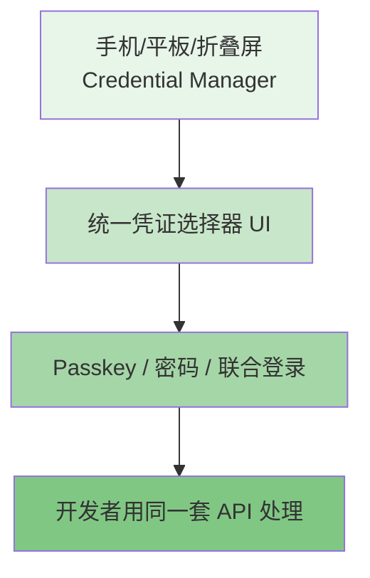
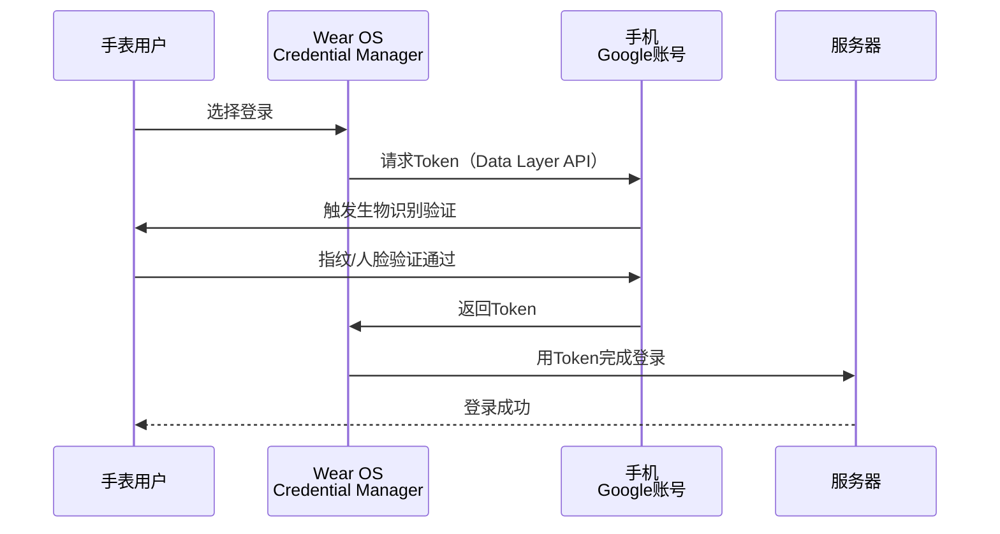
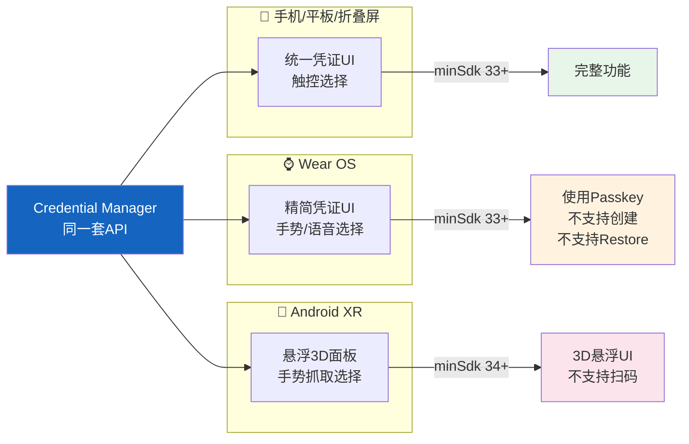
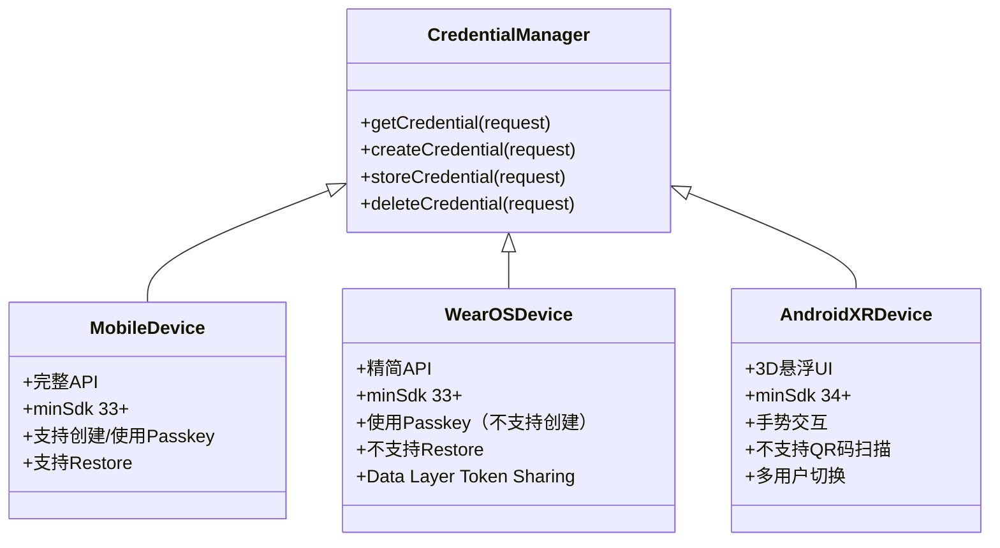

# 3.1.9 跨外形尺寸进行身份验证

深夜的湖畔，万籁俱寂。

篝火已经燃到了最安静的阶段——火焰不再是傍晚那种欢腾跳跃的红黄色，而是变成了沉稳的、暗橙色的余烬，偶尔轻轻晃动，像是在打瞌睡。萤火虫的光芒在这个时段反而最盛，一明一灭地点缀在湖岸边的芦苇丛里，倒映在黑黢黢的水面上，和天上稀疏的星星混在一起，分不清哪些是地上的，哪些是天上的。

洛芙裹着薄外套盘腿坐在一块大石头上，手里捧着一杯已经凉了的柠檬水，目光落在跳动的火苗上，却似乎在想着什么别的事情。

"在想什么呢？"伊莎的声音从旁边飘过来。她正靠在一棵矮松树上，膝盖上摊着一本没打开的笔记本，笔帽在指尖转着圈。

"我在想……"洛芙皱了皱眉，"今天黛琳讲的那些，Credential Manager的那些东西——它是在手机上用的对吧？可是我看到新闻说，现在不只有手机了，还有手表、眼镜那些……那这些东西怎么登录啊？手表那么小，能放得下密码吗？"

希尔从笔记本后面探出头来，屏幕的蓝光映在她脸上。"问得好，洛芙。这其实就是今天我想说的下一件事——Credential Manager 不只是给手机用的。"

"不只是给手机用？"洛芙眨了眨眼。

"对，"黛琳不知道什么时候已经从帐篷里出来了，手里捧着她的白板笔。她走到篝火旁，在石头上一坐，把白板架在膝盖上。"你们看——"

她用笔在白板上画了四个方块，分别标上了"手机/平板"、"折叠屏"、"Wear OS"、"Android XR"。

"这是现在 Android 生态里最常见的四种形态，"黛琳说，"Credential Manager 的核心 API 是同一套，但每种形态有它自己的 UI 表现和使用限制——就像同样是露营，帐篷、房车、小木屋、星空下的睡袋，住起来的感受完全不一样，但它们本质上都是在'睡觉'这件事。"

洛芙若有所思地点点头。

"那我们就一个一个来说吧，"希尔把笔记本转过来对着大家，屏幕上是一个代码结构图，"先从最常见的——手机和平板开始。"

## 手机与平板：形态之王

"手机、平板、折叠屏，这些是 Credential Manager 的'主战场'，"希尔说，"它们的屏幕足够大，有触摸屏，有键盘输入，API 用起来最完整——你想创建 Passkey、读取凭证、删除账户，统统都可以。"

黛琳在白板上画了一个大框，里面画了一个手机的示意图。

"我们可以把手机想成露营地的'主帐篷'，"她说，"它是功能最齐全的那个——有门有窗，有睡袋有炉子，做饭睡觉全靠它。Credential Manager 在手机上的实现，就是这个主帐篷。"

"那平板呢？"洛芙问，"平板比手机大很多……"

"大屏幕是多出来的空间，不是多出来的能力，"希尔接口，"平板上你可以把登录界面做得更舒展，比如左右分栏——左边是应用信息，右边是登录选项。折叠屏就更灵活了，展开是平板，折起来是手机，Credential Manager 会自动适应。"

她翻到笔记本的下一页，上面是一段 Kotlin 代码：

```kotlin
// Credential Manager 在手机/平板上的核心调用
// 依赖：implementation "androidx.credentials:credentials:1.3.0-alpha06"

// 获取用户首选的凭据选项（支持Passkey、密码、联合登录等）
val credentialManager = CredentialManagerCompat.create(context)

// 定义请求参数：选择"获取"还是"创建"
val getCredentialRequest = GetCredentialRequest(
    credentialOptions = listOf(
        PasskeyCredentialOptions(),
        PasswordCredentialOptions(),
        FederatedCredentialOptions(
            provider = IdentifiedProviders.GOOGLE
        )
    )
)

// 执行获取凭证（会弹出系统统一的Credential UI）
val result = credentialManager.getCredential(
    request = getCredentialRequest,
    activityContext = activityContext,
    handler = mainHandler
)

// 根据返回类型分别处理
when (val credential = result.credential) {
    is PasskeyCredential -> {
        // 处理Passkey：使用response.signatureData做验证
        Log.d(TAG, "Passkey verified: ${credential.credentialId}")
    }
    is PasswordCredential -> {
        // 处理密码：从credential.username和password字段提取
        Log.d(TAG, "Password login: ${credential.username}")
    }
    is FederatedCredential -> {
        // 处理联合登录（如Google账号）
        Log.d(TAG, "Federated: ${credential.provider}")
    }
}
```

"这段代码在手机和平板上跑起来是这个样子的——"希尔点了运行，屏幕上弹出了一个卡片式的底部弹窗，上面整齐排列着"使用Passkey登录"、"使用密码登录"、"使用Google账号登录"三个选项。

"哇，好整齐，"洛芙探过头来看，"像餐厅的菜单一样。"

"对，这个统一的 UI 界面是 Credential Manager 最重要的价值之一，"黛琳说，"以前每个 App 都有自己的登录界面，Google 用一套，Facebook 用一套，各种银行又各自一套——用户得记住几十套密码。现在 Android 把这个统一了，用户学一次就会用一辈子。"

"那折叠屏呢？"洛芙追问，"展开和折叠的时候 UI 会不会乱掉？"

"不会，"希尔说，"Credential Manager 的 UI 是系统级的，它会自动感知屏幕状态——展开的时候给你更大的布局，折起来就变成手机式的单列布局，开发者的代码完全不用改。"

黛琳在白板上补了一个小图示：



"这个图很重要，"黛琳说，"不管用户用的是什么设备，看到的底层流程是一样的——选凭证、验证、使用。设备形态决定的是'怎么选'和'怎么验证'，而不是'用不用Credential Manager'。"

"懂了！"洛芙点点头，"就像不管你住帐篷还是住小木屋，晚上都要盖被子睡觉——被子就是Credential Manager，被子的材质和大小会根据床（设备）来调整，但睡觉这件事是一样的。"

"哇，洛芙举例子越来越有感觉了，"伊莎笑着说。

"那手表呢？"洛芙看了看希尔手腕上那块小小的模拟手表，"手表那么小，没有键盘，怎么输入密码？"

## Wear OS：手腕上的信任枢纽

希尔和黛琳对视了一眼。

"手表是个很有趣的问题，"黛琳说，"因为它的硬件限制非常明显——屏幕小，没有键盘，处理器也比手机弱。但是，它有一个手机没有的巨大优势。"

"什么优势？"洛芙问。

"安全模块，"希尔说，"现代智能手表——尤其是 Wear OS 设备——有一个独立的、硬件级别的安全模块，叫 Secure Element（安全元件）。它能生成和存储加密密钥，而且这个密钥永远不会被操作系统读取，只能被特定的硬件接口调用。"

她用手比划着："你可以这么理解——手表就像营地里的一个保险箱。保险箱很小，放不了太多东西，但是它自带锁，而且这个锁的钥匙是物理的、刻在金属上的，贼拿走也没用。"

"原来如此……"洛芙看着自己的手腕，"那手表怎么登录呢？不能打字的话……"

"这就是最聪明的地方，"黛琳说，"手表不需要打字。Wear OS 上的 Credential Manager 支持 Passkey，而 Passkey 的验证是靠设备自己的生物识别（指纹、面部）或者 PIN 码来解锁安全模块的。"

"等等，"洛芙突然想到了什么，"那我在手表上创建的 Passkey，下次换手表了还能用吗？"

"这就是有趣的地方了——"希尔放下笔记本，表情变得有点微妙，"Wear OS 上的 Credential Manager 有两个很重要的限制。"

她伸出两根手指。

"第一，Wear OS 不支持 **创建** Passkey。"

"不能创建？"洛芙愣住了，"那怎么用 Passkey？"

"你得先在手机上创建好，"黛琳说，"手表可以 **使用** 已有的 Passkey 做登录——前提是那个 Passkey 是用同一个 Google 账号同步过来的。但手表自己不能生成新的密钥对，这是硬件限制决定的——手表的安全模块虽然安全，但它的容量和功能比手机弱。"

"第二，"希尔继续说，"Wear OS 不支持 **Restore Credentials**。"

"Restore Credentials？"

"就是恢复凭证，"黛琳解释道，"正常情况下，如果你买了一台新手机，Google 会帮你把 Passkey 同步到新手机上，你不需要重新注册。但手表没有这个能力——你换了一块新手表，就得重新配对和设置。这是手表作为'次级设备'的定位决定的。"

洛芙皱起眉头："那手表登录是不是很麻烦？"

"不麻烦，"希尔摇头，"因为 Google 还有一个叫 **Data Layer Token Sharing** 的机制——简单说，就是手表可以'借用'手机已经登录好的账号。你用手表登录的时候，实际上是手机在背后帮你做验证，手表只是一个'遥控器'。"

"就像……营地里的对讲机？"洛芙试探着说。

"对！"希尔一拍手，"对讲机本身不发电，但它能帮你和控制中心说话。在 Wear OS 上，手表就是那个对讲机，而手机是控制中心。"

黛琳在白板上添了新的内容：



"这个图展示了 Wear OS 的典型登录流程，"黛琳说，"手表本身不存储密码，它只是一个交互界面。真正的验证发生在配对的手机上，这也是为什么用 Wear OS 登录需要手机在旁边。"

"等等，"伊莎忽然开口，"如果手机在旁边，那我为什么不直接在手机上登录，而要在手表上操作？"

希尔笑了起来："问得好——这是 UX 设计的问题，不是技术问题。典型场景是：你在晨跑，跑完想打开健身 App 记录成绩。手机在跑步包里，手表就在手腕上。掏手机要拉开包拉链，手表抬腕就能操作。这就是'手腕上的信任枢纽'的价值。"

"原来如此……"洛芙点点头，"所以 Wear OS 的设计思路是：它不是用来替代手机的，它是手机能力的延伸，在特定场景下比手机更方便。"

"完全正确，"黛琳说，"这也体现在 Wear OS 的 UI 上——手表上的 Credential Manager 会把选项精简到最少，因为屏幕太小，选项太多根本看不清。通常只显示 Passkey 和'Sign in with Google'两个按钮。"

她翻过白板页，画了一个手表屏幕的示意：

```
┌──────────────────┐
│  🔐 Sign in      │
│                  │
│  [Passkey]       │
│  ──────────      │
│  [Google 账号]   │
└──────────────────┘
   (Wear OS)
```

"你看，按钮非常大，就是方便手指点按，"黛琳说，"这也是一种'形态适配'——UI 不是把手机的界面缩小放进去，而是根据手表的实际使用场景重新设计的。"

"那……眼镜呢？"洛芙抬头看了看夜空，想象着科幻电影里的那种眼镜，"AR、VR 那些……也能用 Credential Manager 吗？"

"能，"希尔说，"而且是最复杂的一种。"

## Android XR：三维空间里的身份之问

提到 XR，希尔的表情变得认真起来。

"XR——Extended Reality，扩展现实，包括虚拟现实（VR）和增强现实（AR）。在这个形态里，用户不是在看一块屏幕，而是置身于一个三维的虚拟空间。"

"那……登录界面在哪里？"洛芙困惑地问。

"登录界面就浮在你面前，"伊莎轻声说，她望着湖面，若有所思，"就像星空投影仪把星空投在帐篷顶上一样，XR 设备把登录界面'投'在你周围的空气里。"

"伊莎这个比喻好美，"黛琳说，"但实际开发起来，这是最复杂的情况。"

"为什么？"洛芙问。

"因为在 XR 里，一切的交互方式都变了，"希尔说，"在手机上，你用手指戳屏幕。在手表上，你用手指点触控屏。在 XR 里——"

她张开双手，在空中比划着抓取的动作。

"——你用手**抓**。"

"手抓？"

"对，XR 的核心交互是**手势识别**。你要选择一个选项，不是戳一个按钮，而是伸手'拿'起一个悬浮的图标，或者用手指'点'悬浮在空中的光点。"

"那 UI 的设计思路完全不一样了，"黛琳接过话，"在 XR 里，Credential Manager 的界面是**悬浮面板**——就像一块透明的玻璃板浮在你面前，上面有选项，你用手势去选择。"

她用白板笔画了一个简单的示意：

```
    ╭─────────────────────────╮
   ╱                           ╲
  │   XR 悬浮认证面板           │
  │                             │
  │  [🔑 Passkey 登录]         │
  │  [🔒 Google 账号]          │
  │                             │
   ╲                           ╱
    ╰─────────────────────────╯
         ↑ 用户用手势"拿取"
```

"这就是 Android XR 上的 Credential Manager UI，"黛琳说，"它是三维的、可交互的、悬浮的。和手机上的卡片式底部弹窗完全不同，但底层调用的 API 是完全一样的。"

"等等，"洛芙忽然举手，"那扫码呢？之前我们讲的那个 OpenID4VP，不是有一种验证方式是通过扫码来跨设备认证吗？在 XR 上怎么做？"

希尔摇了摇头，表情有些遗憾："这就说到了 XR 上最大的限制——**Android XR 不支持 QR 码扫描认证**。"

"不支持？"洛芙惊讶了，"可是扫码不是最方便的跨设备验证方式吗？"

"在手机上是，但 XR 上不行，"黛琳解释道，"你想，XR 眼镜的摄像头是用来捕捉用户周围环境的，不是用来扫描屏幕上的二维码的。让用户举着眼镜去'看'另一个设备的屏幕，然后对准二维码——这个体验太糟糕了，而且识别率很低。"

"所以 XR 上的认证只能靠 Passkey 和联合登录，"希尔说，"不能扫码，就少了一种中间人验证的途径。这对于安全性设计来说是一个挑战。"

"还有另一个挑战，"伊莎从松树下站起来，走到篝火边，火光映在她的脸上，"多用户场景。"

"多用户？"洛芙不太明白。

"在 XR 环境里，"伊莎慢慢地说，"不同的人可能会共用同一台设备——比如一个家庭共用一副 XR 眼镜。在这种情况下，Credential Manager 需要知道'现在是谁在操作'。"

"这是个好问题，"黛琳点头，"手机和手表通常是个人设备，XR 可能是共享设备。Credential Manager 在 XR 上需要处理多用户的切换——在开始认证之前，先确定当前用户是谁。这不是一个纯技术问题，它涉及到产品设计和用户心理。"

"那……怎么解决呢？"洛芙问。

"目前 Android XR 的方案是，"希尔翻开笔记本的最后一页，"在进入任何需要登录的 App 之前，先显示一个用户选择界面，让用户确认自己是谁——这个界面也是悬浮在 3D 空间里的，非常有仪式感。"

```
┌─────────────────────────────────────┐
│   欢迎回来，请选择你的身份：           │
│                                     │
│   👤 妈妈                           │
│   ────────────────                │
│   👤 爸爸                           │
│   ────────────────                │
│   ➕ 添加新用户                      │
│                                     │
│   [确认]                            │
└─────────────────────────────────────┘
          (XR 用户选择界面)
```

"添加新用户之后，还要做注册流程——也是用手势在 3D 空间里操作，"希尔说，"整个过程比手机复杂得多，但原理是一样的：选用户 → 验证身份 → 完成登录。"

黛琳在白板上添了最后一张图：



"这张图总结了今天的内容，"黛琳说，"Credential Manager 的核心 API 是一样的，但针对不同形态有不同的 UI 表现和功能限制。"

"我把技术细节再补充一下，"希尔说，"手机和平板的 minSdk 要求是 33，Wear OS 也是 33，但不支持创建 Passkey 和 Restore。Android XR 要求 minSdk 34，因为它是更新的平台。"

"还有一点，"黛琳补充道，"XR 的开发需要用特定的模拟器镜像——macOS 需要 Google Play XR ARM 64 v8a System Image，Windows 需要 Intel x86_64 Atom System Image，而且模拟器版本要高于 35.6.11 Stable。如果你们以后做 XR 开发，这些版本号要记住。"

洛芙把白板上的内容从头到尾看了一遍，萤火虫的光芒在白板表面一闪一闪的。

"所以……"她慢慢开口，"Credential Manager 是一个跨设备的身份验证系统。它的 API 是统一的，但每个设备形态有它自己的'性格'——"

"性格，"伊莎重复了这个词，微微笑了，"这个说法有意思。"

"对，"洛芙越说越兴奋，"手机是全能型，什么都能做；手表是便携延伸，方便但有局限；XR 是沉浸体验，交互全新但还在发展中。就像露营——住帐篷、住房车、住小木屋，都是露营，但感受完全不一样。"

"而且，"希尔合上笔记本，火光映在她的眼睛里，"不管住哪种，最终目的都是亲近自然、放松身心。就像不管用哪种设备，最终目的都是——"

"安全地证明'你是你'，"黛琳轻声接道。

篝火在这时发出了一声轻轻的"噼啪"，一颗火星向上飘起，在夜空中散开，然后熄灭。远处湖面上，有一只夜鸟掠过水面，留下一道细细的波纹。

"好了，"黛琳把白板笔盖好，"今天的夜话就到这里吧。明天还要早起看日出呢。"

"嗯！"洛芙站起身，伸了个懒腰，"今晚的星星好亮啊……"

"初夏的夜空就是这样，"伊莎仰头望着，"银河从东边慢慢升起来，一直到七月都是看星星的好时候。"

希尔已经开始收拾笔记本了，但她的动作慢了下来，似乎也被夜空吸引了。

"洛芙，"她忽然说，"今天的内容里，有一个很重要的点希望你记住。"

"什么？"

"做身份验证开发，最容易犯的错误是——**只考虑自己常用的设备**。如果你只用过 Pixel，你可能会假设所有 Android 手机的屏幕都是 6.7 寸、所有用户都用指纹解锁。这就是'手机万能主义'——而真正的产品，需要照顾到折叠屏的展开、Wear OS 的手势、XR 的空间交互。"

"就像露营，"黛琳轻声说，"不能只考虑好天气——要准备雨布、备用水源、应急食物。好的营地计划，要想到所有可能的天气。好的认证设计，要想到所有可能的设备。"

洛芙把这句话记在了心里。

她抬头看了看头顶的银河，然后低头看了看手腕上的电子表（不是 Wear OS，只是一块普通的运动手表）。同一片星空下，不同的设备在看同一片天空——这种感觉，让洛芙忽然觉得科技和自然之间的距离，比她想象的更近。


---
## 专业技术总结

**跨外形尺寸身份验证（Authenticate across form factors）** 是指在不同 Android 设备形态（手机、平板、折叠屏、Wear OS、Android XR）上，通过统一的 Credential Manager API 实现一致的认证体验。核心编程接口保持不变，但每种形态在 UI 表现、功能限制和交互方式上有显著差异。

#### 结构图



#### 不同形态的功能差异矩阵

| 功能 | 手机/平板/折叠屏 | Wear OS | Android XR |
|------|-----------------|---------|-----------|
| minSdk 要求 | 33+ | 33+ | 34+ |
| 创建 Passkey | ✅ | ❌ | ❌ |
| 使用 Passkey | ✅ | ✅ | ✅ |
| 密码登录 | ✅ | ✅ | ✅ |
| 联合登录（Google等）| ✅ | ✅ | ✅ |
| Restore Credentials | ✅ | ❌ | ❌ |
| QR 码扫描认证 | ✅ | ❌ | ❌ |
| Data Layer Token Sharing | ❌ | ✅ | ❌ |
| 3D 悬浮 UI | ❌ | ❌ | ✅ |
| 多用户切换 | 设备所有者 | 设备所有者 | 共享设备场景 |

#### 反模式与陷阱

1. **假设手机和折叠屏行为完全相同** → 折叠屏在展开状态下屏幕宽高比变化，Credential UI 可能需要双栏布局；测试时必须覆盖"展开"和"折叠"两种状态。
2. **在 Wear OS 上调用 createPasskey()** → Wear OS 不支持创建 Passkey，调用会抛出 `UnsupportedOperationException`；应先检查设备能力（`packageManager.hasSystemFeature(FEATURE_WATCH)`），若无能力则降级到 Data Layer Token Sharing 或联合登录。
3. **XR 开发依赖扫码验证流程** → Android XR 不支持 QR 码认证，但部分企业场景依赖扫码做设备关联；此时应改用 Passkey 的"跨设备认证"（_cross-device authenticator_）模式，即用户在手机侧发起，手机作为认证器完成验证后通知 XR 设备。
4. **忽略 XR 多用户场景** → XR 设备（尤其是 AR 眼镜）可能是家庭共享设备，认证前必须确认当前用户身份；建议在应用入口处实现用户选择界面，而非直接跳转到 Credential Manager。
5. **模拟器版本不满足 XR 开发** → macOS XR 模拟器需要 ARM 64 v8a System Image，Windows 需要 Intel x86_64 Atom System Image，且模拟器版本 > 35.6.11 Stable；版本不满足时 Credential Manager 在 XR 上的 UI 会出现渲染异常。

#### 设计哲学

**"统一 API，差异 UX"** —— Credential Manager 的设计哲学在于：开发者使用同一套 API 适配所有形态，但每种形态的 UI 和交互由系统自动适配，而非开发者手动适配。这背后的指导思想有三点：

1. **平台能力差异化**：每种形态的硬件能力不同（安全模块容量、输入方式、屏幕大小），API 必须包容这些差异，但不能让开发者为每种形态写单独的逻辑。
2. **UX 自主性下放**：Credential Manager 只提供统一的 API 和系统级 UI 组件，UI 的视觉风格和交互细节由各形态的系统 UI 决定，保证用户在不同设备上学到一致的"选择凭证 → 验证 → 完成"心智模型。
3. **安全边界跟随形态**：不同形态的威胁模型不同。手机和平板的安全边界是设备本身；Wear OS 的安全边界是"设备 + 配对手机"；XR 的安全边界需要额外考虑物理空间隔离（他人在旁边是否能看到你的密码？），因此不支持 QR 扫码等"他人可见"的认证方式。

---
#### 🏕️ 动手练习

**项目目标**：构建一个支持多形态认证的 Android App，分别在手机模拟器、Wear OS 模拟器和 XR 模拟器上验证身份验证流程。

**方式 A：项目制（★★★☆☆）**

**Task 1：搭建基础项目骨架**
- 目标：创建一个包含 Credential Manager 依赖的 Android 项目，验证 API 调用链路通畅。
- 步骤：
  1. 在 Android Studio 中创建 Phone + Wear OS + XR 的多模块项目（`app-phone`、`app-wear`、`app-xr` 三个模块）。
  2. 在各模块 `build.gradle` 中添加 `implementation "androidx.credentials:credentials:1.3.0-alpha06"`。
  3. 在 Phone 模块创建一个 `MainActivity`，初始化 `CredentialManager` 实例并打印日志确认初始化成功。
  4. 运行到 Phone 模拟器（API 33+），确认 Logcat 输出 `CredentialManager initialized`。
- 验收标准：`[ ] Phone 模块可编译运行；[ ] Logcat 显示初始化成功；[ ] 无 ClassNotFoundException`
- 提示代码：
```kotlin
// 初始化 CredentialManager（推荐使用兼容版本）
val credentialManager = CredentialManagerCompat.create(context)
Log.d(TAG, "CredentialManager initialized: $credentialManager")
```

**Task 2：实现 Passkey 登录（Phone 模块）**
- 目标：在 Phone 模块实现完整的 Passkey 创建和登录流程。
- 步骤：
  1. 创建 `RegisterActivity`（用于注册 Passkey）和 `LoginActivity`（用于登录）。
  2. 在 `RegisterActivity` 中实现 `createCredentialRequest`，使用 `PublicKeyCredentialCreationOptions` 配置 Relying Party 信息（ID、名称、挑战值）。
  3. 调用 `credentialManager.createCredential()` 并处理 `CredentialManagerCreateCredentialException`。
  4. 在 `LoginActivity` 中实现 `GetCredentialRequest`，使用 `PublicKeyCredentialRequestOptions`。
  5. 调用 `credentialManager.getCredential()` 并验证返回的 `AuthenticatorAssertionResponse` 签名。
- 验收标准：`[ ] 能成功创建 Passkey 并存储；[ ] 能使用已创建的 Passkey 完成登录；[ ] Passkey 的 credentialId 在两次调用间保持一致；[ ] 模拟器重启后 Passkey 仍可使用（Restore 能力）`
- 提示代码：
```kotlin
// 创建 Passkey 的请求选项（简化版）
val createOptions = PublicKeyCredentialCreationOptions.Builder()
    .setRp(PublicKeyCredentialRpEntity(
        rpId = "your-domain.com",        // 必须与网站域名匹配
        name = "Your App Name",
        icon = Uri.parse("android:drawable/ic_launcher")
    ))
    .setUser(PublicKeyCredentialUserEntity(
        userId = userIdByteArray,         // 用户的唯一ID（字节数组）
        name = userEmail,
        icon = Uri.parse("android:drawable/ic_person")
    ))
    .setChallenge(challengeByteArray)     // 服务器提供的随机挑战值
    .setPubKeyCredParams(listOf(
        // 优先使用 ES256（ECDSA），其次 RSA256
        PublicKeyCredentialParameters(
            "ES256",
            COSEAlgorithmIdentifier.ES256
        )
    ))
    .setAuthenticatorSelectionCriteria(
        AuthenticatorSelectionCriteria.Builder()
            .setAttachment(AuthenticatorAttachment.PLATFORM) // 仅本机设备
            .setResidentKey(ResidentKeyRequirement.REQUIRED)  // 要求存盘（无需用户名）
            .setUserVerification(UserVerificationRequirement.REQUIRED) // 要求生物验证
            .build()
    )
    .setTimeout(120000L) // 超时 2 分钟
    .build()
```

**Task 3：适配 Wear OS 模块（降级方案）**
- 目标：在 Wear OS 模块实现联合登录（不支持 Passkey 创建）。
- 步骤：
  1. 在 Wear OS 模块中检测设备能力：检查是否为 Wear OS 设备（`PackageManager.FEATURE_WATCH`）。
  2. 如果是 Wear OS，显示联合登录 UI（Google 登录按钮），避免调用 `createCredential()`。
  3. 使用 Wear OS 的 `DataLayerClient`（来自 `play-services-wearable`）实现 Token 共享。
  4. 在 Phone 模块中注册 `WearableListenerService`，接收来自手表的 Token 请求并返回。
- 验收标准：`[ ] Wear OS 模块不调用 createCredential；[ ] 手表发起登录时手机弹出确认对话框；[ ] 登录完成后手表收到成功回调；[ ] Wear OS 模块的 minSdk 为 33`
- 提示代码：
```kotlin
// Wear OS 模块：检测是否支持 Passkey 创建
private fun canCreatePasskey(): Boolean {
    return try {
        // 检查安全模块是否支持密钥创建（Wear OS 通常返回 false）
        val credentialManager = CredentialManagerCompat.create(context)
        // 尝试调用一个只读操作验证权限
        credentialManager.getCredential(
            GetCredentialRequest(
                credentialOptions = listOf(PasskeyCredentialOptions())
            ),
            context as Activity,
            android.os.Handler(android.os.Looper.getMainLooper())
        )
        true
    } catch (e: UnsupportedOperationException) {
        false // Wear OS 标准行为：不支持创建凭证
    }
}
```

**Task 4：适配 Android XR 模块（悬浮 3D UI）**
- 目标：创建一个 XR 中的认证流程框架，理解 3D UI 与 2D 认证流程的整合。
- 步骤：
  1. 在 Android Studio 中安装 XR 模拟器（Play XR System Image，版本要求见上文）。
  2. 创建 XR Activity（`XrActivity`），使用 `Session` 和 `SpatialNode` 构建 3D 场景。
  3. 在场景中添加一个悬浮的"登录面板"（使用 `SpatialPanel`）并挂载到用户头部追踪的相对位置。
  4. 在面板中放置 `Layout` 并嵌入 `CredentialSelectorFragment`（系统 XR UI 组件）。
  5. 处理用户选择后的回调，手势选择结果映射到 `CredentialManager.getCredential()` 的请求。
- 验收标准：`[ ] XR 模拟器可启动；[ ] 登录面板悬浮在用户视野正前方；[ ] 用手指捏合（pinch）手势可选中面板选项；[ ] 选中后触发 Credential Manager 验证流程；[ ] XR 模块的 minSdk 为 34`
- 提示代码：
```kotlin
// XR Activity 框架（伪代码，需要 XR SDK 依赖）
class XrLoginActivity : FragmentActivity() {
    lateinit var session: Session
    
    override fun onCreate(savedInstanceState: Bundle?) {
        super.onCreate(savedInstanceState)
        
        // XR Session 需要特殊配置
        val params = Session.Configuration.Builder()
            .setSupportedAppModules(...)
            .build()
        
        // 构建悬浮认证面板
        val panel = SpatialPanelView.Builder()
            .setWidth(1.2f)   // 1.2米宽
            .setHeight(0.8f)  // 0.8米高
            .setSurfaceProvider { /* 嵌入 Credential UI */ }
            .build()
            
        // 将面板绑定到头部追踪节点
        addContentToScene(panel, getFrontNode())
    }
    
    override fun onSessionResumed(session: Session) {
        this.session = session
        // 注册 Credential Manager 的 XR UI 回调
        registerCredentialCallback()
    }
}
```

**Task 5：跨模块代码复用与验证**
- 目标：将认证相关的核心逻辑抽取到 shared 模块中，避免 Phone、Wear OS、XR 三个模块各自复制代码。
- 步骤：
  1. 创建 `auth-core` 模块，包含 `AuthManager` 类（封装 `createCredential`、`getCredential`、`deleteCredential` 所有调用）。
  2. `AuthManager` 使用依赖注入（推荐 Hilt）提供 `CredentialManager` 实例。
  3. 在 `AuthManager` 中使用 `when (deviceFormFactor)` 判断当前形态，分别走不同分支（Wear OS 跳过创建 XR 处理扫码限制）。
  4. 三个 App 模块均依赖 `auth-core`，各自持有自己的 `CredentialManager` 实例但共享业务逻辑。
  5. 编写单元测试覆盖 `AuthManager` 在不同形态下的分支逻辑（使用 `robolectric` + `devicefarm` 做跨设备测试）。
- 验收标准：`[ ] `auth-core` 模块无 Android Framework 依赖（纯 Kotlin）；[ ] `AuthManager` 的 `createCredential` 在 Wear OS 形态下抛出 `UnsupportedOperationException`；[ ] `AuthManager` 的 `getCredential` 在 XR 形态下传入 `android.os.Build.VERSION_CODES.UPSIDE_DOWN_CAKE`（API 34）时无异常；[ ] 单元测试覆盖三个分支`
- 提示代码：
```kotlin
// auth-core/src/main/kotlin/AuthManager.kt
// 跨形态认证管理器（纯 Kotlin，无 Android 依赖）
class AuthManager(
    private val credentialManager: CredentialManager,
    private val deviceType: DeviceType  // 由调用方注入
) {
    enum class DeviceType { PHONE, WEAR_OS, XR }
    
    suspend fun createCredential(options: CreateCredentialOptions): Result<Credential> {
        return when (deviceType) {
            DeviceType.PHONE -> {
                // 手机完全支持
                try {
                    Result.success(credentialManager.createCredential(options))
                } catch (e: Exception) {
                    Result.failure(e)
                }
            }
            DeviceType.WEAR_OS -> {
                // Wear OS 不支持创建，跳过或降级
                Result.failure(
                    UnsupportedOperationException(
                        "Wear OS does not support credential creation"
                    )
                )
            }
            DeviceType.XR -> {
                // XR 不支持创建，跳过
                Result.failure(
                    UnsupportedOperationException(
                        "Android XR does not support credential creation"
                    )
                )
            }
        }
    }
}
```


**面试热身**（用自己的话回答，无需写代码）

1. 请解释 Credential Manager 的"统一 API，差异 UX"设计哲学。为什么 Android 选择不针对不同形态提供完全不同的 API，而是用同一套 API 包容不同形态？
2. Wear OS 的 Credential Manager 支持 Passkey 使用但不支持 Passkey 创建，请分析这个设计决策背后的硬件和 UX 考量。
3. Android XR 为什么不支持 QR 码扫描认证？如果一个 XR App 需要扫码能力，你有什么替代方案？
4. 在设计多形态认证方案时，如何处理"不是每种形态都支持所有认证方式"这个问题？请描述你的降级策略设计思路。
5. XR 的多用户共享场景带来了哪些身份验证的特殊挑战？请从 UX 和安全两个角度分析。


#### 参考实现要点

1. **始终使用 `CredentialManagerCompat` 而非直接使用 `CredentialManager`**，因为前者提供了更好的向后兼容保证，在低版本设备上会优雅降级。
2. **在调用任何 Credential Manager API 之前，先用 `FeatureManager.isEnabled(context, FeatureId.CREDENTIAL_MANAGER)` 检查功能可用性**，而不是假设所有 Android 设备都支持。
3. **Passkey 创建时务必设置 `residentKey = ResidentKeyRequirement.REQUIRED`**，否则在 Wear OS 等不支持无用户名登录的设备上会出现 `AuthenticatorResponseTransport` 不匹配的问题。
4. **XR 开发必须使用 API 34+ 模拟器**，且确保模拟器版本 > 35.6.11 Stable；老版本模拟器的 XR 认证 UI 存在渲染 bug，会导致用户无法完成手势选择。
5. **在多模块项目中，核心认证逻辑应抽取到纯 Kotlin 的 shared 模块**，Credential Manager 实例由各模块自己持有，但业务逻辑（降级策略、错误处理、Token 共享）统一管理。


---
> 学习建议

跨形态认证的学习建议是"先精通一种形态，再横向扩展"。建议先在手机上完整实现一次 Passkey 的创建和登录流程，理解整个认证链路（客户端 → 安全模块 → 服务器验证）之后，再去看 Wear OS 和 XR 的特殊限制——这时候你会发现它们的限制都是**有原因的**，而不是任意的阉割。每种形态都是在其硬件约束下做出最优解，理解硬件是理解这些差异的根本。


## 洛芙的小小日记本

## 🍹洛芙的小小日记本

今天学了好多新东西！手机、手表、眼镜——原来同一个"登录"，在不同设备上差别这么大。最喜欢黛琳说的那句话："好的认证设计，要想到所有可能的设备。"就像露营要准备雨布一样，不能只想着好天气。我现在特别想试试在 XR 模拟器里看看那个悬浮的登录面板长什么样……下次一定要试试！


## 今日关键词

**Authenticate across form factors**（跨外形尺寸身份验证）：在不同 Android 设备形态（手机、平板、折叠屏、Wear OS、Android XR）上通过统一 API 实现一致身份认证体验的设计规范。

**Credential Manager**（凭证管理器）：Android 官方提供的统一认证 API，支持 Passkey、密码、联合登录（Sign in with Google）等多种凭证类型，为开发者提供一致的认证接口。

**Passkey**（通行证密钥）：基于 FIDO2/WebAuthn 标准的无密码认证凭证，存储在设备安全模块中，使用生物识别或 PIN 码解锁，无需用户记忆密码。

**minSdk**（最低 SDK 版本）：设备必须支持的最低 Android API 级别。手机/平板/折叠屏和 Wear OS 要求 minSdk 33+，Android XR 要求 minSdk 34+。

**Secure Element**（安全元件）：设备上的独立硬件安全模块，能生成和存储加密密钥，且密钥无法被操作系统读取，只能通过特定硬件接口调用。智能手表的安全元件支持 Passkey 存储但不支持密钥生成。

**Data Layer Token Sharing**（数据层令牌共享）：Wear OS 与配对手机之间的 Token 共享机制，允许手表"借用"手机已登录的 Google 账号完成身份验证。

**AuthenticatorAttachment**（认证器附着方式）：Passkey 的配置参数，`PLATFORM` 表示凭证仅存储在当前设备，`CROSS_PLATFORM` 表示可跨设备使用（如安全密钥）。

**ResidentKey**（驻留密钥）：Passkey 的一个特性，设置为 `REQUIRED` 时要求凭证存储在设备本地（无需用户名即可选择），支持"选错设备也能登录"场景。

**UserVerification**（用户验证）：Passkey 验证时的生物识别级别设置，`REQUIRED` 表示必须通过指纹或面部验证才能使用凭证，`PREFERRED` 表示有则用、无也可。

**Android XR**（扩展现实）：包含虚拟现实（VR）和增强现实（AR）的 Android 平台，在 3D 空间中渲染 UI，用户通过手势（抓取、指向）进行交互，不支持传统的触控和 QR 码扫描。

**Restore Credentials**（凭证恢复）：将凭证（尤其是 Passkey）从旧设备迁移到新设备的能力。Wear OS 不支持此功能，换新手表需要重新注册。

**Multi-user XR**（多用户 XR）：XR 设备作为共享设备使用时，需要在认证前先确认当前用户身份的场景，是 XR 特有的 UX 设计挑战。

**QR Code Authentication**（二维码认证）：通过扫码实现跨设备认证的方式（如 OpenID4VP 协议中的设备间发现和验证），在 Android XR 上不支持，因为 XR 眼镜的摄像头不适合扫描屏幕二维码。

**Cross-device Authenticator**（跨设备认证器）：用户在一个设备（如手机）上发起认证，但认证实际操作发生在另一个设备（如 XR 眼镜）上的认证模式，用于解决 XR 不支持扫码但需要安全验证的问题。
