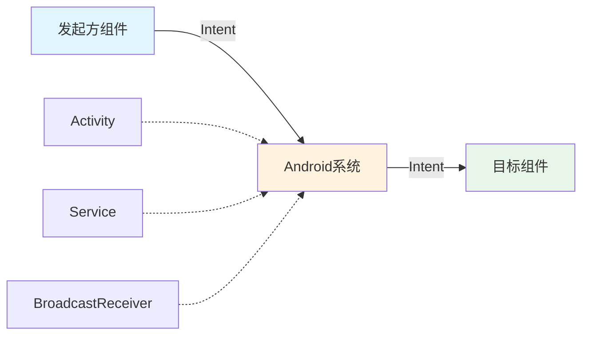
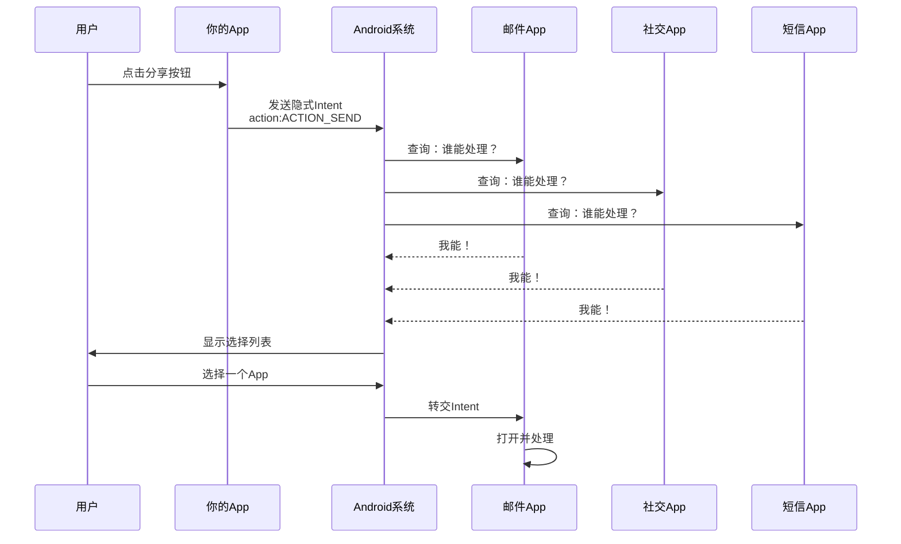
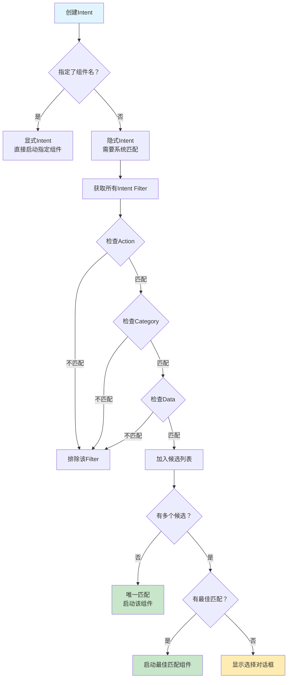

# 5.1.1 意图和意图过滤器

夕阳把整片湖面染成了蜂蜜色的琥珀。

洛芙跪在草地上，双手撑着脸颊，目不转睛地看着希尔在手机上点点戳戳。伊莎坐在她旁边，手里编着一根狗尾草，黛琳则在一旁整理着她们今晚的食谱清单。

“找到了！就是这个功能。”希尔兴奋地把手机举到大家面前，屏幕上是一个App的分享按钮，“你们看，点击这个按钮，系统就会弹出一个列表，让用户选择要用哪个App来分享内容。”

“好厉害！”洛芙眨巴着眼睛，“可是……系统怎么会知道有哪些App可以用来分享呢？”

黛琳抬起头，眼神里闪着那种“我就知道你会有问题”的柔和光芒。

“这就涉及到Android系统里一个非常核心的概念了——Intent，以及它的好伙伴Intent Filter。”

“印亨特？”洛芙歪着脑袋，“是‘意图’的意思吗？”

“对，就是意图。”伊莎轻轻把编好的草戒指戴在洛芙手指上，“你想啊，当我们点击分享按钮的时候，我们的‘意图’是什么呢？”

“当然是把内容分享出去呀！”洛芙不假思索地说。

“没错。”黛琳走到她身边，蹲下来，“但是Android系统不知道你具体想怎么做——你是想发送给朋友？还是发布到社交媒体？是想发邮件？还是发短信？系统只是知道‘你想分享点什么东西’，然后它就会去问所有表示‘我能帮你分享’的App：‘嘿，这里有人想分享东西，你们谁来处理？’”

“原来是这样！”洛芙的眼睛亮了起来，“那些说‘我能帮你分享’的App，就是通过Intent Filter来报名的？”

“完全正确。”希尔打了个响指，“走，我们去帐篷里慢慢聊，今天晚饭前我教你们写一个最简单的Intent Demo！”

---

## 1.1 Intent 是什么？

夜幕降临得很快。

帐篷里亮起了温馨的小夜灯，四个女孩围坐在防潮垫上，希尔已经把她的笔记本电脑架好了。窗外传来蟋蟀的低吟，湖面上倒映着初升的月牙。

“在Android世界里，Intent就像是一个邮递员。”伊莎首先开口，她的比喻总是那么诗意，“当你想要做某件事的时候，比如打开一个网页、发送一条短信、或者启动相机拍照，你不需要亲自去处理这些琐事，你只需要写一封信——这就是Intent——然后交给系统的邮递员，它会把信送到能处理这件事的人手中。”

黛琳补充道：“从技术角度来说，Intent是一个消息对象，用于在不同的组件之间传递信息、请求执行某个操作。组件可以是Activity、Service或者BroadcastReceiver。”

洛芙举手：“那……Activity又是什么？”

“Activity你可以把它想象成一个App的‘一页’。”希尔想了想，“就像一本绘本的每一页都是一个完整的画面，Android App的每一个屏幕就是一个Activity。打开App时看到的第一个画面就是第一个Activity，点击按钮跳转到下一个画面，就是启动了另一个Activity。”

“所以Intent就是用来在这些‘页面’之间跳转的？”洛芙问。

“不只是跳转。”黛琳摇摇头，“Intent可以做的的事情多着呢。它可以启动一个Activity，启动一个Service（后台服务），或者发送一个广播（Broadcast）给所有关心这件事的组件。”

说着，黛琳拿起白板笔，在白板上画了起来：



“看这张图，”黛琳指着说，“发起方（比如一个按钮点击）创建了一个Intent，这个Intent会先交给Android系统，系统会根据Intent的内容和设置，去找到最合适的处理者。”

“系统怎么会知道谁最合适呢？”洛芙好奇地问。

“这就分两种情况了。”希尔接过话题，“一种是显式Intent，一种是隐式Intent。让我分别给你们解释。”

---

## 1.2 显式Intent和隐式Intent

月光从帐篷的缝隙里漏进来，在地上洒下斑驳的光影。

“显式Intent呢，就像你在信封上写明了收件人的名字和地址。”伊莎温柔地解释道，“你知道要找谁，直接写上：‘致：活动详情页面Activity，地址：com.example.app.DetailActivity’。系统看到这个，就直接把钱送给指定的那个人。”

“代码写起来也很简单——”希尔把电脑转过来，让大家都能看见屏幕：

```kotlin
// 显式Intent示例：明确指定要启动的组件
// 第一个参数：上下文（这里用this，代表当前Activity）
// 第二个参数：要启动的目标Activity的Class对象
val explicitIntent = Intent(this, DetailActivity::class.java)

// 如果需要传递数据，可以这样：
explicitIntent.putExtra("user_name", "洛芙")
explicitIntent.putExtra("user_age", 18)

// 启动Activity
startActivity(explicitIntent)
```

洛芙凑近屏幕：“`putExtra`就是往信封里塞小纸条吗？”

“没错！”希尔笑着点头，“你可以往Intent里塞各种类型的数据——字符串、数字、布尔值，甚至是一个对象。”

“那隐式Intent呢？”洛芙又问。

“隐式Intent嘛……”伊莎把手中的狗尾草绕在指间，“就像你写了一封信，说‘我想分享这张照片’，但是你没有写具体要给谁。系统会拿着这封信，问所有登记过‘我能帮忙分享照片’的App：‘你们谁能处理？’然后弹出一个列表，让用户选择用哪个App。”

黛琳在白板上画了另一张图：



“系统怎么会知道哪些App能处理呢？”洛芙问。

“这就是Intent Filter的功劳了！”希尔兴奋地说，“每个App都可以在AndroidManifest.xml里声明：‘嘿，我能够处理这种类型的请求！’这个声明就叫做Intent Filter。”

---

## 1.3 Intent Filter：组件的“自我介绍”

露营的夜晚有些凉了，伊莎把薄外套裹紧了一些。

“Intent Filter，你可以把它想象成每个App的‘能力清单’。”伊莎说，“当一个App安装到手机上时，它会向系统提交一份清单，上面写着：‘我会做这些事情——我能打开网页，我能拍照，我能发送邮件……’这就是Intent Filter。”

黛琳补充道：“从代码角度来说，Intent Filter是一个XML配置，定义在AndroidManifest.xml文件中。它主要包含三个部分：action（动作）、data（数据）、category（类别）。”

“听起来好像很复杂的样子……”洛芙微微皱眉。

“没关系，我们一个一个来。”希尔安慰道，“先看action——你想要做什么。”

希尔在电脑上敲了起来：

```xml
<!-- AndroidManifest.xml 中的 Intent Filter 配置 -->
<activity android:name=".ShareActivity">
    <intent-filter>
        <!-- action: 表示这个组件能执行什么动作 -->
        <!-- android:name 是标准的系统动作，这里表示"发送" -->
        <action android:name="android.intent.action.SEND" />
        
        <!-- category: 表示这个组件的类别 -->
        <!-- DEFAULT 是必须添加的，否则隐式Intent无法匹配 -->
        <category android:name="android.intent.category.DEFAULT" />
        
        <!-- data: 表示这个组件能处理什么类型的数据 -->
        <!-- 这里表示能处理任意类型的文本 -->
        <data android:mimeType="text/*" />
    </intent-filter>
</activity>
```

洛芙盯着屏幕看了一会儿：“这个……我能理解为这是一个‘愿意帮忙发送消息的人’的自我介绍吗？”

“太对了！”伊莎轻轻鼓掌，“你想想看，如果你想分享一条文字内容，系统就会去问所有在清单上写着‘我会执行SEND动作’、‘我能处理文字数据’的App：‘你们谁想来处理？’然后这些App就会出现在用户的可选列表里。”

“原来如此！”洛芙开心地说，“所以Intent Filter就是告诉系统‘我能做什么’的声明！”

“正是如此。”黛琳点点头，“而且一个组件可以声明多个Intent Filter，这样它就可以响应多种不同的请求。”

---

## 1.4 Intent的解析过程

夜空中星星越来越多，洛芙偶尔抬头看几眼，又赶紧把注意力转回屏幕。

“系统是怎么决定把Intent送给哪个组件的呢？”洛芙问，“如果好几个App都说自己能处理，那怎么办？”

“这是一个很好的问题。”黛琳指着白板说，“这个过程叫做Intent解析，或者Intent Resolution。系统会按照一定的规则来筛选最合适的组件。”



“首先，”黛琳开始解释，“如果你的Intent明确指定了组件名（显式Intent），那就没得选了，系统直接把钱送到指定地址。”

“如果没指定呢？”洛芙问。

“如果没指定，系统就要开始做‘选择题’了。”希尔说，“它会找出所有声明了相应Intent Filter的组件，然后一个一个检查：”

“**第一步：检查Action**。你的Intent说‘我想做这件事’，组件的Filter也说‘我能做这件事’，这才能通过第一关。”

“**第二步：检查Category**。你的Intent可能还带着一些‘标签’，比如‘这是给浏览器的’、‘这是给相机的’，组件的Filter也要匹配这些标签。”

“**第三步：检查Data**。你的Intent可能带着数据，比如‘这是一张图片’、‘这是一个网页链接’，组件的Filter要声明自己能处理这种类型的数据。”

“如果一个组件的Filter全部通过了这三关，那它就进入了候选名单。”黛琳说，“如果只有一个候选，那就直接启动它。如果有多个候选……”

“就会弹出那个选择对话框！”洛芙抢着说，“就像点击分享按钮时弹出的那个列表一样！”

“没错！”希尔笑着点头，“不过系统还有一个‘最佳匹配’机制——如果有一个组件的匹配度明显高于其他，它就会直接启动，不会让用户选择。”

---

## 1.5 Intent的高级用法

露营的夜晚渐渐深了，蟋蟀的歌声却越来越响亮。

“Intent只能用来启动Activity吗？”洛芙问。

“那可不止。”黛琳笑着说，“Intent还可以启动Service、处理广播，甚至可以在Activity之间传递数据。”

“Service是什么？”洛芙问。

“Service你可以把它想象成一个‘后台工作者’。”伊莎说，“它不像Activity那样有界面，它就在后台默默做事，比如播放音乐、下载文件、或者检查新消息。”

希尔补充道：“启动Service和启动Activity的代码很像，但是用的是不同的方法：”

```kotlin
// 启动一个Service（显式Intent）
val serviceIntent = Intent(this, MyDownloadService::class.java)
serviceIntent.putExtra("download_url", "https://example.com/file.pdf")
startService(serviceIntent)

// 停止Service
stopService(serviceIntent)

// 如果需要Service和Activity绑定（Binder方式）
val bindIntent = Intent(this, MyBoundService::class.java)
bindService(bindIntent, serviceConnection, Context.BIND_AUTO_CREATE)
```

“除了启动Service，Intent还有一个很重要的用途——在组件之间传递数据。”黛琳说，“这在Android开发中非常常见。”

```kotlin
// 在Activity A 中发送数据
val intent = Intent(this, ActivityB::class.java)
intent.putExtra("string_key", "你好！")
intent.putExtra("int_key", 42)
intent.putExtra("boolean_key", true)

// 传递Bundle（可以封装多个数据）
val bundle = Bundle()
bundle.putString("name", "洛芙")
bundle.putInt("age", 18)
bundle.putBoolean("is_student", true)
intent.putExtra("bundle_key", bundle)

// 传递可序列化对象（需要实现Serializable或Parcelable）
val user = User("洛芙", 18)
intent.putExtra("user_object", user)

// 启动并传递数据
startActivity(intent)
```

“在Activity B 中接收数据：”希尔继续写道：

```kotlin
class ActivityB : AppCompatActivity() {
    override fun onCreate(savedInstanceState: Bundle?) {
        super.onCreate(savedInstanceState)
        
        // 接收单个数据
        val message = intent.getStringExtra("string_key")
        val number = intent.getIntExtra("int_key", 0)  // 第二个参数是默认值
        val flag = intent.getBooleanExtra("boolean_key", false)
        
        // 接收Bundle
        val bundle = intent.getBundleExtra("bundle_key")
        val name = bundle?.getString("name")
        val age = bundle?.getInt("age")
        
        // 接收可序列化对象
        // 方法1：使用 Serializable（较慢，不推荐）
        val user1 = intent.getSerializableExtra("user_object") as? User
        
        // 方法2：使用 Parcelable（推荐，性能好）
        val user2 = intent.getParcelableExtra<User>("user_object")
    }
}

// 定义一个Parcelable数据类
data class User(val name: String, val age: Int) : Parcelable {
    constructor(parcel: Parcel) : this(
        parcel.readString() ?: "",
        parcel.readInt()
    )
    
    override fun writeToParcel(parcel: Parcel, flags: Int) {
        parcel.writeString(name)
        parcel.writeInt(age)
    }
    
    override fun describeContents(): Int = 0
    
    companion object CREATOR : Parcelable.Creator<User> {
        override fun createFromParcel(parcel: Parcel): User {
            return User(parcel)
        }
        
        override fun newArray(size: Int): Array<User?> {
            return arrayOfNulls(size)
        }
    }
}
```

“哇……传递数据这么复杂啊。”洛芙感叹道。

“其实最常用的就是`putExtra`和`getStringExtra`这些方法啦。”希尔说，“Parcelable是Android推荐的方式，特别是对于复杂对象。不过对于简单数据，直接用Extra就够了。”

---

## 1.6 反模式：这些错误不要犯

月亮已经升到头顶了，露营地上笼罩着一层银色的光华。

“你们知道吗？”黛琳的表情突然变得认真起来，“我刚开始学Android的时候，在Intent上踩过不少坑。今天把这些经验教训告诉你们，可别重蹈覆辙啊。”

“什么坑？”洛芙顿时来了兴趣。

“**第一个坑：忘记添加DEFAULT category**。”

黛琳在白板上写下了反模式对比：

```kotlin
// ❌ 错误写法：Intent Filter缺少DEFAULT category
// AndroidManifest.xml
<intent-filter>
    <action android:name="android.intent.action.SEND" />
    <!-- 缺少 category android:name="android.intent.category.DEFAULT" -->
    <data android:mimeType="text/plain" />
</intent-filter>

// 这个Filter永远不会匹配隐式Intent！
// 因为隐式Intent会默认添加DEFAULT category

// ✅ 正确写法：必须添加DEFAULT category
<intent-filter>
    <action android:name="android.intent.action.SEND" />
    <category android:name="android.intent.category.DEFAULT" />
    <data android:mimeType="text/plain" />
</intent-filter>
```

“为什么呀？”洛芙不解地问。

“因为当你创建一个隐式Intent并调用`startActivity()`时，系统会自动给你的Intent加上`DEFAULT`这个category。”黛琳解释道，“如果你的Filter没有声明自己能接受`DEFAULT` category，那就相当于你写了一个‘只接受特定人群’的清单，但是寄信人根本不知道该写什么地址——永远匹配不上！”

“原来如此！”洛芙认真地在心里记了一笔。

“**第二个坑：在主线程做耗时操作**。”

希尔又调出一段代码：

```kotlin
// ❌ 错误写法：在Activity的onCreate里做耗时操作
class BadActivity : AppCompatActivity() {
    override fun onCreate(savedInstanceState: Bundle?) {
        super.onCreate(savedInstanceState)
        
        // 模拟网络请求 - 这会阻塞UI线程！
        val data = fetchDataFromNetwork()  // 假设这是一个耗时操作
        // 如果这个操作超过5秒，Android会弹出ANR对话框
        // Application Not Responding - 应用无响应
    }
    
    private fun fetchDataFromNetwork(): String {
        Thread.sleep(5000) // 模拟5秒的网络请求
        return "数据"
    }
}

// ✅ 正确写法：使用后台线程或协程
class GoodActivity : AppCompatActivity() {
    override fun onCreate(savedInstanceState: Bundle?) {
        super.onCreate(savedInstanceState)
        
        // 使用协程在后台线程执行网络请求
        lifecycleScope.launch(Dispatchers.IO) {
            val data = fetchDataFromNetwork()
            
            // 回到主线程更新UI
            withContext(Dispatchers.Main) {
                updateUI(data)
            }
        }
    }
    
    private suspend fun fetchDataFromNetwork(): String {
        // 这里可以写真正的网络请求代码
        delay(5000)  // 模拟异步操作
        return "数据"
    }
}
```

洛芙吐了吐舌头：“ANR……听起来好可怕。”

“Android对主线程的响应性要求很高，”黛琳说，“如果在主线程（也叫UI线程）上做耗时操作，超过5秒就会弹出ANR对话框。所以一定要记住：网络请求、文件读写、复杂计算……这些都要放到后台线程去做。”

“**第三个坑：Intent传递大数据**。”

伊莎轻轻地说：“Intent不是万能的，它能传递的数据量是有限制的。”

```kotlin
// ❌ 错误写法：传递过大的数据
val intent = Intent(this, TargetActivity::class.java)
// 传递大图片或大文件 - 可能导致TransactionTooLargeException
val largeBitmap = BitmapFactory.decodeResource(resources, R.drawable.huge_image)
intent.putExtra("large_image", largeBitmap)  // 危险！
startActivity(intent)

// ✅ 正确写法：使用全局可访问的缓存
// 方案1：使用Application级别的缓存
class MyApplication : Application() {
    var sharedImage: Bitmap? = null
}

val app = application as MyApplication
app.sharedImage = largeBitmap

val intent = Intent(this, TargetActivity::class.java)
startActivity(intent)

// 在TargetActivity中读取
val image = (application as MyApplication).sharedImage

// 方案2：使用文件存储 + 文件路径
val file = File(filesDir, "shared_image.png")
largeBitmap.writeToFile(file)
val intent = Intent(this, TargetActivity::class.java)
intent.putExtra("image_path", file.absolutePath)
startActivity(intent)

// 在TargetActivity中读取
val path = intent.getStringExtra("image_path")
val image = BitmapFactory.decodeFile(path)
```

“Intent的底层实现是Binder机制，数据需要经过进程间通信。”黛琳补充道，“Binder对传输的数据大小有限制，一般是1MB左右。超过这个大小，就会抛出`TransactionTooLargeException`。”

洛芙长舒一口气：“原来Intent看似简单，里面有这么多门道啊！”

---

## 1.7 常见的系统Action

夜色已深，帐篷外的湖面泛着微微的波光。伊莎打了个小哈欠。

“最后，给你们介绍一下Android系统中一些最常用的标准Action。”希尔说，“这些Action是系统定义好的，任何App都可以使用：”

```kotlin
// 1. 打开网页
val webIntent = Intent(Intent.ACTION_VIEW, Uri.parse("https://www.example.com"))
startActivity(webIntent)

// 2. 拨打电话
val phoneIntent = Intent(Intent.ACTION_DIAL, Uri.parse("tel:1234567890"))
startActivity(phoneIntent)

// 3. 发送短信
val smsIntent = Intent(Intent.ACTION_SENDTO, Uri.parse("smsto:1234567890"))
smsIntent.putExtra("sms_body", "你好！")
startActivity(smsIntent)

// 4. 发送邮件
val emailIntent = Intent(Intent.ACTION_SEND).apply {
    type = "message/rfc822"
    putExtra(Intent.EXTRA_EMAIL, arrayOf("example@example.com"))
    putExtra(Intent.EXTRA_SUBJECT, "主题")
    putExtra(Intent.EXTRA_TEXT, "正文")
}
startActivity(emailIntent)

// 5. 拍照
val cameraIntent = Intent(MediaStore.ACTION_IMAGE_CAPTURE)
if (cameraIntent.resolveActivity(packageManager) != null) {
    startActivity(cameraIntent)
}

// 6. 选择联系人
val contactIntent = Intent(Intent.ACTION_PICK, Uri.parse("content://contacts/people"))
startActivityForResult(contactIntent, REQUEST_CODE_PICK_CONTACT)

// 7. 分享文本（会弹出选择列表）
val shareIntent = Intent(Intent.ACTION_SEND).apply {
    type = "text/plain"
    putExtra(Intent.EXTRA_TEXT, "来看看这个有趣的内容！")
}
startActivity(Intent.createChooser(shareIntent, "分享到..."))

// 8. 播放视频
val videoIntent = Intent(Intent.ACTION_VIEW, Uri.parse("file:///sdcard/video.mp4"))
startActivity(videoIntent)

// 9. 安装APK
val installIntent = Intent(Intent.ACTION_VIEW).apply {
    setDataAndType(Uri.fromFile(apkFile), "application/vnd.android.package-archive")
}
startActivity(installIntent)

// 10. 打开设置
val settingsIntent = Intent(Settings.ACTION_WIRELESS_SETTINGS)
startActivity(settingsIntent)
```

“这些都是非常实用的功能！”洛芙惊呼，“那如果我想让我的App也能响应这些Intent呢？”

“那就需要在你的AndroidManifest.xml里添加相应的Intent Filter了。”黛琳笑着说，“比如你想让你的App能处理网页链接，就添加一个Filter，声明你能响应`ACTION_VIEW`，并处理`http`和`https`协议的data。”

“今天的知识真是太多了……”洛芙揉了揉眼睛，“不过感觉对Intent的理解清晰了很多！”

“那是因为你很聪明呀。”伊莎温柔地说，“来，我们休息一下吧，明天还有更多有趣的东西等着我们呢。”

---

月亮已经完全升起来了，银色的光芒洒在湖面上，也洒在四个女孩安心的笑容上。

洛芙躺在睡袋里，回想着今天学到的知识：Intent就像邮递员，显式Intent是指定地址的送信，隐式Intent是询问谁能帮忙，Intent Filter就是每个App的能力清单……

想着想着，她慢慢地进入了梦乡。

---

> 学习建议

1. **动手实践**：尝试在Android Studio中创建一个简单的App，实现点击按钮打开系统浏览器、相机或分享功能。实践是理解Intent最好的方式。

2. **阅读源码**：在熟悉了基本用法后，可以尝试阅读Android系统App（如联系人、相册）的AndroidManifest.xml，观察它们是如何声明Intent Filter的。

3. **注意安全**：隐式Intent可能会启动外部App，这在带来便利的同时也带来了安全风险。在开发时要注意验证Intent的来源和目标。

4. **性能意识**：记住Intent不是万能的数据传递工具，大数据要使用其他方式（如文件、数据库）。

---

## 洛芙的小小日记本

今天学会了用Intent这个“邮递员”在Android世界里传递消息！显式Intent像指定地址的挂号信，隐式Intent像问“谁能帮忙”的寻人启事。伊莎说Intent Filter是每个App的能力清单，好形象呀～不过黛琳说的那些坑要记住：DEFAULT category不能忘，耗时操作别放主线程，还有Intent传不了太大数据！明天继续加油！✨

---

## 今日关键词

**Intent（意图）**：Android组件间的通信信使，用于请求执行某个操作、传递数据。可以启动Activity、Service或发送Broadcast。

**显式Intent（Explicit Intent）**：明确指定目标组件的Intent，通过组件名直接定位，适用于已知目标组件的情况。

**隐式Intent（Implicit Intent）**：不指定目标组件的Intent，只描述要执行的动作，由系统匹配最合适的组件。

**Intent Filter（意图过滤器）**：在AndroidManifest.xml中声明的组件能力清单，定义了组件能响应哪些Intent。

**Action（动作）**：Intent的核心属性，表示要执行的操作，如VIEW、SEND、CAPTURE等。

**Category（类别）**：Intent的附加属性，用于进一步描述Intent的类别，如DEFAULT、BROWSABLE等。

**Data（数据）**：Intent中要操作的数据，如URI、MIME类型。

**Parcelable**：Android推荐的对象序列化方式，比Serializable性能更好，用于在Intent中传递复杂对象。

**ANR（Application Not Responding）**：应用无响应，通常是因为在主线程执行了耗时操作。

**PendingIntent**：一种特殊的Intent包装器，用于授权外部应用在将来某个时刻以当前应用的身份执行操作，常用于通知和桌面小部件。
