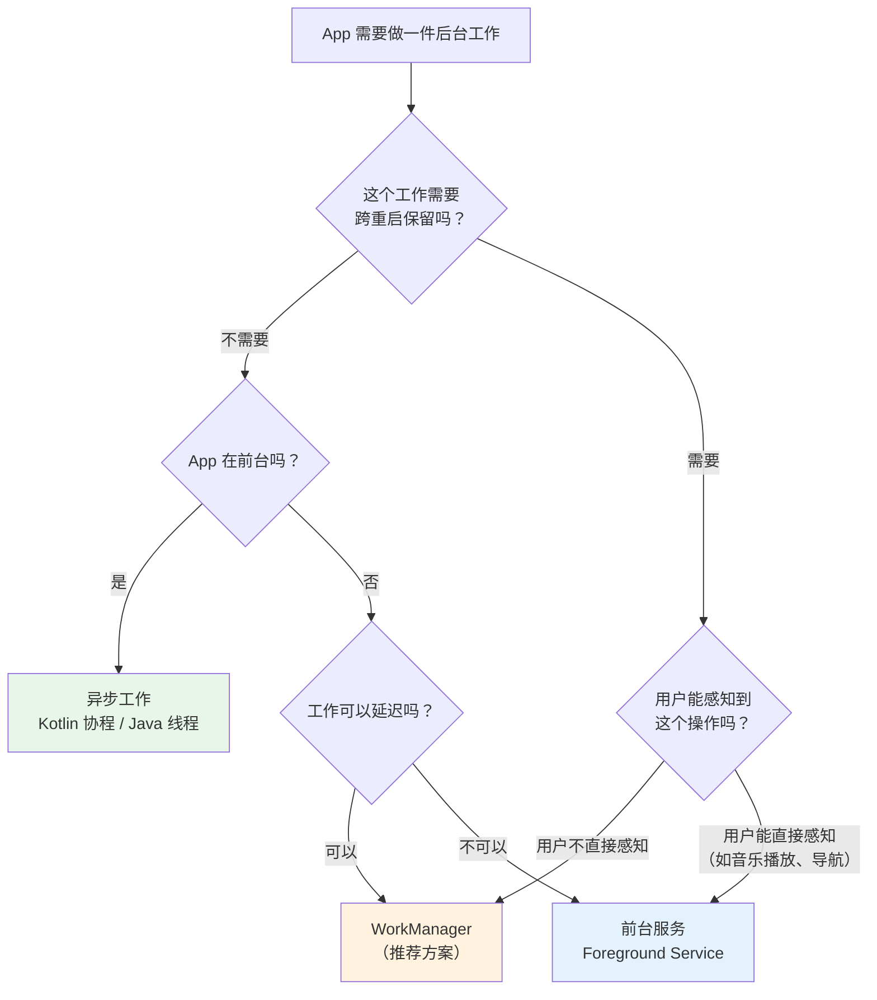
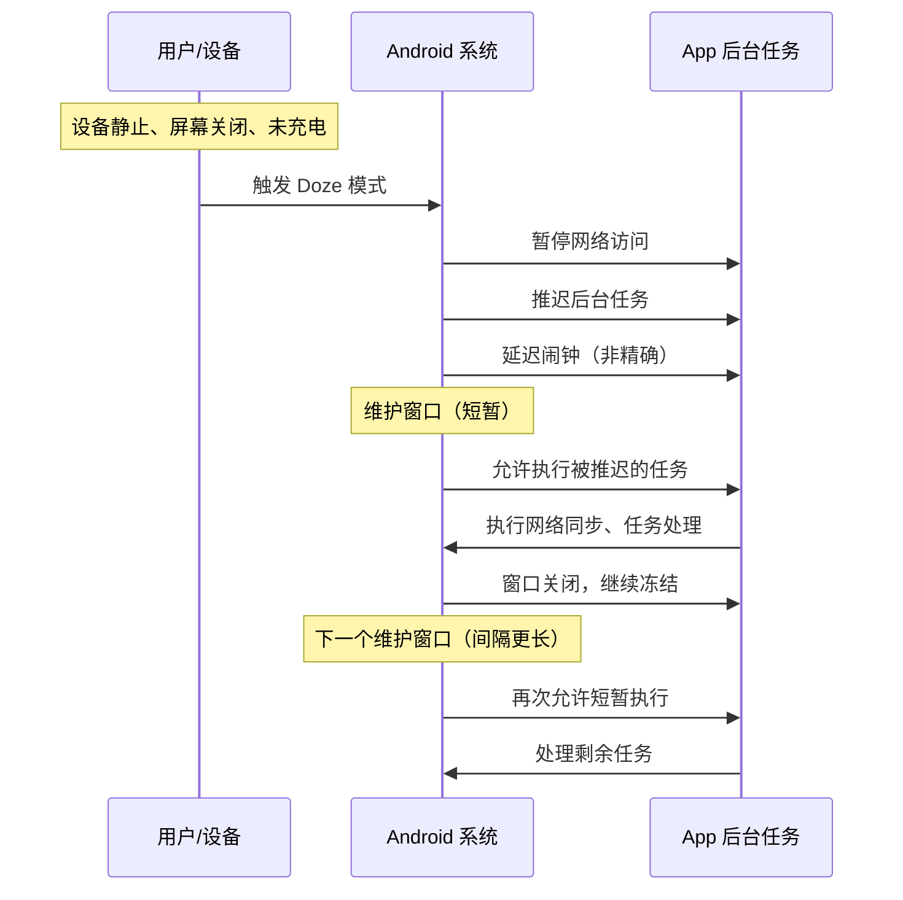
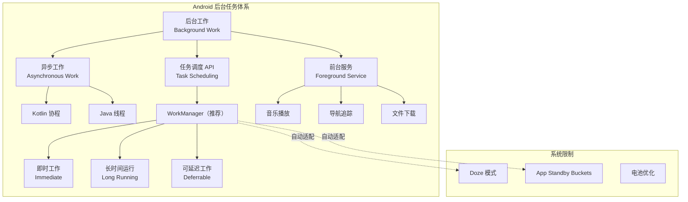

## 6.1.1 星空下的守夜人

篝火"噼啪"响了一声，一粒火星弹到半空，旋转着消失在夜色里。

洛芙缩了缩脖子。入秋以来，夜里的凉意一天比一天更认真了。湖面在黑暗中沉默着，只有偶尔一圈涟漪折射出星星的碎光——像谁往水里丢了一把银币。

晚饭后的营地安静了下来。黛琳往篝火里加了一根松枝，火苗蹿高了几厘米，空气里立刻弥漫开松脂被灼烧的清甜味道。伊莎抱着保温杯靠在折叠椅上，眼睛半闭着，像是在听什么远处的声音。希尔盘腿坐在防潮垫上，膝盖上摊着笔记本电脑，屏幕的蓝白光映在她脸上。

"嘿，你们有没有注意到——"希尔忽然抬起头，"我之前写的那个露营天气 App，退出之后就什么都不干了。"

洛芙正把棉花糖往树枝上串，闻言歪过头来："什么意思？"

"就是说，"希尔把电脑屏幕转向大家，"我设了一个每隔两小时同步天气数据的功能，但只要用户把 App 切到后台或者杀掉进程，同步就断了。第二天早上打开，数据还是昨晚的。"

洛芙想了想："那……就让它一直在后台跑着不就好了？"

希尔苦笑了一声："如果每个 App 都这么想，你的手机电池大概撑不到中午。"

黛琳放下手里的热可可，杯口冒出的白雾在篝火的暖光里慢慢散开。

"这就是今晚我们要聊的事——**后台任务**。"

她的声音不紧不慢，像湖面的涟漪一样自然地展开。

"Android 系统对后台工作有非常严格的管理。不是你想跑就能跑的。理解这件事，是写出省电、稳定、不被系统杀掉的 App 的第一步。"

秋虫在远处低低地叫着，篝火把四个人的影子拉得很长。

---

伊莎睁开眼睛，坐直了一点。

"你想象一下，"她说，"一个露营地就是一部手机。白天大家都在活动——烧水、搭帐篷、做饭——这是'前台'。到了晚上，大部分人都睡了，但总有些事情还得有人照看。"

她指了指篝火。

"比如这堆火，有人得守夜添柴，对不对？但是你不能让所有人都不睡觉守火——那第二天谁也走不动路。"

洛芙咬了一口烤棉花糖，若有所思地点点头。

"所以，"伊莎继续说，"露营地必须有规矩：哪些事情可以在'大家活动的时候'顺手做完，哪些事情需要安排专门的'守夜人'，哪些事情必须让大家知道有人在做——这三种，恰好对应 Android 后台任务的三大类别。"

黛琳从口袋里掏出一支白板笔——她居然随身带着白板笔——在便携小白板上画了三个框。

"Android 官方把后台工作分成三类。"

她在第一个框里写下两个字。

"第一类，**异步工作**（Asynchronous work）。"

"异步？"洛芙眨了眨眼。

"就是'在后厨同时做两道菜'，"黛琳说，"App 在前台运行的时候，主线程负责画界面、响应点击。但有些操作比较耗时——比如发一个网络请求、读一大堆数据库记录——如果也放在主线程上做，界面就会卡住。所以我们把这些工作丢到别的线程上去做，这就是异步工作。"

"Kotlin 里面用**协程**（Coroutines），Java 里面用**线程**（Threads）来实现，"希尔补充，"关键特点是：这些工作只在 App 活着的时候运行。App 被杀了，工作就没了。不需要跨重启保留。"

黛琳在第二个框里写下"任务调度"。

"第二类，**任务调度 API**（Task scheduling APIs）——也就是需要**持久化**的后台工作。"

洛芙的棉花糖快掉了，她赶紧用手接住。

"持久化是什么意思？"

"意思是这个任务就算 App 被杀了、手机重启了，它仍然会被执行，"黛琳说，"比如你的 App 需要每天凌晨两点把日志上传到服务器——用户已经睡了，App 也不在前台——但这个任务不能丢。系统重启之后，它还得接着干。"

"Android 官方推荐用 **WorkManager** 来处理这类工作。"

黛琳在第二个框旁边重重画了个星号。

"第三类，"她在第三个框里写下最后几个字，"**前台服务**（Foreground services）。"

"这个我知道一点，"洛芙举手，"就是像音乐播放器那样，你能在通知栏看到它在运行？"

"没错，"黛琳点点头，"前台服务是用户**可见的**后台操作。它必须在通知栏显示一条通知，让用户知道'嘿，这个 App 正在做某件事'。常见的场景比如导航 App 持续追踪位置、音乐 App 播放歌曲。"

伊莎微笑着总结："所以三类就是——顺手做完的杂活、预约好的守夜值班、大家都能看到的明火守夜。"

洛芙"哦哦哦"了一声，然后问："那我怎么知道该用哪一类？"

黛琳把白板擦干净，画了一张新的图。

"我给你画一张选择流程。"



> 图 1：后台任务类别选择流程图。根据"是否需要持久化"和"用户是否可见"两个维度，将后台工作分配到正确的 API。

洛芙盯着白板看了好一会儿，手指在空中比划着沿流程线走了一遍。

"所以希尔你那个天气同步——App 被杀了还需要继续同步，用户不需要看到它——应该用 WorkManager？"

"答对了！"希尔打了个响指，"问得好！"

篝火又"噼啪"响了一声。黛琳往火里丢了片干树皮，橙色的火光在她镜片上跳了一下。

---

"既然 WorkManager 这么重要，我们今晚就重点聊它，"黛琳说。

"WorkManager 是 Jetpack 库的一部分，"她解释道，"它的定位很明确——处理**需要持久化的后台工作**。就是说，不管 App 进程在不在、设备有没有重启过，只要你把任务交给 WorkManager，它就会确保任务被执行。"

伊莎抬起手指："你想象一下，WorkManager 就像营地的值班簿。你把任务写进簿子里，哪怕今晚值班的人换了几轮、中途下了一场雨大家躲进帐篷，只要翻开簿子，下一个值班的人就知道该做什么。"

"它用 SQLite 把任务信息自动存下来，"希尔说，"所以即使进程被杀、设备重启，任务也不会丢。"

洛芙"哇"了一声。

"WorkManager 支持三种工作类型，"黛琳竖起三根手指。

"第一种，**即时工作**（Immediate）——必须立即开始并在短时间内完成的任务。你可以对它做**加速**处理，让系统优先调度。"

"第二种，**长时间运行的工作**（Long Running）——可能会超过十分钟。比如下载一个大文件、压缩一堆照片。"

"第三种，**可延迟工作**（Deferrable）——不需要立刻执行，可以安排在稍后某个时间点开始。这种还能设成**周期性运行**，比如每隔六小时同步一次数据。"

洛芙用树枝在沙地上记笔记，字迹歪歪扭扭的。

"那 WorkManager 还有哪些厉害的地方？"

希尔扳着手指开始数："功能清单可长了——"

"**工作约束**（Constraints）：你可以设定条件，比如'只在连接 Wi-Fi 时执行'、'只在设备充电时执行'、'只在设备空闲时执行'。不满足条件，任务就等着。"

"**健壮的调度**：支持一次性执行和周期性执行，最小周期间隔是 15 分钟。"

"**自动持久化**：通过内部的 SQLite 数据库，任务信息跨进程、跨重启保留。"

"**加急工作**（Expedited work）：对紧急任务可以请求加速执行。"

"**灵活的重试策略**：任务失败了可以按**指数退避**（exponential backoff）自动重试——第一次等 30 秒，第二次等 60 秒，第三次等 120 秒，以此类推。"

"**工作链**（Work chaining）：可以把多个任务串起来，前一个完成了再执行下一个。复杂的关联任务就是这么处理的。"

"**遵守省电特性**：自动适配 Doze 模式和 App Standby，不会和系统的省电策略打架。"

洛芙的树枝写到一半折了。她换了一根，继续写。

"等一下，"她忽然抬头，"Doze 模式是什么？"

黛琳点点头："好问题。这个我们等会儿聊系统限制的时候再详细说。先把 WorkManager 的用法看一遍。"

---

希尔把电脑转了个方向，让大家都能看到屏幕。

"来，我写一个最简单的 WorkManager 示例——后台上传露营日志。"

```kotlin
// build.gradle 依赖：
// implementation("androidx.work:work-runtime-ktx:2.9.0")

import android.content.Context
import androidx.work.*
import kotlinx.coroutines.delay

// 定义一个 Worker，继承 CoroutineWorker
// CoroutineWorker 的 doWork() 是挂起函数，可直接使用协程
class UploadLogWorker(
    appContext: Context,
    params: WorkerParameters
) : CoroutineWorker(appContext, params) {

    override suspend fun doWork(): Result {
        // 从 inputData 中获取日志文件路径
        val logPath = inputData.getString("log_path")
            ?: return Result.failure()

        return try {
            // 模拟上传操作（实际项目中替换为网络请求）
            uploadToServer(logPath)
            Result.success()
        } catch (e: Exception) {
            // 返回 retry 表示任务失败但可以重试
            Result.retry()
        }
    }

    private suspend fun uploadToServer(path: String) {
        // 实际项目中使用 Retrofit / OkHttp 等网络库
        delay(3000)
    }
}
```

"这就是一个最基本的 Worker，"希尔说，"继承 `CoroutineWorker`，重写 `doWork()` 方法，成功返回 `Result.success()`，失败返回 `Result.failure()` 或 `Result.retry()`。"

洛芙歪着头看了一会儿："看起来好像也没有想象中那么难？"

"Worker 本身确实简单，"黛琳接过话头，"关键在于怎么提交和配置这个 Worker。来看看怎么构建一个 WorkRequest。"

希尔又敲了一段代码：

```kotlin
import androidx.work.*
import java.util.concurrent.TimeUnit

// === 一次性任务 ===
// 构造输入数据：传递日志文件路径给 Worker
val inputData = workDataOf("log_path" to "/storage/camp_log_1020.txt")

// 设置约束条件：只在连接网络且电量不低时执行
val constraints = Constraints.Builder()
    .setRequiredNetworkType(NetworkType.CONNECTED)
    .setRequiresBatteryNotLow(true)
    .build()

// 构建 OneTimeWorkRequest（一次性任务）
val uploadRequest = OneTimeWorkRequestBuilder<UploadLogWorker>()
    .setInputData(inputData)
    .setConstraints(constraints)
    .setBackoffCriteria(
        BackoffPolicy.EXPONENTIAL,  // 指数退避策略
        30, TimeUnit.SECONDS        // 初始退避时间 30 秒
    )
    .build()

// 提交给 WorkManager
WorkManager.getInstance(context).enqueue(uploadRequest)

// === 周期性任务 ===
// 每 6 小时同步一次天气数据（最小周期 15 分钟）
val syncRequest = PeriodicWorkRequestBuilder<WeatherSyncWorker>(
    6, TimeUnit.HOURS
).setConstraints(
    Constraints.Builder()
        .setRequiredNetworkType(NetworkType.UNMETERED) // 仅在非计量网络（Wi-Fi）下执行
        .build()
).build()

WorkManager.getInstance(context).enqueueUniquePeriodicWork(
    "weather_sync",                          // 唯一任务名称
    ExistingPeriodicWorkPolicy.KEEP,         // 如果已存在同名任务则保留旧的
    syncRequest
)
```

> 上方代码片段对应图 1 中的 WorkManager 分支。一次性任务使用 `OneTimeWorkRequestBuilder`，周期性任务使用 `PeriodicWorkRequestBuilder`，二者都可以设定约束条件和退避策略。

洛芙看着代码，手指在空中跟着读了一遍。

"所以 `Constraints` 就是给任务设门槛——网络、电量、充电状态……不满足条件就不执行？"

"对，"黛琳说，"系统会在条件满足的时候自动唤醒你的任务。你不需要自己去轮询检查。"

"那 `BackoffPolicy.EXPONENTIAL` 就是希尔说的指数退避？"

"没错。第一次重试等 30 秒，第二次 60 秒，第三次 120 秒——每次翻倍。这样既给了重试机会，又不会疯狂重试把服务器打爆。"

风从湖面吹过来，带着水汽和草叶的气味。篝火的热气在洛芙脸上暖洋洋的。

---

"现在问题来了，"黛琳端起可可抿了一口，"很多人在写后台任务的时候，会犯一个非常经典的错误。"

希尔心领神会地笑了一下。

"我来演一个反面教材。"

她在电脑上打开一个文件：

```kotlin
// ❌ 反模式：在 Activity 中直接用线程执行持久化任务
class CampLogActivity : AppCompatActivity() {

    override fun onCreate(savedInstanceState: Bundle?) {
        super.onCreate(savedInstanceState)
        setContentView(R.layout.activity_camp_log)

        // 每次 Activity 启动就开一个线程上传日志
        Thread {
            while (true) {
                uploadLogToServer()
                Thread.sleep(6 * 60 * 60 * 1000) // 每 6 小时执行一次
            }
        }.start()
    }

    private fun uploadLogToServer() {
        // 网络请求...
    }
}
```

"这段代码有多少问题？"希尔看向洛芙。

洛芙盯着屏幕，皱起了眉头。

"嗯……它在 `onCreate` 里开了一个永远不停的线程？"

"对。第一个问题：**Activity 被销毁后线程可能泄漏**。用户旋转屏幕，`onCreate` 再次调用，又开一个新线程——线程越来越多。"

"第二个问题，"黛琳接话，"**`Thread.sleep` 不能跨进程存活**。如果系统因为内存不足杀掉了 App 进程，这个线程就彻底消失了。下次用户打开 App，它会重新从头开始——而中间那几个小时的同步全丢了。"

"第三个问题，"伊莎轻声补充，"它完全没考虑网络状态和电量。在没有 Wi-Fi 的时候也尝试上传，在电池只剩 5% 的时候也不停歇——这对用户来说是非常糟糕的体验。"

"第四个问题，"希尔竖起第四根手指，"`Thread.sleep(6 * 60 * 60 * 1000)` 在 Doze 模式下根本不会如你所愿地被唤醒。系统会把它彻底冻住。"

洛芙倒吸一口凉气："那正确的写法是什么？"

"就是我们刚才写的 WorkManager 方案，"希尔把屏幕切回之前的代码，"用 `PeriodicWorkRequest` 替代手动线程，用 `Constraints` 确保执行条件，用 SQLite 持久化确保跨重启。"

```kotlin
// ✅ 重构：使用 WorkManager 的周期性任务替代手动线程
// 对应前面的 WeatherSyncWorker + PeriodicWorkRequestBuilder 代码
// 只需在 Application.onCreate() 或合适的初始化位置调用一次 enqueue

class CampApp : Application() {
    override fun onCreate() {
        super.onCreate()

        val syncRequest = PeriodicWorkRequestBuilder<UploadLogWorker>(
            6, TimeUnit.HOURS
        ).setConstraints(
            Constraints.Builder()
                .setRequiredNetworkType(NetworkType.CONNECTED)
                .setRequiresBatteryNotLow(true)
                .build()
        ).build()

        WorkManager.getInstance(this).enqueueUniquePeriodicWork(
            "camp_log_upload",
            ExistingPeriodicWorkPolicy.KEEP,
            syncRequest
        )
    }
}
```

"在 Application 的 `onCreate` 里注册一次就行了，"黛琳说，"WorkManager 自己管理调度、持久化、约束检查、重试。你不需要自己操心线程生命周期。"

洛芙"噢——"了一声，缓缓地，像是什么东西在她脑子里接上了。

"所以就是把'自己动手守夜'变成'写进值班簿让系统来安排'。"

伊莎笑了一下："对。把控制权交给系统，但把规则写清楚。"

湖面上忽然传来一声清脆的水鸟叫，四个人同时转头看了一眼，什么也没看到——只有星光在水面上碎成一片。

---

"说到异步工作，"黛琳把话题往回收了一下，"我们也不能跳过。毕竟大部分简单的后台操作，用协程就够了。"

"异步工作适用于 **App 在前台运行时的并发操作**，"她说，"比如从数据库读一条记录、发一个网络请求、解析一段 JSON。这些操作不需要在 App 退出后继续执行，也不需要跨重启保留。"

"在 Kotlin 里，官方推荐用**协程**来处理异步工作，"希尔敲了几行代码。

```kotlin
import kotlinx.coroutines.*

// 在 ViewModel 中使用协程执行异步操作
class CampLogViewModel : ViewModel() {

    fun loadRecentLogs() {
        // viewModelScope 会在 ViewModel 被清除时自动取消协程
        viewModelScope.launch {
            // withContext(Dispatchers.IO) 将耗时操作切换到 IO 线程
            val logs = withContext(Dispatchers.IO) {
                repository.fetchRecentLogs()
            }
            // 回到主线程更新 UI
            _uiState.value = UiState.Success(logs)
        }
    }
}
```

"注意 `viewModelScope`，"黛琳说，"它和 ViewModel 的生命周期绑定。ViewModel 被清除的时候，所有通过 `viewModelScope` 启动的协程会自动取消——不用你手动管理。"

"Java 那边的话，"希尔补充道，"一般用 `Executor` 或者 `Thread` 来做类似的事情。但 Kotlin 协程在语法上更简洁，也更安全——编译器会帮你检查挂起点。"

洛芙趴在膝盖上想了一会儿。

"那协程和 WorkManager 的区别就是——协程适合'用完就扔'的短任务，WorkManager 适合'必须完成'的长任务？"

"可以这么理解，"黛琳说，"更准确地说：**协程不保证任务一定完成**。如果进程被杀，协程就没了。WorkManager **保证任务最终会被执行**，哪怕经历了进程死亡和设备重启。"

---

"最后聊聊前台服务吧，"黛琳说。

月亮从云层后面探出来，在湖面上铺了一层冷冷的银光。

"前台服务用于**用户能直接感知到的后台操作**，"她说，"它必须在通知栏显示一条持续的通知。典型场景比如——"

"音乐播放！"洛芙抢答。

"对。还有实时导航、运动追踪、文件下载进度条——用户能看到、也期望它持续运行的操作。"

"前台服务比普通后台服务有更高的优先级，"希尔说，"系统不太会杀掉正在运行前台服务的进程。但代价是你**必须**显示通知——用户有权知道你的 App 正在做什么。"

"而且从 Android 12 开始，"黛琳加了一句，"前台服务有更严格的启动限制。App 在后台时不能随意启动前台服务——这是为了防止滥用。"

洛芙把这一点记在了沙地上。

"那如果我的任务不需要用户看到呢？比如希尔说的天气同步——用户不需要看到通知啊。"

"那就不应该用前台服务，"黛琳说，"用 WorkManager。**只有当操作确实需要用户感知的时候，才用前台服务。** 这是选型的关键。"

---

"接下来说一个很重要的话题，"黛琳的声音变得稍微严肃了一点。

"**系统对后台工作的限制。**"

篝火里的一根木头坍塌了，火焰矮了下去，然后又慢慢爬高。

"Android 系统为了省电，对后台工作施加了非常严格的限制。你写的后台任务再漂亮，如果不了解这些限制，就会被系统无情地掐断。"

"第一个限制，**Doze 模式**。"

"Doze 就是——"伊莎想了一下，"就像营地的'熄灯令'。手机放在那里不动、不充电、屏幕关闭一段时间后，系统就会进入 Doze 模式。在这个模式下，网络访问被暂停，后台任务被推迟，闹钟被延迟——几乎所有非紧急的后台行为都被冻住了。"

"系统会偶尔打开一个短暂的'维护窗口'，"黛琳补充，"在这个窗口里，被延迟的任务可以集中执行。然后窗口关闭，继续冻住。维护窗口会越来越稀疏——一开始可能每隔几分钟一次，后来可能隔几小时。"



> 图 2：Doze 模式下的任务调度时序图。系统在设备空闲时冻结后台任务，仅在维护窗口期间允许短暂执行。WorkManager 会自动适配这个机制。

"第二个限制，**应用待机桶**（App Standby Buckets）。"

"从 Android 9 开始，"黛琳说，"系统会根据你的 App 被使用的频率，把它分到不同的'桶'里。越常用的 App 在越好的桶，后台任务调度越自由。越少用的 App 被放到越冷的桶，后台任务的执行频率会被严重压缩。"

"一共有五个桶，"她在白板上列了出来，"Active（活跃）、Working Set（工作集）、Frequent（频繁）、Rare（稀少）、Restricted（受限）。Active 桶的 App 基本不受限制，Restricted 桶的 App 每天可能只能执行一次后台任务。"

洛芙瞪大了眼："那我的 App 如果用户一个星期没打开……"

"那它很可能被丢到 Rare 或 Restricted 桶里，"黛琳说，"后台任务的执行就会被大幅延迟。这就是为什么你不能假设后台任务会在你设定的精确时间执行——系统会根据用户行为动态调整。"

"第三个限制，**电池优化**（Battery Optimization）。"

"大部分 App 默认被纳入电池优化范围，"希尔说，"系统可能在 App 不活跃时杀掉它的进程来节省电量。这也是为什么用普通线程做后台任务不靠谱——进程一被杀，线程就没了。"

"WorkManager 之所以靠谱，"黛琳总结道，"就是因为它**在这些限制的框架之内**工作。它不和系统对抗，而是利用系统提供的调度能力。任务信息存在数据库里，就算进程死了，系统在合适的时机会重新拉起 WorkManager 来执行未完成的任务。"

洛芙长长地"嗯——"了一声，仰头看了看星空。银河淡淡地横在天顶，像谁用牛奶在黑天鹅绒上泼了一道痕迹。

"好像有点明白了，"她慢慢说，"系统就像一个很严格的营地管理员——你不能想干什么就干什么。但只要你按规矩写好值班簿，管理员反而会帮你把事情办好。"

黛琳笑了笑。

"规矩存在，不是为了让你不方便——是为了让所有人都方便。"

---

"对了，"希尔忽然说，"我跑一下 WorkManager 的测试，让你看看它的运行输出。"

她快速敲了几行，然后按下回车。

```
// 运行输出示例（Logcat）
D/WorkManager: Work [camp_log_upload] enqueued
D/WorkManager: Constraints met for [camp_log_upload], scheduling...
D/UploadLogWorker: doWork() started, log_path=/storage/camp_log_1020.txt
D/UploadLogWorker: Upload in progress...
D/UploadLogWorker: Upload completed successfully
D/WorkManager: Work [camp_log_upload] finished with Result.success()

// 如果网络断开：
D/WorkManager: Constraints NOT met for [camp_log_upload] (network unavailable)
D/WorkManager: Work [camp_log_upload] postponed, waiting for constraints...
// ... 网络恢复后 ...
D/WorkManager: Constraints met for [camp_log_upload], rescheduling...
D/UploadLogWorker: doWork() started, log_path=/storage/camp_log_1020.txt
```

"看到了吧？"希尔指着屏幕，"当约束条件不满足的时候，WorkManager 自动把任务挂起。条件满足了，自动恢复执行。你不需要写一行轮询代码。"

洛芙凑近屏幕，嘴角翘了起来。

"好聪明啊它……"

"还有一个有用的功能——工作链，"黛琳说，"比如你要先压缩日志文件，再上传。两个任务有先后关系。"

```kotlin
// 工作链：先压缩，再上传
val compressWork = OneTimeWorkRequestBuilder<CompressLogWorker>().build()
val uploadWork = OneTimeWorkRequestBuilder<UploadLogWorker>().build()

// beginWith 开始第一个任务，then 串联后续任务
WorkManager.getInstance(context)
    .beginWith(compressWork)
    .then(uploadWork)
    .enqueue()
```

"前一个任务成功完成之后，才会执行下一个，"黛琳说，"如果压缩失败了，上传就不会执行。整条链的状态你都可以通过 `WorkInfo` 来观察。"

伊莎把保温杯盖拧上了，站起来伸了个懒腰。

"你想象一下，工作链就像接力赛跑。第一棒交给压缩选手，她跑完把接力棒传给上传选手。中间任何一个人摔倒了，后面的人就不跑了——等前面的人爬起来重新跑完。"

篝火烧得矮了些，橙红的余烬在夜风中一明一暗。黛琳从旁边的柴堆里抽出最后一根粗的树枝，稳稳地搭到火堆上。火焰犹豫了一下，然后沿着新枝慢慢爬升上去。

洛芙把膝盖抱紧了一点。夜风掠过湖面，带来一阵微凉的水汽。她吸了口气——空气里混着篝火的烟、松脂的甜、和远处不知名的野花香。

"黛琳，"她轻声问，"那我应该怎么记住这些选择？"

黛琳看了她一眼，目光温和。

"记住一句话就行——**任务该活多久，就用多重的承诺去保护它。** 一瞬间的事，协程就够了。要跨越睡眠和重启的事，WorkManager。需要用户一直看着的事，前台服务。"

伊莎靠回椅子上，抬头看着银河。

"就像露营一样啊，"她喃喃地说，"有些事情做完就好了，有些事情需要有人守着过夜。"

远处传来一声猫头鹰的叫声，低沉而悠长。篝火的光芒在四个人的脸上跳动，湖面倒映着一片碎星和月亮的银弧。

洛芙把头靠在椅背上，闭了一会儿眼。

不知道过了多久，她听见篝火又"噼"了一声。

---

### 技术总结

### 核心机制定义

> **后台任务**（Background Tasks）—— Android 系统中在主线程之外、或在应用不可见时执行的工作。Android 将后台工作分为三大类别：异步工作（Asynchronous Work）、任务调度 API（Task Scheduling APIs，以 WorkManager 为代表）和前台服务（Foreground Services），分别适用于不同生命周期和可见性需求的后台操作场景。

#### 结构图



#### 反模式与陷阱

1. **在 Activity 中用 `Thread` + `Thread.sleep` 做周期性后台任务** → 修复：改用 WorkManager 的 `PeriodicWorkRequest`，避免线程泄漏和进程死亡后任务丢失。
2. **忽略 Doze 模式，假设后台任务会按精确时间执行** → 修复：理解 Doze 的维护窗口机制，使用 WorkManager 而非 `AlarmManager` 处理非紧急任务。
3. **对不需要用户感知的任务使用前台服务** → 修复：非用户可见的持久化任务应使用 WorkManager，前台服务仅用于音乐播放、导航等用户直接感知的场景。
4. **在主线程执行网络请求或数据库读写** → 修复：使用 `withContext(Dispatchers.IO)` 或协程将耗时操作切换到 IO 线程。
5. **周期性 WorkRequest 设置小于 15 分钟的间隔** → 修复：WorkManager 最小周期间隔为 15 分钟，更短的间隔会被系统自动调整为 15 分钟。

#### 设计哲学：与系统协作而非对抗

Android 后台任务体系的核心设计思想是**系统掌握全局调度权，应用声明意图和约束**。理解并遵循这一哲学，是写出高质量 Android 应用的基础。

1. **声明式而非命令式**：不要自己控制"何时执行"，而是告诉系统"在什么条件下执行"——让 WorkManager 根据约束条件和系统状态做出最优调度。
2. **持久化优先**：需要可靠执行的任务必须持久化。内存中的线程和协程不能保证完成，SQLite 支撑的 WorkManager 可以。
3. **最小权限原则**：不需要用户感知的工作不要使用前台服务；不需要持久化的工作不要使用 WorkManager。选择与需求匹配的最轻量方案。
4. **尊重用户电池**：所有后台任务设计都应以省电为前提。设置合理的约束条件，利用指数退避避免无效重试。
5. **适配系统限制**：Doze 模式、App Standby Buckets、电池优化是系统的合理策略。好的 App 应该在这些限制框架内工作，而不是试图绕过它们。

#### 🏕️ 动手练习 —— 项目：「露营日志同步 App」

> 你将从零开始构建一个完整的 Android App：**CampLogSync**（露营日志同步器）。它能在后台自动同步露营日记到云端——即使 App 被关闭、手机重启，同步也不会丢失。这个项目将让你亲手实践本章学到的所有后台任务知识。

**项目概览**：App 主界面展示日志列表和同步状态，用户写完日记后点击"同步"，App 在后台完成压缩 → 上传 → 清理的完整流程，并定期自动同步未上传的日志。

---

**Task 1：项目搭建与基础 UI** ★

- **目标**：创建 Android 项目，搭建主界面骨架，为后续后台任务开发准备好工程环境。
- **你需要做的事**：
  1. 在 Android Studio 中新建项目 `CampLogSync`（Empty Activity，最低 API 26，Kotlin + Compose 或 XML 均可）
  2. 在 `build.gradle` 中添加 WorkManager 依赖：`implementation("androidx.work:work-runtime-ktx:2.9.0")`
  3. 创建主界面 `MainActivity`，包含：一个日志输入区域（EditText/TextField）、一个"手动同步"按钮、一个状态文本（显示"空闲/同步中/成功/失败"）
  4. 创建一个简单的 `CampLog` 数据类：`data class CampLog(val id: Long, val content: String, val timestamp: Long, val synced: Boolean)`
  5. 准备一个内存列表 `mutableListOf<CampLog>()` 作为临时存储（后续可替换为 Room）
- **验收标准**：
  - [ ] 项目编译运行成功，主界面正常显示
  - [ ] 能在输入框写日志、点击按钮（按钮暂时只打印 Log）
  - [ ] `build.gradle` 中 WorkManager 依赖版本正确，Sync 成功
- **提示**：先专注把架子搭好，不要急着写 Worker。确认 `WorkManager.getInstance(applicationContext)` 可以正常调用即可。

---

**Task 2：创建第一个 CoroutineWorker —— UploadLogWorker** ★★

- **目标**：创建核心 Worker 类，实现日志上传的后台逻辑，理解 CoroutineWorker 的工作方式。
- **你需要做的事**：
  1. 新建 `UploadLogWorker` 类，继承 `CoroutineWorker`
  2. 在 `doWork()` 中通过 `inputData.getString("log_content")` 读取日志内容
  3. 用 `delay(2000)` 模拟网络上传（真实项目用 Retrofit/OkHttp 替换）
  4. 上传成功返回 `Result.success(workDataOf("upload_id" to "mock_123"))`；输入为空返回 `Result.failure()`
  5. 在 `MainActivity` 中构建 `OneTimeWorkRequest`，传入 `workDataOf("log_content" to "今天在湖边搭了帐篷...")`，调用 `WorkManager.enqueue()` 提交
  6. 打开 Logcat，筛选你的 Tag，确认 Worker 被执行
- **验收标准**：
  - [ ] Worker 类正确继承 `CoroutineWorker`，`doWork()` 是 `suspend` 函数
  - [ ] Logcat 能看到 "doWork started" 和 "upload completed" 的日志
  - [ ] 传入空内容时返回 `Result.failure()`
- **提示**：`CoroutineWorker` 的 `doWork()` 已经运行在后台线程，无需手动切换 `Dispatchers.IO`。

---

**Task 3：添加约束条件 —— 只在 Wi-Fi 且电量充足时同步** ★★

- **目标**：为 WorkRequest 设定 Constraints，让任务只在条件满足时执行，亲身体验"声明式调度"。
- **你需要做的事**：
  1. 使用 `Constraints.Builder()` 创建约束：`setRequiredNetworkType(NetworkType.UNMETERED)` + `setRequiresBatteryNotLow(true)`
  2. 将约束绑定到 Task 2 的 `OneTimeWorkRequest`
  3. 打开飞行模式，提交任务，观察 Logcat —— Worker 应该**不执行**
  4. 关闭飞行模式连上 Wi-Fi，观察 Worker 是否**自动**开始执行
  5. 在界面的状态文本中显示当前任务状态（可暂时用 Log 输出代替）
- **验收标准**：
  - [ ] 飞行模式下提交任务后，Logcat 无 Worker 执行日志（任务处于 ENQUEUED 状态）
  - [ ] 恢复 Wi-Fi 后，Worker 自动执行并输出成功日志
  - [ ] 使用移动数据（计量网络）时任务也不执行（因为要求 `UNMETERED`）
- **提示**：用 `adb shell svc wifi disable` / `enable` 可快速切换网络状态。

---

**Task 4：观察任务状态 —— 用 WorkInfo 驱动 UI** ★★

- **目标**：通过 `getWorkInfoByIdLiveData()` 实时观察 Worker 的状态变化，将后台任务状态反映到 UI 上。
- **你需要做的事**：
  1. 保存 `WorkRequest` 的 `id`
  2. 调用 `WorkManager.getWorkInfoByIdLiveData(requestId)` 获取 LiveData
  3. 在 Activity/ViewModel 中 observe 这个 LiveData
  4. 根据 `WorkInfo.State`（`ENQUEUED` / `RUNNING` / `SUCCEEDED` / `FAILED` / `BLOCKED`）更新 UI 状态文本
  5. 任务成功时，从 `WorkInfo.outputData` 中读取 `upload_id` 并显示
- **验收标准**：
  - [ ] 提交任务后 UI 显示 "排队中..."
  - [ ] Worker 开始执行时 UI 显示 "同步中..."
  - [ ] Worker 成功时 UI 显示 "同步成功！上传 ID: mock_123"
  - [ ] Worker 失败时 UI 显示 "同步失败"
- **提示**：也可以用 `getWorkInfoByIdFlow()` 配合 Compose 的 `collectAsState()`，两种方式任选。

---

**Task 5：实现自动周期同步 —— PeriodicWorkRequest** ★★★

- **目标**：创建周期性同步任务，让 App 每隔一段时间自动上传未同步的日志，并确保同名任务不会重复注册。
- **你需要做的事**：
  1. 创建 `AutoSyncWorker`（新 Worker），在 `doWork()` 中读取所有 `synced == false` 的日志并逐条上传
  2. 使用 `PeriodicWorkRequestBuilder<AutoSyncWorker>(15, TimeUnit.MINUTES)` 构建周期性请求
  3. 设置约束：需要网络连接（`NetworkType.CONNECTED`）
  4. 在 `Application.onCreate()` 中调用 `enqueueUniquePeriodicWork("camp_auto_sync", ExistingPeriodicWorkPolicy.KEEP, request)` 注册
  5. 多次启动 App，通过 `adb shell dumpsys jobscheduler | findstr camp_auto_sync` 确认只有一个任务实例
- **验收标准**：
  - [ ] App 启动后自动注册周期性同步任务
  - [ ] `adb shell dumpsys jobscheduler` 中能找到注册的 job
  - [ ] 多次重启 App 后仍只有一个周期性任务实例（不重复）
  - [ ] 在有网络的情况下，Worker 每个周期被执行一次
- **提示**：15 分钟是 WorkManager 允许的最小周期。测试时可用 `adb shell am broadcast -a "androidx.work.diagnostics.REQUEST_DIAGNOSTICS"` 查看 WorkManager 内部状态。

---

**Task 6：实现指数退避重试 —— 模拟上传失败场景** ★★★

- **目标**：配置 WorkManager 的 `BackoffPolicy.EXPONENTIAL`，亲身观察重试间隔的指数增长。
- **你需要做的事**：
  1. 修改 `UploadLogWorker`：添加一个计数器（通过 `inputData` 传入 `max_retries`），前 N 次调用返回 `Result.retry()`，最后一次返回 `Result.success()`
  2. 为 `OneTimeWorkRequest` 设置 `setBackoffCriteria(BackoffPolicy.EXPONENTIAL, 10, TimeUnit.SECONDS)`（初始 10 秒，便于观察）
  3. 提交任务，打开 Logcat，记录每次 `doWork()` 被调用的时间戳
  4. 计算相邻两次执行的时间差，验证是否近似 10s → 20s → 40s 的指数增长
  5. 对比设置 `BackoffPolicy.LINEAR`（线性退避）时的时间差：10s → 20s → 30s
- **验收标准**：
  - [ ] Logcat 中能看到至少 3 次重试日志
  - [ ] 重试间隔近似指数增长（允许系统调度误差 ±5s）
  - [ ] 最终一次返回 `Result.success()` 后任务状态变为 `SUCCEEDED`
  - [ ] 能解释为什么指数退避比固定间隔重试更高效（写在日志或注释中）
- **提示**：`runAttemptCount` 属性可以获取当前是第几次执行（从 0 开始）。

---

**Task 7：构建工作链 —— 压缩 → 上传 → 清理** ★★★★

- **目标**：将三个有依赖关系的任务串联为工作链，体验 `beginWith().then()` 的编排能力，并观察链中任务失败时的中断行为。
- **你需要做的事**：
  1. 创建 `CompressLogWorker`：模拟压缩日志（`delay(1500)`），成功后通过 `outputData` 输出压缩文件路径
  2. 创建 `UploadLogWorker`：从 `inputData` 读取压缩文件路径并模拟上传
  3. 创建 `CleanupWorker`：模拟删除本地临时文件
  4. 在 `MainActivity` 中用 `beginWith(compressRequest).then(uploadRequest).then(cleanupRequest).enqueue()` 构建链
  5. 正常运行一次，确认三个 Worker 按顺序执行
  6. 然后让 `CompressLogWorker` 返回 `Result.failure()`，观察后续两个 Worker 是否**不执行**
  7. 使用 `WorkManager.getWorkInfosForUniqueWorkLiveData()` 观察整条链的状态
- **验收标准**：
  - [ ] 正常情况下 Logcat 日志顺序为：压缩 → 上传 → 清理
  - [ ] 压缩失败时，上传和清理的 Worker 不执行
  - [ ] 上传 Worker 能从 `inputData` 正确读取到压缩 Worker 输出的文件路径
  - [ ] UI 能展示工作链的整体状态
- **提示**：链式工作中，前一个 Worker 的 `outputData` 会自动成为下一个 Worker 的 `inputData`。

---

**Task 8：前台通知 —— 长时间上传不被系统杀死** ★★★★

- **目标**：为可能超过 10 分钟的上传任务添加前台通知，防止系统终止 Worker，同时让用户看到同步进度。
- **你需要做的事**：
  1. 在 `UploadLogWorker` 中创建通知渠道（`NotificationChannel`，`IMPORTANCE_LOW`）
  2. 构建一个 `Notification`，标题为 "露营日志同步中"，内容为上传进度
  3. 在 `doWork()` 开头调用 `setForeground(ForegroundInfo(notificationId, notification))`
  4. 在模拟上传的循环中，每上传 20% 更新一次通知进度条（调用 `setForeground` 更新）
  5. 上传完成后让通知自动消失
  6. 退出 App（按 Home 键 + 从最近任务列表划掉），观察通知是否仍在、Worker 是否继续执行
- **验收标准**：
  - [ ] Worker 开始时通知栏显示 "露营日志同步中" 通知
  - [ ] 进度从 0% → 20% → 40% → 60% → 80% → 100% 更新
  - [ ] 退出 App 后，通知仍在显示，Worker 继续执行
  - [ ] Worker 完成后通知消失
- **提示**：`NotificationCompat.Builder.setProgress(100, progress, false)` 可设置进度条。注意 Android 13+ 需要 `POST_NOTIFICATIONS` 运行时权限。

---

**Task 9：Doze 模式实验 —— 用 adb 模拟系统限制** ★★★★

- **目标**：亲手模拟 Doze 模式，观察它对 WorkManager 任务调度的真实影响，理解维护窗口机制。
- **你需要做的事**：
  1. 确保 Task 5 的周期性同步任务正在运行
  2. 用 USB 连接真机或模拟器，执行 `adb shell dumpsys deviceidle enable` 启用 Doze 调试
  3. 执行 `adb shell dumpsys deviceidle force-idle` 强制进入 Doze 模式
  4. 等待 2-3 分钟，观察 Logcat —— 周期性 Worker 应该**不执行**
  5. 执行 `adb shell dumpsys deviceidle step` 手动推进到下一个维护窗口
  6. 观察被推迟的 Worker 是否在维护窗口中执行
  7. 执行 `adb shell dumpsys deviceidle unforce` 退出 Doze
  8. 记录实验过程：Doze 前后各时刻的 Worker 执行日志时间戳
- **验收标准**：
  - [ ] 进入 Doze 后周期性 Worker 停止执行
  - [ ] `step` 到维护窗口后 Worker 恢复执行
  - [ ] 退出 Doze 后恢复正常调度
  - [ ] 能用自己的话解释：为什么 WorkManager 在 Doze 下仍然"可靠"（它会延迟，但不会丢失）
- **提示**：模拟器上 Doze 行为可能与真机不完全一致，建议优先用真机测试。

---

**Task 10：整合与完善 —— 完整的露营日志同步 App** ★★★★★

- **目标**：将前面所有 Task 的成果整合到一个完整 App 中，实现手动同步 + 自动周期同步 + 状态展示 + 容错重试的完整闭环。
- **你需要做的事**：
  1. 主界面最终版：日志列表（显示内容、时间、同步状态图标）、写日志入口、手动同步按钮、底部状态栏（显示下次自动同步时间）
  2. 手动同步触发工作链：压缩 → 上传 → 清理，带前台通知和进度条
  3. 自动同步：`Application.onCreate()` 注册唯一周期性任务，Wi-Fi + 电量充足时执行
  4. 上传失败时指数退避重试（最多 5 次）
  5. 所有 Worker 的状态通过 `WorkInfo` 实时反映到 UI
  6. 在 App 的 Settings 页面添加一个开关："仅 Wi-Fi 同步" — 切换时动态更新 WorkRequest 的约束条件
  7. 使用 `adb shell am broadcast -a "androidx.work.diagnostics.REQUEST_DIAGNOSTICS"` 输出 WorkManager 诊断信息，截图记录
  8. 编写一份简短的测试报告（Markdown），记录以下场景的测试结果：
     - 正常 Wi-Fi 下手动同步
     - 飞行模式下手动同步（观察延迟恢复）
     - 退出 App 后自动同步是否继续
     - 杀掉 App 进程后重启，未完成的任务是否恢复
- **验收标准**：
  - [ ] App 完整运行，手动/自动同步均正常
  - [ ] 工作链按顺序执行，失败时正确中断
  - [ ] 退出 App / 杀进程后任务不丢失
  - [ ] UI 实时反映 ENQUEUED / RUNNING / SUCCEEDED / FAILED 状态
  - [ ] "仅 Wi-Fi 同步" 开关生效
  - [ ] 测试报告覆盖上述 4 个场景，附 Logcat 截图
- **提示**：这是综合性 Task，建议先把 UI 搭好，再逐步集成各个 Worker。如果使用 Compose，`WorkManager.getWorkInfoByIdFlow()` 配合 `collectAsState()` 会非常简洁。

**面试热身**

- **Q1**：Android 后台任务分为哪三大类别？分别适用于什么场景？请举出每类的一个具体例子。
- **Q2**：WorkManager 和普通线程/协程在处理后台任务时的核心区别是什么？为什么说 WorkManager 能"跨重启保留任务"？
- **Q3**：什么是 Doze 模式？它对后台任务有什么影响？你的 App 应该如何适配 Doze？
- **Q4**：在什么情况下应该使用前台服务而不是 WorkManager？滥用前台服务会带来什么问题？
- **Q5**：解释指数退避策略的工作原理。为什么它比固定间隔重试更优？在什么场景下指数退避特别有用？

#### 参考实现要点

1. **优先使用 WorkManager 处理所有需要持久化的后台任务**，避免手动管理线程生命周期。WorkManager 内部已封装 SQLite 持久化、约束检查和系统调度适配。
2. **在 ViewModel 中使用 `viewModelScope.launch` 处理前台异步工作**，利用协程的结构化并发自动管理取消，避免内存泄漏。
3. **为 WorkRequest 设定合理的 Constraints**，包括网络类型、电池状态等。这不仅是最佳实践，也是尊重用户设备资源的体现。
4. **使用 `enqueueUniquePeriodicWork` 而非 `enqueue` 注册周期性任务**，避免重复注册导致多个相同任务并行执行。
5. **长时间运行的 Worker 必须调用 `setForeground()` 显示前台通知**，否则可能在 10 分钟后被系统终止。这同时也是告知用户 App 正在后台工作的良好实践。

---

> 后台任务是 Android 开发中最容易被忽视、也最容易出问题的领域之一。建议从 WorkManager 的 OneTimeWorkRequest 开始练习，理解"声明意图 + 系统调度"的协作模式。不要试图绕过系统限制——与系统协作，才是写出省电、稳定 App 的正道。

---

### 🍹洛芙的小小日记本

> 今晚学到一件事：不是所有事都要自己盯着做完。有些任务，写进值班簿交给系统就好了——它比我靠谱。黛琳说得对，任务该活多久，就用多重的承诺去保护它。这话好像不只是写代码的道理。

---

#### 今日关键词

- **后台任务（Background Tasks）**：Android 中在主线程之外、或在应用不可见时执行的工作统称。分为异步工作、任务调度 API、前台服务三大类。
- **异步工作（Asynchronous Work）**：应用在前台运行时，将耗时操作从主线程移到后台线程执行的方式。Kotlin 使用协程，Java 使用线程。不需要跨进程或跨重启保留。
- **任务调度 API（Task Scheduling APIs）**：用于处理需要持久化的后台工作的系统 API。WorkManager 是 Android 官方推荐的首选方案。
- **WorkManager**：Jetpack 提供的持久化后台任务调度库。通过 SQLite 自动保存任务信息，支持约束条件、重试策略、工作链，能跨进程死亡和设备重启确保任务执行。
- **前台服务（Foreground Service）**：用户可感知的后台操作，必须在通知栏显示持续通知。适用于音乐播放、导航追踪等用户期望持续运行的场景。
- **主线程（Main Thread）**：Android 应用的 UI 线程，负责绑定界面、响应用户交互。耗时操作不可在此线程执行，否则界面卡顿甚至 ANR。
- **协程（Coroutines）**：Kotlin 提供的轻量级并发框架，通过挂起函数实现非阻塞异步编程。配合 `viewModelScope` 等作用域自动管理生命周期。
- **viewModelScope**：Jetpack 为 ViewModel 提供的协程作用域。ViewModel 被清除时，通过此作用域启动的所有协程自动取消，防止内存泄漏。
- **Dispatchers.IO**：Kotlin 协程的 IO 调度器，将挂起函数的执行切换到 IO 线程池。适用于网络请求、数据库读写等阻塞操作。
- **CoroutineWorker**：WorkManager 中支持协程的 Worker 基类。`doWork()` 是挂起函数，可直接调用协程 API。
- **OneTimeWorkRequest**：WorkManager 中表示一次性后台任务的请求对象，通过 `OneTimeWorkRequestBuilder<T>()` 构建。
- **PeriodicWorkRequest**：WorkManager 中表示周期性后台任务的请求对象。最小周期间隔为 15 分钟，通过 `PeriodicWorkRequestBuilder<T>()` 构建。
- **工作约束（Constraints）**：WorkManager 中为任务设定的执行前提条件，包括网络类型（`NetworkType`）、电池状态（`setRequiresBatteryNotLow`）、充电状态、设备空闲状态等。
- **NetworkType**：WorkManager 约束条件中的网络类型枚举，常用值包括 `CONNECTED`（任意网络连接）、`UNMETERED`（非计量网络，如 Wi-Fi）、`NOT_REQUIRED`（无需网络）等。
- **指数退避（Exponential Backoff / BackoffPolicy）**：一种重试策略。每次重试的等待时间按指数增长（如 30s → 60s → 120s），避免频繁重试耗尽资源。通过 `setBackoffCriteria(BackoffPolicy.EXPONENTIAL, ...)` 配置。
- **Result**：WorkManager 中 Worker 的返回值类型。`Result.success()` 表示成功，`Result.failure()` 表示永久失败，`Result.retry()` 表示失败但可重试。
- **inputData / outputData**：WorkManager 中 Worker 与调用方之间传递数据的机制。使用 `workDataOf()` 构建键值对，通过 `inputData.getString()` 等方法读取。
- **工作链（Work Chaining）**：将多个 WorkRequest 按顺序串联（`beginWith().then()`），前一个任务成功后才执行下一个。适合有依赖关系的复杂任务流程。
- **enqueueUniquePeriodicWork**：WorkManager 注册唯一周期性任务的方法。通过唯一名称去重，配合 `ExistingPeriodicWorkPolicy.KEEP` 或 `REPLACE` 策略控制已存在任务的处理方式。
- **即时工作（Immediate Work）**：WorkManager 的三种工作类型之一，必须立即开始并在短时间内完成。可通过加急处理（Expedited work）请求系统优先调度。
- **长时间运行工作（Long Running Work）**：WorkManager 的三种工作类型之一，可能超过 10 分钟。需调用 `setForeground(ForegroundInfo(...))` 显示前台通知以避免被系统终止。
- **可延迟工作（Deferrable Work）**：WorkManager 的三种工作类型之一，不需要立即执行，可安排在稍后开始，支持周期性运行。
- **WorkInfo**：WorkManager 中用于观察任务状态的数据类，通过 `getWorkInfoByIdLiveData()` 或 `getWorkInfoByIdFlow()` 获取实时状态。
- **setForeground / ForegroundInfo**：WorkManager 中将 Worker 提升为前台执行的 API。需传入包含通知的 `ForegroundInfo` 对象，使系统不会在 10 分钟后杀死 Worker。
- **SQLite（WorkManager 内部存储）**：WorkManager 使用内部 SQLite 数据库持久化任务信息（请求、约束、状态），确保跨进程和跨设备重启的可靠性。
- **Jetpack**：Google 提供的 Android 开发组件库集合。WorkManager 是其中用于后台任务调度的核心库。
- **持久化（Persistence）**：将数据或任务状态存储到持久介质（如数据库、文件），使其在进程死亡或设备重启后仍可恢复。
- **Doze 模式**：Android 系统省电机制。设备静止、屏幕关闭、未充电时进入，冻结大部分后台活动，仅在维护窗口短暂允许执行。
- **维护窗口（Maintenance Window）**：Doze 模式下系统短暂解除限制的时间段，允许被推迟的后台任务集中执行。窗口间隔随时间推移逐渐拉长。
- **应用待机桶（App Standby Buckets）**：Android 9 起引入的分级机制，根据用户使用频率将 App 分为 Active、Working Set、Frequent、Rare、Restricted 五个级别，级别越低后台任务调度越受限。
- **电池优化（Battery Optimization）**：系统默认对大部分 App 启用的省电策略，可能在 App 不活跃时杀掉进程以节省电量。
- **通知栏通知（Notification）**：前台服务运行时必须在系统通知栏显示的持续通知，告知用户 App 正在执行的操作。
- **Application.onCreate()**：Android 应用的全局入口方法。通常在此注册 WorkManager 的周期性任务，确保 App 启动时任务已就绪。
