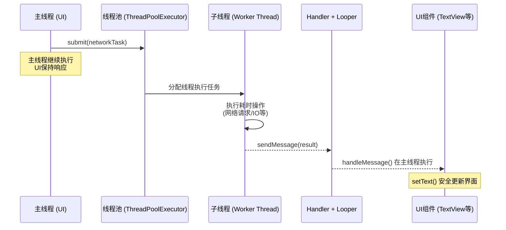
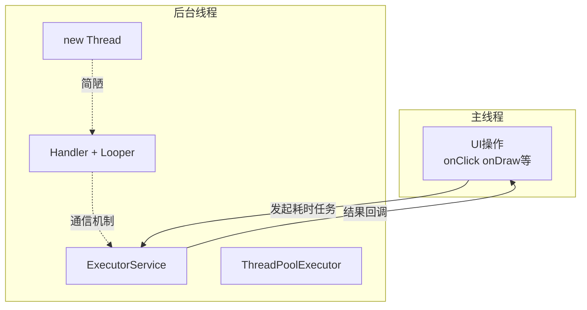
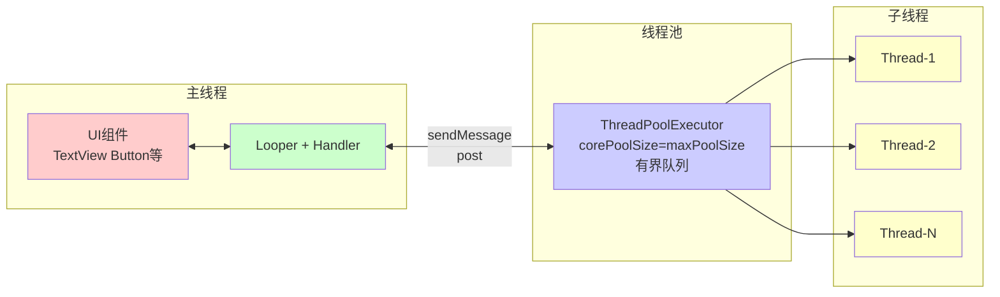

# 6.1.10 使用 Java 线程进行异步工作

银河已经斜到了天边，只剩几颗固执的星子还挂在地平线附近不肯隐去。

篝火只剩几块暗红的炭，偶尔爆出一两点火星，在夜风里倏地熄灭。空气冷得像刚从溪水里捞出来的石头，四个人呼出的白气在灯串的微光里飘散又消失。

黛琳从背包侧袋里摸出一部手机，屏幕朝下，按了一下侧键，屏幕亮了——显示的是一个天气小组件。

"这是什么？"洛芙凑过去看了一眼，"备用机？"

"嗯，家里压箱底的。"黛琳把手机翻过来，让屏幕的光映在脸上，"上个月充过一次电，今天还能亮。"

"好厉害……"洛芙由衷地感叹，"我的手机充满电放两天就没电了。"

"那是锂电池自放电，这个是镍氢的，特性不一样。"黛琳随手把屏幕朝上放在膝盖上，"不过它能亮，倒让我想起一件事——"

"什么事？"希尔打了个哈欠，揉了揉眼睛。

"它的界面是单线程的。"黛琳轻轻点了点屏幕，"你看，打开天气小组件，显示温度、网络请求、处理数据、渲染界面，全都在一个线程里完成。因为简单，所以够用。但我们的App不一样——"

"怎么不一样？"洛芙的困意被这个问题赶跑了。

"我们今天来湖边之前，在帐篷里用手机开了一个网页，对吧？"

"嗯。"

"那个网页打开的时候，界面有没有卡住？"

洛芙回想了一下："没有，滑动挺顺的。"

"那是因为网络请求是在后台线程里完成的，请求完成后再切回主线程更新界面。"黛琳把手机屏幕朝下盖在膝盖上，"这就是我们今天要聊的东西——Java线程，以及怎么用它处理异步工作。"

---

伊莎不知什么时候已经裹紧了毯子，只露出一张脸，眼睛亮晶晶地看着黛琳："异步……就像等咖啡的时候可以去逛逛货架，不是一直站在柜台前盯着叫号器？"

"很接近了。"黛琳笑了一下，"在Android里，'站在柜台前盯着叫号器'就是主线程等待一个耗时操作完成。这会导致你的UI完全没响应，系统甚至会弹出一个叫ANR的对话框——Application Not Responding。"

"ANR！"洛芙紧张地重复了一遍，"这个我听说过！"

"对，第一次看到这个对话框的时候，很多人会以为手机坏了。"黛琳用手比划了一下，"实际上只是App在主线程里做了不该做的事，比如网络请求、大文件读取、复杂计算。"

希尔这时候已经从地上捡起了她的笔记本，屏幕的光映在她脸上："那解决方案就是把耗时操作移到别的线程里去，让主线程只管UI更新，对吧？"

"没错。"黛琳点头，"具体怎么做，我们一种一种来说。"

---

## 第一种：直接 new Thread()

"最原始的办法，就是直接 new 一个 Thread。"黛琳在膝盖上摊开一张折痕斑驳的纸，用白板笔在上面画了几行代码。

```java
// 【反面示例】直接在主线程创建匿名Thread执行耗时操作
// 这段代码写在Activity的onCreate()里——千万不要这样做！
new Thread(new Runnable() {
    @Override
    public void run() {
        // 模拟网络请求——这是一个耗时操作
        try {
            Thread.sleep(2000); // 假设这行是在真正请求网络
            String response = "服务器返回的数据";
            // ❌ 错误：Android不允许在子线程直接更新UI
            // textView.setText(response); // 会崩溃！
        } catch (InterruptedException e) {
            e.printStackTrace();
        }
    }
}).start(); // 调用start()启动线程，不是run()

Log.d("MainActivity", "这行代码会在线程启动后立即执行，不等待线程结束");
```

"直接 new Thread 的问题是——"黛琳的笔尖点在纸上，"第一，没办法获取返回值；第二，如果有很多个耗时操作，就会有很多个零散的线程，难以管理；第三……"

"第三是什么？"洛芙问。

"第三，更新UI必须切回主线程。"黛琳说，"Android的UI组件不是线程安全的，只能在主线程里操作。所以如果线程执行完了想更新界面，你得想办法把结果传回主线程。"

希尔在旁边接话："new Thread 也不是完全不能用，比如有些一次性的、不在乎结果的后台任务——日志写入啦、埋点上报啦——但对于任何需要反馈到界面的操作，都不能直接这样写。"

---

## 第二种：Thread + Handler

"说到切回主线程，就不得不提 Handler 和 Looper 了。"黛琳在纸上画了一个小小的循环图。

"Looper 是一个消息循环器，每个线程最多只有一个 Looper。它会从消息队列里取出消息并处理。"

```java
// Looper.prepare() 为当前线程初始化消息队列
// 每个线程只能调用一次，多次调用会崩溃
Looper.prepare();

handler = new Handler(Looper.myLooper()) {
    @Override
    public void handleMessage(@NonNull Message msg) {
        // 这个方法运行在创建Handler的线程里
        // 也就是主线程——所以这里可以安全地更新UI
        if (msg.what == 1) {
            String data = (String) msg.obj;
            textView.setText(data); // ✅ 安全：运行在主线程
        }
    }
};

// 启动Looper，开始处理消息队列
// 这是一个阻塞调用，之后的代码不会继续执行
Looper.loop();

// 注意：Looper.loop()之后的代码永远不会执行
// 因为loop()是一个死循环
// 如果想执行loop()之后的代码，需要quit()
```

"主线程自带 Looper，所以它一直在循环着处理各种消息——点击事件、绘制消息、Handler消息。"黛琳用笔尖点了点那条从 Thread 画到 Handler 的箭头，"子线程想要通知主线程，就发一条消息给主线程的 Handler。"

```java
// 【正面示例】在子线程中通过Handler发送消息到主线程
// 这段代码写在子线程里

// 创建Message（推荐用Message.obtain()，复用对象避免频繁创建）
Message msg = Message.obtain();
msg.what = 1;
msg.obj = "网络请求结果：天气晴";

// 通过主线程的Handler发送消息
// sendMessage()是异步的，会立即返回，不会阻塞子线程
mainHandler.sendMessage(msg);

// 也可以用post()方法，更简洁
mainHandler.post(new Runnable() {
    @Override
    public void run() {
        // 这段代码会被投递到主线程执行
        textView.setText("天气晴"); // ✅ 安全
    }
});
```

"所以流程是这样的——"伊莎用手指在空气里比划，"子线程做好饭，装进盒子里，贴上标签，交给主线程的 Handler，主线程有空的时候再打开盒子吃？"

"很贴切。"黛琳点头，"Handler 就是那个负责送餐的服务员，它和主线程的 Looper 绑在一起，确保盒饭送到主线程手里。"

洛芙盯着那张图看了一会儿："等等，那子线程自己能不能也有 Looper？"

"当然可以。"黛琳说，"如果一个子线程需要处理来自其他线程的消息，它也可以调用 Looper.prepare() 和 Looper.loop()，变成一个带消息循环的工作线程。"

---

## 第三种：ExecutorService + 线程池

"直接 new Thread 的问题是线程太宝贵了，不能用完就扔。"希尔把笔记本转过来，屏幕上是一张自己画的图，"所以我们有线程池——先准备好一组线程，要用的时候从池子里拿，用完了还回去，不用每次都重新创建和销毁。"

```java
import java.util.concurrent.ExecutorService;
import java.util.concurrent.Executors;

// Executors 是官方提供的线程池工厂类
// newFixedThreadPool(n) 创建一个固定大小的线程池
// 最多同时运行n个线程，多出来的任务会排队等待
ExecutorService executor = Executors.newFixedThreadPool(4);

// 向线程池提交一个任务（Runnable接口）
executor.submit(new Runnable() {
    @Override
    public void run() {
        // 这个代码块会在线程池中的一个线程执行
        // 不会是主线程
        String result = fetchDataFromNetwork(); // 模拟网络请求
        Log.d("ThreadPool", "当前线程: " + Thread.currentThread().getName());
        // result 是子线程拿到的数据，想更新UI还得切回主线程
    }
});

// 【重要】任务执行完毕后线程池不会自动关闭
// 需要显式调用shutdown()来关闭
// shutdown()会等待队列中所有任务执行完毕后关闭
executor.shutdown();

// 如果想立即关闭（不等队列中的任务），用shutdownNow()
// executor.shutdownNow();

// 【推荐写法】用try-with-resources确保线程池被关闭
try (ExecutorService executor = Executors.newFixedThreadPool(4)) {
    executor.submit(() -> {
        String data = fetchDataFromNetwork();
        Log.d("TAG", "结果: " + data);
    });
} // 自动调用executor.shutdown()
```

"Executors 工厂类提供了好几种线程池。"希尔用手指点着屏幕上的代码，"newFixedThreadPool 是固定大小的；newCachedThreadPool 是缓存线程池，线程不够就新建，空闲超过60秒就回收；newSingleThreadExecutor 只有一个线程，所有任务排队执行。"

"它们分别适合什么场景？"洛芙问。

"newFixedThreadPool 适合任务数量固定、不太在意响应时间的场景，比如批量处理图片。"希尔掰着手指头，"newCachedThreadPool 适合任务很多但每个都很短的场景，比如高并发的网络请求。newSingleThreadExecutor 适合需要严格串行执行的场景——但说实话，用得不多。"

```java
// 三种常用线程池的创建方式

// 固定大小线程池——始终有n个活跃线程
ExecutorService fixedPool = Executors.newFixedThreadPool(4);

// 缓存线程池——线程数量动态增长，空闲60秒后回收
ExecutorService cachedPool = Executors.newCachedThreadPool();

// 单线程线程池——所有任务在一个线程里排队执行
ExecutorService singlePool = Executors.newSingleThreadExecutor();

// 【警告】不要在生产环境直接用Executors创建线程池
// 原因见下方"反模式"部分
```

希尔在代码下面写了一行运行结果：

```
2026-04-03 05:12:34.123  ThreadPool  当前线程: pool-1-thread-1
2026-04-03 05:12:35.456  ThreadPool  当前线程: pool-1-thread-2
2026-04-03 05:12:35.789  ThreadPool  当前线程: pool-1-thread-1
2026-04-03 05:12:36.012  ThreadPool  当前线程: pool-1-thread-3
```

"看到没？"希尔指着屏幕，"pool-1-thread-1、pool-1-thread-2……线程名字里有池子的编号和线程的编号。这说明它们确实是从同一个线程池里拿出来的。"

---

## 反模式：为什么不直接用 Executors.newFixedThreadPool

"但是——"黛琳忽然说，"在实际项目里，我们很少直接用 Executors 的工厂方法。"

"为什么？"洛芙有点困惑，"刚才希尔不是说了三种吗？"

"因为它们有隐藏的问题。"黛琳拿过希尔的笔记本，在 Executors 那行代码下面画了一个大大的叉，"newFixedThreadPool 内部用的是无界队列，意思是如果任务太多、生产速度大于消费速度，队列会无限增长，最终可能导致 OutOfMemoryError。"

```java
// 【反模式】Executors.newFixedThreadPool 的问题
// 源代码简化版：
public static ExecutorService newFixedThreadPool(int nThreads) {
    // 核心线程数=nThreads，最大线程数=nThreads
    // 但注意这个队列——是new LinkedBlockingQueue<Runnable>()
    // 默认容量是Integer.MAX_VALUE，约等于"无限"
    return new ThreadPoolExecutor(
        nThreads,       // corePoolSize
        nThreads,       // maximumPoolSize
        0L,             // keepAliveTime
        TimeUnit.MILLISECONDS,
        new LinkedBlockingQueue<Runnable>() // 【问题所在】无界队列
    );
}

// 如果生产者速度 > 消费者速度，队列会无限增长
// 最终导致 OOM

// 【正确做法】手动创建ThreadPoolExecutor，指定有界队列
int corePoolSize = 4;
int maxPoolSize = 8;
int queueCapacity = 100; // 有界队列，超过100个任务会触发拒绝策略

ExecutorService executor = new ThreadPoolExecutor(
    corePoolSize,
    maxPoolSize,
    60L, TimeUnit.SECONDS,
    new LinkedBlockingQueue<>(queueCapacity), // 有界队列
    Executors.defaultThreadFactory(),
    new ThreadPoolExecutor.CallerRunsPolicy() // 拒绝策略：调用者执行
);
```

"所以更好的做法是用 ThreadPoolExecutor 手动创建线程池，明确指定队列大小和拒绝策略。"黛琳把笔放下，"拒绝策略有四种：AbortPolicy（抛异常）、CallerRunsPolicy（让调用线程自己执行）、DiscardPolicy（直接丢弃）、DiscardOldestPolicy（丢弃最老的任务）。"

"CallerRunsPolicy 听起来最安全。"洛芙说，"至少不会丢任务。"

"但也要小心，如果调用线程就是主线程，过多的任务会让主线程也变慢。"希尔补充道，"没有完美的策略，只有适合场景的策略。"

---

## 线程间通信的完整流程图

伊莎捧着她的热可可，凑过来看希尔笔记本上的图："能不能给我们画个完整的流程？从主线程发起一个网络请求，到最后更新界面？"

"好。"希尔拿过一张新的纸，开始画。



"图1：主线程发起任务到线程池，子线程处理完成后通过Handler将结果投递回主线程更新UI"

"所以核心就是三条线——"黛琳用手指点着图，"第一条，主线程把任务扔给线程池；第二条，子线程执行耗时操作；第三条，子线程通过Handler把结果送回主线程。三条线不交叉，各自做各自的事。"

"这样主线程始终是通畅的，UI不会卡。"伊莎说。

"对。"

---

## runOnUiThread 和 View.post()

"其实还有两种更简便的方式可以让子线程的结果回到主线程。"希尔把笔记本翻到新的一面。

"第一种是 Activity 提供的 runOnUiThread()，它内部会自动判断当前是不是主线程——如果是，就直接执行；如果不是，就把自己的 Runnable 发到主线程的消息队列里。"

```java
// 方式一：runOnUiThread()
new Thread(new Runnable() {
    @Override
    public void run() {
        final String result = fetchDataFromNetwork();
        // 切换回主线程更新UI
        runOnUiThread(new Runnable() {
            @Override
            public void run() {
                textView.setText(result); // ✅ 安全
            }
        });
    }
}).start();
```

"第二种是 View 自己的 post() 方法，任何继承自 View 的组件都可以用。"希尔在代码旁边画了一个小箭头，"它会把 Runnable 投递到主线程的消息队列里，比 runOnUiThread 更细粒度，因为你可以指定具体是哪个 View 的主人线程来处理。"

```java
// 方式二：View.post()
new Thread(new Runnable() {
    @Override
    public void run() {
        final String result = fetchDataFromNetwork();
        // post()会自动把任务投递到拥有这个View的主线程
        textView.post(new Runnable() {
            @Override
            public void run() {
                textView.setText(result); // ✅ 安全
            }
        });
    }
}).start();

// 【推荐】lambda写法，更简洁
new Thread(() -> {
    String result = fetchDataFromNetwork();
    textView.post(() -> textView.setText(result));
}).start();
```

"post() 有时候比 runOnUiThread 更好用，因为它不依赖 Activity 本身。"黛琳补充道，"比如你在一个独立的工具类里拿到了 View 的引用，用 post() 就可以直接切回主线程，不用把 Activity 传进工具类。"

洛芙若有所思地点点头："所以总结一下……new Thread 简单但不好管理；Handler 加 Looper 可以做线程间通信，但需要手动管理消息；线程池是管理多线程的最佳实践；runOnUiThread 和 post() 是便捷的切回主线程的方式。"

"差不多。"黛琳说，"还有一个重要的点没说——线程安全。"

---

## 线程安全与竞态条件

"当多个线程访问同一个资源的时候，就可能出现竞态条件。"黛琳在纸上画了两个并排的箭头，都指向同一个盒子。

"比如一个计数器，两个线程同时读+写，都读到初始值0，都加1，都写回去，结果计数器只变成了1——这就是经典的竞态条件。"

```java
// 【反模式】不安全的计数器
public class CounterBad {
    private int count = 0;

    // ❌ 不是线程安全的——多个线程同时调用会出错
    public void increment() {
        count++; // 实际执行：读取count → 加1 → 写回
                  // 如果两个线程同时读取，都是0，都加1，都写1
                  // 结果count=1而不是2
    }

    public int getCount() {
        return count;
    }
}

// 【正面示例】使用synchronized保证线程安全
public class CounterSafe {
    private int count = 0;

    // ✅ synchronized保证同一时刻只有一个线程能进入这个方法
    public synchronized void increment() {
        count++;
    }

    public synchronized int getCount() {
        return count;
    }
}

// 【推荐】使用AtomicInteger，性能更好
import java.util.concurrent.atomic.AtomicInteger;

public class CounterAtomic {
    private AtomicInteger count = new AtomicInteger(0);

    // ✅ AtomicInteger内部使用CAS操作，比synchronized更高效
    public void increment() {
        count.incrementAndGet(); // 原子操作：读取+加1+写回一步完成
    }

    public int getCount() {
        return count.get();
    }
}
```

"Java 提供了几种线程同步的手段——synchronized 关键字、volatile 变量、Lock 接口、Atomic 系列类。"黛琳说，"synchronized 最简单，但会阻塞线程，开销较大；Atomic 系列类用CAS（Compare-And-Swap）实现无锁并发，性能好但只适合单一变量的场景。"

"多线程的世界好复杂……"洛芙忍不住感叹。

"所以现代Android开发更推荐用 Kotlin 协程来处理并发。"希尔合上笔记本，"协程让异步代码看起来像同步代码，不需要手动管理线程切换和回调地狱。但是——"

"但是 Java 没有协程。"黛琳接过话头，"所以对于 Java 项目来说，线程、Handler、Executor 这套体系仍然是必备的基础知识。"

希尔把笔记本翻到空白页，画了一张简单的图：



"图2：主线程与后台线程的关系——ExecutorService是最推荐的管理多线程的方式"

"记住，Android 里主线程只做两件事：接收用户输入，更新UI。其他所有耗时操作，统统搬到后台线程去。"

---

夜风忽然大了一些，把灯串吹得晃来晃去。远处的山棱线上，天空已经从墨色渐渐泛起了一层淡淡的靛蓝。

"太阳快出来了。"伊莎仰头看了一会儿天，"你看，东边的云开始有颜色了。"

"我们讲到哪里了？"黛琳看了看四周。

"线程安全。"洛芙说，"我还记得，synchronized、volatile、Lock、AtomicInteger。"

"嗯，那我来总结一下——"黛琳拿起白板笔，准备画一张最终的全景图。

"首先，所有UI操作必须在主线程。其次，任何耗时操作都要移到子线程。第三，子线程和主线程通信，用 Handler 或者 View.post() 或者 runOnUiThread()。第四，用线程池管理子线程比直接 new Thread 更好。第五，注意线程安全。"



"图3：Android线程模型全景图——主线程的Looper+Handler与线程池协同工作"

希尔凑过来看了一眼："这个图很清楚。核心就是两条总线——一条是主线程自己的消息循环（Looper+Handler），另一条是线程池（ThreadPoolExecutor）管理的后台线程。"

"好，记住了。"洛芙用力点了点头，然后打了个大大的哈欠。

"困了？"伊莎笑着看她。

"有一点……但是很值得！"洛芙揉了揉眼睛，"我以前只知道'不能卡主线程'，不知道背后还有这么多东西。Thread、Handler、Looper、ExecutorService、线程池……感觉脑子里那些零散的东西终于串起来了。"

东边的天际线上，一道橙红色的光终于破开了夜的深沉。湖面上倒映出第一缕曙光，水鸟从芦苇丛里扑棱棱地飞起来，在晨光里划出一道弧线。

"新的一天开始了。"黛琳把白板笔盖好插回背包侧袋，"走吧，去看看湖上的日出。"

---

> **学习建议**：从 new Thread 开始理解线程的基本概念，再用 Handler 理解线程间通信，最后掌握线程池。记住：主线程只做 UI，耗时操作全部后台执行，结果通过 Handler/View.post()/runOnUiThread() 回到主线程更新界面。

---

## 🍹洛芙的小小日记本

今天学到了线程的"三条线"——主线程提交任务到线程池，子线程干活，干完通过 Handler 送信回主线程。new Thread 太零散，线程池才是正规军。黛琳说的对：主线程就像营地的前台，只负责接待客人，真正做饭的在后厨。后厨不够用就开线程池，多出来的菜排队等着。感觉脑子里那些杂乱的知识点终于被串成了一条线。明天要学 Kotlin 协程了，期待！

---

## 今日关键词

- **主线程（Main Thread）**：Android 应用程序启动时系统自动创建的线程，也叫 UI 线程。负责处理用户输入事件和更新 UI 组件。**所有 UI 操作必须在主线程执行。**
- **Thread**：Java 中实现多线程的基础类。通过继承 Thread 或实现 Runnable 接口来定义一个线程的执行体（run() 方法）。**直接 new Thread 适用于一次性简单任务，不建议在复杂场景使用。**
- **Handler**：Android 中用于线程间通信的机制。与 Looper 配合使用：Looper 从消息队列取出消息，Handler 处理消息或发送消息到队列。**子线程通过 Handler 向主线程发送消息来更新 UI。**
- **Looper**：每个线程的消息循环器。每个线程最多只能有一个 Looper。调用 `Looper.prepare()` 初始化消息队列，`Looper.loop()` 开始循环处理消息。**主线程自带 Looper一直在运行。**
- **ExecutorService**：Java 并发包提供的线程池接口，比直接 new Thread 更适合管理多线程。支持任务提交（submit）、线程复用、线程池关闭（shutdown/shutdownNow）。
- **ThreadPoolExecutor**：线程池的核心实现类。支持自定义核心线程数、最大线程数、空闲线程存活时间、任务队列容量、拒绝策略。**推荐使用此类代替 Executors 工厂方法以避免无界队列问题。**
- **Runnable**：定义线程执行体的接口，只有一个 `run()` 方法，无返回值。**与 Thread 配合使用：`new Thread(new Runnable(){...}).start()`。**
- **Callable**：与 Runnable 类似但有返回值（通过 Future 获取）。**适用于需要获取线程执行结果的场景。**
- **Future**：表示异步计算的结果。调用 `Future.get()` 会阻塞直到结果可用。**与 ExecutorService.submit(Callable) 配合使用。**
- **Executors**：线程池工厂类，提供 newFixedThreadPool、newCachedThreadPool、newSingleThreadExecutor 等快捷创建方法。**注意：直接使用 Executors 的工厂方法在生产环境可能有隐患（无界队列导致 OOM），建议手动创建 ThreadPoolExecutor。**
- **synchronized**：Java 关键字，用于实现方法或代码块的同步，保证同一时刻只有一个线程可以执行被保护代码。**是实现线程安全最简单的方式，但开销较大，可能导致线程阻塞。**
- **volatile**：Java 关键字，确保变量的可见性（一个线程修改后其他线程立即可见）和有序性（禁止指令重排序）。**不保证原子性，增量操作 `count++` 不是线程安全的。**
- **AtomicInteger / Atomic类**：java.util.concurrent.atomic 包提供的原子类。使用 CAS（Compare-And-Swap）无锁算法实现线程安全的单一变量操作。**性能优于 synchronized，适用于计数器等简单场景。**
- **runOnUiThread()**：Activity 的方法，将 Runnable 投递到主线程的消息队列执行。如果已在主线程则直接执行。**是从子线程切换回主线程的便捷方式。**
- **View.post()**：View 的方法，将 Runnable 投递到拥有该 View 的主线程消息队列执行。**比 runOnUiThread 更细粒度，不依赖 Activity 引用。**
- **竞态条件（Race Condition）**：多个线程对同一共享资源进行非原子操作时，由于执行顺序不确定导致结果不可预期的现象。**常见例子：`count++` 在多线程下结果不正确。**
- **CAS（Compare-And-Swap）**：乐观锁实现的核心算法。比较当前值与期望值，相同则更新，否则重试。**Atomic类使用CAS实现无锁并发，线程不阻塞但可能导致"忙等待"。**
- **ANR（Application Not Responding）**：Android 系统在检测到应用主线程阻塞超过5秒时弹出的无响应对话框。**通常由在主线程执行耗时操作引起。**
- **线程池拒绝策略（RejectedExecutionHandler）**：当线程池无法接受新任务时的处理策略。AbortPolicy（抛异常）、CallerRunsPolicy（调用者执行）、DiscardPolicy（丢弃）、DiscardOldestPolicy（丢弃最老）。**CallerRunsPolicy 可防止任务丢失但可能拖慢主线程。**
