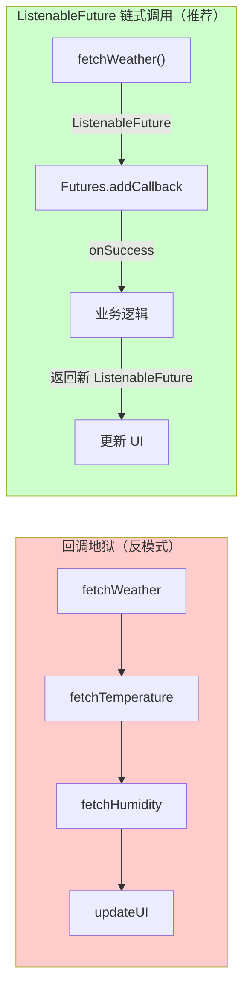

# 6.1.11 使用 ListenableFuture

东边的天空终于被撕开了一道口子。

不是亮，是金。金色的光线从山脊的缺口处涌进来，像谁打翻了一罐蜂蜜，淌进了湖里。洛芙本来是眯着眼睛看天的，被那片金色晃得一下子把脸埋进了膝盖里。

"我再睡五分钟……"她闷闷地说。

"不行。"希尔的声音近在咫尺，伴随着一阵轻轻的敲击声，"你闻闻。"

洛芙把脸从膝盖里抬起来，吸了吸鼻子。空气里有一股清冽的水汽，还有一丝若有若无的烟熏味——篝火还没完全熄灭。但更明显的是一股……咖啡香？

"今天谁起的这么早煮咖啡？"洛芙揉着眼睛。

"伊莎姐，"希尔头也不抬，手指还在一部旧手机的屏幕上飞快地划动，"她四点就醒了，说是看日出。我到现在就睡了两个小时，但是——"

希尔把手机往洛芙面前一怼。

屏幕上是一个天气应用，界面是简单的黑白配色，最上方写着"本湖今日天气"，下面是一排温度、湿度、风速的数据。洛芙看了一眼，没觉得有什么问题。

"怎么了？"

"数据是假的，"希尔叹了口气，把手机收了回去，"那部旧手机是黛琳从背包深处挖出来的，里面预装的天气 App 早就停止服务了，接不上了。我现在想把它修好，给我们露营用。"

"修不好吗？"

"能修，"希尔说，"但有个问题——天气数据要从网络获取，这是一项耗时操作。我不能在主线程做这个事，否则 App 会直接卡死。但如果我在后台线程请求数据，结果出来了之后，我想更新界面上的温度数字——"

"跨线程更新 UI，安卓会炸掉。"黛琳的声音从不远处传来。她正端着一杯冒着热气的咖啡走过来，头发还扎得整整齐齐，但眼睛下面有一层淡淡的青色，"洛芙，你知道吗，昨天我们在山道上赶路的时候，伊莎一直在念叨说想要一个能实时显示天气的东西。"

"现在有了这部旧手机，我们可以做一个真正的天气 App 出来，"希尔的眼睛亮了起来，"问题是我每次想从后台线程把数据传回主线程就特别烦躁。要么用 runOnUiThread，要么用 View.post()，要么就新建一个 Handler——写起来特别啰嗦，而且嵌套一深就容易出 bug。"

"callback 地狱。"黛琳抿了一口咖啡，语气平静。

"对对对！"希尔猛点头，"就是那个！"

伊莎从帐篷的方向走过来，手里也端着一杯热可可。她看起来精神倒还不错，头发有点乱但眼神很亮。

"你们在说 callback 地狱？"伊莎笑着在篝火旁边坐下，"callback 地狱我太熟了，就像你站在一个全是镜子的房间里，一直往更深的镜子里走——明明能看到终点在那里，但就是走不到。"

"这个比喻也太伊莎了。"希尔说。

"callback 嵌套太深之后代码会变成什么样子，你们心里有数吧？"黛琳把咖啡杯放在一块平整的石头上，从背包里掏出一支白板笔和一小块折叠白板，"我给你们画一下。"

她蹲下身，把白板在膝盖上铺平，开始画。

```
┌─────────────────────────────────────────────────┐
│  坏味道：深层回调嵌套（Callback Hell）            │
├─────────────────────────────────────────────────┤
│                                                 │
│  fetchWeather(city, (weather) => {             │
│    fetchTemperature(weather, (temp) => {         │
│      fetchHumidity(temp, (humidity) => {        │
│        updateUI(temp, humidity) // 第3层嵌套    │
│      })                                         │
│    })                                           │
│  })                                             │
│                                                 │
│  问题：                                         │
│  · 缩进层层嵌套，可读性差                       │
│  · 错误处理分散在各层，异常难以集中             │
│  · 业务逻辑和嵌套结构耦合，难以复用              │
│  · 调用顺序固定，无法并发执行                    │
│                                                 │
└─────────────────────────────────────────────────┘
```

"这就是 callback 地狱。"黛琳指着最内层的 updateUI 说，"三层就已经这样了，如果再叠一层风力判断、再叠一层日出日落时间——"

"那就要在每一层都写错误处理，每一层的异常都要单独 catch，"希尔接过话，"而且最要命的是，如果我想在温度获取之后再并发去拿湿度，而不是等温度拿到才去拿湿度——callback 根本做不到。"

"所以，"黛琳在白板上又画了一格，"安卓的开发前辈们引入了 ListenableFuture。"

洛芙听到这里，把手举了起来。

"等一下，"她说，"ListenableFuture……Future 我大概知道，就是一个代表'将来'的东西。但是 Listenable 是什么意思？"

"问得好。"黛琳点点头，"普通的 Future，你只能通过 `.get()` 方法去'阻塞着'等结果。就是说——"

"就像你站在厨房门口等咖啡煮好，"伊莎接过话，"你哪儿也去不了，就站在那儿盯着锅，等它咕嘟咕嘟煮完。如果你等的时候想做点别的，比如去搭帐篷——做不到，因为你在等。"

"这就是阻塞式的 Future。"黛琳说，"而 ListenableFuture 不一样。它是'可监听的' Future。你可以给它挂上一个小广播接收器——我们叫它回调——然后你就可以去干别的事了。等它那边数据准备好了，它会自动通知你，'嘿，我好了'。"

"不用一直站在那儿等着？"洛芙问。

"不用。"黛琳说，"你可以去搭帐篷，可以去生火，可以去……做任何事。"

"那我想在安卓里用 ListenableFuture，要怎么弄？"希尔从地上捡起那部旧手机，"我看到文档上说它不是安卓框架自带的……"

"来自 Guava 库，"黛琳说，"安卓官方在后台任务文档里推荐使用的异步编程工具。Guava 是一个 Google 出品的 Java 核心工具库，里面包含了 ListenableFuture。所以你只需要在项目的 build.gradle 里加一个依赖："

```groovy
// build.gradle (app)
dependencies {
    // ListenableFuture（来自 Guava）
    implementation 'com.google.guava:guava:31.1-android'
    // 如果你用 AndroidX 的话，也可以用 AndroidX 版本
    implementation 'androidx.concurrent:concurrent-futures:1.1.0'
}
```

"装好了之后呢？"洛芙问。

"希尔，把你的笔记本拿过来。"黛琳说。

希尔立刻从背包里掏出一台银色的小笔记本，屏幕亮着，上面是之前她在旧手机项目里写的一些代码框架。黛琳把笔记本转过来对着大家，开始敲代码。

"第一个场景：你已经有一个返回 ListenableFuture 的方法，想拿到它的结果。"

```kotlin
// 场景一：用 FutureCallback 监听结果
// 依赖：com.google.guava:guava:31.1-android

import com.google.common.util.concurrent.FutureCallback
import com.google.common.util.concurrent.Futures
import com.google.common.util.concurrent.ListenableFuture

// 假设这是一个从网络获取天气数据的异步方法
fun fetchWeather(city: String): ListenableFuture<Weather> {
    val executor = Executors.newSingleThreadExecutor()
    val future = Futures.future(
        {
            // 这里是你要执行的耗时操作，运行在后台线程
            val data = networkRequest(city)  // 假设这是一个会阻塞的方法
            Weather.parse(data)
        },
        executor
    )
    return future
}

// 主线程中注册回调
val weatherFuture = fetchWeather("Lake Camp")
Futures.addCallback(
    weatherFuture,
    object : FutureCallback<Weather> {
        override fun onSuccess(result: Weather?) {
            // 这个回调运行在主线程，可以安全更新 UI
            temperatureTextView.text = "${result!!.temp}°C"
            humidityTextView.text = "湿度 ${result.humidity}%"
            Log.d("WeatherApp", "成功更新天气数据：${result.temp}°C")
        }

        override fun onFailure(t: Throwable) {
            // 网络错误、解析异常等会走这里
            Log.e("WeatherApp", "获取天气失败", t)
            Toast.makeText(context, "网络不给力呀！", Toast.LENGTH_SHORT).show()
        }
    },
    // 注意：这个 executor 决定 onSuccess/onFailure 回调在哪个线程执行
    // MainThreadExecutor() 会让回调运行在主线程
    MainThreadExecutor()
)
```

"等一下，"洛芙盯着代码，"这个 `MainThreadExecutor()` 是从哪来的？"

希尔笑了笑，从笔记本旁边抽出一张纸，飞快地写下：

```kotlin
import android.os.Handler
import android.os.Looper
import java.util.concurrent.Executor

/**
 * 将回调执行在主线程的 Executor
 * 用于确保 ListenableFuture 的回调可以安全更新 UI
 */
class MainThreadExecutor : Executor {
    private val handler = Handler(Looper.getMainLooper())

    override fun execute(r: Runnable) {
        handler.post(r)
    }
}
```

"就这个，"希尔说，"用 Handler 把回调 post 到主线程的 MessageQueue 里去。简单吧？"

"简单是简单，但是为什么不能直接在后台线程里更新 UI？"洛芙问。

"不行，"黛琳摇头，"安卓的 UI 组件不是线程安全的。所有对 View 的操作都必须且只能在主线程进行。如果你试图在后台线程调用 `textView.text = "..."`，应用会直接崩溃，抛出一个 CalledFromWrongThreadException。"

"所以必须在主线程的回调里更新 UI。"洛芙点点头，"这个我记住了。"

"第二种场景，"黛琳继续说，"如果你在用 Kotlin，其实有更简单的写法——不用 callback，而是直接用 ListenableFuture 的扩展函数把它变成协程的方式。"

```kotlin
// 场景二：用 Kotlin 协程等待 ListenableFuture
// 依赖：kotlinx-coroutines-guava

import kotlinx.coroutines.guava.await
import kotlinx.coroutines.rx3.asCoroutineDispatcher
import kotlinx.coroutines.Dispatchers

// 把 ListenableFuture 变成协程里的 suspend 函数
suspend fun getWeatherSync(city: String): Weather {
    return withContext(Dispatchers.IO) {
        fetchWeather(city).await()  // await() 来自 kotlinx-guava
    }
}

// 在协程里用，和写普通代码一样
lifecycleScope.launch {
    try {
        val weather = getWeatherSync("Lake Camp")
        temperatureTextView.text = "${weather.temp}°C"
    } catch (e: Exception) {
        Toast.makeText(context, "出错了：${e.message}", Toast.LENGTH_SHORT).show()
    }
}
```

"这就是为什么希尔说'用 Kotlin 最简单'，"黛琳说，"协程的 `.await()` 可以把异步代码写成看起来像同步的样子，逻辑很清楚。"

"哇……"洛芙小声说，"真的好像在写普通代码。"

"协程本来就是用来干这个的，"希尔说，"把异步的复杂性藏起来。"

"好，上面是'拿结果'，"黛琳在白板上又画了一个新的框，"现在说'造结果'。你有一些耗时操作，怎么把它们变成 ListenableFuture？"

希尔立刻接口："有两种常见办法。第一种，用 `ImmediateFuture.immediate()` 把一个已经算好的值包起来。"

```kotlin
// 场景三：创建一个已完成的 ListenableFuture
// 有时候你的操作其实很快，根本不需要真的走后台

import com.google.common.util.concurrent.ImmediateFuture

fun getCachedWeather(city: String): ListenableFuture<Weather> {
    val cached = weatherCache[city]
    return if (cached != null) {
        // 数据已经在内存里了，直接返回
        ImmediateFuture.immediate(cached)
    } else {
        // 缓存没有，退回到网络请求（返回一个新的 ListenableFuture）
        fetchWeatherFromNetwork(city)
    }
}
```

"第二种，"希尔继续说，"用 `Futures.future()` 包装一个 Callable 或 Supplier。"

```kotlin
import com.google.common.util.concurrent.Futures
import java.util.concurrent.Executors
import java.util.concurrent.Callable

// 用 Futures.future() 创建后台任务
fun fetchWeatherFuture(city: String): ListenableFuture<Weather> {
    val executor = Executors.newSingleThreadExecutor()
    return Futures.future(
        Callable<Weather> {
            // Callable 的 call() 方法会在后台线程执行
            // 这里可以写任何耗时操作
            val rawData = httpGet("https://api.weather.com/v3/$city")
            parseWeatherJson(rawData)
        },
        executor
    )
}
```

"Callable 和 Runnable 有什么区别？"洛芙问。

"Callable 有返回值，"黛琳说，"Runnable 的 run() 方法返回 void，而 Callable 的 call() 方法返回你指定类型的结果。所以如果你想让后台任务返回一个 `Weather` 对象，就用 Callable。"

"第三种，"希尔突然说，"也很常见——把现有的 callback API 转成 ListenableFuture。有时候你用的库是 callback 风格的，比如老版本的 HTTP 客户端，或者某个传感器库。你想把它接进 ListenableFuture 的生态里。"

```kotlin
// 场景四：把 callback API 转成 ListenableFuture
// 使用 androidx.concurrent:concurrent-futures CallbackFuture

import androidx.concurrent.futures.CallbackToFutureAdapter
import com.google.common.util.concurrent.SettableFuture

fun <T> callbackToListenableFuture(
    apiCall: (onSuccess: (T) -> Unit, onFailure: (Throwable) -> Unit) -> Unit
): ListenableFuture<T> {
    return CallbackToFutureAdapter.getFuture { completer ->
        apiCall(
            { result -> completer.set(result) },
            { error -> completer.setException(error) }
        )
    }
}

// 使用示例：把老式 HTTP 库的 callback 转成 ListenableFuture
val networkFuture = callbackToListenableFuture<WeatherData> { onSuccess, onFailure ->
    oldHttpClient.get("/weather/lake", object : HttpCallback {
        override fun onSuccess(data: WeatherData) = onSuccess(data)
        override fun onFailure(e: Exception) = onFailure(e)
    })
}
```

"这样就可以统一用 ListenableFuture 的方式来处理所有的异步操作了，"希尔满意地说，"不管它原来是 callback、CompletableFuture 还是什么别的东西，都能转成 ListenableFuture。"

"等等，"洛芙突然说，"那这个和 RxJava 的 Single 有点像啊。RxJava 也是处理异步流的。"

"你说得对，"黛琳点头，"如果你已经有 RxJava 的代码，也可以转。"

```kotlin
// 场景五：从 RxJava Single 转到 ListenableFuture
// 依赖：rxjava -> rxjava3，并且需要 rxjava3-guava-bridge

import rxjava3.core.Single
import rxjava3.jdk8.interop.CompletableFutureInterop
import java.util.concurrent.CompletableFuture

fun Single<Weather>.toListenableFuture(): ListenableFuture<Weather> {
    return this
        .toCompletableFuture()  // RxJava 3 的 toCompletableFuture()
        .toCompletableFuture()
}
```

"但是这种桥接一般不太常用，"黛琳补充道，"除非你的项目同时用 RxJava 和 ListenableFuture，两套异步体系并存——一般不推荐这样做，统一用一套更好。"

"好了，"伊莎终于开口，她一直在旁边安静地听着，偶尔喝一口可可，"你们说的我都听懂了。但我想问一个更根本的问题。"

她抬起头，看向希尔手里那部旧手机。

"我们有了 ListenableFuture 之后，具体要怎么用它来构建天气 App 呢？能不能从头到尾串一遍？"

"好问题，"希尔把笔记本放下，"我们正好来完整地实现一个天气 App 的核心逻辑。"

她把笔记本翻到新的一面，开始画整个流程：

```
┌─────────────────────────────────────────────────────┐
│         天气 App 异步数据获取流程（ListenableFuture）   │
├─────────────────────────────────────────────────────┤
│                                                     │
│  用户打开 App                                       │
│       │                                             │
│       ▼                                             │
│  ┌─────────────┐    同时触发    ┌─────────────────┐ │
│  │ 主线程：UI   │◄──────────────│ 后台线程池      │ │
│  │ 显示加载中   │               │ (Executor)       │ │
│  └──────┬──────┘               └────────┬────────┘ │
│         │                                │          │
│         │  注册 FutureCallback           │          │
│         │◄───────────────────────────────┘          │
│         │         onSuccess(Weather) │ onFailure   │
│         ▼                                ▼          │
│  ┌─────────────┐                   ┌───────────┐   │
│  │ 更新 UI：   │                   │ 显示错误   │   │
│  │ 温度、湿度  │                   │ Toast 提示 │   │
│  └─────────────┘                   └───────────┘   │
│                                                     │
└─────────────────────────────────────────────────────┘
```

"流程是这样的，"希尔指着图说，"第一步，用户打开 App，主线程先显示一个加载状态。第二步，同时在后台线程池里发起三个并发的网络请求——天气数据、温度数据、湿度数据。第三步，每个请求都返回一个 `ListenableFuture<Weather>`。第四步，主线程注册一个 callback，等这些 Future 完成后，自动在主线程收到结果，然后更新 UI。"

"三个请求是并发的，不是串行的？"洛芙问。

"对，"黛琳说，"这是 ListenableFuture 的一个很强的地方——你可以同时启动多个后台任务，它们并行执行，最后再合并结果。这比 callback 层层嵌套的方式效率高多了。"

"用 `Futures.allAsList()` 可以等所有 Future 都成功之后一次性拿结果："

```kotlin
// 并发执行多个异步任务，等全部完成后统一处理
fun fetchAllWeatherData(city: String): ListenableFuture<List<Weather>> {
    val futureWeather = fetchWeather(city)
    val futureAirQuality = fetchAirQuality(city)
    val futureUVIndex = fetchUVIndex(city)

    // allAsList() 会等所有 Future 都成功完成才触发回调
    // 如果任意一个失败了，整个 List 会以失败告终
    return Futures.allAsList(futureWeather, futureAirQuality, futureUVIndex)
}

// 主线程注册
Futures.addCallback(
    fetchAllWeatherData("Lake Camp"),
    object : FutureCallback<List<Weather>> {
        override fun onSuccess(results: List<Weather>) {
            // 三个数据都拿到了，一起更新 UI
            weatherCard.text = results[0].description
            temperatureCard.text = "${results[0].temp}°C"
            uvCard.text = "UV ${results[2].uvIndex}"
        }

        override fun onFailure(e: Throwable) {
            // 三个里任意一个失败都会走这里
            Log.e("WeatherApp", "部分数据加载失败", e)
        }
    },
    MainThreadExecutor()
)
```

"那如果我想三个都发出去，然后哪个先回来就先处理哪个呢？"希尔问，"不是等所有都完成，而是谁快用谁？"

"用 `Futures.any()`，"黛琳说，"这个会返回第一个成功完成的 Future 的结果，不管其他两个有没有完成。"

```kotlin
// anyAsList() 只需要任意一个完成就触发回调
val anyFuture = Futures.anyAsList(futureWeather, futureAirQuality, futureUVIndex)
Futures.addCallback(
    anyFuture,
    object : FutureCallback<ListenableFuture<out Any>> {
        override fun onSuccess(result: ListenableFuture<out Any>) {
            // 第一个完成的直接显示，不等其他的
            val firstResult = result.get()  // 注意这里拿到的是 Object 类型
            Log.d("WeatherApp", "最快的数据：$firstResult")
        }
        override fun onFailure(e: Throwable) { /* 全部失败才触发 */ }
    },
    MainThreadExecutor()
)
```

"好了，"希尔合上笔记本，"我们来动手把整个东西接起来。我把代码写到那部旧手机的项目里，你们帮我看看有没有遗漏。"

希尔坐在一块大石头上，把旧手机连上笔记本，开始敲代码。伊莎在旁边递早餐——烤得金黄的吐司，抹了一层薄薄的枫糖浆。黛琳在一旁检查帐篷的固定绳，确保昨晚的风没有把地钉弄松。

洛芙捧着吐司，蹲在希尔旁边看代码。

"希尔，"她一边嚼吐司一边说，"ListenableFuture 听起来很好用，但我总觉得它和协程有点像。它们之间的区别是什么？"

"区别在于历史和生态，"希尔的手指没停，眼睛盯着屏幕，"协程是 Kotlin 官方的解决方案，2017 年才成熟。ListenableFuture 是 Google 推的，来自 Guava，出现得更早，大概 2012 年左右。所以很多老项目、老库都是基于 ListenableFuture 的，而不是协程。"

"那如果让我选，我应该用哪个？"

"如果你用 Kotlin，而且项目没有历史包袱，"希尔说，"协程是首选。代码写起来更自然，而且有 structured concurrency——协程作用域自动管理，你不需要手动去取消、清理什么的。"

"但如果你是 Java 项目，或者你要和一些老库对接，"黛琳的声音从帐篷方向传来，"ListenableFuture 更合适。"

"还有，"希尔补充道，"WorkManager 底层就是用 ListenableFuture 的。如果你要写自定义的 ListenableWorker，你的 worker 方法返回的就是 ListenableFuture。所以理解 ListenableFuture 是理解 WorkManager 内部原理的基础。"

"WorkManager……"洛芙咀嚼着这个词，"那是不是我们明天要学的东西？"

"对，"黛琳把帐篷门帘放下，拍了拍手上的灰，"今天学的 ListenableFuture 是它的地基。明天的 ListenableWorker 就是盖在地基上的第一层楼。"

太阳已经完全升起来了。

金色的光线从湖面上反射过来，晃得人眼睛发软，但那种晃是舒服的、温暖的，像被什么柔软的东西包裹着。山雀不知道什么时候飞走了，又不知道什么时候飞回来了一群，在营地边的枯枝上跳来跳去，叽叽喳喳地叫着，像在开晨间辩论会。

希尔的旧手机屏幕亮了一下。

"跑起来了！"希尔喊了一声，把手机举起来给大家看。

屏幕上，那个天气 App 的界面终于显示出了真正的数据：温度 14°C，湿度 67%，风向西北，风速 3 级。最下面有一行小字："数据更新时间：今日 06:47"。

"我们真的做出来了？"洛芙凑过去看。

"基础版，"希尔说，"还有很多可以加——日出日落、露营指数、周边景点天气——但核心的异步数据获取已经跑通了。"

"数据应该待在哪里，取决于它要活多久。"黛琳不知道什么时候走过来，她的声音轻轻的，"ListenableFuture 管的是'传输'，不是'存储'。数据从网络来，通过 ListenableFuture 的管道流到 UI，然后消失——这是一次性的、单程的。如果你要把数据存下来，下次打开 App 还能用，那就需要别的东西了。"

"Room？"洛芙问。

"对，"黛琳微微笑了一下，"Room 是存数据的。我们明天可能会讲到的那个 Snowball 徒步路线 App，数据就需要持久化——每次打开都要能看，那数据就要存进数据库里，不能光靠 ListenableFuture 从网络拉。"

"但是今天，"希尔把旧手机递给洛芙，"你可以先玩一下这个天气 App。感受一下异步的力量。"

洛芙接过手机，手指在屏幕上滑了滑。数据加载的时候，界面上有一个小小的转圈动画，没有卡顿，没有白屏，一切都很顺滑。

"真的不卡诶……"她小声说。

"因为所有耗时的操作都跑到后台线程去了，"希尔得意地说，"主线程只管两件事：显示加载状态，和更新最终结果。中间那些乱七八糟的网络请求，全部被 ListenableFuture 接管了。"

伊莎走过来，把一杯新煮好的热可可塞进洛芙手里。

"你看，"她说，"等待不一定是坏事。有时候，等待本身就是一种安静的力量——你不用一直盯着它看，它会在准备好的时候来找你。ListenableFuture 就是这样的东西。"

洛芙捧着温热的杯子，看着湖面上的金光慢慢扩散开去。远处的山棱线在晨光中格外清晰，昨晚的那场银河大概已经随着夜风散去了，但新的光又升起来了。

---

## 专业技术总结

### 核心机制定义

**ListenableFuture** 是 Google Guava 库提供的异步计算结果表示类型，它代表一个"将来会有的值"（`ListenableFuture<V>` = `Future<V>` + 监听能力）。与普通 `Future` 的阻塞式 `.get()` 不同，ListenableFuture 支持通过回调（`FutureCallback`）监听完成状态，当异步操作完成时自动触发回调，无需调用线程阻塞等待。

核心接口：

- `ListenableFuture<V>`：异步结果的容器，泛型 V 表示结果类型
- `FutureCallback<V>`：监听接口，`onSuccess(V result)` 和 `onFailure(Throwable t)`
- `Futures.addCallback(future, callback, executor)`：注册回调的核心方法
- `Callable<V>`：并发任务接口，`call()` 有返回值（区别于 `Runnable.run()` 返回 void）

### 结构图



### 反模式与陷阱

1. **Callback 嵌套过深 → ListenableFuture 链式解决**
   - callback 地狱：三层以上的嵌套导致缩进爆炸、错误处理分散、无法并发
   - ListenableFuture：通过 `Futures.addCallback()` 扁平化，或用协程 `.await()` 写成同步风格

2. **Future.get() 阻塞主线程**
   - 普通 `Future.get()` 会阻塞调用线程直到结果返回
   - 在主线程调用 `get()` 会导致 ANR（应用无响应）
   - 解决：用 `Futures.addCallback()` 注册回调，而非阻塞等待

3. **未处理异常导致静默失败**
   - callback 风格的错误处理分散在每一层，容易遗漏
   - ListenableFuture 的 `FutureCallback.onFailure()` 集中处理所有异常
   - 注意：`Futures.allAsList()` 一个子 Future 失败则整体失败；`Futures.anyAsList()` 全部失败才触发 `onFailure`

### 设计哲学

ListenableFuture 的设计体现了**指挥与控制分离**（Separation of Concerns）原则：

- **发起端**（主线程）：提交任务、注册回调，然后去干别的事——不阻塞
- **执行端**（后台线程池）：执行耗时操作，然后通知"我好了"
- **回调端**（主线程）：收到通知后更新 UI——安全地访问 UI 组件

这与 "厨师和服务员" 的类比一致：服务员（主线程）把订单交给厨房（后台线程），然后去服务其他桌子；菜做好了厨房会通知服务员（回调），服务员再把菜端给客人（更新 UI）。

---

#### 🏕️ 动手练习

**Task 1: 添加 Guava 依赖并创建基础 ListenableFuture**

目标：掌握在 Android 项目中添加 Guava 依赖并创建简单的 ListenableFuture。

步骤：
1. 在 `build.gradle (app)` 中添加：`implementation 'com.google.guava:guava:31.1-android'`
2. 创建一个 `MainActivity`，包含一个 Button 和一个 TextView
3. Button 点击时，在后台线程执行耗时操作（模拟网络请求，延迟2秒）
4. 用 `Futures.future()` 包装耗时操作，返回 `ListenableFuture<String>`
5. 用 `Futures.addCallback()` 在回调中更新 TextView

验收：点击 Button 后，TextView 显示"加载中..."，2秒后显示"数据加载完成"。

```kotlin
// Task 1 参考代码
val executor = Executors.newSingleThreadExecutor()
val future = Futures.future(
    Callable<String> {
        Thread.sleep(2000) // 模拟耗时操作
        "数据加载完成"
    },
    executor
)
Futures.addCallback(future, object : FutureCallback<String> {
    override fun onSuccess(result: String?) {
        textView.text = result
    }
    override fun onFailure(t: Throwable) {
        textView.text = "加载失败"
    }
}, MainThreadExecutor())
```

**Task 2: 实现 MainThreadExecutor 并安全更新 UI**

目标：理解为什么 ListenableFuture 的回调需要在主线程执行。

步骤：
1. 实现 `MainThreadExecutor` 类（使用 `Handler(Looper.getMainLooper())`）
2. 创建包含 ImageView 的布局文件
3. 点击 Button 时，用后台线程加载图片（模拟）
4. 在回调中分别用普通 Executor 和 MainThreadExecutor 观察差异
5. 验证：非主线程更新 ImageView 会抛出 CalledFromWrongThreadException

验收：了解 `MainThreadExecutor` 的作用——确保回调在主线程执行，可以安全更新 UI。

**Task 3: 并发执行多个 ListenableFuture（allAsList）**

目标：掌握用 `Futures.allAsList()` 并发执行多个异步任务。

步骤：
1. 创建三个方法，分别返回 `ListenableFuture<String>`（模拟获取天气、温度、湿度）
2. 三个任务设置不同延迟（1秒、2秒、3秒）
3. 用 `Futures.allAsList()` 包装三个 Future
4. 观察回调触发时机（等待最慢的完成后才触发）

验收：三个任务并发执行，回调在3秒后一次性触发，Log 显示三个结果。

**Task 4: 用 `Futures.anyAsList()` 实现"谁快用谁"**

目标：掌握 `Futures.anyAsList()` 的用法。

步骤：
1. 三个任务分别延迟 1秒、2秒、3秒
2. 用 `Futures.anyAsList()` 包装
3. 观察回调触发时机（1秒后立即触发）

验收：回调在1秒后触发，显示最快完成的任务结果。

**Task 5: 用 Kotlin 协程的 `.await()` 等待 ListenableFuture**

目标：掌握 `kotlinx-guava` 的 `.await()` 扩展函数。

步骤：
1. 添加依赖：`implementation 'org.jetbrains.kotlinx:kotlinx-coroutines-guava:1.7.3'`
2. 创建 suspend 函数，用 `.await()` 等待 ListenableFuture
3. 在 `lifecycleScope.launch` 中调用
4. 用 `withContext(Dispatchers.IO)` 执行后台操作

验收：代码看起来像同步代码，无 callback 嵌套，但实际上是异步执行的。

```kotlin
lifecycleScope.launch {
    val result = withContext(Dispatchers.IO) {
        someListenableFuture.await()
    }
    textView.text = result
}
```

**Task 6: 用 `ImmediateFuture` 优化已完成的计算**

目标：理解 `ImmediateFuture` 的使用场景——避免不必要的线程切换。

步骤：
1. 实现一个简单的内存缓存 `Map<String, Weather>`
2. 查询时，先查缓存
3. 缓存命中用 `ImmediateFuture.immediate(value)` 返回（直接完成，不开线程）
4. 缓存未命中用 `Futures.future()` 返回后台任务

验收：缓存命中时，回调立即触发（不创建新线程），缓存未命中时走后台线程。

**Task 7: 将 Callback API 转换为 ListenableFuture**

目标：掌握 `CallbackToFutureAdapter` 的用法，统一老式 callback 代码。

步骤：
1. 模拟一个老式 HTTP 库的 callback 接口
2. 用 `CallbackToFutureAdapter.getFuture()` 包装为 ListenableFuture
3. 验证可以像操作普通 ListenableFuture 一样，用 `Futures.addCallback()` 处理结果

验收：老式 callback 代码成功接入 ListenableFuture 生态。

```kotlin
import androidx.concurrent.futures.CallbackToFutureAdapter

fun callbackToFuture(
    apiCall: (onSuccess: (String) -> Unit, onFailure: (Throwable) -> Unit) -> Unit
): ListenableFuture<String> {
    return CallbackToFutureAdapter.getFuture { completer ->
        apiCall(
            { result -> completer.set(result) },
            { error -> completer.setException(error) }
        )
        "operation reference"
    }
}
```

**Task 8: 错误处理与异常传播**

目标：掌握 ListenableFuture 的异常处理机制。

步骤：
1. 创建一个会抛出异常的 ListenableFuture
2. 用 `Futures.addCallback()` 的 `onFailure()` 处理异常
3. 验证网络错误、解析异常等都能被 `onFailure()` 捕获
4. 尝试在 `onSuccess()` 中访问 `result!!`（未检查 null），观察行为

验收：异常被正确捕获，Log 显示错误堆栈，UI 显示友好的错误提示。


#### 面试热身

**Q1: ListenableFuture 和普通的 Future 有什么区别？**

普通 `Future` 通过 `.get()` 方法阻塞等待结果，而 `ListenableFuture` 支持注册回调函数（`FutureCallback`），当异步操作完成时自动触发，无需阻塞调用线程。`ListenableFuture` 还可以通过 `.addListener(Runnable, Executor)` 添加监听器，实现更灵活的异步流程控制。

**Q2: 什么时候适合用 `Futures.allAsList()`，什么时候适合用 `Futures.anyAsList()`？**

`Futures.allAsList()` 在所有 `ListenableFuture` 都成功完成时触发回调，适用于"等所有数据都准备好再更新 UI"的场景（如同时获取天气、温度、湿度三个数据）。`Futures.anyAsList()` 在任意一个 `ListenableFuture` 成功完成时立即触发，适用于"谁先回来先用谁"的场景（如多个数据源取最快的一个）。

**Q3: 为什么 ListenableFuture 的回调需要在主线程执行？**

安卓的 UI 组件不是线程安全的，所有对 View 的操作都必须且只能在主线程进行。如果在后台线程的回调中尝试更新 UI（如 `textView.text = "..."`），会抛出 `CalledFromWrongThreadException`。因此需要用 `MainThreadExecutor`（基于 `Handler(Looper.getMainLooper())`）确保回调在主线程执行。

**Q4: `Callable` 和 `Runnable` 在 ListenableFuture 中的区别是什么？**

`Callable` 的 `call()` 方法有返回值（泛型 `V`），用于需要返回结果的并发任务；`Runnable` 的 `run()` 方法返回 void，不能直接携带结果。如果后台任务需要返回数据（如 `Weather` 对象），应该使用 `Callable<ListenableFuture<V>>`。

**Q5: ListenableFuture 和 Kotlin 协程应该如何选择？**

两者都是处理异步编程的方式，但有取舍。如果是新 Kotlin 项目，协程是首选——代码写起来更自然，有 structured concurrency（作用域自动管理取消），没有历史包袱。如果是需要对接老库（WorkManager、Guava 生态），或者写 Java 代码，则 ListenableFuture 更合适。理解 ListenableFuture 也是理解 WorkManager 底层原理的基础。


> **学习建议**
>
> ListenableFuture 是异步编程中的"桥梁"——它把耗时操作和 UI 更新连接在一起，同时保持了主线程的流畅。学习时，建议先理解"为什么需要异步"（不阻塞主线程）和"为什么 callback 不够用"（深层嵌套、难以组合），再掌握 `Futures.addCallback()` 的用法。如果你是 Kotlin 用户，重点关注 `kotlinx-guava` 的 `.await()` 扩展，它是连接 ListenableFuture 和协程的纽带。在实际项目中，ListenableFuture 更多是作为 WorkManager 的底层依赖出现的，因此建议将其视为理解 ListenableWorker 的前置知识，而非独立使用的主流方案。

## 🍹洛芙的小小日记本

今天学会了 ListenableFuture。伊莎说得对，等待本身不是浪费时间——重要的是你愿不愿意给等待装一个"回调"，让它自己来找你。希尔的天气App跑通了，好开心。明天的Snowball徒步路线App听起来也很厉害，继续加油！

## 今日关键词

**ListenableFuture** — Google Guava 库提供的异步计算结果表示类型，代表一个"将来会有的值"，支持通过回调监听完成状态，而非阻塞等待。

**Callback** — 回调函数，在特定事件发生时被调用的函数。ListenableFuture 通过 `Futures.addCallback()` 注册成功/失败回调，实现异步结果的接收。

**Callable** — Java 并发接口，`call()` 方法有返回值（对应 Runnable 的 `run()` 返回 void），用于需要返回结果的并发任务。

**FutureCallback** — ListenableFuture 的监听接口，定义 `onSuccess()` 和 `onFailure()` 两个方法，在 Future 完成时被调用。

**ImmediateFuture** — ListenableFuture 的特殊实现，用于已计算完毕的值，省去线程切换开销，直接返回结果。

**CallbackToFutureAdapter** — AndroidX 提供工具，将传统 callback 风格的 API 转换为返回 ListenableFuture，便于统一处理。

**SettableFuture** — 可手动设置成功值或异常状态的 ListenableFuture，常用于将外部事件（如传感器数据回调）接入 ListenableFuture 生态。

**Futures.future()** — `Futures.future(Callable, Executor)` 工厂方法，接收一个 Callable 和线程池，返回包装后的 ListenableFuture。

**Futures.allAsList()** — 将多个 ListenableFuture 合并为一个，当所有原始 Future 都成功完成时触发回调；若任意一个失败则整体失败。

**Futures.anyAsList()** — 将多个 ListenableFuture 合并，任意一个率先完成即触发回调，适用于"谁先完成用谁"的场景。

**MainThreadExecutor** — 自定义的 Executor 实现，使用 `Handler(Looper.getMainLooper())` 将任务 post 到主线程，使回调可以安全更新 UI。

**Executor / ExecutorService** — Java 并发框架，用于管理后台线程池，`Executors.newSingleThreadExecutor()` 创建单线程池，`Futures.future()` 需要传入 Executor 参数。

**CalledFromWrongThreadException** — 安卓异常，尝试从非主线程操作 View 时抛出。ListenableFuture 的回调需要确保在主线程执行才能安全更新 UI。

**kotlinx-guava** — Kotlin 官方提供的 Guava 扩展库，包含 `ListenableFuture.await()` 扩展函数，可在协程中以同步风格等待 ListenableFuture 结果。

**ListenableWorker** — WorkManager 的抽象基类，`startWork()` 方法返回 `ListenableFuture<Result>`，底层依赖 ListenableFuture 实现异步任务管理。

**Structured Concurrency** — Kotlin 协程的核心特性，通过协程作用域自动管理子协程的生命周期和取消，无需手动清理，是 ListenableFuture 所不具备的。

**Guava** — Google 核心 Java/Android 工具库，提供集合、并发、缓存、IO 等工具类，ListenableFuture 是其并发模块的核心组件。
