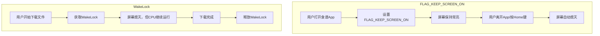
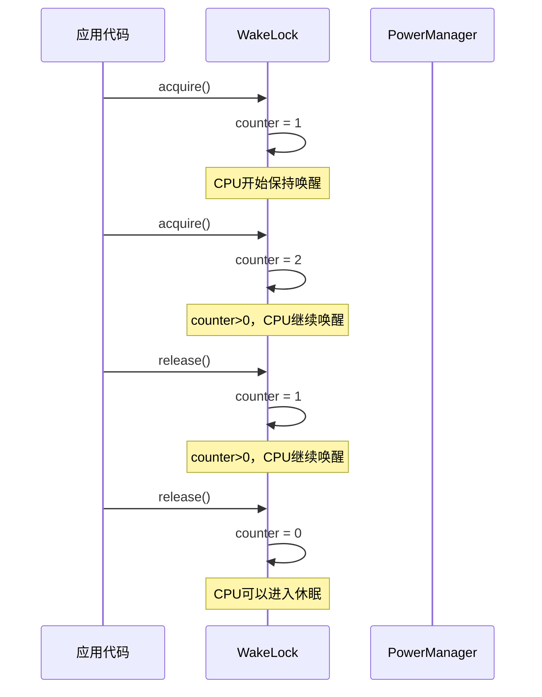
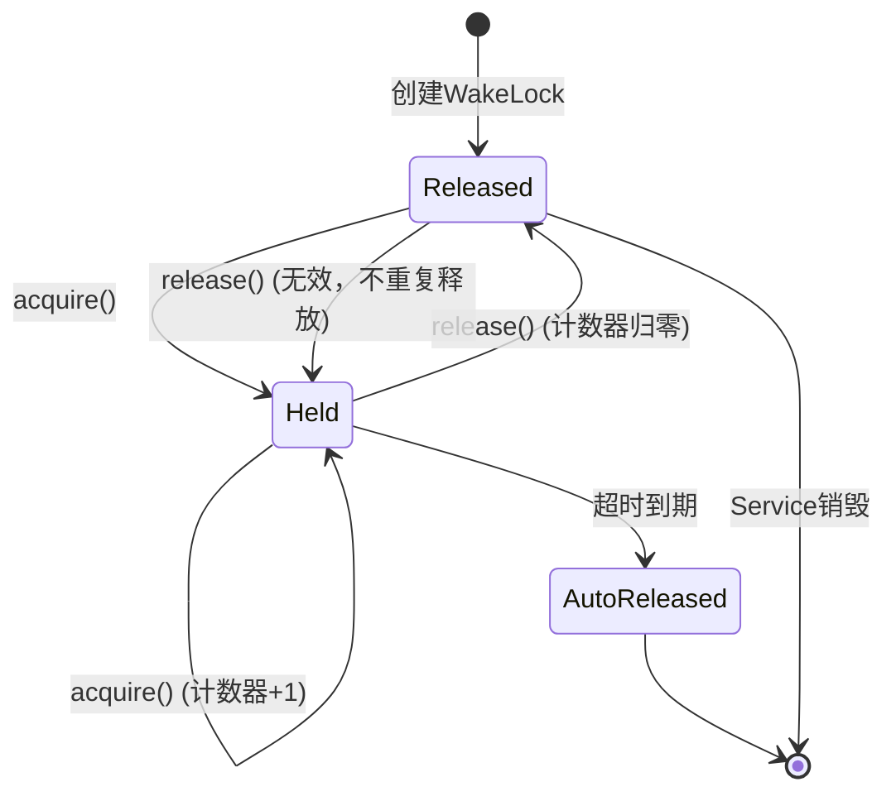

# 6.1.13 秋日午后的唤醒锁

午后的阳光变得更加慵懒，从松针间一缕一缕地漏下来，在林间空地上投出细碎的光斑。

希尔把餐具收进防水收纳盒，拍了拍手上的灰尘，转头看向黛琳。

"刚才你说的那个FLAG_KEEP_SCREEN_ON，我理解了——它是Window级别的，只管当前这个Activity的屏幕。"希尔一边说，一边比划着，"但是黛琳姐姐，我想到了一个场景。"

她掏出手机，屏幕亮起来又暗下去："比如我正在下载一个大文件，下载的时候屏幕是黑的——我总不能一直开着屏幕等它下完吧？可是下载任务还在后台跑着，系统要是休眠了，下载不就中断了吗？"

"FLAG_KEEP_SCREEN_ON管不了这个吧？"希尔抬起头，眼睛亮晶晶的。

黛琳正靠在树干上整理笔记，听到这个问题，她抬起头，嘴角微微上扬。

"你问到点子上了。"黛琳合上笔记本，从地上捡起一根松针，在指间轻轻转动，"这就要用到我们今天的主题了——WakeLock，唤醒锁。"

"唤醒锁？"洛芙把下巴搁在膝盖上，歪着头看黛琳，"听起来像是一把能叫醒什么东西的钥匙？"

"差不多就是这个意思。"黛琳把松针放在手心里，"Android系统里，当用户不操作设备一段时间后，系统就会进入休眠状态——CPU停止工作，屏幕熄灭，一切都在'睡觉'。但有时候，我们的应用需要在后台做一些事情，哪怕屏幕是黑的，哪怕用户已经放下手机去做别的事了。"

伊莎躺在吊床上，轻轻晃着："那唤醒锁就是……让CPU不睡觉的东西？"

"对，但不完全。"黛琳在洛芙身边的草地上坐下，"唤醒锁更像是给CPU发的'请勿打扰'牌子。它告诉系统：'嘿，在我做完事情之前，先别让这台设备休眠。'"

## 6.1.13.1 唤醒锁与FLAG_KEEP_SCREEN_ON的本质区别

黛琳掏出笔记本电脑，打开一个空白文档，开始画图。

"我们先来看一张对比图。"她说。



"图1展示了这两种机制的核心区别。"黛琳指着屏幕说，"左边是FLAG_KEEP_SCREEN_ON——它是窗口级别的，只有用户还在看这个窗口，屏幕才保持亮着。一旦用户离开，窗口不可见了，flag的效果就消失了。"

"右边是WakeLock——它是系统电源管理级别的。你获取WakeLock之后，哪怕屏幕熄灭了，哪怕用户按了电源键，CPU还是会继续运行，直到你主动释放这个锁。"

洛芙眨眨眼："那岂不是……WakeLock比特权还大？"

"可以这么理解。"黛琳笑了笑，"WakeLock是一种比较'重'的操作，因为它直接影响整个设备的电源状态。用得太多，用户的手机就会很耗电。所以Android系统对WakeLock的使用有严格的限制和最佳实践——这个我们待会儿会讲到。"

希尔凑过来看图："我明白了。FLAG管窗户，WakeLock管整栋楼的电闸。"

"非常好的比喻。"黛琳点头。

## 6.1.13.2 唤醒锁的类型

"不过，WakeLock也有好几种类型，不同类型管的事情不一样。"黛琳继续说道，"就像你们露营带的灯，有些是照亮整个营地的泛光灯，有些是只照一小块地方的聚光灯。"

她翻到下一页文档，上面列着一张表格。

| WakeLock类型 | 作用范围 | 屏幕 | CPU | 典型使用场景 |
|---|---|---|---|---|
| PARTIAL_WAKE_LOCK | 仅自己 | 允许熄灭 | 保持运行 | 后台下载、音乐播放 |
| SCREEN_BRIGHT_WAKE_LOCK | 仅自己 | 保持亮着 | 保持运行 | 视频播放（需要全亮度） |
| SCREEN_DIM_WAKE_LOCK | 仅自己 | 保持亮着（变暗） | 保持运行 | 游戏（需要屏幕亮但不刺眼） |
| FULL_WAKE_LOCK | 仅自己 | 保持亮着（最亮） | 保持运行 | 导航（需要最高亮度） |

"最常用的，也是官方最推荐使用的，是PARTIAL_WAKE_LOCK。"黛琳重点强调，"因为它只保证CPU运行，不影响屏幕——这样对电池的消耗是最小的。其他几种wake lock会同时控制屏幕状态，但从Android 5.0开始，这些flag大多已经被废弃了。"

"为什么废弃？"洛芙问。

"因为Google想让屏幕的管理更统一。"黛琳解释道，"如果你需要保持屏幕亮着，用FLAG_KEEP_SCREEN_ON就够了，不需要用WakeLock的这些类型。PARTIAL_WAKE_LOCK是唯一一个一直到现在还被推荐使用的wake lock类型——它只管CPU，不管屏幕。"

伊莎从吊床上坐起来："所以我们平时写代码，应该只用PARTIAL_WAKE_LOCK？"

"对，后台任务、下载、音乐播放，这些场景都用PARTIAL_WAKE_LOCK。"黛琳点头，"它足够轻量，对电池的影响也最小。"

## 6.1.13.3 获取唤醒锁的第一步——权限

"不过，在使用WakeLock之前，有一件非常重要的事情——必须在Manifest里声明权限。"黛琳的语气变得认真起来。

"什么权限？"希尔问。

"android.permission.WAKE_LOCK。"

黛琳打开AndroidManifest.xml文件：

```xml
<!-- AndroidManifest.xml -->
<manifest xmlns:android="http://schemas.android.com/apk/res/android"
    package="com.campingapp">

    <!-- 声明WAKE_LOCK权限 -->
    <uses-permission android:name="android.permission.WAKE_LOCK" />

    <application
        android:allowBackup="true"
        android:icon="@mipmap/ic_launcher"
        android:label="@string/app_name"
        android:theme="@style/Theme.CampingApp">
        
        <activity
            android:name=".MainActivity"
            android:exported="true">
            <intent-filter>
                <action android:name="android.intent.action.MAIN" />
                <category android:name="android.intent.category.LAUNCHER" />
            </intent-filter>
        </activity>
        
    </application>
</manifest>
```

"你看这个`<uses-permission android:name="android.permission.WAKE_LOCK" />`，"黛琳指着代码说，"这行代码告诉Android系统：'我的应用需要使用唤醒锁功能，请允许。'如果不声明这个权限，你的应用在尝试获取WakeLock的时候，系统会直接抛出SecurityException。"

"好严格啊……"洛芙缩了缩脖子。

"这是出于安全考虑。"黛琳说，"WakeLock可以让CPU在设备休眠时继续运行——如果一个恶意应用获取了WakeLock然后不释放，用户的手机就会一直开着，电池很快就会耗尽。所以Android强制要求声明这个权限，让用户在安装应用的时候就知道：'哦，这个应用可能会让我的手机保持唤醒状态。'"

## 6.1.13.4 获取唤醒锁的代码

"好，权限声明好了，接下来看代码怎么写。"黛琳打开一个新文件。

"WakeLock需要通过PowerManager来创建。PowerManager是Android系统服务之一，负责管理设备的电源状态。"

```kotlin
// 获取PowerManager服务
val powerManager = getSystemService(Context.POWER_SERVICE) as PowerManager

// 创建WakeLock对象
// 参数1：WakeLock类型（这里用PARTIAL_WAKE_LOCK）
// 参数2：标签，用于调试时识别这个WakeLock
val wakeLock = powerManager.newWakeLock(
    PowerManager.PARTIAL_WAKE_LOCK,
    "CampingApp::DownloadWakeLock"
)

// 获取WakeLock（此时CPU开始保持运行）
wakeLock.acquire()

// ... 在这里执行后台任务，例如下载文件 ...

// 任务完成后释放WakeLock
wakeLock.release()
```

"看这段代码，"黛琳指着屏幕说，"第一步，通过`getSystemService()`获取PowerManager的引用。第二步，调用`newWakeLock()`方法创建一个WakeLock对象，需要传入类型和标签。第三步，调用`acquire()`获取锁。第四步，任务完成后调用`release()`释放锁。"

希尔盯着代码看了一会儿："看起来挺简单的。但是……这个acquire和release必须配对吗？"

"必须，而且必须严格配对。"黛琳的表情变得严肃，"这是WakeLock使用中最重要的一条规则——你acquire了多少次，就必须release多少次。"

"为什么？"洛芙问。

"因为WakeLock内部有一个计数器。"黛琳解释道，"每一次调用acquire()，计数器就加1；每一次调用release()，计数器就减1。只有当计数器归零的时候，WakeLock才会真正释放，CPU才能进入休眠。"



"图2展示了计数器的工作原理。"黛琳说，"第一次acquire，计数器变成1，CPU保持唤醒。第二次acquire，计数器变成2。只有第一次release之后，计数器变成1，CPU还是不能休眠。只有第二次release，计数器归零了，CPU才能真正休眠。"

"如果忘记release，会怎样？"希尔问。

"你的应用就会'持有'这个WakeLock，CPU会一直运行，直到——"黛琳顿了顿，"要么用户发现手机特别烫，强行关闭你的应用；要么系统检测到异常，自动替你释放。但这两种都不是好的用户体验。"

## 6.1.13.5 try-finally——安全释放的黄金法则

"所以，release()的调用必须放在一个绝对会执行的地方。"黛琳强调，"在Android开发里，最标准的做法是用try-finally块。"

```kotlin
val powerManager = getSystemService(Context.POWER_SERVICE) as PowerManager
val wakeLock = powerManager.newWakeLock(
    PowerManager.PARTIAL_WAKE_LOCK,
    "CampingApp::DownloadWakeLock"
)

try {
    // 获取WakeLock
    wakeLock.acquire()
    
    // 执行后台任务
    downloadFile(url)
    
    // 处理下载结果
    processDownloadedFile()
    
} finally {
    // 无论是否发生异常，这里一定会执行
    // 这是保证WakeLock被释放的关键
    wakeLock.release()
}
```

"看这个结构，"黛琳指着代码说，"acquire()在try块之前调用，release()在finally块里。无论try块里的代码是正常执行完了，还是中途抛出了异常，finally块都会执行——这就保证了WakeLock一定会被释放。"

伊莎若有所思："就像我们露营的时候，不管发生什么，最后离开前一定要灭火一样？"

"非常好的比喻！"黛琳笑着说，"露营用火要小心，后台用WakeLock也要小心。灭火不完全会引发森林火灾，WakeLock不释放会引发电池耗电——都是大事。"

"可是如果acquire()本身就抛异常了呢？"希尔提出了一个细节问题，"那岂不是连acquire()都没成功，后面的try块根本进不去？"

"你说得对。"黛琳点点头，"所以更安全的写法是把acquire()也放进try块里，或者用另一种方式——"

```kotlin
val powerManager = getSystemService(Context.POWER_SERVICE) as PowerManager
val wakeLock = powerManager.newWakeLock(
    PowerManager.PARTIAL_WAKE_LOCK,
    "CampingApp::DownloadWakeLock"
)

wakeLock.acquire()  // 在try外面也可以，但release必须在finally里

try {
    // 执行后台任务
    downloadFile(url)
    processDownloadedFile()
    
} finally {
    // isHeld()检查可以防止重复释放异常
    if (wakeLock.isHeld()) {
        wakeLock.release()
    }
}
```

"这里用了一个`isHeld()`检查，"黛琳解释道，"它返回一个布尔值，表示这个WakeLock当前是否处于持有状态。在release()之前检查一下，可以避免一些意外情况。"

## 6.1.13.6 超时获取——另一种安全方式

"除了手动release之外，WakeLock还支持另一种获取方式——带超时的acquire。"黛琳说。

"带超时？"洛芙好奇地歪头。

"对。有些场景下，你不确定任务需要多久，但你知道'最多不能超过多久'。这时候可以用`acquire(timeout)`，在指定时间之后，系统会自动替你释放WakeLock。"

```kotlin
val powerManager = getSystemService(Context.POWER_SERVICE) as PowerManager
val wakeLock = powerManager.newWakeLock(
    PowerManager.PARTIAL_WAKE_LOCK,
    "CampingApp::ShortTaskWakeLock"
)

// 获取WakeLock，10分钟后自动释放
// 参数单位是毫秒
wakeLock.acquire(10 * 60 * 100L)  // 10分钟

try {
    // 执行一个预计不超过10分钟的任务
    performShortTask()
    
} finally {
    // 即使用了超时获取，最好还是手动释放
    if (wakeLock.isHeld()) {
        wakeLock.release()
    }
}
```

"看这里，`acquire(10 * 60 * 100L)`的意思是：'帮我获取WakeLock，但如果10分钟之内我没有手动释放，系统会在10分钟后自动帮我释放。'"黛琳解释道，"这样即使你的代码有bug，忘记手动释放了，系统也不会让WakeLock永远挂着。"

"这是不是相当于……买了个保险？"希尔说。

"可以这么理解。"黛琳微笑，"超时获取是一种防御性编程的实践——假设你的代码可能会出问题，所以给自己留一条后路。"

"但是，"黛琳话锋一转，"即使使用了超时获取，也最好在finally块里手动释放。这样做有两个好处：第一，如果任务提前完成了，手动释放可以让CPU早点休眠，节省电量；第二，养成这个习惯之后，你就不会忘记在非超时场景下也写finally块了。"

## 6.1.13.7 反模式——两个必须避免的坑

"WakeLock有两个最常见的错误使用方式。"黛琳竖起两根手指，"第一，在UI线程获取PARTIAL_WAKE_LOCK；第二，获取WakeLock后执行耗时操作但不释放。"

"第一个问题，"黛琳解释道，"PARTIAL_WAKE_LOCK的作用是让CPU在屏幕熄灭后继续运行。如果你在一个已经显示了UI的Activity里获取PARTIAL_WAKE_LOCK，然后执行耗时操作，用户会看到屏幕亮着、应用没响应，但又不明白发生了什么——因为你的代码在后台跑，前台的UI被阻塞了。"

```kotlin
// 反模式：不要在UI线程中直接获取WakeLock
class BadActivity : AppCompatActivity() {
    
    override fun onCreate(savedInstanceState: Bundle?) {
        super.onCreate(savedInstanceState)
        
        val powerManager = getSystemService(Context.POWER_SERVICE) as PowerManager
        val wakeLock = powerManager.newWakeLock(
            PowerManager.PARTIAL_WAKE_LOCK,
            "BadExample"
        )
        
        wakeLock.acquire()  // 反模式：在UI线程获取WakeLock
        
        // 在UI线程执行耗时操作——这会阻塞界面渲染
        val data = downloadFromNetwork()  // 假设这是耗时操作
        textView.text = data
    }
}
```

"这是一个典型的反模式。"黛琳摇头，"在UI线程获取PARTIAL_WAKE_LOCK，然后执行网络请求——用户会看到界面卡住，但不知道你的应用在后台做什么。更糟糕的是，PARTIAL_WAKE_LOCK是'不保持屏幕'的，所以用户可能会奇怪：'为什么我的屏幕黑了但手机还是热的？'"

"正确的方式是结合其他异步API使用——比如我们在前面章节学过的Executor、Handler，或者WorkManager。"黛琳说。

```kotlin
// 正确模式：在后台线程中使用WakeLock
class GoodActivity : AppCompatActivity() {
    
    private lateinit var wakeLock: PowerManager.WakeLock
    
    override fun onCreate(savedInstanceState: Bundle?) {
        super.onCreate(savedInstanceState)
        
        val powerManager = getSystemService(Context.POWER_SERVICE) as PowerManager
        wakeLock = powerManager.newWakeLock(
            PowerManager.PARTIAL_WAKE_LOCK,
            "GoodExample::Download"
        )
        
        // 在后台线程执行网络操作
        CompletableFuture.supplyAsync {
            wakeLock.acquire()  // 在后台线程获取WakeLock
            downloadFromNetwork()
        }.thenAccept { result ->
            // 在UI线程更新界面
            textView.text = result
            // 操作完成后释放WakeLock
            if (wakeLock.isHeld()) {
                wakeLock.release()
            }
        }
    }
}
```

"第二个问题，"黛琳继续说道，"WakeLock获取后不释放——这是更严重的错误。"

```kotlin
// 反模式：WakeLock获取后不释放
class NeverReleaseActivity : AppCompatActivity() {
    
    override fun onCreate(savedInstanceState: Bundle?) {
        super.onCreate(savedInstanceState)
        
        val powerManager = getSystemService(Context.POWER_SERVICE) as PowerManager
        val wakeLock = powerManager.newWakeLock(
            PowerManager.PARTIAL_WAKE_LOCK,
            "NeverRelease"
        )
        
        wakeLock.acquire()
        // 执行任务...
        // 如果中途return或抛出异常，WakeLock永远不会被释放
        // 这会导致电池被永久消耗
    }
    
    // 如果忘记在onDestroy里检查和释放，后果很严重
    override fun onDestroy() {
        super.onDestroy()
        // 如果忘记写这段代码，WakeLock就会泄漏
    }
}
```

"如果WakeLock获取后不释放，CPU会一直运行，直到应用被杀掉为止。"黛琳说，"用户的手机会变得非常烫，电池会迅速耗尽。在Android系统的Battery History里，这样的应用会显示为'Excessive partial wake locks'——这是Google Play商店审核时的一个红线，轻则被拒绝上架，重则被下架。"

## 6.1.13.8 在Service中使用WakeLock——下载服务的例子

"好了，基础知识讲得差不多了。"黛琳合上笔记本，"我们来实践一下——写一个后台下载服务，它会在下载过程中持有WakeLock。"

希尔立刻来了精神："这个我在项目里真的用过！"

"那正好，你可以帮我检查代码有没有问题。"黛琳笑道。

```kotlin
// DownloadService.kt
// 这是一个用于后台下载的Foreground Service
class DownloadService : Service() {
    
    private lateinit var powerManager: PowerManager
    private var wakeLock: PowerManager.WakeLock? = null
    
    companion object {
        const val ACTION_START = "com.campingapp.action.START_DOWNLOAD"
        const val ACTION_STOP = "com.campingapp.action.STOP_DOWNLOAD"
        const val EXTRA_URL = "extra_url"
    }
    
    override fun onCreate() {
        super.onCreate()
        powerManager = getSystemService(Context.POWER_SERVICE) as PowerManager
    }
    
    override fun onStartCommand(intent: Intent?, flags: Int, startId: Int): Int {
        when (intent?.action) {
            ACTION_START -> {
                val url = intent.getStringExtra(EXTRA_URL) ?: return START_NOT_STICKY
                startForegroundService()
                startDownload(url)
            }
            ACTION_STOP -> {
                stopDownload()
                stopForeground(STOP_FOREGROUND_REMOVE)
                stopSelf()
            }
        }
        return START_NOT_STICKY
    }
    
    private fun startForegroundService() {
        // 创建通知，让用户知道有后台任务在运行
        val notification = NotificationCompat.Builder(this, "download_channel")
            .setContentTitle("正在下载")
            .setContentText("文件下载中...")
            .setSmallIcon(R.drawable.ic_download)
            .setPriority(NotificationCompat.PRIORITY_LOW)
            .build()
        
        // 启动前台服务，这样系统不容易杀掉我们
        if (Build.VERSION.SDK_INT >= Build.VERSION_CODES.Q) {
            startForeground(
                NOTIFICATION_ID,
                notification,
                ServiceInfo.FOREGROUND_SERVICE_TYPE_DATA_SYNC
            )
        } else {
            startForeground(NOTIFICATION_ID, notification)
        }
    }
    
    private fun startDownload(url: String) {
        // 在后台线程执行下载
        Thread {
            // 获取WakeLock——这里用PARTIAL_WAKE_LOCK
            // 因为我们只需要CPU运行，不需要屏幕
            wakeLock = powerManager.newWakeLock(
                PowerManager.PARTIAL_WAKE_LOCK,
                "DownloadService::DownloadWakeLock"
            ).apply {
                acquire(30 * 60 * 1000L)  // 最多30分钟超时
            }
            
            try {
                // 执行下载
                downloadFile(url)
            } catch (e: Exception) {
                Log.e("DownloadService", "下载失败", e)
            } finally {
                // 下载完成后释放WakeLock
                wakeLock?.let {
                    if (it.isHeld()) {
                        it.release()
                    }
                }
                // 停止前台服务
                stopForeground(STOP_FOREGROUND_REMOVE)
                stopSelf()
            }
        }.start()
    }
    
    private fun downloadFile(url: String) {
        // 这里是简化的下载逻辑
        // 实际项目中应该使用OkHttp或Retrofit等库
        val connection = URL(url).openConnection() as HttpURLConnection
        connection.connect()
        
        val inputStream = connection.inputStream
        val outputStream = openFileOutput("downloaded_file", Context.MODE_PRIVATE)
        
        val buffer = ByteArray(4096)
        var bytesRead: Int
        while (inputStream.read(buffer).also { bytesRead = it } != -1) {
            outputStream.write(buffer, 0, bytesRead)
        }
        
        outputStream.close()
        inputStream.close()
    }
    
    override fun onBind(intent: Intent?): IBinder? = null
}
```

"这段代码展示了如何在Service中使用WakeLock。"黛琳指着屏幕说，"首先，这是一个Foreground Service——因为下载是用户可以感知到的后台任务，用前台服务可以降低被系统杀掉的概率。其次，WakeLock在后台线程中获取，而不是在主线程。最后，WakeLock使用`acquire(timeout)`设置了30分钟的超时——这是防止WakeLock泄漏的保险。"

希尔凑近看代码："这里用`apply{}`是什么意思？"

"这是Kotlin的扩展函数。"黛琳解释道，"`powerManager.newWakeLock(...).apply { acquire() }`的意思是：创建WakeLock对象，然后在这个对象上调用`acquire()`方法。`apply{}`的作用是把对象本身作为接收者，在花括号里可以省略`this`。"

"我懂了！"洛芙举手，"相当于先new一个WakeLock，然后用`.apply{}`包起来，在里面调用它的方法。"

"对，就是这个意思。"黛琳点头，"这种写法在Kotlin里很常见，可以让代码更紧凑。"

## 6.1.13.9 监听WakeLock的状态

"对了，WakeLock还有一个有用的方法——`isHeld()`。"黛琳说，"它可以检查当前WakeLock是否处于持有状态。"

```kotlin
val powerManager = getSystemService(Context.POWER_SERVICE) as PowerManager
val wakeLock = powerManager.newWakeLock(
    PowerManager.PARTIAL_WAKE_LOCK,
    "StatusCheckWakeLock"
)

// 初始状态：未获取，isHeld()返回false
Log.d("WakeLock", "获取前: ${wakeLock.isHeld()}")  // false

wakeLock.acquire()

// 获取后：isHeld()返回true
Log.d("WakeLock", "获取后: ${wakeLock.isHeld()}")  // true

wakeLock.release()

// 释放后：isHeld()返回false
Log.d("WakeLock", "释放后: ${wakeLock.isHeld()}")  // false
```

"图3展示了WakeLock的完整生命周期。"黛琳在白板上画了最后一张图。



"图3是WakeLock的完整状态机。"黛琳说，"WakeLock有三种结束方式：手动release释放、超时自动释放、以及Service销毁时销毁。记住这三种路径，可以帮助你在debug的时候找到问题。"

"好了，关于WakeLock的基础知识，今天就讲到这里。"黛琳站起身，伸了个懒腰，"总结一下——"

"第一，WakeLock是系统电源管理级别的锁，可以让CPU在屏幕熄灭后继续运行。"

"第二，PARTIAL_WAKE_LOCK是最推荐的类型，因为它只管CPU，不管屏幕，对电池的影响最小。"

"第三，使用WakeLock必须在Manifest里声明WAKE_LOCK权限。"

"第四，获取WakeLock后必须释放，否则会导致电池耗尽。最好使用try-finally结构来保证释放。"

"第五，可以用`acquire(timeout)`设置超时，系统会自动帮你释放。"

希尔点点头："明白了。WakeLock是后台任务的守护者，让CPU在系统休眠的时候还能继续工作。"

"但是请神的容易，送神的难。"伊莎补充道，"请来了WakeLock，一定要记得送走。"

大家都笑了起来。秋日的阳光照在林间空地上，斑驳的光影在树叶间跳跃。

---

## 专业技术总结

**WakeLock（唤醒锁）** 是一种系统电源管理机制，允许应用在设备进入休眠状态时保持CPU继续运行，从而确保后台任务（如下载、音乐播放、文件同步）能够完成。

#### 结构图

```mermaid
classDiagram
    class PowerManager {
        +newWakeLock(flag: Int, tag: String): WakeLock
        +isWakeLockLevelSupported(level: Int): Boolean
    }
    
    class WakeLock {
        -mToken: IBinder
        -mCount: Int
        -mFlags: Int
        -mTag: String
        +acquire(): Unit
        +acquire(timeout: Long): Unit
        +release(): Unit
        +isHeld(): Boolean
        +setReferenceCounted(value: Boolean): Unit
    }
    
    class PowerManager--WakeLock : creates
    
    WakeLock *-- "mCount (引用计数器)" Counter
    
    note for WakeLock "PARTIAL_WAKE_LOCK: 只保持CPU\nSCREEN_BRIGHT_WAKE_LOCK: CPU + 屏幕高亮 (已废弃)\nSCREEN_DIM_WAKE_LOCK: CPU + 屏幕变暗 (已废弃)\nFULL_WAKE_LOCK: CPU + 屏幕全亮 (已废弃)"
```

#### 复杂度与影响

| 维度 | 影响 |
|---|---|
| 电池消耗 | PARTIAL_WAKE_LOCK：中等（仅CPU）；其他类型：较高（CPU+屏幕） |
| 系统休眠 | 获取WakeLock后，系统无法进入休眠状态，直到所有WakeLock被释放 |
| 被杀风险 | WakeLock持有期间，即使应用在后台，也不会因休眠被系统轻易杀死 |

#### 反模式与陷阱

1. **WakeLock获取后不释放** → 导致电池永久耗尽、应用被Google Play拒绝上架
   → 修复：使用try-finally块，始终在finally中release

2. **在UI线程获取PARTIAL_WAKE_LOCK后执行耗时操作** → 阻塞UI线程，用户看到界面卡顿
   → 修复：WakeLock应在后台线程使用，结合Executor或WorkManager

3. **重复调用acquire()但只release()一次** → 计数器不为零，WakeLock无法释放
   → 修复：acquire/release必须配对，或使用reference-counted=false的WakeLock

4. **不声明WAKE_LOCK权限** → SecurityException
   → 修复：在Manifest中添加`<uses-permission android:name="android.permission.WAKE_LOCK" />`

5. **在Activity中使用WakeLock替代FLAG_KEEP_SCREEN_ON** → WakeLock会影响整个系统，电池消耗大
   → 修复：前台Activity使用FLAG_KEEP_SCREEN_ON，后台任务才用WakeLock

#### 设计哲学

**最小特权原则 + 防御性编程**

- 只在必要时持有WakeLock，使用完毕后立即释放
- 优先使用PARTIAL_WAKE_LOCK（最小影响）
- 设置超时作为兜底保护
- 使用reference-counted=false避免计数器混乱
- 结合Foreground Service降低被杀死风险

---

#### 🏕️ 动手练习

### 练习项目：下载管理器服务

**项目目标**：构建一个带WakeLock保护的后台下载管理器，当下载大文件时确保CPU持续运行。

**方式A：项目制**

**项目概述**：开发一个Android应用，包含一个Foreground Service执行文件下载，演示WakeLock的获取、释放与超时机制。

**Task 1 - 项目初始化**
- 目标：创建Android项目，声明WAKE_LOCK权限和前台服务权限
- 步骤：创建Empty Activity项目；在AndroidManifest.xml中添加`android.permission.WAKE_LOCK`权限和`android.permission.FOREGROUND_SERVICE`权限
- 验收标准：`[ ] Manifest中有WAKE_LOCK声明 [ ] Manifest中有FOREGROUND_SERVICE声明 [ ] 项目可编译运行`
- 提示：
```kotlin
// AndroidManifest.xml中添加
<uses-permission android:name="android.permission.WAKE_LOCK" />
<uses-permission android:name="android.permission.FOREGROUND_SERVICE" />
```

**Task 2 - 创建Foreground Service**
- 目标：创建DownloadService，接收URL并启动下载
- 步骤：创建继承Service的DownloadService类；实现onBind()返回null；在onStartCommand()中处理启动和停止下载的Intent
- 验收标准：`[ ] DownloadService继承自Service [ ] onStartCommand()可以处理ACTION_START [ ] Service在Manifest中注册`
- 提示：
```kotlin
class DownloadService : Service() {
    override fun onStartCommand(intent: Intent?, flags: Int, startId: Int): Int {
        when (intent?.action) {
            "START" -> { /* 启动下载 */ }
            "STOP" -> { stopSelf() }
        }
        return START_NOT_STICKY
    }
    override fun onBind(intent: Intent?) = null
}
```

**Task 3 - 在Service中获取WakeLock**
- 目标：在后台线程中正确获取WakeLock
- 步骤：在DownloadService中获取PowerManager；创建PARTIAL_WAKE_LOCK类型的WakeLock；在线程中调用acquire()
- 验收标准：`[ ] PowerManager通过getSystemService获取 [ ] WakeLock类型为PARTIAL_WAKE_LOCK [ ] acquire()在后台线程调用，不在主线程`
- 提示：
```kotlin
val powerManager = getSystemService(Context.POWER_SERVICE) as PowerManager
val wakeLock = powerManager.newWakeLock(
    PowerManager.PARTIAL_WAKE_LOCK,
    "DownloadService::MyWakeLock"
)
// 在Thread或Coroutine中调用
Thread {
    wakeLock.acquire()
    // 执行下载...
}.start()
```

**Task 4 - 实现try-finally安全释放**
- 目标：在finally块中释放WakeLock，确保不会泄漏
- 步骤：在try块中执行下载逻辑；在finally块中检查isHeld()并release()
- 验收标准：`[ ] 使用try-finally结构 [ ] 在finally中检查isHeld() [ ] 调用release()释放WakeLock`
- 提示：
```kotlin
wakeLock.acquire()
try {
    // 执行下载
} finally {
    if (wakeLock.isHeld()) {
        wakeLock.release()
    }
}
```

**Task 5 - 添加超时保护**
- 目标：使用acquire(timeout)防止WakeLock永久持有
- 步骤：将wakeLock.acquire()改为wakeLock.acquire(30 * 60 * 1000L)
- 验收标准：`[ ] 使用带超时的acquire() [ ] 设置了合理的超时时间 [ ] finally块中仍有release()作为双保险`
- 提示：
```kotlin
wakeLock.acquire(30 * 60 * 1000L)  // 30分钟超时
try {
    // 下载文件
} finally {
    if (wakeLock.isHeld()) {
        wakeLock.release()
    }
}
```

**Task 6 - 创建前台通知**
- 目标：使用NotificationCompat创建前台服务通知
- 步骤：创建NotificationCompat.Builder；设置标题、描述和小图标；调用startForeground()
- 验收标准：`[ ] 创建NotificationCompat.Builder [ ] 调用startForeground() [ ] 设置了通知渠道（Android 8.0+）`
- 提示：
```kotlin
if (Build.VERSION.SDK_INT >= Build.VERSION_CODES.O) {
    val channel = NotificationChannel("download", "下载服务", 
        NotificationManager.IMPORTANCE_LOW)
    val manager = getSystemService(NotificationManager::class.java)
    manager.createNotificationChannel(channel)
}
val notification = NotificationCompat.Builder(this, "download")
    .setContentTitle("正在下载")
    .setContentText("文件下载中...")
    .setSmallIcon(R.drawable.ic_download)
    .build()
startForeground(NOTIFICATION_ID, notification)
```

**Task 7 - 实现下载进度通知**
- 目标：在下载过程中更新通知进度
- 步骤：使用NotificationManager更新通知；设置ProgressBar的max和current
- 验收标准：`[ ] 使用NotificationManager.notify() [ ] 设置了setProgress() [ ] 下载完成后移除进度显示`
- 提示：
```kotlin
val notification = NotificationCompat.Builder(this, "download")
    .setContentTitle("正在下载")
    .setContentText("10%")
    .setSmallIcon(R.drawable.ic_download)
    .setProgress(100, 10, false)
    .build()
notificationManager.notify(NOTIFICATION_ID, notification)
```

**Task 8 - 验证WakeLock行为**
- 目标：使用adb shell dumpsys power验证WakeLock的持有状态
- 步骤：启动下载服务；运行`adb shell dumpsys power | grep -i wake`查看WakeLock；停止下载后再次检查
- 验收标准：`[ ] 能通过adb查看WakeLock状态 [ ] 下载期间WakeLock处于held状态 [ ] 下载完成后WakeLock被正确释放`
- 提示：运行`adb shell dumpsys power`查看完整的电源状态信息

**Task 9 - 添加Activity启动和停止下载的界面**
- 目标：创建简单的UI来启动和停止下载
- 步骤：创建包含EditText（输入URL）、Button（开始下载）、Button（停止下载）的布局；在Activity中绑定Service
- 验收标准：`[ ] EditText用于输入下载URL [ ] 开始按钮启动DownloadService [ ] 停止按钮发送STOP Action`
- 提示：
```kotlin
startBtn.setOnClickListener {
    val intent = Intent(this, DownloadService::class.java).apply {
        action = "START"
        putExtra("url", urlEditText.text.toString())
    }
    startForegroundService(intent)
}
stopBtn.setOnClickListener {
    val intent = Intent(this, DownloadService::class.java).apply {
        action = "STOP"
    }
    startService(intent)
}
```

**Task 10 - 综合测试**
- 目标：启动下载，按电源键让屏幕熄灭，验证下载是否继续
- 步骤：启动下载后立即按电源键让屏幕熄灭；等待几分钟后检查文件是否下载完成；检查日志中是否有WakeLock的acquire和release记录
- 验收标准：`[ ] 屏幕熄灭后下载继续进行 [ ] 文件成功下载完成 [ ] 没有WakeLock泄漏日志`
- 提示：
```kotlin
// 在下载代码中添加日志
Log.d("DownloadService", "WakeLock acquired: ${wakeLock.isHeld()}")
// ... 下载逻辑 ...
Log.d("DownloadService", "WakeLock released")
```

**面试热身**（用自己的话回答）

1. WakeLock和FLAG_KEEP_SCREEN_ON的核心区别是什么？在什么场景下应该选择WakeLock而不是FLAG_KEEP_SCREEN_ON？
2. PARTIAL_WAKE_LOCK、SCREEN_BRIGHT_WAKE_LOCK和FULL_WAKE_LOCK分别控制什么？哪种是最推荐的，为什么？
3. 如果一个WakeLock被acquire()了两次但只release()了一次，会发生什么？如何避免这个问题？
4. 为什么说在UI线程中获取PARTIAL_WAKE_LOCK是错误的做法？正确的做法应该是什么？
5. try-finally结构对于WakeLock的管理为什么如此重要？请解释其中的设计思想。


### 参考实现要点

1. **始终使用try-finally包裹WakeLock的获取与释放**，即使使用了超时acquire也要在finally中release

2. **优先使用PARTIAL_WAKE_LOCK**，它是唯一在现代Android版本中被推荐使用的WakeLock类型，对电池影响最小

3. **结合Foreground Service使用WakeLock**：下载、音乐等用户可感知的长时间后台任务，应该同时使用Foreground Service和WakeLock，降低被系统杀死的概率

4. **使用`acquire(timeout)`作为兜底保护**，即使代码有bug，系统也不会让WakeLock永久持有

5. **在Manifest中声明WAKE_LOCK权限**，否则会抛出SecurityException

6. **使用`isHeld()`检查WakeLock状态**，在release前检查可以避免重复释放异常

7. **使用有意义WakeLock标签**（如"DownloadService::FileDownload"），方便在调试时通过dumpsys命令定位问题

8. **WakeLock适合的场景**：后台下载、音乐播放、文件同步、长计算任务；不适合的场景：前台UI操作（用FLAG_KEEP_SCREEN_ON）

---

> **学习建议**
> 
> 1. 创建一个小项目，练习在后台线程中获取和释放WakeLock，用Logcat观察acquire和release的调用时机
> 2. 尝试用`adb shell dumpsys power`命令查看设备的电源状态，了解WakeLock在系统层面的表现
> 3. 结合上一章的FLAG_KEEP_SCREEN_ON，思考一个实际场景：既需要在UI上保持屏幕常亮，又需要在后台执行任务，应该如何组合使用这两种API
> 4. 研究Android 5.0之后为什么废弃了SCREEN_BRIGHT_WAKE_LOCK等类型，理解Android系统设计"屏幕归Window管、CPU归PowerManager管"的分层思想
> 5. 下一章我们将学习"释放唤醒锁"，深入探讨WakeLock释放的各种场景和注意事项

## 🍹洛芙的小小日记本

今天学了WakeLock！原来后台任务要让CPU"别睡觉"，要用唤醒锁。黛琳姐姐说WakeLock就像请神容易送神难——请来了必须记得送走。用try-finally释放，还有acquire(timeout)超时保险，希尔姐姐说这叫"防御性编程"——给自己留条后路。感觉写代码真的要很细心啊，一个小疏忽就会让用户的手机电池遭殃。🌲🔋

## 今日关键词

**WakeLock（唤醒锁）**：一种系统电源管理机制，允许应用在设备休眠时保持CPU继续运行，确保后台任务能够完成

**PARTIAL_WAKE_LOCK**：最推荐的WakeLock类型，只保持CPU运行，不影响屏幕，对电池消耗较小

**PowerManager**：Android系统服务之一，负责管理设备电源状态，通过newWakeLock()方法创建WakeLock对象

**WAKE_LOCK权限**：声明WakeLock使用权限，必须在AndroidManifest.xml中声明，否则会抛出SecurityException

**Foreground Service**：前台服务，在通知栏显示持续通知，降低被系统杀死的概率，常与WakeLock配合使用

**try-finally**：确保WakeLock一定被释放的标准写法，acquire()在try之前，release()在finally块中

**isHeld()**：检查WakeLock当前是否处于持有状态的方法，在release前检查可避免异常

**acquire(timeout)**：带超时的WakeLock获取方法，在指定时间后系统自动释放，是防止WakeLock泄漏的兜底保护

**计数器机制**：WakeLock内部使用计数器跟踪acquire/release配对，只有计数器归零时CPU才能真正休眠

**reference-counted**：WakeLock的计数引用模式，默认为true（每次acquire增加计数），可设为false（忽略计数）

**Excessive partial wake locks**：Google Play审核中的红线指标，指WakeLock持有时间过长或未释放，会导致应用被拒绝上架

**防御性编程**：一种编程思想，假设代码可能出错，因此主动添加保护措施，如超时获取WakeLock
