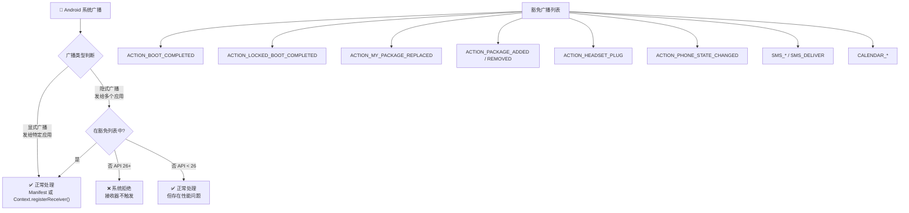

# 6.1.14 隐式广播异常

## 正文

太阳已经往西边的大山后面沉下去了一大截。

不是下午茶时间那种"太阳还高高的"的感觉，而是真正开始往傍晚过渡的时分。松林的影子被拉得老长，从树干旁边一直延伸到四个人围坐的那块大石头边上。空气里多了几分凉意，伊莎已经从背包里摸出了一条薄薄的针织披肩，随意地搭在膝盖上。

"那刚才那个 FLAG_KEEP_SCREEN_ON 讲完了，是不是该休息一下了？"

希尔把笔记本往旁边一合，伸了个大大的懒腰。她的手腕上还沾着刚才调试 WakeLock 时用的银色记号笔印，怎么蹭都蹭不掉。

"休息什么呀，"黛琳笑着摇头，从石头下面抽出一个保鲜盒，"伊莎今天早上烤的司酮（scone），我特意留了几块。趁还软着吃才好。"

保鲜盒一打开，一股带着面粉和黄油混合香气的温热味道就飘了出来。伊莎的司酮是这趟露营之旅的明星出品，每天早上现烤，凉了之后就换成新的。

"伊莎的司酮永远都是全营最好的。"洛芙想都不想就接过一块，咬了一大口。外酥内软，葡萄干给得恰到好处。

伊莎轻轻拨开额前的头发，微微笑了笑，又把保鲜盒往黛琳那边推了推。

"那下午茶之后呢？"希尔又问，"下午茶之后讲什么？"

黛琳用叉子把司酮切成小块，动作很优雅。"上午我们讲了 WakeLock，这个是用来保持 CPU 运转的。但是还有一个东西——"

她顿了顿，往天上看了一眼。几只归巢的鸟从松树尖上掠过，留下一串清亮的鸣叫。

"还有一个东西叫广播。"

"广播？"洛芙又咬了一口司酮，碎屑差点喷出来。

"嗯，广播。"黛琳点点头，"就像你们小时候玩的那个游戏——一个人站在圈子中间喊一句话，只有特定的人能听到。但是在 Android 系统里，这个游戏要复杂得多。"

希尔听到这个比喻，嘴角翘了翘。"哦哦，我知道了。就是那种——比如手机连上了 WiFi，系统就会发一个广播，然后所有想知道这件事的应用都可以去听。"

"对。"黛琳点头，"这就是所谓的隐式广播（Implicit Broadcast）——系统发给所有人，但是只有符合特定条件的应用才会真正收到。"

"那什么情况下会收不到呢？"洛芙问。

"这个问题问得好。"黛琳把最后一点司酮塞进嘴里，拍了拍手上的碎屑，"从 Android O（也就是 API 26）开始，系统对隐式广播做出了很大限制。"

她伸出一根手指。

"如果你在 AndroidManifest 里声明了一个 BroadcastReceiver 来接收隐式广播，系统会直接拒绝——你的应用根本收不到这个广播。"

"哦——"洛芙拉长了调，"这是为什么呀？"

黛琳靠到身后的松树干上，抬头看着从松针缝隙间漏下来的夕阳光线。

"你想啊，如果每个应用都去监听隐式广播——比如网络状态变化啦、屏幕解锁啦、安装了新应用啦——那每次系统发这些广播的时候，所有应用都要被唤醒一次。"

"70 多个应用同时被唤醒……"希尔接话，脸上露出那种"我懂这个场景"的表情，"CommonsWare 大神当年统计过，一台出厂的安卓手机上，有 70 多个应用都在监听 ACTION_BOOT_COMPLETED。"

"每次开机，这 70 多个应用全都被系统拉起来。就为了看看是不是自己的应用更新了。"黛琳说。

"好浪费啊。"洛芙皱起眉头。

"对。所以 Google 就出了这个限制——别在 AndroidManifest 里瞎注册隐式广播了，除非是那些特别重要的、系统离不开的广播。"

"那有哪些广播是例外呢？"伊莎问。她的声音轻轻的，像是风吹过松针的沙沙声。

黛琳从口袋里摸出了自己的手机，划开屏幕，调出了一个文档。

"这就是今天的重点——隐式广播的豁免列表。"

她把手机屏幕转向大家。上面是一份列着好几个广播名称的清单。

```
📱 图 1 - Android O+ 隐式广播豁免列表（部分）

┌─────────────────────────────────────────────────────────────┐
│                    可以继续在 Manifest 声明的隐式广播        │
├─────────────────────────────────────────────────────────────┤
│  1. ACTION_BOOT_COMPLETED        - 设备启动完成              │
│  2. ACTION_LOCKED_BOOT_COMPLETED - 锁定状态下的设备启动      │
│  3. ACTION_MY_PACKAGE_REPLACED   - 当前应用被更新替换        │
│  4. ACTION_PACKAGE_ADDED         - 新包被安装（任意包）      │
│  5. ACTION_PACKAGE_REMOVED       - 包被卸载（任意包）        │
│  6. ACTION_HEADSET_PLUG          - 耳机插入或拔出            │
│  7. ACTION_PHONE_STATE_CHANGED   - 电话状态变化             │
│  8. ACTION_NEW_OUTGOING_CALL     - 呼出电话                  │
│  9. SMS_* / SMS_DELIVER          - 短信相关广播              │
│  10. CALENDAR_*                  - 日历提醒广播              │
└─────────────────────────────────────────────────────────────┘
```

"注意了啊，这里有一个特别容易搞混的点。"黛琳点了点屏幕上的第三条。

"ACTION_MY_PACKAGE_REPLACED 和 ACTION_PACKAGE_REPLACED，看起来只差一个 MY，但是命运完全不同。"

"啊？有什么区别吗？"洛芙探过头去。

"ACTION_MY_PACKAGE_REPLACED 是豁免的，ACTION_PACKAGE_REPLACED 不是。"黛琳说，"MY_PACKAGE 意思是'只有你自己的包被更新了'，这个广播只会发给你的应用，不会打扰别人。所以它算是显式广播（Explicit Broadcast）的远房亲戚，系统允许你继续在 Manifest 里监听。"

"而 ACTION_PACKAGE_REPLACED 是'任何包被更新了'，这个广播会发给所有人——所以是真正的隐式广播，受限制。"希尔补充。

洛芙在脑子里默默画了张图。

"所以——系统限制的是那些'发给所有人'的广播，但是允许'只发给我自己'的广播继续在 Manifest 里注册？"

"差不多就是这个意思。"黛琳露出一个"你学得很快"的表情。

伊莎这时插了一句："那如果不是豁免列表里的广播，我们想接收的话应该怎么做呢？"

"好问题。"黛琳把手机收起来，换了个姿势坐好，"有两个办法。"

她从石头旁边捡了一根细树枝，在地上画了起来。

"第一个办法：如果你的应用还在前台或者有一个运行中的组件（Service、Activity），你可以用 Context.registerReceiver() 来动态注册广播接收器。这个接收器只有在你的组件运行时才会生效，不会影响其他应用。"

希尔已经在旁边打开了笔记本，开始敲代码。

```kotlin
// 动态注册广播接收器（在 Activity 或 Service 中）
class MyActivity : AppCompatActivity() {

    private val bootReceiver = object : BroadcastReceiver() {
        override fun onReceive(context: Context, intent: Intent) {
            // 这里写收到广播后要做什么
            // ⚠️ 注意：这里是在主线程，不要做耗时操作
            Log.d("BootReceiver", "设备启动完成，我的App可以开始干活了")
        }
    }

    override fun onCreate(savedInstanceState: Bundle?) {
        super.onCreate(savedInstanceState)
        
        // 注册广播接收器
        val filter = IntentFilter().apply {
            addAction(Intent.ACTION_BOOT_COMPLETED)
        }
        
        // 动态注册，组件销毁时要取消注册
        // RECEIVER_NOT_EXPORTED 表示这个接收器只接收本应用发出的广播
        registerReceiver(bootReceiver, filter, RECEIVER_NOT_EXPORTED)
    }

    override fun onDestroy() {
        super.onDestroy()
        // 取消注册，避免内存泄漏
        unregisterReceiver(bootReceiver)
    }
}
```

"看到了吗？"黛琳指着代码的下半部分，"unregisterReceiver() 这一步很重要。如果你是在 Activity 里注册，一定要在 onDestroy() 里取消注册。如果是在 Service 里注册，就要在不需要的时候取消注册。"

"为什么呀？"洛芙问。

"因为你用 registerReceiver() 注册的接收器会持有 Context 的引用。"黛琳说，"如果 Context 被销毁了你还不取消注册，就会产生内存泄漏。系统觉得你还在用这个接收器，结果一直保持对 Context 的引用，最后内存就爆了。"

"哦哦——"洛芙点点头，在心里记下了这个。

"第二个办法呢？"希尔问。

"第二个办法——用 JobScheduler 或者 WorkManager 替代广播。"黛琳说，"比如说你想在设备连上 WiFi 的时候做点什么，你可以不监听 CONNECTIVITY_ACTION 广播，而是用一个 JobScheduler 工作，当设备连上 WiFi 的时候让系统自动调度你安排好的任务。"

她在地上又画了一个小图。

```
📱 图 2 - Manifest 注册 vs 动态注册 vs 调度任务

┌────────────────────────────────────────────────────────────────┐
│                    Manifest 注册（静态）                        │
│   AndroidManifest.xml                                          │
│   <receiver android:name=".MyReceiver">                         │
│       <intent-filter>                                          │
│           <action android:name="android.intent.action.BOOT_COMPLETED" />  │
│       </intent-filter>                                         │
│   </receiver>                                                   │
│                                                                    │
│   ❌ 隐式广播（不受限列表）→ 系统直接拒绝，不回调 onReceive()        │
│   ✅ 豁免广播（如 BOOT_COMPLETED）→ 正常工作                        │
├────────────────────────────────────────────────────────────────┤
│                    动态注册（运行时）                            │
│   registerReceiver(receiver, filter)                           │
│   unregisterReceiver(receiver)                                 │
│                                                                    │
│   ✅ 显式广播 & 隐式广播都能接收                                  │
│   ✅ 不受 API 26 限制                                            │
│   ⚠️ 需要在合适的时机取消注册                                     │
├────────────────────────────────────────────────────────────────┤
│                    调度任务（JobScheduler / WorkManager）       │
│   JobScheduler.schedule(JobInfo)                                │
│   WorkManager.enqueue(workRequest)                             │
│                                                                    │
│   ✅ 系统在满足条件时调度任务，不需要广播接收器                      │
│   ✅ 完美兼容所有 Android 版本                                     │
│   ✅ 系统可以批量处理，节省电量                                     │
└────────────────────────────────────────────────────────────────┘
```

"好复杂……"洛芙看着这张图，眉头皱成一团。

"别急，我们来实际操作一下。"希尔把笔记本转过来，面向大家，"我写了一个小项目，演示如何在 Android O+ 的设备上正确处理隐式广播。"

她的手指在键盘上跳动，屏幕上的代码滚动起来。

```kotlin
// MainActivity.kt
class MainActivity : AppCompatActivity() {

    // 模拟：应用需要在设备启动后初始化一些数据
    // 这在旧版 Android 上可以用 BOOT_COMPLETED 广播来实现
    
    override fun onCreate(savedInstanceState: Bundle?) {
        super.onCreate(savedInstanceState)
        setContentView(R.layout.activity_main)
        
        // 方案一：使用 WorkManager 在应用启动时安排初始化任务
        // 这个任务会在设备启动并且应用首次运行时自动执行
        scheduleInitializationWork()
    }
    
    private fun scheduleInitializationWork() {
        val constraints = Constraints.Builder()
            .setRequiredDeviceIdle(false)
            .build()
        
        val initWork = OneTimeWorkRequestBuilder<InitializationWorker>()
            .setConstraints(constraints)
            .addTag("app-init")
            .build()
        
        WorkManager.getInstance(this)
            .enqueue(initWork)
        
        Log.d("MainActivity", "初始化任务已安排")
    }
}

// InitializationWorker.kt
// 后台工作器，负责应用初始化
class InitializationWorker(
    appContext: Context,
    workerParams: WorkerParameters
) : Worker(appContext, workerParams) {
    
    override fun doWork(): Result {
        // 这里执行初始化逻辑
        // 可以访问数据库、网络请求等
        Log.d("InitializationWorker", "执行应用初始化...")
        
        // 模拟初始化工作
        val prefs = applicationContext.getSharedPreferences("app_init", MODE_PRIVATE)
        prefs.edit().putLong("last_init_time", System.currentTimeMillis()).apply()
        
        return Result.success()
    }
}
```

"看到了吗？"希尔指着屏幕上的代码，"我这里用的是 WorkManager，不是广播。应用启动的时候，我安排一个一次性的工作，让 WorkManager 在合适的时机调度它执行。"

"这样的话——设备启动的时候我的应用根本不需要被拉起来？"

"对。"希尔点头，"系统只需要记住'这个应用有个工作要执行'，然后在合适的时候执行就行了。不需要每次开机都把 70 多个应用全拉起来看一眼。"

洛芙接过希尔的笔记本，仔细看了看代码。

"那如果有些场景确实需要用广播通知呢？比如一个应用想通知另一个应用'我这边发生了什么'？"

"那就是显式广播（Explicit Broadcast）了。"黛琳说，"显式广播是发给特定应用的，不是广播给所有人的，所以不受这个限制。"

她在希尔的代码旁边又加了几行。

```kotlin
// 发送显式广播（只发给目标应用）
private fun sendExplicitBroadcast() {
    val intent = Intent().apply {
        // 设置要发送到的包名和类名
        setPackage("com.example.targetapp")
        // 设置 Action（这个 Action 只有目标应用会识别）
        action = "com.example.MY_CUSTOM_ACTION"
        // 携带数据
        putExtra("message", "这是一条只有目标应用能收到的消息")
    }
    
    // API 26+ 推荐使用这个 flag
    // 确保只有目标应用能接收，不会被其他广播接收器拦截
    intent.addFlags(Intent.FLAG_GRANT_READ_URI_PERMISSION)
    
    sendBroadcast(intent)
    Log.d("Sender", "显式广播已发送")
}
```

"FLAG_GRANT_READ_URI_PERMISSION 这个 flag，"黛琳解释，"是给那些需要通过 ContentProvider 共享数据的场景用的。如果你的广播要携带敏感数据，记得加上这个 flag。"

希尔在旁边补充了一句："对了，还有一种情况——如果你的应用同时有 RECEIVE broadcast 权限，而且 targetSdkVersion 低于 26，那系统会把你当作旧版应用处理，不受这个限制。"

"所以很多老应用能继续工作，是因为它们没有更新 targetSdkVersion？"

"对，就是这样。"黛琳点头，"但是这只是一个临时的过渡方案，Google 迟早会要求所有应用都升级到新规则。"

伊莎听到这里，轻轻叹了口气。

"感觉 Google 一直在做这种事——为了省电和性能，不断给开发者添麻烦。"

"但是确实有道理啊。"希尔耸耸肩，"你想，如果每个应用都随随便便注册一堆广播监听，那系统得被拖累成什么样子。"

"这就像露营的时候，"黛琳想了想，说出了一个比喻，"如果每个人都在营地里大声喊'开饭了——''洗澡了——''睡觉了——'，那整个营地都会乱成一锅粥。但是如果有一个值日生统一通知，每个人只听自己需要听的那部分，效率就高多了。"

"Google 就是在扮演这个值日生的角色。"希尔笑了笑。

洛芙这时突然想到了一个问题。

"那——我现在想写一个应用，需要在有新短信的时候做点什么。这种情况应该怎么处理？"

"短信广播是豁免的。"黛琳说，"ACTION_SMS_DELIVER 和 SMS_RECEIVED_ACTION 都在豁免列表里，你可以在 Manifest 里正常注册接收器。"

"但是要注意权限，"希尔补充，" RECEIVE_SMS 权限是必须的。而且从 Android 6.0 开始，你还需要在运行时请求这个危险权限。"

"好多权限啊……"洛芙感叹。

"这就是 Android 的安全模型。"黛琳说，"每次你访问敏感数据或者硬件，系统都会要求你明确授权。这是为了保护用户，不是故意为难开发者。"

太阳已经完全落到山后面去了。

天边最后一抹橙红色正在慢慢淡去，松林间开始有了一种青蓝色的色调。几只不知名的夜鸟开始叫唤，声音在树林间回荡。

"差不多该收拾了。"伊莎站起来，拍了拍裙子上的草屑，"晚上还有烤肉呢。"

"好诶——"洛芙也跳了起来，"今天谁来切肉？"

"你。"希尔和黛琳异口同声地说。

"每次都是我切！"

"因为你切得最均匀呀。"黛琳笑着说。

洛芙发出一声哀嚎，但还是乖乖地往营火那边走去。希尔跟在后面，手机还拿在手上，嘴里念叨着"明天我把那个 Manifest 注册的示例改一下，加上注释……"

"我来生火。"伊莎说。

"我帮你拿引火柴。"

黛琳把保鲜盒盖好，放回背包里。她抬头看了看正在变暗的天空，想起刚才讲的那些关于广播的事情。

隐式广播的限制，本质上是 Android 系统在"应用自由"和"系统效率"之间做出的一个权衡。Google 选择牺牲一点点灵活性，来换取更好的电池续航和系统响应速度。

而对于开发者来说，理解这些限制背后的原因，才能更好地写出既功能丰富又不会给系统添麻烦的应用。

营火开始烧起来了。

跳动的火光在四个人的脸上投下温暖的光影，远处湖面上泛着最后一点夕阳的余晖。松针的清香混合着木柴燃烧的气息，秋夜的露营正式开始。

---

## 专业技术总结

> **隐式广播异常（Implicit Broadcast Exceptions）** —— Android 从 API 26（Android O）开始限制应用在 AndroidManifest 中声明隐式广播接收器，但系统保留了一份豁免广播白名单，允许应用继续通过 Manifest 注册这些特殊广播的接收器。

#### 结构图



#### 复杂度与影响

| 方案 | 性能影响 | 代码复杂度 | 兼容性 |
|------|----------|------------|--------|
| Manifest 声明（豁免广播） | 低（仅豁免列表） | 低 | 所有 API |
| Manifest 声明（非豁免广播） | 高（API 26+ 失效） | 低 | API < 26 |
| Context.registerReceiver() | 中（组件运行时有效） | 中 | 所有 API |
| WorkManager / JobScheduler | 最低（系统批量调度） | 中高 | API 21+ |

#### 反模式与陷阱

1. **在 Manifest 中注册非豁免隐式广播** → API 26+ 设备上接收器永远不会触发，需要改用动态注册或 WorkManager
2. **动态注册后忘记 unregisterReceiver()** → 内存泄漏，接收器持有的 Context 无法被 GC 回收
3. **混淆 ACTION_MY_PACKAGE_REPLACED 和 ACTION_PACKAGE_REPLACED** → 前者豁免，后者不豁免，逻辑完全不同
4. **在 BroadcastReceiver.onReceive() 中执行耗时操作** → 主线程阻塞约 10 秒后系统会超时杀死接收器
5. **广播携带敏感数据未设置权限** → 其他应用可能通过声明相同权限的接收器截获广播

#### 设计哲学

**最小化唤醒原则**——Android 系统对后台进程的管控核心是"减少不必要的唤醒"。隐式广播的 Manifest 限制本质上是防止 70+ 应用在单次系统事件（如开机、网络切换）时被同时拉起。通过豁免机制，系统保留了真正必需的跨应用通信，同时将可延迟的任务引导至 JobScheduler / WorkManager 等批处理框架。

#### 🏕️ 动手练习

**【项目制】创建一个"露营助手"App，支持后台任务调度**

**项目目标**：构建一个记录露营装备清单的 App，当有新装备添加/删除时，能够正确处理应用内外的广播通知。

**Task 1：基础项目搭建**
- 目标：创建一个 Android 项目，targetSdkVersion 设为 34
- 步骤：New Project → Empty Activity → 配置 build.gradle（添加 WorkManager 依赖）
- 验收标准：`[ ] 项目可编译运行 `[ ] 确认 targetSdkVersion >= 26`

**Task 2：使用 WorkManager 替代广播**
- 目标：实现"设备启动后自动同步露营装备数据"功能
- 步骤：在 Application 类中安排 OneTimeWorkRequest；创建 SyncWorker 继承 Worker
- 验收标准：`[ ] 应用启动后触发一次同步 `[ ] Logcat 显示 "SyncWorker started"`

**Task 3：动态注册 BroadcastReceiver**
- 目标：监听耳机插拔事件，显示当前耳机状态
- 步骤：在 Activity 中使用 registerReceiver() 注册接收 ACTION_HEADSET_PLUG 的 BroadcastReceiver
- 验收标准：`[ ] 插入耳机时显示 "耳机已连接" `[ ] 拔出耳机时显示 "耳机已断开"`

**Task 4：验证 Manifest 广播声明（对比实验）**
- 目标：分别声明豁免广播和非豁免广播，观察行为差异
- 步骤：① 声明 ACTION_BOOT_COMPLETED（豁免）→ ② 声明 ACTION_CONNECTIVITY_ACTION（非豁免）→ ③ 安装运行，对比 Logcat
- 验收标准：`[ ] BOOT_COMPLETED 触发 Log.d 日志 `[ ] CONNECTIVITY_ACTION 不触发日志`

**Task 5：正确取消注册广播接收器**
- 目标：避免内存泄漏
- 步骤：在 onCreate() 中 registerReceiver()，在 onDestroy() 中 unregisterReceiver()，添加调试日志验证调用时机
- 验收标准：`[ ] onDestroy 执行后 Logcat 显示 "Receiver unregistered" `[ ] 使用 Android Studio Memory Profiler 确认无泄漏`

**Task 6：发送显式广播**
- 目标：在一个 Activity 中发送显式广播，另一个 Activity 接收
- 步骤：创建 SendBroadcastActivity 和 ReceiveBroadcastActivity；使用 setPackage() 构造显式 Intent
- 验收标准：`[ ] 发送方 Log 显示 "Broadcast sent" `[ ] 接收方 Log 显示 "Broadcast received"`

**Task 7：处理 PendingIntent 与广播结合**
- 目标：使用 PendingIntent 包装广播 Intent，实现延迟执行
- 步骤：创建 AlarmManager 定时器，PendingIntent 携带广播 Action；设置定时触发
- 验收标准：`[ ] 定时器触发后系统发送广播 `[ ] 接收器的 onReceive() 被调用`

**Task 8：完整功能整合与测试**
- 目标：将上述功能整合为完整的"露营助手"App
- 步骤：实现装备 CRUD + 自动同步 + 广播通知 + 定时提醒
- 验收标准：`[ ] 可添加/删除装备 `[ ] 启动时自动同步 `[ ] 装备变更发送广播 `[ ] 定时提醒正常工作`

#### 参考实现要点

1. **优先使用 WorkManager**——Google 官方推荐的后台任务解决方案，自动兼容所有 Android 版本，支持约束条件（如充电中、网络可用）
2. **动态注册优先于 Manifest 声明**——除非是豁免列表中的广播，否则不应在 Manifest 中声明隐式广播接收器
3. **注意权限声明**——敏感广播（如 SMS、BOOT_COMPLETED）需要相应权限，且部分权限需运行时请求
4. **在 onReceive() 中避免耗时操作**——主线程阻塞会导致 ANR，使用 goAsync() 或启动 Service/WorkManager 处理
5. **显式广播使用 setPackage()**——明确指定目标包名，避免意外泄露给其他应用

> 学习建议：广播是 Android 组件间通信的核心机制，理解其限制与豁免逻辑是编写高效、低功耗应用的基础。建议配合 Android Studio 的 Logcat 实际观察不同类型广播的触发行为，加深理解。

---

## 洛芙的小小日记本

今天黛琳讲广播的时候，我突然有点心疼那些老应用——明明什么都没做错，就因为 targetSdkVersion 太低就要被系统拒绝。不过希尔说得对，Google 这么做是为了让整个系统更省电，大家都能多用一会儿手机。我们写代码的时候也要多想想，不能只顾自己方便就给系统添麻烦。明天要把那个 Manifest 广播的例子改一下，加上注释。

---

## 今日关键词

**BroadcastReceiver** —— 广播接收器，Android 组件，用于响应系统或其他应用发出的广播消息。

**隐式广播（Implicit Broadcast）** —— 不指定目标组件的广播，系统会将其分发给所有注册了匹配 IntentFilter 的组件，可能触发多个应用同时被唤醒。

**显式广播（Explicit Broadcast）** —— 指定了目标组件包名或类名的广播，只会被分发给指定的应用组件。

**IntentFilter** —— 意图过滤器，声明组件能够响应的广播 Action、Data、Category 等条件。

**Context.registerReceiver()** —— 在运行时动态注册广播接收器，需要在合适时机调用 unregisterReceiver() 取消注册以避免内存泄漏。

**FLAG_GRANT_READ_URI_PERMISSION** —— Intent flag，用于授权接收方读取 Intent 中携带的 URI 数据。

**WorkManager** —— Google 推荐的后台任务调度框架，可在满足约束条件时自动执行任务，替代部分广播监听场景。

**JobScheduler** —— Android 5.0 引入的任务调度 API，允许应用在特定条件下安排作业执行，比广播更高效。

**ACTION_BOOT_COMPLETED** —— 设备启动完成的广播，在豁免列表中，允许在 Manifest 中声明接收。

**ACTION_MY_PACKAGE_REPLACED** —— 当前应用被更新替换时系统发出的广播，与 ACTION_PACKAGE_REPLACED 不同，前者豁免后者不豁免。

**PendingIntent** —— 包装了 Intent 的"待执行凭证"，可由系统在未来某个时刻触发执行，常用于 AlarmManager 或通知系统中。
