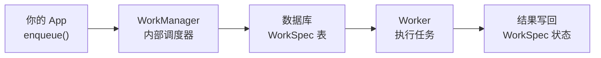
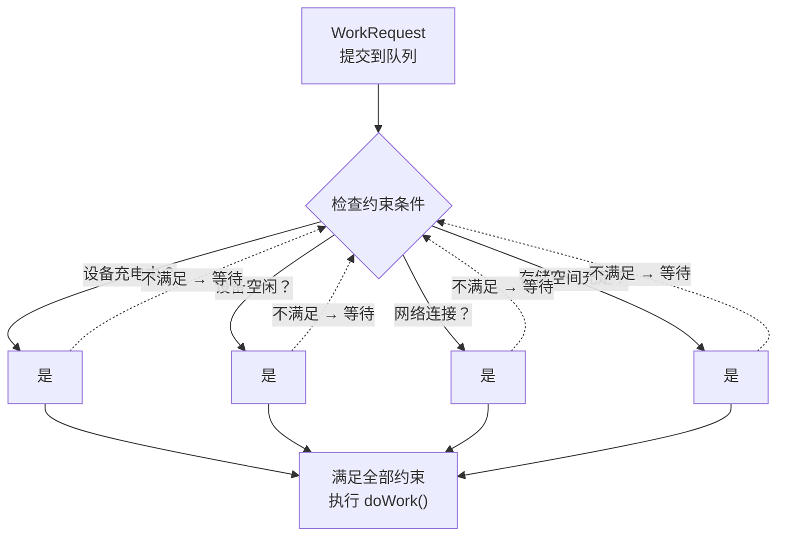
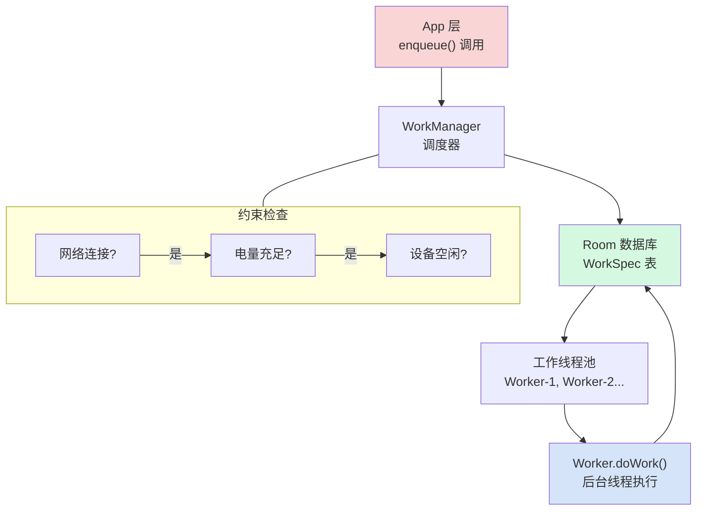
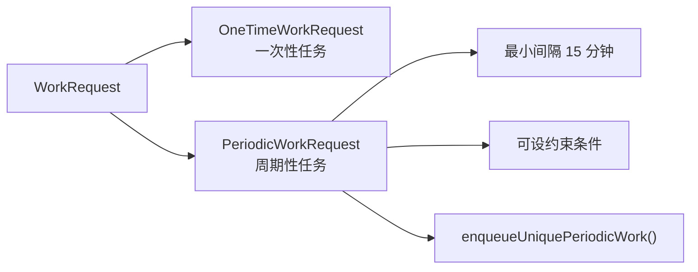

# 6.1.15 WorkManager 入门

## 正文

篝火里的柴火"噼啪"响了一声，迸出几点火星，在夜风里转了两圈就熄灭了。

洛芙把披肩又裹紧了一些。秋夜的山林比她想象中冷得多，薄雾从湖面上一点点漫过来，像谁悄悄铺上去的一层纱。火光在四个人脸上投下忽明忽暗的影子，黛琳的侧脸在这种光线下显得格外安静。

"那……所以广播就只能在特定情况下用了？"洛芙把那块吃了一半的司酮放到一边，手指在膝盖上比划着，"就是说，有些事情靠广播通知是做不到的？"

"对。"黛琳轻轻点头，把保鲜盒盖好收进背包，"广播适合'发生了什么，我来响应一下'这种场景。但如果你想让 App 在后台做一些事情——比如每天早上六点自动同步一次数据，或者在设备重启之后依然能完成任务——广播就力不从心了。"

"力不从心！"希尔在旁边接话接得飞快，"这个形容太准了。广播就那么一瞬间，我要是想每天定时干一件事，难不成要在 BroadcastReceiver 里再开个 Alarm 设一个定时器？那也太绕了。"

"绕还在其次，"黛琳摇摇头，"AlarmManager 设置的定时任务在设备重启之后就丢了。你得手动写一堆逻辑去保存状态、恢复状态……代码会变得很难维护。"

伊莎一直没说话。她靠在一块大石头上，手里捧着一杯已经凉了的可可，望着湖面上雾气与火光交织的方向。

"那……有没有什么更省心的办法？"洛芙问。

黛琳笑了。

"有。这个就是今天的重点。"

她从背包里掏出一张折叠的纸，展开来是几张手绘的草图。火光映在纸面上，能隐约看到画着一些小方块和箭头。

"我们先从一个问题开始，"黛琳把纸放在四个人中间的石头上，用一根枯枝点了点最左边的那个方块，"假设你的 App 想要：每天自动备份一次日志；用户按下按钮之后，把数据上传到服务器；每隔六小时检查一次有没有新内容。"

"这些场景听起来都差不多，"希尔凑过来看，"都是'在后台跑个任务'。"

"对，本质上都是后台任务。"黛琳点头，"但如果你用 Handler + Thread 或者 AlarmManager，你要处理的问题会很多——进程被杀掉了怎么办？设备重启了怎么办？系统在低电量模式下把你的任务推迟了怎么办？用户打开了低耗电模式怎么办？"

她每说一句，洛芙就觉得心里多了一块石头。

"那 WorkManager 呢？"洛芙问。

"WorkManager 是 Google 官方给出的解决方案，"黛琳说，"它替你把这些复杂的事情都封装好了。你只需要告诉它：我要做什么，以及在什么条件下做。剩下的——任务持久化、系统调度、电池优化、低电量模式兼容——它全部帮你搞定。"

希尔吹了声口哨。

"听起来像是把一堆苦活累活外包出去了。"希尔说。

"可以这么理解。"黛琳也笑了，"它是 Android 官方推荐的、用于'持久化后台任务'的库。"

伊莎转过头来，终于加入了讨论："persistent……持久化。这里的'持久'是指——"

"不只是 App 在运行的时候，"黛琳接过话，"它指的是任务会跨越 App 进程被杀死、系统重启这些场景。你设置了一个定时任务，就算用户把你的 App 杀掉了、重启了手机，这个任务依然会在合适的时间被调度执行。"

"这也太厉害了吧……"洛芙小声感叹。

"这就是我们今天要学的——WorkManager。"


黛琳把那张手绘图翻到下一页，上面画着一个简单的工作流程图。

"我们先从架构上搞清楚它是怎么运作的。"



"图 1，对应我们接下来要写的代码里的 enqueue 操作，"黛琳用枯枝点了点最左边的框，"你在 App 里调用 enqueue()，WorkManager 会把你的任务信息存进一个内部的 SQLite 数据库。然后它会根据你设定的约束条件，在合适的时候启动一个 Worker 去执行。"

"数据库……所以它重启之后还能找到任务？"洛芙问。

"对，它把所有待执行的任务信息都存在 WorkSpec 表里。这个数据库在 App 的进程之外，理论上讲，只要数据库文件本身没被破坏，任务信息就不会丢。"

"那 Worker 是什么呢？"洛芙接着问。

"Worker 就是一个真正执行任务的地方。"黛琳说，"你要做的事情——比如上传数据、同步文件——都写在 Worker 的 doWork() 方法里。"

"doWork()" 洛芙重复了一遍，像在记住这个名字，"所以就等于……我告诉 WorkManager：'我想做这件事'，WorkManager 告诉我：'好，我帮你安排'，然后实际执行的就是 Worker 的 doWork()？"

"理解得很准确。"黛琳点头。

希尔已经打开了笔记本："那赶紧上代码吧！纸上谈兵不过瘾。"


"首先，我们需要把 WorkManager 的库加到项目里。"黛琳说。

希尔的手指在键盘上敲了几下，屏幕上的 build.gradle.kts 文件打开着。

"依赖是这样的——"

```kotlin
// build.gradle.kts (Module: app)
// 依赖版本建议使用 2.9.x（截至 2024 年的稳定版本）
// 查看最新版本：https://developer.android.com/jetpack/androidx/releases/work
dependencies {
    implementation("androidx.work:work-runtime-ktx:2.9.0")
}
```

"work-runtime-ktx 是 Kotlin 版的 WorkManager 库，"黛琳解释道，"里面包含了所有我们今天要讲的东西。"

"2.9.0……"洛芙记在小本子上，"那现在用 Gradle 的话，是直接 implementation 还是有点不一样？"

"写法是一样的，"希尔说，"但是要注意，从 WorkManager 2.6 开始，如果你用的是 Android Studio 模板创建的新项目，Hilt 依赖也用 startup 初始化的时候，WorkManager 会通过 App Startup 库自动初始化。所以不需要你手动写 Application 类的初始化代码。"

"但是我们今天先讲手动初始化，"黛琳接过话，"因为理解初始化原理对排查问题很重要。等下我会补充说明两种方式的区别。"


"好，依赖加好了，"希尔说，"接下来我写一个最简单的 Worker 吧？"

"先不要急。"黛琳抬手，"我们在写代码之前，先把两种 WorkRequest 的概念讲清楚。"

她从地上捡起两片落叶，一片比较完整，另一片边缘有些残破。

"WorkManager 里，任务分为两种。"

她把完整的叶子举起来："这个是一次性工作（OneTimeWorkRequest）。就像这片叶子——做完一次就结束了，不会自动重复。比如用户点击按钮，同步一次数据；比如 App 启动后，检查一次版本更新。"

她又举起那片残破的叶子："这个是周期性工作（PeriodicWorkRequest）。它会在设定的时间间隔里重复执行。比如每天早上六点同步一次数据，比如每隔六小时检查一次推送。"

"明白了！"洛芙点头，"就是一次性和周期性的区别。"

"对。但是要注意一点，"黛琳特别强调，"PeriodicWorkRequest 的最小重复间隔是 15 分钟。如果你设得比 15 分钟还小，系统会强制改成 15 分钟。"

"15 分钟……"洛芙默默记下。


"好，现在可以上代码了。"黛琳说。

希尔把笔记本转了个方向，让火光能照到屏幕。

"假设我们需要一个 Worker，它负责在后台同步用户的数据。先写一个最简单的——"

```kotlin
import androidx.work.Worker
import androidx.work.WorkerParameters

// 定义一个 Worker 类，继承自 Worker
// WorkerParameters 是 WorkManager 传入的上下文参数
class DataSyncWorker(
    appContext: Context,
    workerParams: WorkerParameters
) : Worker(appContext, workerParams) {

    /**
     * doWork() 是任务执行的核心方法
     * 运行在后台线程（非主线程）
     *
     * 返回值有三种：
     * - Result.success()   -> 任务完成，结果成功
     * - Result.failure()   -> 任务失败，不会重试
     * - Result.retry()     -> 任务失败，按照退避策略重试
     */
    override fun doWork(): Result {
        // 在这里执行真正的后台任务
        // 例如：网络请求、数据库读写、文件操作等

        return try {
            // 模拟执行数据同步
            syncDataToServer()
            Result.success()  // 任务成功完成
        } catch (e: Exception) {
            // 如果遇到可恢复的错误，可以选择重试
            if (shouldRetry(e)) {
                Result.retry()  // 按照退避策略重试
            } else {
                Result.failure() // 不可恢复的失败，不重试
            }
        }
    }

    private fun syncDataToServer(): Boolean {
        // 实际项目中这里会是 Retrofit/OkHttp 等网络请求
        Thread.sleep(2000)  // 模拟耗时操作 2 秒
        return true
    }

    private fun shouldRetry(e: Exception): Boolean {
        // 网络超时类错误可以重试；数据格式错误等不应重试
        return e is java.net.SocketTimeoutException ||
               e is java.net.UnknownHostException
    }
}
```

"doWork() 里是可以做网络请求的！"洛芙注意到了，"不是说主线程不能做网络操作吗？"

"对，"希尔接过话，"doWork() 默认运行在后台线程。所以你在这里做网络请求、文件读写都没问题，不会触发 NetworkOnMainThreadException。"

"那 Worker 是怎么被启动的呢？"洛芙问。

"好问题，"黛琳说，"现在我们就来看怎么把一个 WorkRequest 提交给 WorkManager 执行。"


"第一种，最简单的——一次性工作请求（OneTimeWorkRequest）。"

```kotlin
import androidx.work.OneTimeWorkRequestBuilder
import androidx.work.WorkManager
import androidx.work.workDataOf

// 通过 OneTimeWorkRequestBuilder 创建一次性工作请求
// 注意：这个任务没有重复，执行一次后就结束
val dataSyncRequest = OneTimeWorkRequestBuilder<DataSyncWorker>()
    .setInputData(workDataOf(
        // 通过 InputData 传递参数给 Worker
        // Key: "user_id" -> Value: 12345
        "user_id" to 12345,
        "sync_type" to "full"
    ))
    .addTag("data_sync")        // 给任务打标签，方便后续查询和取消
    .build()

// 将任务提交给 WorkManager
// enqueue() 会立即返回，任务会在后台异步执行
WorkManager.getInstance(applicationContext).enqueue(dataSyncRequest)
```

"这个代码提交了一个任务，"黛琳解释道，"它会在后台异步执行，不需要等它完成 enqueue 就会立即返回。"

"setInputData 是用来……"洛芙问。

"传参数用的。"黛琳说，"Worker 的 doWork() 方法里可以通过 getInputData() 获取到这些数据。比如你想让 Worker 只同步特定用户的数据，就可以通过 user_id 告诉它。"

"addTag 呢？"

"标签是用来管理任务的，"黛琳说，"你可以用标签一次性取消所有带某个标签的任务，这在用户退出登录、或者需要清空所有待执行任务的时候特别有用。"


"第二种，周期性工作请求（PeriodicWorkRequest）。"

```kotlin
import androidx.work.PeriodicWorkRequestBuilder
import java.util.concurrent.TimeUnit

// 通过 PeriodicWorkRequestBuilder 创建周期性工作请求
// 第一个参数：重复间隔
// 第二个参数：间隔的时间单位
// 最小间隔是 15 分钟（MIN_PERIODIC_INTERVAL_MILLIS）
val periodicSyncRequest = PeriodicWorkRequestBuilder<DataSyncWorker>(
    repeatInterval = 6,           // 重复间隔
    repeatIntervalTimeUnit = TimeUnit.HOURS  // 时间单位：小时
)
    .setConstraints(
        // 设置执行约束条件（后面会详细讲）
        androidx.work.Constraints.Builder()
            .setRequiredNetworkType(androidx.work.NetworkType.CONNECTED)
            .build()
    )
    .addTag("periodic_sync")
    .build()

// 使用 enqueueUniquePeriodicWork 而不是 enqueue
// 这样可以保证同一个标签的任务只会有一个实例在运行
WorkManager.getInstance(applicationContext)
    .enqueueUniquePeriodicWork(
        "periodic_data_sync",           // 唯一工作名称
        ExistingPeriodicWorkPolicy.KEEP,  // 如果已有相同名称的任务，保持现状不替换
        periodicSyncRequest
    )
```

"enqueueUniquePeriodicWork 和 enqueue 不一样的地方在哪里？"洛芙问。

"普通 enqueue 可以提交很多任务，它们彼此独立。但 enqueueUniquePeriodicWork 保证同一个字符串名称只有一个任务实例在队列里。"黛琳解释道，"第二个参数 ExistingPeriodicWorkPolicy 有两个选择：KEEP 是保留现有的、忽略新提交的这个；REPLACE 是用新的替换掉旧的。"

"这个设计很合理啊，"希尔插嘴，"比如用户多次点击'启动定时同步'，总不能开一堆重复的定时任务吧？"

"对，所以 enqueueUnique 系列就是来解决这个问题的。"


"说到这里，我想问一个问题——"伊莎终于又开口了，"如果我的 App 打开了低耗电模式，或者设备处于空闲状态，这些定时任务还能正常跑吗？"

"这就是 WorkManager 比 AlarmManager 做得更好的地方。"黛琳说。

她从火堆旁边拿起一块还没烧过的木柴，在石头上比划起来。

"WorkManager 有一个叫'约束（Constraints）'的东西。你可以在提交任务的时候，告诉它：'只有在满足这些条件的时候，才执行这个任务。'"



"图 2，展示的是约束检查的逻辑，"黛琳说，"系统会在任务执行之前检查所有约束。如果不满足，WorkManager 会把任务放在队列里等，不会白白浪费电量去执行。"

"这个太棒了！"洛芙说，"比如我不想让同步任务在用户手机快没电的时候跑。"

"对，就用 setRequiresBatteryNotLow()。"

```kotlin
import androidx.work.Constraints
import androidx.work.NetworkType

// 定义任务执行的约束条件
val constraints = Constraints.Builder()
    .setRequiredNetworkType(NetworkType.CONNECTED)  // 设备必须联网
    .setRequiresBatteryNotLow(true)                  // 电量不能过低
    .setRequiresDeviceIdle(true)                     // 设备必须处于空闲状态
    .setRequiresStorageNotLow(true)                  // 存储空间不能过低
    .build()

// 创建带约束条件的工作请求
val constrainedWorkRequest = PeriodicWorkRequestBuilder<DataSyncWorker>(
    6, TimeUnit.HOURS
)
    .setConstraints(constraints)
    .build()
```

"这里每一个条件都很重要，"黛琳说，"setRequiredNetworkType(CONNECTED) 意味着没有 WiFi 或流量的时候任务不会跑；setRequiresBatteryNotLow(true) 意味着低电量模式（低于 20%）下任务不会跑；setRequiresDeviceIdle(true) 意味着用户在玩手机的时候它不会偷偷跑，会等设备真正空闲下来才执行——这个在用户睡觉的时候最有用。"

"等一下，"希尔皱了皱眉，"setRequiresDeviceIdle(true) 在实际用的时候要小心，因为它要求设备处于空闲状态，这个条件比较严苛，任务可能会被推迟很久才执行。"

"对，"黛琳点头，"所以这是设计上的权衡。如果你的任务是用户主动触发的，可以不加这个约束；如果是后台维护类的任务，加这个约束可以减少对用户使用体验的影响。"


"约束我大概明白了，"洛芙说，"那我想知道……如果任务执行失败了，会怎么样？"

"好，这是下一个要讲的知识点。"黛琳说，"WorkManager 有内置的重试机制。"

"你刚才代码里写了 Result.retry()，"洛芙说，"那个就是重试的意思吧？"

"对，但重试不是无限次的。"黛琳比了个手势，"WorkManager 默认的重试策略是指数退避（Exponential Backoff）。第一次失败后，会等一段时间再重试；再次失败的话，等待时间翻倍；以此类推。"

"退避……就像打台球一样，撞一下弹回来，再撞一下，力气就更大了？"洛芙试图用比喻理解。

"意思是对的，"黛琳笑了，"具体来说，默认的初始等待时间是 30 秒，最长等待时间可以达到大约 5 小时。这个范围已经很大了。"

```kotlin
// 如果你想自定义重试策略，可以使用 setBackoffCriteria()
val retryRequest = OneTimeWorkRequestBuilder<DataSyncWorker>()
    .setBackoffCriteria(
        BackoffPolicy.EXPONENTIAL,   // 指数退避：等待时间每次翻倍
        // 还有 LINEAR：线性退避，每次增加固定时间
        // 还有 NEVER：只重试一次（不推荐）
        30, TimeUnit.SECONDS,        // 初始重试间隔：30 秒
    )
    .build()
```

"BackoffPolicy 有三种，"黛琳接着说，"EXPONENTIAL 是指数退避——30 秒、60 秒、120 秒……时间越来越长。LINEAR 是线性退避——30 秒、60 秒、90 秒……等差增加。还有一种叫 NEVER，其实就是不支持重试，返回 failure 之后就不会再试了。"


"好了，基础概念都讲完了，"希尔合上笔记本，"我要来实际运行一下给大家看。"

"等一下，还有最后一件重要的事——观察任务状态。"黛琳说，"不然你都不知道自己的任务跑到什么阶段了。"

"怎么观察？"

"通过 WorkInfo。"黛琳说，"每个 WorkRequest 提交给 WorkManager 之后，都会生成一个 UUID，这个 UUID 对应一个 WorkInfo 对象，里面包含了任务的当前状态。"

```kotlin
import androidx.work.WorkInfo
import kotlinx.coroutines.flow.collect

// 通过 WorkRequest 的 UUID 获取对应的 WorkInfo
val workId = dataSyncRequest.id

// 方式一：一次性获取当前状态（使用 LiveData）
WorkManager.getInstance(applicationContext)
    .getWorkInfoByIdLiveData(workId)
    .observe(OwnerOfThisLifeCycle) { workInfo: WorkInfo? ->
        when (workInfo?.state) {
            WorkInfo.State.ENQUEUED   -> println("任务已加入队列，等待执行")
            WorkInfo.State.RUNNING    -> println("任务正在执行中")
            WorkInfo.State.SUCCEEDED  -> println("任务执行成功，结束")
            WorkInfo.State.FAILED     -> println("任务执行失败，结束")
            WorkInfo.State.BLOCKED    -> println("任务被阻塞，等待前置任务完成")
            WorkInfo.State.CANCELLED  -> println("任务被取消")
            else                     -> println("未知状态: ${workInfo?.state}")
        }
    }
```

"ENQUEUED、RUNNING、SUCCEEDED、FAILED……"洛芙跟着念，"BLOCKED 是什么意思？"

"BLOCKED 出现在工作链（WorkChain）里，"黛琳说，"比如你有三个任务 A → B → C，必须按顺序执行，A 没跑完的时候 B 就是 BLOCKED 状态。"

"工作链！我正想说这个！"希尔兴奋地插嘴，"WorkManager 支持把多个任务串起来，一个接一个地执行！"


"对，最后一个知识点——工作链。"黛琳说。

"想象一下，你有三个后台任务：第一个下载数据，第二个处理数据，第三个把处理结果上传到服务器。这三个任务必须按顺序执行，不能并行。"

"这个在什么场景下会遇到呢？"洛芙问。

"比如新闻 App 的数据更新，"黛琳解释道，"第一步从服务器拉取最新的文章列表；第二步把文章内容缓存到本地数据库；第三步更新桌面小部件显示最新文章。这三步必须按顺序来，不能第二步在第一步完成之前就开始。"

```kotlin
import androidx.work.WorkManager
import androidx.work.OneTimeWorkRequestBuilder

// 创建三个工作请求
val downloadWork = OneTimeWorkRequestBuilder<DownloadWorker>()
    .addTag("step1_download")
    .build()

val processWork = OneTimeWorkRequestBuilder<ProcessWorker>()
    .addTag("step2_process")
    .build()

val uploadWork = OneTimeWorkRequestBuilder<UploadWorker>()
    .addTag("step3_upload")
    .build()

// 通过 beginWith() 开始一个工作链，然后链式调用 then() 添加后续任务
WorkManager.getInstance(applicationContext)
    .beginWith(downloadWork)       // 第一步：下载
    .then(processWork)            // 第二步：处理（等待下载完成）
    .then(uploadWork)              // 第三步：上传（等待处理完成）
    .enqueue()                     // 提交整个链到队列
```

"这样，下载任务完成后，WorkManager 会自动调度处理任务；处理任务完成后，又会自动调度上传任务。整个过程不需要你手动管理任务之间的等待。"

"太优雅了……"洛芙感叹，"都不用我写 wait 或者 callback 了。"

"对，这就是链式 API 的好处。"黛琳说，"它内部帮你处理了前置任务和后续任务之间的依赖关系。"


"希尔，你刚才说想运行一下？"黛琳转头问。

"对！我来演示一个最简单的完整流程，让大家看看实际运行效果。"

希尔打开了一个新的 Kotlin 文件，飞快地敲起了代码。

```kotlin
import android.content.Context
import android.util.Log
import androidx.work.CoroutineWorker
import androidx.work.WorkerParameters

// 继承自 CoroutineWorker，这样 doWork() 是一个 suspend 函数
// 可以在里面直接使用协程（挂起函数）
class DemoWorker(
    appContext: Context,
    workerParams: WorkerParameters
) : CoroutineWorker(appContext, workerParams) {

    companion object {
        private const val TAG = "DemoWorker"
    }

    override suspend fun doWork(): Result {
        val inputData = inputData.getString("task_name") ?: "unnamed"
        
        Log.d(TAG, "开始执行任务: $inputData")
        Log.d(TAG, "当前线程: ${Thread.currentThread().name}")

        // 模拟耗时操作（1 秒）
        kotlinx.coroutines.delay(1000)

        val outputData = workDataOf("result" to "success_$inputData")
        
        Log.d(TAG, "任务 $inputData 执行完成")
        return Result.success(outputData)
    }
}
```

```kotlin
import androidx.work.OneTimeWorkRequestBuilder
import androidx.work.WorkManager
import androidx.work.workDataOf

// 创建 WorkRequest
val demoRequest = OneTimeWorkRequestBuilder<DemoWorker>()
    .setInputData(workDataOf("task_name" to "我的第一个WorkManager任务"))
    .addTag("demo_tag")
    .build()

// 提交到 WorkManager
WorkManager.getInstance(context).enqueue(demoRequest)

// 获取 WorkRequest 的 UUID，用于后续查询状态
val workId = demoRequest.id
Log.d("MainActivity", "任务已提交，ID: $workId")
```

"Logcat 里会这样输出——"

```
DemoWorker: 开始执行任务: 我的第一个WorkManager任务
DemoWorker: 当前线程: androidx.work-1
DemoWorker: 任务 我的第一个WorkManager任务 执行完成
```

"看到没有，"希尔指着屏幕，"doWork() 运行在 `androidx.work-1` 这个线程上，这不是主线程，是 WorkManager 管理的后台线程池。"

"所以直接在 doWork() 里写网络请求是安全的？"洛芙问。

"完全安全。"


火光又跳动了几下，营火旁边有一块石头被烧得有点发红。

洛芙突然想到一个问题："那 WorkManager 和 AlarmManager 到底有什么区别呢？我还是有点分不清。"

"问得好。"黛琳说，"AlarmManager 是系统级别的闹钟服务，它只能告诉你'时间到了'，但不能帮你把任务持久化保存起来。WorkManager 是应用级别的任务调度器，它替你管理整个任务的生命周期——从持久化存储、到执行调度、到状态观察，全部封装好了。"

"所以 AlarmManager 更底层，WorkManager 更高层？"

"可以这么理解。AlarmManager 就是一个精确的定时器；WorkManager 是一个完整的后台任务解决方案。"黛琳说，"Google 官方的建议是：如果你只是需要一个定时器（比如闹钟应用、计时器应用），用 AlarmManager；如果你需要在后台执行通用任务（比如数据同步、日志上传），用 WorkManager。"

"这是官方文档上的原话吗？"洛芙问。

"是。"黛琳点头，"而且 WorkManager 的任务在设备重启之后依然会被调度执行，AlarmManager 的定时任务重启后就丢了——除非你写一堆代码去保存和恢复状态。"


"还有一个问题是用户很关心的——低电量模式。"希尔补充道。

"对，"黛琳点头，"在 Android 6.0 之后，系统有 doze mode（打盹模式）和 App Standby。这两个机制都会推迟后台任务的执行。但 WorkManager 会自动适配这些行为——它内部有和白名单系统打交道的逻辑，尽量让重要任务在合适的时候执行。"

"那 AlarmManager 呢？"

"AlarmManager 在 doze mode 下会被系统强制推迟，除非你用 setAndAllowWhileIdle() 或者 setExactAndAllowWhileIdle()。但即使你用了这些 API，它们在设备重启后依然不会自动恢复。"

"所以 WorkManager 完胜 AlarmManager 咯？"洛芙问。

"也不能说'完胜'，"黛琳认真地说，"AlarmManager 能做到一些 WorkManager 做不到的事——比如精确到毫秒级别的定时任务。但对于大多数 App 的后台数据同步、日志上报这类需求，WorkManager 是更好的选择。"


夜风从松林间吹过来，带着松脂和潮湿泥土混合的气息。篝火旁边的温度又低了一些，洛芙能看到自己呼出的气变成了一点点白雾。

"最后我想总结一下 WorkManager 的几个核心优点，"黛琳用手指在空气中比划，"第一，任务持久化——重启不丢；第二，约束条件——省电友好；第三，自动重试与退避策略——网络不稳定也不怕；第四，状态观察——随时知道任务跑到哪了；第五，工作链——复杂依赖也能优雅管理。"

"这五条总结得真好，"伊莎轻声说，"就像……一个很靠谱的管家。你告诉它要做什么，它就会在合适的时候、合适的条件下，安静地把事情做完。"

"管家这个比喻很贴切。"黛琳笑了笑。

希尔打了个哈欠："好了，今天信息量够大了，让我来整理一下等会的练习题目……"

篝火里的最后一根大柴火"啪"地裂开，溅出一小簇火星，在夜风里飞了一会儿就消失在黑暗里。

远处的湖面上，雾气越来越浓了。

---

## 专业技术总结

> WorkManager —— Android 官方推荐的用于管理持久化后台任务的库。它能保证任务在 App 进程被杀死、系统重启、低电量模式等场景下依然被可靠调度执行。


#### 结构图

**WorkManager 整体调度架构**



**WorkRequest 分类**




#### 反模式与陷阱

1. **在 doWork() 里做主线程操作**
   - 坏味道：`runOnUiThread { ... }` 或直接操作 View
   - 修复：doWork() 本身就在后台线程，只做异步操作。需要更新 UI 应该用 LiveData/StateFlow 从 Worker 传递结果。

2. **混淆 OneTimeWorkRequest 和 PeriodicWorkRequest 的使用场景**
   - 坏味道：数据同步既不是真正的"一次性"也不是真正的"周期性"，随意混用
   - 修复：明确任务性质——用户触发的一次性操作用 OneTimeWorkRequest；需要定期执行的任务用 PeriodicWorkRequest。

3. **没有处理 Result.retry() 的退避导致任务永不失败**
   - 坏味道：网络错误无限 retry，浪费资源
   - 修复：在 Worker 里判断错误类型，可恢复错误（如超时）返回 retry，不可恢复错误（如 404、数据格式错误）返回 failure。

4. **使用 setRequiresDeviceIdle(true) 但不了解其严苛程度**
   - 陷阱：设备空闲条件非常严格，在很多情况下任务会被推迟数小时
   - 建议：仅对真正的后台维护任务使用，对用户主动触发的任务不加此约束。

5. **忘了取消不再需要的 WorkRequest**
   - 陷阱：用户退出登录后，后台任务还在跑，浪费电量和流量
   - 修复：使用 `WorkManager.cancelAllWorkByTag(tag)` 或 `cancelUniqueWork(name)` 在适当时机取消任务。


#### 设计哲学

**WorkManager 的核心设计思想：让后台任务"可预期、可控制、可观测"**

1. **持久化优先**：所有任务信息存储在数据库而非内存，保证进程死亡后依然可恢复。
2. **约束驱动**：不满足条件不执行，减少无效调度，延长电池寿命。
3. **委托调度**：App 不直接操作线程池，而是把调度权委托给 WorkManager，降低耦合。
4. **失败可恢复**：内置指数退避重试机制，保证临时性故障不会导致永久失败。
5. **状态可观测**：通过 LiveData/Flow 实时观察 WorkInfo 状态变化，调试有据可查。
6. **唯一性保证**：enqueueUnique 系列 API 避免重复调度，保证同一任务只有一个活跃实例。

---

#### 🏕️ 动手练习

**项目概览**：构建一个"营地日志同步 App"，支持用户记录营地日志、查看同步历史、以及在后台自动将日志同步到模拟服务器。

**方式 A：项目制——递进式 Task**

**Task 1：搭建项目基础，添加 WorkManager 依赖**

- **目标**：创建一个带 WorkManager 依赖的 Android 项目，验证依赖添加成功。
- **你需要做的事**：
  1. 创建新 Android 项目（Empty Activity，Kotlin）。
  2. 在 `app/build.gradle.kts` 的 dependencies 中添加 `implementation("androidx.work:work-runtime-ktx:2.9.0")`。
  3. 在 MainActivity 中打印 Log，确认 App 能正常编译运行。
- **验收标准**：`[ ]` App 编译通过，无 dependency error
- **提示**：
  ```kotlin
  // build.gradle.kts (Module: app)
  dependencies {
      implementation("androidx.work:work-runtime-ktx:2.9.0")
  }
  ```

**Task 2：实现第一个一次性 Worker**

- **目标**：编写一个 `HelloWorker`，在后台线程打印日志，体验 doWork() 的执行流程。
- **你需要做的事**：
  1. 创建 `HelloWorker` 类继承 `Worker`，重写 `doWork()`。
  2. 在 `doWork()` 中用 `Log.d()` 打印当前线程名和"Hello from Worker"。
  3. 在 MainActivity 中用 `OneTimeWorkRequestBuilder` 创建请求并 enqueue。
  4. 运行 App，检查 Logcat 输出（搜索"Hello from Worker"）。
- **验收标准**：`[ ]` Logcat 中能看到 `Hello from Worker` 和 `androidx.work-1` 线程名
- **提示**：
  ```kotlin
  class HelloWorker(
      appContext: Context,
      workerParams: WorkerParameters
  ) : Worker(appContext, workerParams) {
      override fun doWork(): Result {
          Log.d("HelloWorker", "Hello from Worker, thread: ${Thread.currentThread().name}")
          return Result.success()
      }
  }
  ```

**Task 3：给 Worker 传递输入数据和标签管理**

- **目标**：学会用 `setInputData` 给 Worker 传参数，用 `addTag` 标记任务，并实现取消功能。
- **你需要做的事**：
  1. 修改 `HelloWorker`，从 `inputData` 中读取 `user_message` 参数并打印。
  2. 给 WorkRequest 设置 tag `"hello_task"`。
  3. 在 MainActivity 中创建一个 EditText，用户输入内容后点击按钮提交 Worker。
  4. 添加"取消所有 hello_task"按钮，调用 `workManager.cancelAllWorkByTag("hello_task")`。
  5. 运行 App，输入文字，观察 Logcat；再点取消，观察 Logcat。
- **验收标准**：`[ ]` Worker 打印出用户输入的内容；`[ ]` 取消后 Logcat 中不再有新的 Worker 日志
- **提示**：
  ```kotlin
  val inputData = workDataOf("user_message" to userInputText)
  val request = OneTimeWorkRequestBuilder<HelloWorker>()
      .setInputData(inputData)
      .addTag("hello_task")
      .build()
  // 取消时：
  WorkManager.getInstance(context).cancelAllWorkByTag("hello_task")
  ```

**Task 4：实现带约束条件的周期性 Worker**

- **目标**：创建一个每 6 小时同步一次营地日志的 PeriodicWorkRequest，并设置网络和电量约束。
- **你需要做的事**：
  1. 创建 `CampingLogSyncWorker`，继承 `CoroutineWorker`（支持 suspend 函数）。
  2. 在 `doWork()` 中用 `delay(2000)` 模拟同步过程，打印"开始同步""同步完成"。
  3. 在 MainActivity 中创建带约束的 PeriodicWorkRequest：
     - `setRequiredNetworkType(CONNECTED)`
     - `setRequiresBatteryNotLow(true)`
  4. 用 `enqueueUniquePeriodicWork()` 提交，名字为 `"camping_log_sync"`。
  5. 创建一个"立即同步"按钮，用 `enqueue()` 触发一次 OneTimeWorkRequest。
- **验收标准**：`[ ]` PeriodicWorkRequest 提交成功（Logcat 显示调度信息）；`[ ]` 立即同步按钮能触发一次额外同步
- **提示**：
  ```kotlin
  val constraints = Constraints.Builder()
      .setRequiredNetworkType(NetworkType.CONNECTED)
      .setRequiresBatteryNotLow(true)
      .build()
  
  val periodicSync = PeriodicWorkRequestBuilder<CampingLogSyncWorker>(
      6, TimeUnit.HOURS
  )
      .setConstraints(constraints)
      .addTag("periodic_sync")
      .build()
  ```

**Task 5：实现工作链（下载 → 处理 → 上传）**

- **目标**：用一个三步链式任务演示 WorkManager 的链式调度能力。
- **你需要做的事**：
  1. 创建三个 Worker：`DownloadWorker`、`ProcessWorker`、`UploadWorker`，分别打印各自的名字。
  2. 在 MainActivity 中用 `beginWith().then().then().enqueue()` 串联三个任务。
  3. 运行 App，观察 Logcat 中三个 Worker 的执行顺序（应该是串行的）。
  4. 尝试把中间的 ProcessWorker 返回 `Result.retry()`，观察是否会重试。
- **验收标准**：`[ ]` Logcat 显示 Download → Process → Upload 的顺序；`[ ]` 重试场景下能看到 retry 行为
- **提示**：
  ```kotlin
  val download = OneTimeWorkRequestBuilder<DownloadWorker>().build()
  val process = OneTimeWorkRequestBuilder<ProcessWorker>().build()
  val upload = OneTimeWorkRequestBuilder<UploadWorker>().build()
  
  WorkManager.getInstance(context)
      .beginWith(download)
      .then(process)
      .then(upload)
      .enqueue()
  ```

#### 面试热身

1. WorkManager 和 Handler + Thread 相比，优势在哪里？
2. 什么情况下应该使用 PeriodicWorkRequest？什么情况下应该使用 OneTimeWorkRequest？
3. setRequiresDeviceIdle(true) 为什么可能导致任务延迟很久才执行？
4. 如果你想在任务执行成功后更新 UI，应该怎么做？
5. WorkManager 的任务在设备重启后是否还会执行？为什么？


> 学习建议：WorkManager 是 Android 后台任务领域的"集大成者"，它的设计理念是"把复杂的事情封装起来，让开发者只关注业务逻辑"。学习这一章时，建议先理解"为什么需要 WorkManager"（对比 AlarmManager 和 Handler 的不足），再理解它的核心 API（WorkRequest、Worker、WorkManager），最后动手实践，从最简单的 OneTimeWorkRequest 开始，逐步加入约束条件、状态观察、工作链等高级特性。
>
> WorkManager 不是一个独立的存在，它与 Android 的进程管理、电池优化、后台限制等系统机制深度耦合。理解它的工作原理，也能帮助你理解 Android 系统对后台任务的管控逻辑。


## 洛芙的小小日记本

今天学了好多新东西！最让我惊讶的是 WorkManager 的"持久化"能力——任务会存在数据库里，就算手机重启了也不会丢，感觉就像一个特别靠谱的管家。黛琳说的对，"可预期、可控制、可观测"这三个词我记住了。约束条件那个部分还需要再消化一下……setRequiresDeviceIdle 听起来好像很严苛的样子。


## 今日关键词

- **WorkManager**：Android 官方推荐的持久化后台任务管理库，能在 App 进程死亡、系统重启、低电量模式下依然可靠调度任务。
- **Worker**：真正执行后台任务的地方，doWork() 方法运行在后台线程，返回 Result.success()/failure()/retry() 表示执行结果。
- **WorkRequest**：描述一个任务的请求，包含执行参数、约束条件、输入数据等。有 OneTimeWorkRequest（一次性）和 PeriodicWorkRequest（周期性）两种。
- **OneTimeWorkRequest**：一次性工作请求，任务只执行一次就结束，不会自动重复。
- **PeriodicWorkRequest**：周期性工作请求，按设定的间隔重复执行，最小间隔 15 分钟。
- **Constraints（约束条件）**：任务执行的前置条件，包括网络连接、电量状态、设备空闲状态、存储空间等。
- **setRequiredNetworkType**：约束条件之一，指定任务执行时需要何种网络状态（NETWORK_TYPE_NONE / CONNECTED / UNMETERED 等）。
- **setRequiresBatteryNotLow**：约束条件之一，要求设备电量不低于 20%（低电量模式阈值）。
- **setRequiresDeviceIdle**：约束条件之一，要求设备处于空闲状态（用户未活跃使用），条件严苛，用于后台维护任务。
- **Result.retry()**：Worker.doWork() 的返回值之一，表示任务失败但需要按退避策略重试。
- **Result.failure()**：Worker.doWork() 的返回值之一，表示任务失败且不需要重试。
- **Result.success()**：Worker.doWork() 的返回值之一，表示任务成功完成。
- **指数退避（Exponential Backoff）**：默认重试策略，初始等待 30 秒，失败后等待时间翻倍（60s、120s…），最长约 5 小时。
- **WorkInfo**：描述 WorkRequest 执行状态的对象，通过 UUID 或 LiveData 观察，包含 ENQUEUED / RUNNING / SUCCEEDED / FAILED / BLOCKED / CANCELLED 等状态。
- **WorkChain（工作链）**：用 beginWith() + then() 串联多个 WorkRequest，前置任务完成后才执行后续任务。
- **enqueueUniquePeriodicWork**：提交周期性任务的 API，保证同名任务只有一个活跃实例，避免重复调度。
- **ExistingPeriodicWorkPolicy**：枚举值，KEEP 表示保留现有任务忽略新提交；REPLACE 表示用新任务替换旧任务。
- **CoroutineWorker**：基于协程的 Worker 实现，doWork() 是 suspend 函数，适合在 Kotlin 项目中使用。
- **输入数据（InputData）**：通过 setInputData() 传递给 Worker 的键值对数据，Worker 内通过 getInputData() 读取。
- **标签（Tag）**：用于分组和管理 WorkRequest 的字符串，可用于批量取消或查询任务。
- **App Startup**：WorkManager 2.6+ 使用 ContentProvider + App Startup 库进行自动初始化，无需手动在 Application 中初始化。
