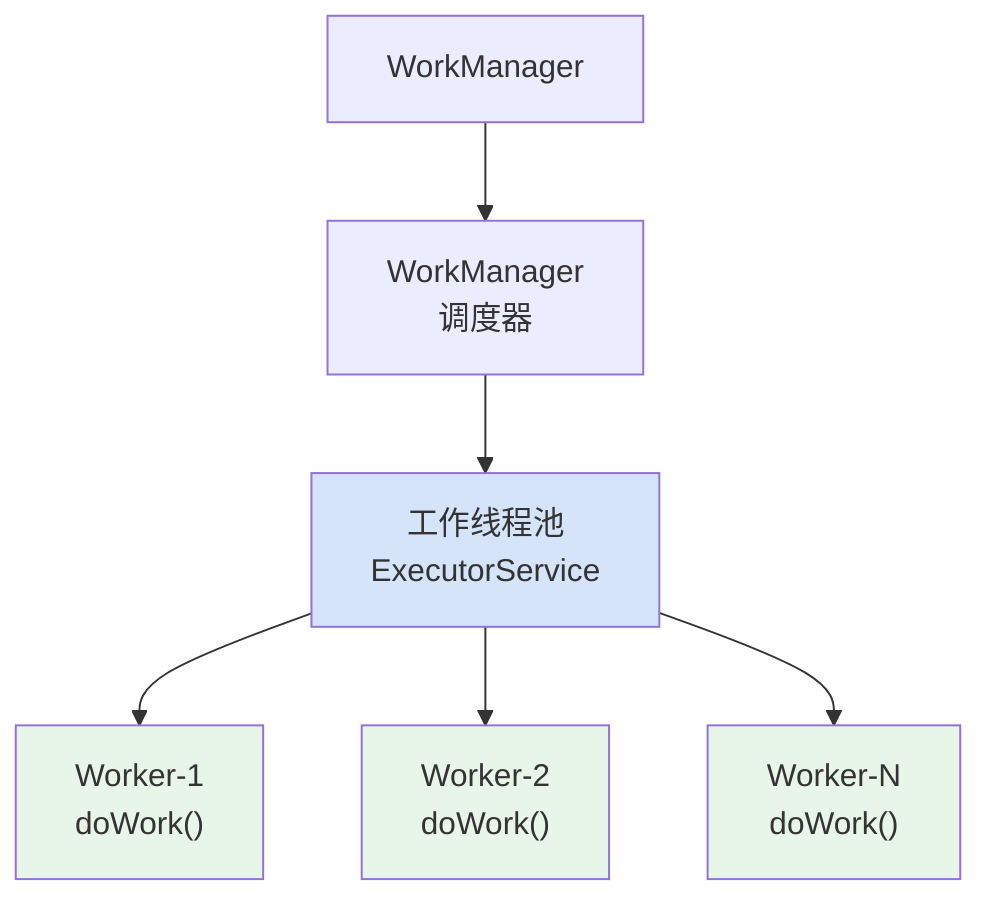
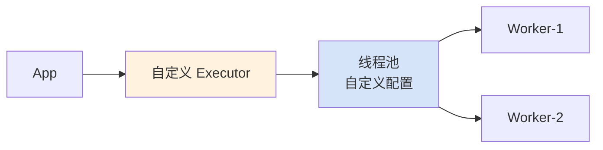
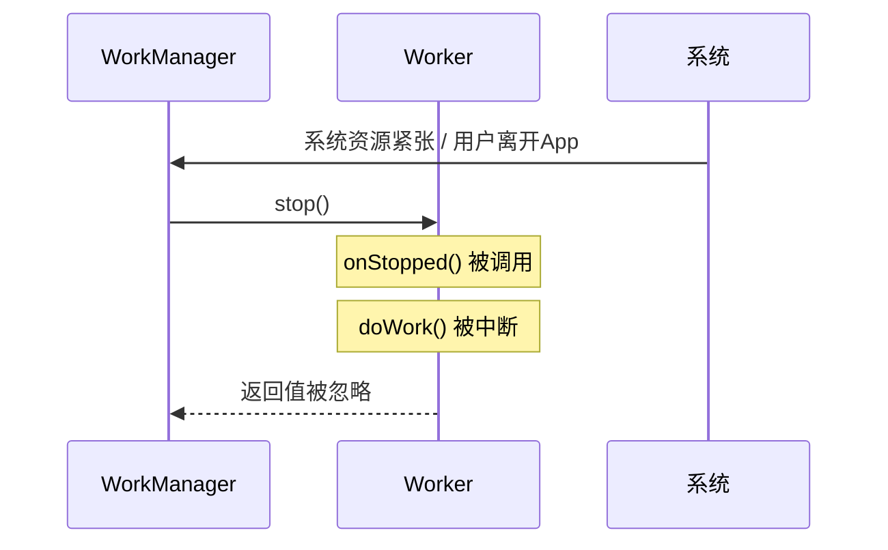
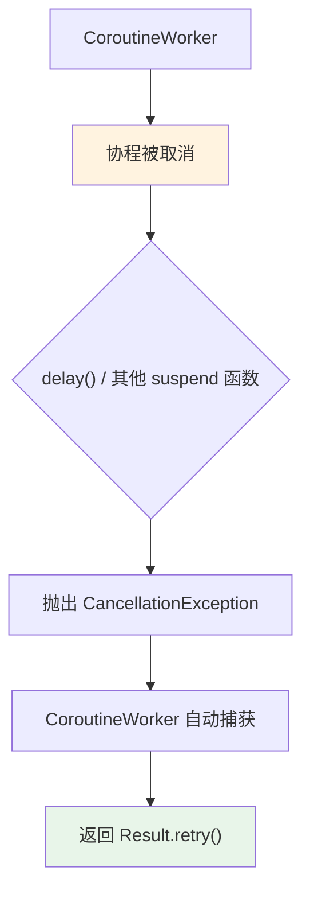
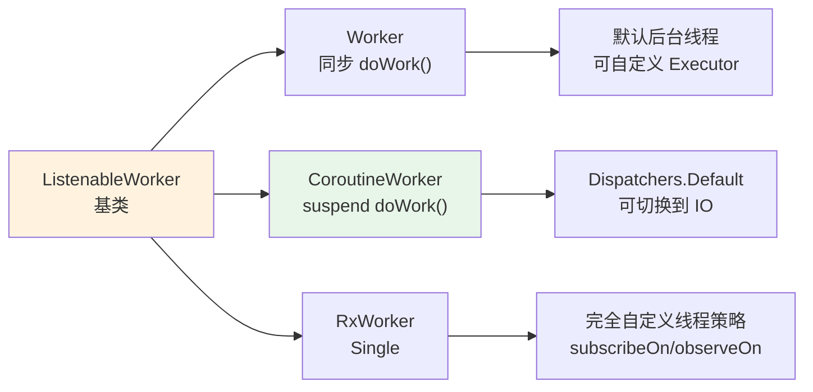
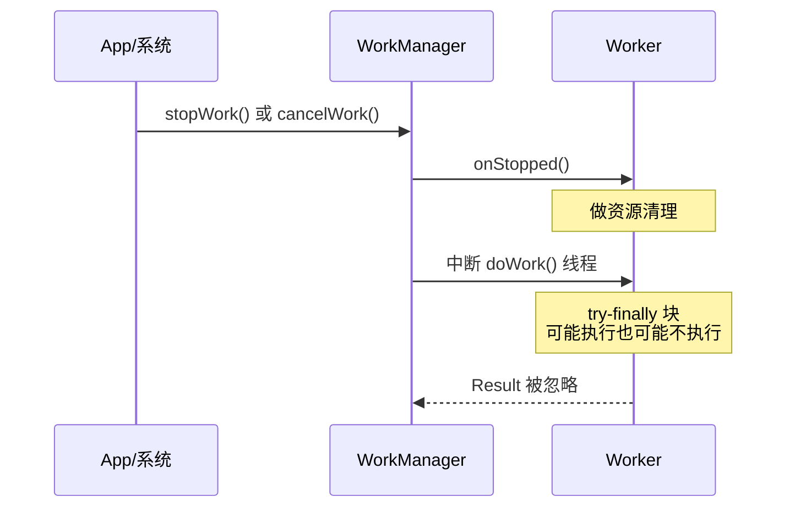

# 6.1.16 WorkManager 中的线程

夜已经很深了。

洛芙盯着面前那堆快要燃尽的篝火，橘红色的余烬在灰烬中明明灭灭，像是一群不肯睡去的小萤火虫。湖面上的雾气比刚才又浓了几分，把对岸的树影模糊成一片深深浅浅的灰。

"所以 Worker 就是那个……真正帮我做事的人？"洛芙揉了揉眼睛，试图把刚才学到的知识串起来，"我告诉 WorkManager 要做什么，它去调Worker，Worker 的 doWork() 负责实际执行。"

"对。"黛琳点点头，把最后一块有余温的石头挪到洛芙脚边，"但你有没有想过一个问题——Worker 的 doWork()，到底在哪条线程上跑？"

洛芙愣了一下。

"呃……后台线程？"

"后台线程也是线程，"希尔在旁边插嘴，把笔记本屏幕又打开了一点，"线程就有调度、有并发、有上下文切换的问题。比如你的 Worker 正在跑，突然系统把它停了怎么办？再比如你想让好几个 Worker 并行跑，它们是跑在同一个线程池里，还是各有各的线程？这些问题都跟线程模型有关。"

"所以今天要讲的就是——WorkManager 里面，关于线程的那些事。"黛琳说。

伊莎打了个小小的哈欠，用手背蹭了蹭鼻尖。

"听起来很底层呢。"

"是很底层，"黛琳承认，"但理解了这部分，你才能真正用好 WorkManager。不然遇到一些奇怪的问题——比如 Worker 莫名其妙被中断、或者线程安全问题——你根本不知道从哪里下手。"

篝火"噗"地一声，爆出一小簇火星。洛芙盯着那些火星往上飞了一会儿才开口：

"那……要从哪个 Worker 开始讲？"

"从最基础的开始，"黛琳说，"先搞清楚 Worker 的线程模型，然后我们再去看 CoroutineWorker、RxWorker、ListenableWorker 这三个变体。"

希尔把笔记本转了个方向，让火光能照亮屏幕。

"先看官方文档给的这张图——"



"图 1，展示的是 WorkManager 的线程调度架构，"黛琳用枯枝在地上点了点，"WorkManager 内部有一个工作线程池，你的 Worker 的 doWork() 就跑在这个线程池里的某条线程上。默认情况下，这个线程池是 WorkManager 自动为你配置好的。"

"那我可以自己改吗？"洛芙问。

"可以，"黛琳点头，"但你需要先手动初始化 WorkManager，而不是用默认的自动初始化。这个我们等下会讲到。"


## Worker 的线程模型

"我们先从最基础的 Worker 开始。"黛琳说。

她从地上捡起一块扁平的小石子，在掌心转了转。

"Worker 是四个 Worker 实现里最简单的一个。它的 doWork() 方法是同步执行的——也就是说，当你启动一个 Worker，doWork() 会一直跑到完，才算这个 Worker 执行结束。"

"同步执行……"洛芙默念了一遍。

"对，不是异步。"黛琳强调，"Worker 本身不帮你管理线程，它只是告诉你：'我的 doWork() 会跑在一条后台线程上，你要做的事情就在这里面写。'至于这条线程是从哪里来的，是 WorkManager 的默认线程池还是你自己配的，那是你要关心的事。"

希尔敲了几行代码，屏幕上出现了一个简单的 Worker 实现：

```kotlin
import androidx.work.Worker
import androidx.work.WorkerParameters
import android.util.Log

class DownloadWorker(
    appContext: Context,
    workerParams: WorkerParameters
) : Worker(appContext, workerParams) {

    companion object {
        private const val TAG = "DownloadWorker"
    }

    /**
     * doWork() 运行在 WorkManager 提供的后台线程上
     * 默认线程池由 WorkManager 自动创建
     *
     * 这是一个同步方法——方法不返回，Worker 就没执行完
     */
    override fun doWork(): Result {
        val url = inputData.getString("download_url") ?: return Result.failure()

        Log.d(TAG, "开始下载，线程: ${Thread.currentThread().name}")

        return try {
            // 这里是同步的网络请求
            // 不需要担心 NetworkOnMainThreadException
            val content = download(url)
            val outputData = workDataOf("content" to content)
            Result.success(outputData)
        } catch (e: Exception) {
            Log.e(TAG, "下载失败: ${e.message}")
            Result.retry()
        }
    }

    private fun download(url: String): String {
        // 模拟下载过程
        Thread.sleep(2000)
        return "下载的内容: $url"
    }
}
```

"这段代码里有几个关键点，"黛琳说，"第一，doWork() 的返回类型是 Result，不是 Unit。你要返回一个 Result 来告诉 WorkManager 这个任务到底是成功了、失败了、还是需要重试。"

"第二，"希尔接过话，"doWork() 是运行在后台线程上的。你可以看到我打了日志打印线程名——运行的时候去看 Logcat，就会发现它不是主线程。"

"那如果我想自己指定线程池呢？"洛芙问。

"好问题，"黛琳说，"这就要讲到手动初始化 WorkManager 了。"


## 自定义 Executor

"在默认情况下，WorkManager 会自己创建一个线程池来处理所有的 Worker。"黛琳说，"但有些场景下，你可能想用自己的线程池。"

她在地上又画了一个小图：



"比如你的 App 里已经有一个自己管理的后台线程池，你想让 Worker 复用这个线程池，而不是再开一个新的——这时候你就可以自定义 Executor。"

"再比如，"希尔补充，"你想控制 Worker 的并发数量。默认的线程池可能同时跑好几个 Worker，但你的任务比较重，你不希望它们同时跑，这时候你就可以配一个单线程的 Executor。"

黛琳点点头："我们来看代码。"

```kotlin
import androidx.work.WorkManager
import androidx.work.configuration.DefaultWorkerFactory
import java.util.concurrent.Executors
import java.util.concurrent.Executor

// 创建一个单线程的 Executor
// 所有 Worker 都只会在这一条线程上串行执行
val singleThreadExecutor: Executor = Executors.newSingleThreadExecutor { r ->
    Thread(r).apply {
        name = "my-custom-worker-thread"
        // 设置为守护线程，这样 App 退出时线程会自动终止
        isDaemon = false
    }
}

// 自定义 WorkManager 配置
val customConfig = androidx.work.WorkManagerInitializer(
    { executor ->  // 这个 lambda 会在 WorkManager 初始化时被调用
        // 把自定义的 Executor 注入进去
        // 这样所有 Worker 都会跑在这个线程池里
    }
)

// ⚠️ 注意：自定义初始化需要禁用默认初始化
// 在 AndroidManifest.xml 中添加：
// <provider android:name="androidx.startup.InitializationProvider"
```

"等一下，"洛芙举起手，"你说要在 AndroidManifest 里禁用默认初始化，具体怎么写？"

"我正要讲这个。"黛琳说。

```xml
<!-- AndroidManifest.xml -->

<!-- 禁用 WorkManager 的默认自动初始化 -->
<!-- 方法：在 provider 的 tools:node 属性里写 remove -->
<provider
    android:name="androidx.startup.InitializationProvider"
    android:authorities="${applicationId}.androidx-startup"
    android:exported="false"
    tools:node="merge">
    
    <!-- 通过 meta-data 声明我们不使用的初始化项 -->
    <meta-data
        android:name="androidx.work.WorkManagerInitializer"
        android:value="androidx.startup"
        tools:node="remove" />
</provider>
```

"这样 WorkManager 就不会自动初始化了，"黛琳解释道，"然后你在 Application 类里手动配置。"

```kotlin
import android.app.Application
import androidx.work.WorkManager

class MyApplication : Application() {

    override fun onCreate() {
        super.onCreate()

        // 手动初始化 WorkManager
        val config = androidx.work.WorkManagerConfiguration.Builder()
            .setExecutor(
                // 使用自定义 Executor
                Executors.newSingleThreadExecutor()
            )
            .build()

        WorkManager.initialize(this, config)
    }
}
```

"这样的话，"洛芙试着理解，"所有 Worker 都会跑在我自定义的线程池里？"

"对，"黛琳点头，"这是一个全局配置。一旦你手动初始化了 WorkManager，所有后续创建的 Worker 都会使用你指定的 Executor。"

希尔在旁边补充："不过说实话，大多数场景下你不需要自定义 Executor。默认的线程池已经挺好的了——它会根据设备的 CPU 核心数自动调整线程池大小。除非你有特殊需求，比如："

"什么需求？"洛芙问。

"第一，你想复用 App 里已经存在的线程池，避免资源浪费。"
"第二，你需要严格控制 Worker 的并发数量，比如你的任务涉及文件操作，你不想同时读写同一个文件。"
"第三，你想给线程池起特定的名字，方便调试。"

"其他情况，"黛琳接过话，"用默认配置就够了。"


## Worker 的 stoppage 处理

夜风"呼呼"地从松林间穿过，篝火被吹得快要灭了。希尔起身去添了两根柴火，火焰又重新旺了起来。

"还有一个很重要的概念——Worker 的 stoppage。"黛琳说。

"stoppage？停止？"洛芙问。

"对。"黛琳的表情变得认真起来，"当一个正在运行的 Worker 被系统停止时，会发生几件事。"

她在地上又画了一个小图：



"当 WorkManager 决定停止一个 Worker 时——可能是因为系统内存紧张、可能是因为用户把你的 App 切到后台了——它会调用 Worker 的 onStopped() 方法。"

"那 doWork() 呢？"洛芙问。

"doWork() 会被中断，"黛琳说，"但这里有个很关键的问题：doWork() 本身不会自动停止。它只是收到一个中断信号（interrupted），如果你在 doWork() 里没有检查这个信号，代码会继续跑下去。"

"这就很危险了吧？"洛芙皱起眉头。

"对，所以 Worker 提供了一个 onStopped() 方法让你去做清理工作。"黛琳说，"比如你打开了一个文件，或者建立了一个网络连接，在 onStopped() 里你应该把它们关掉。"

希尔写了一段代码来演示：

```kotlin
import androidx.work.Worker
import androidx.work.WorkerParameters
import android.util.Log

class FileProcessingWorker(
    appContext: Context,
    workerParams: WorkerParameters
) : Worker(appContext, workerParams) {

    companion object {
        private const val TAG = "FileProcessingWorker"
    }

    private var fileInputStream: java.io.FileInputStream? = null

    override fun doWork(): Result {
        val filePath = inputData.getString("file_path") ?: return Result.failure()

        Log.d(TAG, "开始处理文件，线程: ${Thread.currentThread().name}")

        return try {
            fileInputStream = java.io.FileInputStream(filePath)
            
            // 模拟处理过程
            // 注意：如果这里被中断，catch 块会捕获到 InterruptedException
            processFile()
            
            Result.success()
        } catch (e: InterruptedException) {
            Log.w(TAG, "Worker 被中断，正在重试...")
            Result.retry()
        } catch (e: Exception) {
            Log.e(TAG, "处理失败: ${e.message}")
            Result.failure()
        } finally {
            // 清理资源
            closeFileStream()
        }
    }

    private fun processFile() {
        // 模拟耗时操作
        Thread.sleep(5000)
        Log.d(TAG, "文件处理完成")
    }

    private fun closeFileStream() {
        try {
            fileInputStream?.close()
            Log.d(TAG, "文件流已关闭")
        } catch (e: Exception) {
            Log.e(TAG, "关闭文件流失败: ${e.message}")
        }
    }

    /**
     * onStopped() 在 Worker 被停止时调用
     * 此时 doWork() 可能还没执行完
     * 应该在这里做资源清理，而不是在 finally 块
     * 因为 finally 块可能根本不会执行
     */
    override fun onStopped() {
        super.onStopped()
        Log.w(TAG, "Worker 被停止了！")
        closeFileStream()
    }
}
```

"看到没有，"黛琳指着 finally 和 onStopped() 两处，"如果你在 doWork() 里用 try-finally 做清理，Worker 被中断的时候，finally 块里的代码是可能执行的。但更安全的做法是在 onStopped() 里也做一次清理，以防万一。"

"因为 doWork() 被中断的时候，Java 的 InterruptedException 不一定会被抛出来，"希尔补充，"取决于你用的是 Thread.sleep() 还是其他方式响应中断。"

洛芙在本子上快速记着：onStopped() 做清理、finally 也做清理、双保险。


## CoroutineWorker：Kotlin 首选

"讲完了基础的 Worker，我们来看 Kotlin 版本的实现。"黛琳把那块扁平石子放下，换了一块更圆润的。

"CoroutineWorker 是 WorkManager 专门为 Kotlin 提供的 Worker 实现。它的核心理念是：把 doWork() 变成一个协程（suspend function），让你能在里面直接用 Kotlin 的协程语法。"

"协程的好处是什么？"洛芙问。

"最大的好处是代码简洁。"黛琳说，"用普通的 Worker，你要处理线程切换、处理 InterruptedException、处理回调地狱。用 CoroutineWorker，你只需要像写同步代码一样写 doWork()，协程会自动帮你切到后台线程、自动处理取消。"

希尔把屏幕切换到 CoroutineWorker 的代码：

```kotlin
import androidx.work.CoroutineWorker
import androidx.work.WorkerParameters
import androidx.work.workDataOf
import android.util.Log
import kotlinx.coroutines.Dispatchers
import kotlinx.coroutines.delay

class CoroutineDownloadWorker(
    appContext: Context,
    workerParams: WorkerParameters
) : CoroutineWorker(appContext, workerParams) {

    companion object {
        private const val TAG = "CoroutineDownloadWorker"
    }

    /**
     * doWork() 是一个 suspend 函数
     * 默认运行在 Dispatchers.Default 上
     * Dispatchers.Default 是一个适合 CPU 密集型任务的调度器
     */
    override suspend fun doWork(): Result {
        val url = inputData.getString("download_url") ?: return Result.failure()

        Log.d(TAG, "开始下载，线程: ${Thread.currentThread().name}")

        return try {
            // 使用协程的 delay 而不是 Thread.sleep
            // delay 是 suspend 函数，不会阻塞线程
            // 当 Worker 被取消时，delay 会立即抛出 CancellationException
            delay(2000)  // 模拟下载过程

            val content = download(url)
            val outputData = workDataOf("content" to content)

            Log.d(TAG, "下载完成，线程: ${Thread.currentThread().name}")
            Result.success(outputData)
        } catch (e: Exception) {
            Log.e(TAG, "下载失败: ${e.message}")
            Result.failure()
        }
    }

    private suspend fun download(url: String): String {
        // 在实际项目中，这里会用 Retrofit + suspend 函数去请求网络
        // 由于 CoroutineWorker 默认在 Dispatchers.Default 上运行
        // 如果要做网络请求，建议切换到 Dispatchers.IO
        return withContext(Dispatchers.IO) {
            delay(1000)  // 模拟网络请求
            "下载的内容: $url"
        }
    }
}
```

"这段代码看起来比普通的 Worker 简洁多了！"洛芙说。

"对，"黛琳点头，"有几个关键点你要记住："

"第一，doWork() 是 suspend 函数，不是普通函数。"
"第二，默认运行在 Dispatchers.Default 上，这是一个适合 CPU 密集型任务的调度器。如果你要做网络请求或文件读写，应该用 withContext(Dispatchers.IO) 切换到 IO 调度器。"
"第三，CoroutineWorker 会自动处理取消。当 WorkManager 停止这个 Worker 时，协程会被取消，delay() 会抛出 CancellationException。"

"这个 CancellationException 会被 CoroutineWorker 自动捕获，所以你不需要在代码里处理它。"希尔补充，"它会自动返回 Result.retry()——除非你已经返回了其他 Result。"

"等等，"洛芙突然想到一个问题，"你说默认是 Dispatchers.Default，那我可以换吗？"

"可以，"黛琳说，"CoroutinesWorker 有一个 open 方法可以 override："

```kotlin
/**
 * 返回这个 Worker 应该运行在哪个调度器上
 * 默认返回 Dispatchers.Default（适合 CPU 密集型任务）
 *
 * 如果你的 Worker 主要是做网络请求或文件读写
 * 应该返回 Dispatchers.IO
 */
override val coroutineContext: CoroutineContext
    get() = Dispatchers.Default
```

"但说实话，大多数时候你不需要改这个，"黛琳补充，"因为你在 doWork() 里面可以用 withContext() 随时切换调度器，不需要改 Worker 级别的配置。"


## CoroutineWorker 的取消机制

"我想专门讲一下 CoroutineWorker 的取消机制，"黛琳说，"因为这个是它比普通 Worker 做得好的地方。"

她在地上又画了一幅小图：



"当你启动一个 CoroutineWorker，然后 WorkManager 决定停止它——比如用户把你的 App 切到后台、系统内存紧张了——WorkManager 会调用 CoroutineWorker 的 cancel() 方法。"

"这个 cancel() 会取消掉协程，"黛琳继续说，"协程取消的时候会抛出一个 CancellationException。这个异常会被 CoroutineWorker 框架自动捕获，然后它会自动返回 Result.retry()。"

"自动重试？"洛芙问。

"对，这是一个默认行为。但你也可以覆盖这个行为——比如你想在取消时返回 Result.failure() 而不是 retry()。"

```kotlin
import androidx.work.CoroutineWorker
import androidx.work.WorkerParameters
import kotlinx.coroutines.CancellationException

class CustomCancelWorker(
    appContext: Context,
    workerParams: WorkerParameters
) : CoroutineWorker(appContext, workerParams) {

    override suspend fun doWork(): Result {
        return try {
            // 正常执行逻辑
            doSomething()
            Result.success()
        } catch (e: CancellationException) {
            // 当协程被取消时，不会执行到这里
            // CancellationException 会被 CoroutineWorker 框架捕获
            // 如果你想自定义处理逻辑，可以重新抛出异常
            throw e
        } catch (e: Exception) {
            Result.failure()
        }
    }
}
```

"普通 Worker 遇到 stoppage 时，你要自己处理 InterruptedException、自己做清理、自己决定要不要重试。但 CoroutineWorker 把这些都帮你做好了——协程的取消机制本身就很优雅，CoroutineWorker 只是把它用在了 Worker 场景上。"

伊莎轻轻拍了拍手："听起来就像是……一个会自己收拾残局的管家。"

"对，就是这种感觉。"黛琳笑了笑。


## 跨进程 Worker

"还有一个进阶话题——跨进程 Worker。"黛琳说。

"跨进程？"洛芙眨眨眼，"什么意思？"

"有时候你的 Worker 需要跑在另一个进程里，而不是 App 的主进程。"黛琳解释道，"比如你的 App 有一个很重的后台任务，你不想让它占用主进程的内存；或者你想用 WorkManager 实现一个跨进程的服务调用。"

"这个怎么做到？"洛芙问。

"通过一个叫 RemoteWorkerService 的东西。"黛琳说，"WorkManager 提供了一个机制，让你可以把 Worker 绑定到一个特定进程的 Service 上。"

希尔翻出了官方文档里的示例：

```kotlin
import android.content.Context
import androidx.work.CoroutineWorker
import androidx.work.WorkerParameters
import androidx.work.workDataOf

/**
 * 跨进程 Worker 示例
 *
 * 要让 Worker 运行在另一个进程，需要：
 * 1. 在 AndroidManifest 中声明一个 Service（必须使用 ProcessService）
 * 2. 在构建 WorkRequest 时，通过 setExpedited() 和 inputData 传入进程信息
 */

// 首先，在 AndroidManifest.xml 中声明 Service
/*
<service
    android:name=".RemoteWorkerService"
    android:exported="false"
    android:process=":remote_process">
    
    <!-- intent-filter 和 permission 按需添加 -->
</service>
*/

class RemoteWorkerService : androidx.work.ProcessService()

// 然后，在构建 WorkRequest 时使用 RemoteCoroutineWorker
// 实际上在 Android 12+ 推荐使用以下方式
val remoteWorkRequest = androidx.work.OneTimeWorkRequestBuilder<RemoteWorker>()
    .setExpedited(androidx.work.OutOfQuotaPolicy.RUN_AS_NON_EXPEDITED_WORK_REQUEST)
    .setInputData(workDataOf(
        // 传入进程标识信息
        "target_process" to "remote_process"
    ))
    .build()
```

"这个话题比较复杂，涉及到 Android 的 Service 机制和进程间通信，"黛琳说，"今天我们不会深入讲。你只需要知道：WorkManager 支持跨进程执行 Worker，但需要额外的配置。"

"对于大多数 App 来说，你不需要这个功能，"希尔补充，"除非你有特殊原因要隔离 Worker 的运行环境。"


## RxWorker 与 ListenableWorker

"最后我们快速过一下另外两个实现。"黛琳说，"因为如果你不是用 Kotlin 写代码，或者你在用 RxJava，WorkManager 也提供了对应的支持。"

"RxWorker 是给 RxJava 用户用的，"黛琳解释道，"它的 doWork() 返回一个 Single>Result>，你可以用 RxJava 的方式组织你的异步逻辑。"

```kotlin
import androidx.work.RxWorker
import androidx.work.WorkerParameters
import io.reactivex.Single

/**
 * RxWorker 适合已经在大量使用 RxJava 的项目
 * 你可以继续用 RxJava 的线程切换方式（subscribeOn / observeOn）
 */
class RxDownloadWorker(
    appContext: Context,
    workerParams: WorkerParameters
) : RxWorker(appContext, workerParams) {

    /**
     * doWork() 返回 Single<Result>
     * 这是一个 Lazy 的单次订阅
     * 只有当 Worker 真正需要执行时，订阅才会发生
     */
    override fun createWork(): Single<Result> {
        val url = inputData.getString("download_url")
            ?: return Single.just(Result.failure())

        return download(url)
            .map { content -> Result.success(workDataOf("content" to content)) }
            .onErrorReturn { Result.retry() }
    }

    private fun download(url: String): Single<String> {
        // 这里可以用 Retrofit + RxJava
        // 返回一个 Single<String>
        return Single.fromCallable {
            // 模拟下载
            Thread.sleep(2000)
            "下载内容: $url"
        }
    }
}
```

"RxWorker 的好处是，你可以完全控制线程策略，"黛琳说，"用 subscribeOn() 和 observeOn() 想怎么切线程就怎么切。"

"那 ListenableWorker 呢？"洛芙问。

"ListenableWorker 是上面三个 Worker 的基类，"黛琳说，"它本身是抽象的，你不会直接继承它。它的存在是为了让非 Kotlin、非 RxJava 的 Java 开发者也能用协程或响应式编程之外的另一种方式——ListenableFuture。"

"ListenableFuture 是 Guava 提供的 Future 实现，比标准的 Java Future 多了回调注册的能力。"

"说白了，"希尔补充，"如果你要用一些基于回调的异步 API，比如 FusedLocationProviderClient（Google Play Services 提供的定位 API），它没有协程版本，也没有 RxJava 版本，那你就可以用 ListenableWorker 来桥接。"

```kotlin
import androidx.work.ListenableWorker
import androidx.work.WorkerParameters
import com.google.common.util.concurrent.Futures
import com.google.common.util.concurrent.ListenableFuture

/**
 * ListenableWorker 适合需要与回调式 API 交互的场景
 *
 * 典型用法：结合 FusedLocationProviderClient 等 Google Play Services API
 */
class LocationWorker(
    appContext: Context,
    workerParams: WorkerParameters
) : ListenableWorker(appContext, workerParams) {

    override fun doWork(): ListenableFuture<Result> {
        val fusedLocationClient = LocationServices.getFusedLocationProviderClient(appContext)

        val locationFuture: ListenableFuture<Location> = fusedLocationClient.lastLocation

        // 使用 Futures.transform() 把 Location 转换成 Result
        return Futures.transform(locationFuture) { location ->
            if (location != null) {
                val outputData = workDataOf(
                    "latitude" to location.latitude,
                    "longitude" to location.longitude
                )
                Result.success(outputData)
            } else {
                Result.retry()
            }
        }!!
    }
}
```

"这个例子可能需要额外的依赖，"希尔提醒，"guava-listenablefuture 是 WorkManager 的可选依赖，你需要手动加上："

```kotlin
// build.gradle.kts
dependencies {
    implementation("androidx.work:work-runtime-ktx:2.9.0")
    // ListenableFuture 支持（Kotlin 版本已内置）
    // 如果是纯 Java 项目，需要加这个：
    // implementation("com.google.guava:guava:31.0-android")
}
```

"好了，"黛琳站起身，拍了拍裙子上的灰，"四种 Worker 实现我们都过了一遍。让我来总结一下："


## 尾声

篝火终于只剩下最后一堆红彤彤的灰烬了。夜风把它们吹得忽明忽暗，像是一颗快要熄灭的小太阳。

"所以总的来说，"黛琳蹲下来，用手指在灰烬旁边画了一个小圈，"Worker 是最通用的实现，适合 Java 和 Kotlin；CoroutineWorker 是 Kotlin 首选，它用协程让你的代码更简洁，而且自动处理取消；RxWorker 适合 RxJava 重度用户；ListenableWorker 是基类，主要用来桥接回调式 API。"

"最常用的是哪个？"洛芙问。

"CoroutineWorker，"黛琳毫不犹豫，"Kotlin 项目里，只要你用协程，就用它。"

"记住了，"洛芙点点头，"CoroutineWorker 是 Kotlin 首选。"

伊莎把已经凉透的可可杯放到一边，抬头看了看天空。星星比刚才又多了几颗，雾气把湖面和天空之间的界限模糊成一片。

"今天学的这些，"伊莎轻声说，"让我想到了露营时的场景。Worker 就像营地里的值夜人，负责在大家睡着的时候做一些事情。但值夜人也有不同的类型——有的用传统的方式巡逻（Worker），有的用更现代的设备（CoroutineWorker），有的带着对讲机随时报告情况（RxWorker）……"

"这个比喻有点意思，"希尔笑了笑。

"不管用哪种方式，"黛琳站起身，拍了拍膝盖上的灰，"最核心的原则是一样的：让正确的事情，在正确的线程上，做正确的事。"

远处传来一声夜鸟的啼叫，把湖面的寂静打破了一点点。

洛芙打了个哈欠，把笔记本合上。

"好困……但是学到了好多。"

---

## 专业技术总结

> WorkManager 的线程模型 —— WorkManager 内部维护一个 ExecutorService 线程池，默认情况下所有 Worker 都运行在这个线程池中。不同 Worker 实现（Worker、CoroutineWorker、RxWorker、ListenableWorker）在处理线程和并发方面有不同的设计哲学和使用场景。


#### 结构图

**四种 Worker 实现对比**



**Worker stoppage 处理流程**




#### 反模式与陷阱

1. **在 Worker 里直接操作 UI**
   - 坏味道：在 doWork() 里调用 runOnUiThread() 或更新 View
   - 修复：doWork() 运行在后台线程，不应该触碰 UI。如果 Worker 执行完了想更新 UI，应该通过 LiveData/StateFlow 传递结果，让 UI 层去观察。

2. **CoroutineWorker 的 doWork() 里不用协程 API**
   - 坏味道：用了 Thread.sleep() 而不是 delay()，导致取消信号无法及时响应
   - 修复：在 CoroutineWorker 里用 delay() 替代 Thread.sleep()，这样 Worker 被取消时能立即响应。

3. **忽略 Worker 的 onStopped() 调用**
   - 坏味道：只在 try-finally 里做清理，万一 Worker 被中断，finally 块可能不执行
   - 修复：在 onStopped() 里也做一次资源清理，双保险。

4. **在 Dispatchers.Default 里做 IO 操作**
   - 坏味道：在 CoroutineWorker 默认的调度器里做网络请求或文件读写
   - 修复：用 withContext(Dispatchers.IO) 切换到 IO 调度器。Dispatchers.Default 是 CPU 密集型任务专用的。

5. **自定义 Executor 时忘记设置线程名或守护状态**
   - 陷阱：没有名字的线程在 debug 时很难追踪；守护线程和非守护线程对 App 生命周期的影响不同
   - 修复：自定义线程时给个有意义的名字，根据需求决定是否设置为守护线程。


#### 设计哲学

**WorkManager 线程模型的核心设计思想：线程安全、生命周期感知、自动取消**

1. **委托式线程管理**：App 不直接操作线程，而是把任务交给 WorkManager，由 WorkManager 决定在哪个线程、执行多长时间、什么时候取消。这种委托模式降低了 App 代码的复杂度。

2. **协程优先**：对于 Kotlin 项目，CoroutineWorker 是官方推荐的选择。它用协程替代了显式的线程操作，让异步代码看起来像同步代码，同时保留了取消和异常处理的能力。

3. **取消即清理**：CoroutineWorker 的协程取消机制天然带了清理能力。协程被取消时，suspend 函数会抛出 CancellationException，finally 块会执行，这比手动处理 InterruptedException 更安全。

4. **灵活适应不同编程模型**：Worker、RxWorker、ListenableWorker 三个变体分别对应同步、响应式、回调式三种异步编程范式。WorkManager 不强迫你改变已有的编码风格，而是提供适合你项目的 Worker 实现。

5. **进程隔离是高级特性**：跨进程 Worker 是一个相对高级的场景。大多数 App 不需要这个功能，但如果你的 App 有多进程架构，或者需要把重活隔离到独立进程，它是可以做到的。

---

#### 🏕️ 动手练习

**项目概览**：构建一个"营地活动管理器"，包含多种 Worker 实现，让用户理解不同 Worker 的线程模型和使用场景。

**Task 1：体验 Worker 与 CoroutineWorker 的线程差异**

- **目标**：创建两个 Worker，一个用 Worker 实现，一个用 CoroutineWorker 实现，观察它们运行时的线程名差异。
- **你需要做的事**：
  1. 创建 `ThreadCheckWorker` 继承 `Worker`，在 doWork() 里打印 `Thread.currentThread().name`。
  2. 创建 `CoroutineThreadCheckWorker` 继承 `CoroutineWorker`，在 doWork() 里打印 `Thread.currentThread().name`。
  3. 在 MainActivity 里分别 enqueue 这两个 WorkRequest。
  4. 运行 App，查看 Logcat，找到这两个 Worker 打印的线程名。
- **验收标准**：`[ ]` 两个 Worker 都能成功执行；`[ ]` Logcat 中能看到两个不同的线程名（Worker 的线程名类似 `androidx.work-1`，CoroutineWorker 的线程名类似 `DefaultDispatcher-worker-1`）
- **提示**：
  ```kotlin
  class ThreadCheckWorker(
      appContext: Context,
      workerParams: WorkerParameters
  ) : Worker(appContext, workerParams) {
      override fun doWork(): Result {
          Log.d("ThreadCheck", "Worker 线程: ${Thread.currentThread().name}")
          return Result.success()
      }
  }
  
  class CoroutineThreadCheckWorker(
      appContext: Context,
      workerParams: WorkerParameters
  ) : CoroutineWorker(appContext, workerParams) {
      override suspend fun doWork(): Result {
          Log.d("ThreadCheck", "CoroutineWorker 线程: ${Thread.currentThread().name}")
          return Result.success()
      }
  }
  ```

**Task 2：在 CoroutineWorker 中测试取消行为**

- **目标**：创建一个会运行较长时间的 CoroutineWorker，测试当它被取消时会发生什么。
- **你需要做的事**：
  1. 创建 `LongRunningWorker` 继承 `CoroutineWorker`，在 doWork() 里用循环调用 `delay(1000)` 10 次，每次打印 "running..."。
  2. 在 MainActivity 中 enqueue 这个 WorkRequest，然后在 3 秒后调用 `workManager.cancelWorkById(workRequest.id)`。
  3. 观察 Logcat，看看 cancel 后 Worker 打印了什么。
- **验收标准**：`[ ]` Worker 能正常启动并打印多次 "running..."；`[ ]` cancel 后 Worker 不再打印（说明协程被取消了）；`[ ]` 最终 WorkInfo 显示为 CANCELLED 状态
- **提示**：
  ```kotlin
  class LongRunningWorker(
      appContext: Context,
      workerParams: WorkerParameters
  ) : CoroutineWorker(appContext, workerParams) {
      override suspend fun doWork(): Result {
          for (i in 1..10) {
              Log.d("LongRunning", "第 $i 次运行...")
              delay(1000)  // delay 可以被取消，Thread.sleep 不行
          }
          return Result.success()
      }
  }
  ```

**Task 3：对比 delay() 与 Thread.sleep() 在取消时的行为**

- **目标**：在 CoroutineWorker 里分别用 delay() 和 Thread.sleep()，观察 cancel 时的不同行为。
- **你需要做的事**：
  1. 创建 `DelayWorker` 和 `SleepWorker`，分别用 delay() 和 Thread.sleep()。
  2. 两个 Worker 都是循环 5 次，每次间隔 1 秒。
  3. 在 enqueue 之后立即 cancel。
  4. 观察两个 Worker 的行为差异。
- **验收标准**：`[ ]` DelayWorker 在 cancel 后立即停止；`[ ]` SleepWorker 在 cancel 后会等到当前 sleep 结束才停止（因为 Thread.sleep 不响应中断）
- **提示**：Thread.sleep() 会响应 interrupted 状态，但 CancellationException 只由 suspend 函数抛出，所以效果不同。

**Task 4：在 CoroutineWorker 中切换 Dispatchers**

- **目标**：理解 CoroutineWorker 默认在 Dispatchers.Default 上运行，学会用 withContext 切换到 Dispatchers.IO。
- **你需要做的事**：
  1. 创建 `DispatcherTestWorker`，在 doWork() 里分别打印 Default 和 IO 上的线程名。
  2. 用 `withContext(Dispatchers.IO)` 包裹一段模拟的文件读写操作。
  3. 运行 App，查看 Logcat 确认线程切换。
- **验收标准**：`[ ]` 能看到 "DefaultDispatcher-worker-X" 和 "IO-XXXX" 两种不同的线程名
- **提示**：
  ```kotlin
  override suspend fun doWork(): Result {
      Log.d("Dispatcher", "默认线程: ${Thread.currentThread().name}")
      
      withContext(Dispatchers.IO) {
          Log.d("Dispatcher", "IO 线程: ${Thread.currentThread().name}")
          // 模拟 IO 操作
          delay(500)
      }
      
      return Result.success()
  }
  ```

**Task 5：实现带资源清理的 Worker（onStopped）**

- **目标**：理解 onStopped() 的作用，实现一个会正确清理资源的 Worker。
- **你需要做的事**：
  1. 创建一个 `ResourceWorker`，在 doWork() 里打开一个文件流，然后 sleep 5 秒模拟处理。
  2. 在 doWork() 的 finally 块里关闭文件流。
  3. 在 onStopped() 里也关闭文件流（双保险）。
  4. enqueue 这个 Worker，然后在它运行过程中 cancel，观察 Logcat。
- **验收标准**：`[ ]` onStopped() 里的 Log 语句在 cancel 后被打印；`[ ]` finally 块里的关闭逻辑也被执行
- **提示**：注意处理 null 检查，因为 onStopped() 可能在 finally 执行前就被调用。


#### 面试热身

1. Worker 和 CoroutineWorker 在线程模型上有什么本质区别？
2. CoroutineWorker 的 doWork() 默认运行在哪个调度器上？如果要做网络请求应该怎么办？
3. 当 WorkManager 停止一个 Worker 时，会发生什么？onStopped() 和 doWork() 的返回值分别会怎样？
4. 为什么要避免在 CoroutineWorker 里使用 Thread.sleep()？应该用什么替代？
5. 什么场景下你会选择自定义 Executor 而不是使用默认配置？

---

> 学习建议：这一章是 WorkManager 系列的进阶内容，重点在于理解"线程"这个底层概念。如果你觉得内容有点多，可以先抓住最核心的两点：1）CoroutineWorker 是 Kotlin 首选，它用协程让你的代码更简洁；2）CoroutineWorker 自动处理取消，用 delay() 而不是 Thread.sleep()。其他内容（自定义 Executor、RxWorker、跨进程 Worker）属于进阶知识，可以等你实际遇到需求时再深入研究。

## 洛芙的小小日记本

今天学了好多关于线程的知识！最让我印象深刻的是 CoroutineWorker 的取消机制——它会自动处理，不需要我手动catchInterruptedException。希尔说得对，能用 CoroutineWorker 的地方就优先用它。伊莎的比喻也很好：不同的 Worker 就像不同的值夜人，用的工具不同，但目标都是一样的——让大家安心睡觉。

## 今日关键词

- **Executor**：Java 提供的线程池接口，WorkManager 默认使用自己配置的 ExecutorService 处理 Worker。
- **自定义 Executor**：通过手动初始化 WorkManager 并调用 setExecutor() 来使用自定义的线程池。
- **Worker.onStopped()**：当 WorkManager 停止一个 Worker 时调用的回调，用于做资源清理（关闭文件流、取消网络请求等）。
- **Worker stoppage**：WorkManager 决定停止一个正在运行的 Worker 的行为，可能发生在系统内存紧张或用户离开 App 时。
- **CoroutineWorker**：基于协程的 Worker 实现，doWork() 是 suspend 函数，默认运行在 Dispatchers.Default 上，自动处理协程取消。
- **Dispatchers.Default**：Kotlin 协程的默认调度器，适合 CPU 密集型任务，会根据 CPU 核心数自动调整线程池大小。
- **Dispatchers.IO**：Kotlin 协程的 IO 调度器，适合网络请求、文件读写等 IO 密集型任务。
- **withContext()**：协程函数，用于在不同的调度器之间切换上下文（线程）。
- **CancellationException**：协程被取消时抛出的异常，CoroutineWorker 会自动捕获它并返回 Result.retry()。
- **Thread.sleep() 与 delay()**：前者是 Java 的阻塞式睡眠，不响应协程取消；后者是 Kotlin 协程的 suspend 函数，会响应取消信号。
- **RxWorker**：基于 RxJava 的 Worker 实现，doWork() 返回 Single<Result>，适合 RxJava 重度用户。
- **ListenableWorker**：Worker、CoroutineWorker、RxWorker 的抽象基类，适合需要与回调式 API（如 FusedLocationProviderClient）交互的 Java 项目。
- **ListenableFuture**：Guava 提供的 Future 扩展，支持回调注册，比标准 Java Future 更易用。
- **跨进程 Worker**：通过 RemoteWorkerService 机制让 Worker 运行在独立进程，属于高级特性。
- **RemoteWorkerService**：配合跨进程 Worker 使用的 Android Service，需要在 AndroidManifest 中声明。
- **setExpedited()**：让 WorkRequest 以加速方式执行的配置，常与跨进程 Worker 配合使用。
- **CoroutineContext**：Kotlin 协程的上下文对象，包含调度器信息，可通过覆盖 coroutineContext 属性自定义 CoroutineWorker 的调度器。
