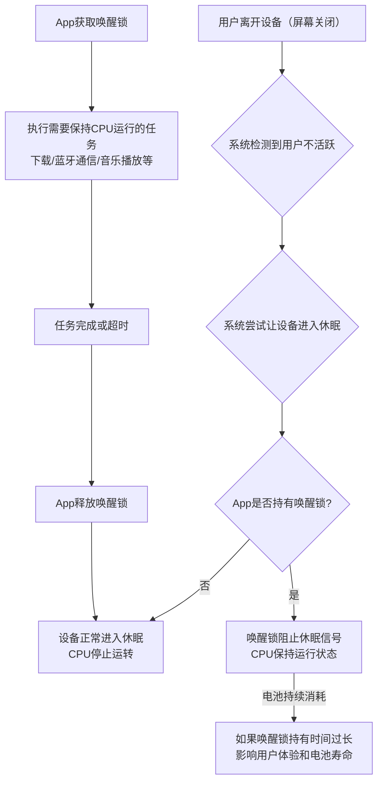
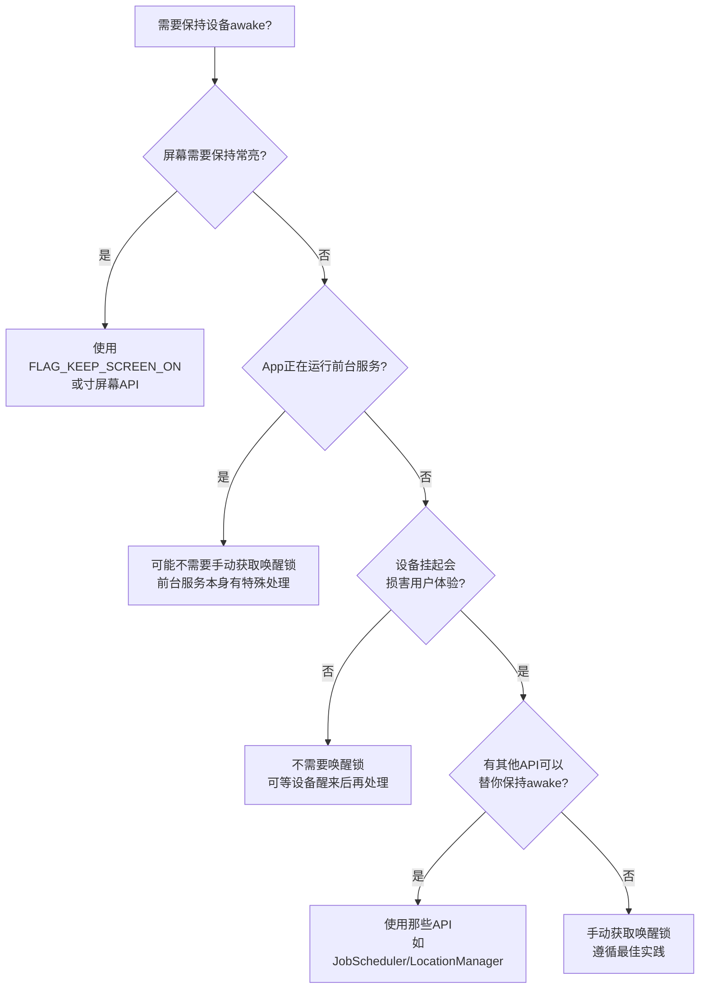

# 6.1.17 遵循唤醒锁最佳实践

夜风穿过松林，带走了篝火最后一缕跳跃的火光，只剩下暗红色的余烬在木炭间明明灭灭。希尔往火堆里添了两根干透的松枝，火星"噼啪"一声窜了起来，在她脸上投下摇曳的光影。

"所以你是说，"洛芙抱紧了膝盖，把下巴搁在臂弯里，眼睛盯着那堆快要熄灭的火，"即使我们用WorkManager把任务扔进了后台，设备本身还是可能在任何时候把CPU掐断？"

黛琳点了点头，动作很轻，像是在确认一个已经重复过很多遍的答案。

"系统有他自己的省电策略。只要用户不操作，超过一定时间，设备就会进入休眠状态。CPU停止运转，所有后台任务都被卡在那里等着。"

"那怎么办？"洛芙的声音里带着一点急切，"如果我的下载任务正在跑了一半，或者音乐正在缓冲——"

"这就是唤醒锁的作用了。"黛琳从她身边的背包里翻出一个小小的银色物件，摆在膝盖上。那是一块扁平的不锈钢吊坠，边缘刻着细密的齿轮纹路，在火光下泛着幽冷的光泽。"想象一下，我们现在是在森林里守夜。设备是整个营地，系统是那个决定什么时候吹熄灯号的管理员。"

伊莎歪着头，凑近看了看那块吊坠。"又是一个新的魔法道具？"

"不是魔法，是电力管理。"黛琳把吊坠握在手心，指尖摩挲着边缘的齿痕，"当你的App需要确保CPU不睡觉——比如正在下载一个大文件，比如要保持和蓝牙设备的连接——你就需要一个唤醒锁把这个'睡眠信号'挡在外面。"

希尔把笔记本往膝盖上挪了挪，屏幕的蓝光和火光的暖色混在一起。"所以唤醒锁就是你拿着一根棍子站在CPU门口，说'谁都别想睡'？"

"差不多是这个意思。"黛琳嘴角微微上扬，"不过用棍子太野蛮了。我们用的是PowerManager API，它能让你精确地控制要阻挡哪种睡眠。"

她把那枚吊坠举起来，月光透过树枝的缝隙落在上面，形成一小片碎银般的光斑。

"你看这上面刻的齿轮。不同的齿轮组合，控制不同的'睡眠开关'。这就是为什么Android里有好几种唤醒锁类型——"

"等等，"洛芙打断她，举起一根手指，"先告诉我PARTIAL_WAKE_LOCK和FULL_WAKE_LOCK的区别？"

黛琳指了指火堆。"想象这堆火。火堆烧着，营地里暖暖的——这就像CPU在运转。系统默认情况下，如果没人往火堆里添柴，火会慢慢变小，最后完全熄灭。"

"添柴就是用户操作？"

"对。用户每次触摸屏幕、按下按键，系统就知道'还有人醒着'，火就继续烧。但如果我们想让它自己烧一夜呢？"

伊莎接过话头，声音轻轻的："点一根很长的蜡烛在火堆旁边？"

"蜡烛？"黛琳轻轻笑了一声，"蜡烛倒是不错。实际上，唤醒锁就是那根蜡烛。PARTIAL_WAKE_LOCK只让CPU继续运转，但屏幕可以关掉。就像有人在营地里守夜，但大家还是可以躺进睡袋，只是守夜人不能睡。"

"那FULL_WAKE_LOCK就是……让整个营地灯火通明？"

"屏幕也亮着，CPU也跑着。这种锁更适合视频播放或者游戏这种需要用户持续盯着屏幕的场景。"黛琳把吊坠翻过来，背面刻着一行小字，她眯着眼睛辨认了一下，"不过官方文档说，除非真的需要屏幕保持亮起，否则应该优先考虑PARTIAL_WAKE_LOCK。毕竟让屏幕常亮是电池消耗的大户。"

希尔已经在键盘上敲了几下，调出了Android开发者文档的页面。"官方建议是在考虑手动获取唤醒锁之前，先问自己四个问题。"

"四个问题？"洛芙凑过去看屏幕。

"第一个：屏幕需要保持常亮吗？如果是，直接用FLAG_KEEP_SCREEN_ON，比唤醒锁更轻量。"

"第二个：App在跑前台服务吗？如果是，而且用户能感知到那个服务在运行，那可能根本不需要手动获取唤醒锁——系统会帮你保持 awake。"

"第三个：如果设备挂起了，真的会对用户体验造成损害吗？比如只是更新一个通知，完全可以等到设备醒来再处理。"

"第四个：有没有其他API已经在替你保持 awake 了？"希尔把页面往下滑，露出一张决策流程图，"比如JobScheduler、LocationManager这些，它们内部已经实现了唤醒锁，开发者不需要自己再包一层。"

那张流程图的线条清晰简洁：从"你需要保持设备 awake 吗"开始，分叉出屏幕是否需要亮、是否前台服务、是否关键业务等判断点，最终指向"使用唤醒锁"或"不需要唤醒锁"两个终点。

"你看，"黛琳指着那张图，"官方把这个过程画成了一个决策树。每一个分支都是一个问题，回答完就自动知道该往哪走。这比我们凭空想'我需不需要唤醒锁'要可靠得多。"

洛芙盯着那张图看了好一会儿，忽然坐直了身子。"等等，我突然想到一个问题——刚才你说有的API内部会替你持有唤醒锁，那怎么知道是哪个家伙在偷偷耗电？"

"问得好。"黛琳的表情变得认真起来，"这就是为什么官方文档特别强调'识别唤醒锁的来源'。很多性能问题都是因为开发者不知道自己的App通过某个系统API间接持有了唤醒锁，然后傻傻地去找自己写的代码——结果找半天找不到。"

希尔啪嗒啪嗒地敲着键盘，调出了另一个页面。"官方有一个专门的文档教你怎么识别不同API持有的唤醒锁。"

"比如LocationManager，它会在你请求位置更新的时候自动持有唤醒锁。还有MediaPlayer，播放音频的时候内部也会持有一个PARTIAL_WAKE_LOCK。"

"所以理论上，"洛芙慢慢地说，"如果我的App用到了这些API，我其实不需要再手动加一层唤醒锁？"

"对。而且如果你再加一层，就等于两把锁叠在一起，更难释放，更容易出问题。"黛琳说。

火堆里的松枝发出轻微的"咔"声，希尔拿起火钳把灰烬拨了拨，让快要熄灭的余烬重新焕发一点生机。

"那我换一个问法。"伊莎的声音在夜风里显得格外轻柔，"如果我们确认了——确实需要手动获取唤醒锁，那要注意什么？"

"命名。"黛琳的回答简短而有力，"唤醒锁的名字非常重要。系统会用这个名字来追踪和聚合你的唤醒锁使用情况。如果名字取得乱七八糟——比如加时间戳、加随机数——系统就没办法把你同一个逻辑操作的多次唤醒锁合并统计，你也会因此错失很多有价值的调试信息。"

"那应该怎么命名？"洛芙问。

"用固定的字符串，不要包含任何个人信息，也不要包含会变化的值。官方建议用类名加操作描述的组合，比如'MyDownloadService::WakeLockTag'，或者直接用一个描述性很强的固定字符串。"

希尔插嘴："而且不能加计数器或者UUID。每一个新的标记都会被系统当成一个新的唤醒锁类型，完全没办法聚合。"

"还有，"黛琳补充道，"不要在名字里放邮箱、用户名这些个人信息。系统如果检测到PII，会把你的唤醒锁名字标记成_UNKNOWN，那调试的时候就完全抓瞎了。"

洛芙打了个哈欠，又连忙捂住嘴。"抱歉……"

"没关系，夜深了。"伊莎温柔地说，"不过讲完命名，还有一点很重要——释放。"

"释放唤醒锁。"黛琳的表情变得严肃，"这是最容易出错的地方。如果你的App获取了一个唤醒锁但没有正确释放，CPU就会一直跑下去，直到电池耗尽。用户会发现手机发烫、电量狂掉，然后骂你。"

希尔把笔记本往洛芙那边转了转，屏幕上是一段Kotlin代码示例：

```kotlin
val powerManager = getSystemService(Context.POWER_SERVICE) as PowerManager
val wakeLock = powerManager.newWakeLock(
    PowerManager.PARTIAL_WAKE_LOCK,
    "MyDownloadService::DownloadWakeLock"
)

fun downloadFile() {
    wakeLock.apply {
        try {
            acquire(10 * 60 * 1000L) // 10 minute timeout
            // 执行下载任务
            performDownload()
        } finally {
            release()
        }
    }
}
```

"看到没有？"希尔指着那段代码，"用try-finally确保无论发生什么——正常完成、抛异常、提前return——release()都会被调用。"

"而且这里还加了一个超时。"洛芙指着`acquire(10 * 60 * 1000L)`那一行，"十分钟？"

"对。如果因为某些原因你的任务卡住了，没有正常执行完，唤醒锁也不会永远握着不放。"黛琳说，"超时是一种安全网。很多严重的电池问题就是因为唤醒锁持有时间过长——可能是一行代码写错了，导致一个后台任务跑了整整八个小时。"

"八个小时……"洛芙小声重复了一遍，觉得后背有点发凉。

"官方文档里有一个具体的阈值。"希尔翻了翻页面，"如果唤醒锁在24小时内被持有超过两小时，而且影响的会话超过5%，就会被Android Vitals标记为'过度使用'，可能影响应用在 Play Store 的可见度。"

"从2026年三月开始？"黛琳补充道。

"对，已经开始了。"

夜风吹过树梢，带起一阵沙沙的响声。远处湖面上泛着月光，把整个营地照得朦朦胧胧的。洛芙往外套里缩了缩，呼出的气在空气里变成一小团白雾。

"那……除了正确释放之外，还有什么办法降低唤醒锁的消耗吗？"洛芙问，声音有点闷闷的。

"降低唤醒频率。"黛琳说，"这是第四个最佳实践，本质上是从源头减少唤醒锁的使用次数和时长。"

"比如？"

"比如你用WorkManager做周期性任务，可以把间隔从十五分钟改成半小时甚至更长。用传感器的时候，用batching把多次事件合并成一次上报。位置更新的话，可以用PRIORITY_PASSIVE优先级，或者拉大两次更新之间的最小间隔。"

"一句话总结就是：能合并的合并，能拉长的拉长。"希尔接话，"唤醒设备是最耗电的操作之一，频繁地唤醒会让电池寿命急剧下降。"

伊莎忽然笑了起来，声音像风铃一样清脆。"感觉就像我们露营的时候——如果每五分钟就起来添一次柴火，柴火很快就会用完。但如果一开始就把火烧旺，然后隔很久才去看一次，反倒能撑一整夜。"

"比喻得不错。"黛琳点点头，"唤醒锁管理也是这个道理。要让设备知道'我现在需要你醒着'，用完就立刻说'你可以睡了'，不要一直吊着。"

洛芙沉默了一会儿，眼睛盯着那堆快要熄灭的火。火光在她的瞳孔里跳动，像是两盏小小的灯。

"我想我大概明白了。"她慢慢地说，"唤醒锁不是不能用，但要用对——先问有没有更轻量的替代方案；要用的话名字要固定好，方便追踪和调试；用完一定要释放，最好再加个超时；能合并的唤醒就合并，能拉长间隔就拉长。"

"总结得很准确。"黛琳的语气带着一点欣慰，"这四点听起来简单，但很多真实的电池问题都是因为违背了其中一条。"

希尔合上笔记本，抬头看了看天空。星星比刚才又多了几颗，月亮挂在树梢上，把整个营地照得像浸在水里一样。

"时候不早了。"她站起身，伸了个懒腰，骨节发出轻微的"咔咔"声，"明天还要赶路，大家早点休息吧。"

伊莎也站起来，把地上散落的零食包装袋收进一个塑料袋里，动作轻柔而有条理。洛芙跟着站起来，却忍不住又看了一眼那堆火。

火光已经暗淡到只剩下几点红色的余烬，在灰烬里一闪一闪，像是在做最后的挣扎。

"明天的露营，"伊莎忽然开口，声音轻轻的，"如果天气好，我们去看湖对岸的红叶。现在这个季节，山上的枫叶应该红得很深了。"

"好期待啊……"洛芙小声说。

黛琳把那块银色的吊坠收回背包里，站起身拍了拍裤子上的灰。她回头看了一眼快要熄灭的火堆，忽然说了一句：

"记住，唤醒锁是工具，不是目的。能让系统替你做的事情，就不要自己抓着不放。"

洛芙回头看她，火光的余烬映在她的眼睛里，像是两滴快要熄灭的小星星。

"我记住了。"她说。

四个人各自钻进帐篷，拉上睡袋。夜风从帐篷的缝隙里钻进来，带着秋天特有的凉意和草木的清香。远处湖面上传来一两声不知名的鸟叫，回荡在寂静的夜里，像是某种古老的安眠曲。

帐篷里的灯灭了，整个营地陷入一片安静。只有天上的星星还在值班，一闪一闪地守望着这片睡着了的小小天地。

---

## 专业技术总结

### 唤醒锁（Wake Lock）定义

唤醒锁是Android系统中的一种电源管理机制，允许App在用户不活跃时保持CPU处于运行状态，防止设备进入低功耗的"挂起"（suspend）状态。

### 结构图





#### 复杂度与影响

| 场景 | 不使用唤醒锁 | 使用唤醒锁 |
|------|-------------|-----------|
| 后台下载 | 下载任务在设备休眠时被中断，可能导致下载失败或数据丢失 | CPU保持运转，下载任务可完成，但电池消耗增加 |
| 音乐播放 | 屏幕关闭后音乐可能停止（取决于系统策略） | 即使屏幕关闭，音频播放持续，用户体验更好 |
| 蓝牙通信 | 设备休眠可能导致连接断开 | 保持与外部设备的稳定连接 |

#### 反模式与陷阱

1. **获取唤醒锁后不释放**：`acquire()`后没有调用`release()`，导致CPU永远运行，直到电池耗尽或设备重启。修复：始终在`finally`块中释放。

2. **使用可变名称**：每次获取唤醒锁时用带时间戳或UUID的名称，导致系统无法聚合统计，调试困难。修复：使用固定的描述性字符串作为标签。

3. **过度使用唤醒锁**：为所有后台任务获取唤醒锁，忽视系统已有的优化（如前台服务、JobScheduler）。修复：先评估是否真的需要唤醒锁，优先使用系统级解决方案。

4. **在主线程获取唤醒锁后执行耗时操作**：虽然唤醒锁保持了CPU运行，但主线程阻塞仍会导致ANR。修复：将耗时操作放到后台线程执行。

5. **忽视超时机制**：没有为唤醒锁设置超时时间，任务异常时无法自动释放。修复：使用`acquire(timeout)`设置合理的超时。

#### 设计哲学

**电源管理的核心原则：最小化唤醒锁的使用频率和持续时间**

Android官方建议开发者遵循以下实践原则来确保合理的唤醒锁使用：

1. **先考虑替代方案**：在手动获取唤醒锁之前，先评估FLAG_KEEP_SCREEN_ON、Foreground Service或其他系统API是否已满足需求。很多场景下系统已经提供了更好的解决方案。

2. **精确控制唤醒锁的粒度**：唤醒锁应该精准匹配任务的需求——需要屏幕亮就用FULL_WAKE_LOCK，只需要后台处理就用PARTIAL_WAKE_LOCK。不要过度保留不需要的资源。

3. **始终释放**：获取唤醒锁后，必须确保在任务完成、失败或超时时都能正确释放。使用try-finally结构是最佳实践，即使代码抛出异常也能保证释放。

4. **命名规范可追踪**：使用固定格式的标签命名（如`"MyService::Tag"`），便于系统聚合统计、问题定位和性能分析。避免PII和动态变化的值。

5. **降低唤醒频率**：通过批量处理、增大更新间隔、使用低优先级请求等方式，从源头减少需要持有唤醒锁的次数。这是电池优化的根本策略。

6. **利用系统工具调试**：使用Background Task Inspector、Perfetto、ProfilingManager等工具追踪唤醒锁的使用情况，及时发现和修复问题。

---

#### 🏕️ 动手练习

**目标**：实现一个遵循最佳实践的唤醒锁管理机制，确保后台下载任务能够正确执行且不会导致电池过度消耗。

**你需要做的事**：

1. 创建新项目，配置PowerManager权限
2. 实现一个下载服务，演示正确获取和释放唤醒锁
3. 实现一个错误示例（不释放唤醒锁），观察问题
4. 添加超时机制，防止唤醒锁永久持有
5. 实现批量下载任务，优化唤醒频率
6. 使用后台任务检查器验证行为

**验收标准**：
- [ ] 在AndroidManifest.xml中正确声明WAKE_LOCK权限
- [ ] 实现了带try-finally的唤醒锁获取和释放代码
- [ ] 为唤醒锁设置了合理的超时时间
- [ ] 添加了固定格式的唤醒锁标签名称
- [ ] 实现了批量下载机制，减少唤醒次数
- [ ] 在Logcat中观察到唤醒锁的获取和释放日志
- [ ] 使用Android Studio的Background Task Inspector验证任务状态

**参考实现**：

```kotlin
// 正确示例：带超时和finally的唤醒锁管理
class DownloadService : Service() {
    
    private val powerManager: PowerManager by lazy {
        getSystemService(Context.POWER_SERVICE) as PowerManager
    }
    
    private var wakeLock: PowerManager.WakeLock? = null
    
    private fun acquireWakeLock() {
        // 固定标签名，便于系统追踪和聚合
        wakeLock = powerManager.newWakeLock(
            PowerManager.PARTIAL_WAKE_LOCK,
            "DownloadService::FileDownloadWakeLock"
        ).apply {
            // 设置10分钟超时，防止永久持有
            acquire(10 * 60 * 1000L)
        }
    }
    
    private fun releaseWakeLock() {
        wakeLock?.let {
            if (it.isHeld) {
                it.release()
            }
        }
        wakeLock = null
    }
    
    fun downloadFiles(urls: List<String>) {
        acquireWakeLock()
        try {
            urls.forEach { url ->
                // 执行下载
                downloadFile(url)
            }
        } finally {
            // 无论成功还是异常，都确保释放
            releaseWakeLock()
        }
    }
}
```

```kotlin
// 反模式：缺少超时和错误处理
class BadDownloadService : Service() {
    
    private fun badDownload() {
        val powerManager = getSystemService(Context.POWER_SERVICE) as PowerManager
        val wakeLock = powerManager.newWakeLock(
            PowerManager.PARTIAL_WAKE_LOCK,
            "BadService::${System.currentTimeMillis()}" // 错误：动态名称！
        )
        wakeLock.acquire() // 没有超时！
        
        // 如果这里抛出异常，唤醒锁永远不会被释放
        downloadFile()
        
        wakeLock.release() // 可能永远执行不到
    }
}
```

```kotlin
// 优化示例：降低唤醒频率的批量处理
class BatchDownloadWorker(
    context: Context,
    params: WorkerParameters
) : CoroutineWorker(context, params) {
    
    override suspend fun doWork(): Result {
        // 将多个文件批量下载，而不是分别唤醒设备
        val urls = inputData.getStringArray(KEY_URLS) ?: return Result.failure()
        
        // 一次性获取唤醒锁，处理所有文件
        val powerManager = applicationContext.getSystemService(
            Context.POWER_SERVICE
        ) as PowerManager
        
        val wakeLock = powerManager.newWakeLock(
            PowerManager.PARTIAL_WAKE_LOCK,
            "BatchWorker::MultiFileDownload"
        )
        
        wakeLock.acquire(30 * 60 * 1000L) // 批量操作可以设置更长超时
        try {
            urls.forEach { url ->
                downloadFile(url)
            }
        } finally {
            wakeLock.release()
        }
        
        return Result.success()
    }
    
    companion object {
        const val KEY_URLS = "key_urls"
    }
}
```

---

## 面试热身

1. **请解释PARTIAL_WAKE_LOCK和FULL_WAKE_LOCK的区别，以及各自适用的场景。**

2. **为什么唤醒锁的命名很重要？如果使用了包含时间戳的可变名称，会导致什么问题？**

3. **请描述获取唤醒锁后的正确释放模式，并解释为什么finally块是必要的。**

4. **在获取唤醒锁之前，应该考虑哪些替代方案？为什么官方建议优先使用这些替代方案？**

5. **如果你的应用被Android Vitals标记为"过度使用唤醒锁"，你应该如何诊断和修复这个问题？**

---

## 洛芙的小小日记本

今天学到了唤醒锁。原来就像营地的守夜人——需要的时候点亮蜡烛，用完了就要吹灭，不能让蜡烛烧一整夜。最重要的是，能让管理员（系统）帮忙做的事情，就不要自己一直举着蜡烛。黛琳说得对，工具是拿来用的，不是拿来抓着的。

---

## 今日关键词

**唤醒锁（Wake Lock）**：Android电源管理API，允许App在用户不活跃时保持CPU运行状态，防止设备进入休眠。

**PARTIAL_WAKE_LOCK**：一种唤醒锁类型，保持CPU运转但允许屏幕关闭。适用于后台下载、音乐播放等不需要屏幕的场景。

**FULL_WAKE_LOCK**：一种唤醒锁类型，同时保持CPU和屏幕运行。适用于视频播放、游戏等需要用户持续注视屏幕的场景。

**PowerManager**：Android系统服务，提供电源管理功能，包括唤醒锁的创建和获取。

**FLAG_KEEP_SCREEN_ON**：比唤醒锁更轻量的替代方案，用于需要屏幕保持常亮但不需要完整唤醒锁的场景。

**Foreground Service**：前台服务，用户能够感知其运行的服务类型，系统会为其保持必要的资源。

**try-finally**：确保代码块中的清理逻辑（如唤醒锁释放）无论是否发生异常都能执行的异常处理模式。

**Wake Lock Tag**：唤醒锁的标识字符串，用于系统追踪、聚合统计和调试。必须使用固定的描述性名称。

**超时机制（Timeout）**：防止唤醒锁永久持有的安全机制，设定最长时间后自动释放。

**Android Vitals**：Google Play控制台提供的应用质量监控功能，监测过度唤醒锁使用等电池相关问题。

**Background Task Inspector**：Android Studio提供的工具，用于本地调试WorkManager任务的执行状态和唤醒锁使用情况。

**Perfetto**：Google提供的系统追踪工具，可视化CPU状态、线程活动、网络活动和唤醒锁使用情况。

**ProfilingManager**：Android SDK 35引入的编程式API，用于在生产环境中收集系统追踪数据。

**唤醒频率（Wake-up Frequency）**：设备被唤醒的次数，高频率会显著消耗电池。优化策略包括批量处理和增大时间间隔。

**Sensor Batching**：传感器事件批量处理机制，通过设置maxReportLatencyMs将多次事件合并为一次上报，减少唤醒次数。

**PRIORITY_PASSIVE**：位置请求的低优先级模式，只在有其他应用请求位置时才被动更新，减少不必要的唤醒。