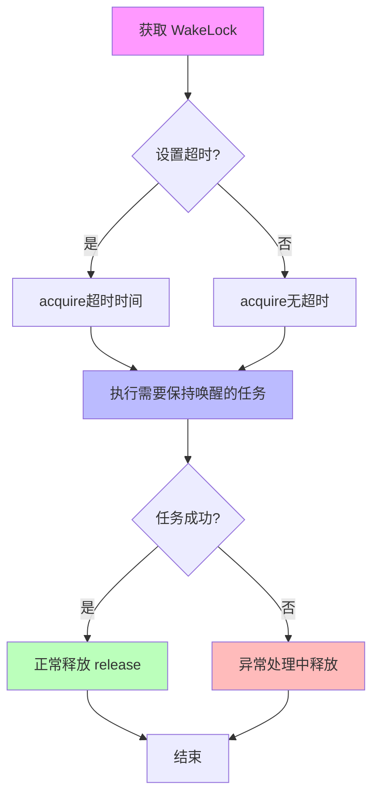
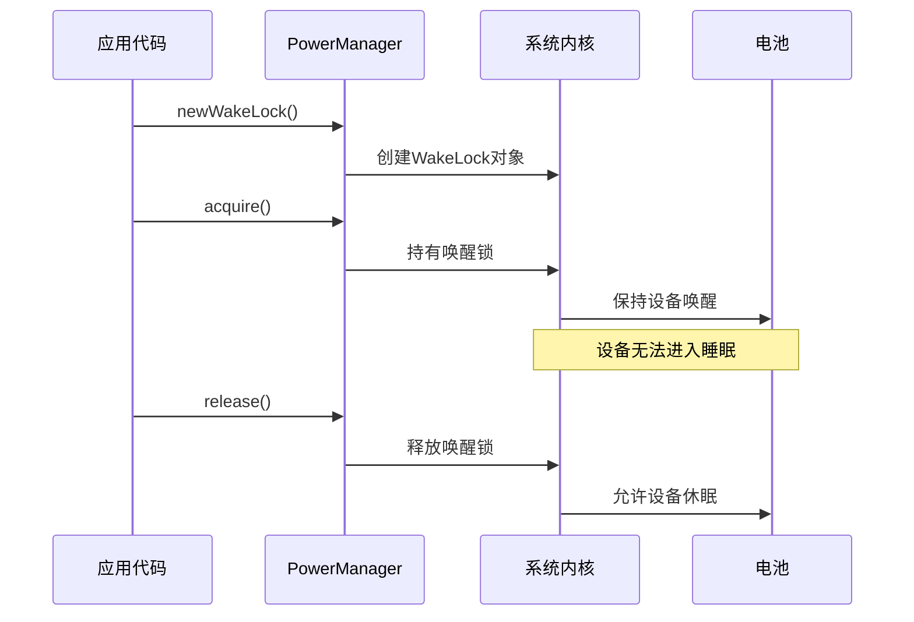

# 6.1.18 在本地调试唤醒锁

傍晚的山风吹得帐篷布轻轻晃动，洛芙蜷坐在睡袋里，手撑着下巴盯着黛琳的笔记本电脑屏幕。屏幕上是 Battery Settings 页面，电量图标旁边有一个小小的绿色百分比——87%。

“黛琳学姐，这个百分比下面的'后台活动'是什么呀？”洛芙指着屏幕问。

黛琳把笔记本转过来一点，指着那个标签说：“这个啊，是系统统计的 App 后台活动占比。我们之前不是讲了唤醒锁吗？有些 App 会一直握着唤醒锁不让手机休眠，电量就偷偷跑掉了。”

“咦？”洛芙眨眨眼，“那怎么看是哪个 App 在偷偷搞鬼？”

希尔刚好从帐篷外钻进来，手里拿着一盒草莓大福。她把盒子放在中间，笑着说：“问得好！洛芙，你刚才问的这个问题，就是我们今天要学的——怎么在本地调试唤醒锁。”

伊莎从背包里拿出湿纸巾，仔细擦干净手才拿起一个大福，含糊地说：“黛琳姐上次说，唤醒锁就像……营火不能灭，得有人一直守着。那今天就是要学……怎么知道是谁在守着火，对吧？”

“对！”希尔盘腿坐下，笔记本电脑放在腿上，“Android 系统提供了一些工具，可以让我们看到手机里有哪些唤醒锁、各自持有了多久。我们今天就用这些工具来玩一个'找找看'的游戏。”

“什么游戏？”洛芙好奇地问。

“看谁能让手机'睡不着'呀。”希尔 grins，露出一副跃跃欲试的表情。

---

## 问题发现

黛琳打开 Android Studio 的 Logcat 面板，说：“我们先来看一个真实的例子。洛芙，你之前不是写了一个下载文件的 Demo 吗？那个 Demo 里用了 WakeLock 来保证下载时手机不会休眠，对吧？”

洛芙点点头：“嗯！我记得要在 Manifest 里声明 WAKE_LOCK 权限，然后在代码里用 PowerManager 获取 WakeLock，用 acquire() 持有，用 release() 释放。”

“没错。”黛琳调出那个 Demo 的代码，指着屏幕说，“但是你想过没有——如果你的代码里 acquire() 了却忘记 release()，会怎么样？”

“那手机就永远睡不着了？”洛芙瞪大眼睛。

“对，就会产生所谓的'唤醒锁泄漏'。”黛琳点点头，“这种情况在开发时很容易发生，尤其是当你处理异常或者退出界面时忘记释放锁。今天我们就来学学，怎么发现这种问题。”

希尔补充道：“还有一种情况是，你明明已经不用 WakeLock 了，但系统还在统计你握着锁——这也是一种资源浪费。我们都要学会调试和排查。”

---

## 正文知识讲解

### 1. 用 adb 查看唤醒锁信息

黛琳打开终端，输入了一行命令：

```bash
adb shell dumpsys power
```

屏幕上瞬间输出了一长串信息。黛琳滚动到其中一行，指给大家看：

```
Wake Locks: size=2:
  PartialWakeLock: *alarm* (uid=1000, pid=-1, ws=WorkSource{1000})
  PartialWakeLock: *backup* (uid=10072, pid=12345, ws=null)
```

“看，这里显示当前有两个部分唤醒锁。”黛琳解释道，“第一个是系统的备份进程，第二个可能是某个 App 的——uid 10072 对应的是哪个 App，我们可以查一下。”

洛芙凑近屏幕：“哇，原来手机里有这么多唤醒锁在悄悄运行！那怎么看是哪个 App 持有的？”

黛琳又输入一行命令：

```bash
adb shell dumpsys power | grep -A 5 "Wake Locks"
```

“通过 grep 过滤，我们只看 Wake Locks 相关的信息。”黛琳说，“每一行 PartialWakeLock 后面跟着的是锁的名称，比如 '*alarm*'、'*backup*'，还有对应的 uid 和 pid。uid 1000 通常是系统进程，uid 10072 以上的才是第三方 App。”

伊莎轻轻捏起一个草莓大福，说：“这个 uid 就像……露营者的编号吧？系统的人是 1000，其他人是后面的数字。”

“对，这个比喻很贴切。”黛琳笑着点头。

### 2. 查看特定 App 的唤醒锁

希尔接过电脑，说：“现在我们来看看，怎么查看某个特定 App 的唤醒锁。先用这个命令找到你的 App 对应的 uid：”

```bash
adb shell dumpsys package your.app.package | grep userId
```

“把 'your.app.package' 换成你实际的包名。”希尔补充道，“比如我们之前的 Demo 包名是 'com.camp.download'，对吧，洛芙？”

洛芙点头：“嗯，就是那个！”

希尔输入命令，输出显示 uid 是 10234。她接着说：“然后我们可以用这个命令过滤出这个 App 的所有唤醒锁：”

```bash
adb shell dumpsys power | grep "10234"
```

屏幕上出现了几行相关信息。希尔解释说：“如果你的 App 握着唤醒锁，这里就会显示出来。锁的名称通常会包含你的包名或者你设置的标签，方便识别。”

“如果我想看更详细的信息呢？”洛芙问。

“那就用这个命令，可以看到每个锁的详细信息，包括持有的时间、是谁请求的：”

```bash
adb shell dumpsys power -w 2
```

黛琳在一旁补充道：“参数 -w 2 会输出更详细的唤醒锁信息，包括每个锁的详细状态。这个在排查问题时特别有用。”

### 3. 查看电池统计

伊莎指着电脑屏幕的一个角落说：“还有那个 Battery Settings，也能看到一些线索呢。”

黛琳点点头，点开手机的设置页面，进入“电池”->“后台活动”。她解释说：“这里会显示每个 App 的后台活动占比。如果一个 App 的后台活动占比特别高，很可能就是在后台一直握着唤醒锁。”

洛芙看到屏幕上有一个列表，排第一的是一个叫"备份与同步"的应用，后台活动占比 23%。

“原来如此！”洛芙恍然大悟，“如果我发现某个 App 后台活动占比很高，就可以用 dumpsys 命令去确认它是不是握着唤醒锁。”

“对，这就是调试唤醒锁的基本思路。”黛琳总结道，“第一步从 Battery Settings 找到可疑的 App，第二步用 dumpsys 确认它是否握着唤醒锁，第三步检查代码里的 WakeLock 使用是否正确。”

### 4. 反模式：忘记释放唤醒锁

希尔打开洛芙之前写的 Demo 代码，指着其中一个方法说：“洛芙，你这里有个常见的问题哦。”

代码是这样的：

```kotlin
fun startDownload(url: String) {
    val powerManager = getSystemService(Context.POWER_SERVICE) as PowerManager
    val wakeLock = powerManager.newWakeLock(
        PowerManager.PARTIAL_WAKE_LOCK,
        "MyApp::DownloadWakeLock"
    )
    wakeLock.acquire()
    
    // 开始下载
    downloadFile(url)
    
    // 下载完成后...
}
```

洛芙看了半天，说：“我……我在下载完成后好像没有调用 release() ？”

“对！”希尔指出问题，“如果下载成功，皆大欢喜；但如果下载过程中出错抛异常，或者用户直接退出界面，这个 wakeLock 就永远不会被 release，手机就永远睡不着了。”

“那怎么办？”洛芙问。

“用 try-finally 包裹，或者更好的方式是用 Kotlin 的 use 函数。”希尔写出修复后的代码：

```kotlin
fun startDownload(url: String) {
    val powerManager = getSystemService(Context.POWER_SERVICE) as PowerManager
    val wakeLock = powerManager.newWakeLock(
        PowerManager.PARTIAL_WAKE_LOCK,
        "MyApp::DownloadWakeLock"
    )
    
    wakeLock.acquire(10 * 60 * 1000L) // 最多持有10分钟
    
    try {
        // 开始下载
        downloadFile(url)
    } finally {
        if (wakeLock.isHeld) {
            wakeLock.release()
        }
    }
}
```

“这里有两个改进。”希尔指着代码解释道，“第一，用 try-finally 确保无论成功还是失败都会释放锁；第二，调用 acquire() 时传入超时时间，这样即使代码忘记释放，系统也会在超时后自动释放。”

伊莎好奇地问：“这个超时时间是怎么算的？”

“单位是毫秒。”希尔回答，“10 * 60 * 1000L 就是 10 分钟。这个时间根据你的任务预期时长来定，比如下载一个文件可能需要几分钟，就设置几分钟。”

### 5. 使用 PowerManager.WakeLock 的最佳实践

黛琳打开一个小白板，画出一个流程图：



“除了代码层面的注意事项，还有几个系统级的最佳实践。”黛琳说，“第一，尽量在完成任务后立即释放唤醒锁，不要长时间持有；第二，如果你的任务是用户触发的同步操作，考虑使用 WorkManager 而不是手动管理 WakeLock——WorkManager 会在后台自动处理这些；第三，如果你的 App 需要在后台持续运行，考虑使用 Foreground Service 而不是依赖 WakeLock。”

洛芙问：“WorkManager 是我们之前学过的那個吗？”

“对，WorkManager 是 Google 推荐的后台任务解决方案，它内部会智能地管理唤醒锁，不需要你手动处理。”黛琳点头道，“只有在你有特殊需求、必须手动控制唤醒状态时，才需要直接使用 WakeLock API。”

### 6. 实战：用模拟器测试唤醒锁

希尔打开 Android 模拟器，说：“我们来做个实验，看看唤醒锁的效果。先打开模拟器的电池设置，确认初始电量是 100%。”

洛芙操作模拟器，点开设置->电池，确认电量是 100%。

“现在我们运行一个简单的 App，它会持有唤醒锁 30 秒。”希尔启动了一个测试 App，屏幕上显示“正在持有唤醒锁...”

30 秒后，App 自动释放了唤醒锁。希尔说：“现在我们用命令查看这 30 秒内的电池变化。”

```bash
adb shell dumpsys batterystats --charged 0 com.example.testapp
```

输出显示：

```
Estimated power use (mAh):
  Capacity:        5000
  Computed drain:   2.3
  Uid 0:com.example.testapp: 1.5
```

“这个 App 在 30 秒内消耗了 1.5 mAh 的电量。”希尔解释道，“虽然看起来不多，但如果你的 App 一直握着唤醒锁不释放，一小时后的耗电量就很可观了。”

“如果我想看更详细的耗电分布呢？”洛芙问。

“那就用这个命令生成 Battery Historian 的 HTML 报告。”希尔输入：

```bash
adb shell dumpsys batterystats > batterystats.txt
# 然后用 Battery Historian 工具解析
```

“Battery Historian 是一个网页工具，可以把 batterystats.txt 解析成可视化的图表，展示每个 App 在什么时间段消耗了多少电量。”黛琳补充道，“不过那个工具需要 Docker 环境，我们今天先掌握本地调试的基本方法就够了。”

---

## 专业技术总结

> **唤醒锁（Wake Lock）**—— 一种 Android 系统机制，允许应用在特定场景下阻止设备进入睡眠状态，从而保证后台任务（如下载、音乐播放）能够顺利完成。

#### 结构图



#### 反模式与陷阱

1. **忘记释放 WakeLock**：在异常或界面退出时未调用 release()，导致唤醒锁泄漏。修复：使用 try-finally 或 Kotlin 的 use() 函数。

2. **持有时间过长**：即使任务已完成仍长时间持有唤醒锁。修复：任务完成后立即释放，或设置合理的超时时间。

3. **在不需要时使用 WakeLock**：对于可以延迟的任务使用 WakeLock 导致不必要的电量消耗。修复：优先使用 WorkManager 等系统推荐的方案。

4. **未处理并发**：多个线程同时获取同一个 WakeLock 但只释放一次。修复：使用引用计数或确保一一对应。

#### 设计哲学

- **最小持有原则**：只在必要时持有唤醒锁，完成后立即释放。
- **超时保护**：始终设置超时时间作为安全网。
- **优先使用高级 API**：优先使用 WorkManager、Foreground Service 等系统推荐的方案，而不是直接操作 WakeLock。
- **用户感知**：长时间后台运行的任务应使用 Foreground Service 并显示通知，让用户知情。

---

> 学习建议：在实际项目中，优先考虑使用 WorkManager 处理后台任务，它已经内置了对唤醒锁的智能管理。只有在有特殊需求（如需要精确控制唤醒状态、或者任务无法使用 WorkManager 时）才直接使用 WakeLock API。开发时务必用 dumpsys power 定期检查是否有唤醒锁泄漏。

## 🏕️ 动手练习

**目标**：掌握本地调试唤醒锁的基本方法，能够发现并修复常见的唤醒锁问题。

**方式 B：独立练习制**

---

**Task 1：查看模拟器的唤醒锁状态**

- **目标**：掌握使用 dumpsys power 查看当前唤醒锁的基本命令。
- **你需要做的事**：
  1. 启动 Android 模拟器（或连接真机）。
  2. 在终端输入 `adb shell dumpsys power`。
  3. 找到输出中的 "Wake Locks:" 部分。
  4. 记录你看到的唤醒锁数量和名称。
- **验收标准**：
  - [ ] 命令成功执行，无报错。
  - [ ] 找到了 "Wake Locks:" 区域。
  - [ ] 记录了至少一个唤醒锁的信息。
- **提示**：如果没有看到任何唤醒锁，可以打开任意一个 App 试试。

---

**Task 2：创建一个会泄漏唤醒锁的 Demo**

- **目标**：模拟唤醒锁泄漏的场景，练习用调试工具发现。
- **你需要做的事**：
  1. 创建一个新的 Android 项目。
  2. 在 Manifest 中添加 `<uses-permission android:name="android.permission.WAKE_LOCK"/>`。
  3. 创建一个 Activity，在 onCreate() 中获取 PartialWakeLock 并调用 acquire()，但**不调用 release()**。
  4. 运行 App，然后按返回键退出。
- **验收标准**：
  - [ ] App 成功安装并运行。
  - [ ] 按返回键退出后，用 `adb shell dumpsys power` 仍能看到你的 App 持有唤醒锁。
- **提示**：
  ```kotlin
  val powerManager = getSystemService(Context.POWER_SERVICE) as PowerManager
  val wakeLock = powerManager.newWakeLock(
      PowerManager.PARTIAL_WAKE_LOCK,
      "MyApp::LeakyWakeLock"
  )
  wakeLock.acquire() // 只获取，不释放
  ```

---

**Task 3：修复唤醒锁泄漏**

- **目标**：修复 Task 2 中的泄漏问题，使用 try-finally 确保释放。
- **你需要做的事**：
  1. 修改 Task 2 的代码，用 try-finally 包裹并确保 release() 被调用。
  2. 重新运行 App，然后退出。
  3. 用 dumpsys power 确认唤醒锁已被释放。
- **验收标准**：
  - [ ] 代码使用了 try-finally 或 use()。
  - [ ] 退出 App 后，dumpsys power 输出中不再显示你的 App 持有唤醒锁。
- **提示**：
  ```kotlin
  wakeLock.acquire()
  try {
      // 业务逻辑
  } finally {
      if (wakeLock.isHeld) {
          wakeLock.release()
      }
  }
  ```

---

**Task 4：设置唤醒锁超时时间**

- **目标**：为唤醒锁设置超时时间，作为安全保护机制。
- **你需要做的事**：
  1. 修改 Task 3 的代码，在 acquire() 时传入超时时间（如 30 秒）。
  2. 运行 App，不手动退出，等待超时。
  3. 观察超时后唤醒锁是否自动释放。
- **验收标准**：
  - [ ] acquire() 调用传入了超时参数（单位毫秒）。
  - [ ] 超时后唤醒锁自动释放（可用 dumpsys 验证）。
- **提示**：超时参数的单位是毫秒，30秒 = 30000L。

---

**Task 5：查看 App 的电池使用统计**

- **目标**：学会查看单个 App 的电池消耗情况。
- **你需要做的事**：
  1. 在模拟器或真机上运行一个会产生后台活动的 App（如之前的下载 Demo）。
  2. 使用命令 `adb shell dumpsys package <package_name>` 查看包信息。
  3. 使用命令 `adb shell dumpsys batterystats <package_name>` 查看电池统计。
- **验收标准**：
  - [ ] 成功查到包名对应的 uid。
  - [ ] 成功看到该 App 的电池使用数据。
- **提示**：batterystats 需要先运行 App 产生一些活动，才能看到有意义的数据。

---

**Task 6：对比有/无超时保护的代码**

- **目标**：通过实验对比，体会超时保护的重要性。
- **你需要做的事**：
  1. 写两个 Activity，都持有唤醒锁。
  2. 第一个用 acquire() 无参数，第二个用 acquire(60*1000L)。
  3. 两个都启动后立即退出，观察 60 秒内 dumpsys power 的输出变化。
- **验收标准**：
  - [ ] 两个 Activity 都被启动过。
  - [ ] 观察到有超时参数的锁在 60 秒后自动释放。
- **提示**：这个实验需要耐心等待超时，或者把超时时间设短一点方便观察。

---

**Task 7：理解 WakeLock 引用计数**

- **目标**：了解部分唤醒锁的引用计数机制。
- **你需要做的事**：
  1. 阅读官方文档关于引用计数的说明。
  2. 实验：连续调用两次 acquire()，然后调用一次 release()，观察结果。
  3. 再调用一次 release()，观察会发生什么。
- **验收标准**：
  - [ ] 理解了 acquire() 会增加计数，release() 会减少计数。
  - [ ] 观察到 release() 调用次数过多会抛出异常。
- **提示**：可以用 try-catch 捕获 IllegalStateException。

---

**Task 8：使用 Battery Historian（可选进阶）**

- **目标**：了解更高级的电池分析工具。
- **你需要做的事**：
  1. 在电脑上安装 Docker（如果还没有）。
  2. 运行 Battery Historian 容器。
  3. 用 `adb shell dumpsys batterystats > stats.txt` 导出数据。
  4. 把 stats.txt 上传到 Battery Historian 网页，查看可视化报告。
- **验收标准**：
  - [ ] Battery Historian 成功运行。
  - [ ] 成功导入 batterystats 数据。
  - [ ] 看到了可视化的电池消耗图表。
- **提示**：Docker 安装和 Battery Historian 使用请参考官方文档。

---

### 面试热身

1. **问题 1**：如果你的 App 在后台一直持有唤醒锁，会对电池产生什么影响？请解释原理。
2. **问题 2**：Partial WakeLock 和 Full WakeLock 有什么区别？分别适用于什么场景？
3. **问题 3**：如何防止因异常导致唤醒锁泄漏？请写出代码示例并解释。
4. **问题 4**：除了直接使用 WakeLock API，Android 还有哪些推荐的方案来处理后台任务？
5. **问题 5**：如果你发现某个第三方 App 一直握着唤醒锁，作为用户你能做什么？作为开发者呢？

---

#### 参考实现要点

1. **优先使用高级 API**：WorkManager 和 Foreground Service 已经内置了唤醒锁管理，非必要不直接使用 WakeLock。
2. **总是设置超时**：即使你计划在任务完成后立即释放，也要设置超时作为安全网。
3. **在合适的时机释放**：确保在 onDestroy()、onStop() 或任务完成后释放唤醒锁。
4. **使用 try-finally**：用 try-finally 包裹所有获取唤醒锁的代码，确保无论成功还是失败都会释放。
5. **测试边界情况**：测试应用在异常退出、崩溃、用户强制停止等情况下唤醒锁是否正确释放。

---

伊莎轻轻打了个哈欠，把最后一个草莓大福放进嘴里。帐篷外的天色已经完全暗下来，只有远处的营火在闪烁。

“今天学的这些调试方法，关键时刻能救命的。”希尔收起电脑，伸了个懒腰，“你们记好了——dumpsys power 是我们排查唤醒锁问题的第一把钥匙。”

洛芙把笔记本合上，若有所思地说：“我现在有点理解黛琳姐说的'最小持有原则'了。就像营火一样，只有需要的时候才让它烧着，不需要了就要赶紧熄灭，不然很浪费资源呢。”

黛琳笑着点点头：“就是这个道理。代码也是一样的——唤醒锁就像营火，要省着用。”

山风又吹过来，帐篷布轻轻摇晃，远处的虫鸣声此起彼伏。洛芙钻出睡袋，把头探出帐篷外看了一眼——满天的星星，又多又亮。

“明天会是好天气吧？”她轻声说。

---

> (本章学习了在本地调试唤醒锁的基本方法，包括使用 dumpsys power 查看唤醒锁状态、排查唤醒锁泄漏、设置超时保护等。核心原则是"最小持有、尽快释放"。在实际项目中，优先使用 WorkManager 等高级 API，只有在有特殊需求时才直接使用 WakeLock。)

## 🍹洛芙的小小日记本

今天学会了用 adb dumpsys 看谁在偷偷握着唤醒锁！黛琳说这就跟检查营火一样——只有需要的时候才让它烧着。希尔演示了一个忘记 release 的“泄漏”例子，吓我一跳，以后一定要用 try-finally 保护好我的 WakeLock！⭐

---

## 今日关键词

- **Wake Lock（唤醒锁）**：一种 Android 机制，允许应用阻止设备进入睡眠状态。
- **Partial WakeLock（部分唤醒锁）**：只保持 CPU 唤醒，屏幕可以关闭。
- **Full WakeLock（完全唤醒锁）**：保持 CPU 和屏幕都唤醒。
- **dumpsys**：Android 系统工具，用于查看系统服务的详细状态。
- **PowerManager**：Android 系统服务，提供电源管理相关的 API。
- **acquire()**：获取唤醒锁的方法。
- **release()**：释放唤醒锁的方法。
- **isHeld**：检查唤醒锁是否被持有的属性。
- **超时时间**：acquire() 的可选参数，防止唤醒锁永久持有。
- **引用计数**：WakeLock 内部维护的计数机制，acquire() 加一，release() 减一。
- **Battery Stats**：电池使用统计工具，记录每个 App 的耗电情况。
- **WorkManager**：Google 推荐的后台任务处理库，内置唤醒锁管理。
- **Foreground Service**：前台服务，用于需要在后台持续运行的任务。
- **WakeLock 泄漏**：获取唤醒锁后未正确释放，导致设备无法休眠的 Bug。
