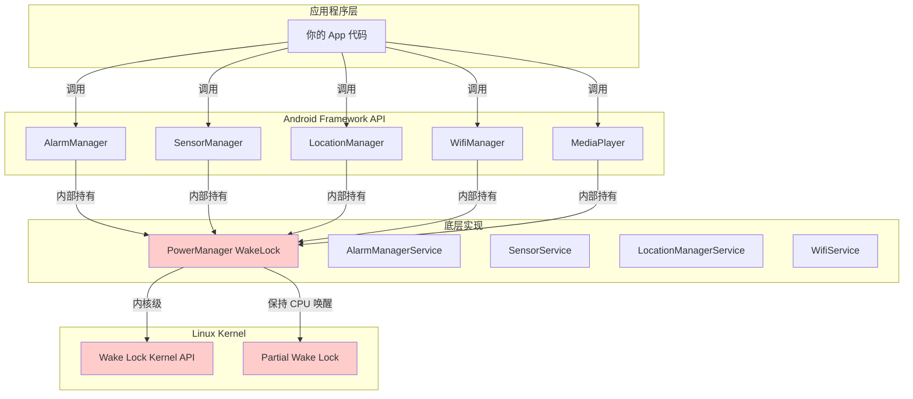
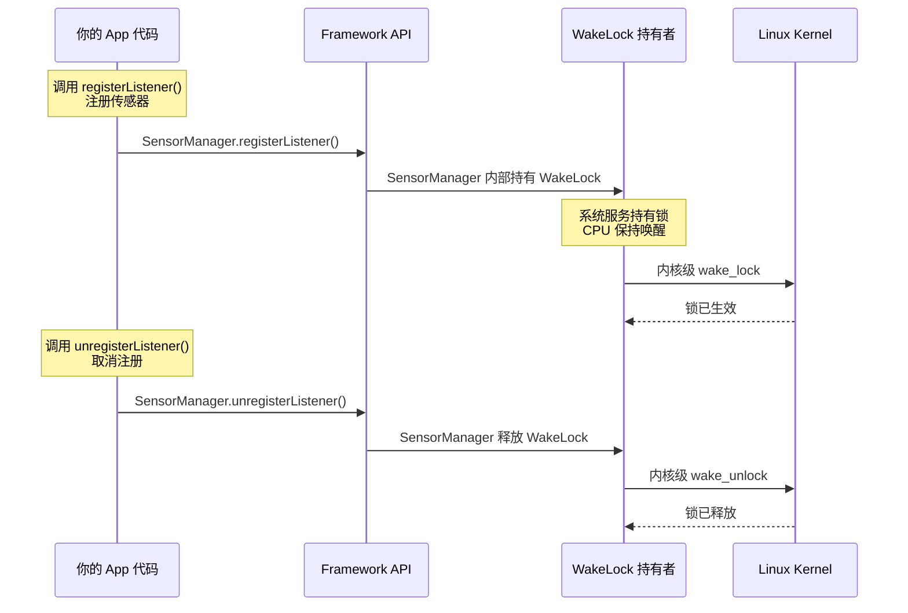

# 6.1.19 识别其他 API 创建的唤醒锁

山风从帐篷的透气窗悄悄钻进来，带着夜晚特有的凉意。希尔把自己那件灰色卫衣裹紧了一点，膝盖上仍然放着黛琳的笔记本电脑，屏幕上显示着 Logcat 输出的密密麻麻的标签。

"等一下。"洛芙突然出声，眼睛瞪得圆圆的。

希尔停下手里的动作："怎么？"

"我有个问题一直想问——"洛芙盘腿坐直了身子，指着黛琳笔记本屏幕上那个 Battery 页面，"学姐，你看这里。我们刚才查的是我们自己的 App，我们自己的代码里确实有 WakeLock……可是，电量分析里有时候会出现一些 App，它们根本没写过 WakeLock 相关代码，却也占了很大一块后台耗电。这是为什么呀？"

帐篷里安静了两秒。

伊莎放下手里的草莓大福，若有所思地看向洛芙："你这个问题问得真好，洛芙。这说明……有些唤醒锁，不是我们写的代码主动创建的。"

"诶？"洛芙歪头，"还有这种好事？代码没写，锁自己就来了？"

"不是好事。"黛琳从笔记本旁边抬起头，声音平静但认真，"恰恰相反——这种'隐形唤醒锁'才是最能偷电的元凶。"

希尔把电脑放到一边，双手抱胸往后靠了靠，说："简单讲就是：Android 系统里有非常多的高级 API，它们内部会自动持有 WakeLock。你调用它们的时候，它们会悄悄把锁握在手里；你以为自己在'正常使用'，其实手机一直睡不着。"

"而且，"伊莎轻声补充，"这些 API 散布在系统各处。你写代码的时候，可能根本不会意识到自己在用它们——比如注册一个传感器、发起一个精确闹钟、甚至连上 WiFi。"

洛芙吞了吞口水："那……那怎么办？我怎么知道我调的那些 API 哪个在背后偷电？"

黛琳把笔记本重新打开，手指在键盘上悬停了一秒，说："这就是今天的主题了——识别其他 API 创建的唤醒锁。我们不只要知道自己的代码在做什么，还要知道系统底层那些'看不见的手'在做什么。"

希尔嘴角一勾："来吧，今晚我们就来一次彻底的'唤醒锁大搜索'。"

---

帐篷外，夜风轻轻摇晃着附近的树梢，远处白马岳的山脊线已经融进了漆黑的夜空。帐篷内的四个人围坐在充电灯的暖光里，开始了一场关于 Android 系统底层秘密的夜谈。

## 问题：那些看不见的唤醒锁

"我们先说一个你肯定用过的。"黛琳点开笔记本上一个新的 Android 文档页面，"AlarmManager——精确闹钟 API。你有没有想过，当你设置一个凌晨五点的闹钟，系统是怎么保证'一定会在五点整叫醒你'的？"

洛芙想了想："系统本身叫醒我？"

"对，但手机那时候明明在休眠，屏幕不亮，CPU 也睡了。"黛琳点点头，"答案就是——AlarmManager 内部会持有一个 WakeLock。它拿到锁，告诉系统：'别睡死，五点叫我'，然后系统才能在那个精确的时刻把 CPU 唤醒。"

"所以AlarmManager自己就有唤醒锁？"洛芙确认道。

"没错。不只是 AlarmManager，"黛琳在笔记本上打开了一个列表，"SensorManager 也是——当你注册一个传感器，尤其是像加速度计、陀螺仪这种需要持续采样的传感器，SensorManager 会持有 WakeLock 来保证芯片在采样期间不会断电。"

伊莎伸手拿起旁边的小本子，轻声说："还有地理位置服务。当你用 FusedLocationProvider 或者 LocationManager 请求持续的位置更新时，系统需要不断唤醒 GPS 模块或者网络定位模块——这个过程里 WakeLock 就悄悄地被握住了。"

希尔掰着手指头数："WiFi Lock、蓝牙扫描、多媒体播放……你们看，这些都是我们日常调用得很开心的 API，但它们底层全都有 WakeLock 在撑着。"

"问题来了，"黛琳合上笔记本，眼神认真地看着洛芙，"我们怎么知道一个 App 的后台耗电，是因为它'自己写了 WakeLock 代码'，还是因为它'调用了某个系统 API'？"

洛芙眨了眨眼："是哦……如果是系统 API 在背后搞鬼，那 App 开发者岂不是完全不知情？"

"对。这就是为什么我们要学会'识别'——你要先知道哪些 API 会自动创建 WakeLock，才能判断自己代码里的耗电到底是谁的锅。"

---

希尔从地上捡起一罐热可可，往洛芙的保温杯里倒了一些，说："来，喝点热的，我们来看点实际的。"

她重新打开笔记本电脑，打开了 Android Studio 的 Android Profiler，又接上了一台真实的 Android 设备。

"这是台测试机，"希尔解释道，"上面装了我们之前写的那个带 WakeLock 的 Demo App。我们先跑一下，然后去系统设置里看它的电池统计——看看'后台活动'具体显示了什么。"

希尔在 Android Studio 里点了 Run。Demo App 安装完毕，她打开 App 界面，点了一下"开始下载"按钮。屏幕上的进度条开始走动。

与此同时，她打开了设备的 Settings → Apps → Battery 页面。

"看到了吗？"希尔指着屏幕上的一项，"'SensorManager'——这里出现了一个系统进程。你看，它标注的耗电占比不低哦。"

洛芙凑过去看，屏幕上的Battery页面显示了各进程的电量消耗列表，其中有一个标签是"系统服务"消耗的电量，里面赫然列着"SensorManager"。

"这……这个不是我们的App啊？"洛芙困惑了。

"但它是你App的'后台活动'造成的。"黛琳说，"你用的那个下载 Demo，里面其实注册了一个Sensor——用来检测手机角度，防止下载过程中手机放歪了导致网络中断。这个注册动作，系统会通过 SensorManager 持有 WakeLock。"

洛芙惊得差点把手里的热可可洒出来："我都不知道还有这种事！"

---

## 知识讲解一：哪些 API 会偷偷创建唤醒锁

伊莎从笔记本旁边拿出了一张纸，用签字笔画了一个简单的示意图。

"我来帮大家整理一下，"她把纸放在帐篷中间的地上，四个人都凑过来看，"Android 系统里，最常见的'自动创建唤醒锁'的 API，大概分这几类——"

她在纸上写下了几个分类：

"第一类，**定时与调度类**。代表是 AlarmManager，还有 WorkManager——WorkManager 内部也依赖 AlarmManager 来触发精确的任务调度，所以它本质上也会持有 WakeLock。"

"第二类，**传感器类**。SensorManager。所有需要持续采样的传感器——加速度、陀螺仪、磁场、光线、压力——只要你在代码里调用 registerListener()，SensorManager 就会持有 WakeLock 来保证芯片供电。"

"第三类，**位置服务类**。FusedLocationProvider、LocationManager、Geofence。当这些服务请求持续位置更新时，系统会持有 WakeLock。"

"第四类，**连接与通信类**。WifiLock、MulticastLock、蓝牙扫描。这些 Lock 虽然不是严格的 WakeLock，但它们会阻止 WiFi 或蓝牙进入休眠模式，也会导致类似的效果。"

"第五类，**媒体与内容类**。"希尔抢过伊莎的笔，在纸上添了一行，"MediaPlayer、MediaRecorder、Camera2 API——拍摄视频、录音、播放音乐，这些操作需要硬件持续工作，系统也会持有 WakeLock。"

黛琳看着这张纸，轻声说："所以，一个 App 如果同时开着导航、听着歌、还在后台跑下载任务——它调用的这些 API 加在一起，唤醒锁就没完没了了。"

"用户只会觉得'这手机掉电好快'，却根本不知道为什么。"洛芙声音闷闷的，有些沮丧。

"这就是为什么我们要学会识别它们。"黛琳拍了拍洛芙的肩膀，"知道了，才能想办法优化。"

---



图 1：Framework API 与 WakeLock 的层次关系。图中红色模块表示持有 WakeLock 的系统服务，这些服务被高层 API 调用时会自动被系统持有，不需要开发者显式写代码。

---

"等等，"洛芙突然抬起头，"那张纸上写的……这些 API 内部都'持有'WakeLock。那这个锁到底是谁在管？是系统自动释放吗？"

"好问题。"黛琳点头，"答案是——通常由调用方负责释放。以 SensorManager 为例："

她从希尔那里接过电脑，在 Demo App 的代码里找到了一行：

```kotlin
// 注册传感器监听器
val sensorManager = getSystemService(Context.SENSOR_SERVICE) as SensorManager
val accelerometer = sensorManager.getDefaultSensor(Sensor.TYPE_ACCELEROMETER)

sensorManager.registerListener(
    sensorEventListener,      // 传感器事件监听器
    accelerometer,             // 要注册的传感器
    SensorManager.SENSOR_DELAY_NORMAL  // 采样频率
)
// 注册后传感器开始工作，系统自动持有WakeLock
```

"看到这行 registerListener() 了吗？"黛琳指着屏幕，"一旦调用了这行，系统就开始持有 WakeLock 了——直到你调用对应的 unregisterListener()。"

"也就是说，"洛芙接话，"如果我注册了传感器但忘记取消注册，这个WakeLock就会一直握着？"

"对。而且不只是传感器，"希尔插话，"AlarmManager 的锁是在闹钟触发后系统自动释放的，这个你管不到。但 SensorManager、LocationManager、WiFi Lock——这些的释放都得你自己写代码来调用。"

"所以最佳实践就是：注册了什么，就取消注册什么。用完就放。"伊莎温柔地补充。

---

## 知识讲解二：如何在代码中识别系统 API 创建的唤醒锁

"光知道哪些 API 会创建唤醒锁还不够，"黛琳重新把笔记本放在膝盖上，"我们还得学会在代码里'找到'它们——通过工具和调试手段，把这些隐形的锁找出来。"

"用什么工具？"洛芙问。

"首先是 dumpsys，"希尔说，"这是 Android 系统自带的一个工具，可以在终端里查非常详细的系统状态信息。"

她打开笔记本电脑的终端，输入了一行命令：

```bash
adb shell dumpsys power
```

终端上立刻刷出了一大堆输出。希尔往回滚了滚，指着其中一段：

```
Power Manager (memory):
  ...
  Wake Locks: size=3
    PARTIAL_WAKE_LOCK              'SensorService' (uid=1000)
    PARTIAL_WAKE_LOCK              'LocationManagerService' (uid=10018)
    PARTIAL_WAKE_LOCK              'MyApp::DownloadWakeLock' (uid=10042)
  ...
```

"看到了吗？"希尔指着第三行，"PARTIAL_WAKE_LOCK 有三个。第一个 SensorService 是系统的传感器服务在持有，第二个 LocationManagerService 是位置服务，第三个 'MyApp::DownloadWakeLock' 是我们 Demo App 里自己代码写的那个。"

"前两个不是我们的代码创建的，但它们在我们的 App 运行期间被系统持有。"黛琳说，"这就是'其他 API 创建的唤醒锁'——它们来自系统服务，但消耗算在我们 App 的账上。"

洛芙盯着屏幕，眼睛越睁越大："所以……系统显示的那个电量消耗，有一部分其实不是我的代码在偷电？"

"对，但问题是——如果你不知道这一点，你可能花了大量时间优化自己的 WakeLock 代码，结果发现电量根本没降多少。因为真正偷电的可能是 SensorManager 或者 LocationManager，你却一直在改自己的代码。"

洛芙有点泄气地"啊"了一声。

"别丧气，"伊莎轻轻拍了拍她的手背，"知道问题在哪里，比不知道强一万倍。SensorManager 的锁虽然系统持有，但如果你真的不需要持续采样，你可以把采样频率调低；LocationManager 的锁可以通过调整定位间隔来优化。这些都是可以优化的点。"

---

希尔又输入了另一个命令：

```bash
adb shell dumpsys batteryinfo
```

"这个可以看到更详细的电池消耗信息，"她解释道，"包括每个 UID 的 WakeLock 持有时长。"

输出的最后几行列出了各进程的 WakeLock 统计：

```
UID 10042 (com.example.wakelockdemo):
  WakeLock: MyApp::DownloadWakeLock
    Duration: 00:03:45
    Count: 1

  WakeLock: SensorService (sensor 28)
    Duration: 00:04:12
    Count: 1

  WakeLock: LocationManagerService
    Duration: 00:02:30
    Count: 12
```

"看到了吗？"黛琳指着最后两行，"SensorService 持有了 4 分 12 秒，LocationManagerService 持有了 2 分 30 秒——这些时间加在一起，都是电量在流失。"

"而且 LocationManagerService 的 Count 是 12，"希尔补充，"说明它被唤醒和释放了 12 次，每次都会短暂地唤醒 CPU。"

洛芙认真地在小本子上记着这些数字，眉头微微皱起："原来一个看似简单的位置更新，背后要消耗这么多……"

---

## 知识讲解三：如何分析 WakeLock 的持有者

"光知道有 WakeLock 存在还不够，"黛琳打开了一个新的页面，"我们还要学会分析——这个 WakeLock 到底是谁创建的？系统 API？还是我们的代码？"

"怎么分析？"洛芙问。

"通过 WakeLock 的 tag。"黛琳说，"每一个 WakeLock 都有一个 tag 字符串，用来标识它的来源。比如 dumpsys 输出里的 'SensorService'、'LocationManagerService'——这些都是系统级的 tag，说明锁来自系统服务。"

"而我们自己代码写的 WakeLock，tag 通常会写成 'MyClassName::MyWakelockTag' 这样的格式——类名加冒号再加一个自定义标签，方便我们在代码里搜索定位。"

希尔接过话头："所以第一步，看 tag 认来源——tag 里带 'Service' 结尾的，基本都是系统 API 在持有；带我们自己的包名或者类名的，是我们自己代码创建的。"

"那如果 tag 里写的是 'AudioMix'、'WifiLocator' 这种呢？"洛芙问。

"这些也是系统级 tag，"黛琳解释道，"但它们对应的是特定的系统服务。比如 'AudioMix' 对应音频管理，'WifiLocator' 对应 WiFi 扫描。知道这个之后，你就可以去查 Android 文档，看看这个 tag 背后对应的是哪个 API。"

她调出了 Android 官方文档的一个页面：

"Android 官方文档里有一个表格，列出了常见的系统级 WakeLock tag 以及它们对应的 API——比如 'AlarmManager' tag 对应 AlarmManager API，'BluetoothRestrict' tag 对应蓝牙限制服务，等等。"

"这样我们就有据可查了！"洛芙眼睛亮了。

---

## 知识讲解四：常见系统 API 产生的 WakeLock 一览

伊莎从小本子里撕下一页已经写得密密麻麻的纸，重新拿了一张干净的开始画表格。

"我帮大家整理一下最常见的几类，"她一边画一边说，"这样以后你们看到 dumpsys 的输出，可以直接对号入座——"

她在纸上画了一个表格：

| 系统 API | 产生的 WakeLock tag | 触发条件 | 优化建议 |
|---|---|---|---|
| AlarmManager | AlarmManager:_* | setExact()、setAlarmClock() | 使用 set() 而非 setExact()；非精确闹钟足以满足需求时不要用 setExactAndAllowWhileIdle() |
| SensorManager | SensorService:* | registerListener() | 完成后立即 unregisterListener()；使用能满足需求的最低采样频率 |
| LocationManager | LocationManagerService | requestLocationUpdates() | 设定合理的 minTime 和 minDistance；不需要时及时 removeUpdates() |
| FusedLocationProvider | LocationManagerService | LocationRequest | 使用幕布更新而非持续更新；设置超时 |
| WiFi Lock | WifiFullLock、WifiScanLock | acquireWifiLock() | 非必要时不要持有全锁；完成后立即释放 |
| MediaPlayer | AudioMix | start() | 播放完毕后调用 stop() 和 release() |
| Camera2 API | CameraService:* | openCamera() | 不用时立即 close() |

"这张表，"希尔凑过来看，"就是我们今天最重要的'作弊小抄'了。"

"以后看到电量异常，先对照这张表，"黛琳说，"很快就能定位到是哪个 API 在背后搞鬼。"

---



图 2：SensorManager 自动持有和释放 WakeLock 的完整时序图。系统在 registerListener() 时自动持有锁，在 unregisterListener() 时自动释放。开发者不需要显式调用 PowerManager 的 acquire/release 方法——但锁依然会被持有，这就是"其他 API 创建的唤醒锁"的含义。

---

"这张图很关键，"黛琳指着序列图的左侧，"看到了吗——锁的 acquire 和 release 都是在 Framework 层面完成的，根本不需要你写任何 PowerManager 的代码。但 WakeLock 确实被持有了。"

"这就像……我们去露营，营地里有一个自动的守夜人，"伊莎打了个比方，"你叫了他来守夜，他就会一直醒着——但问题是，你得记得让他下班，不然他就一直守到天亮。"

"SensorManager 的 unregisterListener() 就是让守夜人下班的那个动作。"希尔笑着说，"你叫人家来守夜，不用人家了，就得说一句。不然他真的能守到天亮——然后你的电量就被偷走了。"

洛芙认真地点头，在本子上记下："register 就要 unregister，用完就放。"

---

## 知识讲解五：实战——定位一个被遗忘的传感器注册

"好了，理论讲完了，来点实战。"希尔拍了拍手，"洛芙，你来当侦探，我们来玩一个'谁是耗电真凶'的游戏。"

她把电脑转向洛芙，屏幕上显示的是一段从某款 App 的代码库里抽取出来的片段——洛芙仔细一看，是一段传感器使用的代码：

```kotlin
class WeatherStationActivity : AppCompatActivity(), SensorEventListener {

    private lateinit var sensorManager: SensorManager
    private lateinit var pressureSensor: Sensor

    override fun onCreate(savedInstanceState: Bundle?) {
        super.onCreate(savedInstanceState)
        setContentView(R.layout.activity_weather_station)

        sensorManager = getSystemService(Context.SENSOR_SERVICE) as SensorManager
        pressureSensor = sensorManager.getDefaultSensor(Sensor.TYPE_PRESSURE)

        // 在 onCreate 里注册传感器
        sensorManager.registerListener(
            this,
            pressureSensor,
            SensorManager.SENSOR_DELAY_NORMAL
        )
    }

    override fun onStop() {
        super.onStop()
        // 没有 unregisterListener()！
    }

    override fun onDestroy() {
        super.onDestroy()
        // 也没有！
    }
}
```

"你发现了什么？"希尔问洛芙。

洛芙盯着看了好一会儿，突然一拍大腿："我知道了！在 onCreate() 里注册了传感器，但是在 onStop() 和 onDestroy() 里都没有 unregister！"

"答对了！"希尔竖起大拇指，"这就是一个典型的'被遗忘的传感器注册'。Activity 已经销毁了，但 SensorManager 的 WakeLock 还在一直握着——这就是耗电的元凶。"

"怎么修？"黛琳问洛芙。

洛芙想了想，说："在 onStop() 或者 onDestroy() 里，加上 sensorManager.unregisterListener(this)？"

"对，就是这么简单。"黛琳点点头，"但问题是——很多人写代码的时候根本不知道这回事，因为他们以为'sensorManager.registerListener() 就只是一个'开始监听'的动作，没想到背后有 WakeLock。"

"这就是为什么我们今天要学这一章，"伊莎温柔地说，"知道了底层机制，才能真正写出省电的好代码。"

---

## 重构对比：遗忘取消注册 vs. 正确取消注册

```kotlin
// ❌ 反模式：忘记取消传感器注册
class BadWeatherActivity : AppCompatActivity(), SensorEventListener {

    override fun onCreate(savedInstanceState: Bundle?) {
        super.onCreate(savedInstanceState)
        val sensorManager = getSystemService(Context.SENSOR_SERVICE) as SensorManager
        val pressureSensor = sensorManager.getDefaultSensor(Sensor.TYPE_PRESSURE)

        // 只注册，不取消
        sensorManager.registerListener(this, pressureSensor, SensorManager.SENSOR_DELAY_NORMAL)
    }
    // onDestroy 里没有 unregisterListener()
    // → Activity 退出后，WakeLock 持续持有 → 电量持续流失
}

// ✅ 重构后：正确取消传感器注册
class GoodWeatherActivity : AppCompatActivity(), SensorEventListener {

    private lateinit var sensorManager: SensorManager
    private var pressureSensor: Sensor? = null

    override fun onCreate(savedInstanceState: Bundle?) {
        super.onCreate(savedInstanceState)
        sensorManager = getSystemService(Context.SENSOR_SERVICE) as SensorManager
        pressureSensor = sensorManager.getDefaultSensor(Sensor.TYPE_PRESSURE)

        // 注册
        pressureSensor?.let {
            sensorManager.registerListener(this, it, SensorManager.SENSOR_DELAY_NORMAL)
        }
    }

    // 关键：在 onPause 或 onStop 中取消注册
    override fun onPause() {
        super.onPause()
        // Activity 不可见时立即释放传感器资源
        sensorManager.unregisterListener(this)
    }

    // 如果在 onResume 中重新注册，可以进一步优化
    override fun onResume() {
        super.onResume()
        pressureSensor?.let {
            sensorManager.registerListener(this, it, SensorManager.SENSOR_DELAY_NORMAL)
        }
    }
}
```

"这两段代码的差别，"黛琳指着左边的反模式，"就是'有没有让守夜人下班'。Activity 退出了，但系统还在为它守夜——因为代码里从来没有人对 SensorManager 说'不需要了'。"

"右边这段，"她指着重构后的代码，"在 onPause() 时立即 unregisterListener()——这样 Activity 不可见的时候，传感器就不工作了，WakeLock 也就释放了。"

"而且你看右边还有 onResume() 的重新注册，"希尔补充，"这样用户切回来的时候传感器又能用，同时只在用户真正在看这个页面的时候才工作——最省电。"

洛芙认真地点头，把这两段代码的要点记在本子上。

---

帐篷外的夜风不知什么时候变得更凉了，远处能听到溪水在乱石间流淌的声音。帐篷里的充电灯散发出温暖的橙色光晕，把每个人的侧脸都染上了一层柔和的暖色。

希尔把热可可罐子打开，给每个人的杯子都续上了一些。蒸汽在灯光下袅袅升起，带着浓郁的可可香气。

"我们再来一个例子，"黛琳又调出了一个新的代码片段，"比传感器更隐蔽的一个——WiFi Lock。"

```kotlin
// ❌ 反模式：持有 WiFi Lock 但忘记释放
class SyncManager(private val context: Context) {

    private val wifiLock = (context.getSystemService(Context.WIFI_SERVICE) as WifiManager)
        .createWifiLock(WifiManager.WIFI_MODE_FULL, "SyncLock")

    fun startSync() {
        wifiLock.acquire()  // 获取 WiFi Lock，阻止 WiFi 进入休眠
        // 开始同步数据...
    }
    // 没有 releaseWifiLock() 方法
    // → startSync() 调用后，WiFi 永远不会进入休眠模式
}
```

"WiFi Lock 这个东西，"希尔解释道，"当你持有它的时候，WiFi 模块就不会进入低功耗模式——即使屏幕已经关了，手机看起来'睡着了'，但 WiFi 其实一直在工作。"

"而且它比传感器更难发现，"黛琳补充，"因为它不会在任何系统 UI 上显示出来——不像 SensorManager 在 Battery 页面上能看到。你只能通过 dumpsys wifi 来查看。"

"怎么修？"洛芙问。

```kotlin
// ✅ 重构后：使用 try-finally 确保锁释放
class SyncManager(private val context: Context) {

    private val wifiLock = (context.getSystemService(Context.WIFI_SERVICE) as WifiManager)
        .createWifiLock(WifiManager.WIFI_MODE_FULL, "SyncLock")

    fun startSync() {
        try {
            wifiLock.acquire()
            // 开始同步数据...
        } finally {
            // 同步完成后（或发生异常时）确保释放锁
            if (wifiLock.isHeld) {
                wifiLock.release()
            }
        }
    }
}
```

"用 try-finally，"黛琳指着 finally 代码块，"保证不管同步成功还是出异常，WiFi Lock 都会被释放。"

"或者更好的方式，"希尔补充，"直接用 Kotlin 的 use() 扩展函数——"

```kotlin
// ✅ 更优雅的写法：使用 use() 自动释放
class SyncManager(private val context: Context) {

    fun startSync() {
        val wifiManager = context.getSystemService(Context.WIFI_SERVICE) as WifiManager
        val wifiLock = wifiManager.createWifiLock(
            WifiManager.WIFI_MODE_FULL, "SyncLock"
        )

        wifiLock.use {
            it.acquire()
            // 开始同步数据...
            // use{} 块结束后自动释放锁
        }
    }
}
```

"'use' 会自动调用 release()，"洛芙说，"就像 close() 一样！"

"对，Kotlin 的扩展真香。"希尔笑着说，"所以能用 use 的地方就用 use，能用 try-finally 的地方就用 try-finally——千万别让锁'裸奔'。"

---

"好了，"黛琳合上笔记本，抬头看了看帐篷外的夜空，"我们来总结一下今天学到的东西。"

她伸出手指，一条一条地数：

"第一，不只是你自己的代码会创建 WakeLock——AlarmManager、SensorManager、LocationManager、WiFi Lock、MediaPlayer、Camera2，这些系统 API 内部都会自动持有 WakeLock。"

"第二，识别这些唤醒锁的方法：用 dumpsys power 查看当前持有中的 WakeLock，用 dumpsys batteryinfo 查看持有时长和唤醒次数的统计。"

"第三，每个 WakeLock 都有一个 tag，通过 tag 可以判断锁来自哪个 API——tag 里有 'Service' 结尾的一般是系统 API，有自己包名的是自己代码创建的。"

"第四，最重要的优化原则：注册了什么就取消注册什么，用完立即释放，不要让锁持有时间超过必要的长度。"

伊莎把那张手绘的表格递给了洛芙，说："这张表拿好，以后遇到电量异常，就先对照这个表查一查。"

希尔伸了个懒腰，说："行了，今天的课就到这里。我去帐篷外面透气一下，你们先聊。"

她拉开帐篷的拉链，冷冽的山风一下子涌了进来，带着夜晚草木的清香。希尔站在帐篷门口，仰头看着满天的星星，轻轻地呼了一口气。

洛芙也跟着探出头去。夜空比她想象的还要清澈——银河横跨在白马岳的山脊上方，像一条铺满了碎钻的绸带。远处的山峦在夜色中显得格外静谧，只有风偶尔吹动树叶发出沙沙的声音。

"好漂亮啊……"洛芙忍不住轻声说。

伊莎也凑过来，四个人并排站在帐篷门口，仰望着长野县秋夜的星空。

"你看那颗最亮的，"黛琳指着北方的天空，"是北落师门。这一片星空下，有多少手机正在悄悄握着 WakeLock 不肯放手呢。"

"而我们今晚，把它们都找出来了。"希尔笑着说。

---

## 今日关键词

> **唤醒锁（Wake Lock）** — Android 系统中的一种机制，用于阻止设备进入休眠状态。持有唤醒锁可以保证 CPU 或屏幕在设备应该休眠时仍然保持工作状态，但会消耗额外电量。

> **PARTIAL_WAKE_LOCK** — 唤醒锁的一种类型，仅保持 CPU 唤醒，但允许屏幕关闭。与 SCREEN_DIM_WAKE_LOCK 和 SCREEN_BRIGHT_WAKE_LOCK 不同，后者会同时保持屏幕常亮。

> **SensorManager** — Android 系统服务，负责管理设备上的所有传感器。当应用通过 registerListener() 注册传感器时，SensorManager 会自动持有 WakeLock 来保证传感器芯片在采样期间持续供电。

> **AlarmManager** — Android 系统闹钟管理服务。当应用设置精确闹钟（setExact()、setAlarmClock()）时，AlarmManager 内部会持有 WakeLock 来确保在精确时刻唤醒设备。

> **LocationManager / FusedLocationProvider** — 位置服务 API。当应用请求持续位置更新时，系统会持有 WakeLock 来保证定位模块持续工作。这是后台电量消耗的常见隐藏原因之一。

> **WiFi Lock（WifiLock）** — 通过 WifiManager.createWifiLock() 创建的锁。持有 WiFi Lock 会阻止 WiFi 进入低功耗模式，即使屏幕关闭也会持续消耗电量。

> **WakeLock Tag** — 每个 WakeLock 都有一个字符串标签，用于标识其来源。系统级 tag 通常以 "Service" 结尾（如 "SensorService"、"LocationManagerService"）；自定义 tag 通常包含类名或包名（如 "MyApp::DownloadWakeLock"）。

> **dumpsys power** — Android 系统调试命令，可以查看当前所有活跃的 WakeLock 及其持有者、所属 UID 等信息。

> **dumpsys batteryinfo** — Android 系统调试命令，可以查看各进程的 WakeLock 持有时长、唤醒次数等详细统计数据，用于分析电量消耗来源。

> **unregisterListener()** — SensorManager 提供的方法，用于取消传感器的注册。必须在 Activity/Fragment 生命周期中适时调用，以释放 SensorManager 自动持有的 WakeLock。

---

## 洛芙的小小日记本

今天学到了一个很重要的道理：代码里看不到的耗电，不等于没有耗电。AlarmManager、SensorManager、LocationManager……这些我们天天用的 API，背后都在悄悄握着 WakeLock。知道它们的存在，比优化自己写的代码更重要——因为那才是真正的"耗电元凶"。下次看到电量异常，我不会再只盯着自己的代码看了，我要先去查 dumpsys。

---

> 学习建议：遇到电量异常时，第一步不要急着优化自己的 WakeLock 代码，而是先用 `adb shell dumpsys power` 和 `adb shell dumpsys batteryinfo` 列出所有的 WakeLock 持有者，对照官方文档的 "Identify wake locks created by other APIs" 页面，定位是系统 API 还是自己的代码在背后耗电。只有找准了目标，优化才有效。
