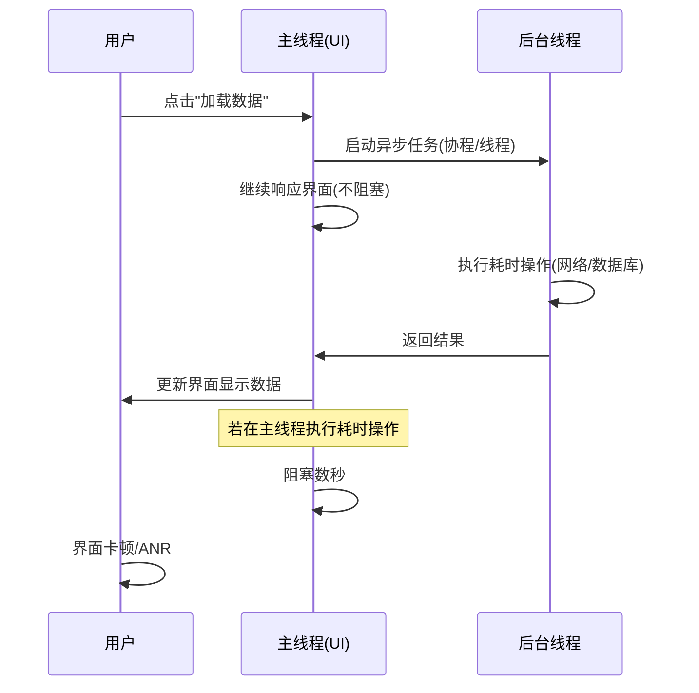
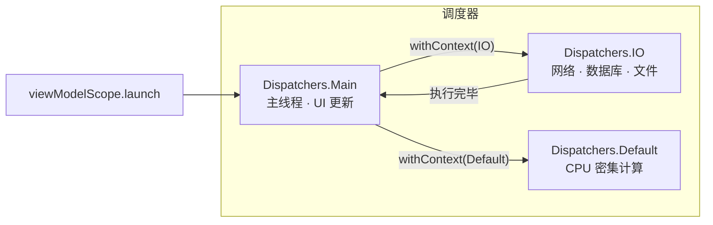
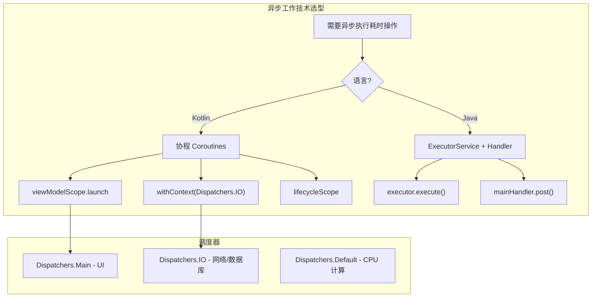

# 6.1.2 晨雾里的双线并行

晨雾还没散。

洛芙拉开帐篷的拉链，一股凉丝丝的空气涌进来。湖面静得像一面镜子，远处的山峦在薄雾里若隐若现。昨晚的篝火只剩下一堆灰白的余烬，偶尔有一两粒火星在风里闪一下。

她裹紧外套钻出去，看见希尔已经坐在防潮垫上，膝盖上摊着电脑，屏幕在晨光里泛着幽幽的蓝光。黛琳和伊莎在不远处的小溪边洗漱，水声哗哗地传过来。

"早啊。"希尔头也不抬，手指在键盘上敲着什么。

"早……"洛芙打了个哈欠，"你昨晚说的那个天气 App，我想试试。"

希尔停下敲击，抬起头。

"试什么？"

"就是——"洛芙蹲下来，指了指屏幕，"昨天黛琳说，App 在前台的时候，耗时的东西要放到后台线程去做。我想知道具体怎么放。"

希尔嘴角翘了一下。

"正好，黛琳和伊莎马上过来。我们今天就讲这个——**异步后台处理**。"

黛琳端着保温杯走过来，杯口冒着白雾。伊莎跟在她身后，头发还湿漉漉的，用毛巾擦着。

"昨天我们讲了后台任务的三大类别，"黛琳在篝火余烬旁坐下，"第一类异步工作，只说了个大概。今天把它讲透。"

洛芙点点头。昨晚的篝火夜话里，她记住了"协程"和"主线程"这两个词，但具体怎么用，脑子里还是一团雾。

"我先问个问题，"希尔把电脑转向大家，"你们觉得，为什么不能在主线程上做网络请求？"

洛芙想了想："因为……会卡住？"

"对，会卡住。"希尔打了个响指，"主线程是 Android 的 UI 线程。它要负责画界面、响应点击、处理滑动——所有你眼睛能看到、手指能摸到的，都是主线程在干活。"

伊莎把毛巾搭在椅背上，轻声补充："你想象一下，主线程就像营地唯一的那条小路。大家都得从这条路上走。如果有人在这条路上搬一块大石头——比如发一个要等五秒钟才能回来的网络请求——后面的人就全堵住了。"

"后面的人？"

"就是你的界面。"黛琳说，"点击没反应、列表滑不动、整个 App 像死了一样。超过几秒钟，系统还会弹出一个 ANR 对话框——Application Not Responding，应用无响应。"

洛芙倒吸一口凉气。

"所以耗时的操作，必须放到**别的线程**上去做。"黛琳在白板上画了两条平行的线，"主线程继续画界面，后台线程去发请求、读数据库、解析 JSON。两条线同时跑，互不干扰。这就是**异步**——不同步、不互相等。"



> 图 1：主线程与后台线程的协作时序。主线程将耗时任务派发给后台线程，自身保持响应；若在主线程执行耗时操作则导致阻塞。

洛芙盯着图看了一会儿。

"所以异步就是——主线程说'你去干活'，然后自己接着画界面，等后台干完了再回来更新？"

"对。"黛琳点头，"关键是**切换**。你得知道什么时候切到后台、什么时候切回主线程。"

"在 Kotlin 里，官方推荐用**协程**来做这件事。"希尔敲了几行代码。

```kotlin
// build.gradle 依赖：
// implementation("androidx.lifecycle:lifecycle-viewmodel-ktx:2.7.0")
// implementation("org.jetbrains.kotlinx:kotlinx-coroutines-android:1.7.3")

import androidx.lifecycle.ViewModel
import androidx.lifecycle.viewModelScope
import kotlinx.coroutines.Dispatchers
import kotlinx.coroutines.flow.MutableStateFlow
import kotlinx.coroutines.flow.StateFlow
import kotlinx.coroutines.flow.asStateFlow
import kotlinx.coroutines.launch
import kotlinx.coroutines.withContext

// 简化数据类，实际项目可替换为完整模型
data class WeatherData(val condition: String, val temp: Int)
sealed class UiState { object Loading : UiState(); data class Success(val data: WeatherData) : UiState(); data class Error(val message: String) : UiState() }

class WeatherViewModel : ViewModel() {

    private val _weatherState = MutableStateFlow<UiState>(UiState.Loading)
    val weatherState: StateFlow<UiState> = _weatherState.asStateFlow()

    fun loadWeather() {
        // viewModelScope 与 ViewModel 生命周期绑定，ViewModel 清除时自动取消所有协程
        viewModelScope.launch {
            _weatherState.value = UiState.Loading
            // withContext(Dispatchers.IO) 将耗时操作切换到 IO 线程池
            val data = withContext(Dispatchers.IO) {
                fetchWeatherFromNetwork()  // 模拟网络请求
            }
            // 回到 launch 默认的 Main 调度器，安全更新 UI
            _weatherState.value = UiState.Success(data)
        }
    }

    private suspend fun fetchWeatherFromNetwork(): WeatherData {
        // 实际项目中使用 Retrofit / OkHttp
        kotlinx.coroutines.delay(2000)
        return WeatherData("晴", 22)
    }
}
```

"注意几个点，"希尔指着屏幕，"第一，`viewModelScope.launch` 启动的协程，默认跑在**主线程**上。但 `launch` 里的代码是**挂起**的，不会阻塞——遇到 `withContext` 或 `delay` 这种挂起点，协程会暂停，把线程让给别人。"

"第二，`withContext(Dispatchers.IO)` 会切换到 IO 线程池。网络请求、数据库读写、文件操作，都应该放在这里。执行完后自动切回调用者的调度器——也就是 Main。"

"第三，`viewModelScope` 和 ViewModel 绑定。用户离开页面、ViewModel 被清除的时候，所有协程自动取消——不会泄漏、不会在后台瞎跑。"

洛芙歪着头："那如果我想直接让整个协程都在后台跑呢？"

"可以，"希尔又敲了一行，"`launch(Dispatchers.IO)` 就行。但更新 UI 的时候必须切回主线程，否则会崩溃。"

```kotlin
viewModelScope.launch(Dispatchers.IO) {
    val data = fetchWeatherFromNetwork()
    // 更新 UI 必须切回主线程
    withContext(Dispatchers.Main) {
        _weatherState.value = UiState.Success(data)
    }
}
```

"两种写法都可以。推荐第一种——`withContext` 更清晰，一眼能看出哪段是耗时操作。"

黛琳在白板上画了三个框：Main、IO、Default。

"Kotlin 协程有几种常用的**调度器**（Dispatcher）。`Dispatchers.Main` 跑在主线程，用于更新 UI。`Dispatchers.IO` 专门给网络、磁盘 I/O 用，线程池会按需扩容。`Dispatchers.Default` 适合 CPU 密集计算，比如排序、解析。选对调度器，系统才能高效调度。"



> 图 2：协程调度器切换流程。launch 默认在 Main，通过 withContext 切换到 IO 或 Default，执行完毕后自动返回。

伊莎把保温杯捧在手里，蒸汽在晨雾里慢慢散开。

"你想象一下，调度器就像营地里不同的工作台。主线程是前台——接待客人、展示成果。IO 是后厨——煮饭、洗菜。Default 是工具间——锯木头、打铁。该在哪儿干活就在哪儿，别在前台炒菜。"

洛芙"哦哦哦"了一声。

"那 Java 呢？"她忽然问，"如果项目是 Java 写的怎么办？"

"Java 用**线程**和 **ExecutorService**。"黛琳说，"协程是 Kotlin 的语法糖，底层也是线程池。Java 没有协程，就得直接操作线程。"

希尔切到一个 Java 文件：

```java
// Java 中的异步处理：ExecutorService + Handler
import java.util.concurrent.ExecutorService;
import java.util.concurrent.Executors;
import android.os.Handler;
import android.os.Looper;

public class WeatherRepository {
    // 建议在 Application 或单例中创建，避免重复创建线程池
    private final ExecutorService executor = Executors.newFixedThreadPool(4);
    private final Handler mainHandler = new Handler(Looper.getMainLooper());

    public void loadWeather(Consumer<WeatherData> callback) {
        executor.execute(() -> {
            // 后台线程：执行耗时操作
            WeatherData data = fetchWeatherFromNetwork();
            // 切回主线程更新 UI
            mainHandler.post(() -> callback.accept(data));
        });
    }

    private WeatherData fetchWeatherFromNetwork() {
        try {
            Thread.sleep(2000);
        } catch (InterruptedException e) {
            Thread.currentThread().interrupt();
        }
        return new WeatherData("晴", 22);
    }
}
```

"`ExecutorService` 管理线程池，`executor.execute()` 把任务丢到池子里。`Handler` 绑定主线程的 `Looper`，`mainHandler.post()` 把代码投递回主线程执行。"

"注意，"黛琳加了一句，"线程池最好**只创建一次**——在 Application 里或者用单例。每次网络请求都 `new` 一个线程池，会浪费资源，也容易泄漏。"

洛芙点点头，在笔记本上记了一笔。

"还有一个东西，你们可能在网上搜到过，"希尔的表情有点微妙，"**AsyncTask**。"

"AsyncTask 是什么？"

"以前 Android 官方用来做异步任务的类。`doInBackground` 里写耗时逻辑，`onPostExecute` 里更新 UI，看起来挺方便。"

"那为什么不用了？"

黛琳接过话头："因为从 Android 11（API 30）开始，**AsyncTask 已经被废弃**了。它有很多问题：容易造成 Context 泄漏、配置变化（比如旋转屏幕）时回调可能错乱、异常被吞掉不报错。Google 明确推荐用 `java.util.concurrent` 或 Kotlin 协程替代。"

希尔在搜索框里输入 "AsyncTask deprecated"，把官方文档的截图给大家看。

"所以如果你看到老代码里还有 AsyncTask，别学。用协程或 ExecutorService 重写。"

洛芙"嗯"了一声，在笔记本上写了三个字：别用 AsyncTask。

"接下来看一个**反模式**。"希尔把电脑转回来，"很多人刚学的时候会这么写。"

```kotlin
// ❌ 反模式：在主线程直接执行耗时操作
class BadWeatherActivity : AppCompatActivity() {
    override fun onCreate(savedInstanceState: Bundle?) {
        super.onCreate(savedInstanceState)
        setContentView(R.layout.activity_weather)

        // 直接在主线程调用阻塞式网络请求
        val data = fetchWeatherBlocking()
        updateUi(data)
    }

    private fun fetchWeatherBlocking(): WeatherData {
        Thread.sleep(5000)  // 主线程阻塞 5 秒！
        return WeatherData("晴", 22)
    }
}
```

"这段代码有什么问题？"希尔看向洛芙。

洛芙盯着屏幕，皱起眉："`fetchWeatherBlocking` 里有 `Thread.sleep(5000)`……而且是在 `onCreate` 里直接调用的？"

"对。`onCreate` 跑在主线程上。`Thread.sleep` 会让主线程**停五秒钟**。这五秒内，界面完全卡死，用户点什么都没反应。超过几秒，系统就会弹 ANR。"

"正确的写法呢？"

希尔把代码换成协程版本：

```kotlin
// ✅ 重构：使用协程将耗时操作移到后台
class GoodWeatherActivity : AppCompatActivity() {
    private val viewModel: WeatherViewModel by viewModels()

    override fun onCreate(savedInstanceState: Bundle?) {
        super.onCreate(savedInstanceState)
        setContentView(R.layout.activity_weather)

        // 通过 ViewModel 触发加载，内部使用 viewModelScope + withContext(IO)
        viewModel.loadWeather()
        lifecycleScope.launch {
            viewModel.weatherState.collect { state ->
                when (state) {
                    is UiState.Success -> updateUi(state.data)
                    is UiState.Loading -> showLoading()
                    is UiState.Error -> showError(state.message)
                }
            }
        }
    }
}
```

"把逻辑放到 ViewModel 里，用 `viewModelScope.launch` 和 `withContext(Dispatchers.IO)`。Activity 只负责展示和收集状态。这样主线程永远不会被阻塞。"

黛琳在白板上写了两行字：

> 主线程：只做 UI 相关的事。
> 耗时操作：一律切到 IO 或 Default。

"记住这两句，能避开绝大部分 ANR。"

晨雾散了一些。湖面上开始有细碎的波纹，不知道是风还是鱼。

伊莎站起来伸了个懒腰，头发在晨光里泛着淡淡的光泽。

"还有一个细节，"她说，"协程的**取消**。"

"取消？"

"如果用户点了'加载'，然后马上退出页面，你的网络请求可能还在跑。这时候应该取消它，省电省流量。"

"`viewModelScope` 会自动做这件事，"黛琳说，"ViewModel 被清除时，它启动的所有协程都会收到取消信号。但如果你用的是 `GlobalScope.launch`——"

"别用 `GlobalScope`。"希尔打断，"它和 Application 同生共死，不会跟着 ViewModel 取消。容易泄漏，也容易在用户已经离开页面后还在后台跑。始终用 `viewModelScope` 或 `lifecycleScope`。"

洛芙把这一点记在笔记本上，画了个星号。

"总结一下今天的内容。"黛琳把白板擦干净，重新画了一张图。

"**异步后台处理**的核心就三件事：第一，知道主线程不能做耗时操作；第二，用协程或 ExecutorService 把工作丢到后台；第三，结果回来的时候切回主线程更新 UI。"

"Kotlin 推荐协程 + `viewModelScope` + `withContext(Dispatchers.IO)`。Java 用 `ExecutorService` + `Handler`。AsyncTask 已废弃，不要用。"

洛芙合上笔记本，仰头看了看天。雾快散尽了，天空露出一片干净的蓝。

"好像……没有想象中那么复杂？"

希尔笑了一下："概念不复杂，难的是养成习惯。每次写网络请求、数据库操作之前，先问自己一句：这段会阻塞吗？会的话，就切出去。"

伊莎把毛巾叠好放进背包，回头看了一眼湖面。

"还有一点，"她说，"很多人一开始会纠结：到底用 `launch(Dispatchers.IO)` 还是 `withContext(Dispatchers.IO)`？"

洛芙竖起耳朵。

"两种都能把活丢到后台。区别在于，`withContext` 会**等**那块代码跑完，然后带着结果回来。`launch` 是 fire-and-forget，不等人。所以需要拿结果的——比如网络请求——用 `withContext`。不需要结果的——比如打个日志——用 `launch` 就行。"

黛琳点点头："对。`withContext` 是挂起函数，会暂停当前协程；`launch` 是启动新协程，不阻塞调用方。"

洛芙在笔记本上补了一行：要结果用 withContext，不要结果用 launch。

黛琳把白板笔收进口袋。

"明天我们讲任务调度——WorkManager 的深入用法。今天先把异步的肌肉练熟。"

风从湖面吹过来，带着水汽和松针的清香。一只山雀从树梢掠过，翅膀在晨光里闪了一下。洛芙深吸一口气，觉得脑子里的那团雾，好像也散了一些。

---

## 专业技术总结

### 核心机制定义

> **异步后台处理**（Asynchronous background processing）—— 在 Android 主线程之外执行耗时操作，避免阻塞 UI 线程导致卡顿或 ANR。Kotlin 推荐使用协程（Coroutines）配合 `viewModelScope` 和 `Dispatchers.IO`；Java 使用 `ExecutorService` 与 `Handler`。此类工作仅在 App 存活时运行，不跨进程或重启保留。

#### 结构图



#### 复杂度与影响

- 在主线程执行超过约 5 秒的阻塞操作会触发 ANR（Application Not Responding），导致系统弹窗提示用户强制关闭应用。
- 使用 `viewModelScope` 可自动管理协程生命周期，避免 ViewModel 清除后协程泄漏。
- `ExecutorService` 应单例复用，避免频繁创建线程池造成资源浪费。

#### 反模式与陷阱

1. **在主线程执行 `Thread.sleep` 或阻塞式网络请求** → 修复：使用 `withContext(Dispatchers.IO)` 或 `viewModelScope.launch(Dispatchers.IO)` 将耗时操作移到后台。
2. **使用 `GlobalScope.launch` 启动与界面相关的协程** → 修复：使用 `viewModelScope` 或 `lifecycleScope`，确保协程随生命周期自动取消。
3. **在 Java 中每次请求都 `new` 一个 `ExecutorService`** → 修复：在 Application 或单例中创建一次，全局复用。
4. **继续使用已废弃的 AsyncTask** → 修复：迁移到 Kotlin 协程或 `ExecutorService` + `Handler`。
5. **在后台线程直接更新 UI** → 修复：通过 `withContext(Dispatchers.Main)` 或 `mainHandler.post()` 切回主线程再更新。

#### 设计哲学：主线程神圣不可阻塞

Android 的 UI 是单线程模型，主线程负责所有界面渲染与用户交互。任何阻塞主线程的操作都会直接损害用户体验。异步设计的核心是**声明意图**：将"耗时操作"与"UI 更新"明确分离，通过调度器切换执行上下文，让主线程始终保持响应。

1. **默认假设**：所有耗时操作都会阻塞，除非显式切换到后台。
2. **作用域绑定**：协程必须与生命周期绑定（viewModelScope / lifecycleScope），避免泄漏。
3. **调度器选择**：IO 操作用 `Dispatchers.IO`，CPU 密集用 `Dispatchers.Default`，UI 更新用 `Dispatchers.Main`。
4. **废弃 API 不回头**：AsyncTask 已废弃，新代码一律使用协程或 ExecutorService。

---

#### 🏕️ 动手练习 —— 项目：「露营天气异步加载器」

> 构建一个简单的天气加载界面，实践 Kotlin 协程的完整流程：启动协程 → 切换 IO → 返回主线程更新 UI → 处理取消。

**Task 1：ViewModel + 协程加载天气** ★★

- **目标**：在 ViewModel 中使用 `viewModelScope.launch` 和 `withContext(Dispatchers.IO)` 模拟网络请求，将结果通过 StateFlow 暴露给 UI。
- **你需要做的事**：
  1. 创建 `WeatherViewModel`，添加 `implementation("androidx.lifecycle:lifecycle-viewmodel-ktx:2.7.0")` 和 `implementation("org.jetbrains.kotlinx:kotlinx-coroutines-android:1.7.3")` 依赖
  2. 在 ViewModel 中定义 `loadWeather()` 方法，内部使用 `viewModelScope.launch { withContext(Dispatchers.IO) { delay(2000); WeatherData(...) } }`
  3. 用 `MutableStateFlow<UiState>` 保存加载状态（Loading / Success / Error），在协程中更新
  4. 在 Activity/Fragment 中调用 `viewModel.loadWeather()`，用 `collectAsState()` 或 `observe` 展示状态
- **验收标准**：
  - [ ] 点击按钮后显示 Loading，约 2 秒后显示 Success
  - [ ] 使用 Android Studio 的 Profiler 或 Log 确认网络模拟在非主线程执行
  - [ ] 快速进入退出页面多次，无崩溃、无泄漏
- **提示**：`viewModelScope` 由 `lifecycle-viewmodel-ktx` 提供，无需手动创建。

**Task 2：对比主线程阻塞的 ANR 体验** ★★

- **目标**：故意在主线程执行 `Thread.sleep`，亲身体验 ANR，理解为何必须异步。
- **你需要做的事**：
  1. 新建一个临时按钮，点击后在主线程执行 `Thread.sleep(10000)`（10 秒）
  2. 运行 App，点击按钮，观察界面是否卡死、是否弹出 ANR 对话框
  3. 删除这段代码，恢复为 Task 1 的协程实现
  4. 在笔记中写一句话：为什么主线程不能做耗时操作？
- **验收标准**：
  - [ ] 能复现 ANR 或至少 5 秒以上的明显卡顿
  - [ ] 理解 ANR 的触发条件
- **提示**：仅用于学习，不要提交包含 `Thread.sleep` 的代码到版本库。

**Task 3：Java 版 ExecutorService + Handler** ★★★

- **目标**：用 Java 实现与 Task 1 等价的异步加载逻辑，理解 ExecutorService 与 Handler 的配合。
- **你需要做的事**：
  1. 创建 `WeatherRepository` 类，内部持有 `ExecutorService executor = Executors.newFixedThreadPool(4)` 和 `Handler mainHandler = new Handler(Looper.getMainLooper())`
  2. 实现 `loadWeather(Consumer<WeatherData> callback)`，在 `executor.execute` 中执行 `Thread.sleep(2000)`，在 `mainHandler.post` 中调用 callback
  3. 在 Activity 中调用 repository，在 callback 里更新 UI
  4. 确保线程池只创建一次（单例或依赖注入）
- **验收标准**：
  - [ ] 行为与 Task 1 的 Kotlin 版本一致
  - [ ] 无 "CalledFromWrongThreadException"
  - [ ] 线程池复用，不重复创建
- **提示**：`Consumer` 可用 `java.util.function.Consumer` 或自定义接口。

**Task 4：协程取消验证** ★★★

- **目标**：验证 `viewModelScope` 在 ViewModel 清除时自动取消协程，对比 `GlobalScope` 的泄漏风险。
- **你需要做的事**：
  1. 在 `loadWeather` 的 `withContext(Dispatchers.IO)` 块内，`delay` 之前加一行 `Log.d("Coroutine", "started")`，`delay` 之后加 `Log.d("Coroutine", "finished")`
  2. 启动加载后立即按返回键退出页面
  3. 观察 Logcat：应看到 "started"，但不应看到 "finished"（因为协程被取消）
  4. 若改用 `GlobalScope.launch` 重复实验，观察 "finished" 是否仍会打印（会，说明协程未被取消）
- **验收标准**：
  - [ ] viewModelScope 下，退出页面后 "finished" 不出现
  - [ ] 能解释 viewModelScope 与 GlobalScope 的差异
- **提示**：`delay` 是挂起点，取消时会在该处抛出 `CancellationException`。

**Task 5：Dispatchers 选择实验** ★★

- **目标**：体会 `Dispatchers.IO` 与 `Dispatchers.Default` 的适用场景。
- **你需要做的事**：
  1. 写一个 `computeHeavy()` 函数：循环 1000 万次做简单加法（模拟 CPU 密集）
  2. 分别用 `withContext(Dispatchers.IO)` 和 `withContext(Dispatchers.Default)` 调用，用 `System.currentTimeMillis()` 测量耗时
  3. 再写一个 `fetchFromNetwork()`：`delay(2000)` 模拟网络
  4. 分别用 IO 和 Default 调用，观察是否有明显差异
  5. 总结：IO 适合什么？Default 适合什么？
- **验收标准**：
  - [ ] 能正确使用两种 Dispatchers
  - [ ] 能用自己的话解释 IO 与 Default 的区别
- **提示**：官方建议 IO 用于 I/O 阻塞，Default 用于 CPU 计算。

**Task 6：重构 AsyncTask 老代码** ★★★

- **目标**：将一段假设的 AsyncTask 代码重构为协程版本，理解废弃原因。
- **你需要做的事**：
  1. 阅读官方文档对 AsyncTask 废弃的说明（Context 泄漏、配置变化问题）
  2. 假设有如下逻辑：在后台下载图片 URL，下载完成后在主线程显示到 ImageView
  3. 用 Kotlin 协程重写：`viewModelScope.launch` + `withContext(Dispatchers.IO)` + 使用 Coil/Glide 加载图片
  4. 对比 AsyncTask 的 `doInBackground` / `onPostExecute` 与协程的 `launch` / `withContext`，写出三点优势
- **验收标准**：
  - [ ] 协程版本功能等价
  - [ ] 能列举协程相比 AsyncTask 的至少 2 个优势
- **提示**：协程的结构化并发、自动取消、异常传播都是优势。

**Task 7：main-safe 的 suspend 函数** ★★★

- **目标**：编写可在主线程安全调用的 suspend 函数，内部自行切换调度器。
- **你需要做的事**：
  1. 创建一个 `suspend fun loadWeather(): WeatherData`，内部使用 `withContext(Dispatchers.IO) { ... }`
  2. 在 ViewModel 中直接 `viewModelScope.launch { val data = loadWeather(); ... }`，不显式指定 Dispatchers
  3. 理解 "main-safe" 的含义：从主线程调用不会阻塞主线程
  4. 对比：若 `loadWeather` 内部不用 `withContext`，直接 `Thread.sleep`，会怎样？
- **验收标准**：
  - [ ] loadWeather 可从主线程安全调用
  - [ ] 理解 main-safe 的设计原则
- **提示**：main-safe 的 suspend 函数把调度器选择封装在内部，调用方无需关心。

**Task 8：综合小应用 —— 露营清单异步加载** ★★★★

- **目标**：整合本章所学，实现一个露营清单 App：从"本地数据库"（模拟 Room）异步加载清单，支持下拉刷新，加载中显示进度条，错误时显示重试按钮。
- **你需要做的事**：
  1. 创建 `CampItem` 数据类和 `CampRepository`（内部用 `delay` 模拟数据库查询）
  2. ViewModel 中实现 `loadItems()` 和 `refresh()`，使用 `viewModelScope` + `withContext(Dispatchers.IO)`
  3. UI 展示 Loading / Success / Error 三种状态
  4. 快速进入退出页面，确认无泄漏
  5. 在加载过程中旋转屏幕，确认状态正确恢复（不重复请求、不崩溃）
- **验收标准**：
  - [ ] 加载、刷新、错误处理均正常
  - [ ] 旋转屏幕无异常
  - [ ] 无主线程阻塞、无泄漏
- **提示**：`MutableStateFlow` 或 `LiveData` 均可，确保在 Main 线程更新。

**面试热身**

- **Q1**：为什么不能在 Android 主线程执行耗时操作？ANR 是什么？
- **Q2**：Kotlin 协程中，`viewModelScope.launch` 默认运行在哪个线程？如何切换到 IO 线程？
- **Q3**：`viewModelScope` 和 `GlobalScope` 在生命周期管理上有什么不同？
- **Q4**：AsyncTask 为什么被废弃？推荐用什么替代？
- **Q5**：Java 中如何实现"后台执行 + 主线程更新 UI"？ExecutorService 和 Handler 分别负责什么？

#### 参考实现要点

1. **优先使用 Kotlin 协程**处理异步工作，配合 `viewModelScope` 和 `withContext(Dispatchers.IO)`，代码简洁且生命周期安全。
2. **主线程只做 UI 相关操作**，任何可能超过几十毫秒的逻辑都应移到后台。
3. **避免使用 AsyncTask 和 GlobalScope**，二者分别已废弃或易导致泄漏。
4. **ExecutorService 单例复用**，在 Application 或依赖注入容器中创建，避免重复创建线程池。
5. **suspend 函数设计为 main-safe**，在函数内部使用 `withContext` 切换调度器，调用方无需关心线程细节。

---

> 异步是 Android 开发的基石之一。建议从 `viewModelScope.launch` + `withContext(Dispatchers.IO)` 这个最小模式开始，养成习惯后再考虑更复杂的并发场景。主线程神圣不可阻塞——这句话值得贴在显示器旁边。

## 🍹洛芙的小小日记本

> 今天学会了把耗时的活丢到后台，让主线程专心画界面。黛琳说主线程就像营地唯一的小路，不能堵。用协程写起来比想象中简单，viewModelScope 还会自动帮忙取消，不用自己操心。明天继续学 WorkManager。

### 今日关键词

- **异步（Asynchronous）**：操作不阻塞当前线程，在后台执行，完成后通过回调或挂起恢复返回结果。与"同步"相对。
- **主线程（Main Thread / UI Thread）**：Android 中负责渲染界面和响应用户交互的线程。耗时操作不可在此执行，否则导致卡顿或 ANR。
- **ANR（Application Not Responding）**：应用无响应。当主线程被阻塞超过数秒时，系统弹出的对话框，用户可选择强制关闭应用。
- **协程（Coroutines）**：Kotlin 的轻量级并发框架，通过挂起函数实现非阻塞异步。在 Android 上常与 viewModelScope 配合使用。
- **viewModelScope**：Jetpack 为 ViewModel 提供的协程作用域。ViewModel 清除时，其启动的所有协程自动取消，防止泄漏。
- **lifecycleScope**：Jetpack 为 LifecycleOwner（Activity、Fragment）提供的协程作用域，同样具备生命周期绑定。
- **Dispatchers.Main**：协程调度器，将执行切换到主线程。用于更新 UI。
- **Dispatchers.IO**：协程调度器，将执行切换到 IO 线程池。适用于网络请求、数据库读写、文件操作。
- **Dispatchers.Default**：协程调度器，用于 CPU 密集计算，如排序、解析。
- **withContext**：协程构建器，临时切换到指定调度器执行代码块，执行完毕后恢复原调度器。
- **挂起函数（suspend function）**：可在协程中暂停执行的函数，使用 `suspend` 关键字声明。调用挂起函数不会阻塞线程。
- **ExecutorService**：Java 的线程池接口，用于管理多个线程的执行。常用 `Executors.newFixedThreadPool(n)` 创建。
- **Handler**：Android 用于在不同线程间投递消息的机制。`Handler(Looper.getMainLooper())` 可向主线程投递 Runnable。
- **Looper**：与线程关联的消息循环，主线程的 Looper 由系统创建。Handler 通过 Looper 将消息投递到对应线程。
- **AsyncTask**：Android 早期提供的异步任务类，已在 API 30 废弃。存在 Context 泄漏、配置变化问题等缺陷，推荐用协程或 ExecutorService 替代。
- **main-safe**：指可从主线程安全调用的函数。suspend 函数若在内部使用 `withContext` 切换耗时操作到后台，则对调用方而言是 main-safe 的。
- **结构化并发（Structured Concurrency）**：协程的设计理念，子协程的生命周期受父作用域约束，取消可传播，避免孤儿协程。
