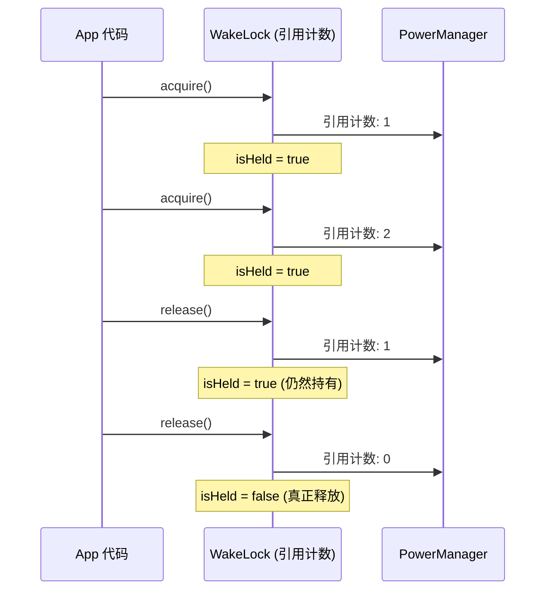

# 6.1.20 释放唤醒锁

深夜的白马岳山脚下，气温比傍晚又降了几度。帐篷里四个人缩在各自的睡袋边缘，呼出的气息在冷空气中凝成了淡淡的白雾。希尔把卫衣的帽子拉起来裹住脑袋，只露出一双眼睛，活像一只从森林里钻出来的小猫。

"电量没降。"洛芙的声音闷闷的，带着一点沮丧。

黛琳把白板笔放下，转过身来看她："什么电量没降？"

"我们刚才不是优化了一堆 SensorManager 的注册和取消注册嘛，"洛芙把手机屏幕转过来给黛琳看，"我跑了半小时的测试，电量消耗曲线跟优化之前几乎一模一样。你看，这里——"

屏幕上显示着一个电量监控 App 的曲线图，红色的线条几乎走成了一条直线。

"奇怪。"希尔凑过来看了一眼，眉头皱了起来，"不应该啊，我们明明把那个加速度传感器的 registerListener 改成了在 onPause 里 unregister，理论上 SensorService 那部分的耗电应该消失才对。"

伊莎把脑袋从睡袋里探出来，发丝乱糟糟的，像一只刚从窝里钻出来的小麻雀。她眨了眨眼睛，轻声问："会不会是……我们漏了什么？"

帐篷里安静了两秒。

然后黛琳重新打开笔记本电脑，手指在键盘上飞快地敲了几下，调出了一个完整的 WakeLock 日志页面。

"来看看 dumpsys，"她说，"把所有活跃的 WakeLock 全部列出来。"

```bash
adb shell dumpsys power
```

终端刷出一长串输出。黛琳往回滚了几行，指着屏幕上的一行：

```
Wake Locks: size=4
  PARTIAL_WAKE_LOCK   'CampingApp::SyncWakeLock' (uid=10042)
  PARTIAL_WAKE_LOCK   'CampingApp::DownloadLock' (uid=10042)
  PARTIAL_WAKE_LOCK   'SensorService:*' (uid=1000)
  PARTIAL_WAKE_LOCK   'LocationManagerService' (uid=10018)
```

"看这里，"黛琳指着前两行，"'CampingApp::SyncWakeLock' 和 'CampingApp::DownloadLock'——这两个是我们自己的代码里写的 WakeLock。它们还在持有中。"

"而且是 'size=4'，"希尔凑近屏幕看，"四个 WakeLock，其中两个是系统的，两个是我们自己的。我们刚才只优化了 SensorManager 那个，但忘了优化自己代码里的这两个——它们一直在持有，从来没有被释放过。"

洛芙倒吸一口冷气："也就是说……我们自己的代码里，有两个 WakeLock 拿了之后就没放？"

"没错。"黛琳合上笔记本，眼神认真地看着洛芙，"这就是我们今天要解决的问题——释放唤醒锁。"

---

帐篷外，一阵冷风从帐篷的透气窗钻进来，吹得充电灯的火苗晃了晃。希尔伸手把窗户关紧了一点，转身回来盘腿坐在睡袋上，两只手抱在胸前，一副"准备听课"的认真模样。

"释放 WakeLock，"黛琳拿起白板笔，在白板上写下两个字——"释放"，"这一步和获取一样重要，甚至更重要。你拿了东西，用完了不还，那就是偷电。"

"WakeLock 更是这样，"伊莎从睡袋里伸出一只手，在空中比划了一下，"你一旦 acquire() 了，系统就以为你需要它醒着。它会一直乖乖地醒着，直到你亲口说'可以睡了'。你不说，它就永远等着。"

"那怎么让它'说'呢？"洛芙问。

"调用 release()。"

黛琳在白板上又写下了三个字母——"release()"，字迹清秀但有力。

"当你的 App 不再需要设备保持唤醒状态时，你就应该调用 WakeLock 对象的 release() 方法，把锁还回去。调用之后，系统就知道'哦，App 不用了'，然后 CPU 就可以安心睡觉了。"

希尔从地上捡起一块小石子，在帐篷中间的地垫上随手画了一个简单的示意图——两个框，中间一根线连着。

"就像借东西，"希尔说，"你从系统那里借了一个'保持清醒'的许可证，用完了得还回去。你不还，下次想再借就借不到了——而且系统会一直以为你还在用，那它就一直给你留着。"

---

"来看最基础的代码，"黛琳把笔记本打开，屏幕上显示着一段简单的 Kotlin 代码，"这是 acquire 和 release 的基本写法。"

```kotlin
// 获取 WakeLock
val powerManager = getSystemService(Context.POWER_SERVICE) as PowerManager
val wakeLock = powerManager.newWakeLock(
    PowerManager.PARTIAL_WAKE_LOCK,
    "CampingApp::MyWakeLock"
)

// 开始需要保持 CPU 唤醒的工作
wakeLock.acquire()

try {
    //执行业务逻辑，比如下载营地地图数据
    downloadCampsiteData()
} finally {
    //工作完成后，无论是否发生异常，都必须释放锁
    wakeLock.release()
}
```

"看到了吗？"黛琳指着代码里的 try-finally 块，"这里是关键。"

"try-finally……"洛芙念叨着这两个词，"我知道 finally 块里的代码是无论如何都会执行的，对吧？"

"对。"黛琳点头，"所以不管 downloadCampsiteData() 是正常执行完了，还是中途抛出了异常——finally 块里的 wakeLock.release() 都一定会被执行。这就是为什么我们**强烈推荐**把 release() 放在 finally 块里。"

希尔接过话头，语速快了起来："如果你不放在 finally 里，而是放在 try 的最后一行——万一中间出了异常，代码就跳过了 release()，你的锁就再也放不掉了。"

"就像……"伊莎想了想，打了个比方，"就像露营的时候，你答应守夜到十二点。结果你中途睡着了，没设闹钟，睡到了第二天早上。那整个后半夜，营地都是没人守着的。"

"不对，"希尔摇摇头，"应该说——整个后半夜，系统都会以为你在守着，所以它自己也不睡觉，一直陪你耗着。"

"那也太亏了。"洛芙小声说。

"所以 finally 是必须的。"黛琳重复了一遍，"永远、永远把 release() 放在 finally 块里。"

---

"不过，"洛芙举起手，"我有个问题——这里用了 try-finally，但是 acquire() 在 try 外面。这不会有问题吗？"

"问得好。"黛琳的眼神里闪过一丝赞许，"你注意到了一个很细节的地方。"

她把代码稍微调整了一下：

```kotlin
// 调整后的写法：acquire() 也放进 try 里
val powerManager = getSystemService(Context.POWER_SERVICE) as PowerManager
val wakeLock = powerManager.newWakeLock(
    PowerManager.PARTIAL_WAKE_LOCK,
    "CampingApp::MyWakeLock"
)

var acquired = false
try {
    wakeLock.acquire()  // 获取锁
    acquired = true
    
    //执行业务逻辑
    downloadCampsiteData()
} finally {
    //只有成功获取了锁，才需要释放
    if (acquired) {
        wakeLock.release()
    }
}
```

"为什么要这样？"洛芙问。

"因为 acquire() 本身是有可能失败的。"黛琳解释道，"比如系统电量已经严重不足，或者你的 App 已经申请了太多 WakeLock——系统会拒绝你的请求，acquire() 会返回 false 而不是正常拿到锁。"

"在这种情况下，"希尔补充，"如果你不判断返回值就直接调用 release()，就会抛出 IllegalStateException——因为你在对一个'没拿到的锁'说'放开'。"

"那就会崩溃。"洛芙恍然大悟。

"没错。所以我们在 finally 里先检查一下 acquired 标志位，只有真的拿到锁了才去释放——这样最安全。"

希尔从背包里掏出一个小本子，翻到了某一页，上面密密麻麻写着代码。她把本子摊开放在膝盖上：

```kotlin
// 完整的安全释放模式
class CampsiteRepository {

    private var wakeLock: PowerManager.WakeLock? = null
    private var isAcquired = false

    fun downloadCampsiteData() {
        val powerManager = 
            context.getSystemService(Context.POWER_SERVICE) as PowerManager
        
        wakeLock = powerManager.newWakeLock(
            PowerManager.PARTIAL_WAKE_LOCK,
            "CampingApp::DownloadLock"
        )

        try {
            //尝试获取锁
            isAcquired = wakeLock?.acquire(10 * 60 * 1000L) ?: false  
            // 参数：超时时间 10 分钟
            
            if (isAcquired) {
                //开始下载
                performDownload()
            } else {
                //获取失败，记录日志，不崩溃
                Log.w("CampsiteRepo", "无法获取WakeLock，下载可能被中断")
            }
        } finally {
            //无论是否获取成功，无论是否发生异常，都要执行释放
            if (isAcquired) {
                try {
                    wakeLock?.release()
                } catch (e: Exception) {
                    Log.e("CampsiteRepo", "释放WakeLock时出错", e)
                }
            }
        }
    }

    private fun performDownload() {
        // 实际的下载逻辑
    }
}
```

"这段代码稍微长一点，但每一步都有保护。"希尔指着屏幕，"第一，acquire() 的时候传了一个超时时间——这里设的是 10 分钟。第二，acquire() 的返回值我们存进了 isAcquired 标志位。第三，finally 块里先检查标志位，再释放。第四，release() 也包在了 try-catch 里，防止释放本身出错。"

洛芙看着这段代码，眉头微微皱起："可是学姐……这样会不会有点太复杂了？每一次下载都要写这么一大段？"

"问得好。"希尔笑了笑，"实际开发中，你可以把这些重复的逻辑封装成一个工具类或者扩展函数，就不用每次都写这么多行。但理解每一行的含义很重要——这样你才能知道自己的代码在做什么，系统在帮你做什么。"

---

"等一下，"洛芙突然想起什么，"刚才那个超时参数是什么？10 * 60 * 1000L……这是 10 分钟？"

"对。"黛琳点头，"acquire() 有一个带超时参数的重载版本。传进去之后，系统会自动在指定时间到达后帮你释放锁——就算你的代码忘记调用 release()，系统也会兜底。"

"那不就高枕无忧了吗？"洛芙说，"反正有超时保护……"

"不不不，"希尔摇摇手指，"超时保护是最后的保险，不是让你偷懒的理由。"

她从洛芙手里接过白板笔，在白板上画了一条时间线：

"想象一下——你的 App 在后台下载一个大文件。你设置了 10 分钟超时。文件其实 3 分钟就下完了，但是你的代码里有 bug，忘记调用 release()。剩下的 7 分钟，系统会一直让 CPU 跑着，等超时才释放。"

"这 7 分钟就是纯粹的浪费。"黛琳说，"而且这 7 分钟里，用户的手机会发烫，电量会以肉眼可见的速度往下掉。用户会想：'这个破 App 在干嘛？后台跑个下载怎么这么费电？'"

"超时保护的作用是防止你忘记释放时锁一直持有太久，"伊莎轻声说，"但它不能代替你及时释放。用完了马上就放，这才是最省电的方式。"

"所以正确的态度是——"黛琳一字一顿，"把超时当作'万一忘记释放的最后防线'，而不是'我不用管释放的借口'。"

---

"那我还有个问题，"洛芙举起手，"之前 6.1.18 我们说 WakeLock 可以多次 acquire()——那每次 acquire() 之后，是不是也要每次都 release() 一次？"

"对，而且这个非常重要。"黛琳的表情变得严肃起来。

她拿起白板笔，在白板上画了一个简单的计数示意图：



图 1：WakeLock 的引用计数机制。每次调用 acquire()，内部的引用计数就加一；每次调用 release()，计数减一。只有当引用计数归零时，WakeLock 才会真正释放，CPU 才能进入休眠状态。

"WakeLock 支持引用计数，"黛琳指着图说，"这是它的设计特性。简单来说——你可以对同一个 WakeLock 对象多次调用 acquire()，系统会记录'你借了几次'。你必须同样调用多次 release()，才能把所有锁都还回去。"

"只调用一次 release() 是不够的？"洛芙问。

"不够。"黛琳摇头，"你看图里，第二次 acquire() 之后，引用计数变成 2。第一次 release() 之后，计数变成 1——这时候 WakeLock 仍然在持有中，因为还有一次'借'没有还。只有第二次 release() 之后，计数变成 0，锁才真正释放。"

希尔在旁边补充了一个实际的代码例子：

```kotlin
// 多次 acquire() 的正确和错误写法
val wakeLock = powerManager.newWakeLock(
    PowerManager.PARTIAL_WAKE_LOCK,
    "CampingApp::SyncLock"
)

// 错误写法：只 release() 一次
wakeLock.acquire()  // 计数 = 1
wakeLock.acquire()  // 计数 = 2
// ... 做了一些事 ...
wakeLock.release()  // 计数 = 1，但锁仍在持有！
// → CPU 永远不会真正释放

// 正确写法：成对出现
wakeLock.acquire()  // 计数 = 1
// 做第一件事
wakeLock.release()  // 计数 = 0，锁释放

wakeLock.acquire()  // 计数 = 1，重新获取
// 做第二件事
wakeLock.release()  // 计数 = 0，锁释放
```

"或者，如果你一定要多次 acquire()，"希尔在白板上又画了一种模式，"那就用引用计数的特性——不要在中间释放，只在最后一次性释放："

```kotlin
// 利用引用计数特性的写法
wakeLock.acquire()  // 计数 = 1
performTaskOne()     // 任务一

wakeLock.acquire()   // 计数 = 2（锁已被持有，不会真的重新睡眠）
performTaskTwo()     // 任务二（整个过程中 CPU 保持唤醒）

// 两次任务都完成了，一次性释放
wakeLock.release()   // 计数 = 1（还在）
wakeLock.release()   // 计数 = 0（真正释放）
```

"这样写的好处是，"黛琳解释道，"两个任务之间 CPU 不用反复醒来又睡下，可以一口气全做完再释放。但坏处是——你必须非常清楚自己在做什么，不能弄混了 acquire 和 release 的次数。"

"新手很容易在这里翻车。"希尔耸耸肩，"数错次数是常有的事。所以如果不是非常必要，我建议不要嵌套多次 acquire()，就一次 acquire() 对应一次 release()，简单明了。"

---

"那有没有办法检查锁的状态？"洛芙问，"比如我写了一段代码，想知道这个锁现在是不是还拿着？"

"有。"黛琳点头，"WakeLock 对象有一个 isHeld() 方法，返回 true 表示锁在持有中，false 表示已经释放。"

```kotlin
// 检查锁状态
if (wakeLock.isHeld) {
    Log.d("CampsiteApp", "WakeLock 仍在持有中，需要释放")
    wakeLock.release()
} else {
    Log.d("CampsiteApp", "WakeLock 已经释放，无需操作")
}
```

"但是，"黛琳强调，"isHeld() 主要用于调试和日志记录，不建议依赖它来做'要不要释放'的判断——因为这个检查本身不是原子操作，在你检查完之后、release() 之前，可能有其他线程已经把锁状态改了。"

"更好的做法是，"希尔接话，"在写代码的时候就确定好 acquire 和 release 的配对关系，用 finally 块保证一定会执行，而不是运行时再去检查。"

"那 release() 本身会抛出异常吗？"洛芙问。

"会的。"黛琳点头，"如果你对一个已经被释放的锁再调用 release()，会抛出 IllegalStateException。所以刚才希尔把 release() 包在 try-catch 里是有道理的。"

---

帐篷外的风似乎更大了，帐篷的布料被吹得微微鼓起来，发出"噗噗"的声音。希尔站起身走到帐篷角落，从背包里翻出了一双厚厚的羊毛袜子，一边套上一边说："还有一种情况——你的 WakeLock 是绑定在某个生命周期上的。比如你在 Activity 的 onCreate 里 acquire()，那你就应该在 onDestroy 里 release()。但问题是，Activity 有时候不会正常走完 onDestroy——比如被系统杀死。"

"那锁不就泄漏了吗？"洛芙紧张地问。

"对。"黛琳说，"这就是为什么我们说，最好把 WakeLock 的持有和释放放在同一个作用域里，用 try-finally 框住。Activity 可能在任何时候被杀死，但 try-finally 能保证，只要你还在这个方法里，锁就一定会被正确释放。"

"不过，"伊莎轻声说，"对于 Activity 来说，其实有更优雅的方式——用 onPause() 和 onResume() 来管理，而不是依赖 onDestroy()。因为 onDestroy() 不一定被调用，但 onPause() 和 onResume() 是一定会配对出现的。"

"这就要引入另一个话题了——WakeLock 和生命周期的配合。"黛琳看了看时间，"我们明天专门讲这个，今晚先把基础的 release() 讲透。"

---

"来，我们来看一下我们自己的代码里那两个锁，"黛琳重新打开笔记本电脑，调出了一段代码，"看看它们为什么没有被释放。"

屏幕上是洛芙之前写的营地数据同步模块：

```kotlin
// ❌ 反模式：acquire() 在方法里，但没有任何 release()
class CampsiteSyncManager(private val context: Context) {

    private val powerManager = 
        context.getSystemService(Context.POWER_SERVICE) as PowerManager
    private lateinit var syncLock: PowerManager.WakeLock

    fun startSync() {
        syncLock = powerManager.newWakeLock(
            PowerManager.PARTIAL_WAKE_LOCK,
            "CampingApp::SyncWakeLock"
        )
        
        syncLock.acquire()  // 获取锁
        // 开始同步营地数据...
        performSync()
        
        // ❌ 方法结束了，但没有 release()！
        // 如果 performSync() 抛异常，锁更是永远不会释放
    }

    private fun performSync() {
        // 同步逻辑
        // ...
    }
}
```

"问题很明显了，"希尔指着代码，"startSync() 方法里 acquire() 了锁，但是方法结束的时候没有任何 release()。而且因为没有 try-finally，如果 performSync() 抛异常，锁就彻底泄漏了。"

"怎么修？"洛芙问。

"很简单，加上 try-finally 和 release()，"黛琳说，"我帮你重写一下——"

```kotlin
// ✅ 正确模式：acquire() 在 try 外，release() 在 finally 里
class CampsiteSyncManager(private val context: Context) {

    private val powerManager = 
        context.getSystemService(Context.POWER_SERVICE) as PowerManager
    private var syncLock: PowerManager.WakeLock? = null

    fun startSync() {
        syncLock = powerManager.newWakeLock(
            PowerManager.PARTIAL_WAKE_LOCK,
            "CampingApp::SyncWakeLock"
        )

        var acquired = false
        try {
            acquired = syncLock?.acquire() ?: false
            if (acquired) {
                performSync()
            }
        } finally {
            if (acquired) {
                try {
                    syncLock?.release()
                } catch (e: Exception) {
                    Log.e("CampsiteSync", "释放WakeLock失败", e)
                }
            }
        }
    }

    private fun performSync() {
        // 同步逻辑
    }
}
```

"还有另一个锁，"希尔翻到了另一页代码，"这个是下载用的——"

```kotlin
// ❌ 反模式：超时了但代码仍然没有主动 release()
class CampsiteDownloader(private val context: Context) {

    private val powerManager = 
        context.getSystemService(Context.POWER_SERVICE) as PowerManager
    private var downloadLock: PowerManager.WakeLock? = null

    fun downloadMap(tileId: String) {
        downloadLock = powerManager.newWakeLock(
            PowerManager.PARTIAL_WAKE_LOCK,
            "CampingApp::DownloadLock"
        )

        // 设置 5 分钟超时
        downloadLock?.acquire(5 * 60 * 1000L)
        
        // 下载地图瓦片
        downloadTile(tileId)
        
        // ❌ 没有主动 release()！完全依赖超时来释放
        // 5 分钟内如果提前下载完了，多余的时间就浪费了
    }

    private fun downloadTile(tileId: String) {
        // 下载逻辑
    }
}
```

"这里用了超时版本的 acquire()，"黛琳指着代码，"所以即使没有主动 release()，5 分钟后系统也会帮你释放。但问题是——如果瓦片 30 秒就下完了，你还要让 CPU 多跑 4 分 30 秒？"

"这就回到了我们之前说的——超时是保险，不是偷懒的理由。"希尔说，"不管有没有超时，用完了就立即 release()。"

```kotlin
// ✅ 正确模式：即使设置了超时，也要主动释放
class CampsiteDownloader(private val context: Context) {

    private val powerManager = 
        context.getSystemService(Context.POWER_SERVICE) as PowerManager
    private var downloadLock: PowerManager.WakeLock? = null

    fun downloadMap(tileId: String) {
        downloadLock = powerManager.newWakeLock(
            PowerManager.PARTIAL_WAKE_LOCK,
            "CampingApp::DownloadLock"
        )

        var downloadSucceeded = false
        try {
            // 设置超时作为兜底保护（万一下载过程卡死）
            downloadLock?.acquire(5 * 60 * 1000L)
            
            downloadTile(tileId)
            downloadSucceeded = true
        } finally {
            // 无论下载成功还是失败，都要立即释放
            if (downloadSucceeded) {
                // 如果真的下载完了，立即释放，不用等超时
                try {
                    downloadLock?.release()
                } catch (e: Exception) {
                    Log.e("Downloader", "释放WakeLock失败", e)
                }
            }
            // 如果 downloadSucceeded 为 false，说明下载过程中出了异常
            // 此时系统会在超时后自动释放，但同时也记录了异常日志
            Log.d("Downloader", "下载${if (downloadSucceeded) "成功" else "失败"}，WakeLock 将被释放")
        }
    }

    private fun downloadTile(tileId: String) {
        // 下载逻辑
    }
}
```

洛芙认真地看着这两段重构前后的代码对比，在小本子上飞快地记着笔记。

---

"好了，"黛琳站起身伸了个懒腰，骨节发出轻微的"咔咔"声，"我们今天的重点就讲完了。来总结一下——"

她拿起白板笔，在白板上画了一个简单的检查清单：

"第一，release() 是必须调用的。不管你的代码是正常执行完还是抛了异常，WakeLock 都不能留在手里。"

"第二，用 try-finally 包裹你的业务逻辑，把 release() 放在 finally 块里——这是最安全、最不容易出错的方式。"

"第三，每次 acquire() 都要对应一次 release()。如果你调用了两次 acquire()，就要调用两次 release()。引用计数必须清零，锁才会真正释放。"

"第四，超时参数是兜底保护，不是偷懒的借口。用完了就立即释放，不要等超时。"

"第五，release() 本身可能抛出异常，所以最好包在 try-catch 里。"

伊莎从睡袋里拿出一个小毯子，披在自己肩膀上，轻声补充："还有第六——在你写代码的时候，就要想清楚'在哪里释放'。最好让 acquire 和 release 在同一个方法里，或者在同一个生命周期回调里配对出现。不要让你的锁持有时间超过必要的长度。"

"这就是释放唤醒锁的全部秘密了。"黛琳放下白板笔，嘴角露出一丝笑意。

---

希尔把笔记本电脑合上，帐篷里一下子暗了下来，只剩下充电灯的微弱光芒。洛芙把手机屏幕点亮，看了看时间——已经快凌晨十二点了。

"我们明天还要早起去骑自行车呢，"伊莎打了个哈欠，"差不多该睡了。"

希尔把卫衣的帽子拉下来蒙住脸，声音闷闷地说："今晚学的这些……我回去要好好检查一下自己的代码，那些锁肯定有一半没释放。"

"有一半？"洛芙惊讶地看着她。

"可能还不止。"希尔翻了个身，背对着大家，"上次我看自己写的那个后台音乐播放器，release() 全都写错位置了，播放器退出之后音频服务还在跑，WakeLock 拿了一整夜都不知道……"

"那也太亏了。"洛芙小声说。

"所以 WakeLock 的 release 比 acquire 更重要，"黛琳的声音从她的睡袋里传出来，闷闷的但很清晰，"拿东西不难，还东西才难。而且你还东西的时候，系统会知道你'用完了'，电量才能真正省下来。"

帐篷外的风渐渐小了。远处白马岳的山脊上，月光洒在铺了一层薄霜的草地上，把整个营地照得像铺了一层银色的纱。帐篷里四个人各自缩进睡袋，呼吸声渐渐变得平稳。

洛芙闭上眼睛，脑子里还在回放今晚学到的东西：release() 要放在 finally 里，acquire() 和 release() 要成对出现，超时只是兜底不是借口……

想着想着，她的意识慢慢模糊了，沉进了长野县秋夜的宁静里。

---

## 专业技术总结

> **WakeLock 释放（Release a Wake Lock）** — 当应用不再需要设备保持唤醒状态时，通过调用 WakeLock 对象的 release() 方法将锁归还给系统。正确释放 WakeLock 是保证设备电量正常、避免后台耗电的关键步骤。

#### 结构图

```mermaid
flowchart TD
    subgraph "正确释放流程"
        A[acquire WakeLock] --> B{业务逻辑执行中}
        B -->|成功| C[try 块正常结束]
        B -->|异常| D[catch 块处理异常]
        C --> E[finally 块执行 release()]
        D --> E
        E --> F[WakeLock 引用计数 -1]
        F --> G{引用计数 == 0?}
        G -->|是| H[CPU 进入休眠]
        G -->|否| I[WakeLock 仍在持有，继续保持 CPU 唤醒]
    end

    subgraph "错误释放流程"
        J[acquire WakeLock] --> K[业务逻辑执行中]
        K --> L[没有 finally 块]
        L --> M[方法结束前忘记 release()]
        M --> N[抛出异常]
        N --> O[代码中断，release() 被跳过]
        O --> P[WakeLock 永远持有 → 电量持续流失 → 可能引发崩溃]
    end

    style H fill:#90EE90
    style P fill:#FFB6C1
```

#### 复杂度与影响

释放 WakeLock 的性能开销几乎为零（仅是引用计数的一次递减和一次系统调用），但不释放的代价极高——CPU 持续唤醒会导致设备发烫、电量骤降，用户体验严重受损。

#### 反模式与陷阱

1. **acquire() 后不 release()**：最常见的错误，导致 WakeLock 永久泄漏。修复：在 finally 块中调用 release()。
2. **引用计数不匹配**：多次 acquire() 但只 release() 一次，锁仍然持有。修复：确保 acquire() 和 release() 调用次数完全相等。
3. **对未持有的锁调用 release()**：会抛出 IllegalStateException。修复：使用 try-catch 包裹 release()，或先检查 isHeld() 状态。
4. **依赖超时代替主动释放**：超时只是兜底机制，不及时释放会导致不必要的电量浪费。修复：业务完成后立即 release()，超时仅作为防止泄漏的保险。
5. **在非 UI 线程持有 WakeLock 后直接退出**：如果后台线程 acquire() 了锁但线程在释放前就退出了，锁将永久持有。修复：使用带超时的 acquire()，并确保线程生命周期覆盖锁的持有期。

#### 设计哲学

**"谁借用，谁归还"原则**：WakeLock 代表了对系统资源的临时借用。acquire() 是借，release() 是还。良好的编程习惯要求：借和还在同一个作用域内配对出现，用 finally 块保证必定归还。超时机制是系统为健壮性提供的最后防线，但不应取代程序员的主动管理。

#### 🏕️ 动手练习

**方式 B：独立练习制**

**项目概览**：实现一个"露营数据同步器"，包含 WakeLock 的正确获取和释放逻辑。

**Task 1** ★
**目标**：理解 WakeLock 对象的创建和 acquire/release 基本流程。

**你需要做的事**：
1. 在 Android Studio 中创建新项目（或使用现有项目），在 MainActivity 中添加一个按钮"开始同步"。
2. 在按钮点击事件中，获取 PARTIAL_WAKE_LOCK，调用 acquire() 持有一段时间（比如 3 秒），然后调用 release() 释放。
3. 使用 `adb shell dumpsys power` 验证锁在持有期间出现，在释放后消失。

**验收标准**：
- [ ] 能看到"开始同步"按钮并点击
- [ ] 点击后 3 秒内 dumpsys power 能看到 WakeLock
- [ ] 3 秒后再次执行 dumpsys power，WakeLock 不再出现
- [ ] 点击按钮后 App 没有崩溃

**提示**：
```kotlin
val powerManager = getSystemService(Context.POWER_SERVICE) as PowerManager
val wakeLock = powerManager.newWakeLock(
    PowerManager.PARTIAL_WAKE_LOCK,
    "MyApp::BasicLock"
)
findViewById<Button>(R.id.btn_sync).setOnClickListener {
    wakeLock.acquire()
    // 模拟同步工作
    Handler(Looper.getMainLooper()).postDelayed({
        wakeLock.release()
    }, 3000)
}
```

**Task 2** ★★
**目标**：掌握 try-finally 模式，确保异常情况下也能释放 WakeLock。

**你需要做的事**：
1. 在 Task 1 的基础上，将同步逻辑包在 try-finally 中，确保即使同步抛出异常也能释放锁。
2. 故意在 try 块中抛出一个 RuntimeException，验证 finally 块中的 release() 仍然执行。
3. 用 Logcat 输出"锁已释放"的日志来验证。

**验收标准**：
- [ ] try-finally 结构正确：acquire() 在 try 外，release() 在 finally 中
- [ ] 注入异常后 App 不崩溃
- [ ] Logcat 中能看到"锁已释放"的日志
- [ ] 异常发生后 dumpsys power 确认锁已释放

**提示**：
```kotlin
var acquired = false
try {
    acquired = wakeLock.acquire()
    // 模拟可能抛出异常的操作
    throw RuntimeException("同步失败")
} finally {
    if (acquired) {
        Log.d("WakeLock", "锁已释放")
        wakeLock.release()
    }
}
```

**Task 3** ★★★
**目标**：实现带超时的 acquire() 并比较"主动释放"与"超时自动释放"的电量消耗差异。

**你需要做的事**：
1. 实现一个 performExpensiveTask() 方法，用 Thread.sleep(500) 模拟 0.5 秒的工作。
2. 分别测试两种模式：
   - 模式 A：acquire(10000L) 但不用 release()，等 10 秒超时自动释放
   - 模式 B：acquire(10000L) 后立即执行完任务，然后主动 release()
3. 用 Battery Historian 或 adb dumpsys batterystats 对比两种模式的电量消耗（或通过观察手机温度和电量曲线）。

**验收标准**：
- [ ] 模式 A 和模式 B 都能正确持有和释放锁
- [ ] 能观察到模式 A 的锁持有时间明显更长
- [ ] 模式 B 的任务完成后立即释放，没有等待超时
- [ ] 提交一份简短的比较报告（100 字以内）

**提示**：
```kotlin
// 模式 A：不主动释放
wakeLock.acquire(10000L)  // 10 秒超时
performExpensiveTask()    // 假设 0.5 秒就完成了
// 没有 release()，等系统超时

// 模式 B：主动释放
wakeLock.acquire(10000L)  // 仍然设置超时作为保险
performExpensiveTask()    // 0.5 秒完成
wakeLock.release()        // 立即主动释放
```

**Task 4** ★★★★
**目标**：测试引用计数——多次 acquire() 必须多次 release()。

**你需要做的事**：
1. 在代码中对同一个 WakeLock 对象连续调用两次 acquire()。
2. 第一次 release() 后，用 isHeld() 检查锁是否仍在持有。
3. 第二次 release() 后，再次检查 isHeld()。
4. 观察第一次 release() 后，dumpsys power 中锁是否仍然存在。

**验收标准**：
- [ ] 第一次 release() 后，isHeld() 返回 true
- [ ] 第二次 release() 后，isHeld() 返回 false
- [ ] dumpsys power 确认第一次 release() 后锁仍在列，第二次后消失
- [ ] 理解引用计数的工作原理

**提示**：
```kotlin
wakeLock.acquire()   // 引用计数 = 1
wakeLock.acquire()   // 引用计数 = 2

Log.d("Test", "两次 acquire 后，isHeld = ${wakeLock.isHeld}")  // true

wakeLock.release()   // 引用计数 = 1，锁仍在持有
Log.d("Test", "一次 release 后，isHeld = ${wakeLock.isHeld}")  // true

wakeLock.release()   // 引用计数 = 0，锁真正释放
Log.d("Test", "两次 release 后，isHeld = ${wakeLock.isHeld}")  // false
```

**Task 5** ★★★
**目标**：封装一个可复用的 WakeLock 工具类，避免重复写 try-finally。

**你需要做的事**：
1. 创建一个 `WakeLockHelper` 类，接收 tag 名称和超时时间。
2. 提供 `runWithWakeLock(task: () -> Unit)` 方法，自动处理 acquire/release。
3. 在 Activity 中使用这个工具类执行后台任务。
4. 确保即使任务抛出异常，锁也会被正确释放。

**验收标准**：
- [ ] WakeLockHelper 类可以被多次复用
- [ ] 正常执行和抛出异常两种情况下，锁都能被正确释放
- [ ] 代码中没有重复的 try-finally 块
- [ ] 能通过 dumpsys power 验证锁的持有和释放

**提示**：
```kotlin
class WakeLockHelper(
    private val context: Context,
    private val tag: String,
    private val timeoutMs: Long = 10 * 60 * 1000L
) {
    private var wakeLock: PowerManager.WakeLock? = null
    private var acquired = false

    inline fun runWithWakeLock(task: () -> Unit) {
        val powerManager = context.getSystemService(Context.POWER_SERVICE) as PowerManager
        wakeLock = powerManager.newWakeLock(PowerManager.PARTIAL_WAKE_LOCK, tag)
        
        try {
            acquired = wakeLock?.acquire(timeoutMs) ?: false
            if (acquired) task()
        } finally {
            if (acquired) {
                try { wakeLock?.release() } catch (e: Exception) {}
            }
        }
    }
}
```

**面试热身**

Q1：为什么 release() 要放在 finally 块里？放在 try 块的最后一行不行吗？

Q2：WakeLock 的引用计数是什么意思？调用两次 acquire() 但只 release() 一次会怎样？

Q3：acquire() 方法有一个带超时参数的重载版本。既然有超时保护，是不是可以不用主动 release()？

Q4：如果在 Activity 的 onCreate() 里 acquire() 了 WakeLock，但 Activity 被系统杀死时没有走到 onDestroy()。这时候锁会怎样？

Q5：release() 方法本身会抛出异常吗？什么情况下会抛出？你会如何处理？

---

#### 参考实现要点

1. **永远使用 try-finally**：无论业务逻辑多简单，都要把 release() 放在 finally 块中。这是避免 WakeLock 泄漏的最有效方式。
2. **处理 acquire() 的返回值**：acquire() 可能返回 false（获取失败），只有成功获取的锁才需要释放。未获取就释放会抛出 IllegalStateException。
3. **超时参数是兜底，不是借口**：即使设置了超时，也应在业务完成后立即主动 release()。超时只是防止极端情况（代码卡死、进程被杀）下的最后防线。
4. **理解引用计数**：每次 acquire() 增加引用计数，每次 release() 减少。计数归零时锁才真正释放。避免嵌套多次 acquire()，除非你清楚计数管理。
5. **不要在非 UI 线程中持有长WakeLock**：如果后台线程持有的锁比线程本身生命周期还长，线程退出后锁将永久泄漏。使用带超时的 acquire() 或在线程入口处获取、出口处释放。

---

> 学习建议：写代码时养成习惯，在写 acquire() 的同时就把 try-finally 和 release() 框架搭好，再填中间的業務逻辑。这样 acquire 和 release 永远不会被遗忘。对于需要多次获取锁的场景，建议使用计数器或标志位显式管理，不要依赖隐式的引用计数。

---

## 洛芙的小小日记本

今天终于搞清楚了 release() 的门道——原来释放比获取更重要。黛琳说得对，finally 是必须有的，超时是最后的保险不是偷懒的理由。还有那个引用计数，我差点以为 acquire 两次 release 一次就够了……回去第一件事就是检查我那些代码，看看有多少锁拿了没放。守夜人守到天亮的例子太形象了——我不能当那个忘了说"可以下班了"的人。

---

## 今日关键词

> **release()** — WakeLock 对象的方法，用于释放锁、归还系统资源。调用后系统会将引用计数减一，当引用计数归零时，CPU 可以进入休眠状态。

> **try-finally 模式** — 将业务逻辑包在 try 块中、将 release() 放在 finally 块中的代码模式。无论 try 块是正常结束还是抛出异常，finally 块都会被执行，从而保证 WakeLock 一定会被释放。

> **引用计数（Reference Counting）** — WakeLock 内部的计数机制。每次 acquire() 调用使计数加一，每次 release() 调用使计数减一。只有当引用计数为零时，WakeLock 才真正释放，CPU 才能进入休眠。

> **超时机制（Timeout）** — acquire() 方法的可选参数（如 acquire(10 * 60 * 1000L) 表示 10 分钟后自动释放）。作为兜底保护，防止代码忘记 release() 时锁永久持有，但不应替代主动释放。

> **isHeld()** — WakeLock 对象的方法，返回当前锁是否被持有（true = 已获取且未释放，false = 未获取或已释放）。主要用于调试和日志记录，不建议依赖它来做释放决策。

> **IllegalStateException** — 当对未持有的 WakeLock 调用 release() 时会抛出的异常。应在调用前检查 isHeld() 状态或将 release() 包在 try-catch 中。

> **PowerManager.WakeLock** — Android 系统中阻止设备进入休眠的核心类。通过 acquire() 保持 CPU 唤醒，通过 release() 释放持锁状态。持有期间会持续消耗电量。

> **PARTIAL_WAKE_LOCK** — 最常用的 WakeLock 类型，仅保持 CPU 唤醒，允许屏幕关闭。与 SCREEN_BRIGHT_WAKE_LOCK 和 SCREEN_DIM_WAKE_LOCK 不同，后者会同时保持屏幕常亮。

> **WakeLock Tag** — WakeLock 的标识字符串，用于在 dumpsys 输出中定位锁的来源。推荐格式为 "MyClassName::MyLockTag"，便于在代码中搜索定位。
