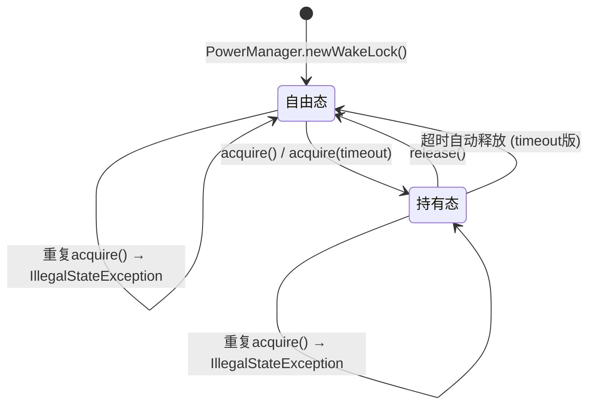
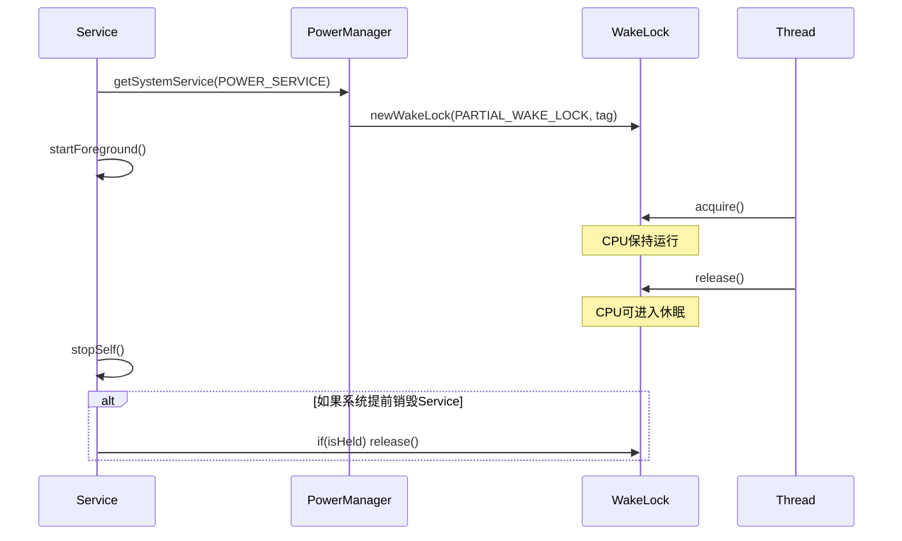

# 6.1.21 设置唤醒锁

凌晨两点半。

充电灯的光芒把帐篷内部染成淡淡的橘黄色，四个人的影子投在帐篷壁上，随着呼吸微微晃动。洛芙抱着手机，靠在睡袋上，脸色有些发白。

"只剩百分之三了……"

她的声音小得像蚊子哼。屏幕上，"露营天气通"的App正卡在启动画面——后台有个下载任务还没跑完，手机就自作主张进入了休眠。

"我就说嘛，"希尔把自己笔记本往旁边挪了挪，"你那个App里边的下载逻辑，肯定没用WakeLock。"

"什么Lock？"洛芙抬起头，眼睛还有点发涩。

黛琳正打算把白板笔盖上，听见这话又把白板翻了一面。"好，正好，"她拍了拍手上的粉笔灰，"刚才说的是怎么放手，现在来说怎么牵手。"

伊莎轻轻笑了一声，把自己那杯已经凉了的可可往边上推了推。

"WakeLock，"黛琳拿起橙色白板笔，在白板最上方写下这个词，"翻译过来叫'唤醒锁'。我们昨天讲的是怎么把它松开——今天来讲怎么把它系上。"

"等等，"洛芙突然精神了一点，"昨天那个白板上的图，是说它有两种状态吗？"

黛琳点点头，在白板上画了简简单单两根竖线，中间夹着两个字：

```
  ┌─────────┐      acquire()       ┌──────────┐
  │  自由态  │ ────────────────→  │  持有态   │
  └─────────┘  ←───────────────  └──────────┘
               release()
```

"对，"黛琳用笔尖点了点左边的框，"没有持有WakeLock的时候，CPU可以随时休眠。这是系统的默认状态，省电，但是后台任务没法跑。"

"那右边就是持有状态？"洛芙歪着脑袋看图。

"持有状态，就是告诉系统：'先别睡，这段代码正在干活呢。'"黛琳把笔放下，"昨天我们已经看到了 release() 的用法，今天的重点是 acquire()——怎么拿到这把锁。"

帐篷外忽然传来一阵风声，帐篷帘子轻轻抖了一下。远处的白马岳在月光下像一块沉默的银灰色三角蛋糕。

"先有钥匙，才能开门，"伊莎托着腮帮子说，"这个道理在露营和代码里都一样。"

## 获得钥匙：WAKE_LOCK 权限

"在Android里，想要持有WakeLock，第一件事——"黛琳把手机举起来，"要在Manifest里声明权限。就像露营前要先买门票。"

"门票？"洛芙眨眨眼。

"WAKE_LOCK，"黛琳在白板上写下那串长长的字母，"这是一个运行时权限——不对，错了，这是一个'普通'权限。只要在Manifest里声明就好，系统会自动批准。"

希尔凑过来看了一眼："不需要用户在设置里手动点允许？"

"不需要。"黛琳摇头，"这个权限只是告诉系统'我有资格持有WakeLock'，不涉及用户的隐私数据。所以系统直接给，不需要用户点头。"

她在白板上写下：

```xml
<uses-permission android:name="android.permission.WAKE_LOCK" />
```

"放在 `<manifest>` 标签下面就行。"黛琳说，"就这么一行。"

"那要是忘了写呢？"洛芙问。

"App会崩，"希尔抢答，"SecurityException。系统说'你没有这个权限，不能开门'。"

黛琳点点头："希尔说得对。Android的安全模型很严格，没有声明就使用，会直接抛异常。"

"比露营村严格的，"伊莎捂着嘴笑了，"人家露营村顶多不让你进，Android是直接把你轰出去。"

洛芙在本子上认真地记下这行字，然后在旁边画了一个大大的叉，旁边写着："必须写！"

## 打造钥匙：PowerManager.newWakeLock()

"有了门票，下一步是打造钥匙，"黛琳拿起橙色笔，"在代码里，我们需要一个PowerManager实例来创建WakeLock。"

"PowerManager……"洛芙念叨着这个名字，"就是电源管理员？"

"对，它就是Android系统里管电的那个家伙。"黛琳在白板上画了一个小人的形状，"你想持有WakeLock，得先问它借。"

"怎么借？"洛芙问。

黛琳把笔尖悬在白板中央：

"调用 `PowerManager.newWakeLock()` 方法。"

她在白板上写出这个方法的样子：

```kotlin
val powerManager = getSystemService(Context.POWER_SERVICE) as PowerManager

val wakeLock = powerManager.newWakeLock(
    PowerManager.PARTIAL_WAKE_LOCK,   // 第一参数：锁的类型
    "CampingApp::DownloadService"      // 第二参数：标签，用于调试
)
```

"看到了吗？"黛琳指着这段代码，"newWakeLock() 需要两个参数。"

"第一个是类型，"洛芙盯着屏幕看，"PARTIAL_WAKE_LOCK……部分唤醒锁？"

"对，这是最常用的一种。"黛琳点点头，"Android里的WakeLock有四种类型——"

她拿起笔，在白板另一侧画了一个小表格：

```
WakeLock 类型
─────────────────────────────────────────
PARTIAL_WAKE_LOCK   CPU 运行，屏幕和键盘可以休眠
SCREEN_DIM_WAKE_LOCK CPU 运行，屏幕微亮（暗淡）
SCREEN_BRIGHT_WAKE_LOCK CPU 运行，屏幕高亮
FULL_WAKE_LOCK       CPU 运行，屏幕和键盘都亮
─────────────────────────────────────────
```

"对于后台下载、后台音乐这种场景，"黛琳用笔尖敲了敲第一行，"一律用 PARTIAL_WAKE_LOCK。其他的类型都是给特定场景准备的——比如游戏需要屏幕一直亮，或者视频播放App需要屏幕保持高亮度。"

"为什么大部分时候都用 PARTIAL_WAKE_LOCK？"洛芙问。

"因为省电，"希尔插嘴，"你想啊，屏幕是耗电大户。如果你的后台任务只是下载文件，根本不需要屏幕亮着，那就只让CPU跑着就行了，别浪费电。"

伊莎把双手拢在嘴边，呵出一口白气："就像深夜的露营地里，大家都睡了，只有一个人在守夜——不需要把整个营地的大灯都打开，只要有人醒着就行。"

"伊莎的比喻总是这么美……"洛芙小声说。

"这个比喻很准确。"黛琳点头，"PARTIAL_WAKE_LOCK就是那个'守夜人'——只有它的时候，屏幕是黑的，但CPU在跑，你的下载任务在干活。"

"第二个参数是标签，"黛琳继续说，"就是一个字符串。你写 `CampingApp::DownloadService` 或者 `MyAppWakeLock`，随便你，但最好写成 `'类名::功能名'` 的格式。"

"为什么？"洛芙问。

"方便调试。"黛琳说，"Android系统会记录哪个WakeLock被谁持有。如果你在adb shell里敲 `dumpsys power` 看到一长串WakeLock列表，有标签的话，你一眼就能找到是你的哪行代码创建的。没有标签的话……"

"就抓瞎了？"洛芙说。

"差不多。"

## 打开门：acquire() 获取锁

"钥匙打造好了，下一步就是用它开门——在代码里，就是调用 acquire()。"

黛琳在白板上写下：

```kotlin
// 获取WakeLock（门打开）
wakeLock.acquire()
```

"就这么一行。"黛琳说，"调用之后，系统就知道：'哦，这个应用需要CPU继续跑，别让我进入休眠。'"

"在哪儿调用呢？"洛芙问，"onCreate 里吗？"

"看场景。"黛琳说，"如果你是在一个Service里做后台下载，一般在 `onStartCommand()` 或者 `onCreate()` 里调用 acquire()，在任务做完之后 release()。"

"但不能放在 onCreate 里就调用，然后忘了 release？"洛芙小心翼翼地问。

"非常好的问题。"黛琳看着她，眼睛里有一丝赞许，"这就是WakeLock最容易出错的地方——忘记释放。"

希尔把自己的笔记本推过来，上面写着一段有问题的代码：

```kotlin
// 错误示例：Service中没有正确释放WakeLock
class DownloadService : Service() {

    private lateinit var wakeLock: PowerManager.WakeLock

    override fun onCreate() {
        super.onCreate()
        val powerManager = getSystemService(Context.POWER_SERVICE) as PowerManager
        wakeLock = powerManager.newWakeLock(
            PowerManager.PARTIAL_WAKE_LOCK,
            "CampingApp::DownloadService"
        )
        wakeLock.acquire()  // 获取锁
    }

    override fun onDestroy() {
        // 错误：没有释放锁！
        super.onDestroy()
    }
}
```

"这段代码的问题，"希尔指着最后一行，"onDestroy 里没有 release()。如果系统因为某种原因提前杀了这个Service，WakeLock就永远不会释放。"

"然后手机就再也不会休眠了？"洛芙瞪大眼睛。

"对。电池会以肉眼可见的速度掉光。"希尔说，"用户第二天早上醒来，发现手机烫得能煎蛋。"

帐篷里的温度仿佛突然变冷了一点——当然只是洛芙的心理作用。

"那怎么改？"洛芙问。

黛琳从希尔手里接过笔，在白板上写出正确的写法：

```kotlin
// 正确示例：使用 try-finally 确保锁一定会被释放
class DownloadService : Service() {

    private lateinit var wakeLock: PowerManager.WakeLock

    override fun onCreate() {
        super.onCreate()
        val powerManager = getSystemService(Context.POWER_SERVICE) as PowerManager
        wakeLock = powerManager.newWakeLock(
            PowerManager.PARTIAL_WAKE_LOCK,
            "CampingApp::DownloadService"
        )
    }

    override fun onStartCommand(intent: Intent?, flags: Int, startId: Int): Int {
        // 在任务开始时获取锁
        wakeLock.acquire()

        // 启动下载任务...
        // 下载完成后 release()
        // 如果任务失败，也要在 finally 里 release()

        return START_STICKY
    }

    override fun onDestroy() {
        // 如果服务被销毁时锁还在持有状态，确保释放
        if (wakeLock.isHeld) {
            wakeLock.release()
        }
        super.onDestroy()
    }
}
```

"核心原则是什么？"黛琳问洛芙。

洛芙盯着代码看了好一会儿："try-finally？"

"对。"黛琳满意地笑了，"acquire() 和 release() 要配对使用。就像昨天我们说的——拿到的东西一定要还回去。最安全的写法是把 release() 放在 finally 块里，确保不管发生什么，锁都会被释放。"

"isHeld() 是？"洛芙指着那段代码。

"检查锁的状态。"黛琳说，"调用 isHeld() 会返回一个布尔值——true 表示锁被持有，false 表示没有被持有。"

"在 onDestroy 里检查一下再释放，是好习惯吗？"洛芙问。

"是的，"黛琳点头，"因为如果你的代码逻辑正确，acquire() 和 release() 本应是完美配对的。但有时候系统会提前销毁你的Service（比如内存紧张时），这时候在 onDestroy 里做一个额外的检查，就多了一层安全网。"

伊莎轻轻拍了拍手："就像睡前检查帐篷拉链有没有拉好——平时都拉了，但多检查一次总没错。"

## 带时限的钥匙：acquire(timeout)

"还有一种情况，"希尔从旁边插进来，"有时候你不需要锁一直拿着，可以在一定时间后自动释放。"

"自动释放？"洛芙眼睛一亮。

"对，"希尔在自己的笔记本上翻到一页，"acquire() 有一个重载版本，可以传一个毫秒数的参数——"

```kotlin
// 获取锁，但10秒后自动释放（防止死锁）
wakeLock.acquire(10_000L)  // 10000毫秒 = 10秒
```

"这样写的话，"希尔比划着，"系统会在10秒后自动调用 release()，即使你的代码还没执行完。"

"为什么要这样做？"洛芙问。

"防止死锁。"希尔说，"假设你的代码逻辑有个bug，下载任务卡住了，永远不会调用 release()。如果没有 timeout，锁就会永远持有。但有了 timeout，系统就帮你在10秒后强行把锁解开。"

"就像露营时的定时灯，"伊莎说，"亮一段时间之后自动熄灭，不需要人守着。"

"不过，"黛琳补充道，"timeout参数是一个'保险'，不是让你依赖它的借口。正常的代码应该自己管理 release()，timeout只是最后的安全网。"

"那这两个acquire版本，可以同时用吗？"洛芙问。

"不行，"黛琳摇头，"一个WakeLock实例，只能处于'被获取'或'未被获取'两种状态。如果你在已经持有的状态下再调用 acquire()——"

"会怎样？"洛芙问。

"会抛异常。"希尔说，"IllegalStateException。系统说'这个锁已经在你手里了，你不能重复拿'。"

黛琳点点头："所以在获取锁之前，最好先检查一下状态——"

```kotlin
// 先检查锁是否已经被持有
if (!wakeLock.isHeld) {
    wakeLock.acquire()
}
```

"那 release() 呢？"洛芙问，"重复释放会怎样？"

"也会抛异常。"黛琳说，"所以 release() 也最好做检查——"

```kotlin
if (wakeLock.isHeld) {
    wakeLock.release()
}
```

"或者，"希尔举起手，"用 kotlin 的一个内置语法糖——"

```kotlin
wakeLock.release且不抛异常（即使锁未被持有）
// 实际上 Kotlin 的 release() 对重复释放是宽容的
// 但为了代码健壮性，建议还是配合 isHeld 检查
```

"不对，"黛琳笑着摇头，"Kotlin的release() 重复调用也会抛异常。希尔你记混了。"

"啊，"希尔吐了吐舌头，"好吧，那就还是老实检查 isHeld。"

洛芙赶紧在自己的本子上记下这一条："release前也要检查！"

## 露营场景：让洛芙的App正确获取WakeLock

"好了，理论讲完了，"黛琳把白板笔放下，"现在让希尔来帮洛芙把她的App改正确。"

希尔把自己的笔记本转过来，让洛芙能看清屏幕：

"洛芙，你那个下载逻辑在哪个类里？"

"DownloadTask，"洛芙凑过去看屏幕，"在一个单独的线程里跑。"

"WakeLock 放在哪儿有讲究，"希尔说，"最好放在持有它的那个对象的生命周期里——也就是说，如果你是从Activity启动的下载，放在Activity里；如果是Service，就放在Service里。"

"我是从WorkManager的Worker里调用的，"洛芙说，"WorkManager不是会自动处理后台任务吗？"

"好问题！"希尔眼睛亮了，"WorkManager有它自己的WakeLock管理——它会在任务执行期间自动持有WakeLock，确保CPU不会休眠。但是，如果你自己在Worker里又手动创建了一个WakeLock，那就重复了。"

"所以在WorkManager里不需要WakeLock？"洛芙问。

"大部分情况下不需要，"黛琳回答，"但有一种情况例外——你的Worker里启动了一个子线程去做某件事，而这个子线程的执行时间可能超过WorkManager的预期。那时候，你可能需要额外考虑。"

"今天先不讨论这个，"希尔摆摆手，"洛芙你先看看你的代码，Worker里有没有手动创建WakeLock？"

洛芙翻了翻代码："没有。"

"那你的问题应该是别的原因，"希尔说，"可能是你的Worker执行太快，手机自动进入休眠了。让我看看你的Worker代码。"

洛芙把自己的代码共享到帐篷内的局域网里，希尔接收到之后快速浏览了一遍。

"找到了，"希尔说，"你的 doWork() 里启动了一个线程，但是线程是异步的——doWork() 在线程启动之后立刻返回了。WorkManager以为任务完成了，就释放了它的WakeLock，结果你的线程还没下载完，手机就休眠了。"

"那怎么办？"洛芙问。

"两种方案，"希尔竖起两根手指，"第一种，把下载逻辑直接写在 doWork() 的主线程里，不用子线程——但这样下载慢的话会卡住Worker，违背了WorkManager的设计初衷。"

"第二种？"

"在 doWork() 里使用 CountDownLatch 或者 suspendCoroutine 来等待子线程完成，这样 doWork() 就会一直等到下载真正结束才返回。"希尔说，"但这样就没有真正利用到后台并发的优势。"

"等等，"黛琳插话，"其实还有第三种——既然你用了子线程，那就不应该用Worker来处理这个任务。子线程+Worker是多余的，直接用Thread加WakeLock就够了。"

"或者，"伊莎温柔地补充，"直接用Foreground Service。它有系统级的WakeLock保护，而且用户可以看到通知，知道App在干什么。"

洛芙陷入了沉思。帐篷外又一阵风吹过，把远处的松树吹得沙沙响。

"我想用Foreground Service，"洛芙终于开口，"因为下载的时候，我想给用户一个进度通知。"

"聪明的选择。"黛琳点点头，"那我们接下来把WakeLock的知识用到Foreground Service里，顺便帮洛芙把整个流程走一遍。"

希尔已经在键盘上噼里啪啦敲起来了：

```kotlin
// 正确获取WakeLock的Foreground Service示例
class DownloadForegroundService : Service() {

    private var wakeLock: PowerManager.WakeLock? = null

    override fun onCreate() {
        super.onCreate()
        // 获取PowerManager
        val powerManager = getSystemService(Context.POWER_SERVICE) as PowerManager
        // 创建WakeLock，使用PARTIAL_WAKE_LOCK确保只有CPU运行
        wakeLock = powerManager.newWakeLock(
            PowerManager.PARTIAL_WAKE_LOCK,
            "CampingApp::DownloadForegroundService"
        )
    }

    override fun onStartCommand(intent: Intent?, flags: Int, startId: Int): Int {
        // 构建前台通知
        val notification = NotificationCompat.Builder(this, "download_channel")
            .setContentTitle("正在下载露营数据")
            .setContentText("下载中...")
            .setSmallIcon(R.drawable.ic_download)
            .setOngoing(true)
            .build()

        // 启动为前台服务
        startForeground(NOTIFICATION_ID, notification)

        // 启动下载线程
        Thread {
            // 在子线程开始前获取WakeLock
            // 使用try-finally确保即使异常也会释放
            try {
                wakeLock?.acquire()
                doDownload()
            } finally {
                wakeLock?.let {
                    if (it.isHeld) {
                        it.release()
                    }
                }
            }

            // 下载完成后停止服务
            stopSelf()
        }.start()

        // START_STICKY：系统杀了服务后会重新创建
        return START_STICKY
    }

    override fun onDestroy() {
        // 服务销毁时也要确保释放锁
        wakeLock?.let {
            if (it.isHeld) {
                it.release()
            }
        }
        super.onDestroy()
    }

    private fun doDownload() {
        // 下载逻辑...
        // 模拟下载过程
        for (i in 1..100) {
            Thread.sleep(200)
            // 更新通知进度
        }
    }

    companion object {
        private const val NOTIFICATION_ID = 1001
    }
}
```

"看到了吗？"希尔指着屏幕，"wakeLock 在 onCreate 里创建，但 acquire() 在子线程开始时才调用——这样可以尽早创建锁对象，但延迟获取。"

"为什么不在 onCreate 里直接 acquire？"洛芙问。

"因为 onCreate 的时候还不知道要不要干活，"黛琳回答，"下载任务是后来才触发的，所以 acquire() 要放在真正需要的时候——也就是 onStartCommand 里，子线程启动之前。"

"最后在 finally 里 release，"洛芙接上，"这样不管下载成功还是失败，锁都会释放。"

"没错！"希尔竖起大拇指。

"还有，"黛琳补充，"onDestroy 里也要做一层保护——因为系统可能在你没预期到的时候销毁Service（比如内存不足）。这一层检查虽然很少会被触发，但一旦触发了，就是救命稻草。"

洛芙把这段代码认认真真地看了三遍，然后在自己的笔记本上画了一个小流程图：

```
onCreate(): 创建 WakeLock 对象（但不要 acquire）
    ↓
onStartCommand(): startForeground()
    ↓
Thread.start(): 在子线程中 acquire()
    ↓
doDownload(): 执行下载任务
    ↓
finally: release()
    ↓
stopSelf(): 停止服务
```

"这个图很清晰，"伊莎探头看了一眼，"洛芙进步好快。"

洛芙有点不好意思地笑了："因为这次是真的踩过坑了嘛……印象深刻。"

## WakeLock 的生命周期：与组件绑定的锁

"讲到这里，还有一个重要的概念要说清楚。"黛琳重新拿起白板笔。

"什么概念？"洛芙问。

"WakeLock 的持有状态，会和创建它的组件绑定。"

黛琳在白板上画了一个简单的图：

```
Activity/Service 生命周期
─────────────────────────────────────────
onCreate()      创建 WakeLock 对象
     ↓
onStart()       可选：acquire()，但通常在需要时再获取
     ↓
onResume()      开始执行任务，获取锁
     ↓
...任务执行中，锁被持有...
     ↓
onPause()       可选：release()
onStop()        应该已经 release() 了
onDestroy()     最终检查：确保已 release()
─────────────────────────────────────────
```

"这个图的意思是，"黛琳解释道，"WakeLock 的获取和释放，应该和你的组件的生命周期配合。比如Activity界面可见的时候你可以获取锁做某些事，界面不可见的时候就应该释放。"

"但是，"希尔补充道，"对于后台下载这种Service，不管界面在不在都要跑，那就应该用上面的Service方案——在Service里管理WakeLock，不和Activity的生命周期绑定。"

"所以……Activity持有WakeLock和Service持有WakeLock，是两种不同的场景？"洛芙问。

"对，"黛琳点头，"Activity的WakeLock一般用于一些短暂的、界面相关的任务——比如录音的时候保持屏幕不暗。Service的WakeLock用于长期的后台任务。"

"还有，"伊莎说，"如果你在Activity里获取了WakeLock，然后按了Home键——Activity进入后台，但锁还持有。这时候屏幕会变暗或者熄灭（因为系统要省电），但CPU还在跑。"

"所以WakeLock持有期间，屏幕的变化取决于锁的类型？"洛芙问。

"PARTIAL_WAKE_LOCK下，屏幕可以正常熄灭，"黛琳说，"但如果你用的是SCREEN_DIM_WAKE_LOCK或者SCREEN_BRIGHT_WAKE_LOCK，屏幕会保持亮。"

"所以露营的时候，如果我只是想让手机屏幕一直亮着方便看信息，用SCREEN_BRIGHT_WAKE_LOCK？"洛芙试探着问。

"如果只是看信息，用 PARTIAL_WAKE_LOCK 就行——省电，"黛琳说，"PARTIAL_WAKE_LOCK 只是保证CPU跑着，屏幕该暗会暗。但如果你需要屏幕一直显示内容（比如导航App），那就需要 SCREEN_*_WAKE_LOCK。"

"明白了，"洛芙点点头，"不同的需求用不同的锁类型，不能一概而论。"

帐篷外的风渐渐小了。洛芙看了一眼手机——不知道什么时候，手机已经充到了百分之二十。充电灯的光芒依然温暖，把四个人的影子投在帐篷壁上，像一幅安静的剪影画。

"好了，"黛琳把白板笔盖上，"今天的内容差不多就是这些。总结一下："

她竖起手指，一条一条地数：

"第一，Manifest里要声明 WAKE_LOCK 权限。"

"第二，用 PowerManager.newWakeLock() 创建锁，类型选 PARTIAL_WAKE_LOCK（大多数情况下）。"

"第三，acquire() 获取锁，release() 释放锁，一定要配对。"

"第四，用 try-finally 确保即使异常也会释放。"

"第五，可以用 acquire(timeout) 作为安全网。"

"第六，重复 acquire 或 release 会抛异常，最好先用 isHeld() 检查。"

"第七，WakeLock的生命周期要和组件配合好。"

洛芙把这些要点一条一条记在本子上，每一条后面还画了一个小圈圈，表示已经理解。

"那……今天的动手练习，"洛芙抬起头，"是要做什么？"

"很简单，"希尔咧嘴一笑，"把你的DownloadTask改成正确的WakeLock使用方式。下次露营的时候，你的App可不能再把手机电池吃光了。"

"我们明天还要去白马岳呢，"伊莎打了个哈欠，"手机没电的话，可没法拍照留念。"

洛芙笑了起来，把本子合上，塞进枕头底下。

充电灯的光芒慢慢变暗了——希尔把它的亮度调到了最低。帐篷里只剩下月光透过帐篷壁渗进来的那一层淡淡的银色。

四个人的呼吸渐渐变得平稳。

白马岳在夜色中沉默地矗立着，山顶上已经有了一层薄薄的雪——秋天的尾声，冬天快要来了。

---

## 专业技术总结

> **WakeLock** — Android提供的保持CPU唤醒的机制，允许应用在屏幕关闭时继续执行后台任务。通过PowerManager.newWakeLock()创建，需在Manifest声明WAKE_LOCK权限。acquire()/release()必须配对调用，建议使用try-finally确保释放。

#### 结构图

**WakeLock 状态机**



**WakeLock 在 Service 中的生命周期管理**



#### 复杂度与影响

| 维度 | 说明 |
|------|------|
| 内存 | 每个WakeLock对象占用少量内存，但持有期间阻止系统休眠会导致额外CPU/电池消耗 |
| 电池 | PARTIAL_WAKE_LOCK对电池影响较小；SCREEN_*_WAKE_LOCK会导致屏幕持续耗电 |
| 生命周期 | WakeLock持有期间绑定组件/线程，组件销毁时未释放会导致电池泄漏 |

#### 反模式与陷阱

1. **忘记声明WAKE_LOCK权限** → SecurityException；修复：在AndroidManifest.xml添加`<uses-permission android:name="android.permission.WAKE_LOCK" />`

2. **acquire()后不release()** → 电池泄漏，手机永不休眠；修复：使用try-finally确保配对释放

3. **重复acquire()** → IllegalStateException；修复：先检查`if (!wakeLock.isHeld) { wakeLock.acquire() }`

4. **Service onDestroy中未释放锁** → 系统内存回收Service时锁仍持有；修复：在onDestroy中检查并释放：`if (wakeLock.isHeld) wakeLock.release()`

5. **在WorkManager的Worker中重复创建WakeLock** → WorkManager已自带WakeLock管理；修复：除非有特殊需求，否则不要在Worker中手动创建WakeLock

6. **用WakeLock替代Service做长期后台任务** → 错误场景；修复：使用Foreground Service配合WakeLock，Foreground Service提供系统级保护

#### 名词小传

**PowerManager** — Android系统级服务，负责管理系统电源策略（屏幕亮度、CPU频率、休眠策略等）。应用通过`Context.getSystemService(Context.POWER_SERVICE)`获取其实例。PowerManager是Android Framework的核心组件，不属于任何具体应用。

**WakeLock** — Android提供的CPU唤醒锁机制。最早在Android 1.0就存在，是Android早期后台任务处理的基础。其设计理念是：让应用可以主动请求系统不要进入休眠状态，以完成重要任务。

#### 设计哲学

**最小化持有原则** — WakeLock持有的时间越长，手机越耗电。设计时应做到：只在必须执行任务时获取锁，任务完成后立即释放。持有时间过长是反模式。

**权限声明即承诺** — 声明WAKE_LOCK权限意味着应用承诺会负责任地管理唤醒锁。Android系统信任声明此权限的应用会自动释放锁，因此未释放的WakeLock会导致严重的电池问题。

**类型选择原则** — PARTIAL_WAKE_LOCK是默认首选，因为它只保证CPU运行，不影响屏幕。除非确实需要屏幕保持亮起，否则不应使用SCREEN_*_WAKE_LOCK类型。

**与组件生命周期绑定** — WakeLock的获取和释放应与组件（Activity/Service）的生命周期协调。在组件可见/活跃期间持有，不可见时释放。

---

#### 🏕️ 动手练习

**目标**：实现一个带WakeLock保护的后台下载Service，模拟真实的露营数据同步场景。

**项目概览**：构建"CampingDataSyncService"，在后台下载露营营地的天气信息和营位预约数据，使用WakeLock确保下载完成前CPU不会休眠。

**Task 1：创建项目与声明权限**
- 目标：了解WakeLock权限的声明方式
- 步骤：
  1. 创建Android项目（最低API 21）
  2. 在AndroidManifest.xml的`<manifest>`标签内声明`<uses-permission android:name="android.permission.WAKE_LOCK" />`
  3. 创建一个基础`Service`类框架（空实现）
- 验收标准：
  - [ ] Manifest中正确添加了WAKE_LOCK权限
  - [ ] Service类存在且继承自Service
  - [ ] 能正常启动Service（通过startService或adb shell am startservice）
- 提示：`AndroidManifest.xml`位置在`app/src/main/`目录下

**Task 2：实现WakeLock的创建与获取**
- 目标：掌握PowerManager.newWakeLock()的使用
- 步骤：
  1. 在Service的onCreate()中获取PowerManager
  2. 创建PARTIAL_WAKE_LOCK类型的WakeLock，标签设为`"CampingApp::DataSyncService"`
  3. 在Service的onStartCommand()中调用wakeLock.acquire()
- 验收标准：
  - [ ] PowerManager通过getSystemService(Context.POWER_SERVICE)获取
  - [ ] newWakeLock()使用PARTIAL_WAKE_LOCK类型
  - [ ] acquire()在子线程启动前被调用
- 提示：
```kotlin
val powerManager = getSystemService(Context.POWER_SERVICE) as PowerManager
wakeLock = powerManager.newWakeLock(
    PowerManager.PARTIAL_WAKE_LOCK,
    "CampingApp::DataSyncService"
)
wakeLock.acquire()  // 在onStartCommand的线程中调用
```

**Task 3：实现带try-finally的完整释放逻辑**
- 目标：理解为何必须使用try-finally管理WakeLock释放
- 步骤：
  1. 将下载逻辑封装为doSync()方法
  2. 在Thread中调用wakeLock.acquire()后，用try包裹doSync()
  3. 在finally块中调用wakeLock.release()
- 验收标准：
  - [ ] 下载任务在try块中执行
  - [ ] finally块中调用release()
  - [ ] 即使下载抛出异常，锁也会被释放
- 提示：finally块代码参考
```kotlin
try {
    wakeLock?.acquire()
    doSync()
} finally {
    wakeLock?.let {
        if (it.isHeld) it.release()
    }
}
```

**Task 4：实现前台通知**
- 目标：了解Foreground Service的必要性
- 步骤：
  1. 创建NotificationChannel（id: "sync_channel", name: "数据同步"）
  2. 在onStartCommand中调用startForeground(NOTIFICATION_ID, notification)
  3. 构建一个显示"正在同步露营数据"的持续性通知
- 验收标准：
  - [ ] NotificationChannel正确创建
  - [ ] startForeground()被调用，传入有效的Notification
  - [ ] 通知显示在通知栏且持续存在
- 提示：NOTIFICATION_ID建议使用整数值如1001

**Task 5：实现onDestroy中的安全释放**
- 目标：理解Service销毁时的WakeLock管理
- 步骤：
  1. 重写onDestroy()方法
  2. 在super.onDestroy()之前检查wakeLock.isHeld
  3. 如果锁被持有，执行release()
- 验收标准：
  - [ ] onDestroy()中正确重写了方法逻辑
  - [ ] 使用isHeld()检查后才释放（避免重复释放抛异常）
  - [ ] 先释放锁，再调用super.onDestroy()
- 提示：
```kotlin
override fun onDestroy() {
    wakeLock?.let {
        if (it.isHeld) {
            it.release()
        }
    }
    super.onDestroy()
}
```

**Task 6：添加WakeLock超时保护**
- 目标：了解timeout参数作为安全网的作用
- 步骤：
  1. 将wakeLock.acquire()改为wakeLock.acquire(60_000L)（60秒超时）
  2. 在日志中打印超时触发的场景
- 验收标准：
  - [ ] acquire()接收timeout参数
  - [ ] 如果任务超过60秒，锁自动释放
  - [ ] 日志能显示超时释放的情况
- 提示：使用`Log.d("WakeLock", "WakeLock acquired with 60s timeout")`打印日志

**Task 7：完整整合测试**
- 目标：端到端验证WakeLock工作正常
- 步骤：
  1. 启动Service
  2. 使用adb shell命令查看WakeLock持有状态：`adb shell "dumpsys power | grep -i wake"`或查看日志
  3. 等待下载完成或超时
  4. 验证Service停止后WakeLock已释放
- 验收标准：
  - [ ] Service启动后WakeLock被持有
  - [ ] 下载完成后Service停止，WakeLock释放
  - [ ] 无内存泄漏或重复释放异常
- 提示：日志Tag使用"CampingSync"，方便过滤

**Task 8：面试热身**
- 目标：用自己的话解释WakeLock的核心概念
- 步骤：回答以下问题（不需要写代码，说清楚思路即可）
  1. WakeLock是什么？它解决什么问题？
  2. PARTIAL_WAKE_LOCK和FULL_WAKE_LOCK的区别是什么？分别适合什么场景？
  3. 为什么acquire()和release()必须配对？用try-finally有什么好处？
  4. 如果忘记在Manifest声明WAKE_LOCK权限，会发生什么？
  5. Foreground Service和WakeLock是什么关系？为什么下载任务建议用Foreground Service配合WakeLock？

---

#### 参考实现要点

1. **优先使用PARTIAL_WAKE_LOCK**：除非需要屏幕保持亮起，否则一律使用PARTIAL_WAKE_LOCK，它只保证CPU运行，对电池最友好。

2. **WakeLock的acquire()/release()必须严格配对**：推荐使用try-finally块确保释放。即使代码逻辑看似不会出错，也要加上finally保护——因为系统可能在异常情况下销毁你的组件。

3. **在Service中使用WakeLock而不是在Activity中**：后台下载等长时任务应放在Service中管理WakeLock。Activity的WakeLock适用于短暂、界面相关的任务。

4. **配合Foreground Service使用**：对于需要长时间运行的后台任务，使用Foreground Service配合WakeLock。Foreground Service提供系统级的前台通知和进程保护，WakeLock保证CPU不休眠。

5. **善用timeout作为安全网**：acquire(timeout)可以在锁持有超时时自动释放，防止因代码bug导致锁永久持有的最坏情况。但timeout是保险不是依赖，正常的release()逻辑仍然必须正确实现。

---

> 学习建议

WakeLock是Android后台任务的"守夜人"——它确保你的代码在CPU可以休眠的时候仍然继续运行。但"守夜人"不能永远醒着。记住：**每次acquire()都必须有对应的release()**，这是使用WakeLock的铁律。配合try-finally使用，让释放成为必然，让持有成为例外。理解了这个原则，就掌握了WakeLock的核心。

## 洛芙的小小日记本

今天踩了一个大坑——原来我之前的App根本没正确使用WakeLock！黛琳说得对，acquire和release必须配对，就像帐篷的拉链要拉好才能防水一样。伊莎说"守夜人不需要把大灯打开"，我记住了。以后后台任务一定要用try-finally保护WakeLock，不能让手机电池悄悄溜走！

---

## 今日关键词

**WakeLock** — Android提供的CPU唤醒锁机制，允许应用在屏幕关闭时继续执行后台任务，通过PowerManager.newWakeLock()创建。

**PowerManager** — Android系统级服务，负责管理系统电源策略（屏幕亮度、CPU频率、休眠策略等），通过Context.getSystemService()获取。

**PARTIAL_WAKE_LOCK** — WakeLock的一种类型，保证CPU运行但允许屏幕和键盘休眠，是后台任务最常用的类型。

**SCREEN_DIM_WAKE_LOCK** — WakeLock类型之一，保证CPU运行的同时保持屏幕暗淡显示，耗电介于PARTIAL和FULL之间。

**SCREEN_BRIGHT_WAKE_LOCK** — WakeLock类型之一，保证CPU运行且屏幕保持高亮度，适用于需要屏幕持续显示的应用。

**FULL_WAKE_LOCK** — WakeLock类型之一，保证CPU、屏幕和键盘都保持运行，耗电量最大。

**acquire()** — WakeLock的获取方法，调用后系统将阻止CPU进入休眠，直到调用release()释放锁。

**release()** — WakeLock的释放方法，调用后系统可以恢复正常的电源管理策略。必须与acquire()配对使用。

**isHeld()** — WakeLock的状态查询方法，返回true表示锁被当前实例持有，false表示未持有。

**WAKE_LOCK权限** — 在Manifest中声明的权限，允许应用持有WakeLock。声明方式：`<uses-permission android:name="android.permission.WAKE_LOCK" />`。

**WakeLock标签** — 创建WakeLock时传入的字符串参数，用于在系统日志中标识WakeLock的来源，便于调试。推荐格式：`"类名::功能名"`。

**Foreground Service** — Android的前台服务类型，会在通知栏显示持续性通知，向用户表明应用正在后台执行重要任务。配合WakeLock可实现可靠的后台任务执行。

**IllegalStateException** — 当WakeLock被重复acquire()或release()时，系统会抛出此异常。因此在操作前应先用isHeld()检查状态。

**startForeground()** — 将Service设置为前台服务的方法，必须在Service启动后短时间内调用，否则系统会杀死该Service。

**try-finally** — 推荐用于管理WakeLock释放的控制结构，确保即使代码抛出异常，finally块中的release()也会被执行，保证锁一定会被释放。

**PowerManager.newWakeLock()** — 创建WakeLock实例的方法，接收两个参数：锁类型（如PARTIAL_WAKE_LOCK）和标签字符串。
